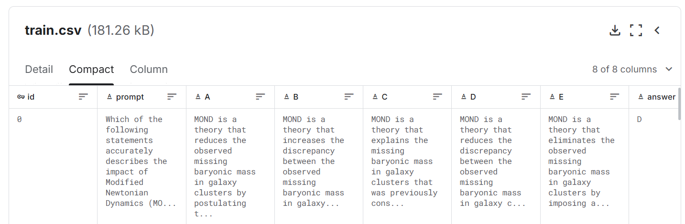
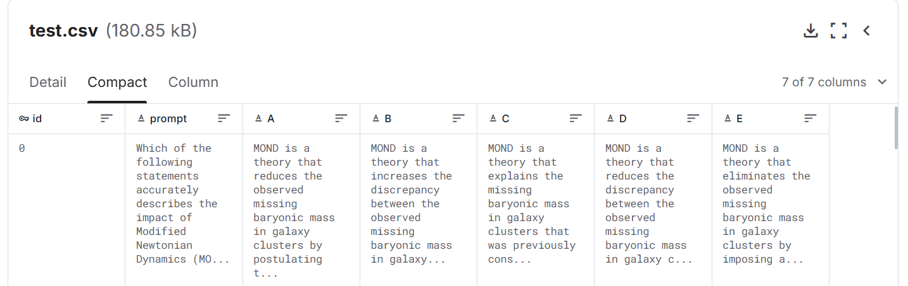
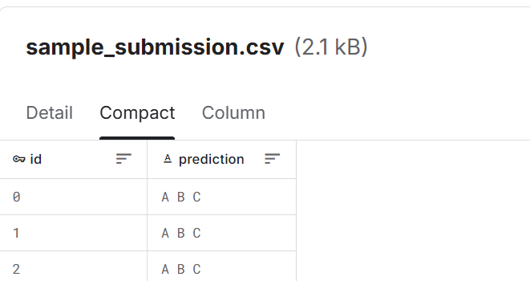
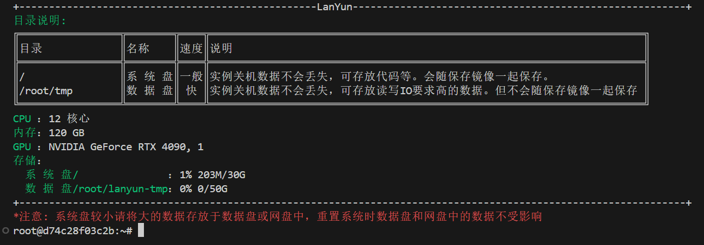

2025.1.4


简历目前有一个博弈比赛、一个中文小参数量模型、

此时再找一个kaggle比赛作为找实习的简历补充。

计划7天完成。

[kaggle小白认识](https://blog.csdn.net/j_starry/article/details/111794333)

# Kaggle - LLM Science Exam

> kaggle比赛中<font color='green'> **late submission**</font>指什么
>
> 
>
> 在Kaggle比赛中，"late submission"（迟到的提交）指的是参赛者<font color='green'>在官方规定的提交截止日期之后提交</font>的比赛结果。
>
> 这些提交不会被计入官方排名，也不会影响比赛期间的排行榜（Leaderboard），因此不能赢得奖牌或积分，甚至不能获得最终的奖项或奖励。
>
> 不过，它们<font color='green'>仍然可以作为练习和学习的机会</font>，因为参赛者可以继续提交模型并查看自己的进展，但仅限于个人参考。

## 描述

### 比赛目标

受 [OpenBookQA 数据集](https://allenai.org/data/open-book-qa)的启发，本次竞赛要求<font color='blue'>参赛者回答*由大型语言模型编写*的基于科学的难题。</font>

您的工作将帮助研究人员更好地了解 LLM 的自我测试能力，以及 LLM 可以在资源受限的环境中运行的潜力。


### 背景

随着大型语言模型能力范围的扩大，一个不断发展的研究领域是使用大型语言模型来描述自身。因为许多预先存在的自然语言处理基准已被证明对于最先进的模型来说是很容易的，所以也有一些有趣的工作表明，<font color='blue'>大型语言模型</font>可以被用来创建更具挑战性的任务，以<font color='blue'>测试更强大的模型</font>。


同时，诸如量化和知识蒸馏之类的方法正被用于有效地压缩语言模型，并在较为普通的硬件上运行它们。Kaggle 环境为研究这一点提供了一个独特的视角，因为提交的内容既要受到 GPU 的限制，又要受到时间的限制。


**本次挑战所用的数据集是通过向 <font color='red'>GPT3.5</font> 提供来自<font color='red'>维基百科</font>的一系列<font color='red'>科学主题</font>的文本片段，并要求它编写一道<font color='red'>多项选择题</font>（有已知答案），然后<font color='red'>过滤掉简单的问题</font>而生成的。**


目前我们估计在 Kaggle 上运行的最大模型大约有 100 亿个参数，而 <font color='blue'>GPT-3.5 有 1750 亿个参数</font>。如果一个问答模型能够在由比它大 10 倍以上的问题生成模型所编写的测试中表现出色，这将是一个真正有趣的结果；另一方面，如果一个更大的模型能够有效地难住一个较小的模型，这对大型语言模型自我基准测试的能力具有引人注目的影响。


### 评估指标

“提交内容根据 平均准确率（<font color='red'>MAP@3</font>）进行评估：
$$
MAP@3 = \frac{1}{U}\sum_{u=1}^{U}\sum_{k=1}^{min(n,3)}P(k)\times rel(k)
$$
其中 U 是测试集中问题的数量。

P (k) 是截断值为 k 时的精度。

n 是每个问题的预测数量，

rel (k) 是一个指示函数，如果排名为 k 的项是相关（正确）标签，则其值为 1，否则为 0。


一旦在测试集中的单个问题上某个正确标签被计分，那么这个标签对于该问题就不再被认为是相关的，并且在计算中该标签的其他预测将被跳过。

> 例如：
>
> 对于一个问题，其正确标签为A，
>
> 则
>
> [A, B, C, D, E]
> [A, A, A, A, A]
> [A, B, A, C, A]
>
> 的得分为1.0


### 提交文件格式

对于测试集中的每个 ID，你可以为你的预测最多给出三个标签。该文件应包含一个标题，并具有以下格式

id,prediction
0,A B C
1,B C A
2,C A B
etc.


## 数据集

在本次竞赛中，你的挑战是回答由大型语言模型编写的多项选择题。

虽然用于生成这些问题的具体过程未公开，但我们已经提供了 200 个带有答案的示例问题，以展示格式并让人们对测试集中的问题类型有一个大致的了解。

然而，样本问题和测试集之间可能存在分布偏移，所以能够推广到广泛问题集的解决方案可能会表现得更好。

> 每个问题都由一个题干（即问题本身）、分别标记为 A、B、C、D 和 E 的五个选项以及标记为 answer 的正确答案组成（这个 answer 包含了由生成语言模型所定义的最正确答案的标签）。


这场竞赛采用隐藏测试。当你提交的笔记本被评分时，**实际的测试数据**（包括一个示例提交）将提供给你的笔记本。测试集与提供的 test.csv 具有相同的格式，但有**大约 4000 个可能**在主题方面不同的问题。


> “train.csv” 是包含 200 个问题及答案列的集合；
>
> “test.csv” 是测试集，任务是根据提示预测最有可能的三个答案，这里看到的测试数据只是没有答案的训练数据副本，**未见过的重新运行的测试集由大约 4000 个不同的提示组成**；
>
> “sample_submission.csv” 是格式正确的示例提交文件。
>
> 如下图：
>
> 
>
> 
>
> 
>
>
> 


## 编码


### 1. BERT


encoder衍生出的BERT适用于阅读理解任务，而decoder适用于生成任务

这里首先在讨论区找到一个样例baseline学习。


> 在蓝耘上开了一个4090做本地环境，先试试
>
> 
>
> 然后远程vscode安装好python、jupyter插件即可


首先在huggingface上找到baseline的 bert-base-cased模型，

 git clone https://huggingface.co/google-bert/bert-base-case


模型下载太复杂了。

直接copy笔记本，然后运行提交。

此次得分为0.5左右。


下面是详细代码分析

```python
import pandas as pd

train_df = pd.read_csv('/kaggle/input/kaggle-llm-science-exam/train.csv')
train_df.head()
```

```python
# 将数据转换为Dataset格式
from datasets import Dataset
train_ds = Dataset.from_pandas(train_df)
```

[datasets库基本介绍](https://blog.csdn.net/weixin_54171657/article/details/141896347)

> train_ds
>
> ```
> Dataset({
>     features: ['id', 'prompt', 'A', 'B', 'C', 'D', 'E', 'answer'],
>     num_rows: 200
> })
> ```


```python
from transformers import AutoTokenizer

# 加载tokenizer
model_dir = '/kaggle/input/huggingface-bert/bert-base-cased'
tokenizer = AutoTokenizer.from_pretrained(model_dir)
```


> 将按照如下格式进行tokenize
>
> first_sentence: prompt * 5
>
> second_sentence: 对应的A 、 B、 C 、 D、 E选项
>
> label: 将ABCDE转换为01234， 标识着second_sentence中谁是正确的

```python
# We'll create a dictionary to convert option names (A, B, C, D, E) into indices and back again
options = 'ABCDE'
indices = list(range(5))

option_to_index = {option: index for option, index in zip(options, indices)}
index_to_option = {index: option for option, index in zip(options, indices)}

def preprocess(example):
    # The AutoModelForMultipleChoice class expects a set of question/answer pairs
    # so we'll copy our question 5 times before tokenizing
    first_sentence = [example['prompt']] * 5
    second_sentence = []
    for option in options:
        second_sentence.append(example[option])
    # Our tokenizer will turn our text into token IDs BERT can understand
    tokenized_example = tokenizer(first_sentence, second_sentence, truncation=False)
    #两者拼接在一起 然后通过token_type_ids为0 还是1区分
    tokenized_example['label'] = option_to_index[example['answer']]
    return tokenized_example

tokenized_train_ds = train_ds.map(preprocess, batched=False, remove_columns=['prompt', 'A', 'B', 'C', 'D', 'E', 'answer'])
#remove_columns参数允许你指定哪些原始列应该从数据集中移除。这个参数非常有用，特别是在预处理步骤之后，当你不再需要原始文本或其他原始特征，而只想要保留模型训练所需的tokenized（分词后的）输入。
```

```python
# Following datacollator (adapted from https://huggingface.co/docs/transformers/tasks/multiple_choice)
# will dynamically pad our questions at batch-time so we don't have to make every question the length
# of our longest question.
from dataclasses import dataclass
from transformers.tokenization_utils_base import PreTrainedTokenizerBase, PaddingStrategy
from typing import Optional, Union
import torch

@dataclass
class DataCollatorForMultipleChoice:
    tokenizer: PreTrainedTokenizerBase
    padding: Union[bool, str, PaddingStrategy] = True
    max_length: Optional[int] = None
    pad_to_multiple_of: Optional[int] = None
    
    def __call__(self, features):
        """
        features =  tokenized_train_ds
        """
        label_name = "label" if 'label' in features[0].keys() else 'labels'
        labels = [feature.pop(label_name) for feature in features]
        batch_size = len(features)
        num_choices = len(features[0]['input_ids']) 
        flattened_features = [
            [{k: v[i] for k, v in feature.items()} for i in range(num_choices)] for feature in features
        ]
        flattened_features = sum(flattened_features, [])
        
        batch = self.tokenizer.pad(
            flattened_features,
            padding=self.padding,
            max_length=self.max_length,
            pad_to_multiple_of=self.pad_to_multiple_of,
            return_tensors='pt',
        )
        batch = {k: v.view(batch_size, num_choices, -1) for k, v in batch.items()}
        batch['labels'] = torch.tensor(labels, dtype=torch.int64)
        return batch
```

然后加载模型

```python
# Now we'll instatiate the model that we'll finetune on our public dataset, then use to
# make prediction on the private dataset.
from transformers import AutoModelForMultipleChoice, TrainingArguments, Trainer
model = AutoModelForMultipleChoice.from_pretrained(model_dir)

```

```python
# The arguments here are selected to run quickly; feel free to play with them.
model_dir = 'finetuned_bert'
training_args = TrainingArguments(
    output_dir=model_dir,
    evaluation_strategy="epoch",
    save_strategy="epoch",
    load_best_model_at_end=True,
    learning_rate=5e-5,
    per_device_train_batch_size=4,
    per_device_eval_batch_size=4,
    num_train_epochs=3,
    weight_decay=0.01,
    report_to='none'
)
```


```python
# Generally it's a bad idea to validate on your training set, but because our training set
# for this problem is so small we're going to train on all our data.
trainer = Trainer(
    model=model,
    args=training_args,
    train_dataset=tokenized_train_ds,
    eval_dataset=tokenized_train_ds,
    tokenizer=tokenizer,
    data_collator=DataCollatorForMultipleChoice(tokenizer=tokenizer),
)

# Training should take about a minute
trainer.train()
```


> 训练完毕，接下来进行推理

```python
# Now we can actually make predictions on our questions
predictions = trainer.predict(tokenized_train_ds)

# The following function gets the indices of the highest scoring answers for each row
# and converts them back to our answer format (A, B, C, D, E)
import numpy as np
def predictions_to_map_output(predictions):
    sorted_answer_indices = np.argsort(-predictions)
    top_answer_indices = sorted_answer_indices[:,:3] # Get the first three answers in each row
    
    # 上文这样定义的
    #index_to_option = {index: option for option, index in zip(options, indices)}
    top_answers = np.vectorize(index_to_option.get)(top_answer_indices)
    return np.apply_along_axis(lambda row: ' '.join(row), 1, top_answers)
```

> > np.argsort?   按照从小达到排序后，返回其原来位置的下标索引
> >
> > ```
> > np.argsort(a, axis=-1, kind=None, order=None)
> > 
> > >>> x = np.array([3, 1, 2])
> > >>> np.argsort(x)
> > array([1, 2, 0])
> > 
> > 
> > >>> x = np.array([[0, 3], [2, 2]])
> > >>> x
> > array([[0, 3],
> >        [2, 2]])
> > 
> > >>> ind = np.argsort(x, axis=0)  # sorts along first axis (down)
> > >>> ind
> > array([[0, 1],
> >        [1, 0]])
> >        
> > >>> ind = np.argsort(x, axis=1)  # sorts along last axis (across)
> > >>> ind
> > array([[0, 1],
> >        [0, 1]])            
> > ```
>
> > np.vectorize?
> >
> > ```
> > >>> def myfunc(a, b):
> > ...     "Return a-b if a>b, otherwise return a+b"
> > ...     if a > b:
> > ...         return a - b
> > ...     else:
> > ...         return a + b
> > 
> > >>> vfunc = np.vectorize(myfunc)
> > >>> vfunc([1, 2, 3, 4], 2)
> > array([3, 4, 1, 2])
> > ```
>
> > np.apply_along_axis?
> >
> > ```
> > >>> def my_func(a):
> > ...     """Average first and last element of a 1-D array"""
> > ...     return (a[0] + a[-1]) * 0.5
> > >>> b = np.array([[1,2,3], [4,5,6], [7,8,9]])
> > >>> np.apply_along_axis(my_func, 0, b)
> > array([4., 5., 6.])
> > >>> np.apply_along_axis(my_func, 1, b)
> > array([2.,  5.,  8.])
> > ```


```python
# 应用转换函数
predictions_to_map_output(predictions.predictions)
"""
获得类似如下的输出
array(['E B D', 'A E C', 'A C E', 'A D C', 'A E B', 'A D E', 'D B E',
       'A E B', 'A D C', 'A B C', 'C E B', 'A D E', 'B C A', 'C B A',
       'E B D', 'A E C', 'C E D', 'E B A'], dtype='<U5')
"""
```


--------

最后，使用test数据集，获得提交文件

```python
# Now we can load up our test set to use our model on!
# The public test.csv isn't the real dataset (it's actually just a copy of train.csv without the answer column)
# but it has the same format as the real test set, so using it is a good way to ensure our code will work when we submit.
test_df = pd.read_csv('/kaggle/input/kaggle-llm-science-exam/test.csv')
test_df.head()
# There are more verbose/elegant ways of doing this, but if we give our test set a random `answer` column
# we can make predictions directly with our trainer.
test_df['answer'] = 'A'

# Other than that we'll preprocess it in the same way we preprocessed test.csv
test_ds = Dataset.from_pandas(test_df)
tokenized_test_ds = test_ds.map(preprocess, batched=False, remove_columns=['prompt', 'A', 'B', 'C', 'D', 'E', 'answer'])

# Here we'll generate our "real" predictions on the test set
test_predictions = trainer.predict(tokenized_test_ds)

# Now we can create our submission using the id column from test.csv
submission_df = test_df[['id']]
submission_df['prediction'] = predictions_to_map_output(test_predictions.predictions)

submission_df.head()
# Once we write our submission file we're good to submit!
submission_df.to_csv('submission.csv', index=False)
```


### 2. sentence-transformers


Sentence-Transformer 是一个 python 框架，用于句子和文本嵌入
 The initial work is described in paper [Sentence-BERT: Sentence Embeddings using Siamese BERT-Networks](https://links.jianshu.com/go?to=https%3A%2F%2Farxiv.org%2Fabs%2F1908.10084).


然后发现第一名开源了代码，这里简单运行一下，就得到了0.9的分数。

下面是代码学习

```python
from datasets import load_dataset
from tqdm.notebook import tqdm
import torch
import pandas as pd
from glob import glob
import numpy as np
import os

os.environ["TRANSFORMERS_OFFLINE"] = "1"
os.environ["TOKENIZERS_PARALLELISM"] = "false"

!pip install /kaggle/input/sci-llm-pip-v2/sentence-transformers-2.2.2.tar.gz
```

首先是文件读取

```python
from pathlib import Path

data_path = Path("/kaggle/input/kaggle-llm-science-exam")


if os.getenv("KAGGLE_IS_COMPETITION_RERUN"):
    test = pd.read_csv(data_path / "test.csv")
    CALC_SCORE = False
else:
    test = pd.read_csv(data_path / "train.csv")
    CALC_SCORE = True

test.head()
test.to_parquet("test_raw.pq")#  Write a DataFrame to the binary parquet format.
```

> ```
> >>> df = pd.DataFrame(data={'col1': [1, 2], 'col2': [3, 4]})
> >>> df.to_parquet('df.parquet.gzip',
> ...               compression='gzip')  # doctest: +SKIP
> >>> pd.read_parquet('df.parquet.gzip')  # doctest: +SKIP
>    col1  col2
> 0     1     3
> 1     2     4
> ```


然后进行数据处理


> `%%writefile get_topk.py` 
>
> 这种写法通常出现在 Jupyter Notebook 或者其他支持 IPython 魔法命令（magic commands）的环境中。IPython 魔法命令是 IPython 提供的一组特殊命令，用于快速执行某些任务，而不需要编写完整的 Python 代码或导入额外的库。
>
> 具体来说，`%%writefile` 是一个单元级别的魔法命令（cell magic），它会将该单元中的所有文本写入到指定的文件中。这里的 `get_topk.py` 是目标文件名，意味着这个命令会创建一个名为 `get_topk.py` 的 Python 文件，并将该单元格中的其余内容作为该文件的内容写入。


```python
%%writefile get_topk.py

import pandas as pd
from glob import glob
import torch
import numpy as np
from sentence_transformers import SentenceTransformer
from pathlib import Path
from joblib import Parallel, delayed
import argparse


def cos_similarity_matrix(a: torch.Tensor, b: torch.Tensor):
    """Calculates cosine similarities between tensor a and b."""

    sim_mt = torch.mm(a, b.transpose(0, 1))
    return sim_mt


def get_topk(embeddings_from, embeddings_to, topk=1000, bs=512):
    chunk = bs
    embeddings_chunks = embeddings_from.split(chunk)

    vals = []
    inds = []
    for idx in range(len(embeddings_chunks)):
        cos_sim_chunk = cos_similarity_matrix(
            embeddings_chunks[idx].to(embeddings_to.device).half(), embeddings_to
        ).float()

        cos_sim_chunk = torch.nan_to_num(cos_sim_chunk, nan=0.0)

        topk = min(topk, cos_sim_chunk.size(1))
        vals_chunk, inds_chunk = torch.topk(cos_sim_chunk, k=topk, dim=1)
        vals.append(vals_chunk[:, :].detach().cpu())
        inds.append(inds_chunk[:, :].detach().cpu())

        del vals_chunk
        del inds_chunk
        del cos_sim_chunk

    vals = torch.cat(vals).detach().cpu()
    inds = torch.cat(inds).detach().cpu()

    return inds, vals


def insert_value_at(tensor, value, position):
    # Ensure the position is valid
    if position < 0 or position >= len(tensor):
        raise ValueError("Position should be between 0 and tensor length - 1.")

    # Slice the tensor into two parts
    left = tensor[:position]
    right = tensor[position:]

    # Create a tensor for the value to be inserted
    value_tensor = torch.tensor([value], dtype=tensor.dtype)

    # Concatenate the tensors together and slice to the original length
    result = torch.cat([left, value_tensor, right])[:-1]

    return result


def insert_value_at_list(lst, value, position):
    # Ensure the position is valid
    if position < 0 or position >= len(lst):
        raise ValueError("Position should be between 0 and list length - 1.")

    # Insert value at the specified position
    lst.insert(position, value)

    # Remove the last value to maintain original length
    lst.pop()

    return lst


def remove_consecutive_duplicates(input_list):
    if not input_list:
        return [" "] * args.topk

    new_list = [input_list[0]]
    for i in range(1, len(input_list)):
        if input_list[i] != input_list[i - 1]:
            new_list.append(input_list[i])

    # Append empty strings if new_list length is less than 5
    while len(new_list) < args.topk:
        new_list.append(" ")

    return new_list


if __name__ == "__main__":

    ap = argparse.ArgumentParser()
    ap.add_argument("--wiki", type=str, required=True)
    ap.add_argument("--model_name", type=str, required=True)
    ap.add_argument("--test_file", type=str, required=True)
    ap.add_argument("--topk", type=int, required=True)
    ap.add_argument("--ind", type=int, required=True)
    args = ap.parse_args()

    if args.topk == 10:
        TOP_K = 20
    else:
        TOP_K = 10

    data_path = Path("/kaggle/input/kaggle-llm-science-exam")

    if args.wiki == "cirrus":
        files_all = sorted(list(glob("/kaggle/input/cirruswiki-titles/*.parquet")))
    elif args.wiki == "new":
        files_all = sorted(list(glob("/kaggle/input/newwiki-titles/*.parquet")))

    if "e5-large" in args.model_name:
        files_np = sorted(
            list(glob("/kaggle/input/enwiki-cirrus-20230701-e5-large-part*/*.npy"))
        )
    elif "gte-large" in args.model_name:
        files_np = sorted(
            list(glob("/kaggle/input/wiki31m-gte-large-title-p*/*.npy"))
        )

    files_all = [(x, y) for x, y in zip(files_all, files_np)]
    files = [files_all[: len(files_all) // 2], files_all[len(files_all) // 2 :]]

    if "e5-large" in args.model_name:
        model = SentenceTransformer("/kaggle/input/intfloat-e5-large-v2").to("cuda:0")
    elif "gte-large" in args.model_name:
        model = SentenceTransformer("/kaggle/input/thenlper-gte-large").to("cuda:0")

    test = pd.read_parquet("test_raw.pq")

    embs = []
    for idx, row in test.iterrows():
        if "e5" in args.model_name:
            sentences = [
                "query: "
                + row.prompt
                + " "
                + row.A
                + " "
                + row.B
                + " "
                + row.C
                + " "
                + row.D
                + " "
                + row.E
            ]
        elif "gte" in args.model_name:
            sentences = [
                row.prompt
                + " "
                + row.A
                + " "
                + row.B
                + " "
                + row.C
                + " "
                + row.D
                + " "
                + row.E
            ]

        embeddings = torch.Tensor(
            model.encode(sentences, show_progress_bar=False, normalize_embeddings=True)
        )
        embs.append(torch.nn.functional.normalize(embeddings, dim=1))

    query_embeddings = torch.Tensor(np.stack(embs)).squeeze(1)

    # Create placeholders for top-k matches
    all_vals_gpu_0 = torch.full((len(test), TOP_K), -float("inf"), dtype=torch.float16)
    all_texts_gpu_0 = [[None] * TOP_K for _ in range(len(all_vals_gpu_0))]

    all_vals_gpu_1 = torch.full((len(test), TOP_K), -float("inf"), dtype=torch.float16)
    all_texts_gpu_1 = [[None] * TOP_K for _ in range(len(all_vals_gpu_1))]

    def load_data(files, device):
        for file, file_np in files:
            df = pd.read_parquet(file, engine="pyarrow", use_threads=True)
            file_embeddings = np.load(file_np)

            data_embeddings = torch.Tensor(file_embeddings).to(device).half()
            data_embeddings = torch.nn.functional.normalize(data_embeddings, dim=1)

            max_inds, max_vals = get_topk(
                query_embeddings, data_embeddings, topk=TOP_K, bs=8
            )

            # loop through all queries (test)
            for i in range(len(test)):
                # start with highest new val (pos 0) vs worst value already in the toplist (pos topk - 1)
                for new in range(TOP_K):
                    if device == "cuda:0":
                        if max_vals[i][new].item() < all_vals_gpu_0[i][TOP_K - 1]:
                            break
                        for old in range(TOP_K):
                            if max_vals[i][new].item() > all_vals_gpu_0[i][old]:
                                all_vals_gpu_0[i] = insert_value_at(
                                    all_vals_gpu_0[i],
                                    value=max_vals[i][new].item(),
                                    position=old,
                                )
                                all_texts_gpu_0[i] = insert_value_at_list(
                                    all_texts_gpu_0[i],
                                    value=df.iloc[max_inds[i][new].item()].text,
                                    position=old,
                                )
                                break
                    else:
                        if max_vals[i][new].item() < all_vals_gpu_1[i][TOP_K - 1]:
                            break
                        for old in range(TOP_K):
                            if max_vals[i][new].item() > all_vals_gpu_1[i][old]:
                                all_vals_gpu_1[i] = insert_value_at(
                                    all_vals_gpu_1[i],
                                    value=max_vals[i][new].item(),
                                    position=old,
                                )
                                all_texts_gpu_1[i] = insert_value_at_list(
                                    all_texts_gpu_1[i],
                                    value=df.iloc[max_inds[i][new].item()].text,
                                    position=old,
                                )
                                break

    Parallel(n_jobs=2, backend="threading")(
        delayed(load_data)(files[i], f"cuda:{i}") for i in range(2)
    )
    all_vals = torch.hstack([all_vals_gpu_0, all_vals_gpu_1])
    val, inds = torch.topk(all_vals.float(), axis=1, k=TOP_K)
    all_texts = [
        [(t0 + t1)[inner_idx.item()] for inner_idx in idx]
        for t0, t1, idx in zip(all_texts_gpu_0, all_texts_gpu_1, inds)
    ]

    all_texts = [remove_consecutive_duplicates(lst) for lst in all_texts]

    test["context"] = [
        "\n###\n".join([x[i] for i in list(range(args.topk))[::-1]]) for x in all_texts
    ]

    test["context_v2"] = [
        "Context 4: "
        + x[4]
        + "\n###\n"
        + "Context 3: "
        + x[3]
        + "\n###\n"
        + "Context 2: "
        + x[2]
        + "\n###\n"
        + "Context 1: "
        + x[1]
        + "\n###\n"
        + "Context 0: "
        + x[0]
        for x in all_texts
    ]

    print(test["context"].values[0])

    test.to_parquet(f"{args.test_file}.pq", index=False)
```


