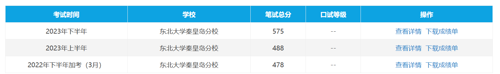

> 2025.1.15日启航

# 英语学习之路

## 前言

​	此时，我的英语学习之路的关键点有，河南高考126左右？，然后大一上（2021年下半年）四级578，之后就是2022年下半年478，2023年上半年488，2023年（大三上）下半年575。

   值得一提的是，都只是考了笔试                                             

随后，我接触到了b站up主： 脑洞部长的系列作品，如52天背完小猪佩奇， 不看字幕听懂英文剧等等。

不过两个都是只学了一些， 非常符合 半途而废的行事风格。。。

## 愿景

2025.1.5 ：

​	此时我的学习目标是， 

​	1.不看字幕听懂英文剧

​	2.简单场景可以使用英语口语表达自己的意思

> 为了 从英语角度切入 来看世界， 加油！！！

## 方法理论与资料参考

> 好方法：
> 方法一： 看图片说英语： 真实的确定英文单词与对应实物间的关联
>
> 方法二： 快速环顾四周，不加思考的说出各种物品，但是用英文！！

### 看图学英语

> 对于生活中的场景而言，比如葱姜蒜，它们都对应着具体的物品，
> 而这些实物在中文中称作 葱姜蒜， 在英文中 则是spring onion、 ginger、garlic
> 在这一环节，我的主要目的是摒弃翻译的思路，而是真实的确定英文单词与对应实物间的关联

[网页端：learning chocolate](https://link.zhihu.com/?target=https%3A//www.learningchocolate.com/)

