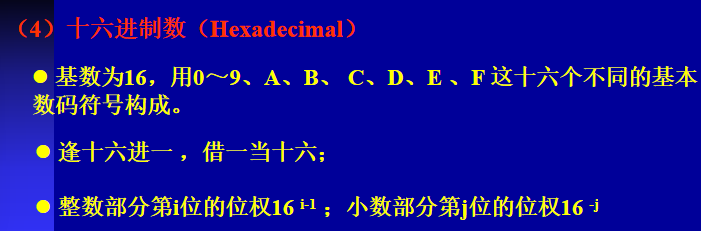
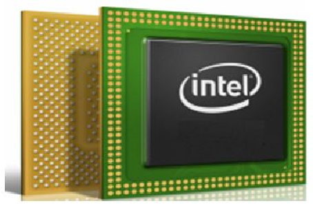
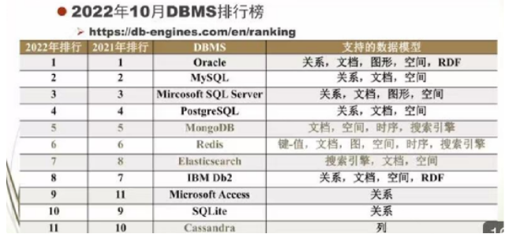
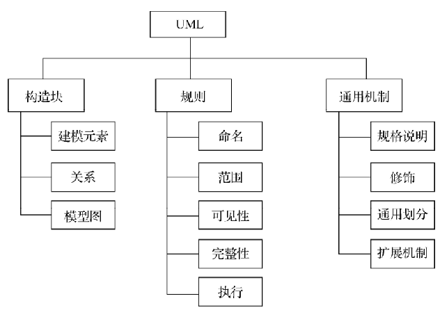

# 计算机导论

## 基础知识

### 简史

1946年第一台计算机、ENIAC、诞生，

该台计算机采用的是 冯诺依曼结构

计算机的四个发展阶段：

电子管、晶体管、中小规模集成电路、大规模超大规模集成电路计算机

摩尔定律：

摩尔定律的定义归纳起来，主要有以下三种版本：

1. *集成电路上可容纳的晶体管数目，约每隔18个月便增加一倍。*
2. 微处理器的性能每隔18个月提高一倍，或价格下降一半。
3. 相同价格所买的电脑，性能每隔18个月增加一倍。

### 计算机中的信息表示

  计算机中存储的信息分为数值信息和非数值信息，这些信息都是以二进制代码的形式存储和处理的。

#### 信息单位 

1．计算机中最小的信息量单位：bit

在计算机科学中，我们把1位二进制数码所能表示的信息量称为1bit（1比特）。它是构成信息的最小信息量单位。

2.计算机中最基本的信息量单位：Byte

8个连续的二进制位称为1个字节，即：8 bits = 1 Byte 

由于字节仍是一个很小的容量单位，为了方便标识和计算，KB、MB、GB、TB、PB等大容量单位被广泛使用。它们之间的数量转换关系如下图1-9所示。 

3. 计算机中最常用的信息量处理单位——word

从字节（Byte）演化而来，计算机进行数据处理时，一次存取、加工和传送的二进制位组，称为一个字（word）。

 CPU在单位时间内一次所能处理的二进制位组叫做字，一个字的长度称为字长。 

字长是计算机系统结构中的一个重要的性能指标，例如：32位处理器、64位处理器。

#### 数值信息

##### 数制

日常生活中，我们习惯用十进制记数，在计算机中表示和处理数据常用二进制、八进制和十六进制。

数制的3个属性：

基数、计数规则、 位权

基数：指数制中所用到的数码符号的个数。 例：2进制 0 1共两个

计数规则：指数制的进位和借位规则。 

位权：不同位置上的1的所表示的数值大小即为该位的位权。

##### 进制转换

（1）R进制转换为十进制

（2）十进制转换为R进制

​	注意区分 整数部分  和 小数部分

（3）二进制与八进制、十六进制的转换

采用“分组”法，即以小数点为界，整数部分从右往左数，小数部分从左往右开始数。

只在整数最高位前或小数最低位后面添0补位。

1位八进制 等于 3位二进制

1位十六进制  等于 4位二进制

##### 机器数

在计算机中，数的正负符号位也用二进制代码表示。规定最高位为符号位（用０表示“＋”号；１表示“－”号），其余位仍然表示数值位。

这种连同正负号一起数字化的二进制数称为机器数。

原码：符号位用“0”表示正号，用“1”表示负号 ，数值位与真值保持一致。

反码：正数的反码与原码保持一致，负数的反码将原码的数值位按位取反

补码：正数的补码与原码保持一致；负数的补码将反码最低数值位加1，符号位不变。

用补码进行计算时，可以统一加减法。

在计算机内部，数值都以补码的形式存储与计算

##### 定点数、浮点数

根据小数点位置固定与否，机器数又可以分为定点数和浮点数。

（1）定点数

定点数又可分为定点小数和定点整数。

定点小数是指小数点的位置固定在符号位与最高数据位之间

定点整数是指小数点的位置固定在最低数据位的右侧 

（2）浮点数

若数的小数点位置不固定，则称之为浮点数。浮点表示法类似于十进制的科学计数法。 

二进制所表示的浮点数的一般形式为M=±S×2±P
float  double 64

 纯小数S为数M的尾数，表示数的精度；数符Sf为尾数的符号位，表示数的正负；

指数P为数M的阶码（也称指数位），表示小数点浮动的位置（或表示数的范围大小）；阶符Pf为阶码的符号位，表示小数点浮动的方向（往左移还是往右移）。

为了浮点数表示的唯一性，并充分利用尾数的二进制位来表示更多的有效数字（提高精度），我们通常采用规格化形式表示浮点数 

eg:

（3）定点数与浮点数的比较

浮点表示法所能表示的数值范围远远大于定点表示法 

浮点运算要比定点运算复杂；

定点运算时，当运算结果超出数的表示范围时，就发生溢出***。浮点运算时，当运算结果超出尾数S的表示范围时，不一定溢出。只有当阶码P也超出所能表示的范围时，才一定发生溢出。***因此，浮点数的健壮性较定点数更好。

#### 非数值信息的表示

##### 字符编码

ASCII码

ASCII分为标准ASCII和扩展ASCII两种

标准ASCII，使用7位二进制数来表示所有的大写和小写字母，数字0~9、标点符号以及在美式英语中使用的特殊控制字符，共128个字符（27=128）。

扩展ASCII采用8位二进制数进行编码，共256个字符。前128个编码为标准ASCII码，后128个称为扩展ASCII，许多系统都支持使用扩展ASCII

>ASCII是计算机世界里最重要的标准，但它存在严重的国际化问题。ASCII只适用于美国，它并不完全适用于其他以英语为主要语言的国家，更不用说在欧洲一些国家里使用的非拉丁字母，包括希腊文、阿拉伯文、希伯来文和西里尔文等。对于东方以汉字为代表的象形文字巨大的集合更是无能为力  ISO

xxxxxxxxx
11xxxxxx   xxxxxxx

##### 汉字编码

1. 国标码

GB 2312-80

采用16位的二进制数进行编码 ，理论上最多可以表示256×256＝65536个汉字 

字符集中共收录了6763个常用汉字和682个非汉字字符（图形、符号）。 

2. 机内码

为了使计算机有效地区分英文字符和中文字符，约定将国际码中每个字节的最高位设置为1，ASCII码的最高位设置为0。我们把这种经过约定后的国际码，称为机内码。 

3. 汉字输入码

实现汉字输入时，系统所使用的字母或数字的组合称为汉字的输入码，也称汉字外码。如：五笔输入法、搜狗输入法等。

4.汉字输出码

点阵字形码

区位码

国标GB 2312-80规定，所有的国标汉字与符号组成一个94×94位的方阵，在此方阵中，每一行称为一个“区”（区号为01-94)，每一列称为一个“位”（位号为01-94)，该方阵实际组成了一共94个区，每个区内有94个位的汉字字符集，每一个汉字或符号在码表中都有一个唯一的位置编码．叫该字符的区位码。

##### Unicode码  UTF

 Unicode即统一码，又称万国码，是一种以满足跨语言、跨平台进行文本转换、处理的要求为目的设计的计算机字符编码。它为每种语言中的每个字符设定了统一并且唯一的二进制编码。

## 硬件系统

### 冯诺依曼与哈佛结构

计算机体系结构可以分为冯•诺依曼结构和哈佛结构。

#### 冯诺依曼结构

存储程序的思想。

指令 和 数据 都在存储器中，地位是等同的

0101   数值：   指令： printf

PC 寄存器  

有一个专门的指令存储器、数据存储器

五大部件:

（1）运算器

运算器是用二进制进行算术和逻辑运算的部件。它由算术逻辑单元（ALU）和若干通用寄存器组成。(ALU由组合逻辑电路组成，其功能是实现算术和逻辑等运算，是计算机的运算中心。)

（2）控制器

控制器一般由指令寄存器、指令译码器、时序电路和控制电路组成。控制器实现计算机对整个运算过程有规律的控制，是计算机的指挥中心。

它的基本功能是控制从内存中取出指令、分析指令、发出由该指令规定的一系列操作命令并完成指令。

CPU

（3）存储器

存储器用来存放计算机运行中执行的指令和参与运算的各种数据。

 存储器分为内存储器和外存储器（辅助存储器），外存储器也可以作为输入输出设备。

（4）外设 - 输入设备

输入设备用来将用户输入的原始数据（包括数字、声音、图形、图像）和程序指令转换为计算机能识别的形式（即二进制代码）存放在内存中。

常用的输入设备有键盘、鼠标、扫描仪等。

（5）外设 - 输出设备

输出设备用于将存储在内存中由计算机处理的结果（即二进制数码）转换为人们所能识别的形式。

常用的输出设备有显示器、打印机

基本工作过程

首先由输入设备输入原始数据和程序指令，由控制器控制，将这些数据和指令送入存储器。

 然后在控制器的控制下，存储器中的程序指令被逐条送入控制器中，经译码分析后将程序指令转换为相应的控制命令。

接着在控制器的控制下，运算器完成规定操作并将结果送回存储器。

最后在控制器的控制下，将结果由存储器送入输出设备进行输出

>冯·诺依曼体系结构计算机的特点
>1.冯·诺依曼计算机主要由五大部件组成，分别是：运算器、控制器、存储器、输入设备和输出设备；
>
>2.冯诺依曼体系结构的指令和数据均采用二进制码表示；
>
>3.指令和数据以同等地位存放于存储器中，均可按地址寻访；
>
>4.指令由操作码和地址码组成，操作码用来表示操作的性质，地址码用来表示操作数所在存储器中的位置；
>
>16位存储器，   001000000   00010100
>			  add 1,2
>			c++、c
>
>5.指令在存储器中按顺序存放，通常指令是按顺序执行的，特定条件下，可以根据运算结果或者设定的条件改变执行顺序；
>
>6.机器以运算器为中心，输入输出设备和存储器的数据传送通过运算器。
>
>现在的计算机基本以存储器为中心
>

#### 哈佛结构

一种将程序指令存储器和数据存储器分开的存储器结构

哈佛结构的优点是：可以同时读取指令和数据，大大提高了数据吞吐量，具有更高的执行效率，缺点是结构复杂，对外围设备的连接与处理要求高，十分不适合外围存储器的扩展。

冯·诺依曼结构简单、易实现、成本低，但效率偏低。哈佛结构效率高但复杂，因而，目前绝大部分计算机仍采用冯·诺依曼结构。

### 基本硬件介绍

注意冯诺依曼五大部分

微型计算机的硬件通常由主机和外设两部分组成

主机，是指计算机除去输入输出设备以外的主要机体部分

外设，是指连在计算机主机以外的硬件设备，主要对数据和信息起着传输、转送和存储的作用。主要包括：输入设备（如键盘、鼠标）、输出设备（如显示器、打印机）、网络设备（如路由器、交换机）等。

#### 主板

主板，又称为母板，是位于主机箱内的一块大型多层印刷电路板

主板实质上就是一个载体或平台，在上面搭载或连接CPU、硬盘、内存、显卡等设备，和机箱、电源、显示器、键盘、鼠标等构成一个完整的PC系统。计算机的整体运行速度和稳定性在很大程度上都取决于主板的性能。

#### cpu

cpu=运算器+控制器

CPU是主板上的一个重要的半导体芯片，采用超大规模集成电路工艺，其功能是执行算术和逻辑运算，并控制整个计算机自动、协调地完成各种操作

CPU的工作原理

4个阶段：提取、译码、 执行和写回

CPU首先从存储器或高速缓冲存储器中取出指令，然后将指令放入指令寄存器，并对指令译码。再将指令分解成一系列的微操作，然后发出各种控制命令，执行微操作系列，从而完成一条指令的执行。

CPU的主要性能指标

计算机的性能在很大程度上由CPU的性能决定，而CPU的性能主要体现在其运行程序的速度上。

（1）内核和核心数

内核，即CPU的核心，是CPU最重要的组成部分，CPU所有的计算、接收/存储命令、处理数据都由内核执行。

（2）字长

 CPU在同一时间能一次传输或处理的二进制代码的位数即为字长，字长直接反映了CPU的数据处理速率、计算精度和数据存取效率 

 常见的微处理器字长：8位、16位、32位、64位。目前，64位高性能处理器已在PC机中普及。

（3）主频、外频和倍频

主频，主频也叫时钟频率，单位是GHz，用来表示CPU的运算速度。

外频，**外频是CPU与主板上其他设备进行数据传输的物理工作频率，也就是系统总线的工作频率**，它代表着CPU与主板和内存等配件之间的数据传输速度，单位是MHz。

 倍频，倍频也称倍频系数，是CPU主频与外频之间的相对比例关系。在相同的外频下，倍频越高，CPU的主频也越高。

 三者间的关系为：主频=外频×倍频

（5）高速缓冲存储器（cache）

 高速缓存，是指可以进行高速数据交换的存储器，它先于内存与CPU交换数据，因此速度很快。缓存又可分为一级高速缓存L1 、二级高速缓存L2。

（6）扩展指令集

指令集是存储在CPU内部，对CPU运算进行指导和优化的硬程序。拥有这些指令集，CPU就可以更高效地运行。

#### 存储器

存储器是用来存储程序和数据的部件。在微机系统中通常采用三级层次结构来构成存储系统，主要由高速缓冲存储器、主存储器和辅助存储器组成

##### 半导体存储器

ROM和RAM

1）ROM（只读存储器）

采用非易失性器件制造，厂家在制造ROM过程中，信息（数据或程序）经特殊方式写入并永久保存。这些信息只能读出，一般不能再写入，而且即使系统停止供电，这些数据也不会丢失。

按照工作原理的不同又细分为：可编程只读存储器（PROM）、可擦除可编程只读存储器（EPROM）、电子式可擦除可编程只读存储器（EEPROM）、快闪存储器（Flash ROM）等。 

> 熔丝、光刻、浮栅晶体管

2）RAM（随机存储器）

RAM采用易失性器件制造，当机器电源关闭时，存于其中的数据就会丢失。

主板上的内存条，实际就是将多个RAM集成在一起的小块电路板，通常所说的内存容量，通常就是指内存条上RAM的容量。如图2-7所示。

 RAM按照工作方式的不同又细分为：动态随机存储器（DRAM）和静态随机存储器（SRAM）两大类。

> SRAM 由多个晶体管（通常是 6 个晶体管）组成的触发器电路来存储每一位数据
> DRAM 由一个晶体管和一个电容器组成每个存储单元

##### 主存储器

主存储器也称内存，是微机中的主要存储部件，也是CPU能够直接寻址的存储空间

内存的主要性能指标

内存容量、工作频率、工作电压

[ 1

##### 缓存

即高速缓存，其存储内容为最近曾被CPU访问过的程序或数据。由于在多数情况下，一段时间内程序的执行总是集中于程序代码的某一较小范围，因此如果将这段代码一次性从内存调入高速缓存，则可以在一段时间内满足CPU的需要，从而将CPU对内存的访问变为对高速缓存的访问，以提高CPU的访问速度和整个系统的性能。目前，微机上配置的高速缓存基本上都采用SRAM。

> 局部性原理

#### 外存储器

（1）硬盘技术及工作原理

磁盘是以“盘面—磁道—扇区”的方式来进行数据组织

 硬盘上信息的存储是以同心圆的形式排列的，每一个圆环称为一个磁道。当对磁盘进行读写时，磁头定位在磁道上，为防止或减少由于磁头未定位准确或磁域间的干扰所引起的错误，相邻磁道间有一定的间隙。 

每个盘片的磁道又进一步被分割成几十到上百个等长的圆弧，每一段圆弧称为一个扇区。相邻扇区间同样留有一定的间隙，一个扇区可以存储若干位信息，它是磁盘与主机之间交换信息的基本单位。大多数系统所定义的扇区的大小为512B～2KB 

每个存储表面的同一磁道组成一个圆柱面，称为柱面。

硬盘的主要性能指标

硬盘的容量＝磁头数（盘片数）×柱面数（磁道数）×每磁道扇区数×扇区字节数（一般为512B）

主轴转速: 主轴转速是指磁盘每分钟旋转的圈数，单位为转/每分（RPM）转速越快，读取硬盘数据的速度就越快，硬盘的整体性能也越好

平均寻道时间: 是指磁头从当前磁道移动到目标数据所在磁道的平均时间。这个时间越短，读取硬盘数据的速度就越快。 

数据传输率: 数据传输率包括内部数据传输率和外部数据传输率。内部数据传输速率，是指从硬盘到缓存的传输速度；外部数据传输速率，是指从缓存到硬盘接口的传输速度。内部传输速率更能反应硬盘的实际表现，通常以每秒MB为单位。 

 高速缓存:   高速缓存是硬盘控制器上的一块内存芯片，具有极快的存取速度。高速缓存也是硬盘非常重要的一个参数，其大小也直接影响到硬盘的整体性能。 

光盘、固态硬盘、u盘

固态硬盘（SSD）

从技术层面来看，固态硬盘本质上是闪存集成（可看做是一个大容量优盘），如图2-11所示。由于不用磁头，几乎没有寻道时间，因此其数据读写速度远高于普通硬盘，而且内部没有任何机械活动部件，不会发生机械故障，因而安全可靠，抗震性能极强。

#### IO

1. 输入设备

键盘（Keyboard）是微机必备的输入系统，用来向微机输入命令、程序和数据。

鼠标（Mouse）是微机必备的输入设备，其主要功能是对光标进行快速移动、选中图像或文字的对象、执行命令等

扫描仪（Scanner）是计算机用于输入图形和图像的专用设备，利用它可以迅速地将图形、图像、照片、文本输入到计算机中。

2．输出设备

显示器

其功能是：将主机输出的电信号通过一系列处理后转换成光信号，并最终将文字、图形显示出来，从而查看各种程序、数据、图形等信息和经过计算机处理后的结果 

 显示器的主要性能指标有：

屏幕尺寸与可视面积、像素、点间距和分辨率、对比度、亮度等

> 显示卡
>
> 显示卡是显示器与主机通信的控制电路和接口，如图2-16所示，其核心是图形处理芯片，在它周围是显示内存和BIOS芯片等。
> 

打印机

打印机的种类很多，按打印方式可分为击打式和非击打式两类，按打印机工作原理则可分为针式打印机、喷墨打印机和激光打印机

#### 总线

总线是连接计算机内部各个硬件部分的公共信息通道。

总线一般有内部总线、系统总线和外部总线，如图2-13所示。内部总线是微机内部各外围芯片与处理器之间的总线，用于芯片一级的互连；而系统总线是微机中各插件板与系统板之间的总线，用于插件板一级的互连；外部总线则是微机和外部设备之间的总线。

常用的总线： PCI总线

## 软件系统

 	软件是指在硬件系统上运行的各种程序及相关资料。不仅包括可以在计算机上运行的程序，而且还包括与程序相关的文档，它是程序加文档的集合体

​	计算机的软件包括系统软件和应用软件两大类。

​	系统软件包括操作系统、语言处理程序、数据库管理系统和作为软件研究开发工具的编译程序、调试程序、装配程序和连接程序、测试程序等，其中操作系统是最重要的系统软件（核心）。系统软件，主要负责管理计算机系统中各种独立的硬件，使它们之间可以协调工作。

​	应用软件，是指用户自己开发或外购的能满足各种特定用途的应用软件包 

​	系统软件一般不针对某一特定应用领域，而不同的应用软件则根据用户和应用领域提供不同的功能。

### OS

操作系统，是直接运行在裸机上的最基本的系统软件，是系统软件的核心，任何其他软件必须在操作系统支持下运行。 

操作系统是对硬件功能的首次扩充，是裸机上的第一层软件。没有操作系统，计算机硬件就不能充分发挥作用，用户也不能随心所欲地操作计算机系统。如下图所示。

操作系统是用户与计算机硬件的接口 ，用户是通过操作系统或者说是通过操作系统提供的各种相关命令来使用计算机的。

操作系统的基本特征：并发性、共享、虚拟、异步（不确定性）

1. 并发：

“并行性”是指两个或多个事件在同一时刻发生（强调一个时间点）

而“并发性”是指两个或两个以上的事件或活动在同一时间间隔内发生（强调一个时间段）。
在多道程序环境下，并发性是指在一段时间内，宏观上有多个程序在同时运行，但实际上在单CPU的运行环境中，每一个时刻仅有一个程序执行。因此，微观上各个程序是交替、轮流执行的。 

2. 共享

   操作系统中的资源可被多个并发执行的进程共同使用，而不是被一个进程所独占，资源的共享可以分成同时共享和互斥共享两种方式。 同时共享是指允许在一时间内由多个进程同时对某一资源进行访问；互斥共享是指当一个进程使用完某资源并释放后，才允许另一进程对该资源访问。

3. 虚拟

   是指操作系统中的一种管理技术，它是把物理上的一个实体变成逻辑上的多个对应物，或把物理上的多个实体变成逻辑上的一个对应物的技术。

4. 异步
   统中的进程何时执行，何时暂停，以什么样的速度向前推进，进程总共要化多少时间执行才能完成，这些都是不可预知的。进程以这种不确定的方式运行，其导致的直接后果就是程序执行结果可能不唯一。 

操作系统大致由处理机管理模块、存储管理模块、设备管理模块、文件管理模块、作业管理模块五个功能模块组成。

> 站在用户与硬件之间，以接口的角度理解operating system的问题

> - **作业管理** 操作的对象是**作业**，即用户提交的一个完整的工作单元。作业可以包含多个进程或线程，但它是一个更高层次的概念，代表了用户请求的整个任务。
> - **处理机管理** 操作的对象是**进程**，即操作系统中的一个执行单元。进程是操作系统调度的基本单位，每个进程都有自己的内存空间、寄存器状态等。处理机管理只关心如何将 CPU 分配给这些进程

1. 处理机管理的主要工作包括处理机中断事件和处理机调度，其目的是最大限度的提高处理机的使用效率，发挥其作用。

2. 存储管理主要是针对计算机系统的重要资源——主存储器的管理，也就是内存进行管理

   存储管理的主要任务是：对多道程序分配存储空间，并为其运行提供良好的环境，提高内存利用率并方便用户使用。

3. 操作系统中负责管理和存储文件信息的软件机构称为文件管理系统，简称文件系统。

 文件系统的主要任务包括：存储文件的外存空间的组织和管理、文件目录的管理、文件的读写管理以及文件的共享和保护

4. 设备管理的主要任务是为系统中的进程分配设备，完成进程对I/O的请求，并提高设备的利用率

### 语言处理程序

自底向上，机器语言、汇编语言、高级语言

1. 机器语言（Machine Language）：

机器语言，是指直接用二进制代码表达机器指令的计算机语言，它是计算机唯一可以识别和直接执行的语言。

 机器语言是一种面向机器的语言，占用内存小、执行速度快。但是每条指令都是“0”或“1”的代码串，难以记忆，难以阅读，检查和调试都比较困难，因此通常不用机器语言直接编写程序。 

2. 汇编语言（Assembly Language）

汇编语言，使用助记符来表示机器指令，即将机器语言符号化，因此也称汇编语言为符号语言。 

汇编语言的指令可分为硬指令、伪指令和宏指令三类。

用汇编语言编写的程序称为汇编语言源程序，机器无法执行，必须把它翻译成机器语言目标程序，机器才能执行

与机器语言相比，汇编语言在编写、阅读、记忆、调试等方面有了很大的进步，但由于汇编语言与机器指令具有一一对应的关系，实际上是机器语言的一种符号化表示，而且汇编语言的通用性较差，通常与计算机硬件结构密切相关，因此仍然难学难记。

3. 高级语言

高级语言是用数学语言和接近于自然语言的语句来编写程序，更易于为人们掌握和编写，因此具有良好的可移植性和通用性。 

用高级语言编写的程序不能直接被计算机识别，需要通过一些编译程序或解释程序将其翻译成机器语言目标程序才能被执行

### DBMS

数据库管理系统（DBMS），其功能是：管理数据库，一般具有建立、编辑、修改、增删数据库内容等对数据的维护功能；对数据的检索、排序、统计等使用数据库的功能；友好的交互式输入/输出能力；使用方便、高效的数据库编程语言；允许多用户同时访问数据库；提供数据独立性、完整性、安全性的保障。

> 从文件、到专用数据库软件
>
> 
>
> 

目前常用的数据库管理系统有Microsoft Office Access、Visual FoxPro、SQL Server、Oracle、DB2和MySQL等。

### 应用软件

根据软件的应用领域，我们将应用软件分为通用软件和专用软件两大类。

通用软件的应用范围很广，可以不分领域，不分行业大家都能应用，比如；Office、WPS等

Office办公自动化软件，是由微软开发的、现代办公室使用率非常高的一款办公处理软件，主要包括字处理软件Word，电子表格Excel，以及演示文稿制作软件PowerPoint等；WPS是金山软件公司开发的一种办公软件，功能与Office类似。 

 专用软件，是指用*在特定的某些行业或者有着特殊专业用途的软件*，并不是对绝大多数计算机使用者有用。

常用的专用软件比如有：计算机辅助设计类软件、实时控制类软件、超市支付清算系统，医院挂号系统等。

## 数据结构与算法

### 程序设计语言

程序设计语言经历了机器语言、汇编语言和高级程序设计语言3个阶段。

高级程序设计语言的几类重要代表——结构化程序设计语言、面向对象程序设计语言和人工智能程序设计语言。

1. 结构化程序设计语言
   结构化程序设计语言的典型代表有： Pascal 语言和 C 语言
   强调从程序结构和风格上研究程序设计，注重程序结构的清晰化以及程序的可理解性和可修改性。
   将整个程序划分成若干个模块
   采用自顶向下、逐步求精的设计方法和单入口、单出口的控制成分的一种程序设计技术。 

   结构化程序的3种控制结构： 顺序、分支、循环
   

2. 面向对象程序设计语言
   为了在计算机系统中更加真实自然地表示客观世界，人们提出了面向对象程序设计（OOP）
   不再将问题分解为过程，而是将问题分解为对象，对象将自己的属性和方法封装成一个整体，供程序员直接使用，对象之间的相互作用则通过消息传递来实现。

​	C++、Java、C#、Python 等语言。
​	OOP 方法最大的优点在于：通过把客观世界中的实体抽象为问题域中的对象，从而尽可能地模拟人类的思维方式，使得程序的设计过程尽可能地接近人类认识世界、解决现实问题的方法和过程

3.  人工智能是让计算机具有类似于人的智能，完成诸如判断、推理、证明、识别、学习等智能性工作。人工智能程序要求能有效地处理知识表示和逻辑推理。比较著名的人工智能程序设计语言有 ：LISP 和 Prolog语言。

### 算法

程序=数据结构+算法

算法的定义： 算法（Algorithm）是对特定问题求解步骤的一种描述，是指令的有限序列。 

算法的特性：（1）有穷性（Finiteness）

​			 一个算法必须在有穷步之后结束，即必须在有限时间内完成。实际应用中，算法的有穷性应该包括执行时间的合理性。

​		   (2)确定性（Definiteness）

​			算法的每一步必须有确切的含义，无二义性，且在任何条件下算法只有唯一一条执行路径，即对于相同的输入只能得出相同的输出。

​			(3)可行性（Effectiveness）
​			算法中的每一步都可以通过已经实现的基本运算的有限次执行得以实现。 

​			（4）输入（Input）

​			一个算法具有零个或多个输入

​			（5）输出（Output）

​			一个算法具有一个或多个输出，这些输出同输入之间存在某种特定的关系。

算法和程序的区别:

​	一个算法必须是有穷的，但一个程序不一定满足有穷性(eg： OS)

​	算法代表了对问题的解，而程序则是算法在计算机上特定的实现 

算法的评价标准：

​	1．正确性：算法的执行结果应当满足预先规定的功能和性能的要求。正确性表明算法必须满足实际需求，达到解决实际问题的目的。

​	2．可读性：一个算法应当思路清晰、层次分明、简单明了、易读易懂。可读性要求表明算法主要是人与人之间交流解题思路和进行软件设计的工具，因此可读性必须强。同时一个可读性强的算法，其程序的可维护性、可扩展性都要好许多。

​	3．健壮性：健壮性要求表明算法要全面细致地考虑所有可能出现的边界情况，并对这些边界条件做出完备的处理，尽可能使算法没有意外的情况。

​	4．高效性：有效使用存储空间和有较好的时间效率。高效性要求主要是指时间效率，即解决相同规模的问题时间尽可能短。

​	

如何描述算法、写一个算法：

1.自然语言描述

自然语言就是用人们日常使用的语言描述解决问题的方法和步骤，描述方法通俗易懂，但在语法和语义上往往具有多义性，并且比较烦琐，对程序流向等描述不明了、不直观

2.伪代码描述

伪代码是介于自然语言和计算机语言之间的文字和符号，它与一些高级编程语言（如C和 C++）类似，但是不需要真正编写程序时所要遵循的严格规则

 伪代码用一种从顶到底，易于阅读的方式表示算法。在程序开发期间，伪代码经常用于“规划”一个程序，然后再转换成某种语言程序

3. 流程图描述

 流程图使用不同的几何图形来表示不同性质的操作，使用流程线来表示算法的执行方向

流程图具有直观形象、逻辑清楚、易于理解等特点，但它占用篇幅较大，流程随意转向，规模较大的流程图不易读懂。

### 数据结构

数据，指凡是能输入到计算机并能被计算机程序所处理的符号总称

包括数值信息和非数值信息（文本、图像、视频、音频等）

数据元素： 数据集合中的每一个个体称为数据元素，它是数据的基本单位，又可称为结点或记录。同类数据元素的集合称为数据对象

数据结构：“数据结构”是指带有结构的数据元素的集合，结构反映了数据元素相互之间存在的某种逻辑联系（比如一对一的关系、一对多的关系或多对多的关系）。

数据结构主要研究数据的逻辑结构、物理结构以及数据结构上的基本数据运算

> 逻辑结构
> 数据元素之间的逻辑关系,与数据在计算机中的存储方式无关，
> 数据的逻辑结构分为线性结构、树形结构和网状结构

> 逻辑结构
> 数据的逻辑结构在计算机存储器上的实现，即数据在计算机中是如何存储的
>
> 其中顺序存储结构和链式存储结构是最常用的两种存储方式。
> 
> 

> 数据运算
>    数据的每一种逻辑结构都有相应的基本运算或操作，主要包括建立、查找、插入、删除、修改、排序等

​	数据结构系统介绍线性表、栈、队列、串、数组与广义表、树和二叉树、图等基本类型的数据结构及其相应运算的实现算法，并将讨论在程序设计中经常会遇到的查找和排序问题。

1.线性结构
1.1．线性表

一个线性表是n个数据元素的有限序列

1.2 堆栈
它是一种操作受限制的特殊线性表，它只能够在表的一端（表尾）进行插入和删除操作，该表尾称为栈顶（top）
堆栈常用的操作是进栈和出栈，遵循“先进后出”（FILO）的原则

堆栈也可分为顺序存储结构的栈（顺序栈）和链式存储结构的栈（链栈）两种

1.3 队列

 它也是一种操作受限制的特殊线性表，与栈不同的是，队列中规定只能在表的一端（表尾）进行插入操作，而在表的另一端（表头）进行删除操作

队列常用的操作是入队列和出队列，遵循“先进先出”（FIFO）的原则进行

队列的存储结构也可分为顺序存储结构的队列（顺序队列）和链式存储结构的队列（链队列）两种，实际应用中更多地是采用链式存储结构。 

2. 树型结构

基本术语
结点(node)——指树中的一个数据元素，包括数据项及若干指向其子树的分支。一般用一个字母表示。
结点的度(degree)——结点拥有的子树数
叶子(leaf)——度为0的结点，也叫终端结点。 
分枝结点——除叶子结点外的所有结点，也叫非终端结点。
孩子(child)——结点子树的根称为该结点的孩子
双亲(parents)——孩子结点的上层结点叫该结点的~
祖先结点——从根结点到该结点所经过分枝上的所有结点为该结点的祖先。
子孙结点——某一结点的子女及子女的子女都为该结点子孙。

> 不论是树还是图、深度优先遍历与广度优先遍历
> 

> 同样的 分为顺序存储和链式存储

## 数据库技术

### 概述

数据库技术是随着计算机应用的发展而产生的。其发展过程大致分为以下三个阶段： 

1. 人工管理阶段
   计算机诞生后的前10年，数据处理都是批处理，数据由应用程序自己管理，运算得到的结果也不保存。所用存储设备也只有磁带、纸带和卡片。
2. 文件系统阶段
   20世纪50年代后期，计算机开始用于信息管理。数据可以长期保存在磁盘上，由操作系统的文件系统负责数据和程序之间的接口。文件可以进行按名存取，但文件难以共享，独立性较差。
3. 数据库系统阶段
   20世纪60年代后期，计算机大规模用于信息管理，传统的文件系统的数据管理方法无法满足实际应用的需要，数据库技术应运而生。此时出现了统一管理数据的专门软件系统——数据库管理系统。  

> 数据库系统与文件系统的区别 :
> 	文件系统中，各个文件之间的数据是非结构化的，即不同文件之间的数据没有任何联系，而数据库中的数据是结构化的。 
>
> ​	文件系统是面向应用的，存在大量的冗余数据，而数据库系统是面向系统的，减少了数据冗余，实现了数据共享。
> ​	文件系统中的数据只能用文件读/写操作存取，而数据库系统中，用户可以用结构化查询语言SQL对数据库中的数据进行操作，方便且拓宽了数据库的应用范围。

> 数据库的优点
>
> 1．数据集成
> 2.数据共享： 在数据库中一个数据可以为多个不同的用户共同使用
> 3.数据冗余少
> 4.数据的一致性
> 5.实施统一标准：一个数据库系统必须由一个数据库管理的组织机构（DBA）来负责制定并实施
> 6.统一安全、保密和完整性控制：  DBA机构对数据库有完全的管辖权且负责建立对数据的加入、检索、修改、删除权限及有效性的检验过程，可以对数据库中各种数据的每一类型的操作建立不同的检验过程
> 7.数据独立： 数据独立分为数据的逻辑独立和数据的物理独立两个方面，即数据说明的修改、数据的存储结构或存取方法 的修改都无需修改现有的应用程序。 
> 8.减少应用程序开发与维护的代价
> 9.终端用户受益

数据库系统由数据库、数据库管理系统、数据库管理员、数据库应用程序和用户组成

数据库：即存放数据的仓库，它是长期储存在计算机内、有组织的、可共享的数据集合。 

数据库管理系统：指数据库系统中对数据库进行管理的软件系统。 对数据库的一切操作，包括数据定义、查询、更新以及各种控制，都是通过DBMS来进行的

### 数据模型

主要分为层次、网状、关系数据模型

层次数据模型，通常用树型结构或森林来表示实体与实体间的联系，树中的结点表示实体，实体间的联系用树中的连线表示，

网状数据模型：用记录类型为结点的网状结构来表示实体与实体间联系的模型

关系数据模型： 

关系模型是三大经典模型中最晚发展的一种，它是完全建立在数据的关系理论基础之上的

关系模型是通过满足一定条件的二维表来表示数据及其数据间的一种模型。 

关系模型相对来说是建模能力最强的一种，目前应用的绝大多数数据库管理系统都是基于关系模型的。 

> 
>
> 关系 : 即为一张二维表，一张表由若干行和列构成。 
>
> 元组 :二维表中的一行称为一个“元组”，元组又称“记录”
> 属性 :二维表中的一列称为一个“属性”，属性又称“字段”。每个表都有若干个属性列，每个属性列有其唯一的属性名称。 
> 域:  属性中数据的取值范围称为“域”，同一属性中所有数据必须属于同一数据类型。 
> 关键字 :在一张表中有这样一个或几个字段，它（们）的值可以唯一地标识一条记录，称之为关键字（Key）
>
>
> 关系模式 : 是对关系的描述，包括关系名、组成该关系的属性名。记作：
>        
>            关系名（属性名1，属性名2，……，属性名n）

关系代数

关系运算: 分为两类：传统的集合运算(交、并、差、广义笛卡尔积)和专门的关系元算(选择、投影、连接、除等)

### 数据库语言

数据库语言包括数据定义语言和数据操纵语言两部分。 
用户可以由此定义和操纵数据库

 数据定义语言（DDL），主要用来定义数据库的数据模型。

数据库模型定义处理程序接受用DDL描述的数据库模型，把其转换为内部表现形式，称为数据字典。 

数据操纵语言（DML），主要是增删查改数据库的数据

SQL语言：SQL语言于1974年提出，1986年成为美国关系数据库的标准数据库语言
数据定义语句：数据库的定义由CREATE TABLE（定义关系模式）、ALTER TABLE（修改关系模式）和DROP TABLE（删除关系模式）3种语句构成。
数据操纵（增删查改）：
数据查询语句：SELECT、INSERT、DELETE和UPDATE

### 数据库设计基础

数据库设计的基本步骤：

1．需求分析

需求分析是整个数据库设计过程中最重要的步骤之一，它是后续各阶段的基础，它的主要任务是调查、收集和分析用户对数据库的需求。
 需求分析阶段的结果是给出用户需求说明书。内容包括：反映数据及其处理过程的数据流图、描述数据及其联系的数据字典等。

2. 概念结构设计
   将用户的数据需求抽象为概念模型，这种模型是对现实世界的抽象，它与计算机和具体的数据库系统无关，是数据库设计人员为了方便与用户交流而采用的一种描述工具。

​	在关系数据库设计中，通常采用E-R图

3. 逻辑结构设计
   

 逻辑结构设计的任务是：把概念阶段设计好的E-R图，按照一定的方法转换为某个数据库管理系统能支持的数据库逻辑结构（数据模型），如关系模型，并对数据模型进行优化

4. 物理结构设计
   物理结构设计是在逻辑数据库设计的基础上，为每个关系模型选择合适的存储结构和存取方法。

​	每个数据库管理系统都提供很多存储结构和存取方法，供设计者选用，例如索引存储法、Hash存储法等

5．应用程序设计
	应用程序一般由专业人员针对用户需求为其开发数据库应用的交互环境，为用户提供更加友好的界面和操作方式，实现对数据库的操作，而不是直接使用数据库语言操纵数据库。

6．系统运行与维护

## 软件工程

### 基本概念

>  随着计算机应用的日益普及和深入，软件在计算机系统中所占比重不断增加。用传统方法开发出来的许多大型软件甚至根本无法投入使用，结果造成了大量人力、物力和财力的浪费。
>
> 人们通常将大型软件开发和维护过程中遇到的一系列严重问题称为“软件危机”。
>
>  软件危机的具体表现为：
>
> 软件开发进度难以预测、软件开发成本难以控制、用户对产品功能难以满意
>
> 软件产品质量无法保证、软件产品难以维护、软件缺少适当的文档资料
>
>   软件危机的出现表明：必须寻找新的技术和方法来指导大型软件的开发，即用工程化方法来管理软件开发过程。这种思想导致了软件工程学科的产生。

软件工程是一门学科，它研究如何将软件开发工程化的方法和技术，目标是使软件生产工程化。

将系统化、严格约束的、可量化的方法应用于软件的开发、运行和维护，即将工程化应用于软件

软件生命周期：为了用工程化方式有效地管理软件产品，逐步形成了“软件生命周期”的概念，软件生命周期就是软件产品从考虑其概念开始，到该软件产品消亡为止的整个时期。

软件生命周期一般包含：概念阶段、需求分析阶段、设计阶段、实现阶段、测试阶段、交付使用阶段，以及维护阶段。

### 软件开发模型

软件开发模型可定义为:“软件开发全部过程、活动和任务的结构框架”

1. 瀑布模型
   瀑布模型的全过程归结为 3 个阶段（即定义阶段、开发阶段、维护阶段）、6 个活动（即软件计划、需求分析、软件设计、程序编码、软件测试和运行维护）

瀑布模型中每个阶段的工作都以上一个阶段工作的结果为依据，同时又为下一个阶段的工作提供了前提。它们自上而下、逐级下落、相互衔接，如同瀑布流水

2. 增量模型
   增量模型，是把待开发的软件系统模块化，将每个模块作为一个增量组件，从而分批次地分析、设计、编码和测试这些增量组件。运用增量模型的软件开发过程是递增式过程。

   

3.  螺旋模型
   螺旋模型，可以看作瀑布模型和增量模型的结合。它像螺旋一样不断迭代，又像螺旋一样不断前进，即每次迭代都不是在原有水平上进行的
   

​	螺旋模型很好地将瀑布模型和增量模型的优点结合了起来，同时又能很好地管理软件开发的过程，因此它更适合大型软件的开发。

4. 喷泉模型

​	主要用于采用面向对象技术的软件开发项目，是典型的面向对象的生命周期模型

喷泉模型的各个阶段之间并没有明显的界限，开发人员可以同步进行开发，这样可以提高软件项目开发效率、节省开发时间。

### 软件开发方法

1. 结构化方法主要包括：系统分析阶段的结构化分析（SA）、系统设计阶段的结构化设计（SD）、系统实现阶段的结构化程序设计（SP）。

SA，一般利用图形表达用户需求，使用的手段主要有数据流图、数据字典、结构化语言、判定表，以及判定树等。
SD，通常与SA结合起来使用，它以数据流图为基础来得到软件的模块结构。SD尤其适用于变换型结构和事务型结构的目标系统。
 SP，是按照模块划分原则，以提高程序可读性和易维护性、可调试性和可扩充性为目标的一种程序设计方法。在SP中只允许顺序、分支和循环3种基本的程序结构，SP一般适用于程序规模较大的情况。

2. 面向对象方法
   面向对象，就是以对象为中心、以类和继承为构造机制来认识、理解和描述客观世界并设计、构造出相应的软件系统。面向对象（OO）方法，则是一种围绕对象进行系统分析和系统设计、用面向对象的工具建立系统的方法。

   OOA（面向对象分析）、OOD（面向对象设计）、OOP（面向对象程序设计）。

OOA从问题陈述入手，理解系统待开发的功能需求并描绘出这些需求，建立起问题的分析模型。在 OOA 时主要考虑系统“做什么”，而不关心系统如何实现。

OOD对OOA的结果做进一步的规范化整理，将OOA创建的分析模型转化为设计模型，以便被OOP直接接受。在OOD时主要解决系统“如何做”。

OOP的本质是一种编程思想，它以对象为核心，通过把客观世界中的实体抽象为问题域中的对象并让对象之间通过消息传递来相互通信，从而模拟现实世界中不同实体间的联系。在OOP时主要解决系统“具体做”
OO方法最大的优点：尽可能地模拟人类的思维方式，使得软件的开发方法与过程尽可能地接近人类认识世界、解决现实问题的方法和过程，即使得描述问题的问题空间与问题的解决方案空间在结构上尽可能一致。

### 统一建模语言UML

 UML，是一种通用的、用于对实际问题建立一个易于实现的、以图形化为主的、关于模型的标准建模语言，也是一种富有表达力的、绘制软件蓝图的标准语言。

UML 主要具有以下 3 个主要功能：
	为软件系统建立可视化模型

​	为软件系统建立组件
​	为软件系统建立文档

 UML主要由构造块、规则、通用机制 3 部分组成

## 计算机网络

 [计算机网络.pptx](计算机网络.pptx) 

## 信息安全

### 概述

机密性（Security），指系统中的信息只能由授权用户访问

完整性（Integrity），指系统中的资源只能由授权用户进行修改，以确保信息资源没有被篡改。

可用性（Availability），指系统中的资源对授权用户是有效可用的。

根据一些恶意用户攻击他人的目的和方式，可以将威胁手段分为以下两种： 

主动攻击： 指修改信息或创建假信息，一般采用的手段有重现、修改、破坏和伪装。
被动攻击：指通过偷听和监视来获得存储和传输的信息。例如，通过收集计算机屏幕或电缆辐射的电磁波，用特殊设备进行还原，以窃取商业、军事和政府的机密信息 

> 软件知识产权（软著）
>
> 知识产权，指人类通过创造性的智力劳动而获得的一项智力性的财产权，是一种典型的由人的创造性劳动产生的“知识产品”
>
> 软件知识产权，指的是计算机软件版权。

### 病毒

计算机病毒，是指编制或者在计算机程序中插入的破坏计算机功能或者破坏数据，影响计算机使用并且能够自我复制的一组计算机指令或者程序代码。

特征 ：

1. 传染性：从已被感染的计算机扩散到未被感染的计算机，而计算机中被感染的文件又会成为新的传染源
2. 隐蔽性：计算机病毒往往是短小精悍的程序，若不经过代码分析，病毒程序和普通程序是不容易区分开的
3. 潜伏性：计算机病毒程序进入系统之后一般不会马上发作，可以在几周或者几个月内甚至几年内隐藏在合法文件中，对其他系统进行传染
4. 触发性 ：触发病毒程序的条件较多，可以是内部时钟，系统的日期和用户名，也可以是网络的一次通信等
5. 破坏性： 计算机病毒的最终目的是破坏系统的正常运行，轻则降低速度，影响工作效率；重则删除文件内容、抢占内存空间甚至对硬盘进行格式化，造成整个系统的崩溃。
6. 衍生性

计算机病毒的防治：

​	提高警惕，不打开来历不明的邮件及附件

​	首次安装防病毒软件时，务必对计算机进行一次全盘扫描 

​	使用光盘、优盘、移动硬盘等外存储器设备时，一定先进行病毒扫描 

​	不从不可靠渠道下载软件 

​	禁用Windows Scripting Host 

​	使用基于客户端的防火墙或过滤措施

### 防火墙

“防火墙”（Fire Wall）是用来连接两个网络并控制两个网络之间相互访问的系统。

防火墙的局限性： 

不能防范绕过防火墙产生的攻击

不能防范由于内部用户不注意所造成的威胁

不能防范受到病毒感染的软件或文件在网络上传输

很难防止数据驱动式攻击

## 云计算与物联网  多媒体技术

