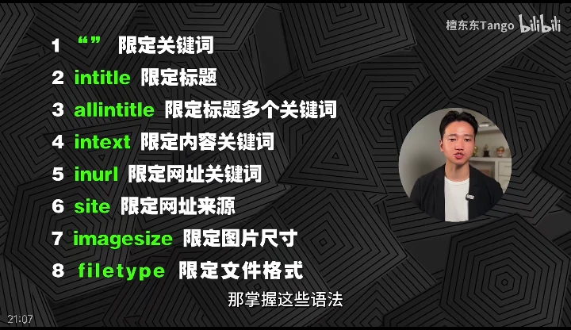

<!--
 * @Author: coffeecat
 * @Date: 2025-05-18 12:27:56
 * @LastEditors: Do not edit
 * @LastEditTime: 2025-05-18 12:37:23
-->

需要搜索的内容，搜什么
1.新闻咨询类

2.知识技能类

3.素材

4.工具类

为什么搜索
1.单纯知道一些东西
2.学习一些东西
3.创作需要借鉴整合一些东西
4.完成特定任务，单纯完成

怎么搜

谷歌 >> 百度

1.限定关键词
关键词  ->  "关键词"

2.限定标题   
intitle:关键词      

