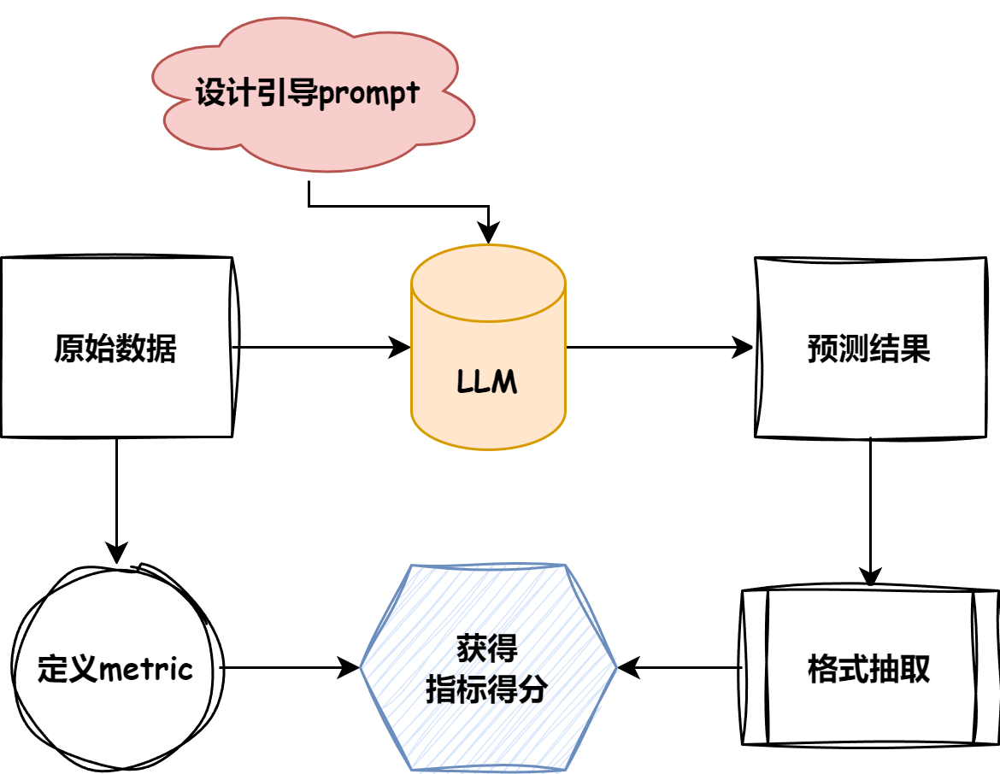

目标 datawhale的这个基础教程完成

https://github.com/datawhalechina/tiny-universe

本项目的主要内容包括：

1. 手写图像生成模型--Tiny Diffusion
2. 深入剖析大模型原理——Qwen Blog
3. 逐步预训练一个手搓大模型——Tiny Llama3
4. 如何评估你的大模型——Tiny Eval
5. 纯手工搭建 RAG 框架——Tiny RAG
6. 手搓一个最小的 Agent 系统——Tiny Agent
7. 深入理解大模型基础——Tiny Transformer

conda create -n dw-llm

## TinyEval

实现一个简单的LLM评测框架

### pipeline

首先要明确评测任务的基础`pipeline`。下图是评测任务的简要流程：

- 首先，根据目标数据集的任务类型***指定合理的评测`metric*`**.
- 根据目标数据的形式***总结模型引导`prompt`***.
- 根据模型初步预测结果采纳合理的***抽取方式***.
- 对相应的`pred`与`anwser`进行**得分计算**.

### 评测数据集与metric

| name            | type       | metric   |
| --------------- | ---------- | -------- |
| multi_news      | 长文本问答 | Rouge    |
| multifieldqa_zh | 短文本问答 | F1       |
| trec            | 生成式选则 | accuracy |