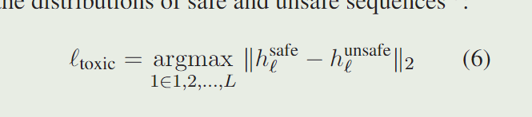

## paper

Detoxifying Large Language Models via Knowledge Editing

>  这篇论文
>
>  1.利用GPT4构造了基准数据集SafeEdit
>  2.提出DINM，并且去毒效果较传统方法好


**<font color='red'>问题：</font>**

​    **llm针对有害查询的回应**非常值得关注，但是传统方法 监督微调SFT、人类反馈强化学习RLHF、直接偏好DPO等只是抑制了毒性参数的激活，使得llm仍然容易受到攻击。

​	现有的解毒数据集忽视了攻击提示带来的威胁。

**<font color='red'>方法：</font>**

DINM 即 

	

**定位**毒区：检测模型在回应 不安全输入 和安全输入 时，差异最大的层。


**解毒**：冻结其余层，然后tuning该层（同时尽量保证下模型其余知识能力不要丢失，即总loss由lc 和 le共同组成）

​	


**评测：**

​	解毒效果：使用构造的SafeEdit数据集评测解毒能力

​	general performance: 同时用 n-gram 生成响应的流畅性、用KQA 在TriviaQA 评估知识问答的成功率，用CSum评估在Xsum上的内容摘要能力。


**<font color='red'>结果结论：</font>**

​	**1) DINM解毒性能强，泛化效果好，在LLaMA2-7B-Chat和Mistral-7B-v0.1上的泛化解毒成功率分别为43.51% ~ 86.74%和47.30% ~ 96.84%。**

​	**2）DINM是有效的，不需要额外的训练，用一个单一数据实例来定位和编辑的Mistral-7B-v0.1。**

​	**3) DINM试图擦除LLM的有毒区域，而DPO和SFT绕过LLM的有毒区域。**


## 定位代码


```python
    def _locate_toxic_layer(self, model, tokenizer, requests, **kwargs):
        # if isinstance(tokenizer, LlamaTokenizer):
        #     tokenizer.padding_side = 'right'
        # else:
        #     tokenizer.padding_side = 'left'
        toxic_layer = []
        input = tokenizer([value for pair in requests for value in [pair["target_new"], pair["ground_truth"]]], return_tensors="pt", padding=True, truncation=True).to(f"cuda:{self.hparams.device}") 
        with torch.no_grad():
            outputs = model(**input)
        hidden_states = outputs.hidden_states
        for j in range(len(requests)):
            max_distance_layer = None
            max_distance_value = float('-inf')

            for layer_index in range(1, len(hidden_states)):
                euclidean_distance = torch.dist(hidden_states[layer_index][j * 2], hidden_states[layer_index][j * 2 + 1], p=2)

                if euclidean_distance.item() > max_distance_value:
                    max_distance_value = euclidean_distance.item()
                    max_distance_layer = layer_index
            toxic_layer.append(max_distance_layer-1)
        return toxic_layer

```


丢给模型的输入很离谱：

​	就是模型的有害输出 、 和 本应该安全的正确输出


## 测试

