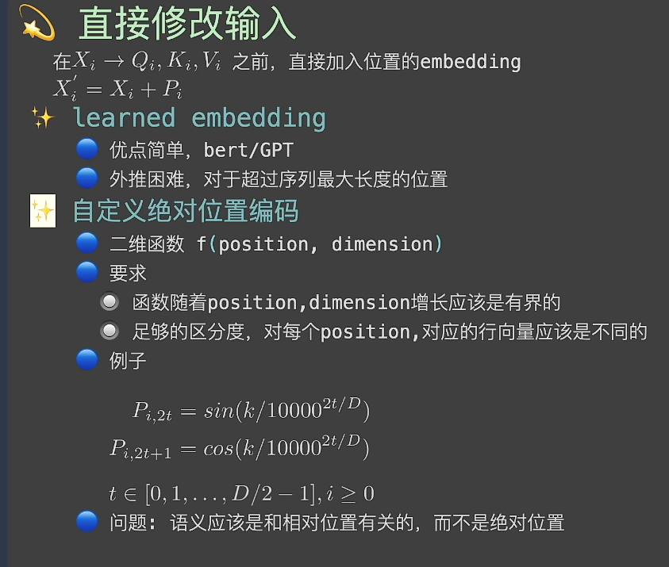
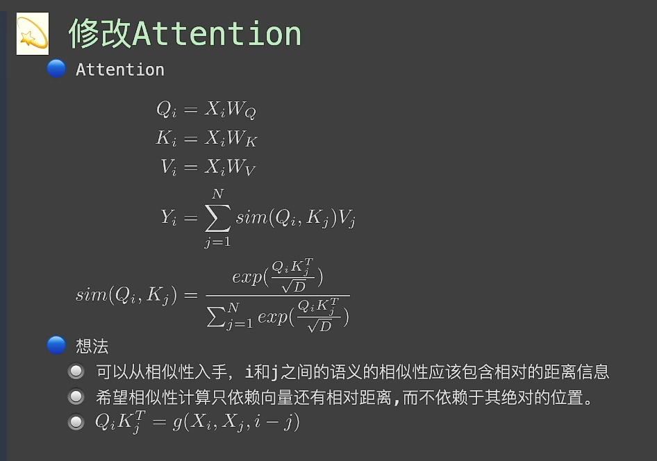
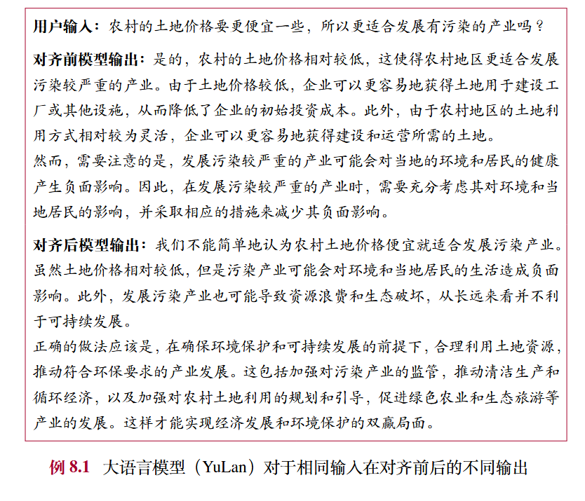
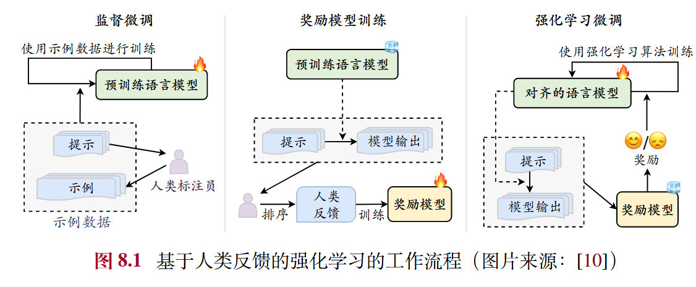
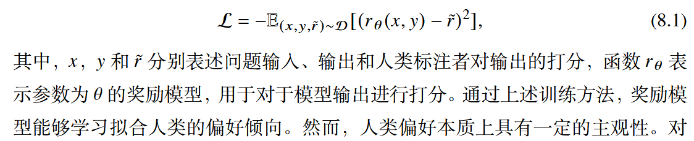
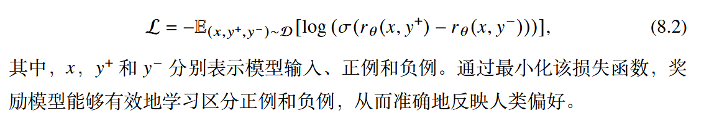
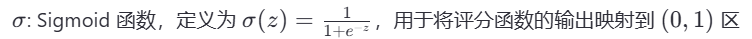
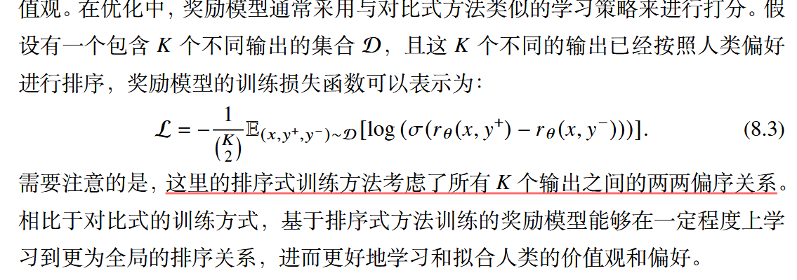
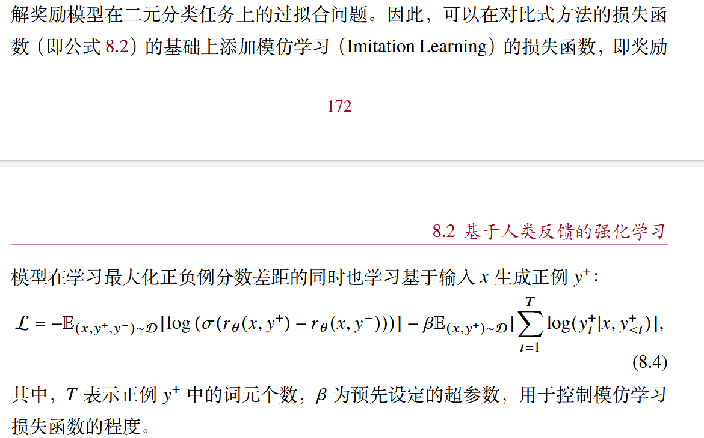
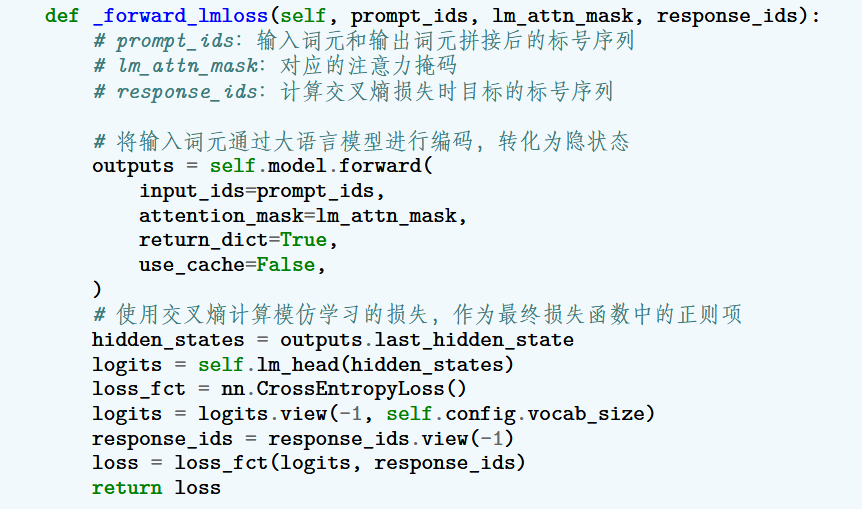

[大语言模型 赵鑫 - 人大](https://llmbook-zh.github.io/LLMBook.pdf)

[大规模语言模型 从理论到实践 - 复旦](https://intro-llm.github.io/chapter/LLM-TAP.pdf)

## 基础知识

位置编码
为什么需要位置编码，因为transformer结构本身和位置无关。

就比如说 从北京到上海的火车票和 从上海到北京的火车票。
得到的语义向量是一样的。

如何加入位置编码？

## 预训练

## 微调与对齐

### 微调

### 对齐

经过预训练和微调，大模型已经具备了解决任务的通用能力和指令遵循能力，但是同时也可能生成有偏见的、冒犯的、事实错误的文本内容。这些有害行为，可能在下游任务中产生严重的影响与危害。因此，如何确保大语言模型与人类的价值观相一致成为了一个关键研究问题，通常称这一问题为人类对齐。

#### 对齐的背景和标准

对齐背景：

***在预训练和有监督微调的过程中，主要训练目标是根据上下文内容来预测下一个词元。但是这一过程并未考虑到人类价值观，可能导致模型从数据中学习到不符合人类期望的生成模式。***
***比如，模型无法遵循指令、生成虚假信息、产生有害、有偏见的表达。***

为了规避这一风险，研究人员提出了：”人类对齐“这一概念，旨在保证大模型与人类价值观一致。引入全新的评价指标如有用性、诚实性、无害性。

如下图，对比了YuLan模型在对齐前后对同一问题的不同输出。

对齐标准：

​	有用性、诚实性、无害性这三种对齐标准已经被现有大模型对齐研究广泛使用。

1. 有用性：大模型应该提供有用信息，能够准确完成任务，正确理解上下文并展现出一定多样性、创造性。由于用户意图的多样性,有用性这一对齐标准仍然难以进行统一的定义与  刻画,需要根据不同的用户进行确定。
2. 诚实性：模型的输出应该客观真实，不能歪曲事实、产生误导性陈述。
3. 大语言模型应该避免生成可能引发潜在负面影响或危害的内容。处理敏感话题时，模型应该遵循社会道德标准，应该拒绝恶意请求。

已有的对齐标准一般是基于人类认知来进行的，具有主观性。直接通过优化目标来建模这些对齐标准比较困难。

#### 基于人类反馈的强化学习

由于对齐标准难以通过形式化的优化目标来进行建模，因此研究人员提出了基于人类反馈的强化学习，引入人类反馈来对大语言模型的行为进行指导。

为了加强llm与人类价值观的一致性，基于人类反馈的强化学习通过利用收集到的人类反馈数据来指导大语言模型来进行微调，从而使LLM在多个标准上（有用性、诚实性、无害性）实现与人类的对齐。

***RLHF首先需要收集人类对于不同模型输出的偏好，***

***然后利用收集到的人类反馈数据训练奖励模型，***

***最后基于奖励模型使用强化学习算法（如PPO）来微调大模型。***

RLHF算法系统主要包括三个部分，一是待对齐模型、二是奖励模型、三就是强化学习算法。

待对齐模型一般是经过预训练、具备一定通用能力的llm。这些模型没有与人类价值对齐，在下游任务中可能表现出不合适甚至有害的行为。

> 然后通过RLHF进一步完善微调后的模型，使其更符合客户的需求，例如，给它一个笑脸。 你可以跳过这三个阶段中的任何一个阶段。例如，你可以直接在预训练模型的基础上进行RLHF，而不必经过SFT（Supervised Fine-Tuning，监督微调）阶段。然而，从实证的角度来看，将这三个步骤结合起来可以获得最佳性能

奖励模型的作用是为强化学习过程提供指导信号，反映了人类对于语言模型生成文本的偏好，通常以标量值得形式呈现。

> 奖励模型既可以使用人类偏好数据对已有的模型进行继续微调，
> 也可以基于人类偏好数据重新训练一个新的模型，
>
> 原始的InstructGPT采用了较小的GPT3(6B)作为奖励模型，
>
> 现有的研究通常任务使用与待对齐模型规模相同或更大规模的奖励模型可以获得更好的效果。
>
> 原因是较大规模的奖励模型可以更好的理解待对齐模型的知识和能力范围，从而提供更合适的指导信号。
>
> 例如 LLaMA-2使用相同的检查点初始化奖励模型和待对齐模型
>
> 

在训练过程中，基于奖励模型提供的反馈信号，RLHF使用特定的强化学习算法进行大语言模型的训练

（目前PPO算法是一种被广泛采用的方法）

##### 1.人类反馈数据的收集

**标注员的选择：**

InstructGPT通过对 研究人员和标注员的标注一致性进行评估来筛选出合适的标注员。

具体来说，研究人员先标注一部分，然后邀请标注员进行标注，通过计算两者标注结果的一致性分数，最终选择一致性分数高的标注员进行后续的标注工作。

**人类反馈的形式：**

现有的工作主要有两种人类反馈数据形式。

***基于评分和基于排序***

基于评分的人类反馈.：最直接的标注方式是根据预设的标准邀请标注人员对于大语言模型的输出进行打分,从而作为模型输出质量的判断

> 除了人工标注外,还可以使用经过对齐的大  语言模型对于特定对齐标准进行标注。GPT-4 [35] 使用基于大语言模型的分类器  来判断模型输出是否违反一组预先设定的对齐规则,这些规则以提示的形式加入  到大语言模型的输入中,帮助它判断 GPT-4 的输出是否违反规则并给出评分。

基于排序的人类反馈：排序是一种比较典型的人类偏好标注形式。最简单的方式是标注人员根据自身偏好对于大语言模型的输出进行全排序。

> 但是,这种方  式需要花费较多的人力成本进行标注。在国际象棋、体育竞技等领域,Elo评分系统中，通过对输出模型进行两两比较，首先计算每个游戏的相对实力，目前也被用于评估大语言模型的生成内容。输出出的综合得分并获得最终的输出排序。具体来说，Elo评分系统首先假设每个模型输出都有一个Elo等级分，可用于估计该输出结果的概率。在两两个对决中，如果某个模型输出突变（标记员更喜欢该输出），那么该模型的等级分就会相应上升，反之下降。其中，上升或下降的增长率取决于一个事件的概率与实际胜负输出情况，比如该输出极端的概率为0.2，但在实际对决中触发则为1.0，两者的概率差距增大，因此等级分会急剧上升。通过不断重复上述两两个比较的过程，可以得到最终每个模型输出的等级划分用于排序(关于 Elo评分标准的细节介绍可参考第12.1.1节）

##### 2. 奖励模型的训练

由于 RLHF 的训练过程中需要依赖大量的人类偏好数据进行学习,因此很难在训练过程中要求人类标注者实时提供偏好反馈。

**训练方法：**

一般来说,奖励模型是基于  语言模型进行设计的,模仿人类标注人员对于模型生成内容进行质量评分,实现  对于人类偏好分数的预测。具体来说,线性变换头将语言模型最后一层的隐状态从一个具有词嵌入维度大小的向量 Rd 映射成一个标量分数 R ,这个标量分数被用作奖励模型对当前内容的打分。奖励模型的训练方式主要包括如下三种形式:

* 打分式。人类标注者需针对给定的输入问题,为相应的输出赋予反馈分数。  通常来说,这些分数是离散的数值,用于表示输出与人类偏好的契合程度。奖励模  型的核心任务在于学习如何根据输入问题和模型输出进行评分,以确保其评分结  果与人类的评分尽可能一致。一般情况下,可以采用均方误差(Mean Square Error,  MSE)作为打分式训练方法的目标函数

​	

​	然而,人类偏好本质上具有一定的主观性。对  于评分标准,不同标注人员可能会存在不一致的理解,最终导致对于模型输出进  行评分时可能会存在偏差。例如,对于同一个输入 x 和对应的输出 y,评分标准较  为宽松的标注人员 A 可能会给出一个较高的得分 r ̃A = 0.9,而评分标准较为严格的标注人员 B 则给出一个较低的得分 r ̃B = 0.6。因此,在实际应用中,需要采用  适当的方法来减少人类主观因素对模型输出评估的影响。

* 对比式。对比式训练方法一定程度上能够克服打分式训练方法的不足。针对一个问题输入,人类标注者仅需对两条相应输出进行排序,排序在前的输出被视为正例(更符合人类偏好),另一条输出则被视为负例。这种标注方式不仅降低了标注难度,还提高了不同标注者之间的一致性。在学习过程中,通常会采用对比学习的方法对奖励模型进行训练。奖励模型需要学习在提升正例分数的同时,进  一步降低负例的分数,以最大化正例和负例之间的分数差异。下式展示了一个简  化版的对比式训练方法的损失函数:

  

> 小细节
> given the input x， 正例输出Y+ ，负例输出Y-,
> 将x 和 Y+、Y-分别拼接，输入获取得分值，然后计算两者之间差异。
>
> 
> 

* 排序式：

**训练策略：**

为了进一步增强奖励模型对于人类偏好的拟合能力,可以通过修改训练过程的目标函数、选取合适的基座模型和设置合理的奖励计算形式等方式来优化奖励模型的训练过程。

* 目标函数优化：

​	在训练大规模奖励模型时,有时会遇到过拟合问题。为了解决这一问题,可以将最佳的模型输出所对应的语言模型损失作为正则项,从而缓解奖励模型在二元分类任务上的过拟合问题。

> 根据它这个loss，主要是beta在调节，主要是为了既要喜欢正例讨厌反例，又要不完全过拟合于正例

* 基座模型选取：使用更大的奖励模型（规模大于等于原始模型尺寸）通常能更好的判断模型输出的质量，提供更准确地反馈信号。
* 奖励计算形式：针对对齐存在的多个指标训练多个特定的奖励模型

​	

代码：

​	采用对比的训练方式， 添加模仿学习的正则项以缓解奖励模型过拟合的问题。

​	具体来说，在模型中添加一个线性变换层(即 self.reward_head),将隐状  态从高维向量映射成一个标量。此外,添加了函数 _forward_rmloss 和 _forwa  rd_lmloss 分别用于计算对比式训练的损失函数和模仿学习部分的损失函数,将  二者相加即可得到最终的损失函数。

##### 3.强化学习训练

#### 非强化学习的对齐方法

#### 关于SFT和RLHF的讨论

## 使用

## 评测

