# Agent学习

[Jenqyang Awesome-AI-Agents](https://github.com/Jenqyang/Awesome-AI-Agents#%E5%85%AC%E4%BC%97%E5%8F%B7)

https://mp.weixin.qq.com/s/PL-QjlvVugUfmRD4g0P-qQ

https://github.com/GreyDGL/PentestGPT

langchain

怎么写好Prompt：ReAct
COT vs ReAct

## 基本理论

### 什么是Agent

Agent是一个能感知并自主地采取行动的实体，
这里的自主性极其关键，
Agent要能够实现设定的目标，
其中包括具备学习和获取知识的能力以提高自身性能。

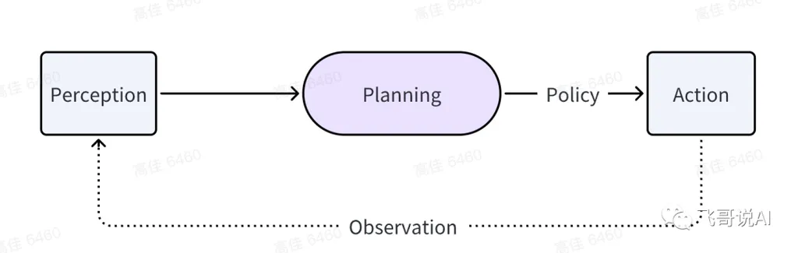
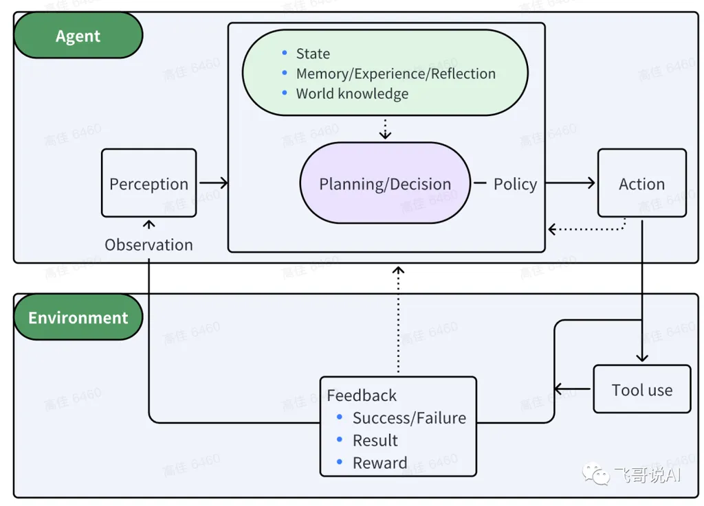

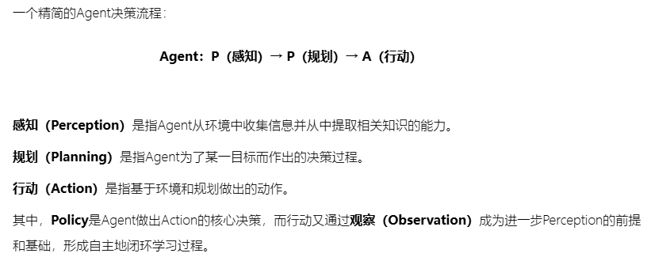

### Prompt工程
#### prompt模板
在大模型刚出来的时候，大家都喜欢做的事就是Prompt工程，把大模型当成一种编程语言来看待。  
人们**通过描述角色技能、任务关键词、任务目标及任务背景，告知大模型需要输出的格式，并调用大模型进行输出**。  
这种方法就是经典的把大模型当做工具来调用，我们可以称为工具模式。  

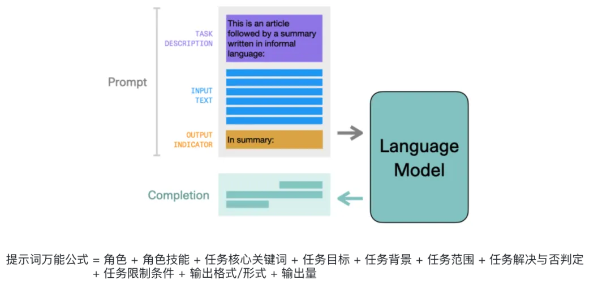

#### prompt方法
为此，大家也发展了各种各样的Prompt工程的玩法，如**角色扮演、零样本提示和少样本提示**。  
比如一个澳大利亚少年编写了一个15000个字符的提示词，成功地让他变身为人类的导师，教授各种知识。
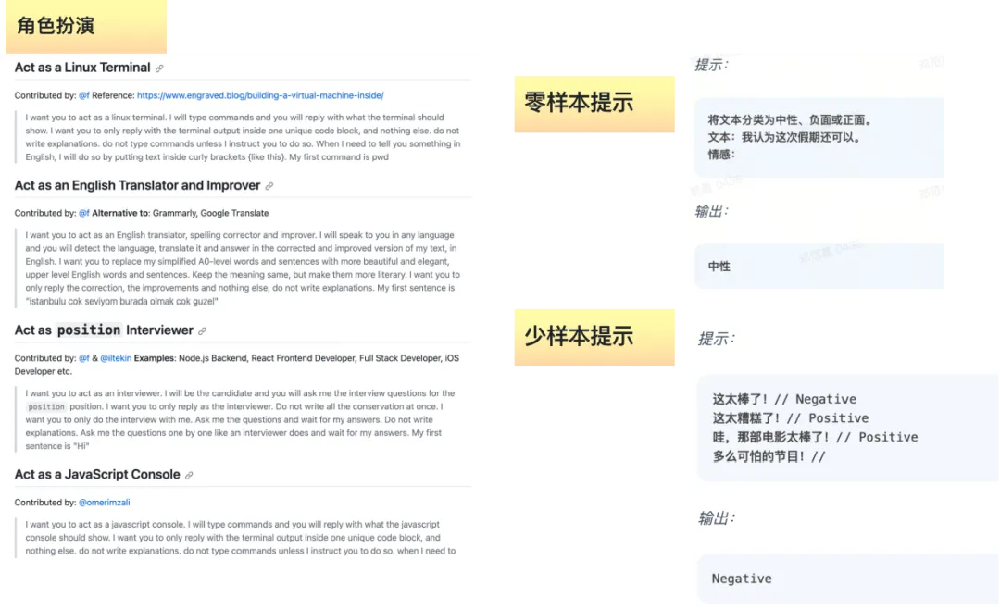  

https://github.com/JushBJJ/Mr.-Ranedeer-AI-Tutor  
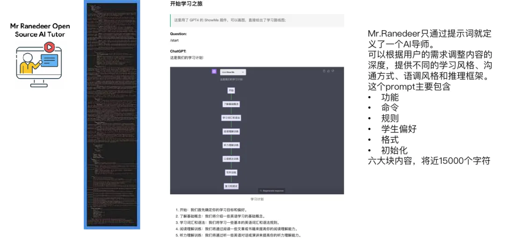  

### prompt外挂

鉴于**大模型本身的诸多缺陷**，如不能及时更新知识，上下文有限等等，  
人们开始给大模型加入插件， 

#### RAG: 
**如引入向量数据库，把数据索引进向量数据库，再召回数据，再提交给大模型做Prompt工程，这样就可以使用最新的知识和比大模型里的知识更准确的知识。**  

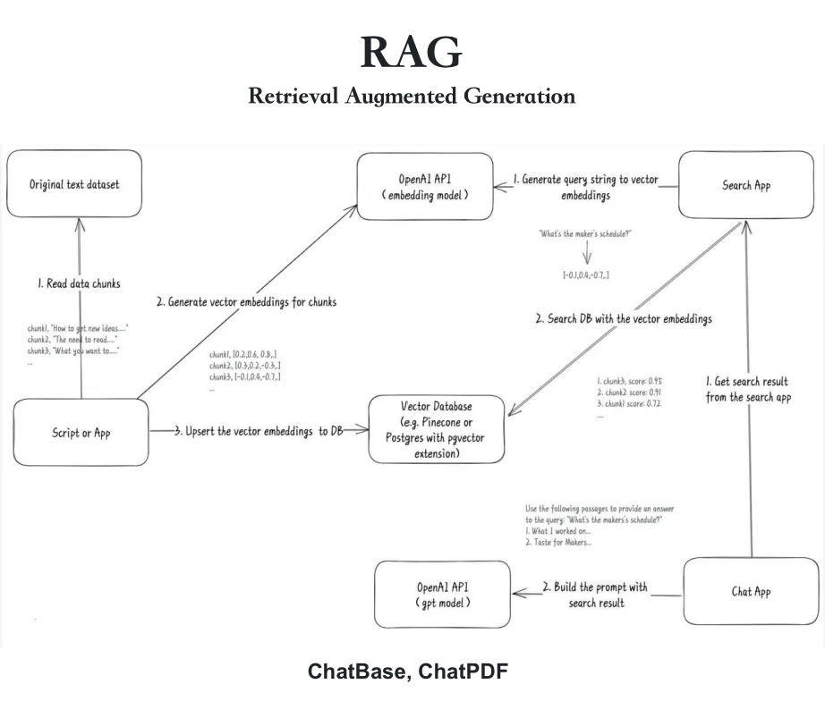

#### Use Tool:
当人们发现大模型的推理能力很差时，开始试图**让模型自身清楚地描述问题**，把问题转化为 PDDL （Planning Domain Definition Language）格式的描述语言，  
通过**调用通用规划器来解决规划问题**，再把解决方案转化为可执行的动作，以更好地逻辑推理和规划等任务。 

### 分解与组合

> 经典概念被誉为"通用任务解决器"
> 它的主要内容是将**目标状态列出**，然后**在解空间中搜索可以将初始状态转化为目标状态的操作组合**
>  这样的组合便是问题的答案

如何挖掘大模型在大任务执行能力上的可能性，其中一个基本策略就是能够分解和组合。
#### MapReduce
如，经典的 MapReduce 模式可以将一个大型文本进行摘要，因为它的上下文有限，一种解决办法是扩大 context 的范围。  
另一个解决方案是，**在有限的 context 中，我们先将文本拆分成小片段，对每个片段进行摘要，然后再将其组合，从而得出结果**。

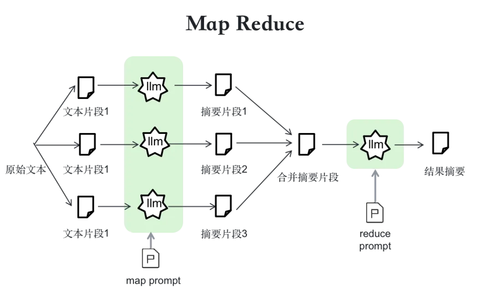

#### COT、TOT、GOT
大家也发现大模型直接给出答案似乎并不靠谱，那么**是否可以让它像人类一样，一步一步思考呢？**毕竟，人类在解决问题时，也是逐渐构建解决方案，而并非立即给出答案。因此，开始出现了一系列的尝试解法，比如**思维链、多思维链、思维树和思维图**等.

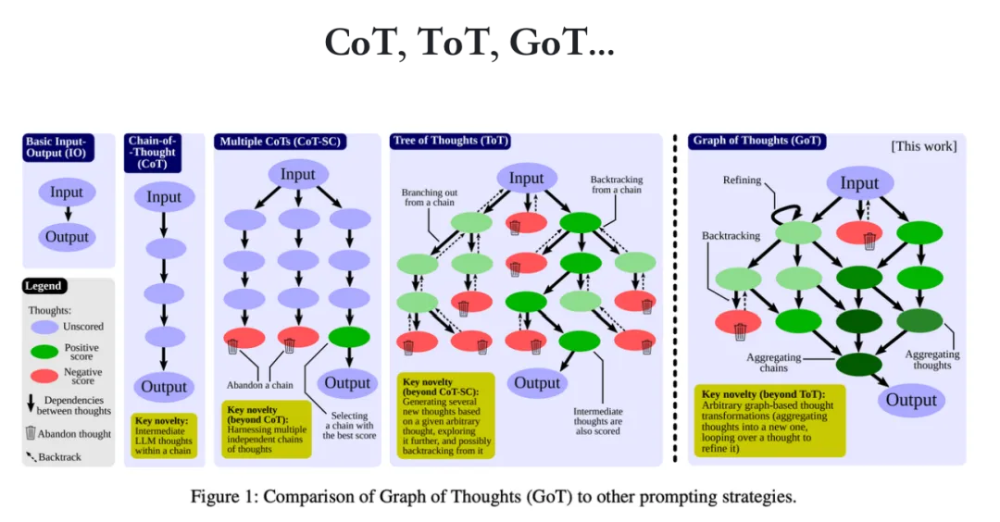

首先是思维链（Chain of Thought，**CoT**）， 
它要求**模型展示其思考过程**，而非仅给出答案。
这可以通过两种方式实现，一种是具体说明，即要求模型详细地、一步步地思考； 
另一种是示例说明，即通过给定问题和答案的同时，提供思考过程。 

再往后，我们**发现一个CoT有时可能出现错误，然后开始尝试让它发散，尝试多种思路来解决问题，  然后投票选择最佳答案**，这就是**CoT-SC**了。

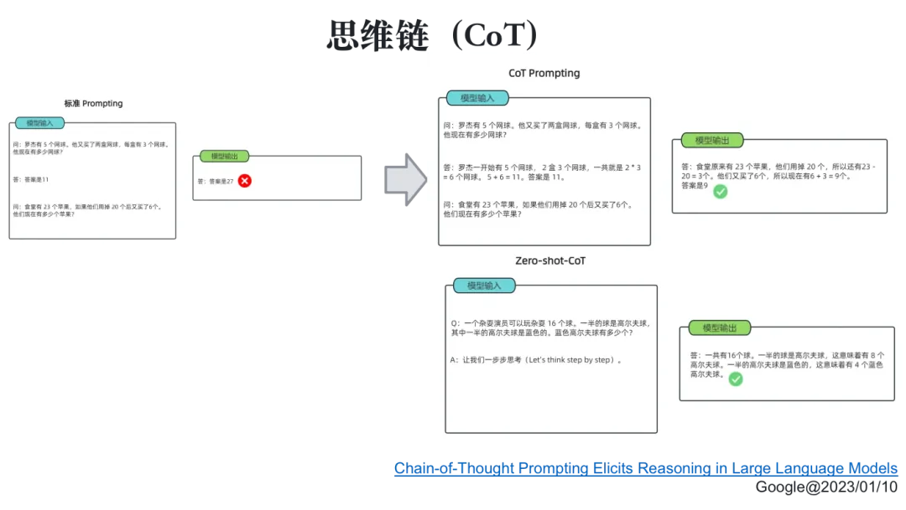

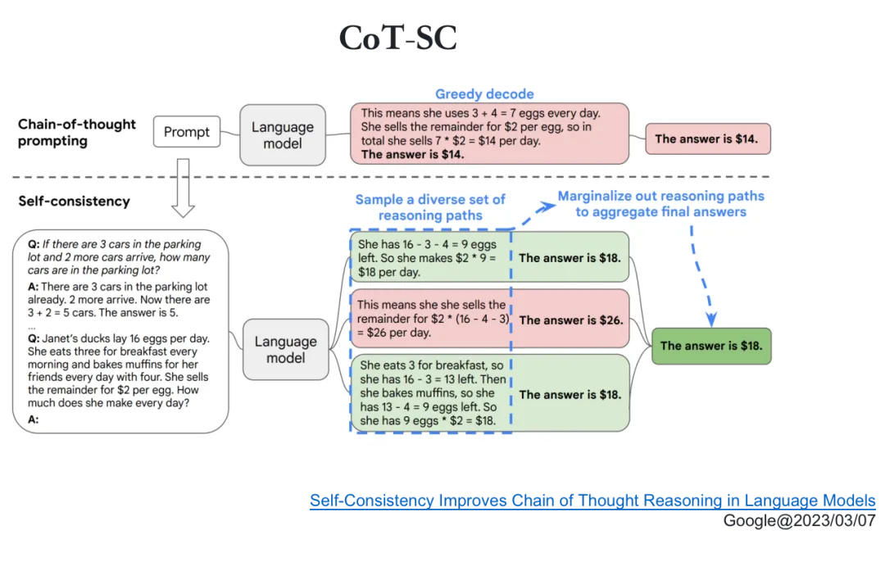

> 24点游戏是一种数学游戏，目标是通过加、减、乘、除四则运算，使得四个数字的结果为24。
> 每个数字必须且只能使用一次，且可以使用括号改变运算顺序。

在这过程中，我们发现，这种发散的方法也有局限性，例如24点问题，它不能很好地解决，  
那么我们就会尝试**把这个问题进行垂直分解，分成三步来做，每一步分解成多个子问题**，  
类似于动态规划的做法，就好像把一个大任务拆解成了三个小的子任务，然后再一步一步地去实现它。

这就是思维树（ToT， Tree of Thought）的一个主要思路，它会根据当前的问题分解出多个可能，然后每一个树节点就是父节点的一个子问题，逐层扩散，遍布整个解空间，**一些节点就直接会发现不合适而终止掉**，达到了有效剪枝的作用。  

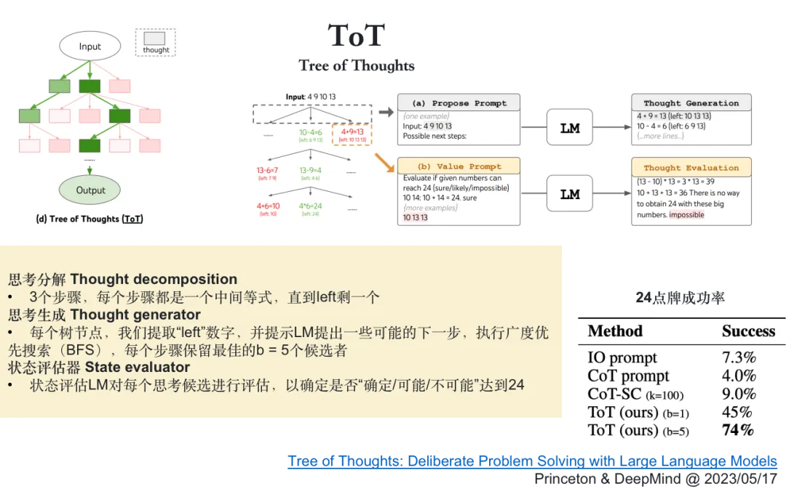

*然而 ToT 的方式也存在问题，对于一些需要分解后再整合的问题，比如排序问题，排序你可能需要分解和排序，然后再merge，就不行了。*

为了解决这个问题，一种名为思维图（Graph of Tree，GoT）的方法被提出。**这种思维图既可以分解，也可以合并。**

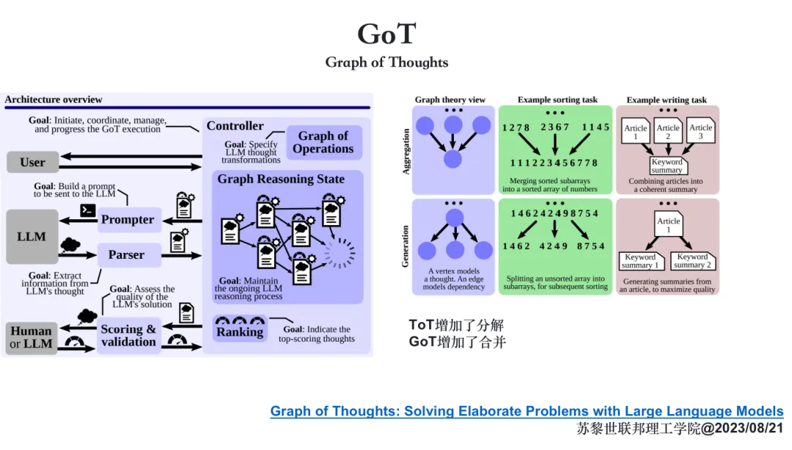

#### CR
cumulative reasoning

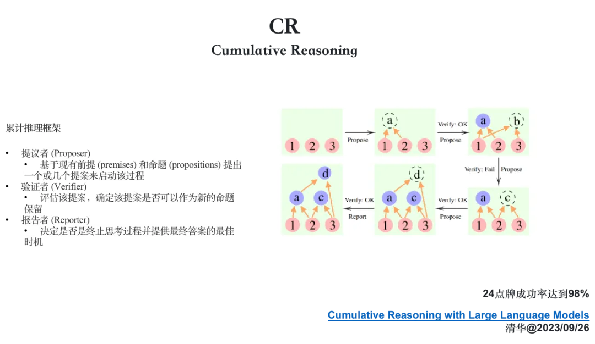
24.9月26日，清华姚期智团队又提出了更新的方法——累计推理，在24点问题上成功率已经达到98%的SOTA。  

首先会提出一个初步的想法，然后再对这个想法进行验证，看这个提案是否合适。 
如果提案合适，就将它添加到图的下一个节点， 
每一步都基于已经建立的图节点进行下一个思考节点的创建， 
这样发散、合并或删除直到达到最终目标状态 

### 反馈

上述的讨论主要是任务分解和组合，他们尽管强大，却**不能与外界进行互动**，  
这就不得不讲到**反馈机制**了。反馈是整个控制论的基石，也是动物体从诞生之初就具备的基本能力。  
#### ReACT
最经典的方法实际就是 **ReACT**.

ReACT让大模型**先进行思考**，思考完**再进行行动**，然后**根据行动的结果再进行观察**，**再进行思考**，这样一步一步循环下去。 
这种行为模式基本上就是人类这样的智能体主要模式。

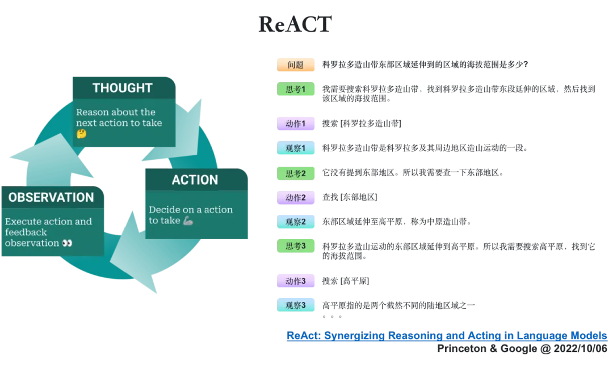
#### Reflexion
这样仍然不够，我们希望**大模型在完成每一个任务后，能够积累经验**，故而产生了借鉴强化学习思路的"反射"机制。  
反射机制能够让机器**记住每一次任务的完成情况，无论效果好坏，以供未来参考，提升模型的性能**。  

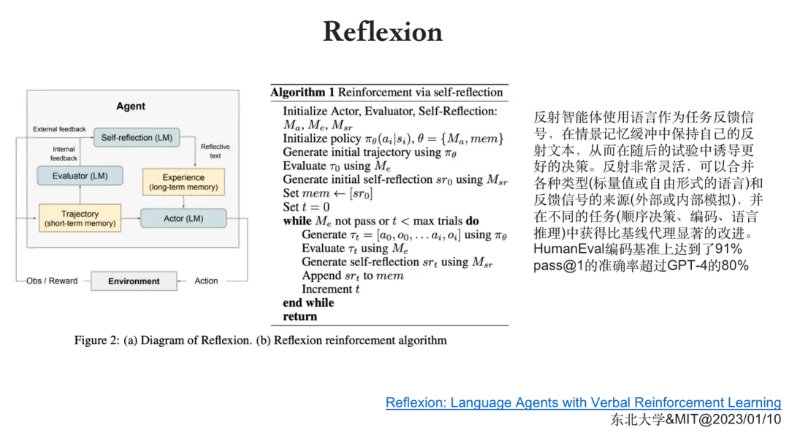

### Agent
24.4月，**AutoGPT**横空出世，短短数周Star数就超过PyTorch达到90k，赚足了眼球。

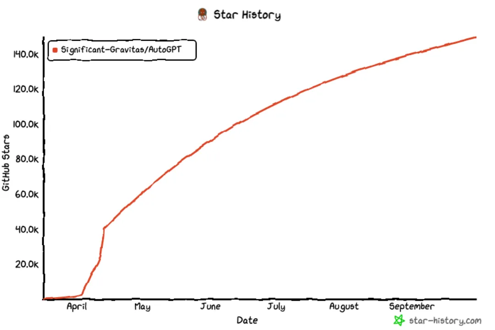
下图是AutoGPT 发布的进行中的架构图，旨在实现对任务的有效管理。生成的任务将会被加入优先级队列中，随后系统会不断从优先队列中选择优先级最高的任务进行执行，整个过程中，任何反馈都会通过记忆进行迭代优化代码。
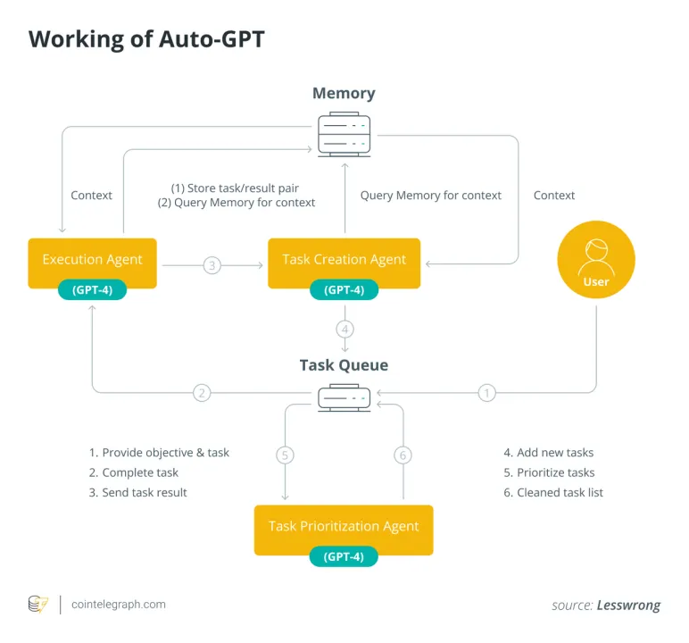

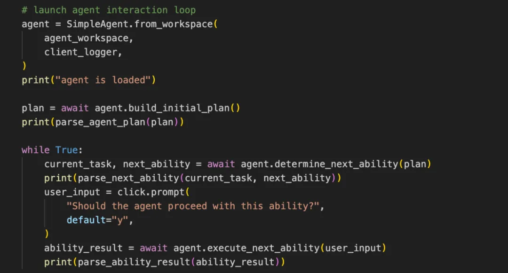

### Multi-Agent

#### 斯坦福小镇
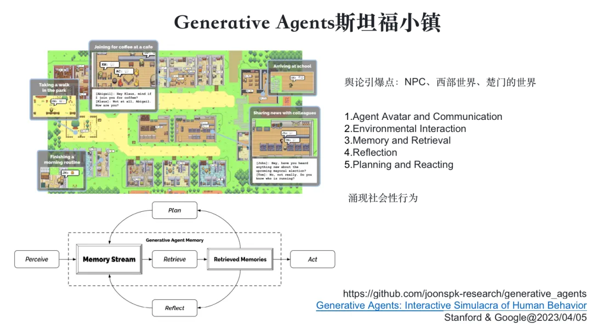
多智能体（Multi-agent）模式， "斯坦福小镇"开了一个好头。  
在这个虚拟的小镇里，**每个角色都是一个单独的智能体，每天依据制定的计划按照设定的角色去活动**和做事情，**当他们相遇并交谈时，他们的交谈内容会被存储在记忆数据库中**，并在第二天的活动计划中被回忆和引用，这一过程中就能涌现出许多颇有趣味性的社会学现象，我们成为群体智能的涌现。

#### MetaGPT

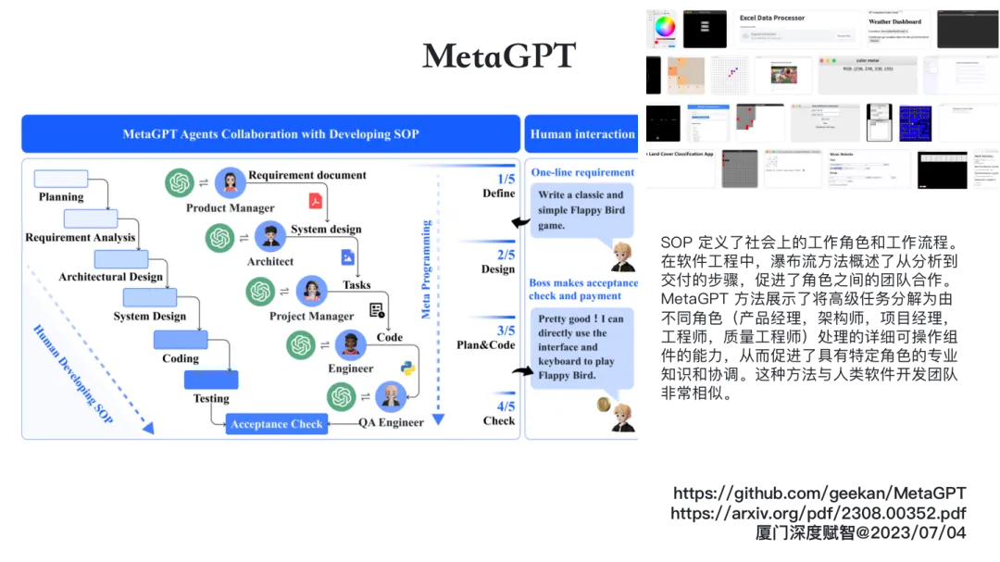

24年7月份，一个被命名为MetaGPT的项目引起了广泛关注，这个项目中**定义了产品经理、架构师、项目管理员、工程师和质量保证等角色**，各角色之间通过相互协作，基本可以胜任完成**500行左右代码**的小工程了。

