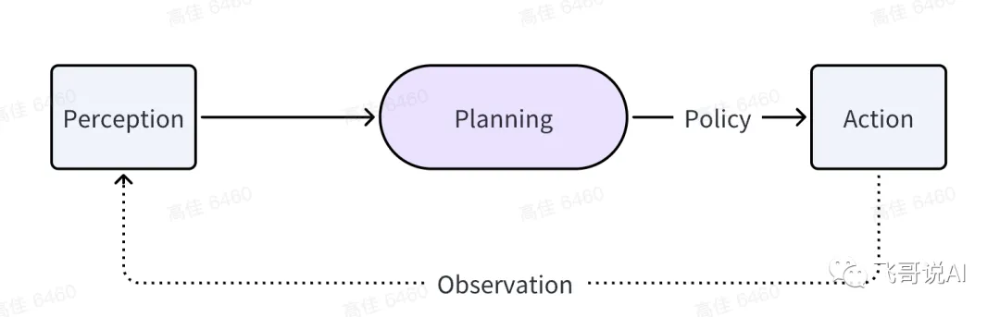

# Agent学习

[Jenqyang Awesome-AI-Agents](https://github.com/Jenqyang/Awesome-AI-Agents#%E5%85%AC%E4%BC%97%E5%8F%B7)

https://github.com/GreyDGL/PentestGPT

langchain

怎么写好Prompt：ReAct
COT vs ReAct

## 基本理论

