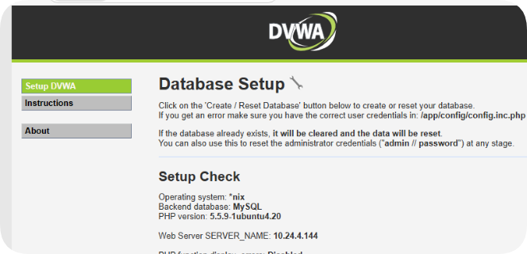

<!--
 * @Author: coffeecat
 * @Date: 2025-03-06 15:52:15
 * @LastEditors: Do not edit
 * @LastEditTime: 2025-03-22 16:09:45
-->
https://blog.csdn.net/learninger12/article/details/122927268

sudo docker pull infoslack/dvwa

docker run --name dvwa  -p 84:80 infoslack/dvwa

成功

默认账号密码为admin  password

