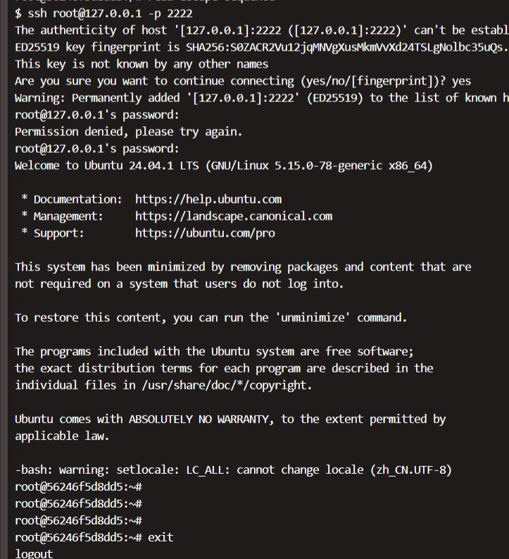
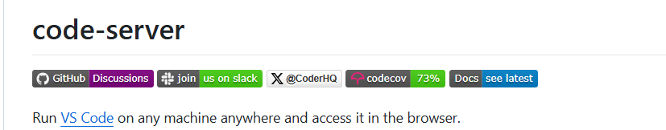
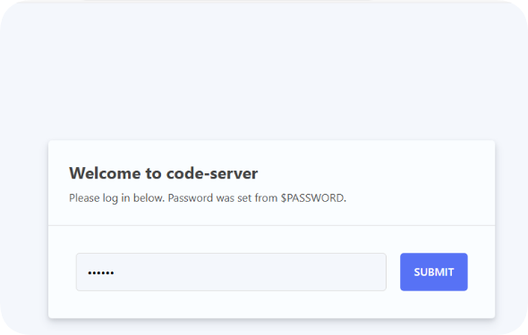
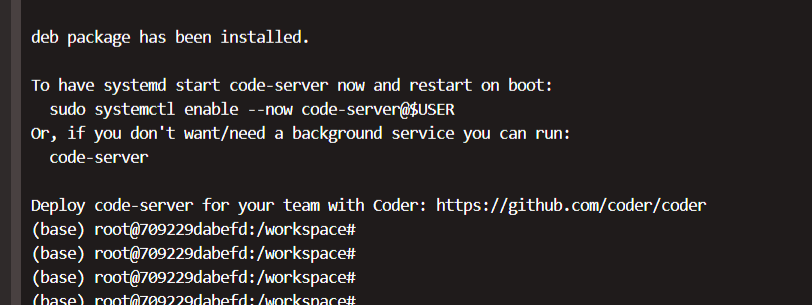
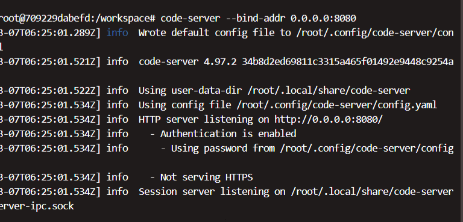
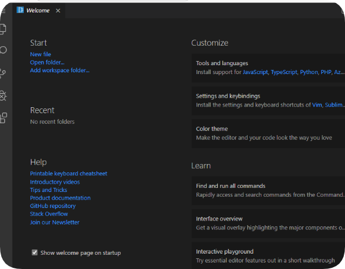
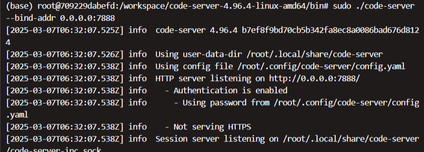
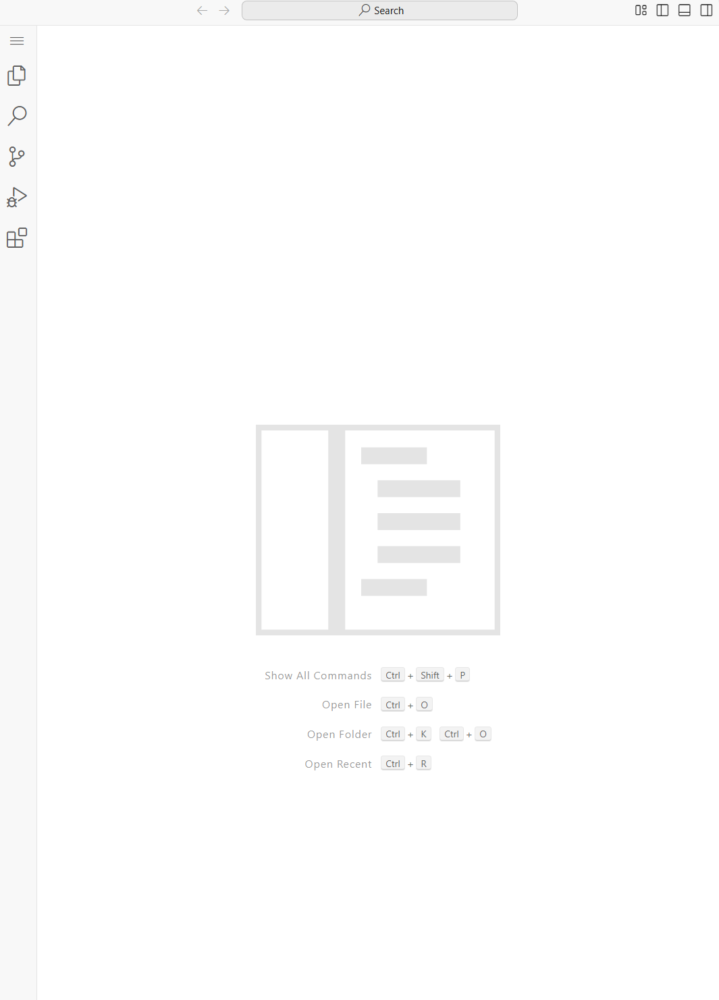
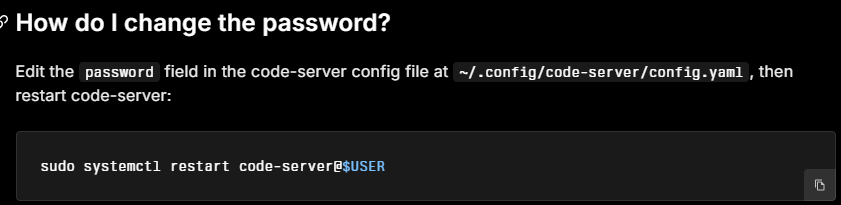

<!--
 * @Author: coffeecat
 * @Date: 2025-03-07 10:20:15
 * @LastEditors: Do not edit
 * @LastEditTime: 2025-03-22 16:07:09
-->

# 服务器ssh环境

## ssh连接docker
sudo docker run --privileged -it --name coffee_ssh  -v ./xsc_workspace:/workspace -p 2222:22 coffeecat:sshd /bin/bash

真就只能在服务器上能够本地连接

但是本地机器与服务器明明在一个内网啊，为啥连接不上

> 想到了原因， 因为哪怕是本地登录服务器，也是需要扫码验证的呀！！！

## code-server
进一步了解到code-server

https://github.com/coder/code-server

### 第一波折
1. 参见下面的博客使用docker进行配置
https://blog.csdn.net/qq_45576664/article/details/140549180

sudo docker pull codercom/code-server
sudo docker run -d --name code-server -p 9000:8080 -e PASSWORD=123456 codercom/code-server:latest

成功，但是是空白页面。。

下一步挂载目录
sudo docker stop code-server
sudo docker rm code-servercode-server

sudo docker run -d -it --name code-server -p 9000:8080 -e PASSWORD=123456 --privileged  --gpus all -v ~/xsc_workspace:/workspace codercom/code-server:latest  /bin/bash

>上一步的空白页面还是这样子
报下面的错误
Uncaught TypeError: Cannot read properties of undefined (reading 'bind')
    at uuid.ts:13:61

1. 根据github官网配置

https://github.com/coder/code-server
curl -fsSL https://code-server.dev/install.sh | sh -s -- --dry-run

curl -fsSL https://code-server.dev/install.sh | sh

 sudo code-server --bind-addr 0.0.0.0:7888
 

  ac6b334da99e4696f8a25747
还是报下面的错误
Uncaught TypeError: Cannot read properties of undefined (reading 'bind')
    at uuid.ts:13:61

### 第二波折

根据下面博客更换为老版本

>考虑到可能是docker的问题，就重新搭了一个老版本的，成功！！！
>https://blog.csdn.net/zju_cf/article/details/102765085
>
>code server版本太老，无法安装simple chinese插件。。

### conquer

在github 的issue找到需要版本rollback ...
换成4.96.4版本尝试

终于正常了

## 改密码
[官网](https://coder.com/docs/code-server/FAQ#how-do-i-change-the-password)

./code-server --help

修改config.yaml 然后使用下述命令即可
./code-server --bind-addr 0.0.0.0:7888 --auth password