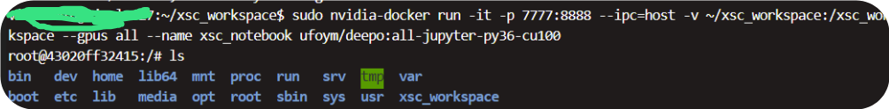

[在Linux服务器，基于Docker搭建Jupyter深度学习环境（支持GPU加速）](https://zhuanlan.zhihu.com/p/442176668)


## Docker镜像下载
```bash

#以此镜像为例子
sudo docker pull ufoym/deepo:all-jupyter-py36-cu100 


sudo nvidia-docker run -it -p 7777:8888 --ipc=host -v ~/xsc_workspace:/xsc_workspace --gpus all --name xsc_notebook ufoym/deepo:all-jupyter-py36-cu100
```
-it：为直接进入交互式 ；
-p 7777:8888：是把主机的7777端口映射到容器的8888端口；
-ipc=host：可以让容器与主机共享内存 ；
--name xxxxx：给容器定义一个个性化名字
-v /home/lab/Documents/iris_workspace:/iris_workspace：指示docker挂载目录，以便可以在容器环境内部进行访问。如果您有数据集或代码文件，请将它们设置为可在特定目录上使用，并通过此选项进行挂载。可以将主机上的 /home/lab/Documents/iris_workspace 地址挂载到容器里，并命名为/iris_workspace，这样这个文件夹的内容可以在容器和主机之间共享了。那么在容器内进入/iris_workspace目录，便可访问到我硬盘内 /home/lab/Documents/iris_workspace 文件夹下的内容。因为容器一旦关闭，容器中的所有改动都会清除，所以这样挂载一个地址可以吧容器内的数据保存到本地。
--shm-size 16G ：默认分配很小的内参，在训练模型时不够用，可以通过参数设置
--gpus all：默认是不把GPU加入到docker环境中的，但可以通过参数设置
- cf60a305ba7b：是你安装的jupyter镜像的id，可以在刚刚docker images命令后面查看，当然你也可以直接写全名ufoym/deepo:all-py36-jupyter
nvidia-docker：否则在镜像中无法使用gpu

成功

## jupyter启动

```bash
jupyter notebook --no-browser --ip=0.0.0.0 --port 8888 --allow-root --NotebookApp.token=... --notebook-dir='./xsc_workspace'
# 注意默认就是在8888启动jupyter服务器
```
---no-browser：即不通过浏览器启动，
--ip：指定容器的ip，授权对象源填写0.0.0.0/0是指将这个端口号授权给所有IP地址
--allow-root：允许root模型运行；
--NotebookApp.token：可以指定jupyter 登录密码（一般是字符串），可以为空
--notebook-dir='/iris_workspace'：指定jupyter的根目录


## 连接服务器jupyter

在本地机器上，在浏览器中输入： http://服务器IP地址:7777，即可打开jupyter.


测试cuda


## vscode连接jupyter

https://zhuanlan.zhihu.com/p/654295127


!!! > 这相当于代码放在本地？然后远程服务器去执行？
比较有意思

