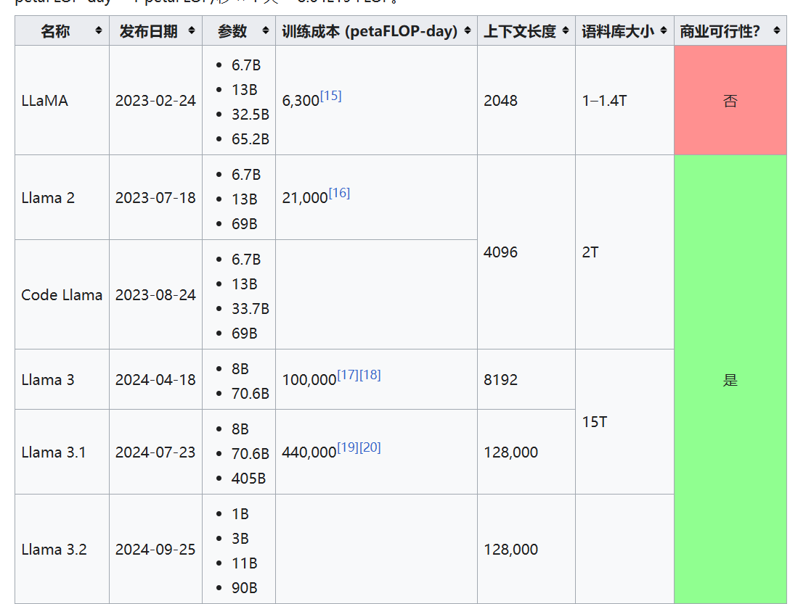
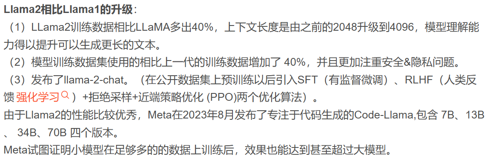

# Llama

本文想要详细了解并跟进Llama的工作

> meta公司， 原名Facebook，是美国一家互联网科技公司，由扎克伯格于2004年创立，总部位于美国加利福尼亚州。2021年，改名为Meta。
>
> Llama是由meta公司于23年2月发布的开源LLM。
>
> ​	共有7B到65B不等的模型大小尺寸
>
> Llama2，23年7月。 - CodeLlama 23年8月。
>
> ​	7B、13B、70B
>
> Llama3，24年4月18日。
>
> ​	共有8B 、70B两种模型大小尺寸。
> Llama3.1， 24年7月23日。
> ​	共有8B 、70B、405B两种模型大小尺寸。
>
> Llama3.2,  24年9月25日.
> 	1B、3B、11B、90B
>
> 

整理并收集如下文献：

[24.11.10 一文读懂llama1、llama2、llama3、llama3.1、llama3.2技术细节及实战应用](https://blog.csdn.net/weixin_31588979/article/details/138634405)

[wiki](https://zh.wikipedia.org/wiki/LLaMA)

## Llama1

由Meta AI 发布，包含 7B、13B、33B 和 65B 四种参数规模的开源基座语言模型

**数据集**：模型[训练数据集](https://so.csdn.net/so/search?q=训练数据集&spm=1001.2101.3001.7020)使用的都是开源的数据集。1 - 1.4T

**分词器**：分词器采用BPE算法，使用 SentencePiece 实现，将所有数字拆分为单独的数字，并使用字节来分解未知的 UTF-8 字符。词表大小为 32k 。

**模型结构**：原始的Transformer由编码器（Encoder）和解码器（Decoder）两个部分构成。同时Encoder和Decoder这两部分也可以单独使用，llama是基于Transformer Decoder的架构，在此基础上上做了以下改进：
（1）llama将layer-norm 改成RMSNorm(Root Mean square Layer Normalization)，并将其移到input层，而不是output层。
（2）采用SwiGLU激活函数。
（3）采用RoPE位置编码。

**上下文长度**: 2048

**优化器**：AdamW,是Adam的改进，可以有效地处理权重衰减，提供训练稳定性。
learning rate：使用余弦学习率调整 cosine learning rate schedule，使得最终学习率等于最大学习率的10%，设置0.1的权重衰减和1.0的梯度裁剪。warmup的step为2000，并根据模型的大小改变学习率和批处理大小。

**模型效果**：llama-13B([gpt-3](https://so.csdn.net/so/search?q=gpt-3&spm=1001.2101.3001.7020) 1/10大小)在多数benchmarks上超越gpt-3(175B)。在规模较大的端，65B参数模型也与最好的大型模型（如Chinchilla或PaLM-540B）也具有竞争力。

## Llama2

由Meta AI 发布，包含 7B、13B 、 34B、70B 四种参数规模的基座语言模型,除了34B其他模型均以开源。

**数据集**：模型训练数据集使用的都是开源的数据集，相比上一代的训练数据增加了 40%，达到了增至2万亿个token(2T)，训练数据中的文本来源也更加的多样化。Llama 2对应的微调模型是在超过100万条人工标注的数据下训练而成。（但是Llama 2 语料库仍以英文（89.7%）为主，而中文仅占据了其中的 0.13%。这导致 Llama 2 很难完成流畅、有深度的中文对话。

**分词器**：分词器采用BPE算法，使用 SentencePiece 实现，将所有数字拆分为单独的数字，并使用字节来分解未知的 UTF-8 字符。词汇量为 32k token。

**模型结构：**
（1）Llama 2与Llama 1的主要结构基本一致同样也是在transformer decoder结构上做了3大改进：将layer-norm 改成RMSNorm(Root Mean square Layer Normalization)，并将其移到input层，而不是output层、采用SwiGLU激活函数、采用旋转位置嵌入RoPE。
（2）Llama 2上下文长度由之前的2048升级到4096，可以理解和生成更长的文本。
（3）7B和13B 使用与 LLaMA 相同的架构，34B和70B模型采用分组查询注意力（GQA）。

**优化器：**AdamW 其中β1=0.9，β2=0.95，eps=10−5。

**learning rate：**使用cosine learning rate schedule，使得最终学习率等于最大学习率的10%，设置0.1的权重衰减和1.0的梯度裁剪。warmup的step为2000，并根据模型的大小改变学习率和批处理大小。

**模型效果：**从模型评估上看，Llama 2在众多的基准测试中，如推理、编程、对话能力和知识测验上，都优于Llama1和现有的开源大模型。Llama 2 70B在MMLU和GSM8K上接近GPT-3.5（OpenAI，2023），但在编码基准方面存在显著差距。Llama 2 70B的结果在几乎所有基准上都与PaLM（540B）（Chowdhery et al.，2022）不相上下或更好。Llama 2 70B与GPT-4和PaLM-2-L在性能上仍有很大差距。

> 

## Llama3

**数据集**：

Llama 3 的预训练数据集增加至15T，这些数据都是从公开来源收集的高质量数据集（依旧强调高质量的训练数据集至关重要）。其中包括了4 倍以上的代码 token 以及 30 种语言中 5% 的非英语token（这意味着LLAMA-3在代码能力以及逻辑推理能力的性能将大幅度提升）。
微调数据包括公开可用的指令数据集，以及超过1000万个人工注释的示例。预训练和微调数据集均不包含元用户数据。（主要还是以英语为主了，中文占比依旧很低，前面测试也可以看出来) 。通过开发一系列数据过滤流程：包括使用启发式筛选器、NSFW 筛选器、语义重复数据删除方法和文本分类器来预测数据质量。以及使用 Llama 2 为 Llama 3 提供支持的文本质量分类器生成训练数据

**分词器：**与Llama 2不同的是，Llama 3将tokenizer由sentencepiece换成tiktoken,词汇量从 的32K增加到 128K，增加了 4 倍。更大的词汇库能够更高效地编码文本，增加编码效率，可以实现更好的下游性能。不过这也会导致嵌入层的输入和输出矩阵尺寸增大，模型参数量也会增大。

**模型结构：**

Llama 3 中选择了相对标准的纯解码器decoder-only transformer架构，总体上与 Llama 2 相比没有重大变化。在 Llama 2 中只有34B,70B使用了分组查询注意 (GQA)，但为了提高模型的推理效率，Llama 3所有模型都采用了GQA

**序列长度**：输入上下文长度从 4096（Llama 2）和 2048（Llama 1）增加到 8192。但相对于GPT-4 的 128K来说还是相当小。

scaling law

**缩放定律：**对于像 8B 参数这样“小”的模型来说，***扩展法则 Chinchilla 最优训练计算量对应于 ~200B Tokens，但是Meta使用到了 15T Tokens***。从目前模型效果来看，Meta使用的Scaling Law法则是非常有效的，Meta得到了一个非常强大的模型，它非常小，易于使用和推理,而且mate表示，即使这样，该模型似乎也没有在标准意义上“收敛”,性能还能改善。这就意味着，一直以来我们使用的 LLM 训练是不足的，远远没有达到使模型收敛的那个点。较大的模型在训练计算较少的情况下可以与较小模型的性能相匹配，但考虑到推理过程中使效率更高，还是会选择小模型。如此说来训练和发布更多经过长期训练的甚至更小的模型，会不会是以后大模型发展的一个方向？

**系统**：为了训练最大的 Llama 3 模型，Meta结合了三种类型的并行化：数据并行化、模型并行化和管道并行化。最高效的实现是在 16K GPU 上同时训练时，每个 GPU 的计算利用率超过 400 TFLOPS。在两个定制的 24K GPU 集群上进行了训练。

指令微调：为了在聊天用例中充分释放预训练模型的潜力，Meta对指令调整方法进行了创新。训练方法结合了监督微调 （SFT）、拒绝采样、近端策略优化 （PPO） 和直接策略优化 （DPO） 的组合。这种组合训练，提高了模型在复杂推理任务中的表现。

**模型效果**：LLaMA 3有基础版，和 instruct两个版本。每个版本拥有 8B 和 70B 两种参数规模的模型，它们在多项行业基准测试中展示了最先进的性能，而且 instruct效果相当炸裂。

## Llama3.1

Llama 3.1 发布的产品有 8B、70B 和 405B 三个尺寸。

其中最受关注的是 Llama 3.1 405B。Meta 表示 Llama 3.1 405B 是目前全球最大、功能最强的公共基础模型，可与 OpenAI 和 Google 开发的顶级模型一争高下。
Meta 在官方博客中表示：“Llama 3.1 405B 是首个公开可用的模型，在通用常识、可引导性、数学、工具使用和多语言翻译方面可与顶级 AI 模型相媲美。405B 模型的发布将带来前所未有的创新和探索机会。”

**Llama3.1主要特点和优势:**

***多模态能力***
Llama 3.1的多模态能力是其最引人注目的特点之一。它不再局限于文本，而是能够理解和生成图像、视频和音频内容，实现了真正的跨媒体交互。例如，在教育领域，Llama 3.1 可以根据教学内容生成图表和动画，帮助学生更好地理解和记忆复杂概念。在电子商务中，它能够根据产品描述自动生成吸引人的商品展示图，提升营销效果。
此外，Llama 3.1 的多模态能力还体现在其对非结构化数据的处理上。它可以分析社交媒体上的图片和视频，提取关键信息，为市场分析和品牌监控提供支持。这种能力使得 Llama 3.1 在数据分析和内容创作方面具有巨大的潜力，为各行各业带来了创新的可能性。

## Llama3.2

Llama 3.2系列涵盖了小型和中型视觉LLM（参数分别为11B和90B）以及适用于边缘和端侧的轻量级纯文本模型（1B和3B），包含了预训练和指令调优版本。该系列的特点如下：

1B和3B模型：这些模型能够处理长达128K的令牌上下文，位于行业前列，适用于设备端的总结、指令追踪以及边缘环境中的文本重写任务。

11B和90B视觉模型：在图像理解方面，性能超越了诸如Claude 3 Haiku等封闭模型，能够处理文档理解（包括图表和图形）、图像字幕生成以及基于自然语言描述的图像中对象精确定位等任务。

对于1B和3B模型，采用了剪枝和知识蒸馏两种技术，以实现设备的高效适配和高性能：
4.1 剪枝技术用于缩减现有模型的大小，同时在尽可能保留知识和性能的基础上，对Llama模型进行精简。
4.2 1B和3B模型采用了从Llama 3.1 8B模型中提取的结构化剪枝方法。该方法涉及有系统地移除网络中的某些部分，并调整权重和梯度的大小，以构建一个更小、更有效的模型，同时保持原始模型的性能。知识蒸馏则通过将较大网络的知识传递给较小网络，使得小模型能够通过教师模型获得比从头训练更好的性能。在剪枝之后，知识蒸馏被用来恢复模型的性能。
