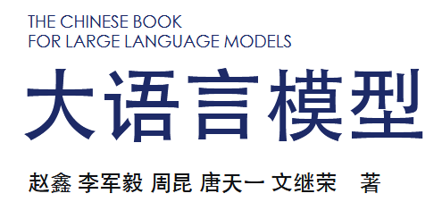
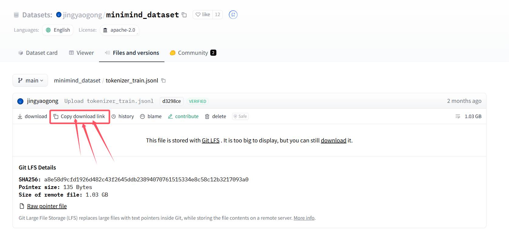
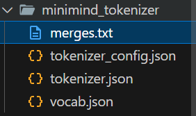
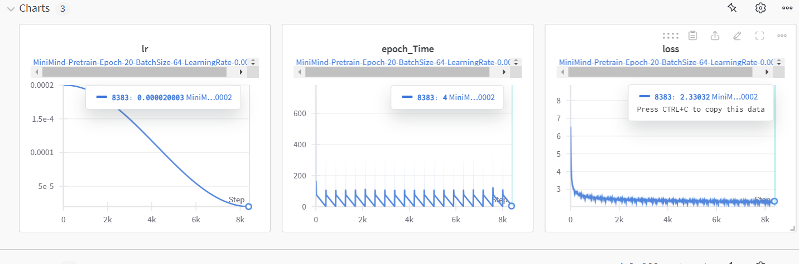

基本大模型知识参考：

基本代码库知识请查看https://transformers.run/

实践项目：minimind

# minimind学习

## minimind简介：

​	1）一个 从0开始，训练（最小型号仅为26.88M即0.02B大小）的llm 的项目

​	2）包括数据处理、预训练、指令微调、人类对齐的完整流程

​	3）在 Ceval上进行模型评测

​	4）实现chat接口，便于集成到第三方chatUI使用


> 基本环境搭建：
>
> 
>
> fork后使用git下载到本地
>
> git clone git@github.com:Coffee-Kitty/minimind.git
>
> conda create -n minimind 
>
> conda activate minimind
> pip install -r requirements.txt -i https://pypi.tuna.tsinghua.edu.cn/simple
>
> 
>
> 再测试torch是否可用cuda
>
> import torch
> print(torch.cuda.is_available())


## Tokenizer

tokenizer是数据预处理的一个关键步骤，

旨在`将原始文本转换为模型可以识别和建模的词元序列`

基于transformer的语言模型主要使用子词分词器算法，包括**BPE分词**、**WordPiece分词**，**Unigram分词**三种常见方法。

### BPE

**BPE算法从一组基本符号（例如字母）开始，迭代的寻找语料库中两个相邻词元，并将它们替换为新的词源，这一过程称为合并。合并的选择标准是：每次迭代中，最频繁出现的一对词元会被合并为新的词元。迭代过程将在达到预定义的词表大小之后停止。**

例子：

>**(0)** 假设语料中包含了五个英文单词:  “loop”,“pool”,“loot”,“tool”,“loots”  ,在这种情况下,BPE 假设的初始词汇表即为:  [“l”, “o”, “p”, “t”, “s”]  
>
>在实践中,基础词汇表可以包含所有 ASCII 字符,也可能包含一些 Unicode 字符  (比如中文的汉字)。如果正在进行分词的文本中包含了训练语料库中没有的字符,则该字符将被转换为未知词元(如 “<UNK>”)。 
>
>**(1)** 假设单词在语料库中的频率如下:  (“loop”,15),(“pool”,10),(“loot”,10),(“tool”,5),(“loots”,8)  其中,出现频率最高的是 “oo”,出现了 48 次,因此,学习到的第一条合并规则  是(“o”, “o”)→ “oo”,这意味着“oo”将被添加到词汇表中,并且应用这一  合并规则到语料库的所有词汇。
>
>在这一阶段结束时,词汇和语料库如下所示:  词汇:[“l”, “o”, “p”, “t”, “s”, “oo”]  语料库:(“l”“oo”“p”,15),(“p”“oo”“l”,10),(“l”“oo”“t”,  10),(“t”“oo”“l”,5),(“l”“oo”“t”“s”,8)  
>
>**(2)** 此时,出现频率最高的配对是(“l”,“oo”),在语料库中出现了 33 次,因此学习  到的第二条合并规则是(“l”,“oo”)→ “loo”。将其添加到词汇表中并应用到所  有现有的单词,可以得到:  词汇:[“l”, “o”, “p”, “t”, “s”, “oo”, “loo”]  语料库:(“loo”“p”,15),(“p”“oo”“l”,10),(“loo”“t”,10),(“t”“oo”“l”,  5),(“loo”“t”“s”,8)
>
>


**字节级别的 BPE(Byte-level BPE, B-BPE)**是 BPE 算法的一种拓展。它将字节  视为合并操作的基本符号,从而可以实现更细粒度的分割,且解决了未登录词问题。

具体  来说,如果将所有 Unicode 字符都视为基本字符,那么包含所有可能基本字符的基本词表会非常庞大(例如将中文的每个汉字当作一个基本字符)。

而将字节作为基本词表可以设置基本词库的大小为 256,同时确保每个基本字符都包含在词汇中。  

**例如,GPT-2 的词表大小为 50,257 ,包括 256 个字节的基本词元、一个特殊的文  末词元以及通过 50,000 次合并学习到的词元。**

### tokenizer数据集

tokenizer的构建方式有两种，一个是自己构造词表训练一个，一个是使用开源模型训练好的分词器。这里选择自己训练。下载数据集到./dataset目录下。

 [tokenizer数据集：HuggingFace](https://huggingface.co/datasets/jingyaogong/minimind_dataset/tree/main) 

copy link如下图所示。



```bash
wget https://huggingface.co/datasets/jingyaogong/minimind_dataset/resolve/main/tokenizer_train.jsonl
```


总共有600000条数据，数据内容大致为:


下面是tokenizer的训练代码

```python
import random
from tqdm import tqdm
from transformers import AutoTokenizer
import json
from datasets import load_dataset
from tokenizers import (
    decoders,
    models,
    normalizers,
    pre_tokenizers,
    processors,
    trainers,
    Tokenizer,
)
import os

random.seed(42)

def train_tokenizer():
    # 读取JSONL文件并提取文本数据
    def read_texts_from_jsonl(file_path):
        with open(file_path, 'r', encoding='utf-8') as f:
            for line in f:
                data = json.loads(line)
                yield data['text']

    data_path = './dataset/tokenizer_train.jsonl'

    # 初始化tokenizer
    tokenizer = Tokenizer(models.BPE())
    tokenizer.pre_tokenizer = pre_tokenizers.ByteLevel(add_prefix_space=False)

    # 定义特殊token  unknown、begin、end
    special_tokens = ["<unk>", "<s>", "</s>"]

    # 设置训练器并添加特殊token
    trainer = trainers.BpeTrainer(
        vocab_size=6400, #需要的词表大小为6400
        special_tokens=special_tokens,  # 确保这三个token被包含
        show_progress=True,
        initial_alphabet=pre_tokenizers.ByteLevel.alphabet() #字节级别、256 个字节的基本词元
    )

    # 读取文本数据  获得一个生成器函数
    texts = read_texts_from_jsonl(data_path)

    # 训练tokenizer
    tokenizer.train_from_iterator(texts, trainer=trainer)

    # 设置解码器
    tokenizer.decoder = decoders.ByteLevel()

    # 检查特殊token的索引
    assert tokenizer.token_to_id("<unk>") == 0
    assert tokenizer.token_to_id("<s>") == 1
    assert tokenizer.token_to_id("</s>") == 2

    # 保存tokenizer
    tokenizer_dir = "./model/minimind_tokenizer"
    os.makedirs(tokenizer_dir, exist_ok=True)
    tokenizer.save(os.path.join(tokenizer_dir, "tokenizer.json"))
    tokenizer.model.save("./model/minimind_tokenizer")

    # 手动创建配置文件
    config = {
        "add_bos_token": False,
        "add_eos_token": False,
        "add_prefix_space": True,
        "added_tokens_decoder": {
            "0": {
                "content": "<unk>",
                "lstrip": False,
                "normalized": False,
                "rstrip": False,
                "single_word": False,
                "special": True
            },
            "1": {
                "content": "<s>",
                "lstrip": False,
                "normalized": False,
                "rstrip": False,
                "single_word": False,
                "special": True
            },
            "2": {
                "content": "</s>",
                "lstrip": False,
                "normalized": False,
                "rstrip": False,
                "single_word": False,
                "special": True
            }
        },
        "additional_special_tokens": [],
        "bos_token": "<s>",
        "clean_up_tokenization_spaces": False,
        "eos_token": "</s>",
        "legacy": True,
        "model_max_length": 1000000000000000019884624838656,
        "pad_token": None,
        "sp_model_kwargs": {},
        "spaces_between_special_tokens": False,
        "tokenizer_class": "PreTrainedTokenizerFast",
        "unk_token": "<unk>",
        "use_default_system_prompt": False,
        "chat_template": "{{ system_message }}{{ '<s>user\\n' + content + '</s>\\n<s>assistant\\n' }}{{ content + '</s>' + '\\n' }}"
    }

    # 保存配置文件
    with open(os.path.join(tokenizer_dir, "tokenizer_config.json"), "w", encoding="utf-8") as config_file:
        json.dump(config, config_file, ensure_ascii=False, indent=4)

    print("Tokenizer training completed and saved.")

```


最终获得了一些文件，



vocab.json为词典文件，存放的就是词表。


merges.txt则存放了合并规则。应该是按顺序依次合并。


这两个文件的内容，在tokenizer.json文件中都有包含。此外就是tokenizer_config.json记录了配置文件。

接下来简单测试一下训练的tokenizer。

已经保存了分词器为 `tokenizer.json` 文件，接下来可以使用 `AutoTokenizer` 加载它。

```python
def eval_tokenizer():
    from transformers import AutoTokenizer

    # 加载预训练的tokenizer
    tokenizer = AutoTokenizer.from_pretrained("./model/minimind_tokenizer")

    messages = [
        {"role": "system", "content": "你是一个优秀的聊天机器人，总是给我正确的回应！"},
        {"role": "user", "content": '你来自哪里？'},
        {"role": "assistant", "content": '我来自地球'}
    ]
    new_prompt = tokenizer.apply_chat_template(
        messages,
        tokenize=False
    )
    print(new_prompt)

    # 获取实际词汇表长度（包括特殊符号）
    actual_vocab_size = len(tokenizer)
    print('tokenizer实际词表长度：', actual_vocab_size)

    model_inputs = tokenizer(new_prompt)
    print('encoder长度：', len(model_inputs['input_ids']))

    input_ids = model_inputs['input_ids']
    response = tokenizer.decode(input_ids)
    print('decoder和原始文本是否一致：', response == new_prompt)
```


## pretrain

### pretrain数据

```bash
wget https://huggingface.co/datasets/jingyaogong/minimind_dataset/resolve/main/pretrain_data.csv
```

```python
import json
import random
import re

import pandas as pd
import numpy as np
from torch.utils.data import Dataset, DataLoader
import torch
from sklearn.model_selection import train_test_split
import os

# 设置环境变量以避免在多线程环境下tokenizer可能遇到的问题
os.environ["TOKENIZERS_PARALLELISM"] = "false"


class PretrainDataset(Dataset):
    def __init__(self, df, tokenizer, max_length=512):
        super().__init__()  # 调用父类的初始化方法
        self.df = df  # 存储传入的DataFrame对象，包含文本数据
        self.tokenizer = tokenizer  # 存储传入的tokenizer对象，用于文本编码
        self.max_length = max_length  # 设置最大序列长度，默认为512
        self.padding = 0  # 设置padding的值，这里假设为0，但实际应为tokenizer的padding标记ID 对应于token <unk>

    def __len__(self):
        # 返回数据集中样本的数量，即DataFrame的行数
        return self.df.shape[0]

    def __getitem__(self, index: int):
        # 根据索引index获取单个样本
        sample = self.df.iloc[index]  # 从DataFrame中获取第index行的数据
        text = f"{self.tokenizer.bos_token}{str(sample['text'])}{self.tokenizer.eos_token}"  # 将文本前后分别加上开始和结束标记
        input_id = self.tokenizer(text).data['input_ids'][:self.max_length]  # 使用tokenizer编码文本，并截断到最大长度
        text_len = len(input_id)  # 计算编码后文本的实际长度
        padding_len = self.max_length - text_len  # 计算需要padding的长度
        input_id = input_id + [self.padding] * padding_len  # 对编码后的文本进行padding
        # 创建loss_mask，用于在训练时忽略padding部分的损失计算
        loss_mask = [1] * text_len + [0] * padding_len

        input_id = np.array(input_id)  # 将input_id转换为NumPy数组
        X = np.array(input_id[:-1]).astype(np.int64)  # 提取除了最后一个标记之外的所有标记作为输入X
        Y = np.array(input_id[1:]).astype(np.int64)  # 提取从第二个标记到最后一个标记作为目标Y
        loss_mask = np.array(loss_mask[1:]).astype(np.int64)  # 将loss_mask转换为NumPy数组，并去掉第一个元素
        return torch.from_numpy(X), torch.from_numpy(Y), torch.from_numpy(loss_mask)  # 将NumPy数组转换为PyTorch张量并返回
```

需要注意的是，这里是并行输入的，所以X是 0-len-2  而作为预测的Y是 1-len-1

### 模型

#### 配置

```python
from transformers import PretrainedConfig
from typing import List

# 定义一个继承自PretrainedConfig的配置类LMConfig
class LMConfig(PretrainedConfig):
    # 设置模型类型为"minimind"
    model_type = "minimind"

    # 初始化方法，定义模型的各种配置参数
    def __init__(
            self,
            dim: int = 512,  # 模型的隐藏维度，默认值为512
            n_layers: int = 8,  # 模型的层数，默认值为8
            n_heads: int = 16,  # 注意力头的数量，默认值为16
            n_kv_heads: int = 8,  # 键值注意力头的数量，默认值为8
            vocab_size: int = 6400,  # 词汇表大小，默认值为6400
            hidden_dim: int = None,  # 隐藏层维度，默认值为None
            multiple_of: int = 64,  # 隐藏层维度的倍数，默认值为64
            norm_eps: float = 1e-5,  # 归一化层的epsilon值，默认值为1e-5
            max_seq_len: int = 512,  # 最大序列长度，默认值为512
            dropout: float = 0.0,  # Dropout比率，默认值为0.0
            flash_attn: bool = True,  # 是否使用Flash Attention，默认值为True
            ####################################################
            # 下面是MOE（混合专家）模型的特定配置
            # 当use_moe为False时，以下配置无效
            ####################################################
            use_moe: bool = False,  # 是否使用MOE，默认值为False
            num_experts_per_tok: int = 2,  # 每个token选择的专家数量，默认值为2
            n_routed_experts: int = 4,  # 总的专家数量，默认值为4
            n_shared_experts: bool = True,  # 是否共享专家，默认值为True
            scoring_func: str = 'softmax',  # 评分函数，默认值为'softmax'
            aux_loss_alpha: float = 0.01,  # 辅助损失的alpha参数，默认值为0.01
            seq_aux: bool = True,  # 是否在序列级别上计算辅助损失，默认值为True
            norm_topk_prob: bool = True,  # 是否标准化top-k概率，默认值为True
            **kwargs,  # 其他关键字参数
    ):
        # 设置模型的隐藏维度
        self.dim = dim
        # 设置模型的层数
        self.n_layers = n_layers
        # 设置注意力头的数量
        self.n_heads = n_heads
        # 设置键值注意力头的数量
        self.n_kv_heads = n_kv_heads
        # 设置词汇表大小
        self.vocab_size = vocab_size
        # 设置隐藏层维度
        self.hidden_dim = hidden_dim
        # 设置隐藏层维度的倍数
        self.multiple_of = multiple_of
        # 设置归一化层的epsilon值
        self.norm_eps = norm_eps
        # 设置最大序列长度
        self.max_seq_len = max_seq_len
        # 设置Dropout比率
        self.dropout = dropout
        # 设置是否使用Flash Attention
        self.flash_attn = flash_attn
        ####################################################
        # 设置MOE（混合专家）模型的特定配置
        # 当use_moe为False时，以下配置无效
        ####################################################
        # 设置是否使用MOE
        self.use_moe = use_moe
        # 设置每个token选择的专家数量
        self.num_experts_per_tok = num_experts_per_tok
        # 设置总的专家数量
        self.n_routed_experts = n_routed_experts
        # 设置是否共享专家
        self.n_shared_experts = n_shared_experts
        # 设置评分函数
        self.scoring_func = scoring_func
        # 设置辅助损失的alpha参数
        self.aux_loss_alpha = aux_loss_alpha
        # 设置是否在序列级别上计算辅助损失
        self.seq_aux = seq_aux
        # 设置是否标准化top-k概率
        self.norm_topk_prob = norm_topk_prob
        # 调用父类的初始化方法，传递其他关键字参数
        super().__init__(**kwargs)
```


#### 模型:


```python
class Transformer(PreTrainedModel):
    config_class = LMConfig
    last_loss: Optional[torch.Tensor]

    def __init__(self, params: LMConfig = None):
        super().__init__(params)
        if not params:
            params = LMConfig()
        self.params = params
        self.vocab_size = params.vocab_size
        self.n_layers = params.n_layers

        self.tok_embeddings = nn.Embedding(params.vocab_size, params.dim)
        self.dropout = nn.Dropout(params.dropout)
        self.layers = torch.nn.ModuleList()
        for layer_id in range(self.n_layers):
            self.layers.append(TransformerBlock(layer_id, params))
        self.norm = RMSNorm(params.dim, eps=params.norm_eps)
        self.output = nn.Linear(params.dim, params.vocab_size, bias=False)
        self.tok_embeddings.weight = self.output.weight
        pos_cis = precompute_pos_cis(self.params.dim // self.params.n_heads, self.params.max_seq_len)
        self.register_buffer("pos_cis", pos_cis, persistent=False)

        self.apply(self._init_weights)

        for pn, p in self.named_parameters():
            if pn.endswith('w3.weight') or pn.endswith('wo.weight'):
                torch.nn.init.normal_(p, mean=0.0, std=0.02 / math.sqrt(2 * params.n_layers))

        self.last_loss = None
        self.OUT = CausalLMOutputWithPast()
        self._no_split_modules = [name for name, _ in self.named_modules()]

    def _init_weights(self, module):
        if isinstance(module, nn.Linear):
            torch.nn.init.normal_(module.weight, mean=0.0, std=0.02)
            if module.bias is not None:
                torch.nn.init.zeros_(module.bias)
        elif isinstance(module, nn.Embedding):
            torch.nn.init.normal_(module.weight, mean=0.0, std=0.02)

    def forward(self, tokens: Optional[torch.Tensor] = None, targets: Optional[torch.Tensor] = None,
                kv_cache=False, **keyargs):
        current_idx = 0
        if 'input_ids' in keyargs:
            tokens = keyargs['input_ids']
        if 'attention_mask' in keyargs:
            targets = keyargs['attention_mask']
        if 'current_idx' in keyargs:
            current_idx = int(keyargs['current_idx'])

        _bsz, seqlen = tokens.shape
        h = self.tok_embeddings(tokens)
        h = self.dropout(h)
        pos_cis = self.pos_cis[current_idx:current_idx + seqlen]
        for idx, layer in enumerate(self.layers):
            h = layer(h, pos_cis, kv_cache)

        h = self.norm(h)

        if targets is not None:
            logits = self.output(h)
            self.last_loss = F.cross_entropy(logits.view(-1, logits.size(-1)), targets.view(-1),
                                             ignore_index=0, reduction='none')
        else:
            logits = self.output(h[:, [-1], :])
            self.last_loss = None

        self.OUT.__setitem__('logits', logits)
        self.OUT.__setitem__('last_loss', self.last_loss)
        return self.OUT

    @torch.inference_mode()
    def generate(self, idx, eos, max_new_tokens, temperature=0.7, top_k=8, stream=True, rp=1., kv_cache=True):
        # rp: repetition_penalty
        index = idx.shape[1]
        init_inference = True
        while idx.shape[1] < max_new_tokens - 1:
            if init_inference or not kv_cache:
                inference_res, init_inference = self(idx, kv_cache=kv_cache), False
            else:
                inference_res = self(idx[:, -1:], kv_cache=kv_cache, current_idx=idx.shape[1] - 1)

            logits = inference_res.logits
            logits = logits[:, -1, :]

            for token in set(idx.tolist()[0]):
                logits[:, token] /= rp

            if temperature == 0.0:
                _, idx_next = torch.topk(logits, k=1, dim=-1)
            else:
                logits = logits / temperature
                if top_k is not None:
                    v, _ = torch.topk(logits, min(top_k, logits.size(-1)))
                    logits[logits < v[:, [-1]]] = -float('Inf')

                probs = F.softmax(logits, dim=-1)
                idx_next = torch.multinomial(probs, num_samples=1, generator=None)

            if idx_next == eos:
                break

            idx = torch.cat((idx, idx_next), dim=1)
            if stream:
                yield idx[:, index:]

        if not stream:
            yield idx[:, index:]

    @torch.inference_mode()
    def eval_answer(self, idx):
```


经典RMSNorm:


```python
class RMSNorm(torch.nn.Module):
    def __init__(self, dim: int, eps: float):
        super().__init__()
        self.eps = eps
        self.weight = nn.Parameter(torch.ones(dim))

    def _norm(self, x):
        return x * torch.rsqrt(x.pow(2).mean(-1, keepdim=True) + self.eps)

    def forward(self, x):
        output = self._norm(x.float()).type_as(x)
        return output * self.weight
```


### 预训练

什么参数也没改，使用2张A800 80G直接开始train，最终训练时间为24小时左右

```
torchrun --nproc_per_node 2 1-pretrain.py --use_wandb
```

https://wandb.ai/coffeecat-university/MiniMind-Pretrain?nw=nwusercoffeecat




## 指令微调

### sft


### lora


## 人类对齐

### DPO


## 评测

