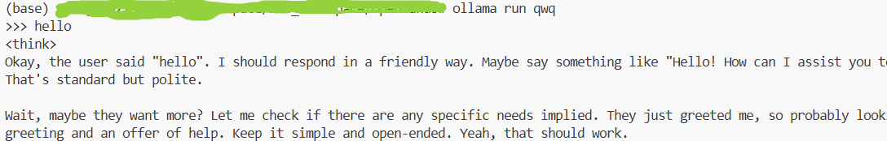

<!--
 * @Author: coffeecat
 * @Date: 2025-03-12 09:19:24
 * @LastEditors: Do not edit
 * @LastEditTime: 2025-03-12 15:56:24
-->

# ollama


## 部署qwq32B

官网ollama.com
下载ollama

```bash
curl -fsSL https://ollama.com/install.sh | sh
# 运行ollama
ollama serve
```

然后在模型中找到需要的模型，直接ollama run即可，如下图

此时，将自动pull下模型参数，并运行

如果直接用ollama run qwq的话，将开启一个对话框进行对话，

反之，无需ollama run，直接curl即可，上面的ollama serve将自动运行qwq
如下

### curl

```bash
 curl http://127.0.0.1:11434/api/generate -d '{"model": "qwq","prompt": "who are you?","stream":false}'
```


```bash
# 这个无法连接
 curl http://127.0.0.1:11434/v1 -d '{"model": "qwq","prompt
": "who are you?","stream":false,"api_key":"ollama"}'
```

### openai

下面这个正常输出

```python
from openai import OpenAI
 
client = OpenAI(
    base_url = 'http://localhost:11434/v1',
    api_key='ollama', # required, but unused
)
 
response = client.chat.completions.create(
  model="qwq",
  messages=[
    {"role": "system", "content": "You are a helpful assistant."},
    {"role": "user", "content": "Who won the world series in 2020?"},
    {"role": "assistant", "content": "The LA Dodgers won in 2020."},
    {"role": "user", "content": "Where was it played?"}
  ]
)
print(response.choices[0].message.content)
```

> conquer
> 合着 api_key=‘ollama’是必须要有的。。。
> 然后项目就正常跑起来了

### 运行单机多卡配置

```bash
export CUDA_VISIBLE_DEVICES=0,1,2,3
export OLLAMA_MAX_LOADED_MODELS=1
export OLLAMA_SCHED_SPREAD=1
export OLLAMA_KEEP_ALIVE=-1
export OLLAMA_HOST=0.0.0.0
export OLLAMA_PORT=11434
ollama serve
```

## 离线迁移
在windows系统中，通常是用户主目录下的.ollama文件夹，例如： C:\Users\wangk\.ollama；在Linux系统中，同样的，通常也是用户主目录下的.ollama文件夹，例如：/root/.ollam


在ollama主目录下，有两部分内容需要迁移
blobs和manifests文件夹


最后使用ollama list查看是否迁移成功


## docker启动

```bash
sudo docker run -it -p 11434:11434 --ipc=host -v ./:/xsc_workspace --gpus all --nam xsc_ollama pytorch/pytorch:latest
```

在一个docker容器启动，
并在另一个容器中连接内网，即xx.xx.x.xxx:11434成功。


