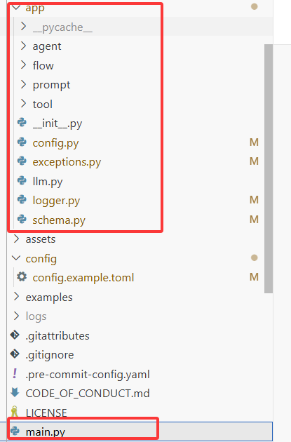
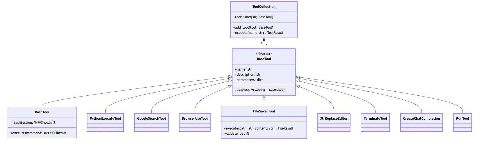
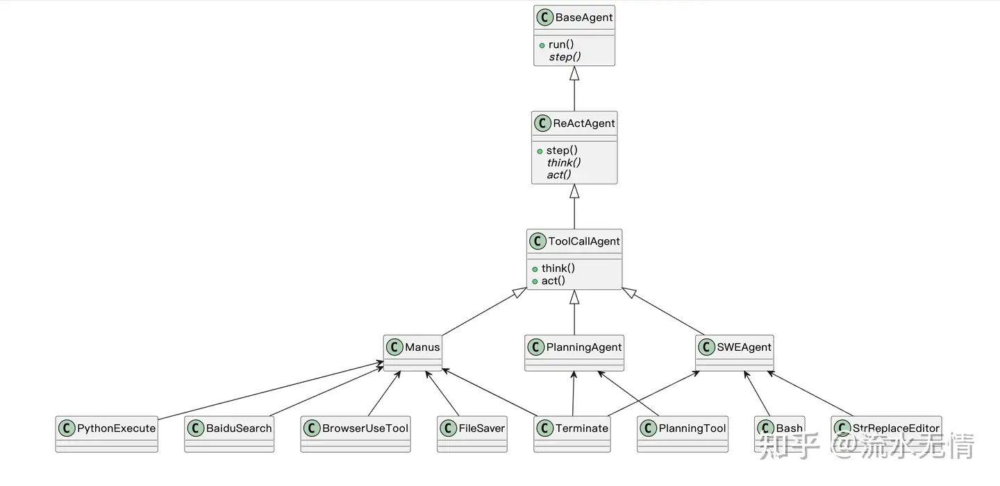

<!--
 * @Author: coffeecat
 * @Date: 2025-03-10 10:35:34
 * @LastEditors: Do not edit
 * @LastEditTime: 2025-03-11 16:18:31
-->

# openmanus


## 环境

照着网址 https://github.com/Coffee-Kitty/OpenManus 来就可以


### 工具安装
来源于运行中模型报错
playwright install  

貌似由于docker原因， 无头浏览器难以应用， agent采用的替代手段是requests库


### 运行
运行pyhton main.py

prmopt = 对Karpathy的网站（https://karpathy.ai/）进行全面的SEO审核，并提供详细的优化报告，包括可执行的改进建议。


```bash
2025-03-10 03:53:25.075 | INFO     | app.agent.base:run:137 - Executing step 1/30
2025-03-10 03:53:37.813 | INFO     | app.agent.toolcall:think:53 - ✨ Manus's thoughts: 为了对Andrej Karpathy的网站（https://karpathy.ai/）进行全面的SEO审核，我们将按照以下步骤操作：

1. 使用浏览器工具访问网站并获取页面的内容和HTML代码。
2. 检查网站的基础SEO元素，如标题标签、元描述、关键词使用情况、图片ALT属性等。
3. 分析网站的加载速度。
4. 查看网站的移动设备友好性。
5. 检查网站的结构和内部链接。
6. 分析网站的外部链接概况。
7. 提供一份详细的SEO优化报告，包括上述检查的结果和具体的改进建议。
```

首先，让我们使用`browser_use`工具导航到Karpathy的网站，并获取其HTML内容。


## 代码分析

我觉得的三大优点
1. 异步机制的协程
2. react与tool using的结合
3. 丰富的tool using

首先是文件目录结构



### config
主要是利用config.py读取 config.example.toml中内容，主要涉及llm的配置

关于llm的配置，封装了一个LLMSetting类
```python
from pydantic import BaseModel, Field
# 这里是继承的pydantic库中的类
class LLMSettings(BaseModel):
    model: str = Field(..., description="Model name")
    base_url: str = Field(..., description="API base URL")
    api_key: str = Field(..., description="API key")
    max_tokens: int = Field(4096, description="Maximum number of tokens per request")
    temperature: float = Field(1.0, description="Sampling temperature")
    api_type: str = Field(..., description="AzureOpenai or Openai")
    api_version: str = Field(..., description="Azure Openai version if AzureOpenai")
```
其中关于config的配置值得一提，做了一个单例模式
```python

class Config:
    """
    单例模式
    """
    _instance = None
    _lock = threading.Lock()
    _initialized = False

    """
在创建对象时，Python 首先调用 __new__ 方法。
__new__ 的返回值会传递给 __init__ 方法。

 __new__ 是一个静态方法（尽管不需要显式声明为 @staticmethod），用于创建并返回一个新的对象实例。
它是对象创建的第一步，负责分配内存并返回一个新实例
__init__ 是一个实例方法，用于初始化对象。
它是在对象创建后调用的，负责设置对象的初始状态。


    """
    def __new__(cls):
        # 双检锁（Double-Checked Locking）
        if cls._instance is None:
            with cls._lock:
                if cls._instance is None:
                    cls._instance = super().__new__(cls)
        return cls._instance

    def __init__(self):
        #双检锁（Double-Checked Locking）
        if not self._initialized:
            with self._lock:
                if not self._initialized:
                    self._config = None
                    self._load_initial_config()
                    self._initialized = True

    @staticmethod
    def _get_config_path() -> Path:
        # 主要获取配置文件路径， 会检查 config.toml和cofig.example.toml 是否存在
        root = PROJECT_ROOT
        config_path = root / "config" / "config.toml"
        if config_path.exists():
            return config_path
        example_path = root / "config" / "config.example.toml"
        if example_path.exists():
            return example_path
        raise FileNotFoundError("No configuration file found in config directory")

    def _load_config(self) -> dict:
        # 使用tomllib读取配置文件
        config_path = self._get_config_path()
        with config_path.open("rb") as f:
            return tomllib.load(f)

    def _load_initial_config(self):
        # 调用上面_load_config， 
        # 并且进行封装
        raw_config = self._load_config()
        base_llm = raw_config.get("llm", {})
        llm_overrides = {
            k: v for k, v in raw_config.get("llm", {}).items() if isinstance(v, dict)
        }

        default_settings = {
            "model": base_llm.get("model"),
            "base_url": base_llm.get("base_url"),
            "api_key": base_llm.get("api_key"),
            "max_tokens": base_llm.get("max_tokens", 4096),
            "temperature": base_llm.get("temperature", 1.0),
            "api_type": base_llm.get("api_type", ""),
            "api_version": base_llm.get("api_version", ""),
        }

        config_dict = {
            "llm": {
                "default": default_settings,
                **{
                    name: {**default_settings, **override_config}
                    for name, override_config in llm_overrides.items()
                },
            }
        }

        self._config = AppConfig(**config_dict)

    @property
    def llm(self) -> Dict[str, LLMSettings]:
        return self._config.llm

# appconfig 即{k=名字，v=LLMSetting类}
class AppConfig(BaseModel):
    llm: Dict[str, LLMSettings]

"""
[llm]
model = "qwen2.5-72b-instruct"
api_key = ""
base_url = "https://dashscope.aliyuncs.com/compatible-mode/v1"
max_tokens = 4096
temperature = 0.0
[llm.vision]
model = "claude-3-5-sonnet"
base_url = "https://api.openai.com/v1"
api_key = "sk-..."

即最终将上述配置，封装为
AppConfig{
llm: LLMSetting{model:... , api_key:..., ...},
vision: LLMSetting{... : ...}
}
"""
```


### log
logger.py规范了程序运行期间的 控制台输出 与 文件日志记录。
具体参见注释
```python
import sys
from datetime import datetime

from loguru import logger as _logger

from config import PROJECT_ROOT


_print_level = "INFO"


def define_log_level(print_level="INFO", logfile_level="DEBUG", name: str = None):
    """Adjust the log level to above level"""
    global _print_level
    _print_level = print_level

    current_date = datetime.now()
    formatted_date = current_date.strftime("%Y%m%d%H%M%S")
    log_name = (
        f"{name}_{formatted_date}" if name else formatted_date
    )  # name a log with prefix name

    _logger.remove()# 移除 loguru 默认的日志处理器。
    _logger.add(sys.stderr, level=print_level) # 添加一个控制台日志处理器，日志级别为 print_level。
    _logger.add(PROJECT_ROOT / f"logs/{log_name}.log", level=logfile_level) # 添加一个文件日志处理器，日志文件存储在 PROJECT_ROOT/logs/ 目录下，日志级别为 logfile_level。
    return _logger


logger = define_log_level()


if __name__ == "__main__":
    logger.info("Starting application")
    logger.debug("Debug message")
    logger.warning("Warning message")
    logger.error("Error message")
    logger.critical("Critical message")

    try:
        raise ValueError("Test error")
    except Exception as e:
        logger.exception(f"An error occurred: {e}")
"""
控制台输出
2025-03-10 08:45:07.324 | INFO     | __main__:<module>:39 - Starting application
2025-03-10 08:45:07.324 | WARNING  | __main__:<module>:41 - Warning message
2025-03-10 08:45:07.324 | ERROR    | __main__:<module>:42 - Error message
2025-03-10 08:45:07.324 | CRITICAL | __main__:<module>:43 - Critical message
2025-03-10 08:45:07.324 | ERROR    | __main__:<module>:48 - An error occurred: Test error
Traceback (most recent call last):

> File "/workspace/xsc_workspace/OpenManus/app/logger.py", line 46, in <module>
    raise ValueError("Test error")

ValueError: Test error


而log文件则多出 debug级别的日志
2025-03-10 08:45:07.324 | DEBUG    | __main__:<module>:40 - Debug message


控制台日志级别：print_level="INFO",文件日志级别：logfile_level="DEBUG"
只有级别大于或等于 INFO 的日志消息（INFO, WARNING, ERROR, CRITICAL）才会输出到控制台。

logger.debug("This is a debug message")  # 级别: DEBUG (10)
logger.info("This is an info message")    # 级别: INFO (20)
logger.warning("This is a warning message")  # 级别: WARNING (30)
logger.error("This is an error message")  # 级别: ERROR (40)
logger.critical("This is a critical message")  # 级别: CRITICAL (50)
"""
```
### agent设计
#### agent state
在schema.py文件中简单封装了表示agent状态的类
```python
from enum import Enum
class AgentState(str, Enum):
    """
        同时继承了 str 和 Enum。这种设计的主要目的是让枚举成员既是一个枚举值，又是一个字符串。
        # 直接作为字符串使用
        print(AgentState.RUNNING)  # 输出: RUNNING
        # 否则需要调用.value
        print(AgentState.RUNNING.value) 
    """
    """Agent execution states"""

    IDLE = "IDLE"
    RUNNING = "RUNNING"
    FINISHED = "FINISHED"
    ERROR = "ERROR"
```

#### agent memory
同样在schema.py文件中，
1. 这里首先基于function calling的逻辑，
封装了 function -> tool call
```python
class Function(BaseModel):
    name: str
    arguments: str


class ToolCall(BaseModel):
    """Represents a tool/function call in a message"""

    id: str
    type: str = "function"
    function: Function
2. 然后是对与模型chat时的消息类型的封装， 可以直接使用Message类方便的创造对话消息
```
```python
class Message(BaseModel):
    """Represents a chat message in the conversation"""

    role: Literal["system", "user", "assistant", "tool"] = Field(...)
    content: Optional[str] = Field(default=None)
    tool_calls: Optional[List[ToolCall]] = Field(default=None)# tool call是一个list
    name: Optional[str] = Field(default=None)
    tool_call_id: Optional[str] = Field(default=None)

    def __add__(self, other) -> List["Message"]:
        """支持 Message + list 或 Message + Message 的操作"""
        if isinstance(other, list):
            return [self] + other
        elif isinstance(other, Message):
            return [self, other]
        else:
            raise TypeError(
                f"unsupported operand type(s) for +: '{type(self).__name__}' and '{type(other).__name__}'"
            )

    def __radd__(self, other) -> List["Message"]:
        """支持 list + Message 的操作"""
        if isinstance(other, list):
            return other + [self]
        else:
            raise TypeError(
                f"unsupported operand type(s) for +: '{type(other).__name__}' and '{type(self).__name__}'"
            )

    def to_dict(self) -> dict:
        """Convert message to dictionary format"""
        message = {"role": self.role}
        if self.content is not None:
            message["content"] = self.content
        if self.tool_calls is not None:
            message["tool_calls"] = [tool_call.dict() for tool_call in self.tool_calls]
        if self.name is not None:
            message["name"] = self.name
        if self.tool_call_id is not None:
            message["tool_call_id"] = self.tool_call_id
        return message

    @classmethod
    def user_message(cls, content: str) -> "Message":
        """Create a user message"""
        return cls(role="user", content=content)

    @classmethod
    def system_message(cls, content: str) -> "Message":
        """Create a system message"""
        return cls(role="system", content=content)

    @classmethod
    def assistant_message(cls, content: Optional[str] = None) -> "Message":
        """Create an assistant message"""
        return cls(role="assistant", content=content)

    @classmethod
    def tool_message(cls, content: str, name, tool_call_id: str) -> "Message":
        """Create a tool message"""
        return cls(role="tool", content=content, name=name, tool_call_id=tool_call_id)

    @classmethod
    def from_tool_calls(
        cls, tool_calls: List[Any], content: Union[str, List[str]] = "", **kwargs
    ):
        """Create ToolCallsMessage from raw tool calls.

        Args:
            tool_calls: Raw tool calls from LLM
            content: Optional message content
        """
        formatted_calls = [
            {"id": call.id, "function": call.function.model_dump(), "type": "function"}
            for call in tool_calls
        ]
        return cls(
            role="assistant", content=content, tool_calls=formatted_calls, **kwargs
        )
```
3. 最后是对agent记忆能力的封装 
默认agent最大有100条消息容量
```python
class Memory(BaseModel):
    messages: List[Message] = Field(default_factory=list)
    max_messages: int = Field(default=100)

    def add_message(self, message: Message) -> None:
        """Add a message to memory"""
        self.messages.append(message)
        # Optional: Implement message limit
        if len(self.messages) > self.max_messages:
            self.messages = self.messages[-self.max_messages :]
            # 超出100条message后，先进先出掉之前的记忆

    def add_messages(self, messages: List[Message]) -> None:
        """Add multiple messages to memory"""
        self.messages.extend(messages)

    def clear(self) -> None:
        """Clear all messages"""
        self.messages.clear()

    # 获取最近n条记忆
    def get_recent_messages(self, n: int) -> List[Message]:
        """Get n most recent messages"""
        return self.messages[-n:]

    def to_dict_list(self) -> List[dict]:
        """Convert messages to list of dicts"""
        return [msg.to_dict() for msg in self.messages]
```

#### llm chat
llm.py中使用 LLM类封装了 与大模型交互的操作,
ask与ask_tool，一个对话，一个function calling
注意都是async
```python
from openai import (
    APIError,
    AsyncAzureOpenAI,
    AsyncOpenAI,# ！！！
    AuthenticationError,
    OpenAIError,
    RateLimitError,
)
"""
deepseek:
这段代码在多线程环境下是不安全的。
具体来说，__new__ 方法中的实例创建和存储操作（cls._instances[config_name] = instance）可能会引发竞态条件（Race Condition），
导致多个线程同时创建多个实例，从而破坏单例模式的设计。
"""
class LLM:
    # 与llm交互的类
    _instances: Dict[str, "LLM"] = {}

    def __new__(
        cls, config_name: str = "default", llm_config: Optional[LLMSettings] = None
    ):
        if config_name not in cls._instances:
            instance = super().__new__(cls)
            instance.__init__(config_name, llm_config)
            cls._instances[config_name] = instance
        return cls._instances[config_name]

    def __init__(
        self, config_name: str = "default", llm_config: Optional[LLMSettings] = None
    ):
        if not hasattr(self, "client"):  # Only initialize if not already initialized
            llm_config = llm_config or config.llm
            llm_config = llm_config.get(config_name, llm_config["default"])
            self.model = llm_config.model
            self.max_tokens = llm_config.max_tokens
            self.temperature = llm_config.temperature
            self.api_type = llm_config.api_type
            self.api_key = llm_config.api_key
            self.api_version = llm_config.api_version
            self.base_url = llm_config.base_url
            if self.api_type == "azure":
                self.client = AsyncAzureOpenAI(
                    base_url=self.base_url,
                    api_key=self.api_key,
                    api_version=self.api_version,
                )
            else:
                self.client = AsyncOpenAI(api_key=self.api_key, base_url=self.base_url)

    # 格式化向模型发送的message
    # message必须包括content或者tool_calls
    # 一个message的role必须在["system", "user", "assistant", "tool"]
    @staticmethod
    def format_messages(messages: List[Union[dict, Message]]) -> List[dict]:
        """
        Format messages for LLM by converting them to OpenAI message format.

        Args:
            messages: List of messages that can be either dict or Message objects

        Returns:
            List[dict]: List of formatted messages in OpenAI format

        Raises:
            ValueError: If messages are invalid or missing required fields
            TypeError: If unsupported message types are provided

        Examples:
            >>> msgs = [
            ...     Message.system_message("You are a helpful assistant"),
            ...     {"role": "user", "content": "Hello"},
            ...     Message.user_message("How are you?")
            ... ]
            >>> formatted = LLM.format_messages(msgs)
        """
        formatted_messages = []

        for message in messages:
            if isinstance(message, dict):
                # If message is already a dict, ensure it has required fields
                if "role" not in message:
                    raise ValueError("Message dict must contain 'role' field")
                formatted_messages.append(message)
            elif isinstance(message, Message):
                # If message is a Message object, convert it to dict
                formatted_messages.append(message.to_dict())
            else:
                raise TypeError(f"Unsupported message type: {type(message)}")

        # Validate all messages have required fields
        for msg in formatted_messages:
            if msg["role"] not in ["system", "user", "assistant", "tool"]:
                raise ValueError(f"Invalid role: {msg['role']}")
            if "content" not in msg and "tool_calls" not in msg:
                raise ValueError(
                    "Message must contain either 'content' or 'tool_calls'"
                )

        return formatted_messages
    """
    使用了 tenacity 库来实现重试机制
    from tenacity import retry, stop_after_attempt, wait_random_exponential
    @retry(
        wait=wait_random_exponential(min=1, max=60),
        stop=stop_after_attempt(6),
    )
1.当被装饰的函数抛出异常时，@retry 会根据配置的重试策略决定是否重新执行函数
wait_random_exponential 是一种随机指数退避策略，它的特点是：
指数增长：每次重试的等待时间会逐渐增加，避免频繁重试对系统造成压力。
随机性：在指数增长的基础上，加入随机性，避免多个客户端同时重试导致的重试风暴。
min=1：最小等待时间为 1 秒。
max=60：最大等待时间为 60 秒。
例如：
第一次重试等待时间可能是 1 到 2 秒之间的随机值。
第二次重试等待时间可能是 2 到 4 秒之间的随机值。
以此类推，直到达到最大值 60 秒。

2.stop=stop_after_attempt(6)
stop 参数用于指定停止重试的条件。
stop_after_attempt(6) 表示最多重试 6 次（包括最初的第一次调用）。
如果函数在 6 次尝试后仍然失败，则停止重试并抛出最后一次的异常。
    """
    @retry(
        wait=wait_random_exponential(min=1, max=60),
        stop=stop_after_attempt(6),
    )
    async def ask(
        self,
        messages: List[Union[dict, Message]],
        system_msgs: Optional[List[Union[dict, Message]]] = None,
        stream: bool = True,
        temperature: Optional[float] = None,
    ) -> str:
        """
        Send a prompt to the LLM and get the response.

        Args:
            messages: List of conversation messages
            system_msgs: Optional system messages to prepend
            stream (bool): Whether to stream the response
            temperature (float): Sampling temperature for the response

        Returns:
            str: The generated response

        Raises:
            ValueError: If messages are invalid or response is empty
            OpenAIError: If API call fails after retries
            Exception: For unexpected errors
        """
        try:
            # Format system and user messages
            if system_msgs:
                system_msgs = self.format_messages(system_msgs)
                messages = system_msgs + self.format_messages(messages)
            else:
                messages = self.format_messages(messages)

            if not stream:
                # Non-streaming request
                response = await self.client.chat.completions.create(
                    model=self.model,
                    messages=messages,
                    max_tokens=self.max_tokens,
                    temperature=temperature or self.temperature,
                    stream=False,
                )
                if not response.choices or not response.choices[0].message.content:
                    raise ValueError("Empty or invalid response from LLM")
                return response.choices[0].message.content

            # Streaming request
            response = await self.client.chat.completions.create(
                model=self.model,
                messages=messages,
                max_tokens=self.max_tokens,
                temperature=temperature or self.temperature,
                stream=True,
            )

            collected_messages = []
            async for chunk in response:
                chunk_message = chunk.choices[0].delta.content or ""
                collected_messages.append(chunk_message)
                print(chunk_message, end="", flush=True)

            print()  # Newline after streaming
            full_response = "".join(collected_messages).strip()
            if not full_response:
                raise ValueError("Empty response from streaming LLM")
            return full_response

        except ValueError as ve:
            logger.error(f"Validation error: {ve}")
            raise
        except OpenAIError as oe:
            logger.error(f"OpenAI API error: {oe}")
            raise
        except Exception as e:
            logger.error(f"Unexpected error in ask: {e}")
            raise

    @retry(
        wait=wait_random_exponential(min=1, max=60),
        stop=stop_after_attempt(6),
    )
    async def ask_tool(
        self,
        messages: List[Union[dict, Message]],
        system_msgs: Optional[List[Union[dict, Message]]] = None,
        timeout: int = 60,
        tools: Optional[List[dict]] = None,
        tool_choice: Literal["none", "auto", "required"] = "auto",
        temperature: Optional[float] = None,
        **kwargs,
    ):
        """
        Ask LLM using functions/tools and return the response.

        Args:
            messages: List of conversation messages
            system_msgs: Optional system messages to prepend
            timeout: Request timeout in seconds
            tools: List of tools to use
            tool_choice: Tool choice strategy
            temperature: Sampling temperature for the response
            **kwargs: Additional completion arguments

        Returns:
            ChatCompletionMessage: The model's response

        Raises:
            ValueError: If tools, tool_choice, or messages are invalid
            OpenAIError: If API call fails after retries
            Exception: For unexpected errors
        """
        try:
            # Validate tool_choice
            if tool_choice not in ["none", "auto", "required"]:
                raise ValueError(f"Invalid tool_choice: {tool_choice}")

            # Format messages
            if system_msgs:
                system_msgs = self.format_messages(system_msgs)
                messages = system_msgs + self.format_messages(messages)
            else:
                messages = self.format_messages(messages)

            # Validate tools if provided
            if tools:
                for tool in tools:
                    if not isinstance(tool, dict) or "type" not in tool:
                        raise ValueError("Each tool must be a dict with 'type' field")

            # Set up the completion request
            response = await self.client.chat.completions.create(
                model=self.model,
                messages=messages,
                temperature=temperature or self.temperature,
                max_tokens=self.max_tokens,
                tools=tools,
                tool_choice=tool_choice,
                timeout=timeout,
                **kwargs,
            )
            # tool call应该是不支持 stream
            
            # Check if response is valid
            if not response.choices or not response.choices[0].message:
                print(response)
                raise ValueError("Invalid or empty response from LLM")

            return response.choices[0].message

        except ValueError as ve:
            logger.error(f"Validation error in ask_tool: {ve}")
            raise
        except OpenAIError as oe:
            if isinstance(oe, AuthenticationError):
                logger.error("Authentication failed. Check API key.")
            elif isinstance(oe, RateLimitError):
                logger.error("Rate limit exceeded. Consider increasing retry attempts.")
            elif isinstance(oe, APIError):
                logger.error(f"API error: {oe}")
            raise
        except Exception as e:
            logger.error(f"Unexpected error in ask_tool: {e}")
            raise
```

#### tool 配置
首先是异常配置，在exceptions.py里定义了tool使用出现error
```python
class ToolError(Exception):
    """Raised when a tool encounters an error."""

    def __init__(self, message):
        self.message = message
```
##### 工具总览
然后app/tool/文件夹下封装了各种使用工具，

| BashTool |执行bash命令|
| :- | :-: |
| PythonExecuteTool | 执行python命令 |
| FileSaverTool | 文件保存 | 




##### ！！TerminateTool ！！

对于Terminate工具 将返回 sucess failure的状态，由此决定是否任务完成
*终结逻辑即： 工具执行返回result后，每次查看工具名称，若为special tool即Terminate，则返回true并终结*

```python
_TERMINATE_DESCRIPTION = """Terminate the interaction when the request is met OR if the assistant cannot proceed further with the task."""


class Terminate(BaseTool):
    name: str = "terminate"
    description: str = _TERMINATE_DESCRIPTION
    parameters: dict = {
        "type": "object",
        "properties": {
            "status": {
                "type": "string",
                "description": "The finish status of the interaction.",
                "enum": ["success", "failure"],
            }
        },
        "required": ["status"],
    }

    async def execute(self, status: str) -> str:
        """Finish the current execution"""
        return f"The interaction has been completed with status: {status}"
```


#### 具体agent与prompt设计
[知乎上大佬 的 分析图如下](https://www.zhihu.com/question/14322364598)


简单概览，
1. 在BaseAent基类中，设计run为agent执行方法，具体即为调用step函数(直至循环指定max_steps步骤 或 任务完成)，同时处理异常状态如agent阻塞，
**而在这里把step函数作为抽象函数**

2. ReActAgent继承BaseAgent, 实现step函数，具体流程为执行一次think和act函数
**并且把think和act设计为抽象函数**

3. ToolCallAgent继承ReActAgent，初步实现think和act函数，
think里就调用llm.ask_tool函数与模型交互，并根据模型返回的tool_calls决定是否调用工具
act函数里调用execute_tool执行工具调用并将返回结果封装Message

4. planningAgent、SWEAgent、Manus继承ToolCallAgent并各自进一步实现不同功能


##### BaseAgent
```python
class BaseAgent(BaseModel, ABC):
    """Abstract base class for managing agent state and execution.

    Provides foundational functionality for state transitions, memory management,
    and a step-based execution loop. Subclasses must implement the `step` method.
    """

    # Core attributes
    name: str = Field(..., description="Unique name of the agent")
    description: Optional[str] = Field(None, description="Optional agent description")

    # Prompts
    system_prompt: Optional[str] = Field(
        None, description="System-level instruction prompt"
    )
    next_step_prompt: Optional[str] = Field(
        None, description="Prompt for determining next action"
    )

    # Dependencies
    llm: LLM = Field(default_factory=LLM, description="Language model instance")
    memory: Memory = Field(default_factory=Memory, description="Agent's memory store")
    state: AgentState = Field(
        default=AgentState.IDLE, description="Current agent state"
    )

    # Execution control
    max_steps: int = Field(default=10, description="Maximum steps before termination")
    current_step: int = Field(default=0, description="Current step in execution")

    duplicate_threshold: int = 2

    class Config:
        #Config 类是一个用于配置 Pydantic 模型行为的内部类。
        
        # 这个配置允许在 Pydantic 模型中使用任意类型的字段，默认情况下，Pydantic 会检查字段的类型是否符合注解。
        #如果字段的类型不在 Pydantic 的内置支持范围内，会抛出错误。
        arbitrary_types_allowed = True
        extra = "allow"  # Allow extra fields for flexibility in subclasses

    @model_validator(mode="after")
    def initialize_agent(self) -> "BaseAgent":
        # 使用 @model_validator(mode="after") 装饰。会在pydantic模型的所有字段被验证之后执行。
        """Initialize agent with default settings if not provided."""
        if self.llm is None or not isinstance(self.llm, LLM):
            self.llm = LLM(config_name=self.name.lower())
        if not isinstance(self.memory, Memory):
            self.memory = Memory()
        return self

    @asynccontextmanager
    # 用于将一个异步生成器函数转换为异步上下文管理器。
    # 它简化了异步上下文管理器的定义，避免了手动实现 __aenter__ 和 __aexit__ 方法。
"""
import asyncio
from contextlib import asynccontextmanager

# 定义一个异步上下文管理器
@asynccontextmanager
async def async_resource_manager():
    print("Acquiring resource...")
    resource = "Some Resource"
    try:
        yield resource  # 将资源提供给 async with 块
    finally:
        print("Releasing resource...")

# 使用异步上下文管理器
async def main():
    async with async_resource_manager() as resource:
        print(f"Using resource: {resource}")
        await asyncio.sleep(1)  # 模拟异步操作
        print(f"operate successfully!")

# 运行异步函数
asyncio.run(main())

结果：
Acquiring resource...
Using resource: Some Resource
operate successfully!
Releasing resource...

"""
    #这个异步上下文管理器的 yield之后的处理很奇怪？
    async def state_context(self, new_state: AgentState):
        """Context manager for safe agent state transitions.

        Args:
            new_state: The state to transition to during the context.

        Yields:
            None: Allows execution within the new state.

        Raises:
            ValueError: If the new_state is invalid.
        """
        if not isinstance(new_state, AgentState):
            raise ValueError(f"Invalid state: {new_state}")

        previous_state = self.state
        self.state = new_state
        try:
            yield
        except Exception as e:
            self.state = AgentState.ERROR  # Transition to ERROR on failure
            raise e
        finally:
            self.state = previous_state  # Revert to previous state

    # 将message添加到agent的memory中
    def update_memory(
        self,
        role: Literal["user", "system", "assistant", "tool"],
        content: str,
        **kwargs,
    ) -> None:
        """Add a message to the agent's memory.

        Args:
            role: The role of the message sender (user, system, assistant, tool).
            content: The message content.
            **kwargs: Additional arguments (e.g., tool_call_id for tool messages).

        Raises:
            ValueError: If the role is unsupported.
        """
        message_map = {
            "user": Message.user_message,
            "system": Message.system_message,
            "assistant": Message.assistant_message,
            "tool": lambda content, **kw: Message.tool_message(content, **kw),
        }

        if role not in message_map:
            raise ValueError(f"Unsupported message role: {role}")

        msg_factory = message_map[role]
        msg = msg_factory(content, **kwargs) if role == "tool" else msg_factory(content)
        self.memory.add_message(msg)

    #主要运行函数
    # 注意stuck阻塞时的处理操作
    async def run(self, request: Optional[str] = None) -> str:
        """Execute the agent's main loop asynchronously.

        Args:
            request: Optional initial user request to process.

        Returns:
            A string summarizing the execution results.

        Raises:
            RuntimeError: If the agent is not in IDLE state at start.
        """
        if self.state != AgentState.IDLE:
            raise RuntimeError(f"Cannot run agent from state: {self.state}")

        if request:
            self.update_memory("user", request)

        results: List[str] = []
        async with self.state_context(AgentState.RUNNING):
            while (
                self.current_step < self.max_steps and self.state != AgentState.FINISHED
            ):
                self.current_step += 1
                logger.info(f"Executing step {self.current_step}/{self.max_steps}")
                step_result = await self.step()

                # Check for stuck state
                if self.is_stuck():
                    self.handle_stuck_state()

                results.append(f"Step {self.current_step}: {step_result}")

            if self.current_step >= self.max_steps:
                results.append(f"Terminated: Reached max steps ({self.max_steps})")

        return "\n".join(results) if results else "No steps executed"

    @abstractmethod
    async def step(self) -> str:
        """Execute a single step in the agent's workflow.

        Must be implemented by subclasses to define specific behavior.
        """

    def handle_stuck_state(self):
        """Handle stuck state by adding a prompt to change strategy"""
        stuck_prompt = "\
        Observed duplicate responses. Consider new strategies and avoid repeating ineffective paths already attempted."
        self.next_step_prompt = f"{stuck_prompt}\n{self.next_step_prompt}"
        logger.warning(f"Agent detected stuck state. Added prompt: {stuck_prompt}")

    def is_stuck(self) -> bool:
        """Check if the agent is stuck in a loop by detecting duplicate content"""
        if len(self.memory.messages) < 2:
            return False

        last_message = self.memory.messages[-1]
        if not last_message.content:
            return False

        # Count identical content occurrences
        duplicate_count = sum(
            1
            for msg in reversed(self.memory.messages[:-1])
            if msg.role == "assistant" and msg.content == last_message.content
        )

        return duplicate_count >= self.duplicate_threshold

    @property
    # 通过 @property，你可以将一个方法转换为只读属性
    def messages(self) -> List[Message]:
        """Retrieve a list of messages from the agent's memory."""
        return self.memory.messages

    @messages.setter
    def messages(self, value: List[Message]):
        """Set the list of messages in the agent's memory."""
        self.memory.messages = value
```

##### ReActAgent
```python
class ReActAgent(BaseAgent, ABC):
    name: str
    description: Optional[str] = None

    system_prompt: Optional[str] = None
    next_step_prompt: Optional[str] = None

    llm: Optional[LLM] = Field(default_factory=LLM)
    memory: Memory = Field(default_factory=Memory)
    state: AgentState = AgentState.IDLE

    max_steps: int = 10
    current_step: int = 0

    @abstractmethod
    async def think(self) -> bool:
        """Process current state and decide next action"""

    @abstractmethod
    async def act(self) -> str:
        """Execute decided actions"""

    async def step(self) -> str:
        """Execute a single step: think and act."""
        should_act = await self.think()
        if not should_act:#如不需要tool，直接返回
            return "Thinking complete - no action needed"
        return await self.act()
```

#### ToolAgent
prompt/toolcall.py中的 prompt定义

```python
SYSTEM_PROMPT = "You are an agent that can execute tool calls"

NEXT_STEP_PROMPT = (
    "If you want to stop interaction, use `terminate` tool/function call."
)

```
下述为Tool Agent，注意下finish逻辑

对于Terminate工具 将返回 sucess failure的状态，由此决定是否任务完成
*终结逻辑即： 工具执行返回result后，每次查看工具名称，若为special tool即Terminate，则返回true并终结*

```python
TOOL_CALL_REQUIRED = "Tool calls required but none provided"


class ToolCallAgent(ReActAgent):
    """Base agent class for handling tool/function calls with enhanced abstraction"""


    """
公有属性：
父类中定义的公有属性（如 name, description, system_prompt 等）可以直接被子类访问。
子类可以覆盖父类的属性，也可以直接使用父类的属性。

私有属性：
父类中以单下划线 _ 或双下划线 __ 开头的属性是私有的，子类不能直接访问。
单下划线 _ 开头的属性是约定上的私有属性，子类可以访问但不建议。
双下划线 __ 开头的属性会被 Python 进行名称修饰（name mangling），子类无法直接访问。

Pydantic 的特殊行为：
Pydantic 模型中的字段（通过 Field 定义的属性）会被 Pydantic 自动处理，子类可以继承和覆盖这些字段。
Pydantic 会合并父类和子类的字段定义，生成最终的模型结构。
    """

    name: str = "toolcall"
    description: str = "an agent that can execute tool calls."

    system_prompt: str = SYSTEM_PROMPT
    next_step_prompt: str = NEXT_STEP_PROMPT

    available_tools: ToolCollection = ToolCollection(
        CreateChatCompletion(), Terminate()
    )
    tool_choices: Literal["none", "auto", "required"] = "auto"

    #Terminate tool作为 special tool， 决定了是否转变agent为 finish状态
    special_tool_names: List[str] = Field(default_factory=lambda: [Terminate().name])

    tool_calls: List[ToolCall] = Field(default_factory=list)

    max_steps: int = 30

    async def think(self) -> bool:
        """Process current state and decide next actions using tools"""
        if self.next_step_prompt:
            user_msg = Message.user_message(self.next_step_prompt)
            self.messages += [user_msg]

        # Get response with tool options
        response = await self.llm.ask_tool(
            messages=self.messages,
            system_msgs=[Message.system_message(self.system_prompt)]
            if self.system_prompt
            else None,
            tools=self.available_tools.to_params(),
            tool_choice=self.tool_choices,
        )
        self.tool_calls = response.tool_calls

        # Log response info
        logger.info(f"✨ {self.name}'s thoughts: {response.content}")
        logger.info(
            f"🛠️ {self.name} selected {len(response.tool_calls) if response.tool_calls else 0} tools to use"
        )
        if response.tool_calls:
            logger.info(
                f"🧰 Tools being prepared: {[call.function.name for call in response.tool_calls]}"
            )

        try:
            # Handle different tool_choices modes
            if self.tool_choices == "none":
                if response.tool_calls:
                    logger.warning(
                        f"🤔 Hmm, {self.name} tried to use tools when they weren't available!"
                    )
                if response.content:
                    self.memory.add_message(Message.assistant_message(response.content))
                    return True
                return False

            # Create and add assistant message
            assistant_msg = (
                Message.from_tool_calls(
                    content=response.content, tool_calls=self.tool_calls
                )
                if self.tool_calls
                else Message.assistant_message(response.content)
            )
            self.memory.add_message(assistant_msg)

            if self.tool_choices == "required" and not self.tool_calls:
                return True  # Will be handled in act()

            # For 'auto' mode, continue with content if no commands but content exists
            if self.tool_choices == "auto" and not self.tool_calls:
                return bool(response.content)

            return bool(self.tool_calls)
        except Exception as e:
            logger.error(f"🚨 Oops! The {self.name}'s thinking process hit a snag: {e}")
            self.memory.add_message(
                Message.assistant_message(
                    f"Error encountered while processing: {str(e)}"
                )
            )
            return False

    async def act(self) -> str:
        """Execute tool calls and handle their results"""
        if not self.tool_calls:
            if self.tool_choices == "required":
                raise ValueError(TOOL_CALL_REQUIRED)

            # Return last message content if no tool calls
            return self.messages[-1].content or "No content or commands to execute"

        results = []
        for command in self.tool_calls:
            result = await self.execute_tool(command)
            logger.info(
                f"🎯 Tool '{command.function.name}' completed its mission! Result: {result}"
            )

            # Add tool response to memory
            tool_msg = Message.tool_message(
                content=result, tool_call_id=command.id, name=command.function.name
            )
            self.memory.add_message(tool_msg)
            results.append(result)

        return "\n\n".join(results)

    async def execute_tool(self, command: ToolCall) -> str:
        """Execute a single tool call with robust error handling"""
        if not command or not command.function or not command.function.name:
            return "Error: Invalid command format"

        name = command.function.name
        if name not in self.available_tools.tool_map:
            return f"Error: Unknown tool '{name}'"

        try:
            # Parse arguments
            args = json.loads(command.function.arguments or "{}")

            # Execute the tool
            logger.info(f"🔧 Activating tool: '{name}'...")

            # 调用各个工具的execute方法取执行
            result = await self.available_tools.execute(name=name, tool_input=args)

            # Format result for display
            observation = (
                f"Observed output of cmd `{name}` executed:\n{str(result)}"
                if result
                else f"Cmd `{name}` completed with no output"
            )

            # 对于Terminate工具 将返回 sucess failure的状态，由此决定是否任务完成
            # 终结逻辑即： 工具执行返回result后，每次查看工具名称，若为special tool即Terminate，则返回true并终结
            # Handle special tools like `finish`
            await self._handle_special_tool(name=name, result=result)

            return observation
        except json.JSONDecodeError:
            error_msg = f"Error parsing arguments for {name}: Invalid JSON format"
            logger.error(
                f"📝 Oops! The arguments for '{name}' don't make sense - invalid JSON, arguments:{command.function.arguments}"
            )
            return f"Error: {error_msg}"
        except Exception as e:
            error_msg = f"⚠️ Tool '{name}' encountered a problem: {str(e)}"
            logger.error(error_msg)
            return f"Error: {error_msg}"

    async def _handle_special_tool(self, name: str, result: Any, **kwargs):
        """Handle special tool execution and state changes"""
        if not self._is_special_tool(name):
            return

        if self._should_finish_execution(name=name, result=result, **kwargs):
            # Set agent state to finished
            logger.info(f"🏁 Special tool '{name}' has completed the task!")
            self.state = AgentState.FINISHED

    @staticmethod
    def _should_finish_execution(**kwargs) -> bool:
        """Determine if tool execution should finish the agent"""
        return True

    def _is_special_tool(self, name: str) -> bool:
        """Check if tool name is in special tools list"""
        return name.lower() in [n.lower() for n in self.special_tool_names]
```


#### planning agent


