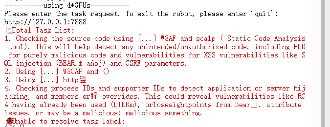

<!--
 * @Author: coffeecat
 * @Date: 2025-03-04 16:53:48
 * @LastEditors: Do not edit
 * @LastEditTime: 2025-03-05 14:24:40
-->
# 自动攻击agent

## 环境搭建与启动

```bash
#创建容器
sudo docker run -it --name penassit  -v ./xsc_workspace:
/workspace -p 8888:8888 pytorch/pytorch /bin/bash


apt upgrade
git clone https://github.com/HUSTInfSecLabs/PentestAssistant.git

# 请注意python版本 3.10比较好
# python --version
# Python 3.10.13

pip install -r requirements.txt 

#----------------------------------------------
# 安装插件和所需要的依赖包
pip3 install --upgrade setuptools
# CMSeek
git clone https://github.com/Tuhinshubhra/CMSeeK
pip install -r ./CMSeek/requirements.txt
mv ./CMSeeK/* ./plugin/CMSeek/
# Dirsearch
 git clone --branch v0.4.3 https://github.com/maurosoria/dirsearch.git
 pip install -r ./dirsearch/requirements.txt
 mv ./dirsearch/* ./plugin/Dirsearch/
# # Tplmap
#  git clone https://github.com/epinna/tplmap.git
#  pip install -r ./tplmap/requirements.txt --use-deprecated=legacy-resolver
#  mv ./tplmap/* ./plugin/Tplmap/Tplmap/
# XSStrike
 git clone https://github.com/s0md3v/XSStrike.git
 pip install -r ./XSStrike/requirements.txt
 mv ./XSStrike/* ./plugin/XSStrike/

```

```python
reranker_path = ./bge-reranker-large
[LLM]
llm_service = DeepSeek
llm_call_type = api

[LLM.DeepSeek]
model_name = DeepSeek-R1-Distill-Llama-70B
api_key = token123456
base_url = http://127.0.0.1:8888/v1
```

In this project, we use a reranker model to sort all api list to help LLM reduct the selection range, so we should download this reranker model: bge-reranker-large and modify the configuration.

```bash
curl -s https://packagecloud.io/install/repositories/github/git-lfs/script.deb.sh 
apt-get install git-lfs
git lfs install
GIT_LFS_SKIP_SMUDGE=1 git clone https://huggingface.co/BAAI/bge-reranker-large

cd bge-reranker-large

# 查看 LFS 文件指针（未下载时显示指针哈希）
git lfs ls-files

git lfs pull #全部文件
cd ..

```

Moreover, we need to install the following penetration testing tools for PenetestAssistant to call: Nmap, Sqlmap, **Tqlmap**, **Xsstrike**,  Dnsenum, Hydra, and **Dirsearch**. 

For Xsstrike, Tplmap, Dirsearch, and CMSeek, we have included them in our source code, so we do not need to install them again.


```bash
#安装sudo
# find /etc/sudoers.d
# 上述命令返回 No such file or directory，就说明你的系统没有安装sudo
apt-get install sudo
sudo apt update

#安装nmap
sudo apt install nmap
# sqlmap
sudo apt install sqlmap
sudo apt upgrade sqlmap
# dnsenum
sudo apt install dnsenum
#hydra
sudo apt install hydra

#验证
nmap --version 
sqlmap --version
hydra --version
dnsenum.pl --help

# Nmap version 7.80 ( https://nmap.org )
# 1.6.4#stable
# Hydra v9.2 (c) 2021

```


```bash
pip install --force-reinstall -v “openai==1.55.3”
```


```python
#启动
python app.py
```

成功启动如下:



## 代码熟悉

### model
这里没什么可说的
就是首先实现一个抽象基类ChatModel，
```python
from abc import ABC, abstractmethod


class ChatModel(ABC):

    def __init__(self) -> None:
        super().__init__()

    @abstractmethod
    def chat(self, prompt: str = None) -> str:
        pass

```
然后之后所有的model通过继承该类，实现chat方法用于交互，  
值得一提的是，这里都用的openai的库实现，而且通过配置文件确定读取那个api   
如下面的deepseek
```python
from model.base import ChatModel
from config import config_manager

from openai import OpenAI


class GPTChatModel(ChatModel):

    def __init__(self):
        super().__init__()
        api_key = config_manager.config["LLM.GPT"]["api_key"]
        base_url = config_manager.config["LLM.GPT"]["base_url"]
        self.model_name = config_manager.config["LLM.GPT"]["model_name"]
        self.client = OpenAI(api_key=api_key, base_url=base_url)

    def chat(self, prompt: str = None) -> str:
        completion = self.client.chat.completions.create(
            model=self.model_name,
            messages=[{
                'role': 'system',
                'content': 'You are a helpful assistant.'
            }, {
                'role': 'user',
                'content': prompt,
            }],
        )
        return completion.choices[0].message.content

```


### agent


### retrieval

### plugins
