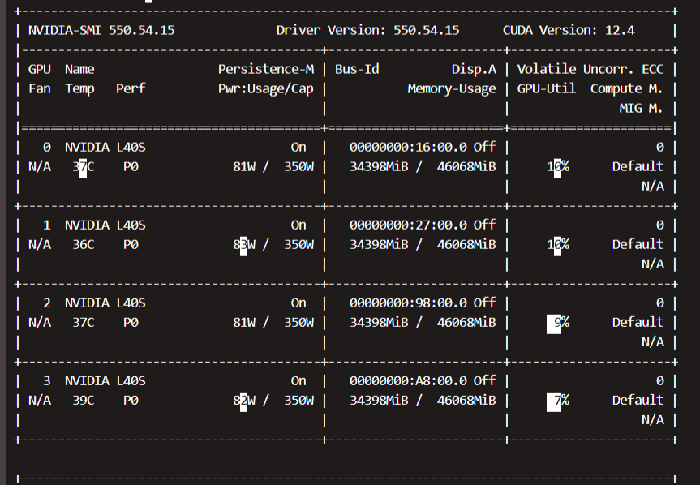

# vllm部署deepseek
## 环境准备
### GPU显存估计


相较于预训练减少了模型梯度，优化器状态，同时激活值开销也降低
deepseek
部署需要考虑 模型参数， 激活值、还有部分函数库的开销

> 没想明白
> 只知道要算三个部分
> 1.模型参数，  使用bf16激活， 则 1B模型将需要  1B * 16/8 = 2G参数
> 2.激活值  batchsize * seq * hidden * 1 (训练时技术优化为2， 推理部署时貌似变成*1)
> 3.函数库等的加载开销

> 这里使用vllm， vllm将分页管理显存，还需vllm框架的开销

### 下载DeepSeek-R1-Distill-Llama-70B
使用git lfs拉取
```bash

curl -s https://packagecloud.io/install/repositories/github/git-lfs/script.deb.sh 
apt-get install git-lfs
git lfs install

#GIT_LFS_SKIP_SMUDGE=1：这是一个环境变量设置。在 Git LFS 中，smudge 操作是指在检出文件时将 LFS 指针文件替换为实际的大文件。当设置 GIT_LFS_SKIP_SMUDGE=1 时，Git 在克隆或检出操作过程中会跳过这个 smudge 过程，也就是不会下载实际的大文件，而是只下载 LFS 指针文件。这些指针文件是小文本文件，它们指向存储在 LFS 服务器上的实际大文件。
GIT_LFS_SKIP_SMUDGE=1 git clone https://huggingface.co/deepseek-ai/DeepSeek-R1-Distill-Llama-70B

cd DeepSeek-R1-Distill-Llama-70B

# 查看 LFS 文件指针（未下载时显示指针哈希）
git lfs ls-files

git lfs pull #全部文件


```


### 下载DeepSeek-R1-Distill-Qwen-1.5B
上面下载太慢，先下个1.5B的试下    
```bash
# hf网址
https://huggingface.co/deepseek-ai/DeepSeek-R1-Distill-Qwen-1.5B

```

```bash
# 先别全下载
GIT_LFS_SKIP_SMUDGE=1 git clone https://huggingface.co/deepseek-ai/DeepSeek-R1-Distill-Qwen-1.5B

cd DeepSeek-R1-Distill-Qwen-1.5B

# 查看 LFS 文件指针（未下载时显示指针哈希）
git lfs ls-files

git lfs pull #全部文件

```


## vllm部署DeepSeek-R1-Distill-Qwen-1.5B
先用4卡， 2TP2PP
```bash
pip install vllm
# 命令中每行结尾的反斜杠 \ 是用于续行的，但它后面不能有空格，有空格会导致语法错误，需要去掉空格。修正后的命令如下：
vllm serve ./DeepSeek-R1-Distill-Qwen-1.5B  \
    --host 0.0.0.0 --port 7888 \

    --dtype float32 \
    --pipeline-parallel-size 2 \
    --tensor-parallel-size 2

```

### 调用
下面调用，
使用curl也行，
使用openai也行，因为与openai协议兼容

    --api-key "token123456" \ 咋curl没学会,先不加，使用openai函数时再加

#### curl
```bash 
# Call the server using curl:
curl -X POST "http://localhost:7888/v1/chat/completions" \
	-H "Content-Type: application/json" \
	--data '{
		"model": "DeepSeek-R1-Distill-Qwen-1.5B",
		"messages": [
			{
				"role": "user",
				"content": "What is the capital of France?"
			}
		]
	}'
```
成功


使用nvidia-smi查看显存，占用很大，应该是vllm做了显存的页式管理？


下面是单卡启动的显存图示


#### openai
```python
from openai import OpenAI
client = OpenAI(
    base_url="http://127.0.0.1:7888/v1",
    api_key="token123456", #启动时加上key
)


completion = client.chat.completions.create(
  model="DeepSeek-R1-Distill-Qwen-1.5B",
  messages=[
    {"role": "user", "content": "Hello!"}
  ]
)


print(completion.choices[0].message)
```
同样成功调用


> 最后有一个问题，这开了个vllm把7888端口给占用了， jupyter-notebook无法连接了

> 在容器内部换个端口，然后通过7888远程访问容器jupyter，然后jupyter内部又能够访问vllm server 即可

更换端口为 8888？即可


路径很奇怪，但确实成功启动了，这里的模型选择应该就是对服务器说选择那个模型，不涉及模型的参数文件的具体路径


#### langchain
```py
from langchain_openai import ChatOpenAI

llm = ChatOpenAI(
    model='DeepSeek-R1-Distill-Qwen-1.5B', 
    openai_api_key='token123456', 
    openai_api_base='http://127.0.0.1:8888/v1',
    max_tokens=128
)

response = llm.invoke("给我一个很土但是听起来很好养活的男孩小名", temperature=1)
print(response.content)
```


下面使用langchain的集成 deepseek库调用
https://python.langchain.com/api_reference/deepseek/chat_models/langchain_deepseek.chat_models.ChatDeepSeek.html
```python

from langchain_deepseek import ChatDeepSeek 
llm = ChatDeepSeek(
    api_key='token123456', 
    api_base='http://127.0.0.1:8888/v1',
    model="DeepSeek-R1-Distill-Qwen-1.5B", 
    temperature=0, 
    max_tokens=None,
    timeout=None, 
    max_retries=2,
    # other params... 
    )

messages = [ 
    ("system", "You are a helpful translator. Translate the user sentence to French."),
    ("human", "I love programming."), 
] 
llm.invoke(messages)
```

也成功调用


## vllm部署DeepSeek-R1-Distill-Llama-70B

```bash
vllm serve DeepSeek-R1-Distill-Llama-70B  \
            --host 0.0.0.0 --port 8888 \
                    --dtype float16 \
                        --pipeline-parallel-size 2 \
                            --tensor-parallel-size 2 \
                            --api-key 'token123456'
```
报错，显存不够

下图为llama3的70b的架构，llama3.3的不知道

> ok
> 来算一下显存，首先总共用4张l40s，即46G*4 = 184G
> 1. 模型参数， 梯度优化器不考虑，则参数70B所占用显存为：70.6B param bfloat16
> 则约为70.6*2 = 141.2G
> 2. 推理数据所用， 正常为4\*bs\*seq\*hid，训练优化为2\*bs\*seq\*hid,推理则为\*bs\*seq\*hid
> 模型hid约为 8192 / 1024 =8k
> 则有  bs\*seq <=  42G / 8k = 5.2M
> 而llama3 支持的context为没找到，  这里直接设置 bs为128，
> 然后如果直接设置seq为 8\*5\*1024 则直接把显存占满了， 所有所以设置为 20k吧
> 那么推理数据所用参数则约为 128\*20k\*8k = 20G
> bs这里可以用线程池优化啥的
> 3. 框架占用
> pytorch框架1GB, 其他不知道
>
> 4. 也就是剩了大概 20G可以让vllm做kv cache缓存

```bash
vllm serve DeepSeek-R1-Distill-Llama-70B  \
            --host 0.0.0.0 --port 8888 \
            --dtype bfloat16 \
            --pipeline-parallel-size 2 \
            --tensor-parallel-size 2 \
            --api-key 'token123456' \
            --max-model-len 73712

```
> 注意，到目前为止， 没学好咋用vllm更改bs 和 seq
> 照着上面的报错信息 更改max-model-len为73712，然后成功启动
如下图


```python

from langchain_deepseek import ChatDeepSeek 
llm = ChatDeepSeek(
    api_key='token123456', 
    api_base='http://127.0.0.1:8888/v1',
    model="DeepSeek-R1-Distill-Llama-70B", 
    temperature=0, 
    max_tokens=None,
    timeout=None, 
    max_retries=2,
    # other params... 
    )

messages = [ 
    ("system", "You are a helpful translator. Translate the user sentence to French."),
    ("human", "I love programming."), 
] 
llm.invoke(messages)
```
成功调用，但延时略高


查看显存
> watch [选项] 命令
> 常用选项
> -n <秒数>：指定刷新间隔时间（默认为 2 秒）。
> -d 或 --differences：高亮显示输出的变化部分。
> -t 或 --no-title：不显示标题信息（即不显示命令和时间戳）。
> -c 或 --color：支持彩色输出（如果命令支持彩色）。

```bash
watch -n 1 -d -c nvidia-smi
```

再如下图是处理时的显存情况


### bottleneck vllm参数配置
#### 显存利用率设置
如上图可见，显存利用率较低,修改显存利用为1试试

```bash
vllm serve DeepSeek-R1-Distill-Llama-70B  \
            --host 0.0.0.0 --port 8888 \
            --dtype bfloat16 \
            --pipeline-parallel-size 2 \
            --tensor-parallel-size 2 \
            --api-key 'token123456' \
            --gpu-memory-utilization 1

```
同样成功启动如下图

处理token时，显存显示如下


> 暂且做到这里，然后开始做agent

*  当刚开始启动时，发现显存占用为 35G * 4 =140G，也就是说，只需要启动模型参数，然后框架自身， 最后根据cpu利用率其自动调整分页方式，管理推理时显存
 

#### 工具调用
```python
from langchain_openai import ChatOpenAI

llm = ChatOpenAI(
    model='DeepSeek-R1-Distill-Llama-70B', 
    openai_api_key='token123456', 
    openai_api_base='http://127.0.0.1:8888/v1',
    max_tokens=128,
     
)


from langchain_core.tools import tool

@tool
def add(a: int, b: int) -> int:
    """Adds a and b."""
    return a + b


@tool
def multiply(a: int, b: int) -> int:
    """Multiplies a and b."""
    return a * b


tools = [add, multiply]


llm_with_tools = llm.bind_tools(tools=[add, multiply],)
query = "What is 3 * 12? Also, what is 11 + 49?"
llm_with_tools.invoke(query).invalid_tool_calls 
```

BadRequestError: Error code: 400 - {'object': 'error', 'message': '"auto" tool choice requires --enable-auto-tool-choice and --tool-call-parser to be set', 'type': 'BadRequestError', 'param': None, 'code': 400


最后在vllm中找到答案
```bash
vllm serve DeepSeek-R1-Distill-Llama-70B  \
            --host 0.0.0.0 --port 8888 \
            --dtype bfloat16 \
            --pipeline-parallel-size 2 \
            --tensor-parallel-size 2 \
            --api-key 'token123456' \
            --gpu-memory-utilization 1 
            --enable-auto-tool-choice \
            --tool-call-parser llama3_json
           
```