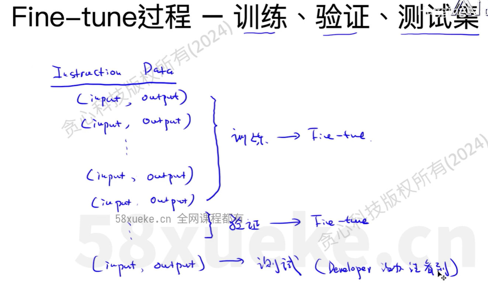
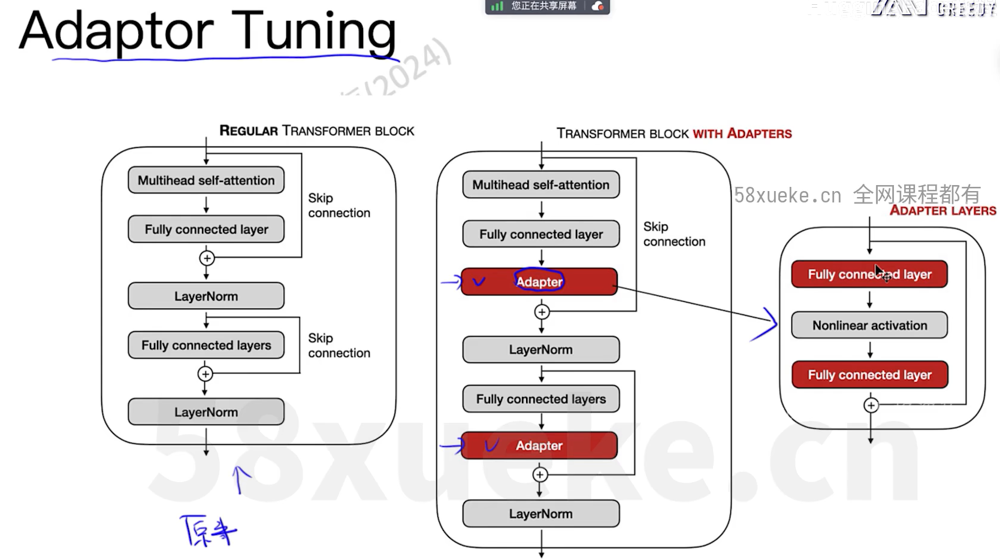
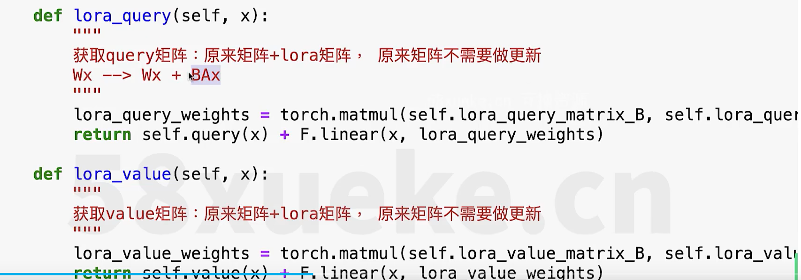
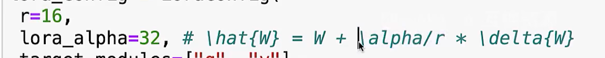
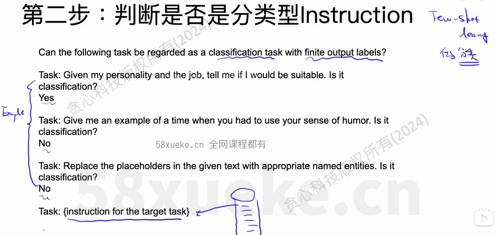

[源于b站huggingface教程](https://www.bilibili.com/video/BV1r9ieYhEuZ/?spm_id_from=333.1007.top_right_bar_window_default_collection.content.click&vd_source=39767bfbc4ae772d0c2f8d8b32b54ce6)

[transformers理解](https://towardsdatascience.com/transformers-explained-visually-part-1-overview-of-functionality-95a6dd460452)

## Transformer

chatgpt的发展:

​	transformer分为编码器和解码器，由此，产生了encoder-only、decoder-only、还有encoder-decoder三种模型

大模型范式下的学习
	相较于传统的深度学习->每个任务都需要大量标注数据并从零训练，而基于大模型的预训练-微调范式仅仅需要少量数据微调预训练大模型,试图激发预训练中获得的相关知识并利用获取的通用能力快速掌握本领域知识

大模型是如何练成的

一般的训练阶段：预训练、后训练（sft、alignment）

训练大模型有大概三种方式：

1）从0开始 -> 架构设计+训练

架构设计是比较费劲的

2)从0开始 -> 架构复用+训练

3)增量训练

在已有的pretrain-model上增量训练pretrain model,

应用场景：垂直领域大模型

Transformer的结构

encoder和decoder的attention不完全相同：

对于一句话，其中的一个词

encoder的attention中，可以跟位于其之前以及之后的词做attention

而decoder中，只能跟之前的词做

主要是因为encoder的主要任务是将一句话用一个高维向量表示

而decoder主要任务则是预测下一个词

### Attention

从不同的角度观察，可能每个token在上下文的作用不相同，

因此需要多头atten

。。。省略

## 微调

Prompt-Engineering

在base model、chat model时，如果模型不遵循指令要求，指令follow能力较弱，此时可以给一些shot。

但是当加入了很多的examples后，存在一些问题

首先，加入了多个examples后可能还没办法解决

其次，input token变长，推理成本变高，

example本身占用空间有些多，影响生成的sequence长度，根据模型上下文窗口占比来定

在这种情况下，不如直接去微调下模型

构造fine-tune数据、

然后进行fine-tune过程

 

最后是fine-tune的直接价值导致的问题

fine-tune导致其它能力的遗忘、下降，而本fine-tuning的能力提升。

如何解决?

1) 加入通用数据、不希望遗忘的能力对应的数据
2) 多任务学习
3) 更大的模型： 模型越小、forgetting越大
4) 少改模型： 
   * 改动部分参数
   * 新加入模块
5) 诊断模型的哪个参数导致了相应能力的下降

### 常见方法

### Adaptor Tuning

推理时间增加

### Prefix Tuning

占用窗口

### Lora微调

#### 理论

使 $\delta W$ 只在某个方面具备完好的信息量，而其它方面尽可能少

从而在满足完成该任务的情况下，避免或减少遗忘问题，提高泛化能力

从线性代数角度讲，这个$\delta W$是低秩的。

用秩为r的A、B来表示 $\delta W$, 从而使 $\delta W$的秩也为r 

>公式支撑
>

关于初始化，  A用标准正态，B为了使两者乘积$\delta W$为0，初始化为0

lora的参数量计算非常容易，装载也很方便

如何应用呢？应该给哪些 W 加上 AB 呢？训练哪个参数最有利？

 

针对attention中的 Wq和Wv 训练是比较好的

Rank R为多少 是比较合适的？、

貌似rank = 8 是比较好的

 

lora放大了特定下游任务的重要特征能力，而这些能力在预训练过程中并未得到强调。

#### 代码实现

1. 简单理解RoBERTa

什么是BERT?

多层transformer encoder构成了 BERT

encoder与decoder最大的区别就是，self-attention中 某个词 可以理解其下文，而decoder需要将下文mask掉

BERT的训练因此也与decoder-only的模型大不相同，因为没有mask，而不具备decoder的auto-regressive的预测能力，一般BERT预测的是中间的词。

从BERT到RoBERT，

BERT的static masking拥有的是固定mask位置。 

2. 实现lora的Brute-force方法

给RoBERT的那些参数做 lora fine-tuning呢？

Wq  Wv、  

秩为多少？

8

如果只改Wq,Wv的话，只需要继承Atten,然后调用就行

再用一个LoraWrapperRoberta 替换原有的Roberta，最大的不同之处就是用现在的atten替换之前的atten即可

第二种更改方式

 

brute-force是定制化的

3. 实现lora的Smarter方法

将LORA分离出来，致使一个LORA代码可以给多种模型都适用。

就以这种方式

PEFT library实现了各种各样的微调方法

$\alpha$ 的作用是调节 W和 $\delta W$的比例，主要是为了调节需要放大的能力$\delta W$、与保留的能力W的比例

#### AdaLoRA

对于特定的task，模型中不同的Wk, Wq, Wv，起到的作用很可能是不同的，

对于起到重要作用的层，我们希望可以 将其rank设置的更高一些。

如何给各个层分配 r 呢？？

#### QLoRA

### Alpaca模型微调

#### Alpaca模型概述

Alpaca的基座是LLama

#### Instruct数据准备

Alpaca想做的是，在base Llama上训练出chat能力

其使用了52K的类似如下形式的data

数据构造过程如下：

第一步 用seed task做 incontext learning进一步扩充task（这一步生成的是指令）

第二步：判断是否是分类型的instruction，

用few-shot learning让大模型做判断

第三步 Instance Generation

用获得的instruction数据，接着让模型输出instance

关于开放性问题，直接input-first就可以了，但是

> 关于分类问题生成Instance的问题
> 对于分类问题，如果说让模型直接生成input的话，各个class类别的占比就很可能混淆，
>
> 因此，可以采用output-first，即首先让模型生成一个类别，然后再根据其生成的类别来生成其对应的instance
>
> 

第四步，过滤

用rouge-L判断相似度，

#### 微调Alpaca

用peft库，进行比如说lora微调

#### 模型sft之后如何评估？、

人工评估

用大模型评估

评价指标

unigram、一个单词 

bigram、两个单词

ngram  n个单词

                                                                           

rouge-1

 召回率：用户喜欢的是否都被搜索到了

准确率：搜索到的是否都是用户喜欢的

rouge存在缺点与改进

#### Vecuna介绍

alpaca是用gpt生成instruct数据，然后在llama base上训练出来的

而Vecuna是用shareGPT的分享的chat数据，改进为instruct数据，同样来fine-tuning llama

> fine-tuning Vicuna-13B 才用了$300, 并且产生了不错的效果，
> 因此，可以认为fine-tuning比较好

