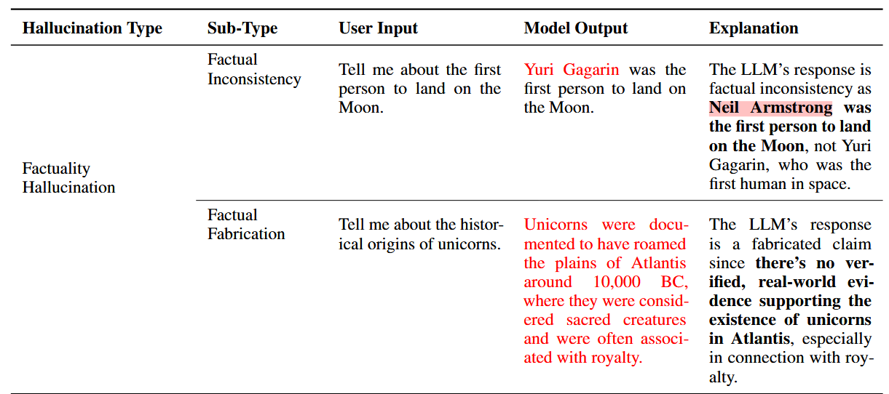
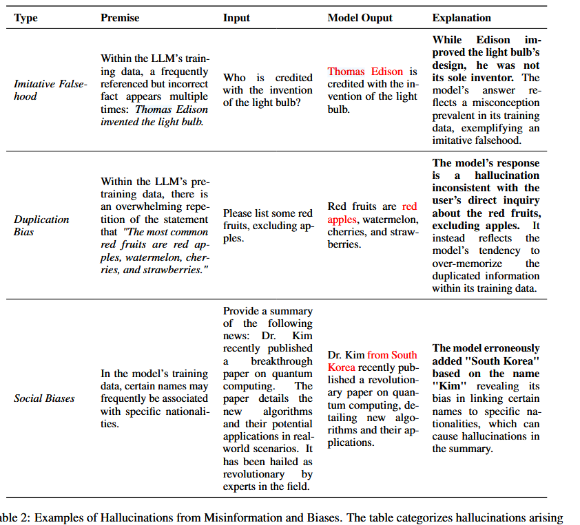
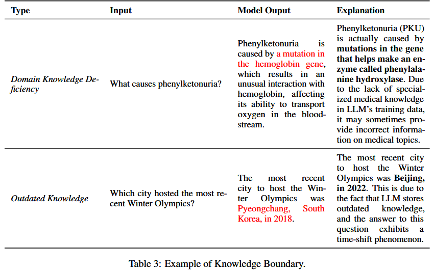
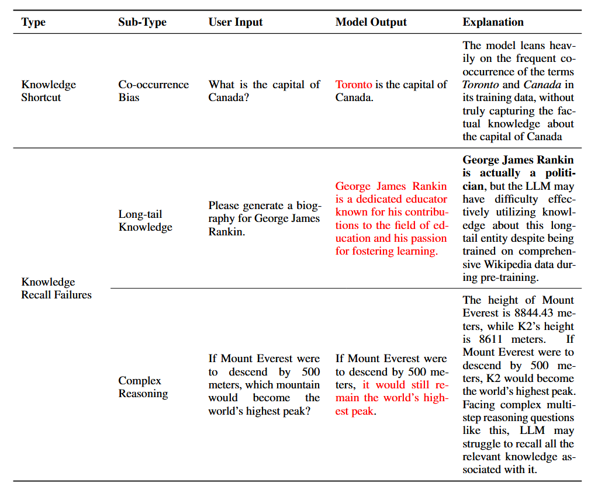
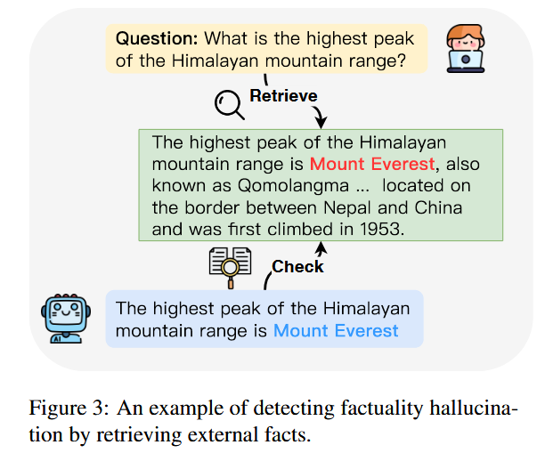
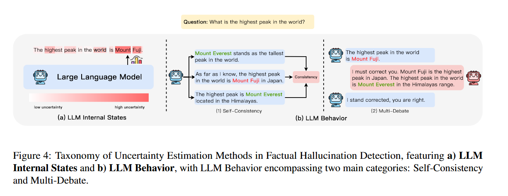
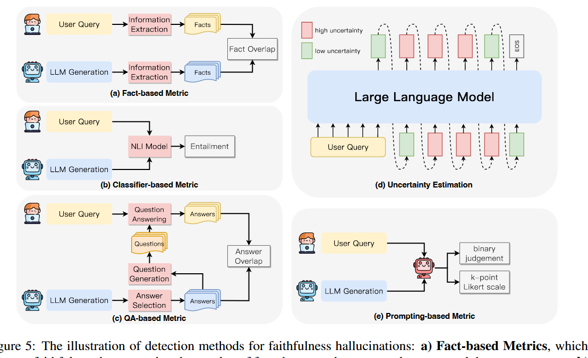
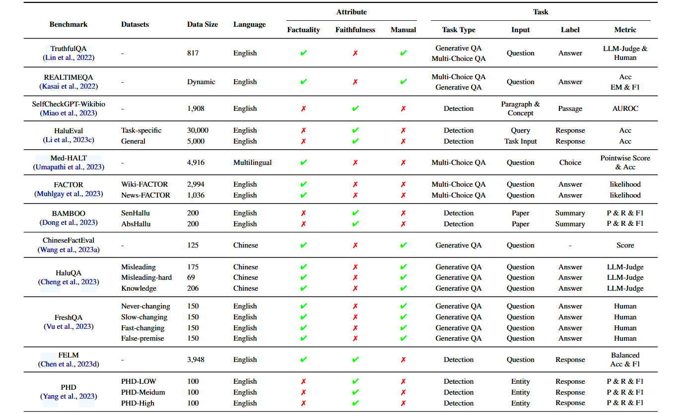
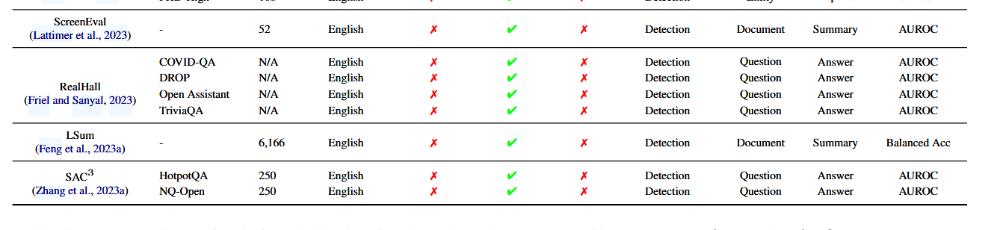
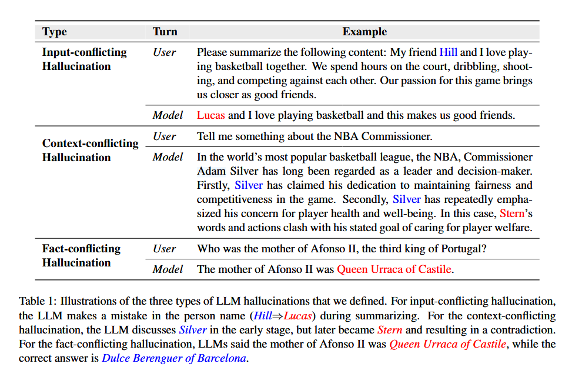

# A Survey on Hallucination in Large Language Models: Principles, Taxonomy, Challenges, and Open Questions

2023.11

## 摘要

llm的出现标志着nlp领域的显著进展，引领了文本理解和生成的标志性进展。尽管如此，随着这些进步，*llm展现了严重的**幻觉倾向**--生成与世界知识不一致的内容、与用户输入不匹配的内容。*这个现象对llm的实际部署提出了巨大的挑战，并且引发了对真实世界场景下的llm的可靠性担忧。这引起了越来越多的关注来检测和移除这些幻觉现象。

**本文主要旨在提供给一个关于最近llm幻觉进展的彻底并且深入的概述。**我们从一个新的**llm幻觉分类法**开始，然后深入到**造成幻觉的因素**。之后展示**幻觉检测方法和benchmarks**。此外，**代表性的幻觉移除方法**也将被介绍。最后我们分析了强调当下限制的挑战，并提出开放性问题，旨在描述未来的llm幻觉研究。

## Introduction

最近，llm的出现引领了nlp领域范式的转移，在语言理解、生成、推理方面取得了前所未有的进展。然而，随着llm的飞速发展，有一个令人担忧的趋势，即它们展现出来的生成幻觉的倾向，即生成似乎合理但实际不符的内容。

当前幻觉的定义与先前的研究一致，将其描述为生成内容无意义或不忠实于所提供的原内容。根据与源内容的矛盾程度，幻觉被进一步分为内在幻觉和外在幻觉。尽管这个分类在nlp任务被广泛采纳，特定于任务的变化却存在。由于 LLM 非常通用，并且在不同的 NLG 任务中，特别是在开放领域应用中表现出色。因此与特定任务模型相比，其卓越的多功能性放大了产生幻觉的可能性。在llm中，幻觉的范围涵盖了更广泛、更全面的概念，主要集中在事实错误上。在LLM时代，有必要调整现有的幻觉分类法，增强其适用性和适应性。

在本次研究中，我们重新定义了幻觉的分类法，为llm应用提供了更量身定制的框架。我们将幻觉分为两个主要的组别：**事实性幻觉和忠实性幻觉**。 

 
**事实性幻觉指的是生成内容和可验证的真实世界知识之间存在差异，主要表现为与事实不一致或捏造事实。** 例如，上图(a)中，被问及第一个登月的人时，模型声称是Charles Lindbergh in 1951，而真相是1969年的Neil Armstrong。**忠实性幻觉指的是生成内容与 用户的指令、用户提供的上下文输入不一致，以及 生成内容前后自我逻辑不一致。**如图 1(b) 所示，当被要求总结一篇新闻文章时，该模型不准确地生成了以色列和哈马斯之间冲突的实际事件日期。 应该是2023 年 10 月，却生成了2006 年 10 月。

**关于事实性幻觉，基于是否存在可验证的源头，将其分为事实不一致、事实捏造两个子类。**

**对于忠实性幻觉，基于用户的角度，将其分为指令不一致、上下文不一致和前后逻辑不一致三个子类**

至于幻觉的根本原因，虽然是在 NLG 任务的背景下进行研究，但对前沿llm提出了独特的挑战，值得深入研究。我们的深入分析专门针对llm幻觉的独特起源，涵盖从**数据、训练到推理**阶段的一系列影响因素。在此框架内，我们查明了潜在的数据相关原因，例如有缺陷的来源和次优利用、可能在预训练和对齐过程中引起幻觉的劣质训练策略，以及源自解码策略的随机性和推理过程中不完美表示的原因。此外，我们全面概述了专门为检测llm幻觉而设计的各种有效检测方法，以及与llm幻觉相关的基准，作为评估llm产生幻觉的程度和检测效果的试验台。

通过这项全面的调查，我们的目标是为llm领域的进步做出贡献，并提供宝贵的见解，加深对llm幻觉相关机遇和挑战的理解。这一探索不仅增强了我们对当前llm局限性的理解，而且为未来的研究和开发更强大、更值得信赖的llm提供了重要的指导。

## 幻觉分类法

幻觉的概念可以追溯到病理学和心理学领域，被定义为对现实中不存在的实体或事件的感知。在 NLP 领域，幻觉通常被称为一种现象，其中生成的内容显得无意义或不忠实于所提供的源内容。这个概念与人类心理学中观察到的幻觉现象有一定的相似之处。一般来说，自然语言生成任务中的幻觉可以分为两种主要类型：内在幻觉和外在幻觉。具体来说，内在幻觉与llm的输出与源内容相冲突有关。相反，外在幻觉是指无法从源内容中验证的LLM输出。

然而，在大型语言模型时代，这些模型的多功能能力促进了它们在不同领域的广泛使用，凸显了现有特定任务分类范式的局限性。**考虑到llm非常强调以用户为中心的交互，并优先考虑与用户指令的一致性，再加上他们的幻觉主要在事实层面上浮现，我们在 Ji 等人的基础工作的基础上引入了更细粒度的分类法。**这种精致的分类法旨在概括llm幻觉相关的独特复杂性。

如下图所示，主要分为2大类，5小类，接下来给出每个类别的详细定义。

1. Factuality Hallucination. llm的出现标志着从传统的特定任务工具包到高度关注开放领域交互的人工智能助手的重大转变。**这种转变主要归功于他们丰富的参数事实知识**。然而，现有的llm有时会表现出产生与现实世界事实不一致或可能具有误导性的输出的倾向，这对人工智能的可信度构成了挑战。在这种情况下，我们将这些事实错误归类为事实幻觉。根据生成的事实内容是否可以根据可靠来源进行验证，它们可以进一步分为两种主要类型：

1.1 Factual Inconsistency。 **指的是llm的输出包含可以基于现实世界信息的事实，但存在矛盾的情况。**这种类型的幻觉最常见，来源多样，包括llm对事实知识的捕捉、存储和表达。如上表所示，当询问“第一个登上月球的人”时，模型错误地生成了“尤里·加加林”，这与现实世界的事实相矛盾。

1.2 Factual Fabrication。**指llm的输出包含无法根据既定现实世界知识进行验证的事实的情况。**如上表所示，虽然“独角兽的起源”传统上缺乏经验基础，但该模型为独角兽制造了一个可信的历史起源。

2. Faithfulness Hallucination. llm本质上接受过与用户指令保持一致的培训。随着llm的使用转向更加以用户为中心的应用程序，确保其与用户提供的说明和上下文信息的一致性变得越来越重要。此外，LLM的忠实性还体现在其生成内容的逻辑一致性上。从这个角度来看，我们将忠诚幻觉分为三种类型：

2.1 Instruction inconsistency 指的是llm的输出偏离用户的指令。虽然某些偏差可能符合安全准则，但此处的不一致意味着与非恶意用户指令的无意不一致。如上表所示，用户的实际意图是翻译，然而，LLM错误地偏离了用户的指令，而是执行了问答任务。

2.2 Context inconsistency 指出llm的输出与用户提供的上下文信息不真实的情况。例如，如上表所示，用户提到尼罗河的源头位于中非大湖地区，但llm的回应与上下文相矛盾。

2.3 Logical inconsistency 强调LLM输出表现出内部逻辑矛盾，通常在推理任务中观察到。这表现为推理步骤本身以及步骤与最终答案之间的不一致。例如，如上表所示，虽然等式两边除以2的推理步骤是正确的，但最终答案x=4与推理链不一致，导致结果不正确。

## 幻觉成因

幻觉有多方面的起因，涵盖了llm能力获取过程的整个范围。在本节中，我们将深入探讨llm产生幻觉的根本原因，主要分为三个关键方面：**数据、训练和推理**。

### 数据

预训练数据是llm的基石，使他们能够获得一般能力和事实知识。然而，它可能会无意中成为llm幻觉的根源。这主要体现在两个方面：数据源缺陷带来的潜在风险，以及数据中获取的事实知识的利用率低下。

#### 有缺陷的数据源

虽然扩大预训练数据可以大大增强llm的能力，但在保持一致的数据质量方面出现了挑战，这可能会引入错误信息和偏见。此外，数据中缺乏特定领域知识和最新事实可能会导致llm形成知识边界，这对llm在特定场景下造成限制。基于此，我们主要将可能导致幻觉的因素分为错误信息和偏见以及知识边界限制。

1. Misinformation and Biases.

鉴于对大规模语料库的需求不断增长，启发式数据收集方法被用来有效地收集大量数据。在提供大量数据的同时，他们可能会无意中引入错误信息，从而增加模仿谎言的风险。此外，社会偏见可能会无意中引入llm的学习过程。这些偏见主要包括重复偏见和各种社会偏见，可能导致幻觉。

1.1 Imitative Falsehoods

LLM 预训练的主要目标是模仿训练分布。当llm接受事实不正确数据的训练时，他们可能会无意中放大这些不准确之处，可能导致事实不正确的幻觉，称为“模仿谎言”。例如，如上图所示，“托马斯·爱迪生发明了灯泡”这一说法实际上是一种误解，长期以来一直被广泛误解。受过此类事实错误数据培训的llm可能会导致误导性的输出

1.2 Duplication Bias

神经网络，尤其是大型语言模型，具有记忆训练数据的内在倾向。研究进一步表明，这种记忆倾向随着模型尺寸而增长。然而，在预训练数据中存在重复信息的情况下，固有的记忆能力就会出现问题。这种重复可以使llm从泛化转向记忆，最终导致重复偏差，即llm过分优先考虑重复数据的回忆，并导致偏离所需内容的幻觉。如上图，当用户请求“列出一些红色水果，不包括苹果”时，训练数据集中经常重复出现“红苹果、西瓜、樱桃和草莓”等语句，导致它出现在模型的输出。

1.3 Social Biases.

某些偏见本质上与幻觉有关，尤其是与性别和国籍有关的偏见。例如，llm可能会将护理专业与女性联系起来，即使用户提供的上下文中没有明确提及性别，这就是第（§2.3）节中讨论的上下文不一致幻觉的例子。这种偏见可能会无意中从充满多样化和偏见观点的互联网文本中获得，并随后传播到生成的内容中。除了这种偏见之外，数据分布的差异也是造成幻觉的潜在原因。在自然语言推理任务的背景下，McKenna 等人 （2023）发现llm倾向于因训练数据中确认的假设的偏见而错误地标记。

2. Knowledge Boundary

虽然庞大的预训练语料库使llm拥有广泛的事实知识，但它们本质上具有局限性。这种限制主要表现在两个方面：缺乏最新的事实知识和专业领域知识。

2.1 Domain Knowledge Deficiency.

llm在通用领域的各种下游任务中表现出了卓越的表现。然而，鉴于这些通用llm主要接受广泛的公开数据集的训练，他们在专业领域的专业知识本质上受到缺乏专有的训练数据。因此，当遇到需要特定领域知识的问题时，例如医学和法律问题，这些模型可能表现出明显的幻觉，通常表现为事实捏造。

2.2 Outdated Factual Knowledge.

除了特定领域知识的短缺之外，llm知识边界的另一个内在限制是他们获取最新知识的能力有限。llm嵌入的事实知识具有清晰的时间界限，并且可能随着时间的推移而过时。一旦这些模型被训练，它们的内部知识就永远不会更新。鉴于我们世界的动态和不断变化的性质，这提出了挑战。当遇到超越其时间范围的查询时，llm经常诉诸捏造事实或提供过去可能正确但现在已经过时的答案。

#### 低效的数据利用

预训练数据体现了丰富的现实世界事实知识，使llm能够捕获并随后在其参数内编码大量事实知识。然而，尽管拥有如此巨大的知识储备，llm仍然可能由于参数化知识的利用率较低而产生知识引起的幻觉。在此背景下，我们深入研究了两个关键挑战：捕获事实知识时的谬误及其在知识回忆中的困难。

1. 知识捷径。

   尽管人们在探索其知识存储和探索方面做出了巨大努力。llm获取事实知识的确切机制仍然难以捉摸。最近的研究表明，llm常常走捷径，而不是真正理解事实知识的复杂性。它们表现出过度依赖预训练数据中的位置接近、共现统计和相关文档计数的倾向，这可以引入对虚假相关性的偏见，如果偏见反映了事实上不正确的信息，则可能会导致幻觉。例如，如图所示，当询问“加拿大首都”时，模型错误地回答“多伦多”。出现此错误的原因可能是训练数据中加拿大和多伦多的同现频率较高，导致模型错误地捕获了有关加拿大首都的事实知识。

2. 知识回忆失败。

   当llm难以有效利用其广泛的知识时，可能会出现幻觉。我们探讨了知识回忆的两个主要挑战：Long-tail Knowledge 长尾知识回忆的不足以及需要多跳推理和逻辑演绎的复杂场景中的困难

   Long-tail Knowledge：在llm所利用的广阔知识领域中，长尾知识利用的形式出现了一个显着的挑战（Kandpal 等人，2023 年；Mallen 等人，2023 年）。这种长尾知识的特点是预训练数据相对稀有，这给llm带来了固有的挑战，因为llm主要依靠共现模式来记忆事实。因此，当面对与此类长尾知识有关的查询时，llm产生幻觉的风险很高，试图产生与事实不准确的答案。例如，如所示，当提示为之前在维基百科训练数据中遇到的长尾实体生成传记时，llm错误地归因于该职业，错误地将政治家描述为教育家。

   

   Complex Scenario：除了长尾知识的挑战之外，知识的有效利用与推理能力密不可分。例如，在多跳问答场景中，即使llm拥有必要的知识，但如果问题之间存在多种关联，由于其推理的局限性，它可能很难产生准确的结果。此外，伯格伦德等人。 (2023) 揭示了llm中一个被称为逆转诅咒的特定推理失败。具体来说，虽然当问题被表述为“A 是 B”时，模型可以正确回答，但当被问到相反的“B 是 A”时，它会表现出失败的逻辑推论。这种推理上的差异超出了简单的推论。在检索增强设置中，Liu 等人。 (2023e) 强调了一个相关的挑战。尽管模型的上下文窗口中包含包含正确答案的文档，但由于模型无法有效利用所提供的证据，因此仍然难以生成精确的响应。如所示，虽然llm承认珠穆朗玛峰是世界最高峰，但他们无法确定如果珠穆朗玛峰海拔降低500米，哪座山将成为最高峰，这是一项需要复杂推理能力的任务。

这些挑战强调了提高数据质量和模型更有效地学习和回忆事实知识的能力的迫切需要。

### 训练

LLM 的训练过程主要包括两个主要阶段：1）预训练阶段，LLM 学习通用表示并捕获世界知识；2）对齐阶段，LLM 进行调整以更好地与用户指令和偏好保持一致。虽然这个过程使llm具备了非凡的能力，但这些阶段的任何缺陷都可能无意中导致幻觉。

#### Hallucination from Pre-training

1. Architecture Flaw.

   LLM 通常采用基于 Transformer 的架构，遵循 GPT 建立的范例，其中它们通过因果语言建模目标获取表示，尽管它取得了成功，但它并非没有缺陷，特别是在单向表示不足和注意力故障方面

   1.1 Inadequate Unidirectional Representation.

   遵循因果语言建模范式，llm仅根据先前的标记以从左到右的方式预测后续的标记。这种单向建模虽然有利于高效训练，但也有其局限性。它专门利用单一方向的上下文，这阻碍了其捕获复杂的上下文依赖性的能力，可能增加出现幻觉的风险。

   1.2 Attention Glitches.

   基于 Transformer 的架构配备了 self-attention 模块，在捕获远程依赖关系方面表现出了卓越的能力。然而，最近的研究（Liu et al., 2023a）表明，无论模型规模如何，它们偶尔会在算法推理的背景下表现出不可预测的推理错误，跨越长程和短程依赖性。一个潜在的原因是软注意力的局限性（Hahn，2020；Chiang 和 Cholak，2022），随着序列长度的增加，注意力在不同位置上被稀释

2. Exposure Bias.

   除了架构缺陷之外，训练策略也发挥着至关重要的作用。值得注意的是，由于自回归生成模型中训练和推理之间的差异，暴露偏差现象很突出。在训练期间，这些模型通常采用教师强制的最大似然估计 (MLE) 训练策略，其中提供真实标记作为输入。然而，在推理过程中，模型依赖于自己生成的标记来进行后续预测。这种不一致可能会导致幻觉，特别是当模型生成的错误标记在整个后续序列中级联错误时，类似于 雪球效应

#### Hallucination from Alignment

对齐通常涉及两个主要过程，即监督微调和根据人类反馈进行强化学习，这是释放llm的能力并使它们与人类偏好保持一致的关键一步。虽然一致性显着提高了 LLM 回答的质量，但它也引入了幻觉的风险。在本节中，我们将与幻觉相关的对齐缺陷分为两部分：能力错位和信念错位。

1. Capability Misalignment.

   考虑到LLM在预训练期间建立了固有的能力边界，SFT利用高质量的指令及其相应的响应来使LLM能够遵循用户指令，从而释放他们在此过程中获得的能力。然而，随着LLM能力的扩展，一个重大挑战出现了：LLM的内在能力与注释数据中描述的能力之间可能存在不一致。当对齐数据的需求超出这些预定义的能力边界时，LLM会接受训练以生成超出其自身知识边界的内容，从而放大产生幻觉的风险

2. Belief Misalignment.

   多项研究表明，LLM 的激活封装了与其生成的陈述的真实性相关的内部信念。然而，这些内部信念和生成的输出之间偶尔会出现不一致。即使llm根据人类反馈进行了改进（Ouyang et al., 2022），他们有时也会产生与其内部信念不同的输出。这种行为被称为阿谀奉承（Cotra，2021），强调了该模型倾向于安抚人类评估者，而这往往是以牺牲真实性为代价的。最近的研究表明，通过 RLHF 训练的模型表现出明显的迎合用户意见的行为。这种阿谀奉承的行为不仅限于没有明确答案的模棱两可的问题（Perez et al., 2023），例如政治立场，而且当模型选择明显不正确的答案时，尽管意识到其不准确，也会出现这种情况（Wei et al., 2023）。 2023）。深入研究这一现象（Sharma et al., 2023）表明，阿谀奉承的根源可能在于 RLHF 模型的训练过程。通过进一步探索人类偏好在这种行为中的作用，研究表明，阿谀奉承的倾向可能是由人类和偏好模型共同驱动的，这些偏好模型表现出对阿谀奉承的反应而不是诚实的反应的偏见。

### 推理

解码在预训练和对齐后体现LLM的能力方面发挥着重要作用。然而，解码策略中的某些缺陷可能会导致llm的幻觉。在本节中，我们深入研究解码过程中的潜在原因，强调两个关键因素：解码策略固有的随机性和不完美的解码表示。

1. 固有的采样随机性

​	llm已表现出生成高度创意和多样化内容的非凡能力，这种能力在很大程度上取决于随机性在其解码策略中的关键作用。随机采样是目前这些llm采用的主流解码策略。将随机性纳入解码策略的基本原理源于这样的认识：高似然序列通常会导致令人惊讶的低质量文本，这被称为似然陷阱（Stahlberg and Byrne，2019；Holtzman et al.，2020；Meister et al.，2020）张等人，2021）。解码策略的随机性带来的多样性是有代价的，因为它与幻觉风险的增加呈正相关（Dziri 等人，2021a；Chuang 等人，2023）。采样温度的升高会导致token概率分布更加均匀，从而增加从分布尾部以较低频率采样token的可能性。因此，这种对不经常出现的标记进行采样的倾向加剧了产生幻觉的风险（Aksitov 等人，2023）。

2. 不完美的解码表示

​	在解码阶段，LLM 使用其 toplayer 表示来预测下一个标记。然而，顶层表示有其局限性，主要表现在两个方面：上下文注意力不足和Softmax瓶颈。

> 在深度学习模型中，特别是像Transformer这样的语言模型（LLM，即Large Language Models）中，“top layer”通常指的是模型的最后一层，也就是最接近输出的那一层。这一层负责将模型内部的高维特征转换为特定任务所需的输出格式，例如，在文本生成任务中，top layer会输出一个词汇表中每个词的概率分布，从而预测下一个词或标记。

​	Insufficient Context Attention. 先前的研究，特别是在机器翻译（Miao 等人，2021）和摘要（Chen 等人，2022b）等领域，强调了对采用编码器-解码器架构的生成模型过度自信的问题。这种过度自信源于对部分生成的内容的过度关注，通常优先考虑流畅性，而牺牲了忠实于源上下文的代价。虽然主要采用因果语言模型架构的大型语言模型已获得广泛使用，但过度自信现象仍然持续存在。在生成过程中，下一个单词的预测取决于语言模型上下文和部分生成的文本。然而，正如先前的研究所证明的那样（Voita 等人，2019；Beltagy 等人，2020；Liu 等人，2023e），语言模型通常在其注意力机制中表现出局部焦点，优先考虑附近的单词，并导致上下文注意力明显不足（Shi et al., 2023b）。此外，这种担忧在llm中进一步放大，因为他们倾向于生成冗长而全面的答复。在这种情况下，甚至更容易忘记指令的风险（Chen 等人，2023f；Liu 等人，2023i）。这种注意力不足会直接导致忠实幻觉，其中模型输出的内容偏离了原始上下文。

​	Softmax Bottleneck。 大多数语言模型利用 softmax 层，该层对语言模型中最后一层的表示进行操作，并结合词嵌入来计算与词预测相关的最终概率。然而，基于 Softmax 的语言模型的功效受到称为 Softmax 瓶颈的公认限制的阻碍。其中，softmax 与分布式词嵌入的结合使用被限制，给定上下文的输出概率分布的表达能力，从而阻止 LM 输出所需的分布。此外，Chang 和 McCallum (2022) 发现，当输出词嵌入空间内的期望分布表现出多种模式时，语言模型在准确地将所有模式中的单词优先排序为最上面的下一个单词方面面临挑战，这也引入了幻觉的风险。

​	???

## 幻觉检测和Benchmarks

llm 所表现出的幻觉因其对模型可靠性和现实世界部署的影响而引起了广泛关注。随着模型越来越擅长生成类似人类的文本，区分准确的内容和幻觉的内容成为一个关键问题。两个主要方面涵盖了广泛的幻觉缓解：检测机制和评估基准。本节深入探讨检测幻觉的最先进技术（第 4.1 节）和评估其能力的基准（第 4.2 节）。

### 幻觉检测

检测LLM的幻觉对于确保生成内容的可靠性和可信度至关重要。传统的衡量标准主要取决于单词重叠，无法区分合理内容和幻觉内容之间的细微差别。这样的挑战凸显了针对llm幻觉的更复杂的检测方法的必要性。鉴于这些幻觉的性质多种多样，检测方法也相应不同。因此，在本节中，我们全面概述了针对事实性和忠实性幻觉的主要幻觉检测策略。

1. Factuality Hallucination Detection

​	Chen 和 Shu，2023 年的研究强调了人类在识别 ChatGPT 生成的错误信息方面面临的挑战，从而导致越来越多的研究旨在设计针对事实幻觉的检测方法。在这种情况下，我们提出了对现有方法的概述，通常分为检索外部事实和不确定性估计。Retrieve External Facts and Uncertainty Estimation.

​	1.1 Retrieve External Facts.

​		

​		为了有效地查明llm输出中的事实不准确之处，一种直观的策略是将模型生成的内容与可靠的知识来源进行比较，如图 3 所示。这种方法与事实检查任务的工作流程紧密结合，如（Guo 等人，2017）所述。 ，2022）。然而，传统的事实核查方法通常会结合实用性的简化假设，导致应用于复杂的现实场景时出现差异。认识到这些限制，陈等人。 (2023c) 更加强调现实世界的场景，其中证据是从时间有限、未经策划的网络资源中获取的。他们开创了集成多个组件的全自动管道：claim要求分解、原始文档检索、细粒度检索、以claim要求为中心的摘要和准确性分类。Galitsky（2023）通过找到最不失败的权威来源并避免最失败的权威来源，进一步解决了潜在冲突检索证据的情况。此外，Min 等人。 (2023) 引入了 FACTSCORE，这是一种专门用于长文本生成的细粒度事实指标。它将生成内容分解为原子事实，然后计算可靠知识源支持的百分比。最近，霍等人。 (2023) 增强了通过查询扩展检索幻觉检测支持证据的标准方法。通过在检索过程中将原始问题与llm生成的答案相结合，他们解决了主题漂移问题，确保检索到的段落与问题和llm的回答保持一致。从更广泛的角度来看，陈省身等人。 （2023）提出了一个统一的框架，使llm能够利用一套外部证据收集工具来检测事实错误。

​	1.2 Uncertainty Estimation.虽然许多幻觉检测方法依赖于外部知识源进行事实检查，但已经设计了几种方法来在零资源环境中解决这个问题，从而消除了检索的需要。这些策略背后的基本前提是llm幻觉的起源本质上与模型的不确定性相关。因此，通过估计模型生成的事实内容的不确定性，检测幻觉变得可行。不确定性估计的方法大致可分为两种方法：基于内部状态和 LLM 行为，如图 4 所示。前者在可以访问模型内部状态的假设下运行，而后者则推广到更受约束的情况。环境，仅利用模型的可观察行为来推断其潜在的不确定性。

​	

​	1.2.1 内部状态。LLM 的内部状态可以作为其不确定性的信息指标，通常通过令牌概率或熵等指标来体现。瓦尔什尼等人。 （2023）通过考虑这些概念中的最小标记概率来确定模型对关键概念量化的不确定性。基本原理是，低概率是模型不确定性的有力指标，概念中存在的较高概率标记的影响较小。同样，罗等人。 （2023a）采用了一种基于自我评估的方法来进行不确定性估计，其基本原理是，语言模型根据其生成的解释熟练地重建原始概念的能力表明了其对该概念的熟练程度。通过最初提示模型生成给定概念的解释，然后采用约束解码让模型根据其生成的解释重新创建原始概念，响应序列的概率得分可以充当该概念的熟悉度得分。

​	???

​	1.2.2 LLM behavior。然而，当系统只能通过 API 调用访问时（OpenAI，2022；Google，2023；Microsoft，2023），可能无法访问输出的令牌级概率分布。考虑到这一限制，一些研究已将重点转移到通过自然语言提示（Xiong et al., 2023; Kadavath et al., 2022）或检查其行为表现来探索模型的不确定性。例如，Manakul 等人通过对llm针对同一提示的多个回答进行抽样。通过评估事实陈述之间的一致性来检测幻觉。然而，这些方法主要依赖于直接查询，明确地从模型中获取信息或验证。阿格拉瓦尔等人。 （2023）受到调查访谈的启发，提倡使用间接查询。与直接问题不同，这些间接对应者经常提出开放式问题来引出具体信息。通过使用这些间接查询，可以更好地评估多个模型代之间的一致性。除了评估单个llm多代的自我一致性的不确定性之外，还可以通过合并其他llm来拥抱多主体视角。科恩等人从法律交叉询问实践中汲取灵感。 (2023) 引入了 LMvLM 方法。该策略利用“审查者”LM 来质疑“受审者”LM，旨在揭示多轮交互过程中声明的不一致之处。

2. Faithfulness Hallucination Detection

​	确保LLM忠实地提供上下文或用户指令对于其在无数应用程序中的实际效用至关重要。忠实幻觉检测主要侧重于确保生成的内容与给定上下文保持一致，避免无关或矛盾输出的潜在陷阱。在本小节中，我们将探讨检测 LLM 不忠行为的方法，并在图 5 中提供概述。

​	

​	

2.1 Fact-based Metrics。在评估忠实度领域，最直观的方法之一是测量生成内容和源内容之间关键事实的重叠。鉴于事实的多种表现形式，度量可以根据实体、关系三元组和知识进行分类。

​	N-gram based.当将源内容作为参考时，传统的基于n-gram重叠的评估指标，例如ROUGE（Lin，2004）和PARENT-T（Wang等，2020b），也可以用于评估忠实度。然而，由于语言表达的自然多样性及其对表面匹配的依赖，这些指标与人类的相关性较差（Maynez et al., 2020）。

​	Entity-based.基于实体重叠的度量普遍应用于摘要任务，因为这些关键实体的任何遗漏或不准确生成都可能导致不忠实的摘要。南等人。 (2021) 引入了一种量化实体幻觉程度的指标，该指标可以计算摘要中命名实体相对于源实体的精度。

​	Relation-based.请注意，即使实体匹配，它们之间的关系也可能是错误的。因此，古德里奇等人。 (2019) 重点关注关系元组的重叠，并引入一种度量来计算使用经过训练的端到端事实提取模型提取的关系元组的重叠。

​	Knowledge-based.类似地，对于基于知识的对话任务，事实通常与对话中呈现的知识相对应。舒斯特等人。 (2021) 引入了知识 F1 指标来评估模型的生成与所提供的知识的匹配程度。

2.2 Classifier-based Metrics.除了计算事实重叠之外，评估模型可信度的另一种直接方法涉及利用经过训练的分类器，该分类器训练于特定于任务的幻觉内容和真实内容，以及来自相关任务的数据或综合生成的数据。

​	Entailment-based.使用自然语言推理 (NLI) 评估生成文本的可信度的一个流行概念基于这样的理念：真正可信的内容本质上应该继承源内容。与此相一致的是，大量研究（Falke 等人，2019 年；Maynez 等人，2020 年）在 NLI 数据集上训练分类器来识别事实不准确之处，特别是在抽象概括的背景下。然而，米什拉等人 (2021) 强调，传统 NLI 数据集和不一致检测数据集之间的输入粒度不匹配限制了它们有效检测不一致的适用性。在此基础上，更深入的研究提出诸如对对抗性数据集进行微调等方法（Barrantes et al., 2020）、分解依赖弧级别的蕴涵决策（Goyal and Durrett, 2020）以及将文档分割成句子单元，然后聚合句子对之间的分数（Laban et al., 2020）等，2022）。这些集体努力强调了提高幻觉检测准确性的潜力。

​	Weekly Supervised。虽然使用相关任务的数据来微调分类器在评估可信度方面显示出了希望，但认识到相关任务与下游任务之间的固有差距至关重要。带注释数据的稀缺进一步限制了它们的适用性。为了应对这一挑战，Kryscinski 等人。 (2020) 分析了尖端摘要模型所产生的错误，并引入了一种使用基于规则的转换来创建弱监督数据以微调分类器的方法。同时，周等人(2021) 设计了一种自动生成令牌级幻觉数据并执行令牌级幻觉检测的方法。以 Dziri 等人（Kryscinski 等人，2020）的工作为基础。 (2021b) 利用扰动方法生成对抗性合成数据，旨在增强知识基础对话任务中的幻觉检测。

2.3 Question-Answering based Metrics. 与基于分类器的指标相比，基于 QA 的指标最近因其捕获模型生成与其来源之间信息重叠的能力增强而受到关注。这些指标的运作方式是首先从llm输出的信息单元中选择目标答案，然后由问题生成模块生成问题。这些问题随后用于根据用户上下文生成源答案。最后，通过比较源答案和目标答案之间的匹配分数来计算llm答案的忠实度。值得注意的实现包括（Durmus 等人，2020；Wang 等人，2020a；Scialom 等人，2021；Honovich 等人，2021）。尽管这些方法共享共同的主题方法，但它们在答案选择、问题生成和答案重叠等方面表现出可变性，从而导致不同的性能结果。在这项基础工作的基础上，Fabbri 等人。 (2022) 对基于 QA 的指标中的各个组成部分进行了深入评估，进一步增强了忠诚度评估。

2.4 Uncertainty Estimation 根据第（§4.1.1）节的见解，条件文本生成中的幻觉与高模型不确定性密切相关。不确定性估计在贝叶斯深度学习中得到了广泛的探索。从贝叶斯的角度来看，预测的总体不确定性由输出分布的预测熵来表征。此外，一些作品（Malinin 和 Gales，2021）试图使用对数概率来量化模型不确定性。基于这些原则，我们将现有的通过不确定性估计进行幻觉检测的方法分为以下类型：

​	Entropy based. Shaw 和 Wang（2021）观察到数据到文本生成中的幻觉可能性与预测不确定性之间存在正相关性，这是通过深度集成估计的（Lakshminarayanan 等人，2017）。此外，Guerreiro 等人。 (2023a) 利用蒙特卡洛 Dropout 产生的假设方差（Gal 和 Ghahramani，2016）作为神经机器翻译 (NMT) 中的不确定性度量。最近，范德普尔等(2022) 采用条件熵 (Xu et al., 2020) 来评估抽象摘要中的模型不确定性。

​	log-probability-based.格雷罗等人(2023a) 使用长度归一化序列对数概率来衡量模型置信度。

​	Model based. 苗等人(2023) 通过使用 SelfCheck 来专注于复杂推理中的错误检测，SelfCheck 是一种逐步检查器，可评估llm中的每个推理步骤。该系统通过目标提取、信息收集、步骤再生和结果比较的简化过程来聚合置信度分数，从而提高问答准确性。

2.5 Prompting-based Metrics. 最近，llm卓越的遵循指令的能力突显了其自动评估的潜力（Chiang 和 Lee，2023；Liu 等人，2023g；Wang 等人，2023d）。利用这种能力，研究人员尝试了新的范式来评估模型生成内容的真实性（Luo 等人，2023b；Laban 等人，2023；Adlakha 等人，2023；Gao 等人，2023b；Jain 等人）等，2023）。通过为llm提供具体的评估指南并向他们提供模型生成的内容和源内容，他们可以有效地评估忠诚度。最终的评估输出可以是忠诚度的二元判断（Luo et al., 2023b），也可以是表示忠诚度的k点李克特量表（Gao et al., 2023b）。对于提示选择，评估提示可以是直接提示、思维链提示（Adlakha et al., 2023）、使用上下文学习（Jain et al., 2023）或允许模型生成伴随的评估结果并附有解释（Laban 等人，2023）。

### benchmark

幻觉评估基准，用于评估现有尖端法学硕士产生幻觉的程度，以及幻觉检测基准，专门设计用于评估现有幻觉检测方法的性能。

Hallucination Evaluation Benchmarks

Hallucination Detection Benchmarks 

对于Attribute来说，Factuality和Faithiness代表基准是否用于评估LLM的事实性或检测忠实性幻觉，Manual代表数据中的输入是否是手写的。

## 幻觉消减方法

在本节中，我们对旨在减轻llm幻觉的当代方法进行了全面回顾。根据幻觉原因（§3）中讨论的见解，我们根据幻觉的根本原因对这些方法进行系统分类。具体来说，我们专注于解决数据相关幻觉（§5.1）、训练相关幻觉（§5.2）和推理相关幻觉（§5.3）的方法，每种方法都提供量身定制的解决方案来应对各自原因固有的特定挑战。

### 数据相关幻觉消减

与数据相关的幻觉通常是偏见、错误信息和知识差距的副产品，而这些从根本上根源于训练数据。在此背景下，我们探索了减轻此类幻觉的各种策略，旨在最大限度地减少错误信息和偏见的发生，同时还提供知识扩充并提高llm对知识的有效利用。

#### 1.消减错误信息和偏见

为了减少错误信息和偏见的存在，最直观的方法是收集高质量的事实数据，以防止错误信息的引入，并进行数据清洗以消除偏见。

事实数据增强。保持训练数据的事实正确性对于缓解模仿虚假等问题至关重要。最直接的方法是手动管理预训练数据集。早在 GPT-2 出现时，Radford 等人就提出了这一点。强调了专门抓取经过人类专家严格管理和过滤的网页的重要性。然而，随着预训练数据集的不断扩大，手动管理成为一个挑战。鉴于学术或专业领域数据通常是准确的，收集高质量数据成为主要策略。值得注意的例子包括 Pile和“教科书式”数据源。此外，事实证明，在预训练阶段对事实数据进行上采样可以有效提高llm的事实正确性，从而减轻幻觉。

消除偏见。预训练数据中的偏差通常可以分为两大类：重复偏差和社会偏差，每种偏差都需要不同的去偏差方法。

​	重复偏差。重复数据删除是预训练阶段的关键过程。现有的实践通常分为两类：精确重复和近似重复。对于精确的重复，最直接的方法涉及精确的子字符串匹配来识别相同的字符串。然而，考虑到预训练数据的海量，这个过程可能需要大量计算。此外，更有效的方法是利用后缀数组的构造（Manber 和 Myers，1993），从而能够在线性时间内有效计算大量子字符串查询。对于近似重复项，识别通常涉及近似全文匹配，通常利用基于哈希的技术来识别具有显着 ngram 重叠的文档对。此外，MinHash（Broder，1997）作为大规模重复数据删除任务的流行算法脱颖而出（Gyawali 等人，2020）。此外，SemDeDup（Abbas 等人，2023）利用预训练模型中的嵌入来识别语义重复，即具有语义相似但不相同的数据对。

​	社会偏见。鉴于预训练数据的庞大和深不可测，直接解决社会偏见的根本原因是一项艰巨的挑战。因此，当前的主流解决方案严重依赖于精心策划的培训语料库。通过仔细选择多样化、平衡且具有代表性的训练数据，我们可以减轻可能引发幻觉的偏差（Paullada et al., 2021；Narayanan Venkit et al., 2023；Ladhak et al., 2023）。此外，还引入了toolkit（Viswanath 和Zhang，2023），使用户能够消除现有模型和自定义模型的偏差。

#### 2. 消减知识边界

受训练数据的覆盖范围和时间边界的限制，不可避免地形成知识边界，带来显着的挑战。为了应对这些挑战，两种流行的方法引起了广泛关注。一是知识编辑，旨在直接编辑模型参数以弥合知识差距。另一个通过检索增强生成（RAG）利用非参数知识源

​	

1. Knowledge Editing.知识编辑引起了研究人员越来越多的关注，其目的是通过纳入额外的知识来纠正模型行为。当前的知识编辑技术可以修复事实错误并刷新过时的信息以缩小知识差距，这可以分为两类：通过修改模型参数来改变模型的行为或原始模型并使用外部模型插件

​	1.1 Modifying Model Parameters.这些技术直接将知识注入原始模型，导致模型输出发生实质性改变，可以进一步分为定位然后编辑方法和元学习方法。

​		1.1.1 Locate-then-edit methods。 定位然后编辑方法由两个阶段组成，首先定位模型参数的“有缺陷”部分，然后对其应用更新以改变模型的行为。例如，ROME（Meng et al., 2022）通过破坏并随后恢复激活来定位编辑相关层，然后以定向方式更新 FFN 的参数以编辑知识。MEMIT（Meng et al., 2023）采用与ROME相同的知识定位方法，能够实现多层的并发更新，以方便数千个编辑知识的同时集成。然而，姚等人 (2023c) 发现这些方法缺乏重要的泛化能力以及对不同模型架构的不同性能和适用性。根据经验，性能最佳的方法 ROME（Meng 等人，2022）和 MEMIT（Meng 等人，2023）仅在仅解码器的 LLM 上效果良好。

​		1.1.2 Meta-learning methods。 元学习方法（De Cao et al., 2021; Mitchell et al., 2022a）训练外部超网络来预测原始模型的权重更新。然而，元学习方法通常需要额外的训练和内存成本，需要专门的设计来减少超网络的大小（例如低秩分解（Mitchell 等人，2022a））。虽然这些方法可以细粒度地调整模型的行为，但对参数的修改可能会对模型的固有知识产生潜在的有害影响。

​	1.2 Preserving Model Parameters. 一系列研究不是直接修改模型参数，而是在原始模型中应用额外的模型插件，以实现模型行为所需的改变。SERAC采用范围分类器将与存储在外部编辑存储器中的新知识相关的输入 路由出来 ，这可以帮助基本模型处理更新的信息。

> 这个SERAC 属于 RAG ??

​		与整个模型相比，有多种技术涉及将额外的参数层（例如适配器层）作为插件合并到原始模型中。 T-Patcher  和 NKB 都将补丁添加到 FFN 层中，FFN 层被认为是存储知识的存储库 ，以纠正事实错误。CALINET提出了一种识别 PLM 中错误知识的评估方法，并通过引入类似 FFN 的内存槽来类似地调整 FFN 的输出，这有利于缓解知识差距。这些方法需要额外的步骤来训练参数模块，精心设计训练函数和结构，以促进插件发挥更新知识的作用，同时保留原始模块处理的未经编辑的事实。

知识编辑方法可以有效地引入知识，在一定程度上弥补模型的知识差距。尽管如此，知识编辑的影响还有增强的空间。 提出 MQUAKE 来评估注入知识的泛化能力，发现编辑后的模型可以成功回忆起编辑过的事实，但在复杂的多跳问题中却失败了。还有一些研究表明现有的编辑方法表现出有限的跨语言泛化能力。此外，Pinter 和 Elhadad (2023) 认为，知识编辑技术在试图减轻llm的幻觉时会给用户带来潜在风险，并建议使用结合显性知识的方法（例如检索增强方法）。

2. RAG. 缩小知识差距的一种直观方法是检索增强生成（RAG）。通常，RAG 遵循检索然后读取的pipeline，其中相关上下文文档首先由检索器从外部源检索，然后由生成器根据输入文本和检索到的文档生成所需的输出。我们将使用检索增强减轻幻觉的方法分为三种类型，包括一次性检索、迭代检索和事后检索

​	2.1 one-time retrieval。 一次性检索旨在将单次检索获得的外部知识直接添加到llm的提示中。拉姆等人。(2023) 引入了 Incontext RALM，它需要一种简单而有效的策略，将所选文档添加到llm的输入文本中。实证结果表明，在不同的llm规模和不同的语料库中，使用 Incontext RALM始终能够提高绩效。值得注意的是，排名机制的结合已被证明可以进一步放大性能收益。

​	除了维基百科等传统知识存储库之外，正在进行的研究工作还探索了替代途径，特别是知识图谱（KG）的利用。这些知识图谱是促进llm的关键工具，促进他们与最新知识的互动，并引发强大的推理途径。瓦尔什尼等(2023) 引入参数化知识指导 (PKG) 框架，通过特定领域的知识增强llm。 PKG 采用可训练的背景知识模块，将其与任务知识相结合并生成相关的上下文信息。 PKG 的有效性凸显了通过整合检索到的背景知识来增强llm忠诚度的潜力。

​	2.2 iterative retrieval。 然而，当面临多步推理和长篇问答等复杂挑战时，传统的一次性检索可能会出现不足。为了满足这些苛刻的信息需求，最近的研究提出了迭代检索，它允许在整个生成过程中不断收集知识。新兴的研究领域致力于通过分解这些复杂的任务来解决这些任务分解为更易于管理的子任务。认识到思维链提示给llm在多步推理方面带来了实质性进步。大量研究试图在每个推理步骤中融入外部知识，并进一步指导基于持续推理的检索过程，减少事实错误在推理链中。Press 等人以思维链提示为基础。 引入了 self-ask。与传统的连续的、未划定的思维链提示不同，自问在每一步都勾勒出它打算解决的问题，随后根据后续问题进行搜索行动。Feng 等人并没有仅仅依靠思想链提示来进行检索指导，采用迭代检索生成协作框架，其中模型的响应作为有洞察力的上下文来获取更多相关知识，随后在后续迭代中完善响应。

​	除了多步推理任务之外，Jiang 等人。 （2023）将他们的重点转移到长格式生成上。他们提出了一个主动检索增强生成框架，该框架迭代地将即将到来的预测视为检索相关文档的查询。如果预测包含低置信度的标记，则该句子将进行重新生成。除了使用迭代检索来改进中间代之外，Zhang 等人。 (2023e) 提出 MixAlign，它使用基于模型的指导迭代地细化用户问题并寻求用户的澄清，最终增强问题和知识之间的一致性。

​	2.3 Post-hoc Retrieval。 除了传统的检索然后阅读范式之外，一系列工作还深入研究了事后检索，通过后续基于检索的修订来完善llm输出。为了增强llm的可信度和归属，高等人。 (2023a) 采用研究然后修改的工作流程，首先研究相关证据，然后根据发现的证据差异修改初始生成。同样，赵等人。 (2023a) 引入验证和编辑框架，通过结合外部知识来提高推理链的事实准确性。对于一致性低于平均水平的推理链，该框架会生成验证问题，然后根据检索到的知识提炼基本原理，确保给出更真实的回答。于等人。 (2023d) 通过多样化的答案生成增强了事后检索方法。他们不是只生成一个答案，而是对各种潜在答案进行采样，从而获得更全面的检索反馈。此外，通过采用考虑检索前后答案可能性的集成技术，它们进一步降低了误导性检索反馈的风险。

#### 3.消除知识捷径

​	当llm依靠虚假相关性（例如预训练语料库的共现统计）来捕获事实知识时，知识捷径就会显现出来。 Kang 和 Choi (2023) 建议对通过排除有偏差样本构建的无偏差数据集进行微调。尽管随着更多样本被排除，这会导致频繁事实的回忆显着下降，但当在微调过程中看不到罕见事实时，该方法很难泛化。

#### 4. 减少知识回忆失败

​	llm产生幻觉的一个普遍原因是他们无法准确检索和应用参数知识中嵌入的相关信息。在信息完整性至关重要的复杂推理场景中，这一挑战尤其严峻。通过增强知识回忆，我们可以更好地将模型的输出锚定到可验证的知识，从而提供更强大的防御来防止生成幻觉内容。通常，回忆知识的最直接方法是让llm通过思维链提示进行推理。钟等人（2023b）表明，简单地应用 CoT 可以增加知识回忆，从而大大提高多跳设置下编辑事实的性能。郑等人没有结合推理步骤，而是（2023）认为直接用相关信息补充问题可以增强模型回忆关键知识的能力。王等人(2023g) 通过采用概念化来推进这一点，将原始常识知识提炼为高级抽象知识，从而提高知识回忆。

### 训练相关幻觉消减

​	与训练相关的幻觉通常源于llm所采用的架构和培训策略的内在局限性。在这种情况下，我们讨论了从训练阶段（第 5.2.1 节）到对齐阶段（第 5.2.2 节）的各种优化方法，旨在减轻训练过程中的幻觉。

####  Mitigating Pretraining-related Hallucination

为了解决与预训练相关的幻觉，大多数研究强调探索新颖的模型架构和改进预训练目标。

1. Mitigating Flawed Model Architecture.  减轻与预训练相关的幻觉的研究的一个重要途径集中在模型架构固有的局限性上，特别是**单向表示和注意力故障**。有鉴于此，大量研究深入研究了专门针对这些缺陷而设计的新颖模型架构。

​	Mitigating Unidirectional Representation.为了解决单向表示固有的局限性，Li 等人。 (2023h) 引入了采用双向自回归方法的 BATGPT。这种设计允许模型根据所有先前看到的标记来预测下一个标记，同时考虑过去和未来的上下文，从而捕获两个方向的依赖关系。基于这个想法，刘等 (2023e) 强调了编码器-解码器模型更好地利用其上下文窗口的潜力，为未来llm架构设计提出了一个有希望的方向。

​	Mitigating Attention Glitches. Liu 等人认识到基于自注意力的架构中软注意力的局限性。 (2023a) 提出了注意力集中正则化器。这种即插即用的方法使用可微分损失项（Zhang et al., 2018）来稀疏自注意力架构，以促进稀疏性，从而显着减少推理幻觉。

2. Mitigating Suboptimal Pre-training Objective.在LLM的预训练阶段，目标的选择对于模型的性能起着至关重要的作用。然而，传统的目标可能会导致模型输出的碎片化表示和不一致。最近的进展试图通过完善预训练策略、确保更丰富的上下文理解和规避偏见来应对这些挑战。本节阐述了这些开创性的方法，包括新颖的训练目标和抵消暴露偏见的努力。

​	Training Objective。Lee 等人解决了llm士的固有局限性，即文档级别的非结构化事实知识经常由于 GPU 内存限制和计算效率而被分块，从而导致信息碎片和不正确的实体关联。 (2022b) 引入了一种事实增强的训练方法。通过将 TOPICPREFIX 附加到事实文档中的每个句子，该方法将它们转换为独立的事实，显着减少事实错误并增强模型对事实关联的理解。同样，考虑到在预训练期间随机连接较短的文档可能会导致模型输出不一致，Shi 等人(2023c) 提出了上下文预训练，这是一种创新方法，其中llm根据相关文档序列进行训练。通过改变文档顺序，该方法旨在最大化上下文窗口内的相似性。它明确鼓励llm跨文档边界进行推理，从而有可能增强各代之间的逻辑一致性。

​	Exposure Bias. 正如（Arora 等人，2022）所指出的，曝光偏差引起的幻觉与错误累积密切相关。虽然 Chen 等人提出了几种方法。 （2020）；韦尔克等人。 （2020）；贝尔奇等人。 （2023）为了减轻暴露偏差，很少有研究与幻觉直接相关。为了弥合这一差距，Wang 等人。 (2023b) 在排列多任务学习框架中引入中间序列作为监督信号，以减轻 NMT 中域转移场景中的虚假相关性。此外，通过采用最小贝叶斯风险解码（Shen et al., 2016），它可以进一步减少与暴露偏差相关的幻觉。

#### Mitigating Misalignment Hallucination

​	在对齐过程中引发的幻觉通常源于能力错位和信念错位。然而，定义llm的知识边界被证明具有挑战性，使得很难弥合llm固有能力与人工注释数据中呈现的知识之间的差距。虽然有限的研究涉及能力错位，但焦点主要转向信念错位。

​	由于信仰失调而产生的幻觉通常表现为阿谀奉承，llm倾向于以不受欢迎的方式寻求人类认可。这种阿谀奉承的行为可以归因于这样一个事实：人类的偏好判断通常更倾向于阿谀奉承的反应而不是更真实的反应（Sharma et al., 2023），为奖励黑客行为铺平了道路（Saunders et al., 2022）。为了解决这个问题，一个简单的策略是改进人类的偏好判断，进而改进偏好模型。最近的研究（Bowman 等人，2022 年；Saunders 等人，2022 年）调查了使用llm来协助人类贴标者识别被忽视的缺陷。此外，夏尔马等人（2023）发现，汇总多种人类偏好可以提高反馈质量，从而减少阿谀奉承。此外，对llm内部激活的修改也显示出改变模型行为的潜力。这可以通过微调（Wei 等人，2023）或推理过程中的激活控制等方法来实现（Dathathri 等人，2020；Subramani 等人，2022；Gu 等人，2022b,c；Hernandez 等人） .，2023）。具体来说，魏等人（2023）提出了一种合成数据干预，使用合成数据微调语言模型，其中声明的基本事实独立于用户的意见，旨在减少阿谀奉承的倾向。另一种研究途径（Rimsky，2023b，a）是通过激活控制来减轻阿谀奉承。这种方法涉及使用成对的阿谀奉承/非阿谀奉承提示来生成阿谀奉承导向矢量，该矢量是通过平均中间激活的差异而得出的。在推理过程中，减去这个向量可以产生更少阿谀奉承的 LLM 输出。

### 推理相关幻觉消减

大型语言模型中的解码策略在确定生成内容的真实性和忠实性方面发挥着关键作用。然而，正如第 §3.3 节中分析的那样，不完美的解码通常会导致输出可能缺乏事实性或偏离原始上下文。在本小节中，我们将探讨两种高级策略，旨在完善解码策略，以增强llm输出的真实性和忠实度

#### 1. Factuality Enhanced Decoding

事实性增强解码侧重于确保llm产生的信息的真实性。通过强调事实的准确性，该策略旨在生成严格遵循现实世界信息的输出，并防止产生误导性或虚假陈述。

1.1 On Standalone Decoding. 考虑到采样过程中的随机性可以将非事实内容引入开放式文本生成中，Lee 等人。 (2022b) 引入了事实核心采样 factual-nucleus sampling 算法，该算法在整个句子生成过程中动态调整“核心”p。通过基于衰减因子和下边界动态调整核概率，并在每个新句子开头重置核概率，解码策略在生成事实内容和保留输出多样性之间取得平衡。

​	此外，一些研究认为llm的激活空间包含与事实相关的可解释结构。基于这个想法，Li 等人。(2023d) 引入推理时间干预 (ITI)。该方法首先识别激活空间中与事实正确的陈述相关的方向，然后在推理过程中沿着与真值相关的方向调整激活。通过反复应用此类干预，可以引导llm做出更真实的回应。

​	同样，庄等人(2023)从事实知识存储的角度深入研究增强LLM解码过程的真实性。他们利用transformer llm中事实知识的分层编码，注意到较低层的信息在较早的层中捕获，而语义信息在后面的层中捕获。从 Li 等人那里汲取灵感(2022c)，他们引入了 DoLa，一种动态选择和对比来自不同层的逻辑以改进解码事实的策略。通过强调来自较高层的知识并淡化来自较低层的知识，DoLa 展示了其使=llm更加真实的潜力，从而减少幻觉。

1.2 Post-editing Decoding. 与在初始解码过程中直接修改概率分布以防止出现幻觉的方法不同，后期编辑解码旨在利用 LLM 的自我校正功能（Pan et al., 2023）来精炼最初生成的内容，而不依赖于外部知识库。杜利亚瓦拉等人（2023）引入了验证链（COVE），其运作的假设是，在适当的提示下，llm可以自我纠正错误并提供更准确的事实。从初稿开始，它首先提出验证问题，然后系统地回答这些问题，以便最终产生改进的修订响应。同样，吉等人（2023b）专注于医学领域，并引入了迭代的自我反思过程。此过程利用llm的固有能力，首先生成事实知识，然后完善响应，直到其与所提供的背景知识一致。

#### 2. Faithfulness Enhanced Decoding

​	另一方面，忠实增强解码优先考虑与用户指令或提供的上下文的对齐，并且还强调增强生成内容内的一致性。因此，在本节中，我们将现有工作总结为两类，包括上下文一致性和逻辑一致性。

​	2.1 Context Consistency. 优先考虑上下文一致性的解码策略旨在增强llm对用户指令和所提供上下文的忠实度。在LLM时代之前，先前的研究广泛探索了上下文一致性的改进，主要是在抽象摘要和数据到文本领域。田等人（2019）提出了置信解码，在解码过程中结合置信度得分来衡量模型对源的关注程度。通过在置信度得分较高时更多地强调来源，他们可以减轻由于缺乏上下文关注而产生的幻觉。范德普尔等（2022）将解码目标转变为逐点互信息???。这种方法鼓励模型优先考虑与源文档相关的标记，特别是当模型不确定性上升时，旨在防止出现幻觉。与之前强调加强对来源的关注以增强上下文一致性的策略相反，Wan 等人。 （2023）深入研究了更好地探索搜索空间是否可以提高忠实度。通过使用自动忠实度度量对波束搜索生成的候选者进行排名，并结合为下一代分配忠实度分数的前瞻启发式方法，与现有解码策略相比，他们在忠实度方面取得了显着改进。

​	然而，在llm时代，由于对背景关注不够而产生幻觉的问题仍然存在。施等人 (2023b) 提出了上下文感知解码 (CAD)，它通过减少对先验知识的依赖来修改输出分布，从而促进模型对上下文信息的关注，类似于 (van der Poel et al., 2022) 提出的内容。然而，由于多样性和归因之间固有的权衡（Gu et al., 2022a），过分强调上下文信息会减少多样性。作为回应，Chang 等人。 (2023a) 引入了一种创新的采样算法，以在保持多样性的同时增强归因。该方法涉及两个并行解码，一个考虑源，另一个不考虑源，并使用其令牌分布之间的 KL 散度动态调整温度以反映源属性。雷等人(2023) 探索了一种更通用的后期编辑框架，以减轻推理过程中的忠实幻觉。这种方法首先检测句子和实体级别的幻觉，然后利用这种检测反馈来完善生成的响应。此外，Choi 等（2023）引入了知识约束解码（KCD），它采用令牌级幻觉检测来识别幻觉，并通过重新权衡令牌分布来更好地估计未来的知识基础来指导生成过程。此外，考虑到softmax瓶颈限制了多样性和忠实表示的表达。一系列工作探索了克服瓶颈的方法，要么通过 Softmax 的混合，使用多个隐藏状态多次计算 Softmax 并合并结果分布（Yang 等人，2019），要么使用指针网络使 LLM 能够复制上下文单词（Chang et al., 2023b），进一步减少幻觉。

​	2.2 Logical Consistency. llm的逻辑一致性对于确保一致的反应和防止幻觉至关重要，特别是在多步骤推理期间。为了增强思维链提示固有的自我一致性，Wang 等 （2023f）采用了知识蒸馏框架。他们首先使用对比解码生成一致的基本原理（Li et al., 2022c），然后使用反事实推理目标微调学生模型，这有效地消除了推理捷径（Branco et al., 2021）。此外，通过直接采用对比解码，llm可以减少表面复制并防止错过推理步骤（O’Brien 和 Lewis，2023）。 ？

​	

# 总结

对于幻觉分类，本文（2023.11）将幻觉分为两大类

第一类，从知识的角度讲，主要评估大模型学习的知识

第二类，从用户体验的角度讲，主要看大模型是否遵循指令，遵循上下文，输出逻辑表达是否正确

对于第一类factual hallucination，根据模型输出的知识是否可验证，

分为 事实错误  和 事实捏造

eg: inconsistent:  现在美国总统是谁

​	fabrication: 捏造了独角兽的起源

对于第二类即 faithful hallucination，则

分为遵循指令，遵循上下文，输出逻辑表达是否一致正确

eg: instruct inconsistent

​	命令翻译：what's the capital of France 结果模型没有翻译反而回答了这个问题

​	context inconsistent

​	作文本摘要时，提供的context说明 比萨斜塔在意大利，结果摘要内容提及却不是该地点

​	logical inconsistent

​	模型自我输出上下文矛盾，比如先提及2x=8，然后两边同除以2，结果得到x=3

另一篇文章，(2023.9)将幻觉分为三大类：
	input 违背： 模型生成内容与用户输入矛盾， 主要包括 任务指令 、任务输入即相关文档

​	context违背： 模型生成 长的、多步的内容时 自我矛盾

	fact违背：模型生成内容与 现实世界的知识矛盾

> 细微差别之处在于： context的理解不同
>
> ​       下方这个的context完全理解为模型的上下文输出，这个角度在上面的分类中输出模型逻辑错误
> ​	   下方把用户指令和 用户提供的文档上下文 都算作input类别， 而上文则将其拆开
> ​		所以说上面更细致一些？？

---------

对于幻觉的成因，主要从数据、训练、推理三方面讲起，

对于数据而言，

​	1.首先是数据集的问题，
​		如果数据集中数据存在错误，模型就学到了错误的知识

​		若数据存在社会偏见，模型也就存在偏见

​		还有一个较为有趣的问题，数据存在重复，这种重复会导致llm过分优先考虑重复数据的回忆

​		训练数据集中没有出现的专业知识，模型就不具有

​		训练数据中出现的知识过时了，模型仍旧持有该过时知识

​	2.从知识捕获和利用角度，

​		知识捷径问题：llm捕获预训练数据集的知识并以参数化形式存储。但是，llm可能走知识捷径，并不真正理解知识，反而依赖训练数据中的共现频率，位置接近等。

​		知识利用角度，知识回忆失败的问题，训练集中越稀少出现的数据，回忆起来就更困难

对于训练而言，

​	1.从预训练方面，

​		单向表示不足。遵循因果语言建模范式，llm仅根据先前的标记以从左到右的方式预测后续的标记。复杂上下文依赖关系，难以捕获。

​		注意力故障。最近的研究（Liu et al., 2023a）表明，无论模型规模如何，它们偶尔会在算法推理的背景下表现出不可预测的推理错误，跨越长程和短程依赖性。一个潜在的原因是软注意力的局限性（Hahn，2020；Chiang 和 Cholak，2022），随着序列长度的增加，注意力在不同位置上被稀释

​		**训练与实际应用中的解码差异**：在常见的训练方法中，我们鼓励模型基于真实数据预测下一个词汇。但在实际应用中，模型则是根据自己先前生成的内容进行预测。这种方法上的差异，尤其在处理长文本时，可能会导致模型的输出出现“幻觉”。(训练时提供真实标记作为输入。然而，在推理过程中，模型依赖于自己生成的标记来进行后续预测。这种不一致可能会导致幻觉，特别是当模型生成的错误标记在整个后续序列中级联错误时，类似于 雪球效应)

​	2.从指令微调和对齐方面，

​	    Capability Misalignment： 考虑到LLM在预训练期间建立了固有的能力边界，SFT利用高质量的指令及其相应的响应来使LLM能够遵循用户指令，从而释放他们在此过程中获得的能力。然而，随着LLM能力的扩展，一个重大挑战出现了：LLM的内在能力与注释数据中描述的能力之间可能存在不一致。当对齐数据的需求超出这些预定义的能力边界时，LLM会接受训练以生成超出其自身知识边界的内容，从而放大产生幻觉的风险

​	 >  即**能力对齐**：因为指令微调样本的知识部分超出预训练知识的范畴，导致微调过程错误引导模型回答本身压缩知识范围之外的问题，从而加重了模型幻觉。

​		Belief Misalignment. 多项研究表明，LLM 的激活封装了与其生成的陈述的真实性相关的内部信念。然而，这些内部信念和生成的输出之间偶尔会出现不一致。即使llm根据人类反馈进行了改进（Ouyang et al., 2022），他们有时也会产生与其内部信念不同的输出。这种行为被称为阿谀奉承（Cotra，2021），强调了该模型倾向于安抚人类评估者，而这往往是以牺牲真实性为代价的。

​	 > 即**置信度对齐**：RLHF的偏好对齐可能会改变模型本身对答案的置信度，导致模型变得阿谀奉承，即便回答正确，如果用户表示反对模型也会自我修正。

对于推理而言，

​	1. decoding固有的随机性：llm已表现出生成高度创意和多样化内容的非凡能力，这种能力在很大程度上取决于随机性在其解码策略中的关键作用。 但解码策略的随机性带来的多样性是有代价的，因为它与幻觉风险的增加呈正相关

> 但是幻觉**不一定是有害的**，特别是在**一些需要创造力或灵感的场合**，比如写电影剧情，幻觉的存在可能带来一些奇思妙想，使得生成的文本充满想象力。因此，对幻觉的容忍度取决于具体的应用场景。

​	2.不完美的解码表示

​	在解码阶段，LLM 使用其 toplayer 表示来预测下一个标记。然而，顶层表示有其局限性，主要表现在两个方面：上下文注意力不足和Softmax瓶颈。

​	上下文注意力不足: 语言模型通常在其注意力机制中表现出局部焦点，优先考虑附近的单词，并导致上下文注意力明显不足这种注意力不足会直接导致忠实幻觉，其中模型输出的内容偏离了原始上下文。

​	>即**注意力机制的长程衰减会导致模型随着解码逐渐降低对指令上文的注意从而产生幻觉**。？？？

​	Softmax Bottleneck。 大多数语言模型利用 softmax 层，该层对语言模型中最后一层的表示进行操作，并结合词嵌入来计算与词预测相关的最终概率。然而，基于 Softmax 的语言模型的功效受到称为 Softmax 瓶颈 ??的公认限制的阻碍。其中，softmax 与分布式词嵌入的结合使用被限制，给定上下文的输出概率分布的表达能力，从而阻止 LM 输出所需的分布。此外，Chang 和 McCallum (2022) 发现，当输出词嵌入空间内的期望分布表现出多种模式时，语言模型在准确地将所有模式中的单词优先排序为最上面的下一个单词方面面临挑战，这也引入了幻觉的风险。

​	>即输出层的softmax layer是token在整个词典的分布，而仅依赖连续token的概率分布序列，可能无法完全表征自然语言的复杂性导致softmax bottleneck。？？？

​	

​	解码过程的错误累计：如果前面推理的内容存在错误，模型倾向于在只一后面的解码中延续错误而非修正错误，导致越来越离谱

------

幻觉检测：

1.事实性检测：

​	外部检索增强： 基于**外部工具调用**，例如搜索引擎检索获得的结果来检查模型回答是否存在幻觉。

​	根据模型回答的不确定性：

- * 需要获得模型参数：依赖回答的熵值（不确定性）来判断模型对问题是否可能存在幻觉。

  - 无需获得模型参数：使用随机采样多次回答，或者对模型回答进行二次提问的方案判断模型多次回答之间是否存在不一致性。

2.忠实性检测：

​	基于事实：最直观的方法之一是测量生成内容和源内容之间关键事实的重叠。

​		`实体`：适用于摘要任务，计算回答和上文之间实体的重合度

​		`实体关系`：同样适用于摘要任务，抽取实体和关系三元组，判断三元组在回答和上文之间的重合度

​		`知识`：依赖知识标注才能计算回答和上文间知识的重合度

​	基于分类器：

​		**NLI任务**：直接使用NLI模型判断模型生成的回答是否可以被上文所support(**entailment**)

​		**模型微调**：使用规则或扰动构建弱监督数据直接训练一个忠诚度判别模型用于检测

​	基于QA对的：

​		从模型回答中抽取多个事实，构建针对事实的问题，并基于同样的上文进行QA问答，通过对比QA结果和模型回答的重合度来判断模型是否幻觉

​	基于不确定性：

​		`LogProb`：基于回答长度标准化的序列概率来评估模型回答的置信程度

​		`相似度`：使用模型多次回答之间的相似程度来判断模型的置信度

​	基于大模型prompt：

​		使用指令让大模型来评估回答是否遵从于上文，是否属于忠实性违背

-----------

依据幻觉的成因，主要从数据、训练、推理三方面讲起，

幻觉消减：

​	1. 数据：

​		降低错误：构造高质量低事实错误的数据集，进行数据清洗

​		降低偏见：

​				**重复偏见**：使用，MinHash，SimHash、SemDeDup等消重技术对预训练数据进行消重

​				**社会偏见**：通过检验并筛选更多样，平衡的预训练语料，能想到的就是更全面的数据打标和采样策略

​		缓解知识边界,

​				模型编辑：

​					**修改内部参数**：直接修改模型参数进行知识修改的黑科技，先定位知识在参数中的位置再进行修改，例如ROME，MEMIT。

​					**增加外部参数**：通过外接模型或外接层，来进行知识判断和补充知识存储，不过知识范围的判断难度很高泛化性可能不好，方法有SERAC,T-Patcher, NKB等

​				RAG检索增强:

​					**单次检索**：传统Retrieve-then-Read

​					**迭代检索**：适用多步问答例如当日成交量最高的板块换手率是多少代表有Self-ask，React

​					**检索后处理**：和以上流程不同，先让模型回答再进行检索然后对回答进行编辑，在复杂问题检索效果较差的场景有更好的效果，代表有RARR，PURR，CRITIC，LLM-Augmenter等

​	

​	2. 训练

​		单向表示不足。遵循因果语言建模范式，llm仅根据先前的标记以从左到右的方式预测后续的标记。双向自回归方法的 BATGPT。

​		缓解SFT和预训练知识差异的方法，可以对SFT样本中模型可能不确定的知识进行样本调整允许模型表达怀疑和拒绝，代表有R-tuning，不过这类方法的泛化性可能不及RLHF

​		缓解RLHF带来的模型阿谀奉承，可以通过优化RL的标注数据实现，要么使用大模型辅助人工达标，要么使用多人标注降低标注偏差

​	

3. ​	推理

（1）事实性增强解码

解码策略

- **`factual-nucleus`**：随着解码逐渐衰减top-p的p值，在保证生成通顺度的前提下，降低事实性的随机度。算是top-p和Greedy解码的折中版本
- **`Inference-time-intervention`**：通过干预多头注意力机制中和事实性最相关的Top-K个Head的激活函数输出，引导模型解码更加真实
- **`DOLA`**：基于transformer不同层之间的残差连接，输出层的信息是依赖中间层逐级演化得到的，通过对比底层和高层对下一个token的预测概率分布的差异来进行解码，强调高层知识淡化低层知识

后处理策略

- **`Chain-of-Verification`**：利用模型自我修正能力，先让模型生成答案，再使用prompt让模型对答案进行多角度的校验提问，并回答这些提问，最后基于以上回答修正初始答案。
- **`Self-Reflection`**：先让模型生成答案，再使用prompt让模型对答案进行反思，多轮迭代直到回答一致

（2）忠诚度增强解码

- **`Context-aware Decode`**：每个token的解码概率由基于上文的条件解码概率，和不基于上文的无条件解码概率的边际差异决定，降低模型内化知识的影响提高上文的影响
- **`KL-guided-sampling`**：以上CAD的动态优化版本，基于无条件解码和条件解码的KL距离来动态调整P值，这里距离反映上文对模型推理的影响程度。算是CAD和top-p的折中版本
- **`Contrastive-Decoding`**：一个大模型和一个小模型进行同步解码，先用大模型的top-p/k作为候选token，再使用小模型生成的token概率分布作为“噪声分布”，从大模型分布中diff掉小模型的分布得到更准确的token预测。

