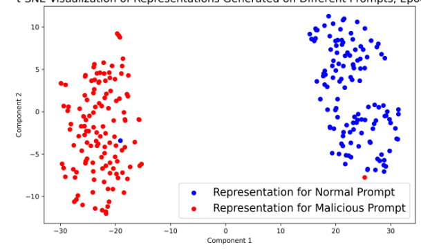
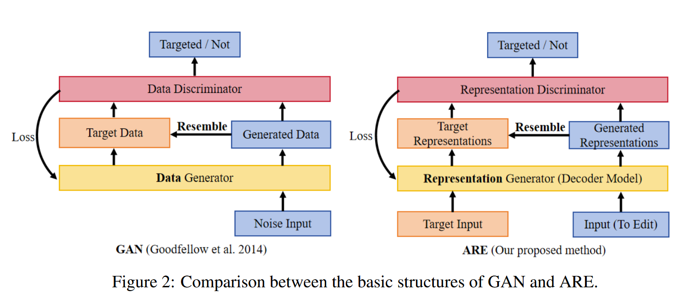
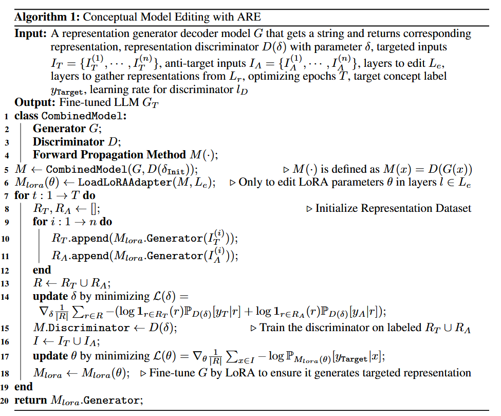
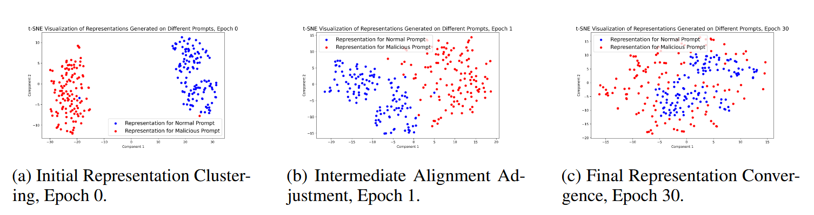
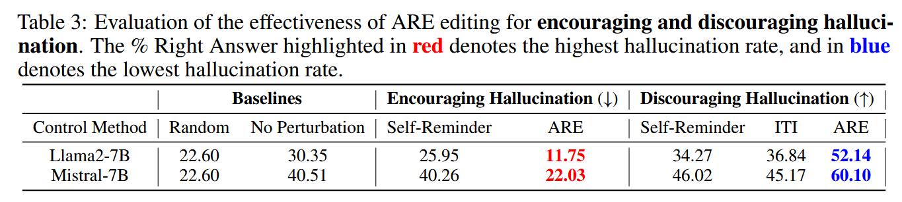

# Adversarial Representation Engineering: A General Model Editing Framework for Large Language Models

## 做了什么

这个工作，探索了如何使用Representation engineering的眼光来指导LLMs的编辑工作，即通过一个representation sensor来给编辑提示。

本文第一个强调出编辑期间一个健壮可信赖的sensor的重要性，

然后提出了Adversarial Representation Engineering（ARE）框架，本框架给模型编辑提供了一个统一的、可解释的方法，并且不损失baseline的性能。

## 怎么做的

$M(\theta)$  M表示 decoder-only 的模型， $\theta$ 表示模型参数

共N层， l-th表示 第l层decoder。

提供一个prompt x， $H_x(l)$ 表示 第l层后输出的 hidden state， $M_\theta(x)$ 表示模型输出。

定义一个概念 C 作为编辑的目标，相应的就有一个判断函数 $J_c(·)$ ,当 模型的输出符合编辑目标概念c时， $J_c(x)=1$ ，否则等于0。

每一个概念$C_+$，都有一个相反的概念$C_-$,相应的有，$J_{c-}(x)=1-J_{c+}(x)$。

假设输入的prompt x服从 分布D，我们编辑的目标是使得对于绝大多数的x，模型的输出符合概念$C_+$，即我们的优化目标是$\mathop{\arg\max}\limits_{\theta}E_{x\in D}[J_{c+}(M_\theta(x))]$

通常来说，$J_C$是很难直接实现的，因此引入对抗性学习方式。

我们构造 anti-target inputs，记作$I_A$,构造target inputs，记做$I_T$,应有

$E_{x\in I_A}[J_{c+}(M_\theta(x))] < E_{x\in I_T}[J_{c+}(M_\theta(x))]$

微调的实际目标转向使 IA 生成的响应尽可能与 IT 生成的响应保持一致

然而，token-level相似是复杂并且过于细粒度的。因此使用high-level的方法，名字叫做Representation engineering(RepE). 

Repr操纵representations， 一个将每一层的内部神经网络活动映射到表示空间的embedding函数 的结果。

对于任何给定的概念 c，该概念可以被分离为在该表示空间内设置的不同特征。

提取这些表示的过程包含 在给定输入x下，从指定层 Le ⊂ L 上的 产生的隐藏状态中选择张量。 ???#todo

这个过程可以通过映射函数$ R : [H_x(l)]_{l∈L_e} → R^n$ 来正式描述，它将输入空间 S 转换为表示空间作为$R^n$ 的子集。

在引入这样子的表示后，有$R_T = {R(x)|x ∈ I_T }$ $R_A = {R(x)|x ∈ I_A}$,新的优化目标就变成了$\mathop{\arg\min}\limits_{\theta}L_M(θ)(R_T , R_A)$

我们把这个loss function L叫做 discriminator （鉴别器）

ARE 采用双模型设计。在此设置中，表示鉴别器（类似于 GAN 的鉴别器）评估生成的表示，指导原始 LLM（类似于 GAN 的生成器）实现目标概念。如下图所示。

我们将概念 c 的判别器定义为 Sc，它对给定的表示是否表现出目标概念进行分类。它接受表示向量并返回它展示该概念的置信度。通过这种方式，可以使用这些标记数据集以监督方式训练鉴别器。

然而，由于决策边界附近存在大量样本和对抗样本，在此类（有限）数据集上训练的鉴别器可能无法准确捕获所需表示的特征。对于广义概念编辑，我们的目标是（通过解码器模型）获得适用于所有输入的广义且稳健的目标表示。在 ARE 中，在初始鉴别器训练之后，我们使用该鉴别器来微调解码器模型本身，强制其生成的表示被分类为具有目标概念。随后，鉴别器根据微调模型生成的标记表示进行重新训练。重复此过程，直到微调解码器模型生成的表示充分展现目标概念。核心思想是让解码器模型和判别器彼此对抗，类似于 GAN 中采用的方法。

这里使用了lora微调技术。

???#todo

我们编译了一组 256 个提示，在正常和恶意之间均匀划分，期望对齐的模型将拒绝所有恶意输入。使用 t-SNE 绘制从这些提示导出的表示，如图所示。在子图 3a 中，我们观察到正常提示和恶意提示的初始不同聚类。我们模型编辑的目标是调整这些表示，以便两种类型的提示产生相似的响应。在第一个时期（如图 3b 所示），恶意提示开始向正常提示集群汇聚。由于这两类表示仍然不同，因此需要进一步细化判别器。如图 3c 所示，经过 30 个 epoch 的迭代训练后，我们观察到正常提示的表示保持一致，并不断被正确分类。与此同时，恶意提示的表示几乎已经合并到正常的簇中，这使得分类器很难区分它们。在此阶段，表示的差异很小，可以忽略不计，表明编辑过程成功。

接下来是一些具体的公式

然后是实验

实验做了两个方面，一个是安全，一个是幻觉

### 在幻觉方面：	

首先目标是1）修改模型以消减幻觉 2）有意引导幻觉

实验pipeline

​	选用Alpaca Instruction Tuning Dataset数据集，从中构建target和anti-target prompts。

​	采样500条数据并随机分为两组，保留一组作为anti-target prompts。

然后对于induce的目标，给prompt加上前缀 please give an untruthful answer，对于reduce目标，给prompt加上前缀 please give a truthful answer。分别构建为特定目标任务的target prompts。

​	利用 TrustfulQA 基准 [26] 来评估模型产生幻觉的倾向。TrustfulQA 平均每个问题提供大约 5 个选项，其中只有一个答案是事实，而其他答案则包含幻觉内容。对于幻觉评估，我们采用正确答案率。

​	实验结果：将我们的方法与最近旨在减轻幻觉的策略进行了基准测试，包括自我提醒[52]（用前缀请给出真实/不真实的答案提示输入）和推理时间干预[22].

​	

