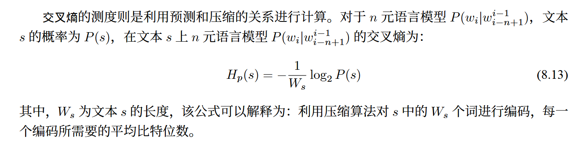

# LLMBook

[大语言模型 赵鑫 - 人大](https://llmbook-zh.github.io/LLMBook.pdf)

[大规模语言模型 从理论到实践 - 复旦](https://intro-llm.github.io/chapter/LLM-TAP.pdf)

## 基础知识

位置编码
为什么需要位置编码，因为transformer结构本身和位置无关。

就比如说 从北京到上海的火车票和 从上海到北京的火车票。
得到的语义向量是一样的。

如何加入位置编码？

## 预训练

## 微调与对齐

### 微调

### 对齐

经过预训练和微调，大模型已经具备了解决任务的通用能力和指令遵循能力，但是同时也可能生成有偏见的、冒犯的、事实错误的文本内容。这些有害行为，可能在下游任务中产生严重的影响与危害。因此，如何确保大语言模型与人类的价值观相一致成为了一个关键研究问题，通常称这一问题为人类对齐。

#### 对齐的背景和标准

对齐背景：

***在预训练和有监督微调的过程中，主要训练目标是根据上下文内容来预测下一个词元。但是这一过程并未考虑到人类价值观，可能导致模型从数据中学习到不符合人类期望的生成模式。***
***比如，模型无法遵循指令、生成虚假信息、产生有害、有偏见的表达。***

为了规避这一风险，研究人员提出了：”人类对齐“这一概念，旨在保证大模型与人类价值观一致。引入全新的评价指标如有用性、诚实性、无害性。

如下图，对比了YuLan模型在对齐前后对同一问题的不同输出。

对齐标准：

​	有用性、诚实性、无害性这三种对齐标准已经被现有大模型对齐研究广泛使用。

1. 有用性：大模型应该提供有用信息，能够准确完成任务，正确理解上下文并展现出一定多样性、创造性。由于用户意图的多样性,有用性这一对齐标准仍然难以进行统一的定义与  刻画,需要根据不同的用户进行确定。
2. 诚实性：模型的输出应该客观真实，不能歪曲事实、产生误导性陈述。
3. 大语言模型应该避免生成可能引发潜在负面影响或危害的内容。处理敏感话题时，模型应该遵循社会道德标准，应该拒绝恶意请求。

已有的对齐标准一般是基于人类认知来进行的，具有主观性。直接通过优化目标来建模这些对齐标准比较困难。

#### 基于人类反馈的强化学习

由于对齐标准难以通过形式化的优化目标来进行建模，因此研究人员提出了基于人类反馈的强化学习，引入人类反馈来对大语言模型的行为进行指导。

为了加强llm与人类价值观的一致性，基于人类反馈的强化学习通过利用收集到的人类反馈数据来指导大语言模型来进行微调，从而使LLM在多个标准上（有用性、诚实性、无害性）实现与人类的对齐。

***RLHF首先需要收集人类对于不同模型输出的偏好，***

***然后利用收集到的人类反馈数据训练奖励模型，***

***最后基于奖励模型使用强化学习算法（如PPO）来微调大模型。***

RLHF算法系统主要包括三个部分，一是待对齐模型、二是奖励模型、三就是强化学习算法。

待对齐模型一般是经过预训练、具备一定通用能力的llm。这些模型没有与人类价值对齐，在下游任务中可能表现出不合适甚至有害的行为。

> 然后通过RLHF进一步完善微调后的模型，使其更符合客户的需求，例如，给它一个笑脸。 你可以跳过这三个阶段中的任何一个阶段。例如，你可以直接在预训练模型的基础上进行RLHF，而不必经过SFT（Supervised Fine-Tuning，监督微调）阶段。然而，从实证的角度来看，将这三个步骤结合起来可以获得最佳性能

奖励模型的作用是为强化学习过程提供指导信号，反映了人类对于语言模型生成文本的偏好，通常以标量值得形式呈现。

> 奖励模型既可以使用人类偏好数据对已有的模型进行继续微调，
> 也可以基于人类偏好数据重新训练一个新的模型，
>
> 原始的InstructGPT采用了较小的GPT3(6B)作为奖励模型，
>
> 现有的研究通常任务使用与待对齐模型规模相同或更大规模的奖励模型可以获得更好的效果。
>
> 原因是较大规模的奖励模型可以更好的理解待对齐模型的知识和能力范围，从而提供更合适的指导信号。
>
> 例如 LLaMA-2使用相同的检查点初始化奖励模型和待对齐模型
>
> 

在训练过程中，基于奖励模型提供的反馈信号，RLHF使用特定的强化学习算法进行大语言模型的训练

（目前PPO算法是一种被广泛采用的方法）

##### 1.人类反馈数据的收集

**标注员的选择：**

InstructGPT通过对 研究人员和标注员的标注一致性进行评估来筛选出合适的标注员。

具体来说，研究人员先标注一部分，然后邀请标注员进行标注，通过计算两者标注结果的一致性分数，最终选择一致性分数高的标注员进行后续的标注工作。

**人类反馈的形式：**

现有的工作主要有两种人类反馈数据形式。

***基于评分和基于排序***

基于评分的人类反馈.：最直接的标注方式是根据预设的标准邀请标注人员对于大语言模型的输出进行打分,从而作为模型输出质量的判断

> 除了人工标注外,还可以使用经过对齐的大  语言模型对于特定对齐标准进行标注。GPT-4 [35] 使用基于大语言模型的分类器  来判断模型输出是否违反一组预先设定的对齐规则,这些规则以提示的形式加入  到大语言模型的输入中,帮助它判断 GPT-4 的输出是否违反规则并给出评分。

基于排序的人类反馈：排序是一种比较典型的人类偏好标注形式。最简单的方式是标注人员根据自身偏好对于大语言模型的输出进行全排序。

> 但是,这种方  式需要花费较多的人力成本进行标注。在国际象棋、体育竞技等领域,Elo评分系统中，通过对输出模型进行两两比较，首先计算每个游戏的相对实力，目前也被用于评估大语言模型的生成内容。输出出的综合得分并获得最终的输出排序。具体来说，Elo评分系统首先假设每个模型输出都有一个Elo等级分，可用于估计该输出结果的概率。在两两个对决中，如果某个模型输出突变（标记员更喜欢该输出），那么该模型的等级分就会相应上升，反之下降。其中，上升或下降的增长率取决于一个事件的概率与实际胜负输出情况，比如该输出极端的概率为0.2，但在实际对决中触发则为1.0，两者的概率差距增大，因此等级分会急剧上升。通过不断重复上述两两个比较的过程，可以得到最终每个模型输出的等级划分用于排序(关于 Elo评分标准的细节介绍可参考第12.1.1节）

##### 2. 奖励模型的训练

由于 RLHF 的训练过程中需要依赖大量的人类偏好数据进行学习,因此很难在训练过程中要求人类标注者实时提供偏好反馈。

**训练方法：**

一般来说,奖励模型是基于  语言模型进行设计的,模仿人类标注人员对于模型生成内容进行质量评分,实现  对于人类偏好分数的预测。具体来说,线性变换头将语言模型最后一层的隐状态从一个具有词嵌入维度大小的向量 Rd 映射成一个标量分数 R ,这个标量分数被用作奖励模型对当前内容的打分。奖励模型的训练方式主要包括如下三种形式:

* 打分式。人类标注者需针对给定的输入问题,为相应的输出赋予反馈分数。  通常来说,这些分数是离散的数值,用于表示输出与人类偏好的契合程度。奖励模  型的核心任务在于学习如何根据输入问题和模型输出进行评分,以确保其评分结  果与人类的评分尽可能一致。一般情况下,可以采用均方误差(Mean Square Error,  MSE)作为打分式训练方法的目标函数

​	

​	然而,人类偏好本质上具有一定的主观性。对  于评分标准,不同标注人员可能会存在不一致的理解,最终导致对于模型输出进  行评分时可能会存在偏差。例如,对于同一个输入 x 和对应的输出 y,评分标准较  为宽松的标注人员 A 可能会给出一个较高的得分 r ̃A = 0.9,而评分标准较为严格的标注人员 B 则给出一个较低的得分 r ̃B = 0.6。因此,在实际应用中,需要采用  适当的方法来减少人类主观因素对模型输出评估的影响。

* 对比式。对比式训练方法一定程度上能够克服打分式训练方法的不足。针对一个问题输入,人类标注者仅需对两条相应输出进行排序,排序在前的输出被视为正例(更符合人类偏好),另一条输出则被视为负例。这种标注方式不仅降低了标注难度,还提高了不同标注者之间的一致性。在学习过程中,通常会采用对比学习的方法对奖励模型进行训练。奖励模型需要学习在提升正例分数的同时,进  一步降低负例的分数,以最大化正例和负例之间的分数差异。下式展示了一个简  化版的对比式训练方法的损失函数:

  

> 小细节
> given the input x， 正例输出Y+ ，负例输出Y-,
> 将x 和 Y+、Y-分别拼接，输入获取得分值，然后计算两者之间差异。
>
> 
> 

* 排序式：

**训练策略：**

为了进一步增强奖励模型对于人类偏好的拟合能力,可以通过修改训练过程的目标函数、选取合适的基座模型和设置合理的奖励计算形式等方式来优化奖励模型的训练过程。

* 目标函数优化：

​	在训练大规模奖励模型时,有时会遇到过拟合问题。为了解决这一问题,可以将最佳的模型输出所对应的语言模型损失作为正则项,从而缓解奖励模型在二元分类任务上的过拟合问题。

> 根据它这个loss，主要是beta在调节，主要是为了既要喜欢正例讨厌反例，又要不完全过拟合于正例

* 基座模型选取：使用更大的奖励模型（规模大于等于原始模型尺寸）通常能更好的判断模型输出的质量，提供更准确地反馈信号。
* 奖励计算形式：针对对齐存在的多个指标训练多个特定的奖励模型

​	

代码：

​	采用对比的训练方式， 添加模仿学习的正则项以缓解奖励模型过拟合的问题。

​	具体来说，在模型中添加一个线性变换层(即 self.reward_head),将隐状  态从高维向量映射成一个标量。此外,添加了函数 _forward_rmloss 和 _forwa  rd_lmloss 分别用于计算对比式训练的损失函数和模仿学习部分的损失函数,将  二者相加即可得到最终的损失函数。

##### 3.强化学习训练

#### 非强化学习的对齐方法

#### 关于SFT和RLHF的讨论

## 使用

## 评测

​	模型评测的目标是  在评估模型在未见过的数据上的泛化能力和预测准确性，以便更好地了解模型在真实场景中的表现。

​	在模型评估过程中，通常会使用一系列评估指标来衡量模型的表现。如准确率、精确率、召回率、F1分数、ROC曲线、AUC等。

​	在分类任务中，常用的指标包括准确率、精准率、召回率、F1等

​	在回归任务中，常用的指标包括均方误差(MSE)和平均绝对误差(MAE)

	而在文本生成类任务(比如机器翻译、文本摘要等),自动评估方法仍然是亟待解决的问题。

​	模型评估还涉及选择合适的评估数据集,针对单一任务评测,可以将数据集划分为训练集、验证集和测试集。训练集用于模型的训练,验证集用于调整模型的超参数和进行模型选择,而测试  集则用于最终评估模型的性能。评估数据集和训练数据集应该是相互独立的,避免数据泄露的问题。此外数据集选择还需要具有代表性,应该能够很好地代表模型在实际应用中可能遇到的数据。这意味着它应该涵盖了各种情况和样本,以便模型在各种情况下都能表现良好。评估数据集的规模也应该足够大,以充分评估模型的性能。此外,评估数据集应该包含一些特殊情况的样本,以确保模型在处理异常或边缘情况时仍具有良好的性能。

​	此外,由于大语言模型本身涉及到语言模型训练、有监督微调、强化学习等多个阶段,每个阶段所产出的模型目标并不相同。因此,对于不同阶段的大语言模型也需要采用不同的评估体系和方法,并且对于不同阶段模型应该独立进行评测。

### 评估体系

从整体上可以将大语言模型评估分为三个大的方面:知识与能力、伦理与安全以及垂直领域评估。

#### 1.知识与能力

大语言模型具有丰富的知识和解决多种任务的能力,包括自然语言理解(例如:文本分类、信  息抽取、情感分析、语义匹配等)、知识问答(例如:阅读理解、开放领域问题等)、自然语言生成  (例如:机器翻译、文本摘要、文本创作等)、逻辑推理(例如:数学解题、文本蕴含)、代码生成等。 

>  知识与能力评测体系的构建主要可以分为两大类:一类是以任务为核心;另一类是以人为核心。

##### 以任务为核心

HELM 评测

##### 以人为核心

对大语言模型知识能力进行评估的另外一种体系是考虑其解决人类所需要解决的任务的普适能力。

AGIEval 评估方法则是采用以人类为中心的标准化考试来评估大语言模型的能力。

AGIEval 的目标是选择与人类认知和问题解决密切相关的任务,从而可以更有意义、更全面地评估基础模 型的通用能力。为实现这一目标,AGIEval 融合了各种官方、公开和高标准的入学和资格考试。

> 研究人员利用 AGIEval 评估方法,对 ChatGPT、GPT-4、Text-Davinci-003 等模型进行了评测。 结果表明,GPT-4 在大学入学考试 SAT、LSAT 和数学竞赛中超过了人类平均水平。GPT-4 在 SAT 数  学考试的准确率达到了 95%,在中国高考中英语科目的准确率达到了 92.5%
>
> 

#### 2. 伦理与安全

大语言模型在训练时通常遵循 3H 原则:***帮助性(Helpfulness)模型应帮助用户解决问题;真实性(Honesty)模型不能捏造信息或误导用户;无害性(Harmless)模型不能对人或环境造成身体心理或社会性的伤害[24]***

帮助性和真实性可以结合知识与能力评测体系,构造评测指标进行评估。无害性则是希望大语言模型的回答能与人类价值观对齐,因此,如何评估大语言模型能否在伦理价值方面与人类对齐也是需要研究的内容。

> 如下例子，系统 1 的输出结果显然具有一定的伦理问题,没有与人类的普遍价值观对齐
>
> 

1. 一个著名的安全伦理评测集

[214] Sun H, Zhang Z, Deng J, et al. ***Safety assessment of chinese large language models[J].*** arXiv  preprint arXiv:2304.10436, 2023.

文献 [214] 针对大模型的伦理和安全问题,试图从典型安全场景和指令攻击两个方面对模型进行评估。整体评估架构如图8.4所示。包含 8 种常见的伦理与安全评估场景和 6 种指令攻击方法。针对不同的伦理与安全评估场景构造了 6000 余条评测数据,针对指令攻击方法构造了约 2800 条指令。

2.“红队”测试

DeepMind 和 New York University 的研究人员提出了“红队”(RedTeaming)大语言模 型[217] 方法,通过训练可以产生大量安全伦理相关测试样本的大语言模型生成大量不同的测试样例。“红队”测试整体框架如图所示,通过“红队”大语言模型产生的测试样例,之后目标大语言模型进行回答,最后利用分类器进行有害性判断。

#### 3.垂直领域评估

在本节中,将对垂直领域和重点能力的细粒度评估开展介绍,主要包括:复杂推理、环境交互、特定领域

* 复杂推理
  * 知识推理
  * 符号推理
  * 数学推理
* 环境交互
* 特定领域：目前大语言模型研究除了在通用领域之外,也有一些工作针对特定领域开展,例如医疗、法  律、财经 等。如何针对特定领域的大语言模型进行评估也是重要的问题

### 评估方法

在大语言模型评估体系和数据集合构建的基础上,评估方法需要解决如何评估大模型的问题,包括采用哪些评测指标以及如何进行评估等问题。

#### 评估指标

传统的自然语言处理算法通常针对单一任务,因此针对单个评价指标相对简单。

本节中,将分别针对分类任务、回归任务、语言模型、文本生成等不同任务所使用的评测指标,以及大语言模型评测指标体系进行介绍。

##### 分类任务

分类任务通常采用 准确率(Accuracy)精确率(Precision)、召回率(Recall)、PR 曲线等指标。

混淆矩阵：

​	

其中,TP(True Positive,真阳性)表示被模型预测为正的正样本;FP(False Positive,假阳性)表示被模型预测为正的负样本;FN(False Negative,假阴性)表示被模型预测为负的正样本;TN(True Negative,真阴性)表示被模型预测为负的负样本。

> T、F真 假表示预测结果是对的还是错的
>
> P、N表示模型预测为正例还是负例
>
> 比如 真正例，就是说预测为正例并且预测正确

根据混淆矩阵,常见的分类任务评估指标定义如下：

1. 准确率(Accuracy):表示分类正确的样本占比

$Accuracy = \frac{TP+TN}{TP+FP+TN+FN}$

2. 精确率 (Precision,P):表示分类预测是正例的结果中,确实是正例的比例。

精确率也称查准率、精确度。

$Precision = \frac{TP}{TP+FP}$

3. 召回率(Recall,R):表示所有正例的样本中,被正确找出的比例。召回率也称查全率

$Recall = \frac{TP}{TP+FN}$

4.  F1值(F1-Score)，精确度和召回率的调和均值

> 调和平均数（harmonic mean）又称倒数平均数

$F1 = \frac{2 \times P \times R}{P + R}$

$F_\beta$指标

5. PR曲线(PR Curve):

   

PR曲线横坐标为召回率Recall,纵坐标为精确率Precision,

绘制步骤如下:(1)  将预测结果按照预测为正类概率值排序;(2) 将概率阈值由 1 开始逐渐降低,逐个将样本作  为正例进行预测,并计算出当前的 P,R 值;(3) 以精确度 P 为纵坐标,召回率 R 为横坐标绘  制点,将所有点连成曲线后构成 PR 曲线,如图8.10所示。

> 
>
> 模型给出的预测结果 y^pred是个概率值
>
> 需要确立一个概率阈值，当大于此值时，我们认为为正例否则为反例
>
> 从大到小确立概率阈值，按照此过程中的到的P、R值来画出PR曲线
>
> 
>
> 
> 

  

平衡点(Break-Even Point,BPE)  为精确度等于召回率时的取值,值越大代表效果越优。                                                

6. ROC曲线

7. AUC 曲线下的面积

不管是PR还是ROC，其下的面积都可以说AUC

##### 回归任务

主要是平均绝对误差和均方误差

##### 语言模型评估指标

语言模型最直接的测评方法就是使用模型计算测试集的概率,或者利用交叉熵(Cross-entropy)  和困惑度(Perplexity)等派生测度。

困惑度的计算可以视为模型分配给测试集中每一个词汇的概率的几何平均值的倒数,它和交叉熵的关系为:

交叉熵和困惑度越小,语言模型性能就越好。不同的文本类型其合理的指标范围是不同的,对  于英文来说,n 元语言模型的困惑度约在 50 到 1000 之间,相应的,交叉熵在 6 到 10 之间。

#### 评估方法

1. 人工评估
2. 大模型评估
3. 对比评估

#### 评估实践

1. Massive Multitask Language Understanding(MMLU)[228] 基准测试目标是衡量语言模型在预训练期间获取的知识

MMLU 基准测试总计包含 15908 道多选题。

将所收集到的 15908 个问题切分为了少样本开发集、验证集和测试集

2. C-EVAL

C-EVAL[279] 是一个旨在评估基于中文语境的基础模型在知识和推理能力方面的能力的评估  工具。它类似于 MMLU 基准评测,包含了四个难度级别的多项选择题:初中、高中、大学和专业。 除了英语科目外,C-EVAL 还包括了初中和高中的标准科目。在大学级别,C-EVAL 选择了我国教  育部列出的所有 13 个官方本科专业类别中的 25 个代表性科目,每个类别至少选择一个科目,以  确保领域覆盖的全面性。在专业层面上,C-EVAL 参考了中国官方的国家职业资格目录,并选择了  12 个有代表性的科目,例如医生、法律和公务员等。这些科目按照主题被分为四类:STEM(科  学、技术、工程和数学)、社会科学、人文学科和其他领域。C-EVAL 共包含 52 个科目,并按照其  所属类别进行了划分,具体信息可参见图8.17。C-EVAL 还附带有 C-EVAL HARD,这是 C-EVAL 中非常具有挑战性的一部分主题(子集),需要高级推理能力才能解决。

3. Chatbot Arena 评估

Chatbot Arena 是一个以众包方式进行匿名对比评价的大语言模型基准评测平台[258]。研究人员构造了多模型服务系统 FastChat。当用户进入评测平台后可以输入问题,可以同时得到两个匿名模型的回答。在从两个模型获得回复后,用户可以继续对话或投票选择他们认为更好的模型.

采用了 Elo 评级系统

根据该矩阵可以看到 GPT-4 相对于 GPT-3.5-Turbo 的胜率为 79%,而相对于 LLaMA-13B 的胜率为94%。

4. LLMEVAL 评估

LLMEVAL-1 评测涵盖了 17 个大类、453 个问题,包括事实性问答、阅读理解、框架生成、段落重写、摘要、数学解题、推理、诗歌生成、编程等各个领域。针对生成内容的质量,细化为了 5 个评分项,分别是:正确性、流畅性、信息量、逻辑性和无害性。

LLMEVAL-2的目标是以用户日常使用为主线,重点考察大模型在解决不同专业本科生和研究生在日常学习中所遇到问题的能力。涵盖的学科非常广泛,包括计算机、法学、经济学、医学、化学、物理学等 12 个领域。
