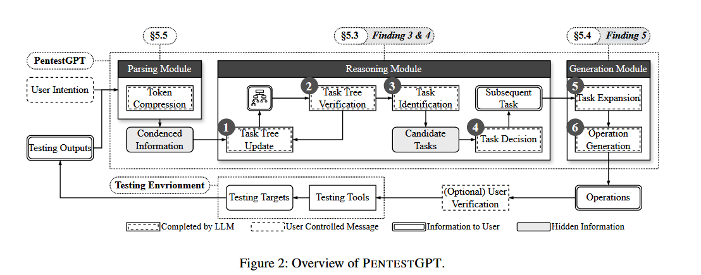
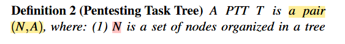
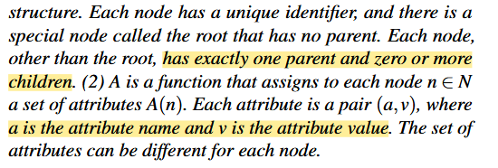
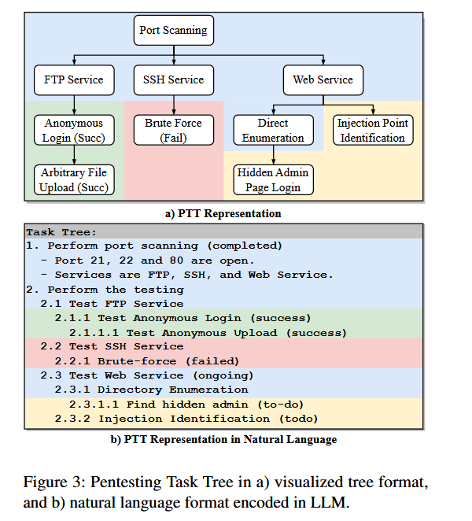
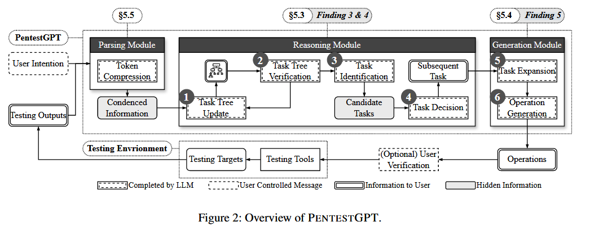
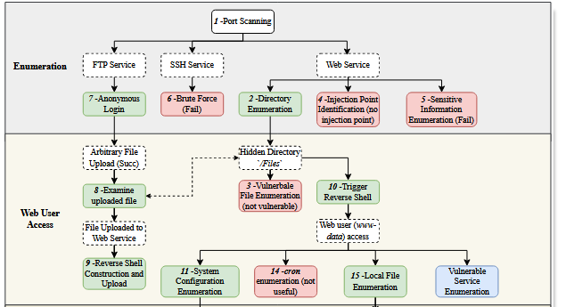
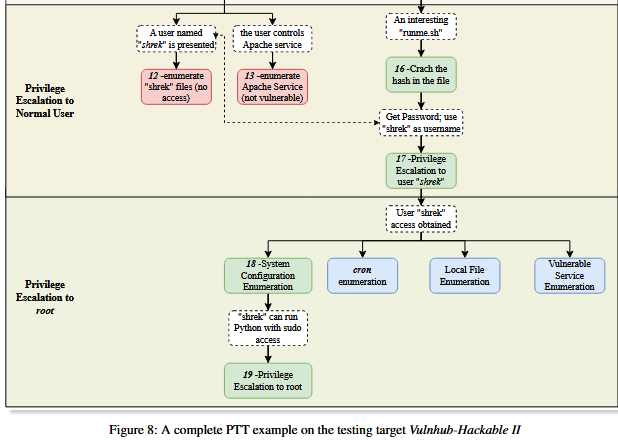

<!--
 * @Author: coffeecat
 * @Date: 2025-03-04 10:31:11
 * @LastEditors: Do not edit
 * @LastEditTime: 2025-03-04 15:20:14

-->

# PentestGPT

## abstract

1. 提出一个**benchmark**，对现有模型评估其在渗透测试领域的能力

> 包含来自 HackTheBox 和 VulnHub 等领先平台的大量测试机器。
> 该基准测试包括 182 个子任务，涵盖 OWASP 的前 10 个漏洞，i

> 这是对 LLM 执行**自动渗透测试能力的首次系统**和定量研究

2. 评估表明，在基准目标中，PENTESTGPT 不仅优于 LLM，与 GPT-3.5 模型相比，任务完成率提高了 228.6%，而且在应对现实世界的渗透测试目标和 CTF 挑战方面也被证明是有效的。  

>问题: 
>虽然 LLM 展示了对渗透测试过程中**特定子任务的熟练程度**， 
>例如使用测试工具、解释输出和提出后续行动， 
>但他们也遇到了维护整个测试场景的**整个上下文的困难**。 

3. **PENTESTGPT**，一个由 LLM powered 的自动化渗透测试框架

>PENTESTGPT 包含**三个自交互模块**， 
>每个模块都处理渗透测试的**各个子任务**， 
>以缓解与上下文损失相关的挑战。 

## Benchmark
> - [ ] benchmark 

## Exploratory Study

> - [ ] exploratory study

## Methodology

### Overview

PENTESTGPT 包含三个核心模块：***推理模块、生成模块和解析模块。***  
**每个模块都保留一个 LLM 会话及其对话和上下文。** 不同的模块处理不同类型的消息。

用户与 PENTESTGPT 连续交互，其中不同的模块处理不同类型的消息。这种互动最终会做出最终决定，建议用户应该进行渗透测试过程的后续步骤。

### 设计原理 Design Rationale

> 我们的主要设计考虑因素来自于之前的探索性研究（第 4 节）中观察到的三个挑战:
> >1. the issue of penetration testing context loss due to memory retention.  由于内存？记忆？保留大小问题而导致的渗透测试上下文丢失的问题。
> >2. LLM chatbots’ tendency to emphasize recent conversation content. LLM 聊天机器人倾向于强调最近的对话内容。
> >3. inaccurate results generation by LLMs. LLM 生成的结果不准确。

PENTESTGPT 旨在应对这些挑战，使其更适合渗透测试任务。

**我们从现实世界的渗透测试团队所采用的方法中汲取灵感。**

主管规划总体程序，将它们细分为各个测试人员的子任务。 
每个测试人员在没有对更广泛的背景有详尽的了解的情况下,独立执行他们的任务并报告结果。
然后，主管确定接下来的步骤，可能重新定义任务，并触发下一轮测试。

 **从本质上讲，主管规划管理整体策略，而不会陷入测试的细节中。**
 
 
这种方法反映在 PENTESTGPT 的功能中，提高了其在进行渗透测试时的效率和适应性。

我们的策略将渗透测试分为两个过程：
确定下一个任务 和 生成完成任务的具体操作。 
每个过程由一个 LLM session提供支持。

在此设置中，**负责任务识别的 LLM 会话保留了正在进行的渗透测试状态的完整上下文**。
同时，**详细操作的生成**和**结果信息的解析**由其他会话管理。
***这种职责分工促进了有效的任务执行，同时保留了总体上下文。***  

为了帮助 LLM 有效地执行渗透测试任务，我们**设计了一系列与用户输入一致的提示**。  在此过程中，我们使用了思路链 **（CoT）** [43] 方法。 正如 CoT 所揭示的那样，LLM 的性能和推理能力可以使用输入、思维链、输出提示格式得到显着增强。思维链代表了导致结果的一系列中间自然语言推理步骤。 

我们将渗透测试任务分解为微步骤，并通过prompt with examples，   
以指导 LLM 逐步处理渗透测试信息，最终获得预期的结果。

下图为三个模块配合运行图。

### Reasoning module 
推理模块在我们的系统中起着举足轻重的作用，  
**类似于**从宏观角度监督渗透测试任务的**团队领导**。

* 为了有效地监督渗透测试过程并提供精确的指导，
将**测试程序和结果转换为自然语言格式**至关重要。 
从通常用于概述渗透测试程序的攻击树的概念中汲取灵感，我们引入了**渗透测试任务树 （PTT）** 的概念。这种测试状态表示的新方法**植根于属性树**的概念。

>  
> 
> 跟硬凑出来的似的， 但是确实很详细
>   具体PTT即如下：
> 

推理模块通过四个关键步骤展开在 PTT 上运行。

1. 该模块首先解释用户的目的，以创建初始 PTT。
    这包括使用**包含上述 PTT 定义和实际示例的prompt提示**来指示 LLM。
    对 LLM 的输出进行**解析**，以确保正确表示树结构

    ***Reasoning Module 通过维护一个包含整个渗透测试过程的任务树，有效地克服了内存损失问题。***

2. 更新树信息后，将对新更新的 PTT 执行验证步骤，以确定其正确性。
   **此过程显式检查是否仅修改了 PTT 的叶节点**，这与*渗透测试过程中的原子操作应仅影响最低级别子任务的状态*的原则一致。这一步确认了推理过程的正确性，防止了由于LLM的幻觉而对整个树结构造成任何潜在的改变。**如果出现差异，则信息将返回到 LLM 进行更正和重新生成**

3. 使用更新的 PTT，推理模块**评估当前的树状态并确定可行的子任务**，这些子任务可以作为进一步测试的候选步骤

4. 该模块评估这些子任务导致成功渗透测试结果的可能性，然后，它会**推荐 top 任务**作为输出。该任务的预期结果随后被转发到生成模块进行深入分析。

我们设计了**四组prompt提示，按顺序指导推理模块完成每个阶段**。    
为了提高结果的可重复性，我们使用一种称为**提示生成的技术**进一步优化了这些提示   
根据我们的实践经验，我们观察到 LLM 擅长解释与渗透测试相关的树状结构信息，并且可以根据测试输出准确更新这些信息

### Generation module

*生成模块将推理模块中的**特定子任务转换为具体的命令**或指令*
**每次收到新的子任务时，都会在 Generation Module 中启动一个新的会话。**

此策略有效地将*总体渗透任务的上下文与正在执行的直接任务隔离开来*，使 LLM 能够完全专注于生成特定命令。

我们的设计不是直接将接收到的子任务转换为特定的操作，  
而是采用 CoT 策略 [43] 将这个过程分为两个连续的步骤。 

5. 在从推理模块收到一个简洁的子任务后，生成模块**首先将其扩展为一系列详细的步骤**。
   值得注意的是，与此子任务关联的**提示要求 LLM 考虑测试环境中可用的可能工具和操作**。

6. 随后，生成模块将这些**扩展步骤**中的每一个**转换为可执行的精确终端命令**，
   或转换为**要执行的特定图形用户界面 （GUI）作的详细说明**。

完整渗透测试目标的详细 PTT 生成过程
> 
> 

### Parsing Module

解析模块作为一个**支持接口**运行，
能够有效地处理用户和其他两个核心模块之间交换的自然语言信息。

> 有两个需求可以主要证明这个模块的存在。
> 1.首先，安全测试工具的输出通常很冗长，充满了无关的细节，这使得将这些扩展输出直接馈送到 LLM 中在计算上成本高昂且不必要的冗余。
> 2.没有安全领域专业知识的用户可能难以从安全测试输出中提取关键见解，这在总结关键测试信息方面带来了挑战。

在 PENTESTGPT 中，解析模块被设计为处理四种不同类型的信息
（1） 用户意图，这是用户提供的指令，用于指示下一步行动，（2） 安全测试工具输出，代表由一系列安全测试工具生成的原始输出，（3） 原始 HTTP Web 信息，包括来自 HTTP Web 界面的所有原始信息，以及 （4） 在渗透测试过程中提取的源代码。对于源代码分析，我们集成了 GPT-4 代码解释器来执行任务

**用户必须指定他们提供的信息的类别，
每个类别都与一组精心设计的提示配对**。

