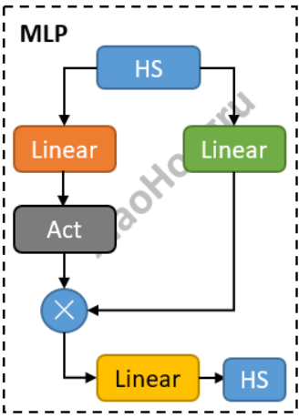

# Qwen2 代码简学

[重要参考文献 Datawhale](https://github.com/datawhalechina/tiny-universe/tree/main/content/Qwen-blog)


## 找到源码

> 首先使用 pip show transformers找到该包的位置，然后cp为transformer_local，接着之后使用时，使用transformer_local替代transformers就可以方便清楚的知道源码、函数调用等。


>或者在 huggingface的github官网的官方库里找到，然后下载也可以。


## Qwen2架构图


如图，对于输入的一段文本，比如”hello“， 

​	首先经过 Tokenizer 变成 词表里对应的数值。

​	然后经过 Embedding 得到高维向量，

​	接着经过 多个 Decoder layer（因为是Decode only的模型），

​	最后 RMSNorm，线性层 然后得到最终输出。

其中Decoder layer主要涉及 atten、mlp、norm。

<font color='red'>Qwen的主干： Embeding、DecoderLayers、RMSNorm</font>

`一个注意点： hidden_states在处理过程中其实 shape都是不变的`

## Embeding


## DecoderLayers

（RMSNorm+Atten）做残差  、 然后(RMSNorm+mlp)再做残差


### Qwen2Attention

```python
# 三种atten
QWEN2_ATTENTION_CLASSES = {
    "eager": Qwen2Attention,  # 一般情况下是这个
    "flash_attention_2": Qwen2FlashAttention2,
    "sdpa": Qwen2SdpaAttention,
}

class Qwen2DecoderLayer(nn.Module):
    def __init__(self, config: Qwen2Config):
        super().__init__()
        self.hidden_size = config.hidden_size
        # atten  总共有三种atten
        self.self_attn = QWEN2_ATTENTION_CLASSES[config._attn_implementation](config, layer_idx)
		# mlp
        self.mlp = Qwen2MLP(config)
        # 下面两个rmsNorm是一样的
        self.input_layernorm = Qwen2RMSNorm(config.hidden_size, eps=config.rms_norm_eps)
        self.post_attention_layernorm = Qwen2RMSNorm(config.hidden_size, eps=config.rms_norm_eps)
	
    def forward(............
        residual = hidden_states
        #  norm
        hidden_states = self.input_layernorm(hidden_states)  # RMSNorm标准化
        #Attention
        hidden_states, self_attn_weights, present_key_value = self.self_attn(  
            hidden_states=hidden_states,
            attention_mask=attention_mask,
            position_ids=position_ids,
            past_key_value=past_key_value,
            output_attentions=output_attentions,
            use_cache=use_cache,
            **kwargs,
        )
        # 做残差
        hidden_states = residual + hidden_states
                
        residual = hidden_states
        # 同样的RMSNorm标准化
        hidden_states = self.post_attention_layernorm(hidden_states)
        # mlp
        hidden_states = self.mlp(hidden_states)
        # 做残差
        hidden_states = residual + hidden_states

        outputs = (hidden_states,)

        return outputs
```


### Qwen2MLP

输入`hidden_state`并行送入两个`Linear`层，其中一个激活一下，再与另一个相乘，最终再经过一个`Linear`，输出最终结果。



```python
class Qwen2MLP(nn.Module):
    def __init__(self, config):
        super().__init__()
        self.config = config
        self.hidden_size = config.hidden_size
        self.intermediate_size = config.intermediate_size

        # 三个全连接层
        self.gate_proj = nn.Linear(self.hidden_size, self.intermediate_size, bias=False)
        self.up_proj = nn.Linear(self.hidden_size, self.intermediate_size, bias=False)
        self.down_proj = nn.Linear(self.intermediate_size, self.hidden_size, bias=False)
        self.act_fn = ACT2FN[config.hidden_act]

    def forward(self, x):
        # 将hidden_state输入两个Linear，其中一个gate_proj激活再与up_proj相乘，最后输入给down_proj
        down_proj = self.down_proj(self.act_fn(self.gate_proj(x)) * self.up_proj(x))
        return down_proj
```


这个 MLP 类实现的是一种特殊的多层感知机设计，它包含了一个门控机制（gating mechanism）。

门控机制是一种常见的技术，用于控制信息的流动。

具体来说，`gate_proj 和 act_fn 一起实现了一个门控单元`，它将输入 x 转换为一个介于 0 和 1 之间的值（假设 act_fn 是 sigmoid 或者其他能将值限制在 [0, 1] 区间的激活函数）。

然后，这个门控值与 up_proj(x) 的结果相乘，从而在元素级别（element-wise）控制信息的流动。这个过程可以理解为：对于每一个输入元素，门控单元都会决定多少信息能够通过。

最后，`down_proj 将门控后的值再投影回原始的 hidden_size 维度`。


## RMSNorm


```python
class Qwen2RMSNorm(nn.Module):  # 标准化层
    def __init__(self, hidden_size, eps=1e-6):
        """
        Qwen2RMSNorm is equivalent to T5LayerNorm
        """
        super().__init__()
        self.weight = nn.Parameter(torch.ones(hidden_size))
        self.variance_epsilon = eps

    def forward(self, hidden_states):
        input_dtype = hidden_states.dtype
        hidden_states = hidden_states.to(torch.float32)
        variance = hidden_states.pow(2).mean(-1, keepdim=True)
        hidden_states = hidden_states * torch.rsqrt(variance + self.variance_epsilon)
        return self.weight * hidden_states.to(input_dtype)
```


