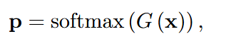
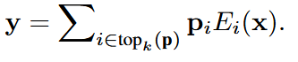
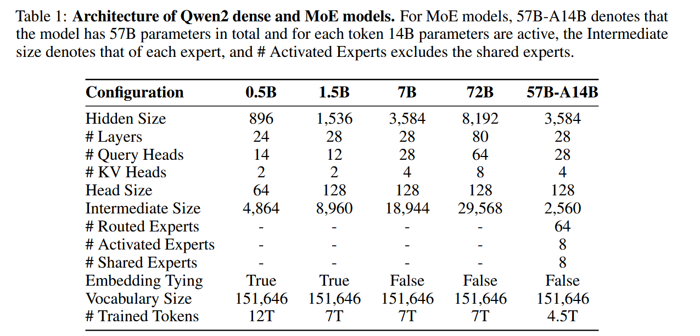

# Qwen2

## intro简介

Qwen2 使用了transformer架构，用next-token prediction进行预测。
Qwen2发行版包括0.5b 、1.5b 、7b 、72b的dense model，以及57b的MOE model
pre-training阶段，用了7万亿的token
post-training阶段，使用了 supervised fine-tuning 和 direct preference optimization

## Tokenizer分词器

使用了byte-level byte-pair encoding

所有的模型都使用了相同的词汇库，词汇库包含151643个常规词和3个control token。

## architecture架构

基于transformer架构，
具体而言，包括
1) dense language mode of 4 scales
2) a mixture of experts model

### Dense model
Dense model即多层transformer层，每一层都是由注意力机制和前馈全神经网络FNNs组成。

注意：
**Grouped Query Attention**
**Dual Chunk Attention with YARN**

1. 使用Grouped Query Attention  代替了 multi-head attention（MHA）。
    GQA 优化推理过程中 KV 缓存的使用，显着提高吞吐量。

2. Dual Chunk Attention将长序列分割成可管理长度的块。

   如果输入可以在一个块中处理，DCA 会产生与原始注意力相同的结果。否则，**DCA 有助于有效捕获块内和块间标记之间的相对位置信息**，从而提高长上下文性能。此外，我们还使用 **YARN** 来重新调整注意力权重，以获得更好的长度外推。

此外，我们遵循 Qwen，使用 **SwiGLU** 进行激活，使用旋转位置嵌入 (**RoPE**) 进行位置嵌入，**QKV 偏差** 进行注意力，**RMSNorm** 和 为了训练稳定性的**预归一化**。

### MOE model

> MoE model和Dense model的区别在于： 
>
> 与原始的前馈全连接网络FFN不同在于，**MoE FFN由n个独立的FFNs组成，每一个FFN充当一个专家。**

在moe中，

对于每一个输入的token而言，

先由 一个**门控网络** 输出token与各个专家的适配概率 p，

接着，再由**指定的专家**进行计算。  

> 将Dense model转换为 MoE model的简单直接的策略是：
>
> 将每个专家的参数设置为等于原始密集模型中单个 FFN 的参数。

**专家粒度：**本模型使用**细粒度的专家**，创建较小规模的专家，同时激活更多数量的专家。给定相同数量的专家参数和激活参数，细粒度专家提供更丰富的专家组合集。

**专家路由：** **在 MoE 层内集成共享专家和特定于路由的专家**已成为一个显着趋势。我们采用这种方法，因为它有助于共享专家在各种任务中的应用，同时保留其他专家在特定路由场景中选择性使用。

**专家初始化：**我们利用密集模型的权重，以与升级改造类似的方式初始化专家。

给定指定的专家中间大小 hE、专家数量 n 和原始 FFN 中间大小 hFFN，FFN 被复制 ⌈n×hE/hFFN⌉ 次。为了促进每个 FFN 副本内的多样性，参数沿着中间维度进行shuffle改组。这保证了每个细粒度专家即使在不同的 FFN 副本中也能展现出独特的特征。随后，从 FFN 副本中提取这些专家，并丢弃剩余的维度。**对于每个细粒度专家，其 50% 的参数会被随机重新初始化。**

## Pre-Training预训练

在 Qwen2 的预训练中，我们的工作重点是**完善数据集**和**研究有效处理扩展上下文长度的方法**。

### pre-training data 预训练数据

预训练中开发了一个新的、**高质量的、大规模的、多语言的**数据集。关键点如下：

**数据集质量**：**数据过滤**使用了额外的**启发式算法**和基于**模型**的方法，例如使用了Qwen来过滤低质量数据。**数据合成**也利用了Qwen。

**数据拓展：**我们收集了大量的高质量代码、数学和多语言数据，增强了模型在各自领域的能力。这个新数据集支持大约 30 种语言。

**数据分布：**为了确保模型学习类似于人类学习的分布，我们在缩小模型上进行实验，以**优化来自不同来源和领域的数据的混合**。

注意：Qwen2 预训练过程中集成了**高质量的多任务指令数据**，以增强**情境学习(in-context)**和**指令跟踪(instruction-follow)**能力。

### long context

为了增强上下文处理能力，预训练的最后阶段将上下文长度**从 4,096 个token增加到 32,768 个token**。这种扩展还伴随着**大量高质量、长数据**的引入。结合这些增强功能，我们将 **RoPE 的基频从 10,000 修改为 1,000,000**，以优化长上下文场景中的性能

为了充分利用模型的长度外推潜力，我们采用了 **YARN 机制**和 **Dual Chunk Attention 机制**。这些策略使模型能够处理多达 131,072 个标记的序列，同时保持高性能。

## Post-Training 

