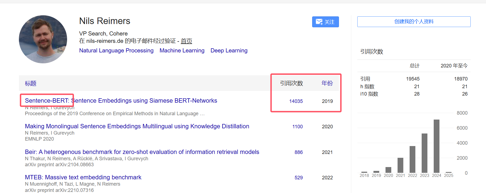
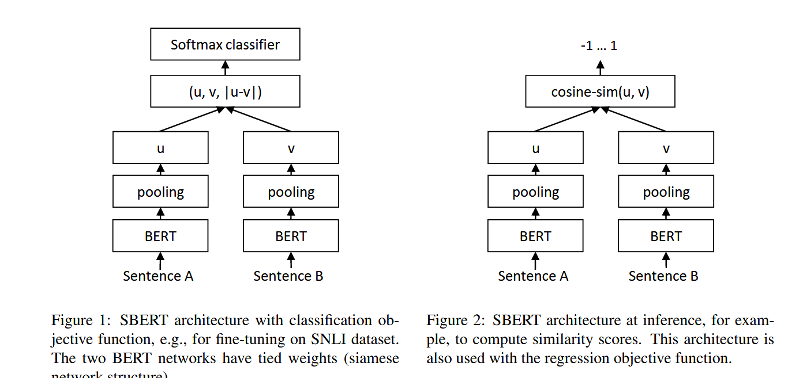
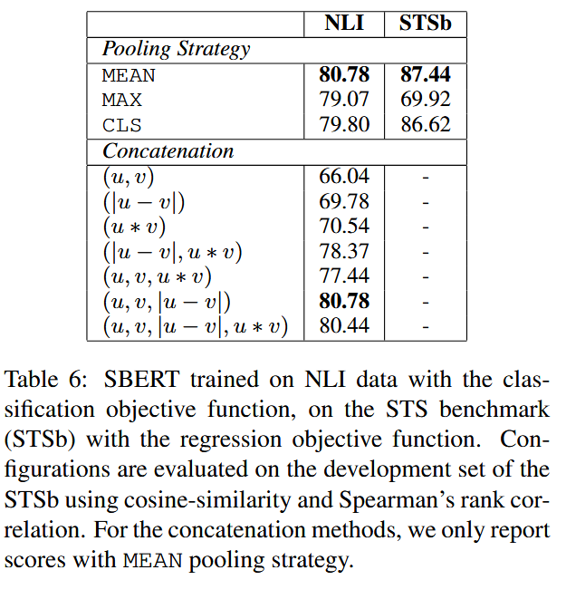

# Sentence-BERT

## 作者简介

作者叫做<font color='red'>Nils Reimers </font>

<font color='red'>2019-08-27</font>发布在 Published at<font color='red'> **EMNLP**</font> 2019

凭借此论文，作者成功晋级**<font color='red'>万引</font>**




Department of Computer Science, Technische Universit ̈at Darmstadt

Ubiquitous Knowledge Processing Lab (UKP-TUDA) 

作者是 <font color='red'>达姆施塔特工业大学</font> （**<font color='red'>德国</font>**）计科系 无处不在的知识处理实验室 成员。


## 摘要

**<font color='red'>BERT</font>**（Devlin 等人，2018）和 **<font color='red'>RoBERTa</font>**（Liu 等人，2019）在<font color='green'>语义文本相似性</font>（STS）等句子对回归任务上创下了新的最先进性能。

然而，它要求将两个句子都输入网络，这会导致<font color='red'>巨大的计算开销</font>：使用 BERT 在 10,000 个句子的集合中找到最相似的一对需要大约 5000 万次推理计算（约 65 小时）。

BERT 的构造使其不适合语义相似性搜索以及聚类等无监督任务。

在本文中，我们提出了 <font color='red'>**Sentence-BERT (SBERT)**</font>，这是对预训练 BERT 网络的修改，它<font color='red'>使用siamese 和 triplet网络结构</font>来获得语义上有意义的句子嵌入（使用<font color='red'>余弦相似度</font>进行比较）。

这减少了寻找最相似对的工作量，从使用 BERT / RoBERTa 的 65 小时减少到使用 SBERT 的大约 5 秒，同时保持了 BERT 的准确性。


[代码官方地址](https://github.com/UKPLab/sentence-transformers)


## model

> 主要是这两张图片，**左边是<font color='green'>分类</font>任务， 右边是<font color='green'>回归</font>任务** 
>
> 
>
> 


$$
\begin{array}{l}\\
& classification：\\
&& 我们将句子嵌入 u 和 v, 与逐元素间做差得到的 |u − v| 连接起来,\\
&& 并将其与可训练权重 W_t ∈ R^{3n\times k} 相乘：\\
&& 即： o = softmax(W_t(u, v, |u − v|)) \\ 
&&其中 n 是句子嵌入的维度，k 是标签的数量。我们优化\color{red}{交叉熵损失}\\
\\
\\
& regression: \\
&& 计算两个句子嵌入 u 和 v 之间的余弦相似度。\\
&& 我们使用均方误差损失作为目标函数。\\
\end{array}
$$


**pooling**


SBERT 在 BERT / RoBERTa 的输出中添加了pooling操作，以导出固定大小的句子嵌入。

<font color='red'>三种</font>池化策略：

使用<font color='red'> CLS-token</font> 的输出，

计算<font color='red'>所有输出向量的平均值</font>（MEAN strategy），

并计算输出向量的 max-over-time（<font color='red'>MAX</font> strategy）。

默认配置是 MEAN。


> <font color='green'>不同的池化策略（MEAN、MAX 和 CLS）与 不同concatenation串联模式的影响。</font>
>
> 对于分类目标函数，不同的concatenation方法。对于每种配置，10次不同随机数种子然后取平均。
>
> 对于分类目标函数，我们在 SNLI 和 Multi-NLI 数据集上训练 SBERTbase。
>
> 对于回归目标函数，我们在 STS 基准数据集的训练集上进行训练。
>
> 性能是根据 STS 基准数据集的开发划分来衡量的。
>
> 
>
> 当使用 NLI 数据的<font color='green'>分类</font>目标函数进行训练时<font color='red'>，池化策略的影响相当小。串联模式的影响要大得多。</font>
>
> 
>
>
> 当使用<font color='green'>回归</font>目标函数进行训练时，我们观察到<font color='red'>池化策略有很大的影响</font>。在那里，MAX 策略的表现明显比 MEAN 或 CLS token策略差。


> 训练细节：
>
> SNLI 是 570,000 个句子对的集合，带有矛盾、内含和中性标签注释。
>
> MultiNLI 包含 430,000 个句子对，涵盖一系列口语和书面文本类型。
>
> 使用 3 路 softmaxclassifier 目标函数对一个 epoch 的 SBERT 进行微调。我们使用了 16 的批量大小、学习率为 2e−5 的 Adam 优化器以及超过 10% 的训练数据的线性学习率预热。我们的默认池化策略是 MEAN。


## 简单代码使用

Sentence-Transformer 是一个 <font color='red'>python 框架</font>，用于句子和文本嵌入

可以使用这个框架计算100多种语言的句子或者文本嵌入，可以用于计算句子相似度，文本相似度，语义搜索，释义挖掘等下游任务

这个框架是<font color='green'>基于 pytorch 和 transformer 的</font>，并且提供大量的预训练模型，也易于在自己的模型上做微调 fine-tune.

```python
!pip install -U sentence-transformers -i https://pypi.tuna.tsinghua.edu.cn/simple
```


```python
from sentence_transformers import SentenceTransformer,util
import torch 
device = 'cuda' if torch.cuda.is_available() else 'cpu'
model = SentenceTransformer('paraphrase-distilroberta-base-v1', device=device)

# Two lists of sentences
sentences1 = ['The cat sits outside',
             'A man is playing guitar',
             'The new movie is awesome'] ## 最相似

sentences2 = ['The dog plays in the garden',
              'A woman watches TV',
              'The new movie is so great'] ## 最相似

# 获得词向量
embedings1 = model.encode(sentences1, convert_to_tensor=True)
embedings2 = model.encode(sentences2, convert_to_tensor=True)

# 计算余弦相似度
cosine_scores = util.pytorch_cos_sim(embedings1, embedings2)

# 输出结果
for i in range(len(sentences1)):
    print("{} \t\t {} \t\t Score: {:.4f}".format(sentences1[i], sentences2[i], cosine_scores[i][i]))
"""
>>>
modules.json: 100%|█████████████████████████████████████████████████████████████████████| 229/229 [00:00<00:00, 86.2kB/s]
config_sentence_transformers.json: 100%|████████████████████████████████████████████████| 122/122 [00:00<00:00, 53.6kB/s]
README.md: 100%|████████████████████████████████████████████████████████████████████| 3.78k/3.78k [00:00<00:00, 1.25MB/s]
sentence_bert_config.json: 100%|██████████████████████████████████████████████████████| 53.0/53.0 [00:00<00:00, 17.6kB/s]
config.json: 100%|███████████████████████████████████████████████████████████████████████| 718/718 [00:00<00:00, 239kB/s]
model.safetensors: 100%|██████████████████████████████████████████████████████████████| 328M/328M [02:13<00:00, 2.46MB/s]
tokenizer_config.json: 100%|█████████████████████████████████████████████████████████| 1.32k/1.32k [00:00<00:00, 439kB/s]
vocab.json: 100%|█████████████████████████████████████████████████████████████████████| 798k/798k [00:00<00:00, 1.84MB/s]
merges.txt: 100%|█████████████████████████████████████████████████████████████████████| 456k/456k [00:00<00:00, 1.57MB/s]
tokenizer.json: 100%|███████████████████████████████████████████████████████████████| 1.36M/1.36M [00:01<00:00, 1.33MB/s]
special_tokens_map.json: 100%|███████████████████████████████████████████████████████████| 239/239 [00:00<00:00, 119kB/s]
1_Pooling/config.json: 100%|████████████████████████████████████████████████████████████| 190/190 [00:00<00:00, 62.0kB/s]
The cat sits outside             The dog plays in the garden             Score: 0.4579
A man is playing guitar                  A woman watches TV              Score: 0.1759
The new movie is awesome                 The new movie is so great               Score: 0.9283
"""
```

