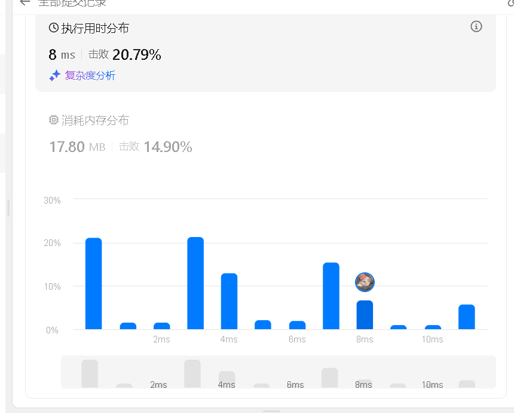
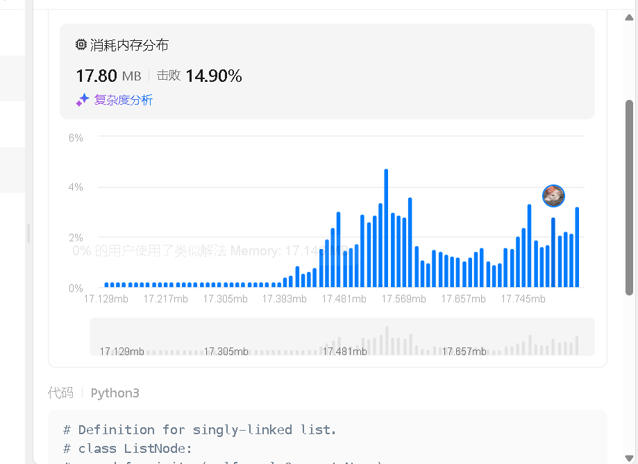
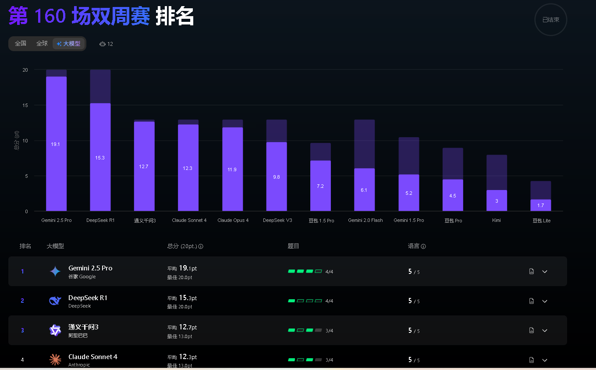
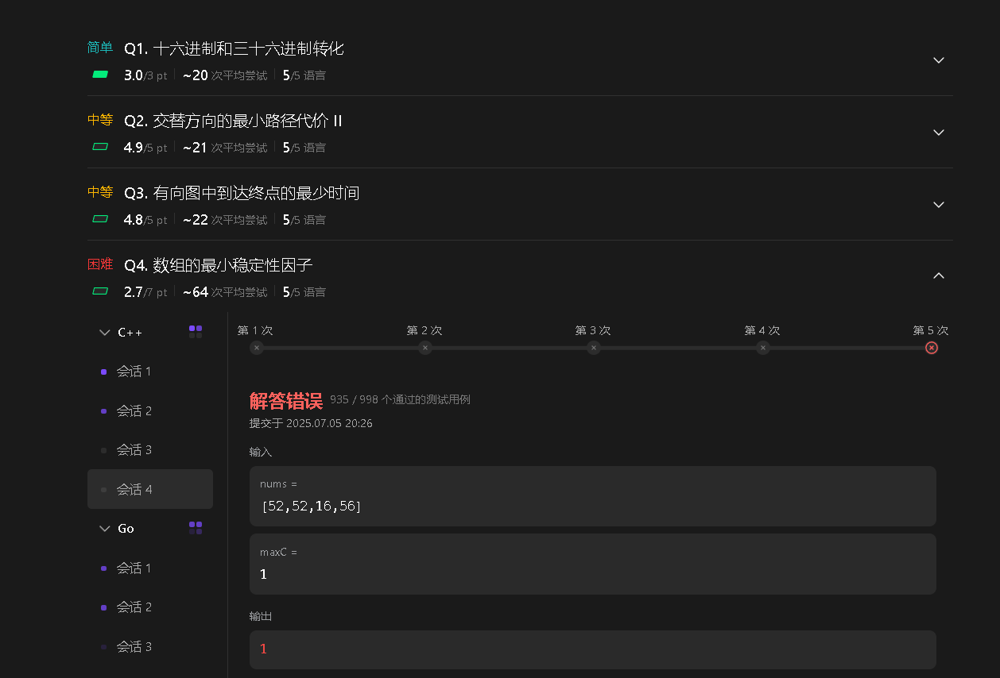
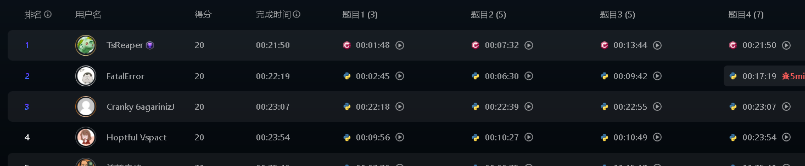
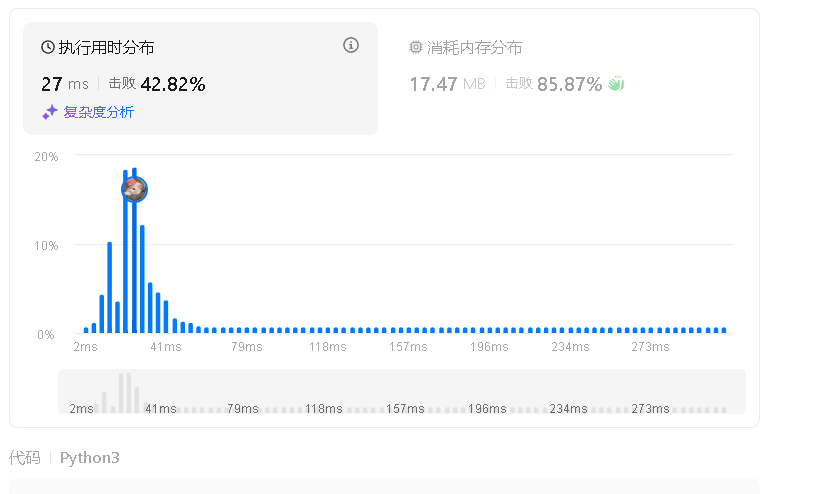

灵活，灵活，再灵活！！！

会议纪要

| 25.11.3 | 生成更优雅的代码的实证研究 |      |
| ------- | -------------------------- | ---- |
|         |                            |      |
|         |                            |      |
|         |                            |      |

> 一段好的code应该是什么样子的呢？
>
> 1. 功能完整性， 能通过test
> 2. 鲁棒性
> 3. 安全性
> 4. 高可读性、可维护、好风格
> 5. 使用 高效的算法， 针对需求（时间快、空间小）
> 6. 可解释、可验证

- 数据获取不易、测量需要测试
- 有人做过
- motivation是啥

# empirial study 

# An Empirical Study on the elegance/graceful/efficiency  of code via llm , how far are we?

 测试程序的 时间空间复杂度的分布图

- Background and Motivation：

技术方案：

* 哪些数据？

> humaneval、mbpp（EvalPlus） HumanEval-X / MBPP-X
>
> APPS 
>
> CodeContests
>
> MultiPL-E
>
> CodeBench

* 需要多语言，

先做python

* 哪些模型？

暂定codellama 7b

以及 qwen 

* 哪些指标？

指标可以分为三类：

1. **功能正确性 (Functional correctness)**
   - `pass@k`：前 k 次生成至少一次通过测试
   - `exact match`：与参考代码完全一致
   - `CodeBLEU`：语法+语义相似度
   - `execution accuracy`：实际运行是否通过测试
2. **优雅性 (Elegance / Gracefulness)**
   - **时间 profiling**：运行时间分布
   - **空间 profiling**：内存占用分布
   - **能耗 profiling**：CPU/GPU 能耗 (可选)
3. **可比性/分析**
   - Edit similarity：LLM vs 人类修改差距
   - Performance distribution：箱线图/直方图展示时间/空间/能耗分布

1. **静态复杂度指标**：圈复杂度（cyclomatic），Halstead 度量，行数 / 嵌套深度，重复代码比率。
2. **算法级复杂度**：对生成解法分析其理论时间/空间复杂度（O(...) 表达式），需要手工或工具辅助推断。
3. **动态度量**：实际执行时间、内存峰值、在压力用例下的行为（通过 COFFE/STGen 生成）。
4. **合成指标**：正确性 + 时间效率的联合评分（COFFE 提倡这种做法）

* 实验：

1. **RQ0 (Prompt 的影响)**
   - 目标：探索不同 prompt 对 LLM 生成代码性能/优雅度的影响。
   - 示例：详细 prompt vs 简单 prompt；是否加上“请写高效/优雅代码”的提示。
2. **RQ1 (LLM vs 人类代码性能分布)**
   - 目标：对比人类编写代码和 LLM 生成代码在时间/空间/能耗上的分布。
3. **RQ2 (不同 LLM 表现的分布)**（**参数量**）（**MOE** 与 普通）（专门**Code Llm**与 llm（**RL** 对其有什么影响）
   - 目标：不同模型（GPT-4, GPT-4-turbo, Claude, LLaMA 2 等）生成代码的性能分布差异。

--  **RQ3 (性能改进方法)**

- 目标：探索简单改进性能的方法，如 **执行反馈 (execution feedback)**、**静态分析优化**、**多次生成选择最佳**。

* 结论：

# pipeline

1. 如何获取代码的运行时间、运行内存呢？

leetcode图片：

LeetCode 的时间和内存评估系统主要依赖于：

1. **预设的输入测试集**。
2. **时间监控工具**（例如 Python 的 `time()`，C++ 的 `chrono`）。
3. **内存监控工具**（例如 `resource` 模块、`valgrind`）。

2. 如何获取多个用户的数据呢？ 如何获取leetcode多用户呢？

leetcode 并没有提供开放api！ 

然而 Codeforces 确实提供了一个开放的 API，允许你获取用户的提交数据、执行时间、内存消耗等信息。这使得你可以非常方便地对比多个用户的代码表现，并进行性能分析。

\# 参见类似leetcode平台

# 类似leetcode平台

> | **平台**            | **开放 API**                       | **主要功能**                   | **可获取的数据**       |
> | ------------------- | ---------------------------------- | ------------------------------ | ---------------------- |
> | **LeetCode**        | 无公开 API                         | 题目、讨论区、题目描述等       | 无执行时间、内存等数据 |
> | **Codeforces**      | 有公开 API                         | 提交记录、比赛数据、排名等     | 执行时间、内存、状态   |
> | **HackerRank**      | 有 API，但主要面向企业客户         | 考试评测、挑战发布、招聘等     | 不提供执行数据         |
> | **AtCoder**         | 有公开 API                         | 竞赛数据、排名、题目           | 执行时间、内存         |
> | **TopCoder**        | 有公开 API                         | 竞赛问题、用户提交、评分排名等 | 执行数据、内存消耗     |
> | **Codewars**        | 有部分 API，面向用户和代码任务管理 | 题目管理、用户数据、代码任务等 | 不提供执行数据         |
> | **Exercism**        | 有 API，主要面向用户数据管理       | 题目、用户进度等               | 不提供执行数据         |
> | **SPOJ**            | 有公开 API                         | 提交记录、竞赛问题等           | 执行时间、内存消耗     |
> | **Google Code Jam** | 无 API                             | 排名、问题列表等               | 无执行数据             |
> | **Kaggle**          | 有公开 API                         | 竞赛数据、排名、数据集等       | 不提供执行数据         |

洛谷

codeforce不能获取别人的源代码，

但是可以获得执行时间、内存消耗等 元信息。

> 测试用例呢？ 应该也不行 估计

https://leetcode.cn/contest/biweekly-contest-160/ranking/?region=llm

api接口问题

合法问题

# 论文

## Analyzing Prominent LLMs: An Empirical Study of Performance and Complexity in Solving LeetCode Problems

研究重点关注的是模型生成代码的 **性能**（执行速度和内存占用）与 **复杂度**（算法效率）。

- **测试平台与任务**: 研究人员选取了 150 个 LeetCode 上的算法和数据结构问题，这些问题被平均分为 **简单、中等、困难** 三个等级。

- 参评模型

  :

  - ChatGPT (基于 GPT-4)
  - Microsoft Copilot (基于 GPT-4)
  - Google Gemini (Version 1.0)
  - DeepSeek (Coder 2.5)

- **编程语言**: 每个模型都被要求用 **Java** 和 **Python** 两种语言来生成问题的解决方案。

- 评估指标

  :

  1. **执行时间**: 代码在 LeetCode 平台上运行所需的时间。
  2. **内存使用**: 代码运行时消耗的内存量。
  3. **算法复杂度**: 分析生成的代码的时间复杂度和空间复杂度（Big-O 表示法）。

##  EffiBench: Benchmarking the Efficiency of Automatically Generated Code

 — 作者 Dong Huang 等人，发表于 2024 年 2 月。[ece.uwaterloo.ca+3arXiv+3aXi+3](https://arxiv.org/abs/2402.02037?utm_source=chatgpt.com)

它包括大约 1,000 个 “效率关键（efficiency-critical）” 的编程题目（主要从 LeetCode 等竞赛平台选取）以及每题对应一个人类专家写的、执行效率最高（或近似最高）解决方案。[CatalyzeX+2Dong HUANG+2](https://www.catalyzex.com/paper/effibench-benchmarking-the-efficiency-of?utm_source=chatgpt.com)

主要目的：评估生成模型（如大语言模型 LLM）所输出代码在 **时间／内存等效率指标** 上，与这些专家解法相比差距如何。[aXi](https://axi.lims.ac.uk/paper/2402.02037?utm_source=chatgpt.com)

例如：论文中指出，某些 LLM（如 GPT‑4）生成代码的执行时间平均是专家解法的约 3.12 倍，最差个案甚至达到 ~13.89 倍；内存使用也差很多。[ece.uwaterloo.ca+2kclpure.kcl.ac.uk+2](https://ece.uwaterloo.ca/~wshang/pubs/HUANG-NEURIPS-2024?utm_source=chatgpt.com)

EffiBench-X: 多语言扩展版，支持 Python, C++, Java, JavaScript, Ruby, Go 等语言。大幅扩展了语言类型与效率比较维度
