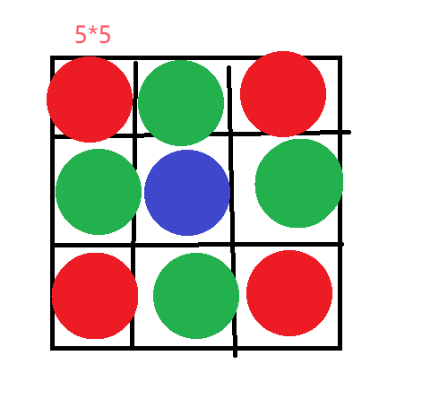

目前input_state 棋盘特征为 $batchsize, feature\_nums, height, width$

```python
state = torch.randn(size=(16, 3, 15, 15 ) )
```


取 $\frac{1}{3}$为边界值，如下图对一个(height,width)棋盘划分，



首先依据input_state ， 得到对应features

```python
corner_list = [state[:, :,0:5, 0:5], state[:,:,10:15, 0:5], state[:,:,10:15, 10:15], state[:,:,0:5, 10:15]]
edge_list = [state[:, :, 0:5, 5:10], state[:, :, 5:10, 0:5], state[:, :, 5:10, 10:15], state[:, :, 10:15, 5:10]]
center_list = [state[:, :, 5:10, 5:10]]
```

针对边、角、中心，构造处理的专家网络$E_i(x)$，

```python
corner_expert = torch.nn.Linear(in_features=5*5, out_features=5*5, bias=True)
edge_expert = torch.nn.Linear(in_features=5*5, out_features=5*5, bias=True)
center_expert = torch.nn.Linear(in_features=5*5, out_features=5*5, bias=True)
```


然后构造门控网络$G(x)$,一个带有 softmax 函数的简单的网络

门控网络 (G) 决定将输入的哪一部分发送给哪些专家 (E),即这三个边、角、中心专家

```python
#batchsize, feature_nums, height, width = 16, 3, 15, 15
gru = torch.nn.Linear(in_features=15*15, out_features=3，bias=False)
```


```python
gru_input = torch.flatten(state, start_dim=2)

gate_res = torch.softmax(gru( gru_input ), dim=1)

# gate   (batch_size, feature_nums, expert_total_number)
```

此时，对于每一张棋盘，都有了对应处理的专家的概率值


对于棋盘的各个专家特征，各个专家分别处理

```python
out = torch.zeros(size=(16, 3, 3, 5*5))

for c in corner_list:
    out[:,:, 0, :] += corner_expert(c.flatten(state, start_dim=2))
for e in edge_list:
    out[:,:, 1, :] += edge_expert(e.flatten(state, start_dim=2))
for c in center_list:
    out[:,:, 2, :] += center_expert(c.flatten(state, start_dim=2))
```

根据路由网络的结果，集成为最终结果：

```python
# gate_res  (batch_size, feature_nums, expert_total_number)
# out   (batch_size, feature_nums=3, expert_total_number=3, 5*5)
out = gate_res.unsqueeze(2) * out
# out (batch_size, feature_nums=3, 5*5)
```

至此，完成了特征的预处理