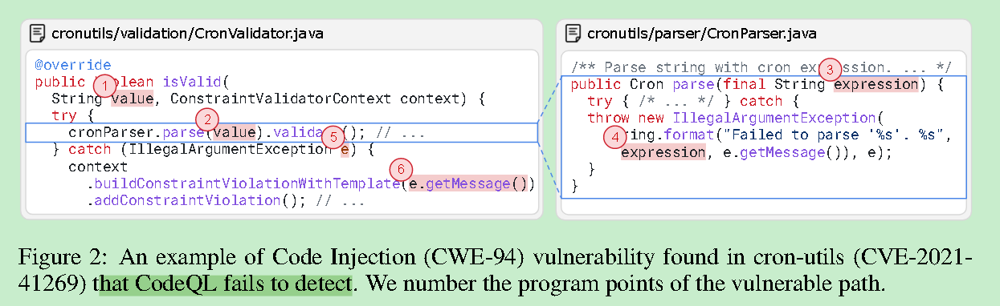
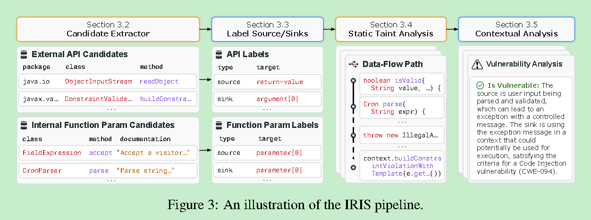

# IRIS: LLM-assisted static analysis for detecting security vulnerabilities

ICLR 25, Mayur Naik University of Pennsylvania 宾尼法西亚

### 摘要

> 利用llm增强 codeql

​	软件往往容易产生安全漏洞。用于检测漏洞的程序分析工具在实际中效果有限，原因在于它们依赖人工标注的说明specifications）。大型语言模型（LLMs）虽然在代码生成方面表现出色，但它们难以对代码进行复杂推理来发现此类漏洞，尤其是当任务需要对整个代码仓库进行分析时。

​	我们提出 **IRIS** —— 一种**神经符号（neuro-symbolic）方法**，系统地结合 LLM 与静态分析，用于执行**全仓库级别的安全漏洞检测推理**。具体而言，IRIS 利用 LLM 来**推断污点分析规范（taint specifications）并执行 上下文分析（contextual analysis）**，从而减少人工编写规范和手动检查的需求。

​	在评估中，我们构建了一个新的数据集 **CWE-Bench-Java**，包含 120 个经过人工验证的真实世界 Java 项目的安全漏洞。最先进的静态分析工具 **CodeQL** 仅能检测出其中的 27 个，而 **IRIS（结合 GPT-4）** 能检测出 55 个（多出 28 个），并将 CodeQL 的平均误报率（false discovery rate）降低了约 **5 个百分点**。此外，IRIS 还发现了 4 个此前未知、现有工具无法检测出的漏洞。

IRIS 项目已开源，地址为：🔗 [https://github.com/iris-sast/iris](https://github.com/iris-sast/iris?utm_source=chatgpt.com)

### 引言

​	软件漏洞对软件应用程序及其用户的安全构成了重大威胁。仅在2023年，就报告了超过29,000个CVE——比2022年多了近4,000个（CVE Trends）。尽管在揭示这些漏洞的技术方面取得了进步，但检测漏洞仍然极具挑战性。其中一种很有前景的技术称为静态污点分析，这种技术广泛应用于流行的工具中，例如GitHub CodeQL（Avgustinov et al., 2016）、Facebook Infer（FB Infer）、Checker Framework（Checker Framework）和Snyk Code（Snyk.io）。然而，这些工具面临几个挑战，这大大限制了它们在实际中的有效性和可及性。

​	由于第三方库API的污点规范缺失导致的假阴性。首先，静态污点分析主要依赖于第三方库API作为源、汇或净化器的规范。在实践中，开发者和分析工程师必须基于他们的领域知识和API文档手动编写这些规范。这是一个费时且容易出错的过程，通常会导致规范缺失，从而使漏洞分析不完整。此外，即使许多库存在此类规范，它们也需要定期更新，以捕捉这些库的新版本中的变化，并覆盖新开发的库。

​	由于缺乏精确的上下文敏感和直观推理导致的假阳性。其次，众所周知，静态分析往往精度较低，即它可能会产生许多假警报（Kang et al., 2022; Johnson et al., 2013）。这种不精确性源于多个来源。例如，源或汇规范可能是不准确的，或者分析可能在代码分支或可能的输入上过度近似。此外，即使规范正确，检测到的源或汇的使用上下文也可能不可利用。因此，开发者可能需要对几个潜在的假安全警报进行分类，这会浪费大量时间和精力。

​	先前数据驱动方法在改进静态污点分析方面的局限性。许多技术已被提出来应对静态污点分析的挑战。例如，Livshits et al. (2009) 提出了一种概率方法MERLIN，用于自动挖掘污点规范。最近的一项工作Seldon（Chibotaru et al., 2019）通过将污点规范推断问题表述为线性优化任务来改进这种方法的可扩展性。然而，此类方法依赖于分析第三方库的代码来提取规范，这既昂贵又难以扩展。研究人员还开发了统计和基于学习的技术来缓解假阳性警报（Jung et al., 2005; Heckman & Williams, 2009; Hanam et al., 2014）。但是，这些方法在实践中仍然有效性有限（Kang et al., 2022）。

​	大型语言模型（或LLM）在代码生成和摘要方面取得了令人印象深刻的进展。LLM还被应用于与代码相关的任务，例如程序修复（Xia et al., 2023）、代码翻译（Pan et al., 2024）、测试生成（Lemieux et al., 2023）和静态分析（Li et al., 2024）。最近的研究（Steenhoek et al., 2024; Khare et al., 2023）评估了LLM在方法级检测漏洞的有效性，结果显示LLM无法对代码进行复杂推理，特别是因为这取决于方法在项目中的使用上下文。另一方面，最近的基准测试如SWE-Bench（Jimenez et al., 2023）显示LLM在项目级推理方面也很差。因此，一个引人入胜的问题是，LLM是否可以与静态分析结合来改善它们的推理能力。在这项工作中，我们在漏洞检测的背景下回答了这个问题，并做出了以下贡献：

​	方法。我们提出了IRIS，一种神经符号方法，用于漏洞检测，它结合了静态分析和LLM的优势。图1展示了IRIS的概述。给定一个项目来分析特定漏洞类（或CWE），IRIS应用LLM来挖掘特定于CWE的污点规范。IRIS使用CodeQL（一种静态污点分析工具）来增强这些规范。我们在这里的直觉是，由于LLM见过众多此类库API的使用，它们对不同CWE的相关API有理解。此外，为了解决静态分析的不精确性问题，我们提出了一种使用LLM的上下文分析技术，它减少了假阳性警报并最小化了开发者的分类努力。我们关键的洞见是，在提示中编码代码上下文和路径敏感信息可以从LLM中引出更可靠的推理。最后，我们的神经符号方法允许LLM进行更精确的全仓库推理，并最小化了使用静态分析工具所需的人类努力。

​	数据集。我们整理了一个手动验证和可编译的Java项目数据集CWE-Bench-Java，包含四个常见漏洞类中的120个漏洞（每个项目一个）。数据集中的项目很复杂，平均包含300K行代码，其中10个项目各超过一百万行代码，这使其成为漏洞检测的一个具有挑战性的基准测试。该数据集以及相应的脚本来获取、构建和分析Java项目已公开可用：https://github.com/iris-sast/cwe-bench-java。

​	结果。我们使用7个多样化的开源和闭源LLM在CWE-Bench-Java上评估了IRIS。总体而言，IRIS与GPT-4结合取得了最佳结果，检测到55个漏洞，比现有最佳静态分析器CodeQL多28个（103.7%）。我们显示，这种增加并不是以假阳性为代价的，因为IRIS与GPT-4结合的平均假发现率（FDR）为84.82%，比CodeQL低5.21%。此外，当应用于30个Java项目的最新版本时，IRIS与GPT-4结合发现了4个先前未知的漏洞。

### motivation示例

​	我们通过在cron-utils（版本9.1.5）中检测一个先前已知的代码注入（CWE-094）漏洞来展示IRIS的有效性，cron-utils是一个用于Cron数据操作的Java库。图2展示了相关的代码片段。传递到isValid函数的用户控制字符串value在没有净化的情况下被传输到parse函数。如果抛出异常，该函数会使用输入构建一个错误消息。然而，该错误消息被用于调用javax.validator中ConstraintValidatorContext类的buildConstraintViolationWithTemplate方法，该方法将消息字符串解释为Java Expression Language（Java EL）表达式。恶意用户可以通过构建包含shell命令的字符串（如Runtime.exec('rm -rf /')）来利用此漏洞，从而删除服务器上的关键文件。

​	检测此漏洞带来了几个挑战。首先，cron-utils库包含13K SLOC（排除空白和注释的代码行），需要对其进行分析以发现此漏洞。这一过程要求跨多个内部方法和第三方API分析数据和控制流。其次，分析需要识别相关的源和汇。在这种情况下，公共isValid方法的value参数在被调用时可能包含任意字符串，因此可能是恶意数据的源。此外，像buildConstraintViolationWithTemplate这样的外部API可以执行任意Java EL表达式，因此它们应被视为易受代码注入攻击的汇。最后，分析还需要识别任何阻止不受信任数据流动的净化器。

​	现代静态分析工具，如CodeQL，在跨复杂代码库追踪污点数据流方面非常有效。然而，由于规范缺失，CodeQL未能检测到此漏洞。CodeQL包含了许多手动 curation 的源和汇规范，覆盖了超过360个流行的Java库模块。然而，手动获取此类规范需要大量人力来分析、指定和验证。此外，即使有完美的规范，CodeQL也可能由于缺乏上下文推理而经常产生众多假阳性，从而增加开发者对结果进行分类的负担。

​	相比之下，IRIS采用了一种不同的方法，通过使用LLM动态推断特定于项目和漏洞的规范。IRIS中基于LLM的组件正确识别了不受信任的源和易受攻击的汇。IRIS使用这些规范增强CodeQL，并成功检测了仓库中检测到的源和汇之间未经净化的数据流路径。然而，增强后的CodeQL会产生许多假阳性，这些假阳性很难使用逻辑规则消除。为了解决这一挑战，IRIS将检测到的代码路径及其周围上下文编码到一个简单的提示中，并使用LLM将其分类为真阳性或假阳性。具体来说，在静态分析报告的8个路径中，有5个假阳性被过滤掉，留下了图2中的路径作为最终警报之一。总体而言，我们观察到IRIS可以检测许多超出CodeQL-like静态分析工具范围的此类漏洞，同时将假警报保持在最低水平。

# insight

有如下 code injection的 vulnerability

识别这样的漏洞一般需要

0. 根据data/control flow找到这些地方， 包括可能会涉及external APIs

1. 识别出source 、 sink 

2. 注意到是否path feasible 并且 是否有sanitizers block 了source到sink的path

codeql是检测taint data flows的高效、现代化 static analysis tool。

然而，这个漏洞codeql没有检测到，原因是missing specifications.

一方面，specification的获取需要大量的人力来分析、指定和验证。

另一方面，即使具有完美的规范，CodeQL 也可能经常由于缺乏上下文推理而产生大量误报。

iris主要在前者发力，即输入一个java project以及一个vulnerable class后，

利用llm，可以正确识别the untrusted source and the vulnerable sink.

然后构造了一个prompt来减少 augmented Codeql所带来的误报。

