# 论文 KNighter

KNighter: Transforming Static Analysis with  LLM-Synthesized Checkers

USA 

arXiv:2503

SOSP   ACM Symposium on Operating Systems Principles

### 摘要

​	静态分析是一种强大的技术，用于在作系统内核等关键系统中检测错误。然而，设计和实现静态分析器具有挑战性、耗时，并且通常仅限于预定义的错误模式。虽然大型语言模型 （LLM） 已显示出静态分析的前景，但**由于计算限制和上下文限制，直接应用它们来扫描大型系统仍然不切实际**。

​	我们介绍了 **KNighter**，这是第一种通过**从历史错误模式中自动合成静态分析器**来解锁可扩展的基于 LLM 的静态分析的方法。我们的主要见解是**利用 LLM 生成以历史补丁知识为指导的专用静态分析器，而不是使用 LLM 直接分析大型系统。**

​	KNighter 通过多阶段合成process实现这一愿景，该管道**`根据原始补丁验证检查器的正确性`**，并采用**`automated refinement process`**来迭代减少**`误报`**。

​	我们对 **Linux 内核的评估**表明，KNighter 生成了高精度的检查器，能够**检测现有人工编写的分析器所忽视的各种错误模式**。迄今为止，KNighters合成的检查器已经在 Linux 内核中发现了 **92 个`新的`、关键的、长期潜伏的错误（平均 4.3 年）**;77 个已确认，57 个已修复，30 个已分配 CVE 编号。这项工作为通过检查器合成为现实世界系统进行可扩展、可靠和可追溯的基于 LLM 的静态分析建立了一种全新的范式。

### 引言

​	基础软件系统（尤其是作系统 （OS） 内核）的可靠性取决于强大的缺陷检测方法。在各种技术中**<u>，`静态分析`[7]因其无需执行即可检查源代码的能力</u>**而脱颖而出，这使得它对于***<u>涉及硬件依赖驱动程序、复杂或很少执行的路径以及难以在实际环境中重现的配置的场景</u>***中不可或缺。与动态方法相比，**`模糊测试`fuzzing需要执行环境，因此只测试实际的运行时路径** [3， 13， 53， 55]，**<u>静态分析（原则上）可以涵盖所有潜在的执行路径，包括实践中很少触发的极端情况</u>**。虽然**`形式化验证技术`**[25,43,54]提供了更强的正确性保证，但其高昂的手动开销使其对于作系统内核等大型系统来说不切实际，这使得静态分析成为一种更具可扩展性和可行性的解决方案。

​	**静态分析问题。**大规模系统给静态分析带来了双重挑战：解决**各种错误模式和管理庞大的代码库**，如图 1 所示。***<u>`理想的静态分析仪应 （i） 检测各种缺陷，包括与细微的、系统特定的语义相关的缺陷，以及 （ii） 高效处理数百万行代码`</u>***。然而，现**有技术通常会在这些关键目标之一上做出妥协**

​	**传统的静态分析。**传统的静态分析器可以<u>有效地识别某些错误类型</u>，但它们***<u>从根本上依赖于预定义的、基于规则的或正式建模的检查</u>***。这种依赖需要**`广泛的领域专业知识和大量的工程工作来开发和维护`**它们[2,10,21]。因此，**这些工具通常会`针对一小部分错误模式进行微调`，这不仅限制了它们检测不可预见缺陷的能力，还阻碍了它们自动解决更广泛问题的可扩展性**。

​	**新兴的基于llm的静态分析**。另一方面，大型语言模型 （LLM） 是发现错误模式的引人注目的工具，部分原因是它们可以直接从历史补丁提交中学习——这是真实修复和相关错误上下文的宝库 [11， 21， 31]。**<u>*它们解析文本和代码内容的能力[5,20,46]表明，llm可以在没有明确规则制定的情况下适应新的错误类型。*</u>** **然而**，直接在大型系统上部署 LLM（例如，超过 3000 万行代码的 Linux 内核）面临着严重的限制。它们的**`有限上下文窗口使得不可能一次上传所有相关的源代码`**，并且**`重复这样做也会产生高昂的计算成本`**（每次彻底扫描可能要花费数百美元）。此外，**LLM可能会产生`幻觉`**[14,22,30]，产生合理但不正确的输出，尤其是在面对复杂的大规模系统时[37]。

​	**洞察力**。我们能否**扩展和自动化静态分析**以**处理不同的错误模式和庞大的代码库**？我们通过利用传统静态分析的优势以及新兴的llm来回答这个问题。更具体地说，**我们建议使用 LLM 合成静态检查器，而不是将基于 LLM 的分析直接应用于整个代码库**。在这种范式中，***<u>`LLM 从历史补丁中学习错误模式，并将这些见解编码到专用的静态分析检查器中`</u>***。这种方法**规避了扫描庞大代码库的高昂成本**和**上下文长度限制**，同时保持了解决各种错误所需的灵活性。此外，通过**根据原始补丁验证每个合成的检查器，我们减轻了幻觉**并生成了**开发人员可以信任和维护的透明、人类可读的逻辑**。

​	**技术挑战和我们的解决方案**。尽管自动检查器合成前景广阔，但生成完整的静态分析逻辑仍然是一项艰巨的挑战——即使是专家也在努力应对。为了解决这个问题，我们引入了一个**多阶段合成process**（§ 3.1），将**`检查器生成分解为可管理的子任务`**。此外，为了通过**减少误报**来提高合成检查器的质量，我们开发了一个**全自动refinement管道**（§ 3.2），该管道利用**`错误报告分类agent`**。这些管道共同产生了在实际场景中部署的强大且实用的检查器

​	我们在一个工具 KNighter 中实现了我们的方法，这是第一个用于合成静态分析仪的全自动管道，建立在**开源 Clang 静态分析仪**之上。该方法可以推广到不同的系统，不过我们在这里的目标是 Linux 内核，这是最基本的软件系统之一。***<u>在对 61 个不同的错误修复补丁的评估中，KNighter 合成了其中 61% 的高质量检查器，在告警分拣智能体的帮助下实现了约 35% 的误报率。</u>***KNighter 在 Linux 内核中发现了 **92 个`新的`长期潜在漏洞**（平均 4.3 年），从而获得了 77 个开发人员确认、57 个修复程序和 30 个 CVE，这证明了实际影响。此外，检测到的漏洞与现有专家编写的分析器发现的漏洞互不重叠、相互独立[2]。这些发现验证了我们方法的有效性及其对系统可靠性的贡献

​	**主要贡献：**

​	1. 新奇。我们引入了一种从补丁提交中合成静态分析器的开创性方法。据我们所知，KNighter 是**第一个全自动静态分析仪生成系统**，为基于 LLM 的静态分析建立了新的范例。

​	2. 方法。我们为 Linux 内核实施了具有**多阶段综合和自动优化管道的 KNighter**。这种设计能够检测大型系统中的不同错误类别。

​	3. 评估。我们证明 KNighter **成功地从 Linux 内核错误修复补丁中合成了跨各种错误类别的有效检查器**，达到了可付诸实践的误报率

​	4.**现实世界的影响**。KNighter 生成的检查器在 **Linux 内核**中发现了 92 个**新的**长期潜伏（平均 4.3 年）错误，其中 77 个已确认，57 个已修复，30 个分配了 CVE 编号，这证明了其对系统可靠性和安全性的实际影响

### 结论

​	本文介绍了 KNighter，这是一种新颖的方法，它改变了 LLM 如何为复杂系统（如 Linux 内核）的静态分析做出贡献。**通过合成静态分析器而不是直接分析代码**，KNighter 弥合了llm的推理能力与分析大规模系统的实际限制之间的差距。KNighter 的实际影响体现在 Linux 内核中发现了 92 个新的、长期存在的错误，其中 77 个已确认，57 个已修复，30 个分配了 CVE

​	展望未来，KNighter 为基于 LLM 的可扩展静态分析开辟了新的可能性。未来的工作可以将这种方法**扩展到 Linux 内核之外的其他系统**，**`纳入额外的学习范式`**，并进一步**`完善检查器生成技术以解决更复杂的错误模式`**。通过利用llm合成工具而不是直接执行分析，我们建立了一种可扩展、可靠且可追溯的范例，用于在关键软件安全应用中利用人工智能。

### 方法

#### case引入 

> 引入 ，Null-Pointer-Dereference vulnerability  pattern
>
> **至少从 2017 年开始（提交 49af64e），Null-Pointer-Dereference vulnerability  pattern便已经出现，我们的分析确定了至少六个解决该问题的历史补丁，但`尚未有静态分析工具来系统地检测这些问题。`**
>
>
> **KNighter 从如下patch中提取关键见解**：devm_kzalloc中未经检查的返回值表示潜在的空指针取消引用漏洞
>
> 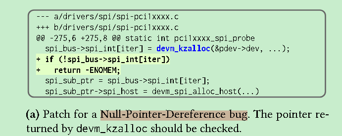
>
>
> 然后，合成检查器synthesized checker（用 CSA Clang Static Analyzer 编写，图 2c）跟踪执行路径中的空检查状态，同时正确处理指针别名，这是一种复杂的静态分析功能
>
>
> 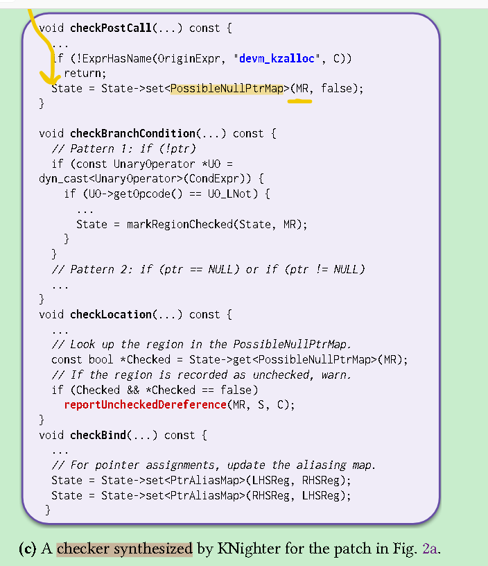
>
> 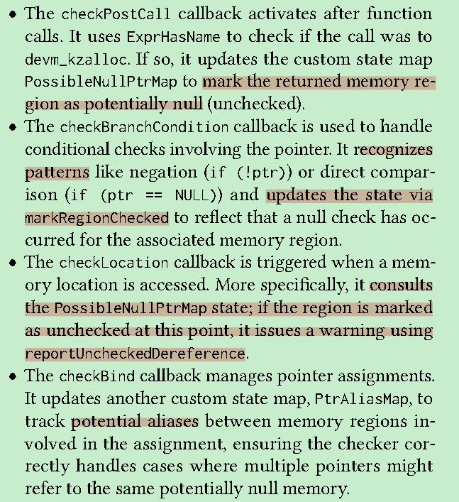
>
> 
>
> 该检查器在 Linux 内核中发现了 3 个新漏洞。图 2b 显示了一个这样的漏洞，它表现出相同的模式，即 devm_kzalloc 调用返回的指针缺少空指针检查。该错误随后被修复并分配为 CVE-2024-50103。
>
> 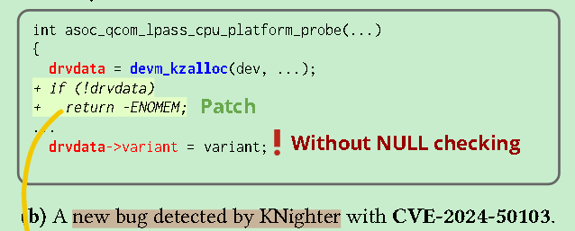
>
> 
>
> ​	**直接使用 LLM 扫描 Linux 内核的成本高得令人望而却步，因为仅devm_kzalloc在 5.4K 文件中就出现了 7K 次以上**。
>
> ​	相比之下，**KNighter 的静态分析器主要消耗 CPU 资源**，而不是重复的 LLM 调用，这使得该方法既可扩展又具有成本效益。 
>
> 此外，由于生成checkers大多是一次性的，因此它们可以自然地与系统一起发展。
>
> 

#### 方法设计

**术语** 

**KNighter** 将**补丁提交**作为输入并输出相应的 **CSA 检查器**。

**valid checkers**可以**正确区分有缺陷的代码和修补的代码**，将修补前的代码标记为有缺陷，同时将修补后的代码识别为正确的。

**plausible checkers**是有效的检查器，通过**低误报率**或**可管理的报告数量**来证明实际效用。

**概述**。

​	KNighter 利用agent workflow来处理用于静态分析器合成的补丁提交，如图 3 所示。

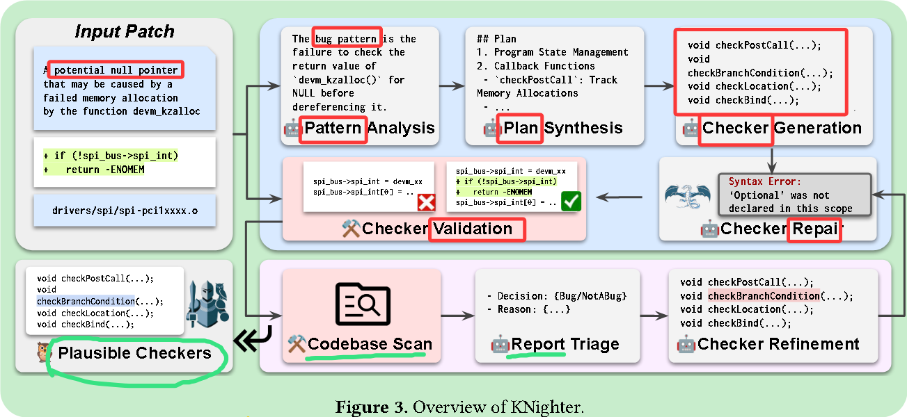

​	它分两个阶段运行：checker合成（§ 3.1）和checker细化（§ 3.2）。在检查器合成阶段，KNighter 分析输入补丁以识别错误模式 （§ 3.1.1），合成检测计划 （§ 3.1.2），并使用 CSA 实现检查器 （§ 3.1.3）。<u>如果发生编译错误，语法修复代理会根据错误消息自动修复它们</u>。此阶段以生成有效检查器结束。

​	在随后的检查器细化阶段，**部署这些有效的检查器来扫描整个代码库**以查找潜在的错误。生成错误报告时，**告警分类代理**会**评估它们是否存在误报**，然后 **KNighter 会相应地优化检查器**。如果<u>扫描生成的报告数量可管理且误报率较低</u>，则 KNighter 会将合理的检查器及其过滤后的报告作为潜在错误进行审查。

##### checker synthesis

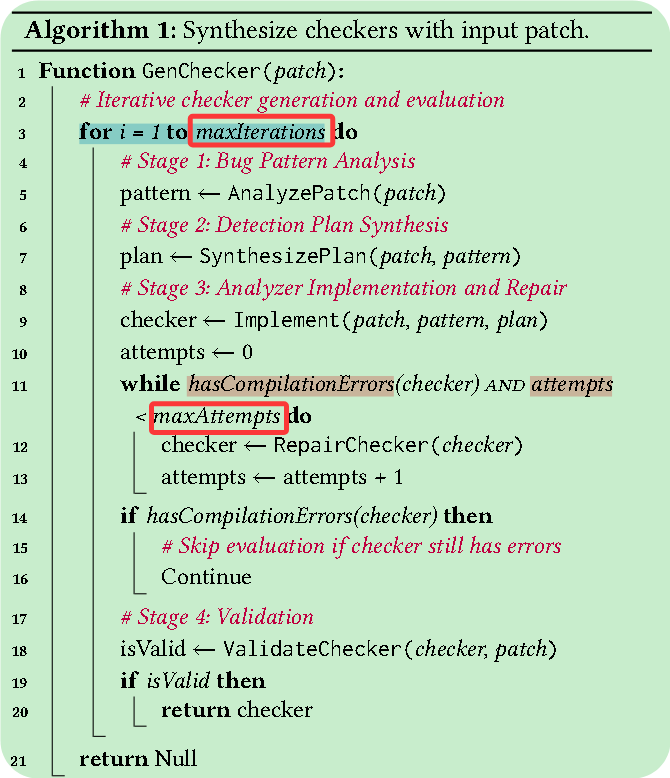

算法1展示了检查器合成的多阶段流水线。

在第一阶段，**KNighter** 会分析补丁中所体现的**漏洞模式**（第5行）。
接着，KNighter 会根据补丁和识别出的漏洞模式**生成合成计划**（第7行）。
在获得计划后，KNighter 使用 **CSA（Clang Static Analyzer）** 来**实现检查器**（第9行）。

如果在编译过程中出现语法错误，则会调用一个**语法修复代理（syntax-repair agent）**来调试并修复这些问题（第12行）。
修复过程最多允许 **maxAttempts** 次尝试（默认值为 5）。

若检查器编译成功，KNighter 会通过检测该检查器能否**区分漏洞代码与修复代码**来验证其有效性（第18行）。
一旦验证通过，检查器就会被返回，用于下一阶段（第20行）。

否则，合成流水线会继续迭代，直到达到 **maxIterations** 次为止。
如果所有迭代均失败，则返回 **Null**，表示无法合成出一个有效的检查器（第21行）。

1. **错误模式分析。**初始阶段涉及分析补丁提交以识别潜在的错误模式。 

​	补丁提交通常由diff patches组成，并且可能包括开发人员关于正在修复的错误的评论，如图 4 所示。我们的目标是提取可以转化为静态分析规则的模式，以进行错误检测。 虽然有时在提交消息中明确描述错误模式，但它们通常需要对补丁中的代码更改进行更深入的分析。

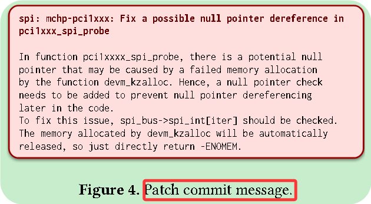

​	我们开发了一个基于 LLM 的代理，专门设计用于执行这种模式分析，提示模板如图 5a 所示。找出 **bug 模式** 除了补丁之外，我们还**`从内核代码库中提取了修改后的完整函数代码`**。这个额外的上下文至关重要，**因为仅补丁差异可能无法捕获所有相关的错误模式，因为某些问题取决于代码的更广泛上下文。**通过向 LLM 提供补丁和完整的函数代码，我们可以更全面地了解正在修补的错误。

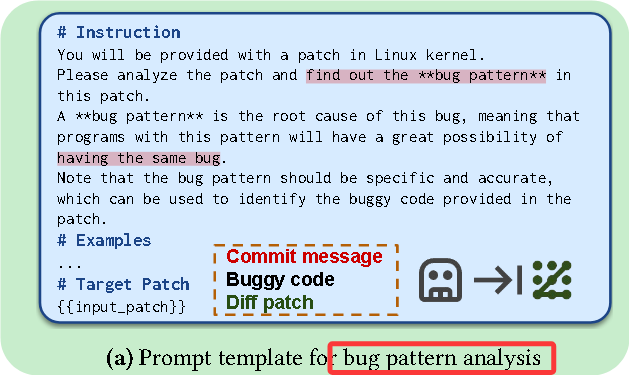

​	

​	从一个补丁中识别出的单个漏洞模式，其**表达范围与复杂度**可能各不相同。以涉及 **devm_kzalloc** 的**空指针解引用（Null-Pointer-Dereference）**为例（见图2a）：一个**广义模式**（例如“检查所有可能返回空指针的函数”）虽然覆盖面更全面，但要识别所有相关函数和条件会带来显著的静态分析挑战，从而**妨碍大语言模型（LLM）实现稳健的检查器**。因此，我们的方法更倾向于从补丁上下文中**提取更具针对性的漏洞模式**。这种模式有助于 LLM 更精确、可控地合成检查器。在**devm_kzalloc** 的示例中，若聚焦于其**返回值**，则能形成一个**更具体的模式**：它既能有效应对所观察到的漏洞类型，又比那种更广、更复杂的模式**更易于 LLM 正确实现**。

2. **计划合成（Plan Synthesis）**。

   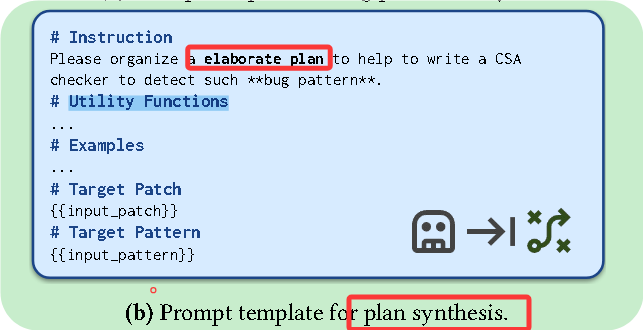

    在识别出漏洞模式后，**KNighter** 会为静态分析器的实现**生成一个高层次的实现计划**。
    该计划有两个关键作用：
    
      1. 它为大语言模型（LLMs）提供**结构化的实现指导**，以防止混乱并促进高效执行；
      2. 它使整个流水线的调试更加容易，因为 LLM 的推理过程因此变得**透明且可追踪**。

   我们在 §5.4.2 的消融实验中验证了该计划合成的重要性，结果表明该机制确实**显著提升了性能**，与其他领域的类似研究结论一致。

   ​	例如，在为“**devm_kzalloc 返回值未检查**”的漏洞模式（见图2c）合成检查器时，系统可能生成包含以下关键步骤的计划：
    (1) 使用程序状态来跟踪来自 `devm_kzalloc` 的内存区域；
    (2) 监控条件分支（`checkBranchCondition`），若检测到空指针检查，则将对应区域标记为“已检查”；
    (3) 检测未检查区域的使用（`checkLocation`），若发现违规使用，则可能报告漏洞。

   这种高层次结构为后续的**检查器实现阶段**提供了明确的指导。

   ​	为了生成这样的实现计划，我们设计了一个**基于 LLM 的智能体（agent）**，其提示模板如图5b所示。
    该智能体以之前总结的漏洞模式作为输入。

   此外，我们维护了一个**专门整理的工具函数数据库**，其中包含用于实现检查器的可复用函数。
    通过在提示中加入这些工具函数的**函数签名与简要说明**，LLM 能够在规划过程中**有效调用这些工具函数**，从而**简化整体任务并提升生成质量**。

3. **分析器实现与语法修复（Analyzer Implementation and Syntax Repair）**。

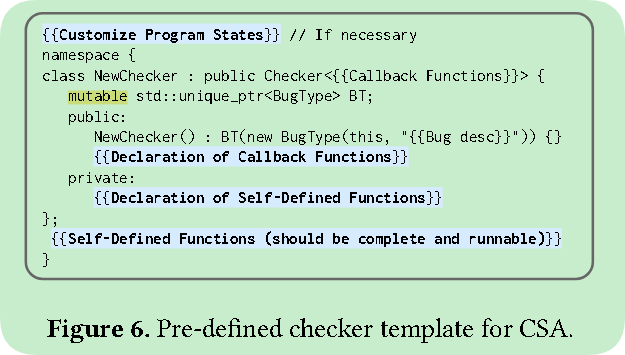

​	在识别出漏洞模式并生成实现计划后，**KNighter** 会利用一个**基于大语言模型（LLM）的智能体**来实现对应的检查器。为了最大化实现的准确性，我们为该智能体提供了**完整的输入信息**：

- 提炼后的漏洞模式；
- 结构化的实现计划；
- 以及一个**预定义的检查器模板**（如图6所示），该模板规范了实现结构，从而**降低实现错误的风险**。

​	此外，我们还提供了一个**工具函数列表**，以辅助实现过程。

​	在合成出的检查器中，可能会出现**编译错误**，例如：

- 调用了错误的静态分析 API，或
- 使用了不正确的变量类型等。

为了解决这些潜在的编译问题，我们引入了一个**专门的调试智能体（debugging agent）**。
 受现有**程序自动修复研究 [50]** 的启发，该智能体能够**自动分析编译器错误信息并进行修复**，从而有效应对由 LLM 产生的语法错误或“幻觉”。

​	这种**自动化调试流水线**确保了最终生成的检查器**在语法上正确且可成功编译**。

4. **验证（Validation）**。

   为了在语义层面上验证生成的检查器，并减轻 LLM 可能带来的不准确性，我们将检查器分别应用于**漏洞代码（补丁前）**和**修复后代码（补丁后）**进行评估（例如 Linux 内核源文件）。

   这种**差分分析（differential analysis）**用于验证：

   - 检查器是否能在原始代码中**正确识别出目标漏洞**，
   - 并在补丁应用后**确认该漏洞已不存在**。

   为了提高效率，我们将验证范围**限制在补丁修改过的文件及其依赖文件**，而不是整个代码库。

   当检查器能在补丁前版本中报告漏洞，且在补丁后版本中**该警告显著减少或消失**时，我们就认为该检查器是**有效的（valid）**。

##### checker refinement

在检查器合成完成后，每个**通过验证的检查器**都会被用于扫描整个系统。
 然而，最初的验证阶段并不能完全避免**在更大代码范围内出现误报（false positives）**——即本来正确的代码被错误地标记为存在漏洞。

为减轻这一问题，我们设计了一种**由 LLM 驱动的迭代优化流程**。
 该流程包括：

- 对生成的漏洞报告进行分析；
- 并将识别出的误报（false positives）反馈给系统，用于**自动改进检查器逻辑**。

主要挑战

自动化的优化过程面临两个主要困难：

1. **漏洞报告内容冗长**，包含大量上下文信息，难以高效处理；
2. **根据误报调试并修改检查器逻辑**需要复杂的分析能力。

优化流程设计

我们的优化流水线针对这两个问题分别设计了对应策略：

1. **报告简化（Report Distillation）**
   - 将生成的漏洞报告**提炼为核心要素**，仅保留静态分析器（如 CSA [12]）标注的**关键代码行**及对应的**执行路径（trace path）**；
   - 去除无关上下文，保留最关键的诊断信息。
2. **智能体驱动分析与优化**
   - 使用**专门的 LLM 智能体**来处理报告。
   - 首先由一个**分诊智能体（triage agent）**对简化后的报告进行分类，判断其是否与目标漏洞模式一致（而非仅检查代码正确性）；其提示模板如图5c所示。
   - 若分诊结果认为报告是**误报（false positive）**，则交由**优化智能体（refinement agent）**进一步处理。

示例

在图7的案例中，初始检查器（由图2a中的补丁生成）对表达式 `pmx->pfc` 发出了错误警告。
 原因在于它未能正确识别 `if (unlikely(!pmx))` 这一语句为**合法的空指针检查**，可能是被 `unlikely()` 宏干扰了语义。

- 分诊智能体正确理解了这一宏的语义，判断报告为**误报（FP）**；
- 随后，优化智能体根据该信息调整了检查器逻辑，使其能**正确处理类似 unlikely() 的宏结构**，
  从而在后续扫描中**避免此类误报**，同时仍能检测出原始漏洞。

验收标准

一个优化后的检查器只有在满足以下两项条件时才会被接受：

1. 对之前判定为误报的案例**不再产生警告**；
2. 仍能在原始漏洞代码与修复后代码之间**正确区分漏洞存在与否**。

这些标准确保了优化后检查器在**语义上准确可靠**。

> 实现细节
>
> 略

### 实验

**RQ-1. Can KNighter generate high-quality checkers?**
 → **RQ-1：KNighter 能否生成高质量的检查器？**
 该问题关注 KNighter 自动合成的检查器在**准确性、稳定性与实用性**方面的表现，
 例如其检测到的漏洞是否真实、有意义，以及误报率是否较低。

**RQ-2. Can the checkers generated by KNighter find real-world kernel bugs?**
 → **RQ-2：KNighter 生成的检查器能否发现真实存在的内核漏洞？**
 此问题评估 KNighter 的检查器是否能在**真实世界场景（如 Linux 内核代码）**中检测出尚未修复或未被人工工具发现的漏洞。

**RQ-3. Are the capabilities of KNighter orthogonal to the human-written checkers?**
 → **RQ-3：KNighter 的能力是否与人工编写的检查器互补（正交）？**
 这里的“orthogonal”指**能力互补、覆盖范围不同**。
 该问题探讨 KNighter 是否能检测出**传统人工检查器无法发现的漏洞类型**，
 从而验证其在实际漏洞检测体系中的**增量价值**。

**RQ-4. Are all the key components in KNighter effective?**
 → **RQ-4：KNighter 的各个关键组件是否都有效？**
 此问题通过**消融实验（ablation study）**评估系统中的关键模块（如计划合成、语法修复、迭代优化等）对整体性能的影响，
 以验证每个组件在提升检查器质量中的实际作用。

> 这个checker 能保证同一类型一直不出错吗

### 相关背景

#### Clang Static Analyzer

Clang 是 LLVM 的子项目，是LLVM的前端之一，是LLVM 的 **C/C++/Objective-C 前端**，负责把 C/C++ 代码转成 LLVM IR。

而LLVM提供编译器**底层基础设施**（IR、优化 passes、后端生成等）。

# insight

motivation是？？？

在historical commit中存在如下vulnerability：

Null-Pointer-Dereference vulnerability  pattern

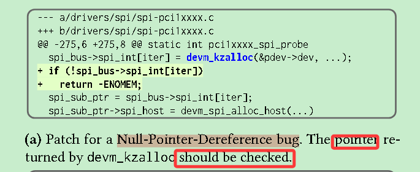

而 没有static analysis tool会检测这样的问题。 即使是专门检查kernel的Smatch，也因为缺乏领域知识（即devm_kzalloc）可能返回null，而无法检测出来。

这么一个简单问题，为啥static analyzer检测不出来？？？

inter-procedual analysis  做的不好？ 近似太多了？ 还是没有专门针对Null-Pointer-Dereference的？针对Null-Pointer-Dereference的 误报太多？

然后用如下方法， 在 历史patch中挖掘出checker，这些checker可能同样被忽略。

由此补充了静态分析的不足之处。

# code insight

 llm as analyzer

0. docker构建🤮， pdb debug其实也勉强够用🤔， qwen-7b压根生成不了validate checker，更别提plausible checker了。。😓
1. 用 import git库， 根据commit_id获取对应 patch，然后封装
2. 方法真就如下图

将**补丁提交**作为输入并输出相应的 **CSA 检查器**。

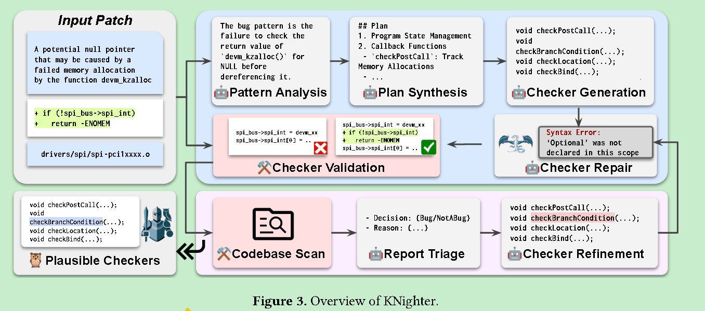

​	提取pattern

​	指定plan

​	但是就只是plan prompt进去llm， 就输出checker

​	然后编译失败，就接着repair

​	最后再validate checker， 通过 commit 前后的能否查出该bug数据

​	最后的最后 扫描整个仓库，优化report，agent自我判定分拣，报告少且FP较低 到一定阈值。迭代停止。

> 方法其实不难，难的是对整个系统的认识，prompt细节，辅助函数等

> git居然还有对应python库。。。

