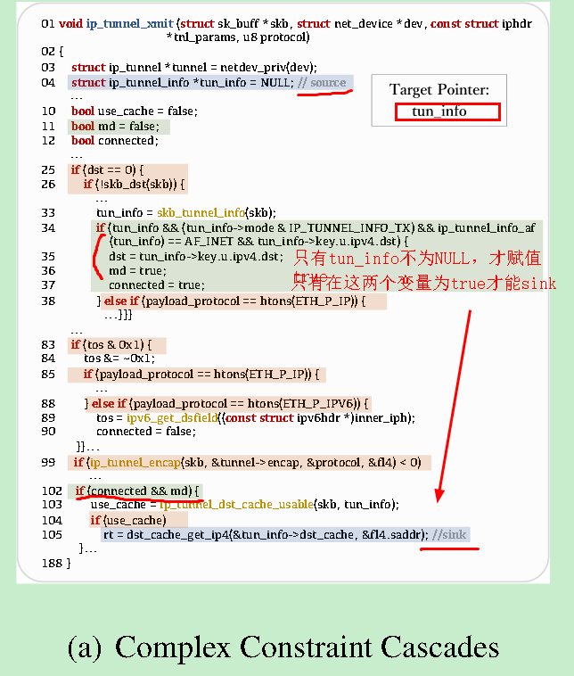
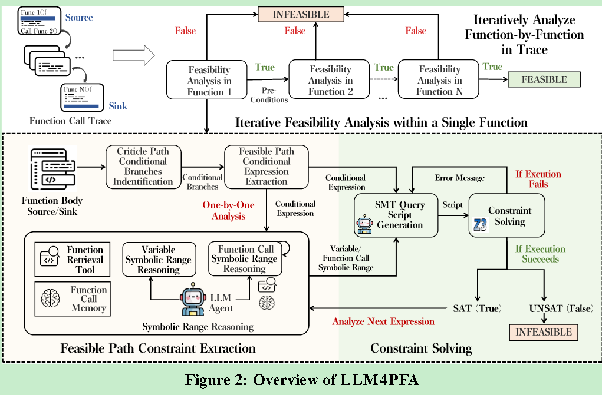

# Minimizing False Positives in Static Bug Detection via LLM-Enhanced Path Feasibility Analysis


> ## 论文要解决什么问题？
>
> 想象你有一个自动检查代码错误的工具（比如CodeQL、Infer），它会报告说"这里可能有bug"。但问题是，这些工具经常"狼来了"——报告的问题中有90%以上其实都不是真正的bug（误报），这让程序员需要花大量时间去人工检查。
>
> ## 为什么会有这么多误报？
>
> 静态分析工具的工作原理是：找到"危险源头"（source）和"危险使用点"（sink），然后检查是否存在从源头到使用点的路径。但它们往往无法准确判断这条路径在真实执行时是否真的可能发生。
>
> 举个例子（论文图1a）：
>
> ```c
> if (条件A成立) {
>     指针 = NULL;  // 源头
>     flag1 = true;
> }
> if (条件B成立) {
>     flag2 = true;
> }
> if (flag1 && flag2) {  // 只有两个flag都是true才会执行
>     使用指针;  // 使用点
> }
> ```
>
> 
>
> 传统工具可能会报警说"指针可能是NULL"，但如果你仔细分析会发现：只有当条件A和条件B**同时**成立时，才会既把指针设为NULL，又去使用它。如果这两个条件互斥（不可能同时成立），就不存在真正的bug。
>
> ## LLM4PFA 如何解决这个问题？
>
> 这个框架的核心思想是**把复杂的路径分析任务拆解成小步骤，让LLM逐步推理**：
>
> ### 1. **提取关键条件**
>
> 不是分析所有代码，而是只关注那些真正影响"能否到达使用点"的条件判断。
>
> ### 2. **符号范围推理**（核心创新）
>
> 对每个关键条件，让LLM推理：
>
> - 变量的可能取值范围是什么？
> - 函数调用可能返回什么值？
>
> 比如：
>
> ```c
> if (指针 != NULL && 计数器 > 0) {
>     // LLM推理：这里指针的范围是"非NULL"，计数器的范围是">0"
> }
> ```
>
> 
>
> ### 3. **上下文分析**（利用LLM代理）
>
> 如果某个条件涉及函数调用，LLM代理会：
>
> - 检索那个函数的代码
> - 分析函数的返回值
> - 如果需要，继续深入分析更深层的函数调用
>
> 这就像一个侦探，遇到线索就顺着追踪下去。
>
> ### 4. **约束求解**
>
> 把所有推理出的条件转换成数学约束，用Z3求解器判断："这些条件能否**同时**满足？"
>
> - 如果不能同时满足 → 路径不可行 → 是误报
> - 如果能同时满足 → 路径可行 → 可能是真bug
>
> ## 为什么有效？
>
> 传统方法的问题：
>
> - **LLM4SA**：一次性把整个调用链丢给LLM，太复杂了
> - **LLMDFA**：分析所有可能路径，计算量太大
> - **符号执行**：路径爆炸问题，大型项目跑不动
>
> LLM4PFA的优势：
>
> - ✅ **精确**：逐步推理，不会被复杂代码淹没
> - ✅ **高效**：只分析关键路径，用代理智能决定何时深入
> - ✅ **可扩展**：能处理大型项目（如Linux内核1800万行代码）
>
> ## 效果如何？
>
> 实验结果显示，LLM4PFA能：
>
> - 过滤掉72%-96%的误报
> - 仍然保持93%的真bug检出率（45个真bug中只漏了3个）
> - 比现有方法提升41%-105%


## insight

目前 验证path feasibility 存在很大挑战。

一是如下图：存在复杂 约束传播



二是多重函数调用 导致的 复杂上下文分析。

因此提出来

1.首先根据source、sink简化cfg

2.提取路径上的constraint，主要是条件表达式

3.对变量和函数返回值 进行符号范围推理

4.逐个让llm 自己用smt求解

注意是逐个迭代的进行上述操作




