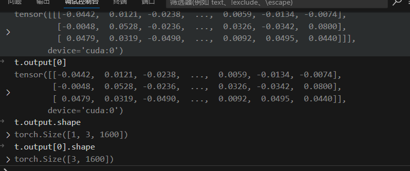
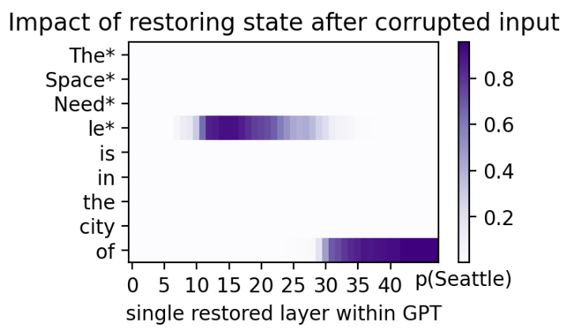
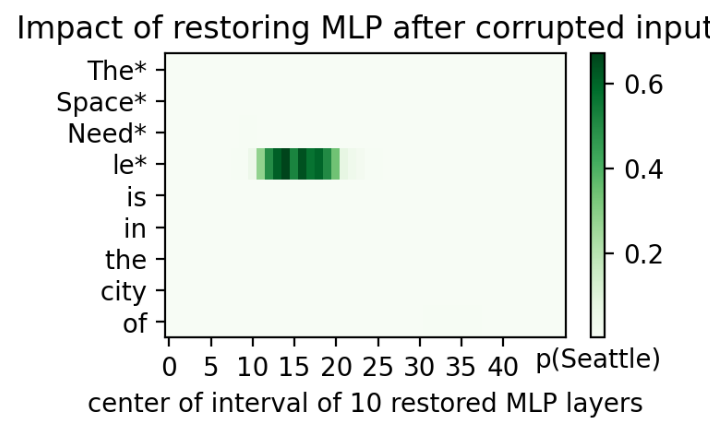
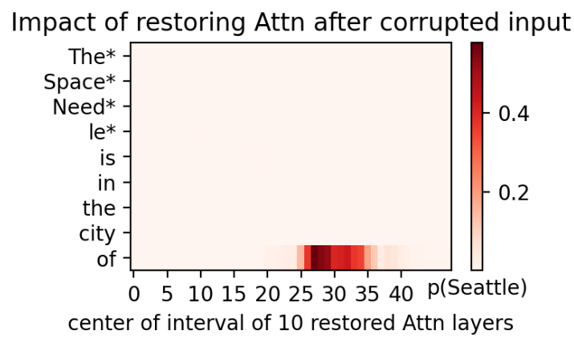

# ROME
## 数据

known_1000.json数据集

总共包括1209条数据，每条数据的格式如下

```json
  {
    "known_id": 0,
    "subject": "Vinson Massif",
    "attribute": "Antarctica",

    "template": "{} is located in the continent",
    "prediction": " of Antarctica. It is the largest of the three",
    "prompt": "Vinson Massif is located in the continent of",
    "relation_id": "P30"
  },
```


known_id作为 唯一id标识

subject 是主题

attribute 是对应属性，

template 描述了subject和attribute的关系，

​	比如这里 南极洲最高的山峰Vinson Massif 位于南极洲（Antarctica）

prompt 就提示词，然后prediction是正确答案。


封装了一个Dataset类用来加载该数据集

```python
REMOTE_URL = f"{REMOTE_ROOT_URL}/data/dset"


class KnownsDataset(Dataset):
    def __init__(self, data_dir: str, *args, **kwargs):
        data_dir = Path(data_dir)
        known_loc = data_dir / "known_1000.json"
        if not known_loc.exists():
            print(f"{known_loc} does not exist. Downloading from {REMOTE_URL}")
            data_dir.mkdir(exist_ok=True, parents=True)
            torch.hub.download_url_to_file(REMOTE_URL, known_loc)

        with open(known_loc, "r") as f:
            self.data = json.load(f)

        print(f"Loaded dataset with {len(self)} elements")

    def __len__(self):
        return len(self.data)

    def __getitem__(self, item):
        return self.data[item]
```


## 模型

首先是封装了一个ModelAndTokenizer类，用于加载模型和分词器

```python
class ModelAndTokenizer:
    """
    An object to hold on to (or automatically download and hold)
    a GPT-style language model and tokenizer.  Counts the number
    of layers.
    """

    def __init__(
        self,
        model_name=None,
        model=None,
        tokenizer=None,
        low_cpu_mem_usage=False,
        torch_dtype=None,
    ):
        if tokenizer is None:
            assert model_name is not None
            tokenizer = AutoTokenizer.from_pretrained(model_name)
        if model is None:
            assert model_name is not None
            model = AutoModelForCausalLM.from_pretrained(
                model_name, low_cpu_mem_usage=low_cpu_mem_usage, torch_dtype=torch_dtype
            )
            nethook.set_requires_grad(False, model)
            model.eval().cuda()
        self.tokenizer = tokenizer
        self.model = model
        self.layer_names = [
            n
            for n, m in model.named_modules()
            if (re.match(r"^(transformer|gpt_neox)\.(h|layers)\.\d+$", n))
        ]
        self.num_layers = len(self.layer_names)

    def __repr__(self):
        return (
            f"ModelAndTokenizer(model: {type(self.model).__name__} "
            f"[{self.num_layers} layers], "
            f"tokenizer: {type(self.tokenizer).__name__})"
        )

```


好的，那让我们来加载模型

```python
model_name = "/home/shichaoxue/models/gpt2-xl"  # or "EleutherAI/gpt-j-6B" or "EleutherAI/gpt-neox-20b"
mt = ModelAndTokenizer(
    model_name,
    low_cpu_mem_usage=False,
    torch_dtype=(torch.float16 if "20b" in model_name else None),
)
```


## 定位的流程

我们从
提示："The Space Needle is in the city of" 

答案："Seattle" 开始

```python
plot_all_flow(mt, "The Space Needle is in the city of", noise=noise_level)
```


> noise_level的来源：
>
> ```python
> knowns = KnownsDataset(DATA_DIR)  # Dataset of known facts
> noise_level = 3 * collect_embedding_std(mt, [k["subject"] for k in knowns])
> ```
>
> 收集了所有数据集的 subject，然后统计这些subject经过 embedding之后的标准差 再乘以3，就是noise_level
>
> 这里涉及1）make_inputs函数 和 2）nethook.Trace(mt.model, layername(mt.model, 0, "embed"))类
>
>
> ```python
> def collect_embedding_std(mt, subjects):
>      alldata = []
>      for s in subjects:
>        inp = make_inputs(mt.tokenizer, [s])
>        with nethook.Trace(mt.model, layername(mt.model, 0, "embed")) as t:
>            mt.model(**inp)
>            alldata.append(t.output[0])
>      alldata = torch.cat(alldata)
>      noise_level = alldata.std().item() #计算整个维度的标准差
>      return noise_level
> ```
>
> 首先看下1）make_inputs函数，如下该函数主要就对prompt进行tokenize,
> 这里就是输入一个 [The Space Needle], 然后经过分词，变成[对应的数字1、数字2、数字3、...]
> 请注意这里是左填充，然后目前情况下无需用到
>
> ```python
> # Utilities for dealing with tokens
> def make_inputs(tokenizer, prompts, device="cuda"):
>      token_lists = [tokenizer.encode(p) for p in prompts]
>      maxlen = max(len(t) for t in token_lists)
>      if "[PAD]" in tokenizer.all_special_tokens:
>        pad_id = tokenizer.all_special_ids[tokenizer.all_special_tokens.index("[PAD]")]
>      else:
>        pad_id = 0
>      # 这里是 左填充 !!!
>      input_ids = [[pad_id] * (maxlen - len(t)) + t for t in token_lists]
>      # position_ids = [[0] * (maxlen - len(t)) + list(range(len(t))) for t in token_lists]
>      attention_mask = [[0] * (maxlen - len(t)) + [1] * len(t) for t in token_lists]
>      return dict(
>        input_ids=torch.tensor(input_ids).to(device),
>        #    position_ids=torch.tensor(position_ids).to(device),
>        attention_mask=torch.tensor(attention_mask).to(device),
>      )
> ```
>
> 接着是2）with nethook.Trace(mt.model, layername(mt.model, 0, "embed")) as t:
>
> 这个layername(mt.model, 0, "embed")获取模型 embedding层的名字，为"transformer.wte"
>
>
> ```python
> def layername(model, num, kind=None):
>  if hasattr(model, "transformer"):
>       if kind == "embed":
>           return "transformer.wte"
>       return f'transformer.h.{num}{"" if kind is None else "." + kind}'
>   if hasattr(model, "gpt_neox"):
>       if kind == "embed":
>           return "gpt_neox.embed_in"
>       if kind == "attn":
>           kind = "attention"
>       return f'gpt_neox.layers.{num}{"" if kind is None else "." + kind}'
>   assert False, "unknown transformer structure"
> 
> ```
>
> 然后，关于Trace这个类，首先了解一下  with xxx as t:这个语法
>
> > 对于一些我们自己实现的类方法，也想通过with语句实现该怎么做呢？这里就涉及到了上下文管理器。
> >
> > 上下文管理器对象存在的目的是管理 with 语句，上下文管理器协议包含 enter 和 exit 两个方法。
> >
> > with 语句开始运行时，会在上下文管理器对象上调用 enter 方法。with语句运行结束后，会在上下文管理器对象上调用 exit 方法，以此扮演 finally 子句的角色。
> >
> > 因此，<font color='red'>只要在我们的类中自定义实现__enter__方法和__exit__两个方法，就能实现with语句</font>
> > https://blog.csdn.net/Audreybiubiu/article/details/123565485
>
>
> ```python
> 
> def get_module(model, name):
>     """
>     Finds the named module within the given model.
>     """
>     for n, m in model.named_modules():
>         if n == name:
>             return m
>     raise LookupError(name)
>     
> class Trace(contextlib.AbstractContextManager):
>     """
> 	Trace 类是一个上下文管理器（context manager），
> 	用于拦截和记录神经网络模块（如 PyTorch 中的层）的前向传播过程中的输入和输出。
> 	这个类继承自 contextlib.AbstractContextManager，因此可以使用 with 语句来管理和清理资源。
>     """
> 
>     def __init__(
>     self,
>       module,
>       layer=None,
>       retain_output=True,
>       retain_input=False,
>       clone=False,
>       detach=False,
>       retain_grad=False,
>       edit_output=None,
>       stop=False,
>     ):
>         """
>           Method to replace a forward method with a closure that
>           intercepts the call, and tracks the hook so that it can be reverted.
>           """
>           retainer = self
>           self.layer = layer
>           if layer is not None:
>               module = get_module(module, layer)
> 
>           def retain_hook(m, inputs, output):
>             	"""
>             	保留输入：
>             		如果 retain_input 为 True，则使用 recursive_copy 函数复制输入数据，并将其存储在 retainer.input 中。
>             	修改输出：
> 					如果提供了 edit_output 回调函数，则调用该函数并传入当前输出和层名，以修改输出。
> 				保留输出：
>                     如果 retain_output 为 True，则使用 recursive_copy 函数复制输出数据，并将其存储在 retainer.output 中。
>                     如果 retain_grad 为 True，则再次复制输出以确保可以进行就地操作而不会引发错误。
>             	"""
>               if retain_input:
>                   retainer.input = recursive_copy(
>                       inputs[0] if len(inputs) == 1 else inputs,
>                       clone=clone,
>                       detach=detach,
>                       retain_grad=False,
>                   )  # retain_grad applies to output only.
> 
>               if edit_output:
>                   output = invoke_with_optional_args(
>                       edit_output, output=output, layer=self.layer
>                   )
>               if retain_output:
>                   retainer.output = recursive_copy(
>                       output, clone=clone, detach=detach, retain_grad=retain_grad
>                   )
>                   # When retain_grad is set, also insert a trivial
>                   # copy operation.  That allows in-place operations
>                   # to follow without error.
>                   if retain_grad:
>                       output = recursive_copy(retainer.output, clone=True, detach=False)
>               if stop:
>                   raise StopForward()
>               return output
> 
>         self.registered_hook = module.register_forward_hook(retain_hook)
>           self.stop = stop
> 
>     def __enter__(self):
>         return self
> 
>     def __exit__(self, type, value, traceback):
>         self.close()
>           if self.stop and issubclass(type, StopForward):
>               return True
> 
>     def close(self):
>         self.registered_hook.remove()
> ```
>
> 接下来重新回到 with nethook.Trace(mt.model, layername(mt.model, 0, "embed")) as t:
>
> ​     			 mt.model(**inp)
>
> ​     			 alldata.append(t.output[0])
>
> 
>
> 可见，这里只是把模型embedding之后的数据，都收集到了alldata,
> 然后 alldata = torch.cat(alldata)
>      noise_level = alldata.std().item() #计算整个维度的标准差
>      return noise_level
> 直接拼接起来，并计算所有数字的标准差作为噪声。


进入函数plot_all_flow

```python
def plot_all_flow(mt, prompt, subject=None, noise=0.1, modelname=None):
    for kind in [None, "mlp", "attn"]:
        plot_hidden_flow(
            mt, prompt, subject, modelname=modelname, noise=noise,
            kind=kind, savepdf="notebooks/picture/"
        )
```


接着以kind = None、mlp、attn分别为参数，进入plot_hidden_flow函数

```python
def plot_hidden_flow(
    mt,
    prompt,
    subject=None,
    samples=10,
    noise=0.1,
    window=10,
    kind=None,
    modelname=None,
    savepdf=None,
):
    if subject is None:
        subject = guess_subject(prompt)
    result = calculate_hidden_flow(
        mt, prompt, subject, samples=samples, noise=noise, window=window, kind=kind
    )
    plot_trace_heatmap(result, savepdf, modelname=modelname)

```


> 小插曲guess_subject函数，
>
> ```python
> def guess_subject(prompt):
>     return re.search(r"(?!Wh(o|at|ere|en|ich|y) )([A-Z]\S*)(\s[A-Z][a-z']*)*", prompt)[
>         0
>     ].strip()
> ```
>
> 通过正则匹配的形式，提取出prompt中的subject
>
> 比如说该提示 "The Space Needle is in the city of" 
> 将提取出主题subject 为 "The Space Needle"


接下来还是以kind=None、mlp、attn分别为参数，进入calculate_hidden_flow函数获取结果后，用plot_trace_heatmap函数绘制热力图。

我们首先仔细查看calculate_hidden_flow函数。

```python
def predict_from_input(model, inp):
    """
    preds即下一个 token的id，  p是对应的概率
    值得注意的是, inp['input_ids']的shape为 (batchsize, sequence_length)
    最后preds为 (bacthsize,1)  p同样也是(bacthsize,1)
    """
    out = model(**inp)["logits"]
    probs = torch.softmax(out[:, -1], dim=1)
    p, preds = torch.max(probs, dim=1)
    return preds, p # preds即下一个 token的id，  p是对应的概率

def calculate_hidden_flow(
    mt, prompt, subject, samples=10, noise=0.1, window=10, kind=None
):
    """
    Runs causal tracing over every token/layer combination in the network
    and returns a dictionary numerically summarizing the results.
    """
    inp = make_inputs(mt.tokenizer, [prompt] * (samples + 1))
    with torch.no_grad():
        answer_t, base_score = [d[0] for d in predict_from_input(mt.model, inp)]
        [answer] = decode_tokens(mt.tokenizer, [answer_t])
        e_range = find_token_range(mt.tokenizer, inp["input_ids"][0], subject)
        low_score = trace_with_patch(
            mt.model, inp, [], answer_t, e_range, noise=noise
        ).item()
    if not kind:
        differences = trace_important_states(
            mt.model, mt.num_layers, inp, e_range, answer_t, noise=noise
        )
    else:
        differences = trace_important_window(
            mt.model,
            mt.num_layers,
            inp,
            e_range,
            answer_t,
            noise=noise,
            window=window,
            kind=kind,
        )
    differences = differences.detach().cpu()
    return dict(
        scores=differences,
        low_score=low_score,
        high_score=base_score,
        input_ids=inp["input_ids"][0],
        input_tokens=decode_tokens(mt.tokenizer, inp["input_ids"][0]),
        subject_range=e_range,
        answer=answer,
        window=window,
        kind=kind or "",
    )
```

首先，prompt 变成 一个batch为samples+1 的，

经过make_inputs函数做 tokenizer后，

遇到了predict_from_input经过模型预测得到下一个token_id，这里是成batch得到的，然后获得解码的答案（即"Seattle"）

`find_token_range` 函数的作用是在给定的 token ID 序列中找到某个主题（`subject`）的起始和结束位置。

这里找到subject（即"The Space Needle"）再input_ids中的起始位置为(0,4)


然后接下来进入  <font color='red'>trace_with_patch</font>这个重要函数中，

```python

def trace_with_patch(
    model,  # The model
    inp,  # A set of inputs
    states_to_patch,  # A list of (token index, layername) triples to restore
    answers_t,  # Answer probabilities to collect
    tokens_to_mix,  # Range of tokens to corrupt (begin, end)
    noise=0.1,  # Level of noise to add
    trace_layers=None,  # List of traced outputs to return
):
    # 初始化伪随机数生成器
    prng = numpy.random.RandomState(1)  # For reproducibility, use pseudorandom noise
    patch_spec = defaultdict(list)
    for t, l in states_to_patch:
        patch_spec[l].append(t)
    embed_layername = layername(model, 0, "embed")

    def untuple(x):
        return x[0] if isinstance(x, tuple) else x

    # Define the model-patching rule.
    def patch_rep(x, layer):
        if layer == embed_layername:
            # If requested, we corrupt a range of token embeddings on batch items x[1:]
            if tokens_to_mix is not None:
                b, e = tokens_to_mix
                # (samples+1,sequence_length,features)
                x[1:, b:e] += noise * torch.from_numpy(
                    prng.randn(x.shape[0] - 1, e - b, x.shape[2])
                ).to(x.device) # 这里留着第一个batch，用于后面的状态修复
                # 给embed输出添加了噪声
            return x
        if layer not in patch_spec:
            return x
        # If this layer is in the patch_spec, restore the uncorrupted hidden state
        # for selected tokens.
        h = untuple(x)
        for t in patch_spec[layer]:
            h[1:, t] = h[0, t]
            # 在这里如果该层属于需要更换状态的，直接拿完好的状态来填充
        return x

    # With the patching rules defined, run the patched model in inference.
    additional_layers = [] if trace_layers is None else trace_layers
    with torch.no_grad(), nethook.TraceDict(
        model,
        [embed_layername] + list(patch_spec.keys()) + additional_layers,
        edit_output=patch_rep,
    ) as td:
        outputs_exp = model(**inp)

    # We report softmax probabilities for the answers_t token predictions of interest.
    probs = torch.softmax(outputs_exp.logits[1:, -1, :], dim=1).mean(dim=0)[answers_t]
    # 返回修补后的[1:samples+1]这些经过模型的输出后，对于目标答案的概率值，然后取平均

    # If tracing all layers, collect all activations together to return.
    if trace_layers is not None:
        all_traced = torch.stack(
            [untuple(td[layer].output).detach().cpu() for layer in trace_layers], dim=2
        )
        return probs, all_traced

    return probs

```

该函数拿了 samples+1个batch，

<font color='red'>将samples个batch经过embedding后的主题词添加噪声，</font>

<font color='red'>然后留着第一个batch，用于对后面[1:samples+1]这smaples个batch修补状态！！</font>


重新回到calculate_hidden_flow函数，在kind为None的情况下，现在我们得到了low_score，即纯粹对embedding后主题词加噪声，

然后目标答案收到的影响导致的最差概率。

再接下来，在kind为none的判断下进入trace_important_states函数，

```python
def trace_important_states(model, num_layers, inp, e_range, answer_t, noise=0.1):
    ntoks = inp["input_ids"].shape[1] # sequence_length
    table = []
    for tnum in range(ntoks):
        row = []
        for layer in range(0, num_layers):
            r = trace_with_patch(
                model,
                inp,
                [(tnum, layername(model, layer))],
                answer_t,
                tokens_to_mix=e_range,
                noise=noise,
            )
            row.append(r)
        table.append(torch.stack(row))
    return torch.stack(table)
```

接下来，可见该函数是  对一个sequnce_length的每一个token，然后每一层layer做了修补，最终返回修补后预测正确答案的概率的图像数据，

经过绘制函数plot_trace_heatmap绘制后如下：



```python

def plot_trace_heatmap(result, savepdf=None, title=None, xlabel=None, modelname=None):
    differences = result["scores"]
    low_score = result["low_score"]
    answer = result["answer"]
    kind = (
        None
        if (not result["kind"] or result["kind"] == "None")
        else str(result["kind"])
    )
    window = result.get("window", 10)
    labels = list(result["input_tokens"])
    for i in range(*result["subject_range"]):
        labels[i] = labels[i] + "*"

    with plt.rc_context(rc={"font.family": "Times New Roman"}):
        fig, ax = plt.subplots(figsize=(3.5, 2), dpi=200)
        h = ax.pcolor(
            differences,
            cmap={None: "Purples", "None": "Purples", "mlp": "Greens", "attn": "Reds"}[
                kind
            ],
            vmin=low_score,
        )
        ax.invert_yaxis()
        ax.set_yticks([0.5 + i for i in range(len(differences))])
        ax.set_xticks([0.5 + i for i in range(0, differences.shape[1] - 6, 5)])
        ax.set_xticklabels(list(range(0, differences.shape[1] - 6, 5)))
        ax.set_yticklabels(labels)
        if not modelname:
            modelname = "GPT"
        if not kind:
            ax.set_title("Impact of restoring state after corrupted input")
            ax.set_xlabel(f"single restored layer within {modelname}")
        else:
            kindname = "MLP" if kind == "mlp" else "Attn"
            ax.set_title(f"Impact of restoring {kindname} after corrupted input")
            ax.set_xlabel(f"center of interval of {window} restored {kindname} layers")
        cb = plt.colorbar(h)
        if title is not None:
            ax.set_title(title)
        if xlabel is not None:
            ax.set_xlabel(xlabel)
        elif answer is not None:
            # The following should be cb.ax.set_xlabel, but this is broken in matplotlib 3.5.1.
            cb.ax.set_title(f"p({str(answer).strip()})", y=-0.16, fontsize=10)
        if savepdf:
            os.makedirs(os.path.dirname(savepdf), exist_ok=True)
            plt.savefig(f"{savepdf}{kind}", bbox_inches="tight")
            plt.close()
        else:
            plt.show()
```


接下来对mlp和attn再单独做修补工作，即kind为mlp，和kind为attn。同理可得：






## 测试一个红苹果


用rome定位 'The color of apple'这个subject在gpt2-xl的层的位置，

```python


model_name = "/home/shichaoxue/models/gpt2-xl"  # or "EleutherAI/gpt-j-6B" or "EleutherAI/gpt-neox-20b"
mt = ModelAndTokenizer(
    model_name,
    low_cpu_mem_usage=False,
    torch_dtype=(torch.float16 if "20b" in model_name else None),
)

knowns=[]
knowns.append(dict(
    subject='The color of apple',
    prompt='The color of apple is '
))


noise_level = 3 * collect_embedding_std(mt, [k["subject"] for k in knowns])
print(f"Using noise level {noise_level}")

for k in knowns:
    prompt = k['prompt']
    subject = k['subject']
    samples = 10
    kind = 'mlp'
    window = 10
    result = calculate_hidden_flow(
        mt, prompt, subject, samples=samples, noise=noise_level, window=window, kind=kind
    )
    subject_range = result['subject_range']
    scores = result['scores']
    low_score = result['low_score']
    high_score = result['high_score']
    window = result['window']
    # print(scores)
    # print(subject_range)
    # print(low_score)
    # print(high_score)
    # print(window)
    # print(result)
    sub_scores = scores[subject_range[1]]
    diff_count = sub_scores-low_score
    target_layer = torch.argmax(diff_count).item()
    print(target_layer)
    k['layers'] = [target_layer]

# json_datas = [k for k in knowns]
# # 将列表保存为 JSON 文件
# with open(datas["ZsRE"][:-5]+"_locatelayers.json", 'w') as f:
#     json.dump(json_datas, f, indent=4)


```

输出为6


然后用EasyEditor来编辑

```python
from easyeditor_local import ROMEHyperParams,BaseEditor
from transformers import AutoTokenizer, AutoModelForCausalLM, GenerationConfig

config_path = "/home/shichaoxue/EasyEdit/using/gpt2-xl.yaml"
# model_path = "/home/shichaoxue/models/Qwen2.5-Coder-7B-Instruct"
model_path = "/home/shichaoxue/models/gpt2-xl"
hparams = ROMEHyperParams.from_hparams(config_path)

## edit descriptor: prompt that you want to edit
prompts = [
    # 'What university did Watts Humphrey attend?',
    # 'Which family does Ramalinaceae belong to',
    # 'What role does Denny Herzig play in football?'
    'The color of apple is ',
    'The color of apple is ',
    'The color of apple is '
]
## You can set `ground_truth` to None !!!(or set to original output)
# ground_truth = [
#     'Illinois Institute of Technology', 'Lecanorales', 'defender'
#     ]
ground_truth=[
    'red',
    'red',
    'red',
]
## edit target: expected output
target_new = [
    # 'University of Michigan', 'Lamiinae', 'winger'
    'blue',
    'blue',
    'blue'
    ]
subject = [
    # 'Lahti Town Hall', 'Denny Herzig', 'Marl Young'
    'The color of apple',
    'The color of apple',
    'The color of apple'
           ]


# locality_inputs = {
#     'neighborhood':{
#         'prompt': ['Joseph Fischhof, the', 'Larry Bird is a professional', 'In Forssa, they understand'],
#         'ground_truth': ['piano', 'basketball', 'Finnish']
#     },
#     'distracting': {
#         'prompt': ['Ray Charles, the violin Hauschka plays the instrument', 'Grant Hill is a professional soccer Magic Johnson is a professional', 'The law in Ikaalinen declares the language Swedish In Loviisa, the language spoken is'],
#         'ground_truth': ['piano', 'basketball', 'Finnish']
#     }
# }
locality_inputs = None
editor = BaseEditor.from_hparams(hparams)
metrics, edited_model, _ = editor.edit(
    prompts=prompts,
    ground_truth=ground_truth,
    target_new=target_new,
    subject=subject
)


tokenizer = AutoTokenizer.from_pretrained(model_path)
tokenizer.pad_token_id = tokenizer.eos_token_id
batch = tokenizer(prompts, return_tensors='pt', padding=True)

post_edit_outputs = edited_model.generate(
    input_ids=batch['input_ids'].to('cuda'),
    attention_mask=batch['attention_mask'].to('cuda'),
    max_new_tokens=30,
)


model = AutoModelForCausalLM.from_pretrained(model_path).to('cuda')

pre_edit_outputs = model.generate(
    input_ids=batch['input_ids'].to('cuda'),
    attention_mask=batch['attention_mask'].to('cuda'),
    max_new_tokens=30,
)


print('Pre-Edit Outputs: ', [tokenizer.decode(x) for x in pre_edit_outputs.detach().cpu().numpy().tolist()])
print('Post-Edit Outputs: ', [tokenizer.decode(x) for x in post_edit_outputs.detach().cpu().numpy().tolist()])

```


中途出现一个小bug，tokenizer中报错merge.txt未找到，发现模型中没有，

猜测是transformers版本不同导致的问题，在huggingface上单独下载一个merge.txt后，运行成功


又遇到了一个问题，由于gpt2-xl不是instruct模型，所以竟然无法回答我这个prompt，苹果的颜色是。。。。。。


最终遗憾失败。。。

