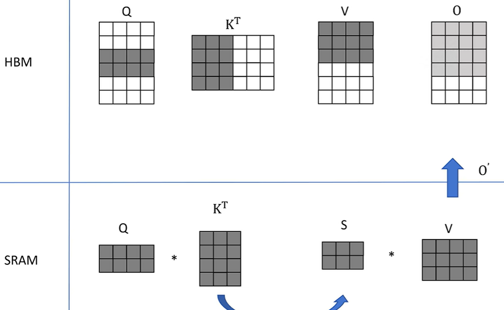
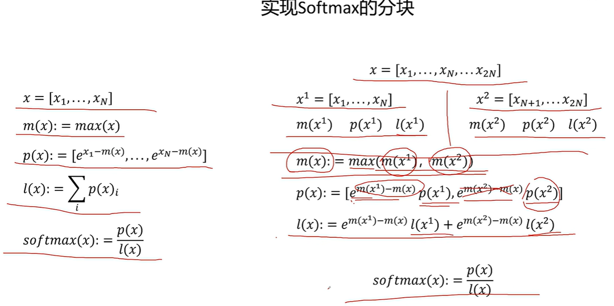

[CSDN Transformer从菜鸟到新手](https://blog.csdn.net/yjw123456/article/details/135344697)

[Datawhale tinyTransformer](https://github.com/datawhalechina/tiny-universe/tree/main/content/TinyTransformer)

https://www.zhihu.com/question/471328838/answer/51545078376?utm_campaign=shareopn&utm_medium=social&utm_psn=1853147405106688000&utm_source=wechat_session


# Transformer升级


## Tokenizer

对于输入文本序列，首先要进行分词，而Transformer所采用的分词算法为子词分词算法——BPE(Byte Pair Encoding)。

> 历史 jieba分词

### BPE分词算法

BPE分词算法由以下步骤组成：

1. 初始化语料库
2. 将语料库中每个单词拆分成字符作为子词，并在单词结尾增加一个`</w>`字符
3. 将拆分后的子词构成初始子词词表
4. 在语料库中统计单词内相邻子词对的频次
5. 合并频次最高的子词对，合并成新的子词，并将新的子词加入到子词词表
6. 重复步骤4和5直到进行了设定的合并次数或达到了设定的子词词表大小

假设有以下语料

```python
corpus = [
    "This is the Hugging Face Course.",
    "This chapter is about tokenization.",
    "This section shows several tokenizer algorithms.",
    "Hopefully, you will be able to understand how they are trained and generate tokens.",
]
```


1)首先执行标准化，对输入的单词进行一些预处理，一般包括大小写转换等。

2)然后预分词，使用jieba对其进行分词，把单词和标点符号拆开，但是它会把空格也拆分出来，我们直接过滤掉空格。

接着统计每个单词出现的频次

```python
word_freqs = defaultdict(int)

for sentence in corpus:
    # 标准化
    sentence = sentence.lower()
    # 预分词
    words = [w for w in jieba.cut(sentence) if w != " "]
    # 统计词频
    for word in words:
        word_freqs[word] += 1

print(word_freqs)
```

> defaultdict(<class 'int'>, {'this': 3, 'is': 2, 'the': 1, 'hugging': 1, 'face': 1, 'course': 1, '.': 4, 'chapter': 1, 'about': 1, 'tokenization': 1, 'section': 1, 'shows': 1, 'several': 1, 'tokenizer': 1, 'algorithms': 
> 1, 'hopefully': 1, ',': 1, 'you': 1, 'will': 1, 'be': 1, 'able': 1, 'to': 1, 'understand': 1, 'how': 1, 'they': 1, 'are': 1, 'trained': 1, 'and': 1, 'generate': 1, 'tokens': 1})

3)然后将语料库中每个单词拆分成字符，作为子词，构建初始子词词表：

```python
alphabet = []
for word in word_freqs.keys():
    for letter in word:
        if letter not in alphabet:
            alphabet.append(letter)

alphabet.sort()
print(alphabet)
```

> [',', '.', 'a', 'b', 'c', 'd', 'e', 'f', 'g', 'h', 'i', 'k', 'l', 'm', 'n', 'o', 'p', 'r', 's', 't', 'u', 'v', 'w', 'y', 'z']

词表中加入模型要使用的特殊标记，这里有`<PAD>`、`<BOS>`、`<EOS>`和`<UNK>`，分别表示填充、句子开头、句子结尾和未知词。

```python
vocab = ["<PAD>", "<UNK>", "<BOS>", "<EOS>"] + alphabet.copy()
```

4)统计语料库中 相邻子词对 出现的频次

```python
splits = {word: [c for c in word] for word in word_freqs.keys()}
pprint(splits)
```

```python
def compute_pair_freqs(splits):
    pari_freqs = defaultdict(int)
    for word, freq in word_freqs.items():
        # word拆分后的列表
        split = splits[word]
        # 至少要有2个字符才能合并
        if len(split) == 1:
            continue

        for i in range(len(split) - 1):
            # word中连续的字符
            pair = (split[i], split[i + 1])
            # 累加其频次
            pari_freqs[pair] += freq

    return pari_freqs

pair_freqs = compute_pair_freqs(splits)

for i, key in enumerate(pair_freqs.keys()):
    print(f"{key}: {pair_freqs[key]}")
    if i >= 10:
        break
```

> ('t', 'h'): 6
> ('h', 'i'): 3
> ('i', 's'): 5
> ('h', 'e'): 2
> ('h', 'u'): 1
> ('u', 'g'): 1
> ('g', 'g'): 1
> ('g', 'i'): 1
> ('i', 'n'): 2
> ('n', 'g'): 1
> ('f', 'a'): 1

5)取最高频次子词对，所以第一个合并的是`('t', 'h') -> 'th'`，然后将合并后的子词加入到子词词表，同时合并前的两个字符还在词表中，这样我们的词表扩展了一个标记：

```python
# 学习到的第一条合并规则
merges = {("t", "h"): "th"}
# 加入到词表中
vocab.append("th")
```


## Embeding

> 解决词的编码问题和同义关系问题

> 2013年Google开源了`word2vec`工具，它可以进行词向量训练，加载已有模型进行增量训练，求两个词向量相似度

> nn.Embedding() 是 PyTorch 深度学习框架中的一个类，用于创建词嵌入矩阵。它的输入是一个整数，代表词汇表中的单词索引，输出是与之对应的词向量。词嵌入矩阵可以是预训练的（如使用 Word2Vec 或 GloVe 生成的词向量），也可以是随机初始化的，让模型在训练过程中学习优化。
>


## Attention

https://github.com/datawhalechina/tiny-universe/tree/main/content/TinyTransformer

https://kexue.fm/archives/4765

https://kexue.fm/archives/7546

https://kexue.fm/archives/8934

### self-attention


### mask self attention


### MHA、MQA、GQA


### Linear attention


### Sparse Attention


### Flash Attention

https://www.bilibili.com/video/BV1UT421k7rA/?spm_id_from=333.337.search-card.all.click&vd_source=39767bfbc4ae772d0c2f8d8b32b54ce6

标准的attention计算如下图：


> NVIDIA GPU 中的内存(显存)按照它们物理上是在 GPU 芯片内部还是板卡 RAM 存储芯片上,决定了它们的速度、大小以及访问限制。
> 
>
> GPU 显存分为全局内存(Global memory)、本地内存  (Local memory)、共享内存(Shared memory,SRAM)、寄存器内存(Register memory)、常量内存  (Constant memory)、纹理内存(Texture memory)等六大类。
>
> 全局内存和本地内存使用的高带宽显存(High Bandwidth Memory,**<font color='red'>HBM</font>**)位于板卡 RAM 存储芯片上,该部分内存容量很大。
> 

在 GPU 中进行计算时,传统的方法还需要引入两个中间矩阵 S 和 P 并存储到全局内存中。
S = Q × K, P = Softmax(S), O = P × V
按照上述计算过程,需要首先从全局内存中读取矩阵 Q 和 K,并将计算好的矩阵 S 再写入全局内存,之后再从全局内存中获取矩阵 S,计算 Softmax 得到矩阵 P ,再写入全局内存,之后读取矩阵 P 和矩阵 V ,计算得到矩阵 O。

这样的过程会极大占用显存的带宽。在自注意力机制中,计算速度比内存速度快得多,因此计算效率越来越多地受到全局内存访问的瓶颈.


FlashAttention[61] 就是通过利用 GPU 硬件中的特殊设计,针对全局内存和共享存储的 I/O 速 度的不同,尽可能地***<font color='red'>避免 HBM 中读取或写入注意力矩阵</font>***。FlashAttention 目标是***<font color='red'>尽可能高效地使用 SRAM 来加快计算速度</font>***,避免从全局内存中读取和写入注意力矩阵。


首先忽略softmax操作，简单认为 $Q \times K^T$之后直接跟V乘，得到O，如下图


> 
>
> 
>
> 
>
> 所以目前最大的问题，在于添加了softmax操作后如何进行以上过程


 目前，训练都是混合精度FP16，由此引进 safe_max


> 实现softmax的分块！！！
>
> 


上面介绍的是flash attentin1

关于flash attention2，主要是工程上的优化


## Mlp


### SwishGlu


### MOE


