# VLLM

https://www.bilibili.com/video/BV1kx4y1x7bu/?spm_id_from=333.337.search-card.all.click&vd_source=39767bfbc4ae772d0c2f8d8b32b54ce6

## KV Cache

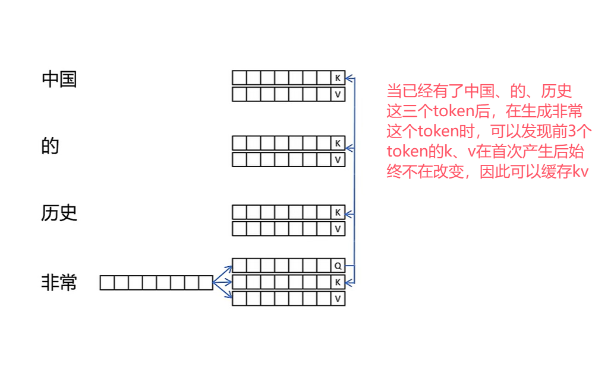

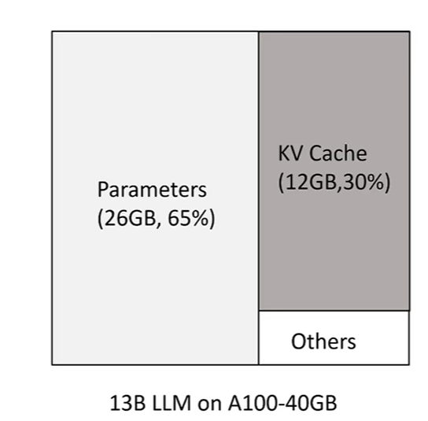

kv cache存在的问题

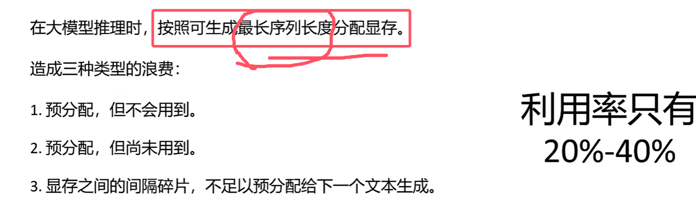

vllm对此做了优化：

优化效果如下图：

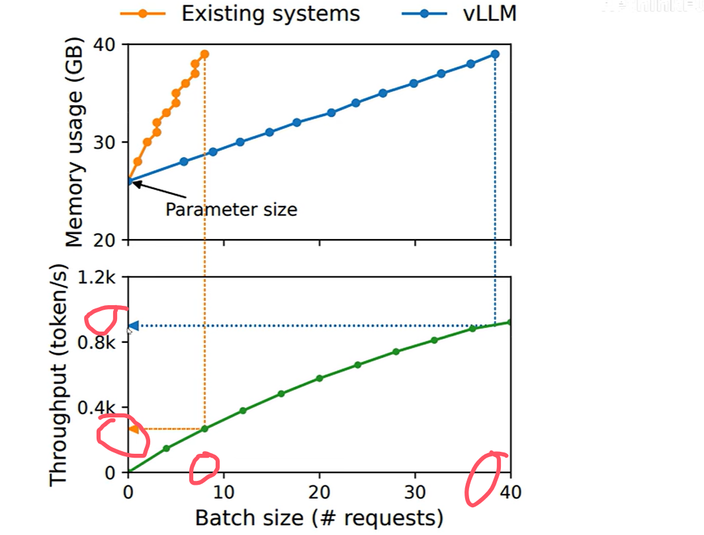

## 优化一： Page Attention

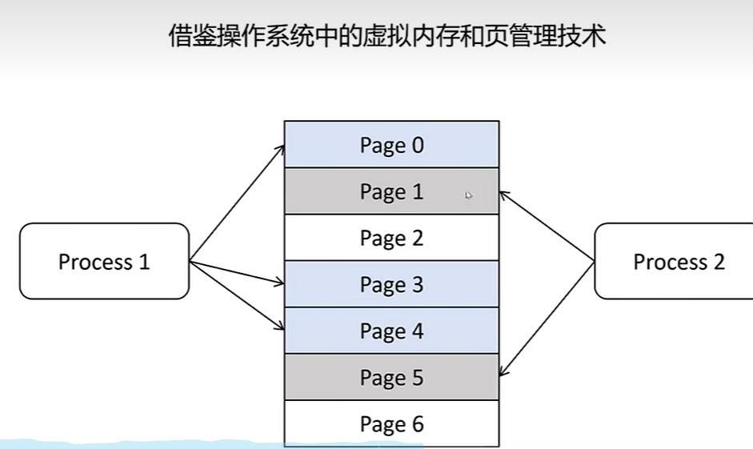

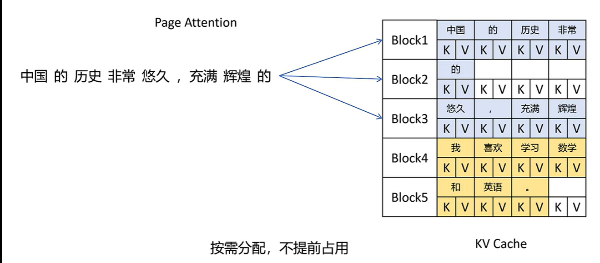

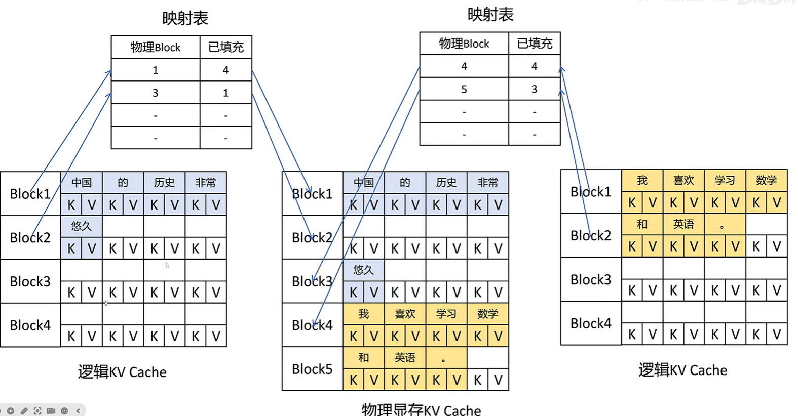

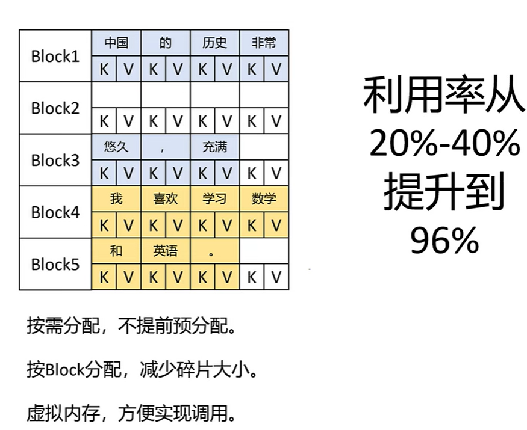

## 优化二：sharing KV Blocks

当需要模型对同一个prompt生成多个 response时，

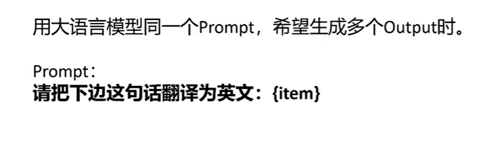

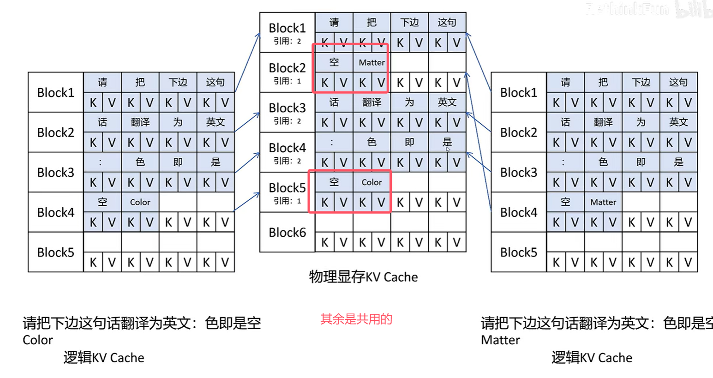

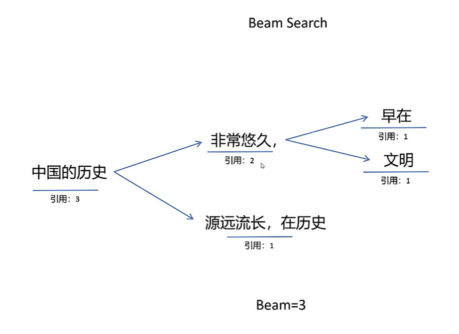

## 代码调用

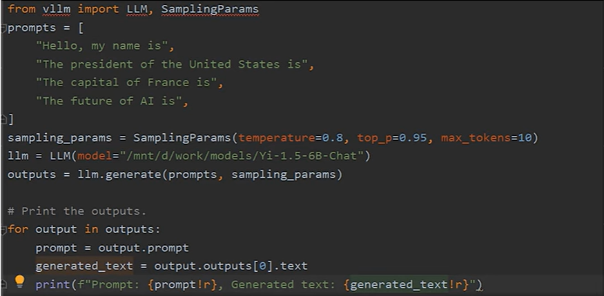

## 在vllm上自定义新模型

https://www.bilibili.com/video/BV1xbypYtEu2/?spm_id_from=333.337.search-card.all.click&vd_source=39767bfbc4ae772d0c2f8d8b32b54ce6