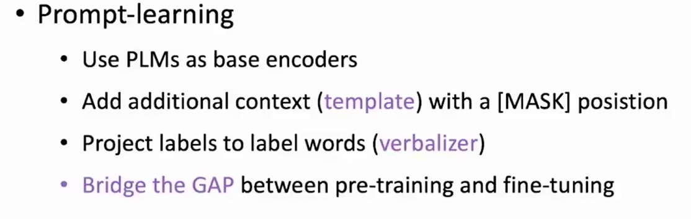
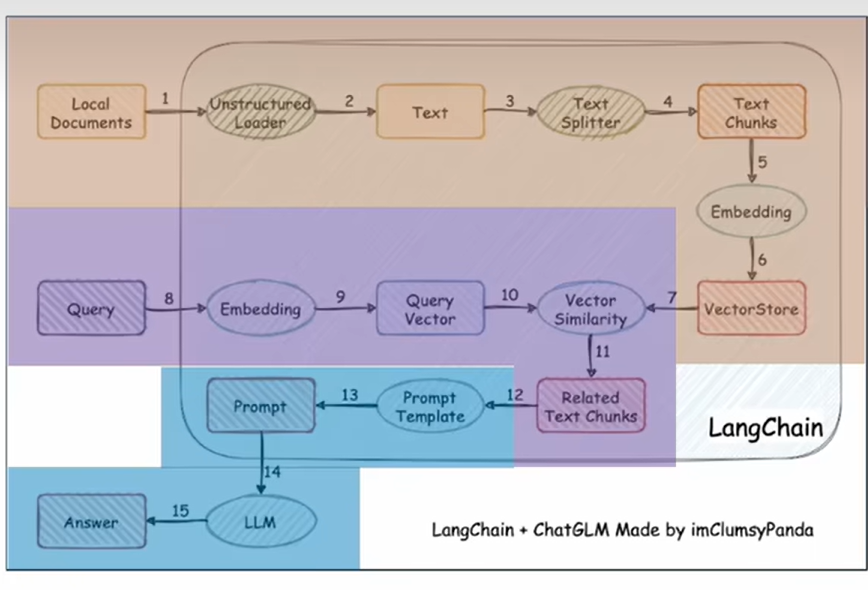

## prompt learning

构造prompt，增强模型 few-shot的能力

在pre-training和 fine-tunning间，似乎存在着gap，如下图所示，

然而，我们可以通过构造prompt模板，缩短这个gap，如下图

同时，在输出时也可以只采样指定的词汇。

下图为prompt-learning的基本范式：

> example:
> 

 ### PTM 选取

                                                               Auto-regressive这种模式 非常适合大语言模型

擅长生成任务

 

简单的分类任务或者理解任务，RoBERTa可能更合适一些

### template构造

人为构造，基于任务的特性

## Delta Tuning

高效微调

## RAG

