Summer 2025 


------------------

> 1. 劳逸结合，**有逸更要有劳**，有件正事是很幸福的事
>
> 2. **不要用盲目的努力 来 掩饰思维的懒惰**
>
> 3. 

## 2025.7.2 电话开始

1. 需要坚定一些
   1. 随着对事物的了解增多，可选择项也就更多，然后也就容易改弦易张，所以坚定也就是能够忍耐最初的选择，并持之以恒地做到一定程度，这个程度不好把握，但是就科研而言，该程度即发一篇论文
   2. 还有就是做决定要深思熟虑
2. 大方向 代码生成、漏洞检测，  小方向 agent


1. 知道要做什么，翻翻fse，issta，然后下周一确定一个方向。


--------------

## FSE 2025

 6.23-27  


大致如下方向：


Requirements Engineering and Design

**clone**

bug检测

自动驾驶

漏洞

msr? szz?

**测试生成、测试**

library and product line

Employability and Professional Competence

performance性能

logging 

**code search**

程序分析

fuzzing 模糊测试->种子选择、突变、测试并报告异常状况

**llm4se**

**se4llm**

**repairs**

mobile apps

**code generation**

architecture、services and cloud

**Code Review, Build, and Release**
Blockchain and Smart Contract 区块链和智能合约

ui test 

process

Empirical Studies 

compiler

**debugging**

**agent**

ai-IDE


初步挑选的想看的论文：


> **[Teamwork makes the dream work: LLMs-Based Agents for GitHub README.MD Summarization](https://conf.researchr.org/program/fse-2025/program-fse-2025/?date=Mon 23 Jun 2025%2BTue 24 Jun 2025%2BWed 25 Jun 2025%2BThu 26 Jun 2025%2BFri 27 Jun 2025#)**
>
> Metagente is a Multi-Agent framework based on a series of LLMs to self-optimize the system through evaluation, feedback, and cooperation among specialized agents.
>
> Metagente是一个基于一**系列LLM的多代理框架**，通过评估、反馈和专门代理之间的合作来自我优化系统。**for GitHub README.MD Summarization**
>
> 
>
> **[Natural Language Outlines for Code: Literate Programming in the LLM Era](https://conf.researchr.org/program/fse-2025/program-fse-2025/?date=Mon 23 Jun 2025%2BTue 24 Jun 2025%2BWed 25 Jun 2025%2BThu 26 Jun 2025%2BFri 27 Jun 2025#)**
>
> 使用*自然语言大纲*作为一种新颖的模式和交互表面，在整个软件开发过程中为开发人员提供AI帮助
>
> **NL大纲支持代码和NL之间的双向同步**，开发人员可以更改代码或NL，并让LLM自动更新另一个。
>
> NL大纲的用处：它们可以加速代码和差异的理解和导航，简化代码维护，增强代码搜索，引导代码生成等等
>
> 
>
> **Automating API Documentation with LLMs: A BERTopic Approach**
>
> 开发人员依赖于 API 文档，但官方来源通常冗长、复杂或不完整。许多人转向 Stack Overflow 等社区驱动的论坛来获得实用的见解。
>
> 使用 BERTopic方法从 360 万篇 Stack Overflow 帖子中提取了流行主题，并应用提取式摘要技术来生成简洁的摘要，包括代码片段。
>
> 
>
> **AutoReview: An LLM-based Multi-Agent System for Security Issue-Oriented Code Review**
>
> 集成了三个agent：
>
> （1） **Issue Detector** 使用知识级检索增强生成来**识别潜在漏洞**，
>
> （2） **Issue Locator** 通过基于**图形的**代码切片精确**定位漏洞位置**
>
> （3） **Issue Repairer** 通过**迭代验证生成上下文感知修复程序**。在 ReposVul 上使用三个代码 LLM 进行评估，{\tool} 在安全代码审查中充分证明了其有效性，与基线相比，**F1** 检测分数提高了 18.72%，定位精度提高了 27.75%，修复 **BLEU** 提高了 14.82%。
>
> 
>
>
> #### **Knowledge-Based Multi-Agent Framework for Automated Software Architecture Design**
>
> 用于自动化软件架构设计的基于知识的多智能体框架
>
> MAAD使用代理来**模拟传统软件架构设计**过程中的人类角色，从而自动化设计过程。
>
> 为了赋予这些代理权力，MAAD整合了从三个关键来源提取的知识：1）现有系统设计，2）权威文献，以及3）架构专家。通过设想MAAD框架，我们旨在推进应用级系统开发的完全自动化。
>
> 
>
> #### From Overload to Insight: Bridging Code Search and Code Review with LLMs
>
> 代码搜索工具很多，但是代码审查时，**代码搜索工具生成的信息太过繁琐**，
>
> **使用LLM 帮助 人工进行代码审查**
> 该agent将总结相关见解，根据审查中的特定代码更改进行定制，并促进上下文感知交互
>
> 
>
> #### **An Empirical Study of the Non-determinism of ChatGPT in Code Generation**
>
> 对用于软件工程任务的大型语言模型（LLM）的研究激增，尤其是代码生成。然而，LLM的结果可能非常不稳定；**不确定性——针对同一提示符返回非常不同的代码。**
>
> 此外，我们发现*将温度设置为0并不能保证代码生成中的确定性*，尽管它确实比默认配置（温度=1）带来了更少的非确定性。
>
>**LLM-based Method Name Suggestion with Automatically Generated Context-Rich Prompts**
> 提出了一种基于大语言模型（LLM）的方法，**根据函数描述 生成 方法名称。**
> 
>该方法的关键是***ContextCraf**t*，这是一种自动算法，用于为LLM生成上下文丰富的提示，根据提示建议预期的方法名称
> 
>
> 
>**SIGSOFT Impact Award** **[ Expectations, outcomes, and challenges of modern code review](https://conf.researchr.org/program/fse-2025/program-fse-2025/?date=Wed 25 Jun 2025%2BThu 26 Jun 2025%2BFri 27 Jun 2025%2B周五 2025 年 6 月 27 日%2B周四 26 6月 2025#)**
> 
>
> 
>**Prompts Are Programs Too! Understanding How Developers Build Software Containing Prompts**
> 
>提示也是程序！了解开发人员如何构建包含提示的软件
> 
>
> 
>**Codellm-Devkit: A Framework for Contextualizing Code LLMs with Program Analysis Insight**
> 
>codellm-devkit：使用 Program Analysis Insights 将代码 LLM 置于上下文中的框架
> 为了充分利用代码 LLM 的潜力，**开发人员必须向模型提供特定于代码的上下文信息。这些通常是使用程序分析工具派生和提炼的**。但是，存在一个很大的差距 - **这些静态分析工具通常是特定于语言的，并且带有陡峭的学习曲线，**这使得它们的有效使用具有挑战性。这些工具是为特定的程序语言量身定制的，需要开发人员学习和管理多种工具，以涵盖其代码库的各个方面。此外，配置这些工具并将其集成到现有开发环境中的复杂性增加了额外的难度。这一挑战限制了更广泛、更                                                                                                                                                                                                                                                                                                                                                                                                                                                                                                                                                                                                                                                                                                                                                                                                                                                                                                                                                                                                                                                                                                                                                                                                                                                                                                                                                                                                                                                                                                                                                                                                               *  0+  00 有效地将静态分析与 LLM 结合使用所能获得的潜在好处。
> 为了应对这一挑战，我们提出了 codellm-devkit（以下简称“CLDK”），这是一个开源库，它显著简化了为不同编程语言以各种粒度级别执行程序分析的过程，以支持代码 LLM 用例。
> 
>#### Beyond PEFT: Layer-Wise Optimization for More Effective and Efficient Large Code Model Tuning
> 
>超越 PEFT：逐层优化，实现更有效和高效的大型代码模型调优
> 
>**ChatDBG: Augmenting Debugging with Large Language Models**
> 
>利用LLM增强调试
> 
>**Towards Adaptive Software Agents for Debugging迈向用于调试的 Adaptive Software Agent**
> 使用多个代理可以提高大型语言模型的调试功能。然而，增加 LLM 代理的数量有几个缺点，例如增加运行成本和增加代理失去注意力的风险
> 
>提出了一种**自适应代理设计**，其中**代理的数量及其角色**是根据要完成的任务的复杂程度动态确定的。
> 
>
> 
>
>**A Multi-agent Onboarding Assistant based on Large Language Models, Retrieval Augmented Generation, and Chain-of-Thought**
> 
>onboarding 新人入职
> 
>
> 
>#### **AEGIS: An Agent-based Framework for Bug Reproduction from Issue Descriptions**
> 
>AEGIS：基于代理的 **Bug Reproduce** 框架**
> 
>
> 
>**Hybrid Automated Program Repair by Combining Large Language Models and Program Analysis**
> 
>**通过结合大型语言模型和程序分析实现混合自动化程序修复**
> 
>本文介绍了一种名为 GiantRepair 的创新 APR 方法。我们的方法利用了 **LLM 生成的补丁虽然不一定正确，但为补丁生成过程提供了有价值的指导**。基于这一洞察，GiantRepair 首先从 LLM 生成的补丁构建补丁骨架以限制补丁空间，然后通过实例化骨架生成上下文感知补丁生成为特定程序量身定制的高质量补丁。
> 
>
> 
>#### **AI in Software Engineering: Perceived Roles and Their Impact on Adoption**
> 
>软件工程中的 AI：感知角色及其对采用的影响
> 通过对 38 次访谈的定性分析和对 102 名参与者的定量调查，我们确定了**两个主要的心智模型**：AI 作为 \textbf{无生命的工具} 和 AI 作为 \textbf{类人队友}。因子分析进一步将 AI 角色分为 \textbf{Support Roles}（例如，助理、参考指南）和 \textbf{Expert Roles}（例如，顾问、问题解决者）。我们发现，为 AI 分配多个角色与感知有用性和感知易用性呈正相关，这表明不同的概念化增强了 AI 的采用
> 
>
> 
>**Smart Building Operations and Virtual Assistants Using LLM**
> 
>**[使用 LLM 的智能建筑运营和虚拟助手](https://conf.researchr.org/program/fse-2025/program-fse-2025/?date=Fri 27 Jun 2025%2B周五 2025 年 6 月 27 日%2B周四 26 6月 2025#)**
> 
>**From Words to Wisdom: LLMs Summarizing Instructional Content**
> 
>**[从言语到智慧：LLM 总结教学内容](https://conf.researchr.org/program/fse-2025/program-fse-2025/?date=Fri 27 Jun 2025%2B周五 2025 年 6 月 27 日%2B周四 26 6月 2025#)**
> 
>
> 
>**[A Knowledge Enhanced Large Language Model for Bug Localization](https://conf.researchr.org/program/fse-2025/program-fse-2025/?date=Mon 23 Jun 2025%2BTue 24 Jun 2025%2BWed 25 Jun 2025%2BThu 26 Jun 2025%2BFri 27 Jun 2025#)**
> 用于bug定位的知识增强型llm
> 
>

## ISSTA 2025

6.25-28


Fairness and LLM Testing 

Autonomous Systems 

Runtime Analysis, Verification, and Slicing

**LLM-based Testing**

Mobile and Concurrency Testing

Database Testing 

Formal Analysis and Symbolic Execution

Bugs and Repository Mining 

**LLM-based Code Analysis** 

**Code and Documentation Generation** 

 Binary Code Analysis and Optimization

Smart Contracts 智能合约 

Intelligence and Privacy


>#### **AdverIntent-Agent: Adversarial Reasoning for Repair Based on Inferred Program Intent**
>
>AdverIntent-Agent：基于推断的程序意图的对抗性修复推理
>
>
>
>目前，大多数 APR 工具都专注于测试套件指定的代码转换，而不是推理程序的意图和高级错误规范。如果不能正确理解程序意图，这些工具往往会生成补丁，这些补丁会过度拟合不完整的测试套件，并且无法反映开发人员的意图。
>AdverIntent-Agent 是一种多代理方法，由三个代理组成：**推理**代理、测试代理和修复代理。
>
>
>
>**ClassEval-T: Evaluating Large Language Models in Class-Level Code Translation**
>
>ClassEval-T：在类级代码翻译中评估大型语言模型
>
>ClassEval 是一个著名的类级 Python 代码生成基准，由多个实际编码主题（例如数据库作和游戏设计）和不同的上下文依赖项（例如字段、方法和库）组成。我们花费了 360 个工时来完成到 Java 和 C++ 的手动迁移，并提供了完整的代码示例和相关测试套件。
>
>随后，我们为类级代码翻译设计了三种翻译策略（即整体、最小依赖和独立）
>
>#### Investigating the Role of Formal Verification in Software Development: From Automatic Specification Generation to Usability of Verification Languages
>
>研究形式验证在软件开发中的作用：从自动规范生成到验证语言的可用性
>
>本论文研究了 （1） 形式化注释对代码理解的影响，（2） 使用大型语言模型从自然语言注释生成形式化规范，以及 （3） 两种广泛使用的验证语言的可用性比较。这些发现增强了开发人员正式注释的构建、维护和实用性。
>
>#### **A Large-scale Empirical Study on Fine-tuning Large Language Models for Unit Testing**
>
>关于微调用于单元测试的大型语言模型的大规模实证研究
>
>
>
>**The First Prompt Counts the Most! An Evaluation of Large Language Models on Iterative Example-based Code Generation**
>
>第一个提示最重要！基于迭代示例的代码生成的大型语言模型的评估
>
>
>
>#### **Causality-Aided Evaluation and Explanation of Large Language Model-based Code Generation**
>
>基于大型语言模型的代码生成的因果关系辅助评估和解释
>
>
>
>#### **FuseApplyBench: Multilingual Benchmark for Trustworthy Code Edit Applying Task**
>
>FuseApplyBench：可信代码编辑应用任务的多语言基准测试
>
>代码编辑 （CE）
>一种常见的方法是让 LLM 生成草稿代码修改，然后由较小的 LM 在进一步的代码编辑应用 （CEA） 任务中对其进行优化
>
>引入了 FuseApplyBench，这是一个基准测试，旨在评估 CEA 任务中三种主要错误类型的 LLM 性能。在 FuseApplyBench 的管道之上，我们收集数据集以执行微调，增强代码修改的可靠性（表示为 FuseApply-7B）
>
>
>
>


## 胡老师

C49 J20


**Automated Unit Test Generation** via **Chain of Thought** Prompt and **Reinforcement Learning** from Coverage Feedback


Vulnerability-Triggering **Test Case Generation** from Third-Party Libraries


Studying the **Robustness of Code LLMs** to Natural Language Variations


Automated Unit Test Refactoring


**Reasoning Runtime Behavior of a Program** with LLM: How Far Are We?

现有的code llm的基准数据集如humaneval、classeval等以pass@k为指标，存在不足之处。

缺乏对程序执行过程中间行为的评估。


Fight Fire with Fire: How Much Can We Trust ChatGPT on Source Code-Related Tasks?


Deep Learning-based Software Engineering: Progress, Challenges, and Opportunities


What Makes a High-Quality Training Dataset for Large Language Models: A Practitioners’ Perspective


An Empirical Study of Automatic Program Repair Techniques for Injection Vulnerabilities


SelfPiCo: **Self-Guided Partial Code Execution** with LLMs


**Practitioners’ Expectations** on Automated Test Generations

为了使部分代码（例如发布到 Web 上的代码片段或复杂软件项目中深处的代码片段）可执行，

现有研究提出了一种机器学习模型来*预测未定义的元素类型并将预定义的虚拟值注入执行*。

设计并实现了一个名为 SelfPiCo（Self-Guided Partial Code Executor）的新型框架，通过将开源 LLM（即 Code Llama）整合到交互式循环中来动态指导部分代码的执行。


Are Human Rules Necessary? Generating Reusable APIs with CoT Reasoning and In-Context Learning


Learning in the Wild: Towards Leveraging Unlabeled Data for Effectively Tuning Pre-trained Code Models


Dual Prompt-Based Few-Shot Learning for Automated Vulnerability Patch Localization


**Code Search** is All You Need? Improving Code Suggestions with Code Search


## 小结


## **agent github readme 做摘要**


code  Anonymous Authors. 2025. Replication package for “Teamwork makes  the dream work: LLMs-Based Agents for GitHub README Summarization”. [https: //anonymous.4open.science/r/Metagente- 43E5](https://anonymous.4open.science/r/Metagente-43E5)


### 干了啥

目前关于 LLMs间协作 的研究不足、不彻底， 故而提出了 Metagente，


Metagente通过 评估、反馈、多个特定agent合作 三个步骤自我优化，

该multi-agent框架通过多个agent迭代提炼和优化prompt、然后由teacher agent汇总。


挑选了 给readme.md做摘要的任务进行评测，相较于基线方法GitSum，提升范围27%~60%。

这数据集是用一个基准数据集，然后从github搜数据，最后自制的，评估指标是rouge

### 怎么做的

方法流程是啥？

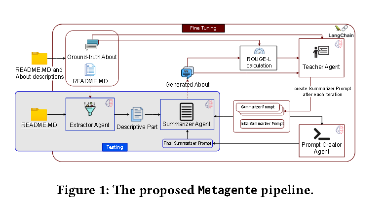


* 首先经过extractor 从readme提取出description part
* 然后summarizer给一个总结
* 接着将  原文、总结、以及两者间的rouge-l分数 一起送入teacher，teacher给出新的summarize prompt并不断优化， 直到15次或者rouge-l达到0.7（只有rouge-l达到0.7的数据才能继续下去）
* 优化过程由一个prompt creator分析关键点、细节并优化。还有就是teacher 和 prompt creator是gpt-4o,其他是gpt-4o-mini


实验怎么做的？


数据与指标：

数据集是从一个基准数据集然后从github上扩充、再然后人工过滤，最后得到925个，随机选择10个、50个作为训练集分别记作TS10和 TS50,剩下865个记作Es作为测试集。


具体实验：

探究一：是否值得multi agents，是否比直接ask llm生成结果强？

探究二：相较于gitsum、llama2等，是否有提升


下图中gpt-4o 代表only one GPT-4o summarization engine.

指标就是rouge，包括rouge-1,2,...L(即最长公共子序列LCS)

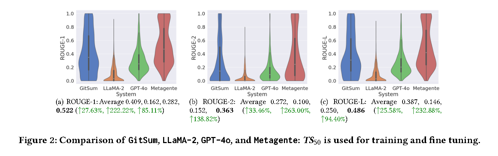


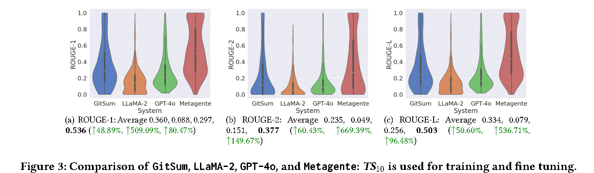


结论： 复杂流程、多agent配合比 直接llm问要强。有提升


### 小结


LLM-Based  Multi-Agent Systems for Software Engineering: Literature Review, Vision  and the Road Ahead. ACM Trans. Softw. Eng. Methodol. (Jan. 2025). [https://doi.org/10.1145/3712003 ](https://doi.org/10.1145/3712003)Just Accepted.


Application of Large Language Models to Software Engineering  Tasks: Opportunities, Risks, and Implications. IEEE Softw. 40, 3 (2023), 4–8. https://doi.org/10.1109/MS.2023.3248401


related work里找到，现有multi-agent有

OPRO 使用不同llm作为优化器，迭代优化结果 

APE 生成候选结果然后迭代优化

Camel 、MetaGPT  强调 结构化协作等


没有给一个数据集的示例

用了openai的服务，这个fine-tuning是怎么个做法，机理？

agent里用少量数据微调，

## **[ Expectations, outcomes, and challenges of modern code review](https://conf.researchr.org/program/fse-2025/program-fse-2025/?date=Wed 25 Jun 2025%2BThu 26 Jun 2025%2BFri 27 Jun 2025%2B周五 2025 年 6 月 27 日%2B周四 26 6月 2025#)**


**目的**：探索 基于工具的code review的动机、挑战、结果

手动调查分类了microsoft的几百条comment，

发现： 

* review的主要动机是缺陷检测、


* 但预期更多的是希望额外的好处

  如知识传授、提高团队意识和创建问题的替代方案。

* 发现 ***`code and change understanding`***是code review的key aspect


related work讲了 review的发展史

无论使用何种媒介，代码审查的实质都是对设计原理的阐述


microsoft的codeFlow、google的 Mondrian、开源的Gerrit

本篇研究数据来源于codeflow server。


**为什么要code review？**

查找bug、

代码改进（在可读性、注释、一致性、死代码删除等方面）、

可替代的解决方案、

知识传授、

团队意识、

Share Code Ownership

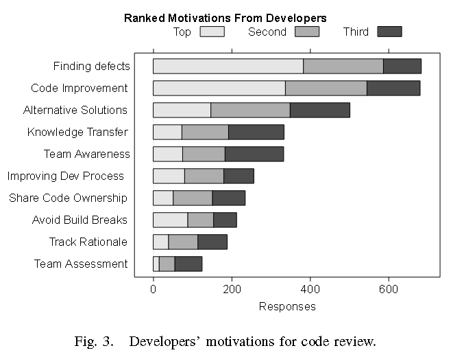


**review的结果是否匹配预期？**

分析了570个comments

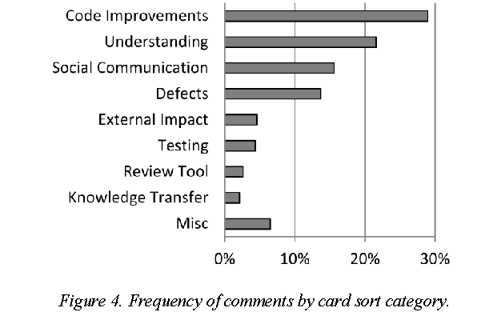

**review 面临的挑战？**


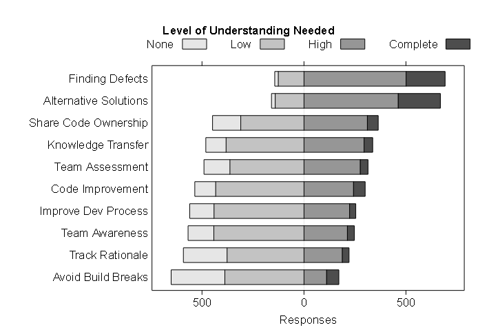

理解是面临的主要挑战

所有代码审查工具都只为审查者的理解需求提供基本支持——提供差异功能、内联注释或语法高亮等功能，这些功能在处理复杂的代码理解时受到限制。


**对researchers的建议：**

自动化代码审查任务：

许多代码审查评论与 **代码改进问题** 和  **低级“微”缺陷** 有关。

识别这两个问题是研究已经开始解决的问题。

用于强制执行团队代码约定、检查拼写错误和识别死代码的工具已经存在。甚至更高级的任务，例如检查边界条件或捕获常见错误，已经被证明在实际代码中有效。


实践中的程序理解：


**上下文和变化理解** 是 开发人员在审查时面临的挑战

现代 IDE 附带了许多工具来帮助上下文和理解，

并且有一个完整的会议 （ICPC  International Conference on Program Comprehension  co-located with ICSE） 专门讨论代码理解，

我们所看到的代码理解研究最常见的动机是开发人员正在开发新代码，但我们认为，**审阅者审查他们以前从未见过的代码可能比开发人员处理新代码更常见**。

对于代码理解研究人员来说，这是一个成熟的机会，可以对现实世界的场景产生影响。


社会技术影响：

意识和学习被认为是代码审查的动机，但这些结果很难从审查中的痕迹中观察到。我们没有进一步调查这些，但可以设计和开展研究，以确定**参与代码审查是否能 提高意识和学习** **以及 如何做到**。


## AEGIS: An Agent-based Framework for General Bug Reproduction from Issue Descriptions

字节-哈工深 高翠云

**简介：**

Niels el al( 2024 Code Agents are State of the Art Software Testers. )

对现有程序修复agent进行简单调整后，在bug重现任务中取得了最先进的结果。

但是并没有专门为此任务设计模块、优化方法。


code agent在进行bug复现任务面临 子任务繁琐、上下文冗长、难以有效利用外部工具反馈


提出自动化bug reproduction 框架AEGIS，

包含两个模块（1）简洁的上下文构建模块（2）基于 finite status machine的多反馈优化模块

在公共数据集上可将F->P指标高出基线23%，生成的bug脚本将Agentless的相对解决率提高12.5% 


**方法：**

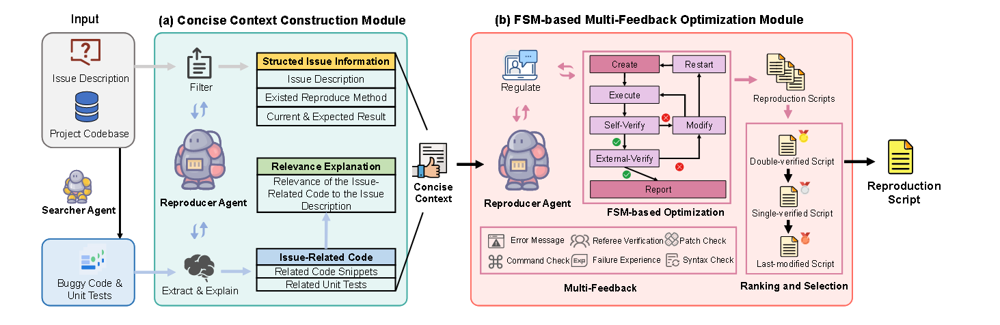

1）上下文构建模块 

旨在 从非结构化的问题描述中 构建 结构化信息，从代码库中 提取出 与问题相关的代码片段。

**提取了三种类型的信息**：结构化问题信息、与问题相关的代码和相关性解释

由于 无关和非结构化内容会阻碍理解、 缺少对问题及相关代码的解释 可能感到困惑

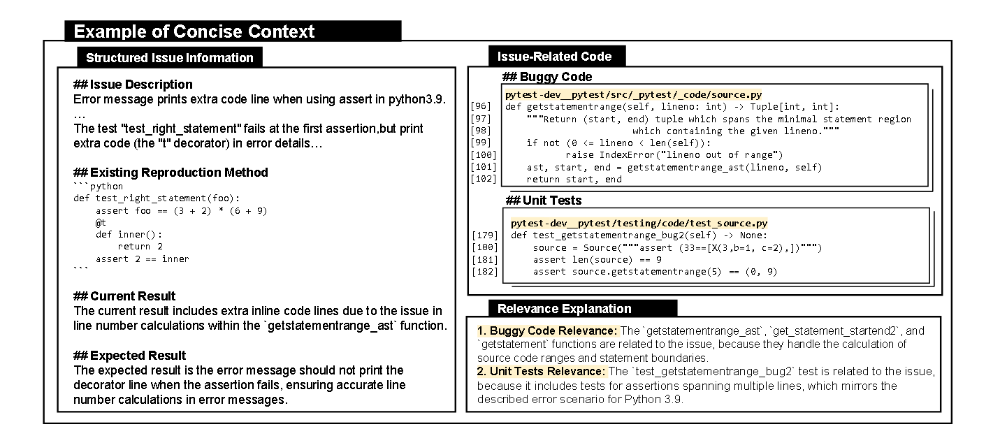


2)基于FSM的多反馈优化模块

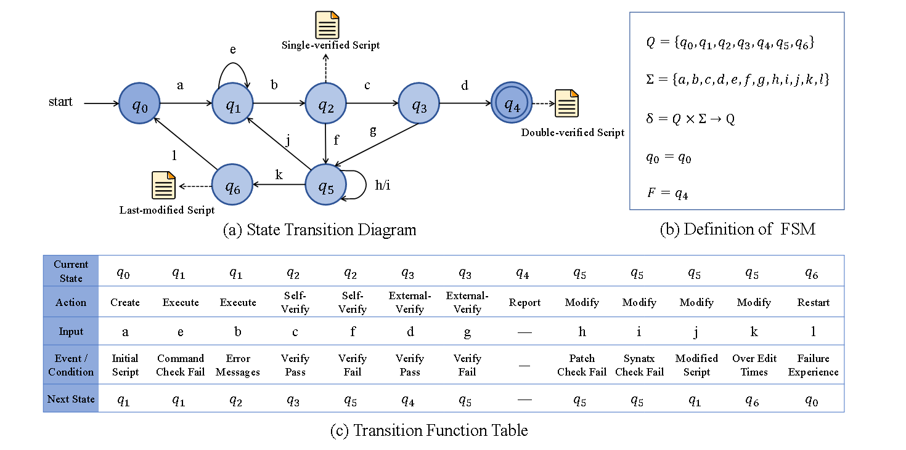

1.流程

验证分为三种： 图中self-verify是指  错误类型报告与原始issue是否相同

迭代优化主要在q5:   包括modify、patch check和 syntax check, （限定最大次数）

如果持续错就重新restart。 


会不会无限制运行下去？

q1自身的循环  由一个system prompt进一步引导， 是否无限循环取决于该prompt，

q5自身循环有次数限制也不必考虑，

上图中 状态图环路有可能会造成循环迭代，诸如q1->q2->q5->q1  ，这同样取决于模型能力和prompt


2.错误控制

在 FSM 过程中，我们提取restart时生成的复制脚本，并对它们进行优先级排序以选择唯一的复制脚本：

（1） 双重验证脚本：如果脚本同时通过自我验证和外部验证，则选择该脚本。

（2） 单校验脚本：如果没有脚本通过双校验，则选择单独通过自校验的脚本。

（3） 上次修改的脚本：如果没有满足上述条件的脚本，请选择最近修改的脚本。


**实验：**

**数据集**

SWE-bench Lite 由来自 12 个存储库的 300 个真实 GitHub 问题组成，包括问题描述和相应的开源存储库。

数据集质量如何？

**基线：**

基于LLM:

ZEROSHOTLITE 会提示 LLM 提供问题描述和说明

ZEROSHOTAGENT 类似于 ZEROSHOTLITE，但包括searcher agent检索的代码上下文

ZEROSHOT 提示 LLM 提供问题描述、使用 BM25 检索的相关代码上下文，以及以统一 diff 格式生成补丁文件的说明。

ZEROSHOTPLUS 类似于 ZEROSHOT，但利用了调整后的 diff 格式，允许插入、替换或删除整个函数或类。

基于agent：

SWE-AGENT由几个主要组件组成，包括搜索、文件查看器、文件编辑器和上下文管理。还允许使用系统命令和实用程序

SWE-AGENT+ 是基于 SWE-AGENT 的变体，它会 显式执行生成的复制脚本。

AUTOCODEROVER 由两个阶段组成：上下文检索阶段和补丁生成阶段。在第一阶段，AUTOCODEROVER 以迭代方式搜索与问题相关的代码片段。在第二阶段，它根据问题描述和代码上下文生成补丁，重试直到成功应用补丁。

基于现有的代码代理框架为错误复现任务设计了一个简单的 AgentBaseline。AgentBaseline 具有搜索和查看代码以及编辑和执行错误重现脚本的能力。它同时执行上下文检索、脚本执行和文件编辑，并提交优化后的复制脚本。


**评估指标：**

**在issue解决后，对应的被修改的scripts能否正确执行。**

**在解决问题之前和之后**，在相应存储库中运行时，确定了四种不同的执行状态：失败到失败 （F 2P）、失败到失败 （F 2F）、通过到传递 （P2P）、通过到失败 （P2F）。

~~主要观察 **F2P  和 P2F**~~

X代表F和P                                                                                                                                                                                                                                                           

~~F2P是36% * 300=108~~

~~F2F是54%*300 = 162~~

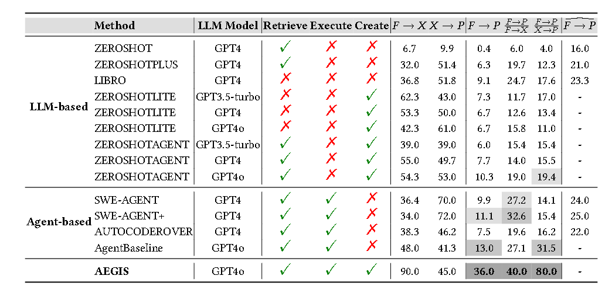

“Retrieve”列指示方法是否从存储库中检索代码，“Execute”列指示方法是否可以执行然后优化脚本，“Create”列指示是否指示方法创建和编辑新脚本，而不是修改现有脚本。


推理的 Hyber-Parameters：Searcher Agent 和 Reproducer Agent 可以访问 GPT4o-2024-0513 。Searcher Agent 的采样温度设置为 0，最多进行 40 次检索迭代。Reproducer Agent 的采样温度设置为 0.7，最多重新启动 5 次，每次重新启动最多执行 5 次编辑。


基于开源项目 SWE-bench-docke为每个实例构建环境完成的 docker 镜像。*对于每个实例，AEGIS 都会启动一个新的 docker 容器来自动生成错误重现脚本*。为了加快脚本生成速度，我们开启了 4 个进程进行并行推理。


## Knowledge-Based Multi-Agent Framework for Automated Software Architecture Design

agent做软件架构设计

Yang Liu   Nanyang Technological University


**简介：**

使用agent来自动化架构设计过程在很大程度上仍未得到探索

提出了 MAAD框架， 模拟传统软件架构设计

为增强功能，整合了三个知识源：现有系统设计、权威文献、专家


**具体：**


引用了metagpt（多agent）、mapcoder等三篇论文，然后说这些依赖于简单的zero-shot prompt策略，

是否可以使用多代理系统来自动化架构设计过程 仍有待探索。


如图所示。

Analyst、Modeler、Designer 和 Evaluator 这四个代理将根据输入协作设计系统架构

一个开发在线书店的示例


**AutoReview: An LLM-based Multi-Agent System for Security Issue-Oriented Code Review**


**Vulnerability-Triggering Test Case Generation from Third-Party Libraries** 


## 总结


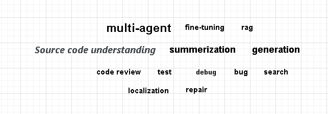

agent 

通过各种prompt策略、知识、流程结构设计生成代码等。

生成代码， 定位错误位置代码， 修补代码， 获得最终代码。如何确定错误？测试。


另一方面、模型


测试、摘要、generate、都是一样的方法研究


程序理解


## 2025.7.7 

回答 现有有啥研究不足、有哪些数据集    、想一个简单的agent设计


SWE


Code review


Towards Automating Code Review Activities

大佬 [Michele Tufano](https://arxiv.org/search/cs?searchtype=author&query=Tufano,+M), [Denys Poshyvanyk](https://arxiv.org/search/cs?searchtype=author&query=Poshyvanyk,+D), [Gabriele Bavota](https://arxiv.org/search/cs?searchtype=author&query=Bavota,+G) 

Automatic Code Review by Learning the Revision of Source Code

CORE: Automating Review Recommendation for Code Changes

-----------


[Gabriele Bavota](https://arxiv.org/search/cs?searchtype=author&query=Bavota,+G) 25年来有两篇相关论文

Automating Code Review: A Systematic Literature Review

[Leveraging Reward Models for Guiding Code Review Comment Generation](https://scholar.google.com/citations?view_op=view_citation&hl=zh-CN&user=inc2FLEAAAAJ&sortby=pubdate&citation_for_view=inc2FLEAAAAJ:lgwcVrK6X84C)

## Automating Code Review: A Systematic Literature Review

文章背景：

**25年 3.12  Gabriele Bavota** 

文献综述

主要包括筛选的119篇关于 automation of code review tasks 的论文

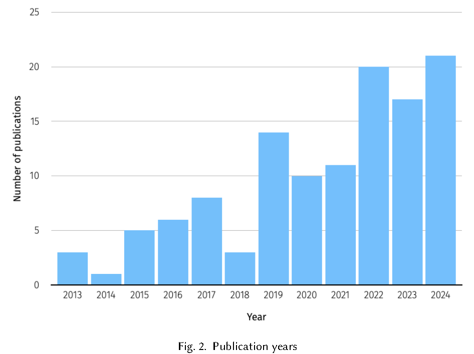

### ai导读

1. **什么是代码审查及其自动化？**

代码审查是软件开发中的一个关键环节，旨在通过同行评审来提升代码质量、发现潜在错误和统一编码风格。然而，传统的手动审查非常耗时，会占用开发者大量时间。因此，研究者们致力于开发各种工具和技术，将代码审查中的特定任务自动化，以提高效率和效果。

2. **哪些代码审查任务可以被自动化？**

该论文将自动化的代码审查任务分为了34种，并归纳为几大类。主要包括：

- **审查员推荐 (Recommending Reviewers)**：这是研究最多的领域，旨在为某个代码变更自动推荐最合适的审查人员。
- **代码变更分析 (Code Change Analysis)**：分析提交的代码变更，例如将一个复杂的大变更拆分成多个更小、更内聚的部分，使其更易于审查。
- **代码变更质量检查 (Code Change Quality Check)**：自动检查代码变更的质量。这包括从预测代码中是否可能引入缺陷，到利用深度学习（DL）模型直接生成类似人类审查员的评论。
- **代码变更分类 (Code Change Classification)**：对代码变更进行分类，例如预测一个变更是否会被批准、需要修改还是会被拒绝，从而帮助审查者确定审查的优先级。
- **代码自动修复 (Revised Code Generation)**：这是近年来一个热门方向，旨在根据审查者的评论自动修改代码，或在提交审查前就预测并完成可能的修改。
- **审查评论情感与质量分析 (Review Sentiment & Quality Analysis)**：分析审查评论中的情感（如是否存在不文明言论），或评估评论的有效性。

3. **主要使用哪些技术？**

论文指出，自动化代码审查采用了多种技术，并且近年来趋势明显：

- **机器学习 (ML) 和深度学习 (DL)**：这是目前的主流。传统的机器学习方法常用于分类任务（如推荐审查员、预测变更是否合并），而深度学习模型，特别是大型语言模型（LLMs），在生成式任务（如生成审查评论、自动修复代码）中表现出强大的能力，并且其应用正迅速增加。
- **信息检索 (IR)**：用于从历史数据中检索相似的代码变更或审查评论，以辅助当前的审查任务。
- **启发式方法 (Heuristic-Based)**：基于一组预定义的规则或指标来进行自动化，例如根据谁最近修改了某个文件来推荐审查员。

4. **如何评估这些自动化工具？**

评估方法因任务而异：

- 对于**分类任务**，通常使用准确率（Accuracy）、精确率（Precision）、召回率（Recall）和F1分数等传统指标。
- 对于**生成式任务**（如生成评论或代码），则借鉴自然语言处理领域的BLEU和ROUGE分数，或通过与人类编写的参考答案进行精确匹配来计算准确率。

论文特别指出，现有的评估指标（尤其是针对生成式任务的）存在**严重局限性**。例如，一个模型生成的评论即使与人类写的完全不同，也可能是正确且有用的，但BLEU分数会很低。因此，许多研究也结合了人工定性分析来弥补指标的不足。

5. **面临的挑战与未来方向**

论文最后总结了该领域面临的主要挑战和未来的研究方向：

- **性能问题**：许多工具生成的建议质量还不尽如人意，且在特定场景（如处理低资源编程语言）下的支持有限。训练数据的噪声和偏差（例如，总是推荐少数几个核心开发者）也是一大挑战。
- **评估问题**：迫切需要超越现有指标，开发更能反映工具实际效用的新评估方法和基准测试。
- **可用性问题**：学术界开发的原型工具往往忽略了实际使用中的可扩展性、响应速度和易用性等非功能性需求。
- **部署问题**：基于大型AI模型的解决方案部署和维护成本高昂，其实际应用面临经济和技术上的障碍。

总而言之，这篇论文系统地描绘了代码审查自动化领域的发展全景，展示了从简单的审查员推荐到复杂的代码自动生成等一系列任务的技术演进。论文强调，虽然基于AI特别是深度学习的方法带来了巨大潜力，但在性能、评估和实际应用方面仍有许多关键问题亟待解决。

### 本文内容：

1）automate code review 相关文献中的 **task 分类**

2）使用的自动化的**技术的概述**，涉及数据驱动型技术的数据集

3）各个task的**评估指标、评估技术和评估数据集(public)**


历史简介：

**70年代**，Fagan发表“Design and code inspections to reduce errors in program development”一文，首次提出通过 查看同伴的code 来发现code中是否存在bug 或 code有更好的实现方案。

**13年**，code review的过程变得**更加正式 并且多基于tool**， 演变为为**modern code review**（MCR）。

尽管CR可以带来巨大的益处，但需要 developers 花费海量时间review code。

**MCR的主要目标之一**就是减少这些伴随CR的开销。 基于此，研究人员已经提出来一些技术和工具。


起初

一些研究主要关注 **recommend reviewers**。

即为 一个code change选择合适的reviewers。


另一些研究关注 **classify reviewers' comments**

即 基于reviewer给contributor的反馈类型（如style、functionality）来给comments分类


随着deep learning在se领域的发展，**生成式任务**成为automation的主角。

如训练DL模型 来为code change生产 自然语言comment


1）automate code review 相关文献中的 **task 分类**

总共分为 34种类型 的任务

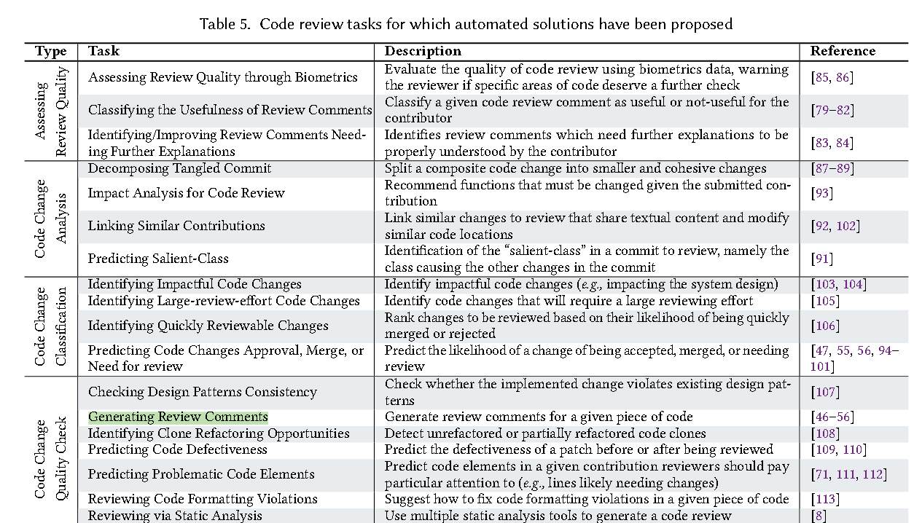

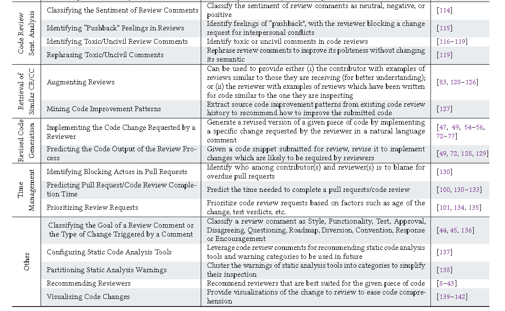


2）使用的自动化的**技术的概述**，

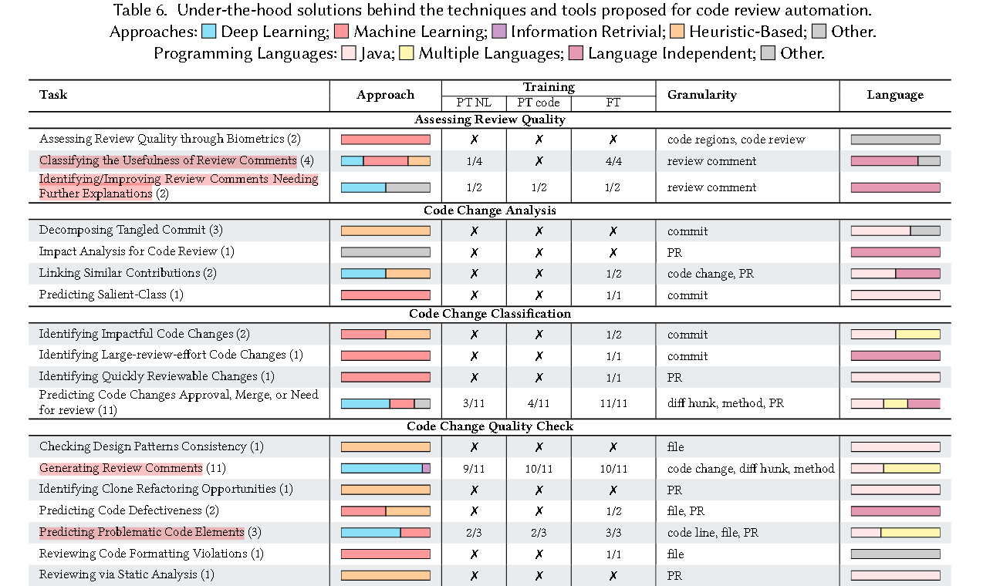

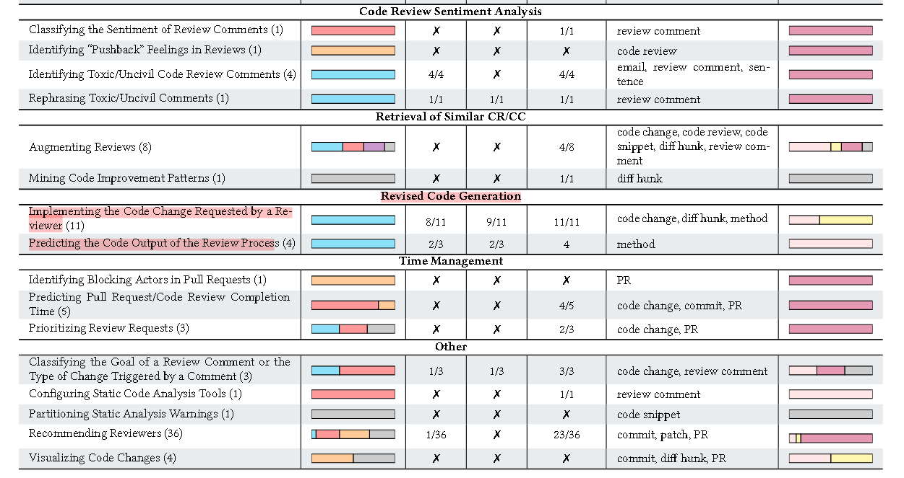


generate review comment

实现这一目标的第一个策略包括合并几个静态分析工具的输出 [8]，为贡献者提供在提交的补丁中发现的潜在缺陷列表。然而，最近的趋势是利用深度学习模型为给定的补丁生成自然语言注释，模型模仿人工审阅者[46-56]。这些技术在数千个真实代码审查示例（即，对特定代码更改的审阅评论）上进行了训练，然后可以应用于以前看不见的更改以生成审阅注释。


预测code output of the review process

第一个 [49， 72， 128， 129] 为自动化技术提供提交审查的代码片段作为输入，并期望该技术修改此类代码以实现在代码审查过程中可能会请求的更改。


实现reviewer要求的 code change

第二个 [47， 49， 54–56， 72–77] 是一个代码优化任务，其中方法不仅作为输入提供，不仅是提交审查的代码片段，还包括特定审阅者要解决的评论。


3）各个automation task的**评估指标**

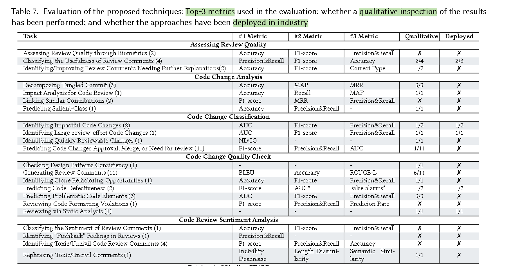

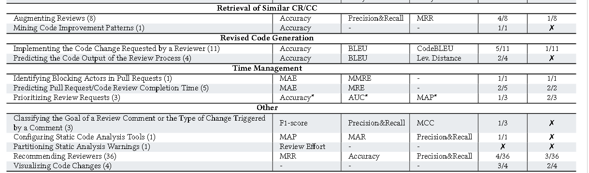


4)公开可用的 技术和数据集

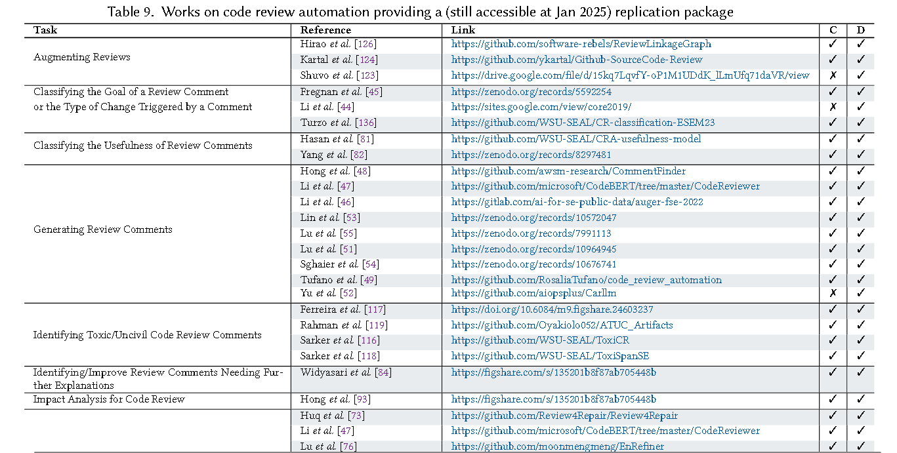

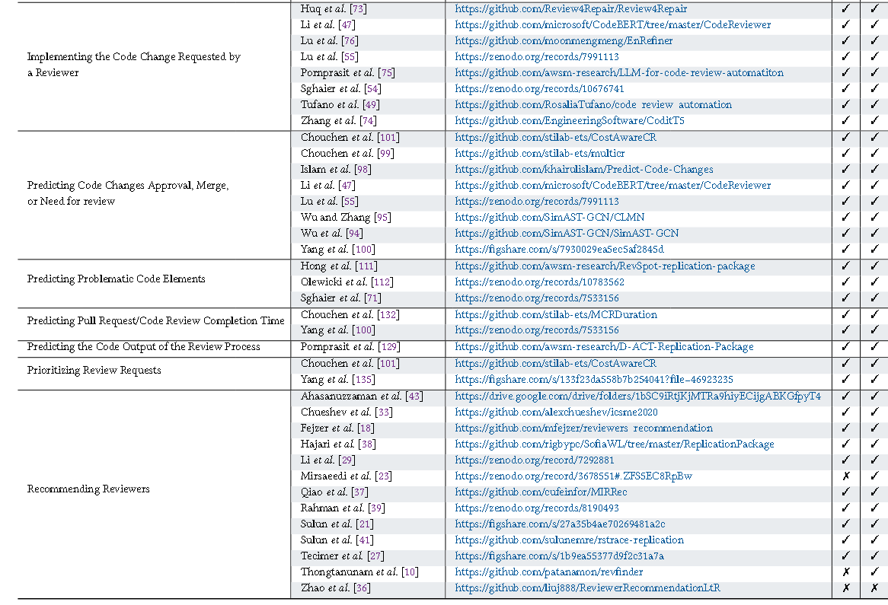

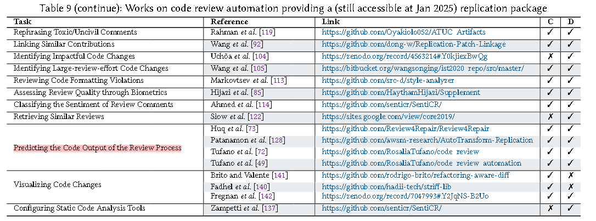


5）实施现有技术时的 不足、限制

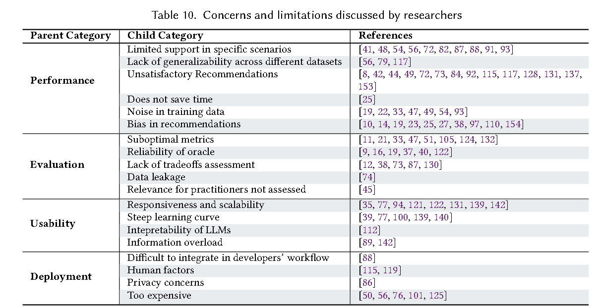


> snowballing 滚雪球检索 是一种文献检索策略
>
> | 方法                                   | 操作方式                                       | 适用场景               |
> | :------------------------------------- | :--------------------------------------------- | :--------------------- |
> | **后向滚雪球（Backward Snowballing）** | 检查已有文献的**参考文献列表**（Bibliography） | 追溯理论基础、历史演变 |
> | **前向滚雪球（Forward Snowballing）**  | 检查已有文献的**被引用文献**（Citations）      | 追踪最新进展、应用扩展 |
>
> ### **实际应用示例**
>
> 1. **种子选择**：
>    从初始检索得到的5篇高相关性论文开始。
> 2. **后向滚雪球**：
>    分析这5篇论文的参考文献，筛选出10篇相关旧文献。
> 3. **前向滚雪balling**：
>    通过Google Scholar查找引用这5篇论文的50篇新文献，筛选出15篇相关研究。
> 4. **迭代扩展**：
>    对新发现的文献重复上述过程，直至饱和（无新增相关文献）。


RQ1 存在哪些researchers已经提出自动化方案的 code review tasks


9大类34小类

1. Assessing Review Quality.

该领域的工作旨在自动评估审查的质量。

这些信息旨在提供给审阅者，审阅者可以在需要时采取适当的措施来提高审阅质量。


此领域的工作旨在**将comment分类为对贡献者有用或无用**。Rahman et al. 解决了类似的问题，但**特别关注需要额外解释才能让贡献者正确理解的评论**（因此是无用评论的一个子类别）。

Widyasari et al.调查需要额外解释的评论，并在需要时建议使用大型语言模型 （LLM） 来生成额外的解释。


最后，Hijazi et al. **使用生物识别数据**从正交角度研究了代码审查质量测量。通过监控审阅者的活动（例如，使用眼动追踪设备），他们可以向审阅者提供关于他们没有足够关注的被审阅代码区域的反馈，从而建议进一步检查。


2. Code Change Analysis. 

此类别旨在 分析提交审核的代码，提取出有用信息 从而便于reviewer的审查。

几位作者的目标是**将纠缠的提交 拆分为更小且有凝聚力的更改**，这些更改应该更容易审查。事实上，较小的更改有助于实现快速的审核周转，而内聚的更改简化了适当审核者的识别，这些审核者更有可能拥有全面的专业知识来审核更改（考虑到其凝聚力和重点）。


Huang et al.提议在提交审查中**自动识别 “salient-class”。**salient-class 应该是更改的主要焦点，并且可能触发了对其他代码位置的更改。这样的类可以用作review过程的入口点，这将简化对代码更改的理解。


Wang et al. 建议**自动链接相似的贡献**，这可能有助于识别重复的补丁，更一般地说，可以提高审阅者对影响相似位置的更改的认识，从而促进更好的代码审查。


最后，为了最大限度地减少接受提议的更改所需的代码审查迭代次数，Hong 等人提出了一种专门为代码审查过程量身定制的变更影响分析方法，旨在**识别必须根据提议的贡献 共同更改但未更改的功能**。


3. Code Change Classification.

此领域的工作将整个代码更改分类以再次审查，目的是在开始代码检查之前增加审查者可用的信息。

**预测代码更改是否会获得批准（合并）或需要额外的审核轮次**是文献中最常见的代码更改分类任务

关于这个主题的工作提供了代码更改的表示作为方法（例如，DL 模型）的输入，期望它建议实施的更改是否可接受。


另一个研究方向旨在**识别代码贡献**，由于其性质，这些贡献将需要大量的审查工作。

Uchôa等会自动**标记可能影响软件设计的代码更改**，因此在评估时需要格外小心。

提出了 BLIMP Tracer，这是一种**通过影响分析信息**支持代码审查的工具，从而有助于**识别影响关键任务可交付成果的更改**。

Wang等将问题推广到 **自动识别需要费力很大的review change**

另一方面，Zhao et al.  的目标是**识别可快速审查的更改，即易于合并或拒绝的贡献**

所有这些工作都为代码审阅者提供了有用的信息，以便确定要检查的更改的优先级。


4. Code Change Quality Check.

研究人员提出了一些解决方案，以（部分）自动化通常在审查代码更改时进行的质量检查。

解决此任务的方法在目标和复杂性上差异很大

其中一些侧重于**特定的代码质量方面**，例如预测提交的补丁是否可能引入错误 ，识别是否存在错过的克隆重构机会 ，或检查实施的更改是否违反了现有的设计模式 

其他技术通过对**代码质量的更一般的看法**来解决相同的问题。


其他技术通过对代码质量的更一般的看法来解决相同的问题。

一些作者旨在**预测补丁中需要审阅者注意的代码元素**，因为可能需要更改。

其他工作进一步突破了界限，**旨在为贡献者自动生成具体反馈**，就像人工审阅者所做的那样。


实现这一目标的第一个策略包括**合并几个静态分析工具的输出**，为贡献者提供在提交的补丁中发现的潜在缺陷列表。

**利用 DL 模型为给定的补丁生成自然语言注释**，模型模仿人工审阅者。

这些技术在数千个真实代码审查示例（即，对特定代码更改的审阅评论）上进行了训练，然后可以应用于以前看不见的更改以生成审阅注释。

Markovtsev et al.  专注于这个问题的简化版本：他们的方法“学习”给定软件项目的代码格式风格，识别违反这种风格的行为，并作为自动生成的审阅者评论提出可能的修复方法。


5.Code Review Sentiment Analysis。代码审查情绪分析

代码审查过程可能会导致开发人员 （审阅者） 将批评移动到他们的同事 （贡献者） 之一。

这些批评在审稿人的评论中正式化的方式可以在整个过程的成功结果中发挥重要作用。

出于这个原因，研究人员应用了**情感分析技术自动对审稿人评论的情绪进行分类**：标记表达负面情绪的评论可以为审稿人提供有用的信息，他们可以修改那些可能有问题的评论。

其他作者解决了这个问题的更具体版本，专注于识别审稿人表达特定类型的负面情绪的评论。

特别是，Egelman等旨在识别表明审阅者阻止更改请求的审阅评论是因为因为人际冲突而不是提交的贡献的质量。

相反，Sarker等专注于识别“有毒代码审查”，而Ferreira等和Rahman等则针对“不文明的审查评论”。与毒性相比，不文明行为代表了更广泛的负面评论，因为后者涉及仇恨言论和冒犯性语言，而不文明行为则没有 。

请注意，Rahman等除了识别不文明的评论外，还提出了一个模型，能够提出保留原始评论语义的替代民事改写。


6.Retrieval of Similar Code Reviews/Code Changes.

给定一个要审查的代码片段，一些技术**从过去审查的数据集中检索那些涉及相似代码片段的评论，并向审查者推荐他们可以重用的评论**（因为过去用于建议对类似代码的改进）。

Rahman et al.  也提出了一种类似的方法，但**将其作为一种机制来激励投稿人**，以便为投稿人提供额外的评论示例，这些评论与他们收到的评论相似。**这有助于更好地理解审稿人的意思**。

Ueda 等 反而专注于**从代码审查中挖掘反复出现的改进模式**（即审查者经常建议的更改）。然后，可以潜在地应用这些模式来提高要审阅的代码的质量（甚至在审阅过程开始之前）。


7.Revised Code Generation。

该研究方向旨在通过自动生成审查流程的代码输出来支持代码审查流程。已经提出了这项任务的两种变体。第一个 [49， 72， 128， 129] 为自动化技术**提供提交审查的代码片段作为输入，并期望该技术修改此类代码以实现在代码审查过程中可能会请求的更改**。这些技术旨在供贡献者在开始代码审查过程之前使用，以快速验证是否可以对他们编写的代码进行改进。

第二个 [47， 49， 54–56， 72–77] 是一个代码细化任务，其中**输入不仅是提交审核的代码片段，还包括特定审阅者要解决的注释**

*这些方法旨在在代码审查过程中使用 （i） 审阅者，在他们的评论中附加一个示例，说明他们如何设想修订后的代码，或者 （ii） 由贡献者，自动解决审阅者的一些请求。*


8.Time Management.

文献证据表明，开源和工业项目每月可以经历数百次审查（例如，Linux 中每月 ∼500 次审查 [143]，Microsoft Bing 中每月 ∼3k [144]）。

在这样的背景下，时间管理变得至关重要，研究人员提出了解决方案来帮助正确分配审稿人的时间。与前面讨论的自动化特定代码审查任务的技术不同，这些方法旨在增加reviewers和/或managers可用的信息，从而可能改进代码审查期间做出的决策。


一些建议的解决方案可以组合成一种管道来支持代码审查：

预测完成拉取请求所需时间的方法 [100， 130–133] 可用于为旨在确定审查请求优先级的技术提供信息[101， 134， 135]。此外，拉取请求花费的时间比预期长，可以作为识别阻塞参与者 [130] 的技术的输入，即负责延迟的人。这可能有助于触发阻塞行为者，或者如果可能的话，替换它们。


9.Other

最后一个类别将不适合前面介绍的类别的任务组合在一起，并具有异构任务。


**最适合给定更改的审阅者的推荐**

在大多数情况下，这些功能包括从代码更改历史记录中提取的信息，以支持审阅者的建议，例如，过去已经处理过更改主题的代码文件或已经审阅过类似补丁的审阅者。

“其他”类别中的另一个热门任务**具有为代码更改提供可视化**以供审阅的方法，以简化审阅者的检查

Brito 和 Valente [141] 提出了 RAID，这是一种用于重构感知代码审查的工具，它可视化了在要审查的更改中实现的重构作。

Fadhel 和 Sekerinski [140] 以可视化为目标，旨在提高审阅者对实施的更改可能对系统架构产生的影响的认识。

Fregnan et al. [142] 提供了一种更通用的基于图的可视化来支持代码审查：每个节点代表一个类或一个方法，它们之间的链接代表依赖关系，例如方法调用。此处的目标是改进更改的导航及其理解。

最后，仍然与可视化相关的是 [139] 中提出的方法产生的行为差异。这个想法是显示行为差异（就测试用例执行而言），在实施代码更改之前和之后可以在系统中观察到以进行审查。这可以支持审阅者对代码更改正确性的评估。


他们的方法旨在更好地了解和监控正在进行的审核流程。最重要的是，**随着数据驱动技术用于自动化任务（例如生成评论评论）的提出，这种方法可用于清理这些技术的训练集，例如删除归类为“鼓励”的评论，因为与建议如何改进代码片段的训练技术无关。**Turzo 等人 [136] 也提出了类似的方法，而 Fregnan 等人。 [45] 专注于对作为代码审查过程结果实现的代码更改进行分类。

Tukaram等[138]提出了对静态分析警告进行分区的想法，目的是将相似的警告聚类起来，从而简化它们的解释。在相关的研究线程中，Zampetti et al. [137] 建议对过去发布的评论进行自动分析，以了解在给定项目的持续集成管道中应该使用哪些静态分析工具，以及应该如何配置它们。换句话说，它们旨在了解相关的 “问题” 审阅者在检查补丁时寻找什么，以及哪些问题可以通过静态分析工具自动识别。


## Leveraging Reward Models for Guiding Code Review Comment Generation（PPO）

**25年6月** **Gabriele Bavota**


### code

https://github.com/OussamaSghaier/RL4CR.


已经提出了（部分）自动化代码审查过程的技术中，利用深度学习 （DL） 的那些能够解决**代码审查的生成方面问题**，方法是像人工审阅者一样对给定代码进行注释（即**comment generation task**注释生成任务）或自动实施处理审阅者注释所需的代码更改（即**code refinement task**代码优化任务）。


据我们所知，CoRAL 是文献中第一个提出的**基于 RL** 的技术**进行review comment generation**


分阶段训练：

首先对CodeLlama-7B模型进行监督式微调，使其在评论生成任务上学习基础能力。模型接收代码变更（diff）作为输入，生成审查评论，并与真实评论进行对比，通过最小化交叉熵损失来更新权重

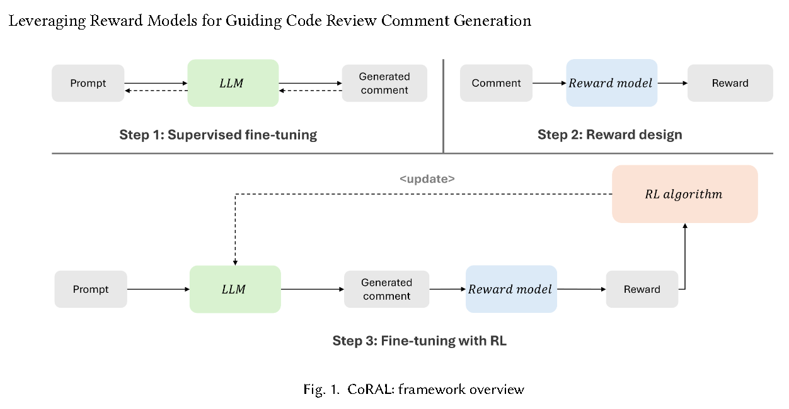


RL方法设计：

主要设计了两种奖励模型

 ▪ **语义相似性奖励**：衡量生成评论与真实评论之间的语义相似度。通过Sentence Transformer (SBERT) 将评论编码为高维向量，并计算其余弦相似度作为奖励。

 ▪ **后续任务正确性奖励**：评估生成评论对后续代码修订任务的有用性。一个单独的CodeLlama模型（针对代码修订任务微调）接收生成评论和原始代码，并生成修订代码。奖励基于修订代码的损失值或CrystalBLEU分数（衡量生成代码与真实修订代码的相似度）

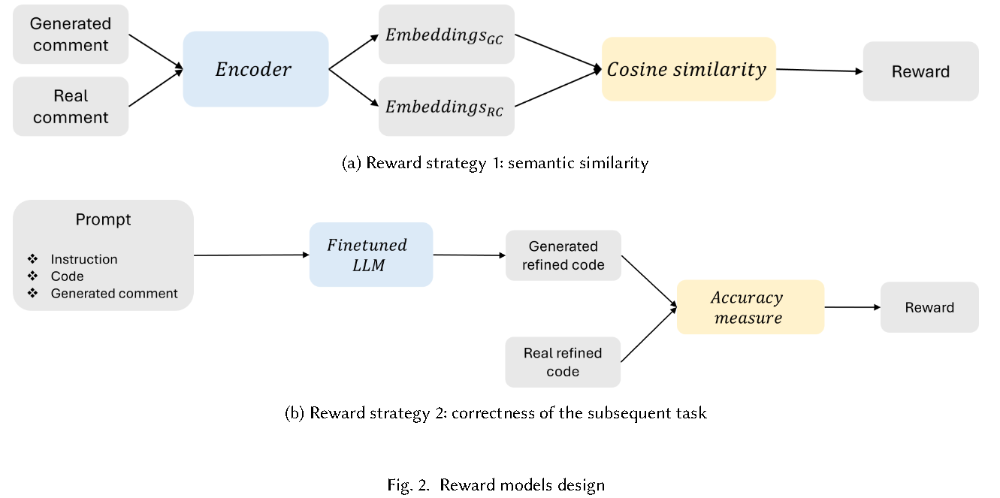


**RL算法**：采用近端策略优化（Proximal Policy Optimization, PPO）算法

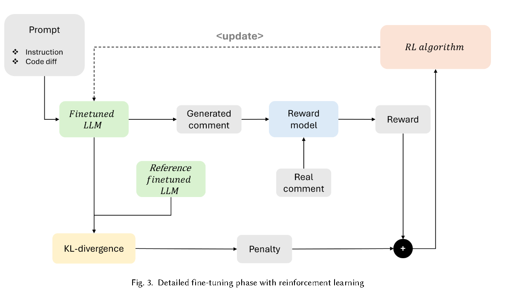


实验：

 **定量评估**：比较不同奖励策略下的BLEU分数和累积奖励。

 **定性评估**：使用GPT-4作为“法官”来评估CoRAL生成的评论与基线模型（CodeLlama_sft和DISCOREV）生成评论的有用性。

定量评估以 BELU为指标，

> 对比的基线方法是 DISCOREV ， 将DISCOREV重新训练为使用CodeLlama-7B作为其核心模型
>
> CodeLlama_sft，我们的基线，是 CodeLlama-7B 经过微调，无需 RL 即可生成注释。

在所有策略中，CoRAL_crystal取得了最高的BLEU分数中位数（8.67）

显著优于CoRAL_semantic（7.68）、CoRAL_loss（7.31）和CodeLlama_sft（7.05）

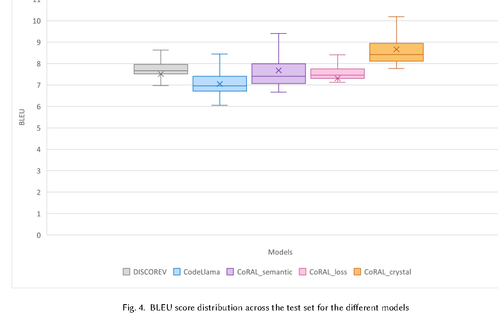

>  使用Mann-Whitney检验和Cliff's delta来评估结果的显著性
>  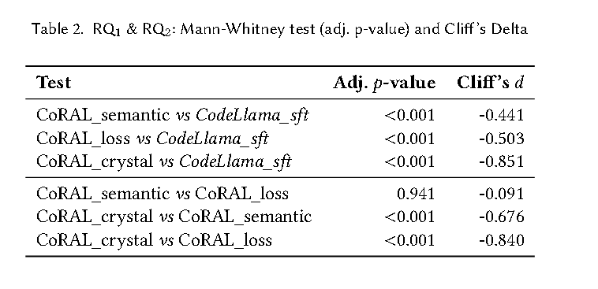
>
>  ?


下面是初始奖励和 结束奖励， 

对于基于CrystalBLEU的奖励（CoRAL_crystal）而言，

模型奖励从0.77增加到0.84，这表明强化学习奖励使得代码修订模型能够更好地实现生成的评论

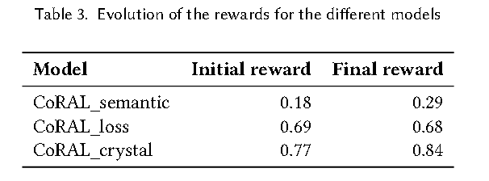


定性评估选用o3mini 作为ai judge，经人工确认70%左右相一致

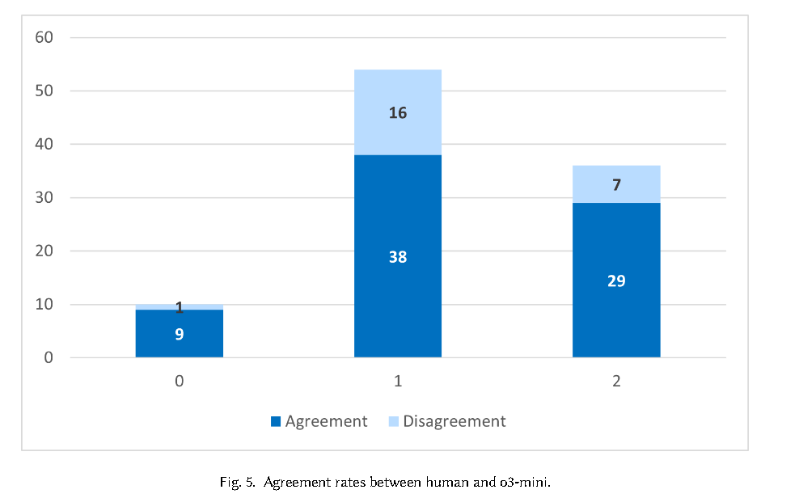


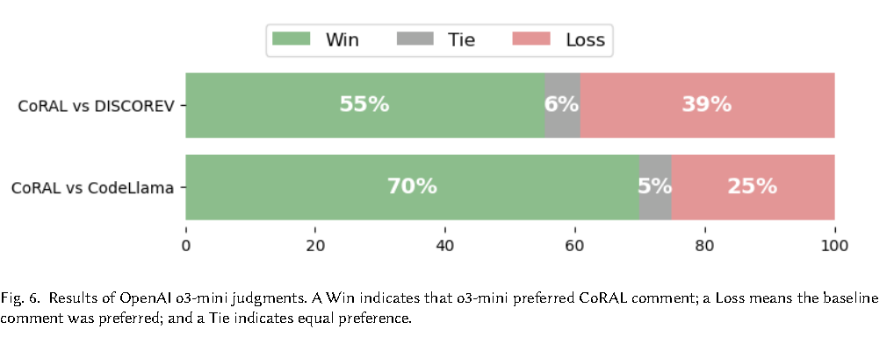


这些结果共同表明，**强化学习微调有助于提升基于深度学习的代码评论生成性能**。

并且所提供的奖励信号对模型性能的提升具有价值，**将CrystalBLEU作为后续任务（代码修订）的奖励策略被证明是本研究中效果最好的奖励策略**。

 


>进一步：
>
>想学习下代码，
>学习Mann-Whitney检验和Cliff's delta  怎么用
>
>学习CrystalBLEU指标

 模型在PyTorch和HuggingFace transformers框架下实现。

• 预训练阶段使用DGX-2服务器（每台16块NVIDIA V100-32G GPU），学习率为0.0002，批大小为768，使用AdamW优化器进行250k步训练。

• 微调阶段使用4块V100 GPU的服务器，批大小为72，学习率为0.0003。

• CoRAL的训练使用了四块NVIDIA RTX A5000 GPU，采用梯度累积、4比特量化和LoRA（Low-Rank Adaptation）等参数高效微调技术。

• 在审查评论生成和代码修订任务评估时，使用束搜索（beam search），束大小为10


## Automating code review activities by large-scale pre-training（数据集）

**22年11月**   **微软**亚研的

### code

 https://github.com/microsoft/CodeBERT/tree/master/CodeReviewer


**现有研究的局限性**：

1. 现有用于代码的预训练模型（如Codex）**在source code上训练**，**对代码审查知之甚少**，难以处理代码审查过程。

> 如下图的Codex， 由于它 基于 原始格式的源代码文件 训练，对code review所知甚少。
> 在下图中，它不能产生有 意义的comment。
> 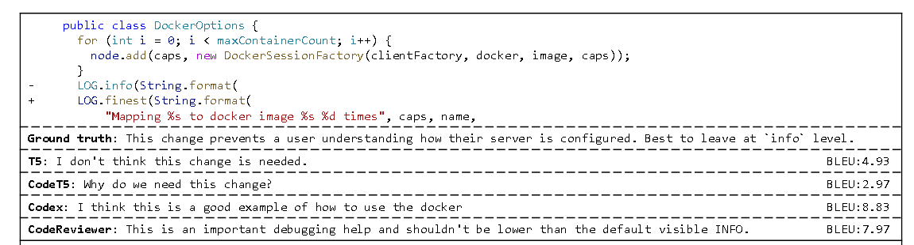
>
> 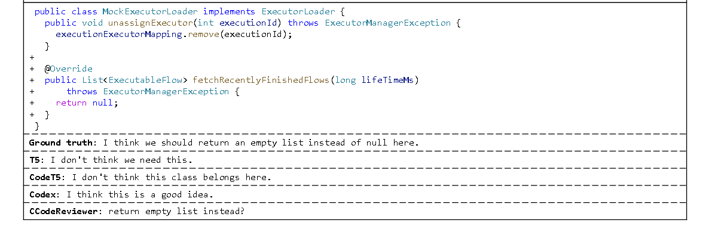

2.  部分尝试自动化代码审查的预训练模型（如Tufano等人 的工作）其预训练数据集并非直接来自代码审查过程，数据集是从stackoverflow 和Code-SearchNet收集的，**这些数据并不直接来自code review process**。
    并且它们的预训练模型**采用source code作为模型输入**， **忽略了代码差异（diff）这种特殊格式对理解代码变更**的重要性。


### 数据集

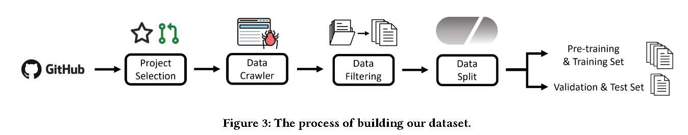


从公共GitHub项目挖掘的 **176,616个代码审查轮次**。

这些数据来源于**高质量的开源仓库**，这些仓库通过“星数”指标体现其受欢迎程度，并且拥有高星级。

数据集涵盖了 **九种最流行的编程语言**，包括C、C++、C#、Go、Java、JavaScript、PHP、Python和Ruby


每个代码审查轮次被建模为一个三元组**(𝑐 , 𝑟 , 𝑐𝑟 )**。

 **𝑐**：指提交审查的原始代码。

 **𝑟**：指审查者提供的自然语言审查评论。

 **𝑐𝑟**：指根据审查评论**𝑟**的要求修改后的代码版本


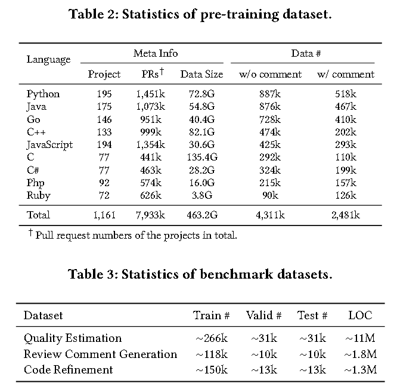


设计了**四种预训练任务**，如下图：

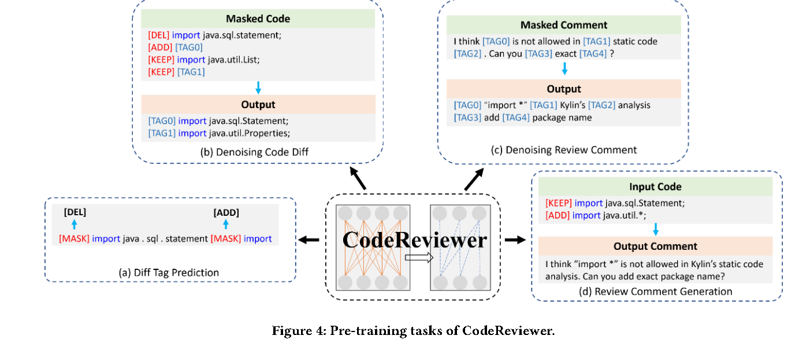

**Diff标签预测 (DTP)**：训练模型理解代码差异中的特殊行标签（如[ADD]、[DEL]、[KEEP]），通过预测被[MASK]掉的标签来学习区分代码行的变化类型。

**去噪目标 (Denoising Objective)**：

**代码差异去噪 (DCD)**：随机掩盖15%的代码行，并要求模型恢复这些被掩盖的代码行，以帮助模型学习代码变更的分布。

**审查评论去噪 (DRC)**：随机掩盖评论中的词语片段，并要求模型恢复它们，旨在提升评论相关任务的能力。

**审查评论生成 (RCG)**：给定代码变更作为输入，模型被要求生成人类审查者编写的评论，以捕捉代码变更与评论之间的关系


**实验：**

重点关注并评估模型在**三个关键的代码审查相关任务**上的表现

1. **代码变更质量评估**：预测代码变更是否需要审查评论。这有助于审查者优先处理可能有问题的代码，提高审查效率。

 	**输入**：代码差异块（diff hunk）。
 	
 	**评估指标**：准确率（Accuracy）、精确率（Precision）、召回率（Recall）和F1分数。

2. **审查评论生成**：自动生成自然语言的审查评论，从而显著减少审查者的时间成本。

 	 **输入**：代码差异块（diff hunk）。
 	
 	 **评估指标**：BLEU-4分数；**人工评估**（信息量和相关性）

3. **代码修订（Code Refinement）**：根据审查者的评论，自动修订代码以满足评论中提出的要求，协助代码提交者。

​	  **输入**：原始代码 (𝐶1) 和审查评论 (𝑅𝑛𝑙)。

​    **评估指标**：BLEU分数和精确匹配率（Exact Match, **EM**）

> 模型：
>
> **CodeReviewer**:
>
> 基于Transformer的编码器-解码器模型。
>
> 模型架构与Text-To-Text-Transfer Transformer (T5) 模型相同，包含12个编码器层和12个解码器层，总参数量为223M。
>
> 使用CodeT5 的参数进行初始化，然后在其基础上通过定制的预训练任务进行进一步训练
>
> **Transformer**(12): 从0开始训练
>
>
> **T5** ：是 Tufo训练的小版本T5， 数据集就  数据集是从stackoverflow 和Code-SearchNet收集的，**这些数据并不直接来自code review process**。
> **CodeT5**：Wang


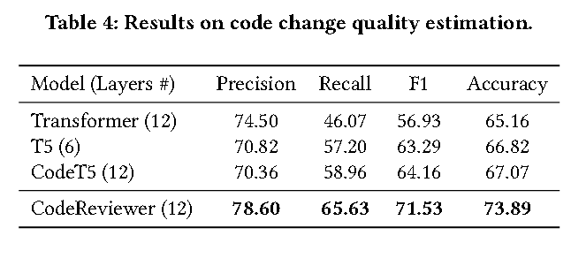

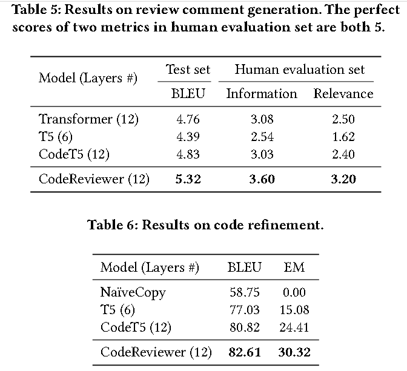


下面是其他两个实验

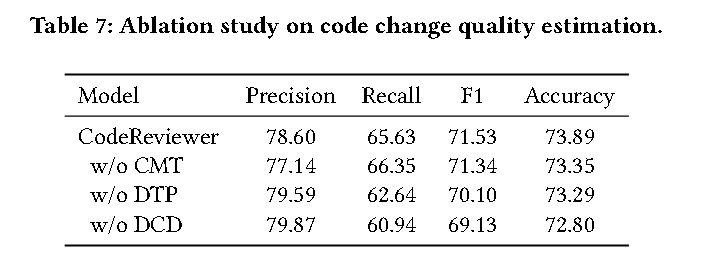

对于代码更改质量估计任务，所有的预训练任务都有助于我们的模型更好地理解代码差异。但是DTP和DCD更重要。

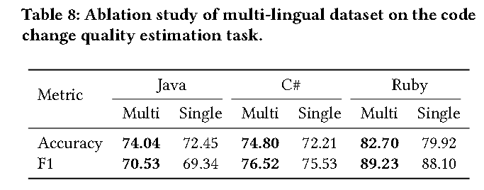

分别为 Java、C# 和 Ruby 语言构建单语数据集。Java 代表流行语言，Ruby 代表低资源语言，

多语言 CodeReviewer 的性能始终优于 3 种单语模型，准确率平均提高了 2.32%，F1 分数平均提高了 1.10%


## CodeAgent: Autonomous Communicative Agents for Code Review（emnlp）

> 利用https://www.connectedpapers.com/找文章
>
> 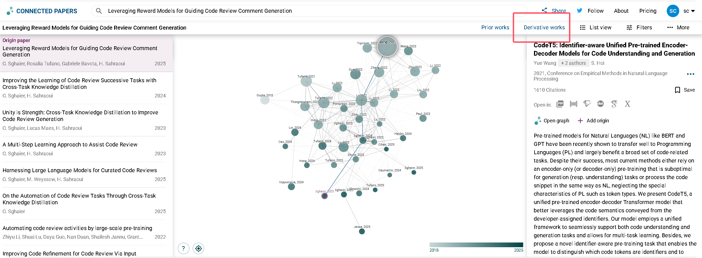


**24年9月**

大佬 Jacques Klein1, and Tegawendé F. Bissyandé 

University of Luxembourg   卢森堡

> 风格很不一样，   CCF B 发在了EMNLP上

Code review is a laborintensive process that the research community is looking to automate.


提出来 **CodeAgent**，一个用于**自动化代码审查**的新型多智能体大型语言模型（LLM）系统。

传统自动化代码审查工具往往无法模拟人类协作的复杂性，而CodeAgent通过引入一个包含不同角色的**多智能体框架**来解决这一问题，例如首席执行官、首席技术官、审查员和编码员。

该系统的一个关键创新是其**QA-Checker**组件，它能够通过确保对话聚焦于初始审查问题来**防止话题漂移**。

CodeAgent在识别代码漏洞、检查代码与提交消息之间的一致性、验证代码风格以及提出代码修订建议等关键任务上表现出色，其性能显著优于现有的先进工具。


**现有局限：** 

尽管自动化代码审查技术不断发展，但现有方法通常依赖于**单一输入-输出的生成模型**。这使得它们难以模拟代码审查过程中固有的**交互性和协作性**。代码审查涉及多项子任务（如漏洞检测、代码格式一致性、修订建议等），而现实中这些任务需要不同角色的开发者之间进行交互协作，这给自动化模型的设计带来了挑战


**如何设计：**

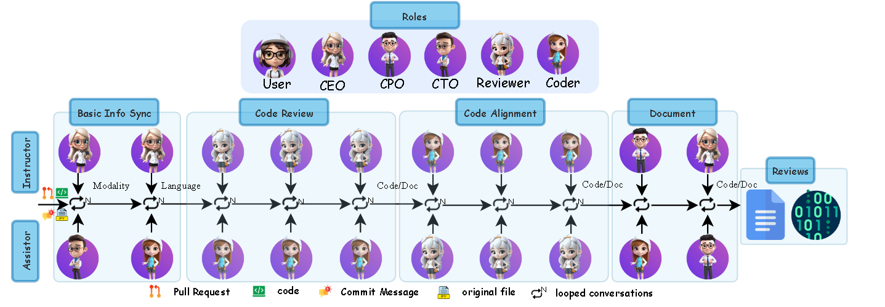

**角色定义：** CodeAgent 定义了六个主要角色：用户 (User)、首席执行官 (CEO)、首席产品官 (CPO)、首席技术官 (CTO)、审查员 (Reviewer) 和编码员 (Coder)，每个角色都有特定的职责，并且所有任务都通过两个智能体之间的多轮对话协作完成。

 **四个阶段的流水线 (Four Phases Pipeline)：**

1. **基本信息同步 (Basic Info Sync)：** CEO、CTO 和 Coder 协作识别输入内容的模态（如文档、代码）和语言。

2. **代码审查 (Code Review)：** Coder 和 Reviewer 进行实际的代码审查，执行目标子任务（如一致性分析、漏洞分析、格式分析、代码修订建议）。

3. **代码对齐 (Code Alignment)：** Coder 在 Reviewer 的协助下，根据分析报告校正或修订代码。

4. **文档 (Document)：** CEO、CPO、Coder 和 Reviewer 综合意见，完成最终的审查文档


 **QA-Checker 的作用与机制：**

 QA-Checker 是一个**指令驱动的智能体**。

 它通过**修改问题**来引导生成与问题相关的答案，以避免对话跑题。

 当 QA-Checker 认为答案不合适时，会生成附加指令并结合到原始问题中，要求智能体生成不同的答案。

 这种机制基于数学模型进行优化，确保了对话的**相关性和精确性**，并能够迭代地改进答案质量


> QA check的具体设计可以借鉴


**实验**：


**评估任务：** CodeAgent 在关键代码审查任务上进行了评估，包括：

  **一致性分析 (CA)：** 检测代码变更与提交消息之间的一致性。

  **漏洞分析 (VA)：** 识别代码变更中引入的漏洞。

  **格式一致性分析 (FA)：** 验证代码样式是否符合规范。

  **代码修订建议 (CR)：** 建议代码重写以解决发现的问题。


**数据集：** 论文使用了现有的基准数据集（如 Trans-Reviewdata, AutoTransformdata, T5-Reviewdata）并**收集并整理了一个包含 3545 个真实世界代码变更和提交消息的新数据集**

**评估指标：** 使用了 F1-Score 和 Recall (针对 CA 和 FA)、Edit Progress (EP，针对 CR) 和 Hit Rate (针对 VA)

> EP是 测量原始代码与任务 CR 预测之间的编辑距离减少。

 

CodeAgent 在漏洞检测方面**显著优于 GPT-4 和 CodeBERT**

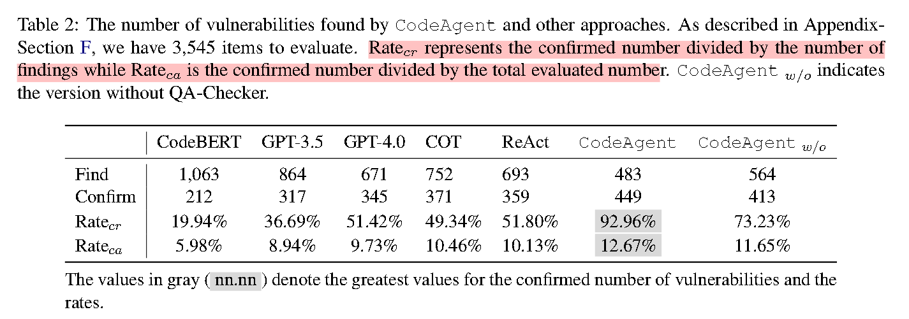


 CodeAgent 在一致性检查和格式对齐方面也表现出色，**召回率平均提升了 5.62% 到 15.56% 不等，F1-Score 平均提升了 3.79% 到 10.45% 不等**

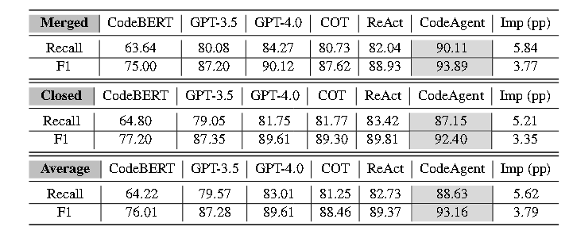


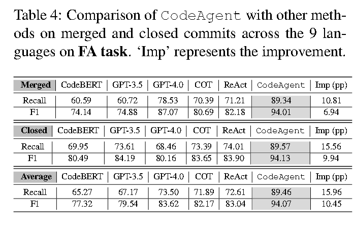

 CodeAgent 在代码修订任务中超越了现有技术，**平均编辑进度 (EP) 提高了约 30%**

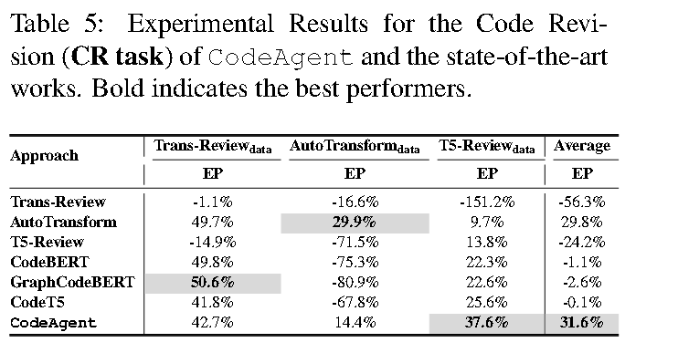


> 一个sub task一人主导，另一人辅助。 这种multi间的交互值得借鉴。


## SWE-agent: Agent-Computer Interfaces Enable Automated Software Engineering（附录设计agent时还需细看）

24年 nips   Princeton University


**研究动机：**

最近的工作证明了 LM 代理在**通过执行反馈生成代码方面的有效性**，

然而关于 **将 agent应用到更复杂的软件工程任务上**  的研究存在空白，

我们将agent设想成 一类特定的计算机用户，受**人机交互的启发** （About face 3: the essentials of interaction design.  2007），**<u>提出software engineering agent的定制的computer交互界面。 然后研究该接口设计对 agent执行 se task的影响。</u>**


***研究人员认为，就像人类从集成开发环境（IDE）等强大软件应用中受益一样，LM代理代表着一类新的终端用户，它们有自己独特的需求和能力，并会从专门构建的接口中受益***


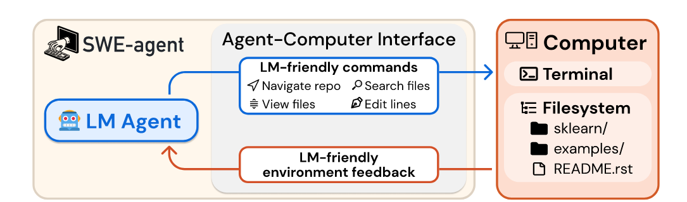


最终，设计良好的 ACI 应帮助 LM 代理了解给定先前更改的应用程序状态，管理历史记录以避免来自先前观察的不必要上下文，并提供模型可以高效可靠地使用的作。

ACI 指定 LM 可用的命令以及如何将环境状态传回 LM。

它还跟踪所有先前命令和观察的历史记录，并在每个步骤中管理如何格式化这些命令和观察并将其与高级指令组合到 LM 的单个输入中。


**ACI的设计原则**：

1. 动作简单易懂：命令*应简洁，选项少*，文档清晰

2. 动作紧凑高效： **重要操作（如文件导航、编辑）应整合到尽可能少的动作中**
3. 信息丰富但简洁的环境反馈：高质量的反馈应提供关于当前环境状态的实质性信息，而**没有不必要的细节**

4. **护栏机制（Guardrails）**：内置的护栏，如代码语法检查器，可以帮助代理识别并**快速纠正错误，从而减轻错误传播并加速恢复**


**SWE-Agent中的ACI**

1. 搜索导航

   提供`find_file`、`search_file`和`search_dir`等命令，用于在代码库中查找文件和字符串。**这些命令会抑制冗余结果**，例如，如果搜索结果超过50条，系统会建议代理细化查询

   >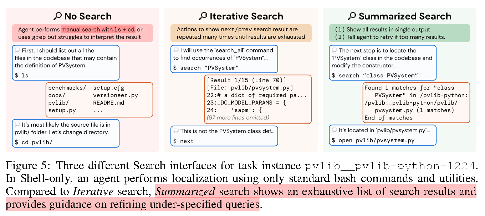

2. 文件查看

   通过`open`命令打开文件，**窗口**一次显示最多100行。代理可以使用`scroll_down`、`scroll_up`和`goto`命令**移动视图窗口**。视图器会显示文件完整路径、总行数、省略的行数以及行号，以帮助代理定位和导航

   >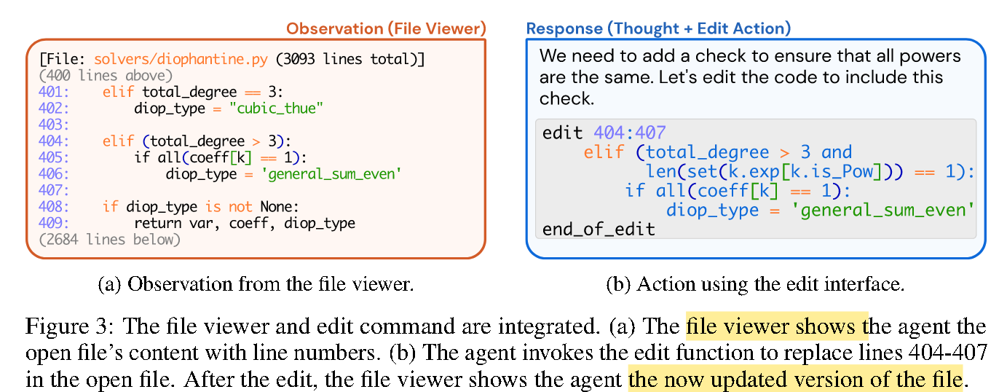

3. 文件编辑

   `edit`命令与文件查看器协同工作，允许代理替换指定范围的行。它支持单步多行编辑，并且在编辑后自动显示更新内容。编辑功能集成了**代码Linter作为护栏**，如果编辑引入语法错误，更改将被丢弃，并向代理显示错误信息和修改前后的代码片段，要求其重试

   >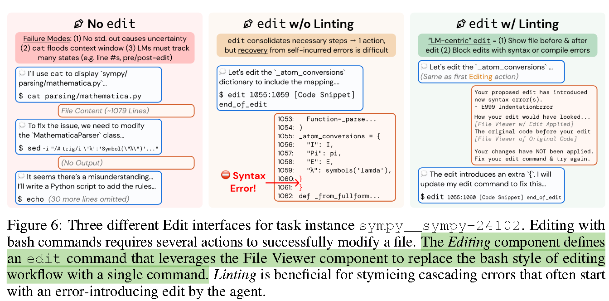

4. 上下文管理

   系统使用信息丰富的提示、错误消息和历史处理器来保持代理上下文的简洁和信息量。**旧的观测结果会被折叠成一行摘要**，以减少不必要的上下文并避免显示过时的文件信息


**实验：**

**数据集：** 

SWE-bench 数据集，其中包括来自 12 个不同常用 Python 包存储库的 2294 个任务实例HumanEvalFix（一种简短的代码调试基准）测试 SWE-agent 的基本代码编辑能力

**模型**主要是 gpt4 和 claude3 opus

**Baseline：**

1. 非交互性的、 基于RAG的
2. InterCode  基于shell-only交互的

**结果：**

在**SWE-bench**和**HumanEvalFix**上均达到了**最先进的性能**

使用**GPT-4 Turbo**作为基础LM，SWE-agent在SWE-bench上实现了**12.5%**的pass@1率，在HumanEvalFix上实现了**87.7%**的pass@1率


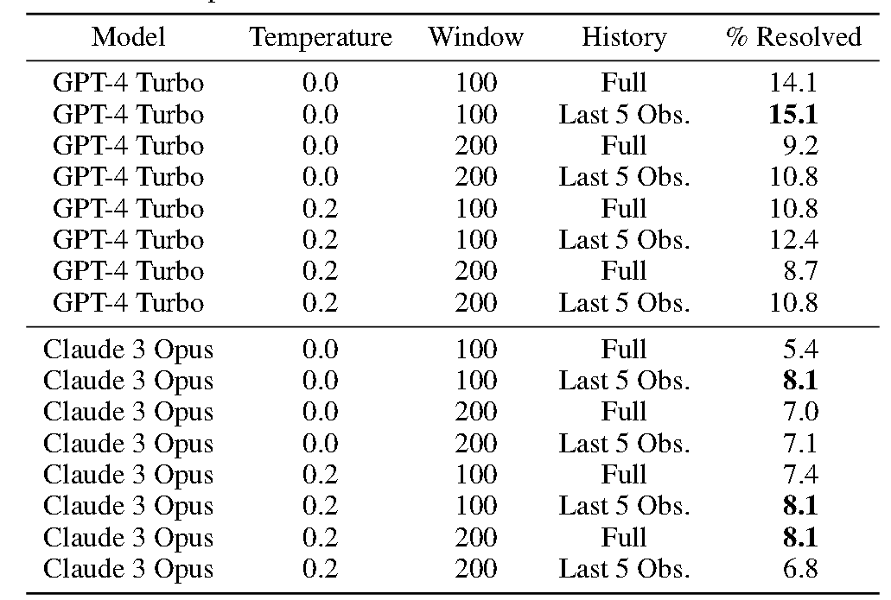


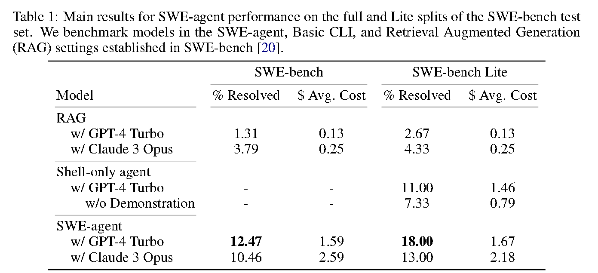

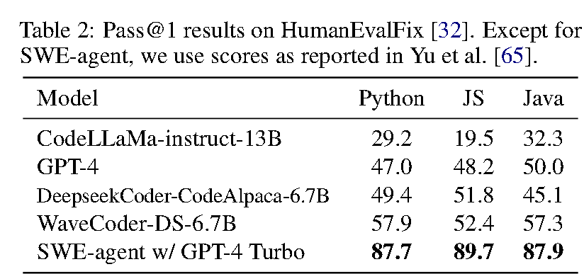


**详细agent设计：**


基本行动轨迹如下图：

首先提供系统提示符、演示（可选）和问题声明。然后，代理依次与环境交互。过去的 observations 可能会被折叠，即截断任何长output，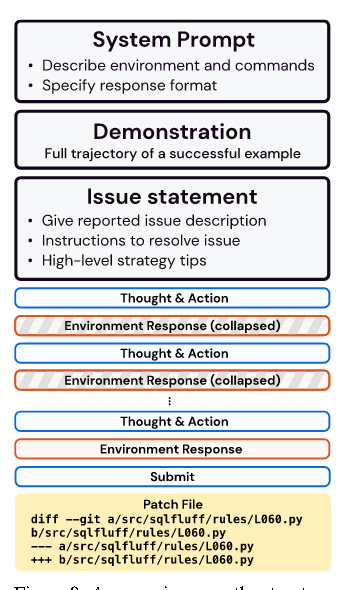


## **Retrieval-Augmented Code Review Comment Generation（没看完）**


25年 6月 arxiv   KAIST


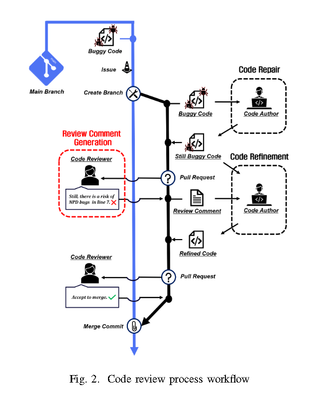


> 这里使用的数据集是  如Tufano等人 的工
>
> 并且它们的预训练模型**采用source code作为模型输入**， **忽略了代码差异（diff）这种特殊格式对理解代码变更**的重要性。
>
>
> 即使用的是  这个预训练论文里  批评的数据集 , “Using pre-trained models to boost code review automation,”


## 想看的文章：


**Tufano** 反复的出现


**Retrieval-Augmented Code Review Comment Generation**


**Fine-tuning and prompt engineering** for large language models-based code review automation


Towards Practical Defect-Focused Automated Code Review


**Towards Efficient Fine-Tuning** of Language Models With Organizational Data for Automated Software Review


[LLaMA-Reviewer: Advancing Code Review Automation with Large Language Models through Parameter-Efficient Fine-Tuning](https://www.semanticscholar.org/paper/d955956378b40b23fa4b34098662c54a3b1fd64d)


[Leveraging Reviewer Experience in Code Review Comment Generation](https://www.semanticscholar.org/paper/80c2175d8fbaf981738111c1ea93c90e1c8c9254)


Harnessing Large Language Models for Curated Code Reviews


Bleu: a Method for Automatic Evaluation of Machine Translation


Reflexion: Language  agents with verbal reinforcement learning, 2023.


About face 3: the essentials of interaction design. 


SWE-bench:  Can language models resolve real-world github issues?


Large Language Models Cannot Self-Correct Reasoning Yet.


CodeBLEU: a Method for Automatic Evaluation of Code Synthesis.


On some pitfalls in automatic evaluation and significance testing for MT


Core: Automating review recommendation for code changes.


AST-Probe: Recovering abstract syntax trees from hidden representations of pre-trained language models. 


-------

**Alexey Svyatkovskiy**

Daya Guo

Nan Duan


Rosalia Tufano

## idea

能不能找个se任务数据集，然后用sft或者rlhf微调下，再做个agent，然后看看效果这种。


方向选择 Predicting the Code Output of the Review Process


review comment generation之前的工作也fun，

并且貌似还停留在将 RLHF引入的地步，  可以试着引入agent rag等。

> 直接造一个agent，使模型自我预测、然后不断优化、最后给出comment
>
> 然后跟这个CORAL_crystal以及前面的DISCOREV对比、包括CORAL_crystal+agent

> 想想能不能加奖励机制，更换奖励模型的设计

> 有的方法只用在了一个模型上，scale 到多个model是不是也是贡献，比如llama->qwen

> 多个comment review 带来一个 code refinement revision
>
> 和
>
> 一个comment review 导致多个code revision
>
> 的研究数据集、研究 是否不足， 这会导致model搞得总是easy work

> multi-agent执行的复杂流程中，能不能收集下数据，然后dpo下


agent可以 感知、 决策、然后行动。

更重要的 充分利用 工具。

将工具与llm相结合，提出agent是一个研究空白。


能否设计一个多个工具加持的， 丰富感知（包括 该代码片段本身重点关注部分以及将会整个仓库产生什么影响,还有自我提取预测结果），充分决策，随后给出最终行动结果， 并且能够利用行动轨迹  不断进化的  agent？


a BM25 retrieval  system retrieves the most relevant codebase files using the issue as the query


---------------


## 2025.7.15


**agentless**

**sonarcube** code smell

langgraph 

场景问题


1. 熟悉review task的场景  **暂定为** 论文Leveraging Reward Models for Guiding Code Review Comment Generation中的 **comment generation task** 和**code refinement task**  **及其数据集**

2. **阅读agentless等 论文，  思考一个agent的具体设计**， 并且可以通过 各种方式 少量coding或non-coding来实现效果

3. 了解 sonarcube 工具、 或其他 传统工具方法， 特别注意提出的方法的 原因， 如适配场景

4. 可以确定对照的baseline， 但更需要先提出一个pipeline

   


---------


## AGENTLESS :  Demystifying LLM-based Software Engineering Agents

**伊利诺伊大学香槟分校**（University of Illinois at Urbana-Champaign，简称UIUC）

24年7月 arxiv

Lingming Zhang

**研究动机：**

近年来，学术界与业界 制造出各种各样的llm agent 用于解决端到端的se task。

这些agent能够 制定规划、使用工具、 执行command、 并且从环境中得到feedback

然而，**目前发展出的llm 具备的能力有限，而这些 agent方法 又较为复杂**，

因此我们认为： 我们并不一定要使用这些复杂的se agent。

进一步的，提出**Agentless**。（**故意不允许llm使用工具和制定plan**）

**agentless仅仅由简单的三个阶段组成： 定位、修复、patch验证。**

在swe-bench lite上达到32%正确率、性能最好（open source）、并且low cost

agentless已被gpt-4o和o1采用。

此外，本研究还手动清理了swe-bench lite数据集。重新整理为**SWE-bench Lite-S**

> **数据集细节：** swe-bench每条problem 包括一个github issue 以及对应 python repository
>
> task 是去修改仓库代码来解决issue，或者修bug或者引入新特性。
>
> swe-bench lite(300 problems)经过清洗并且更专注于bug fix

https://github.com/OpenAutoCoder/Agentless


**方法细节：**

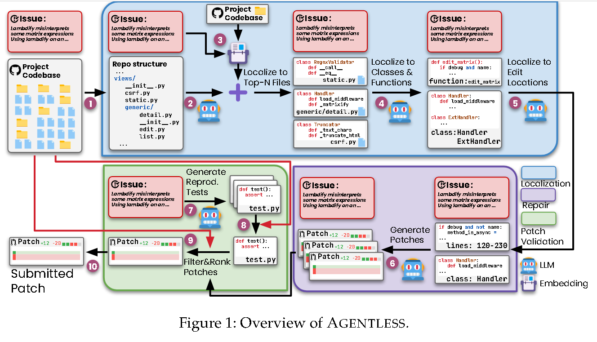

一、定位

文件级别定位

1. 构建repo structure，仅仅包含目录文件结构 （类似 linux tree命令输出）

2. 一方面要求llm 仅仅根据这个 repo structure 以及 issue 挑出 top-n 可疑高价值文件名
3. 另一方面根据structure prompt llm去除 不相干文件后，将剩余文件 切割成chunk并且与issue desciption经过 embed后做 余弦相似度匹配，  最后选出 一系列文件名

3.5. **将上述两个输出结合** （后面实验证明 整合后效果更好更显著）

相关元素定位

4. 从得到的高价值文件中 提取简洁表示（如下图），  一下子将所有文件的skeleton format送入llm，要求其提供解决issue 所需要的相关class和function

   >每个文件保留  类名、函数名、变量声明、还有类和module级别的comment
   >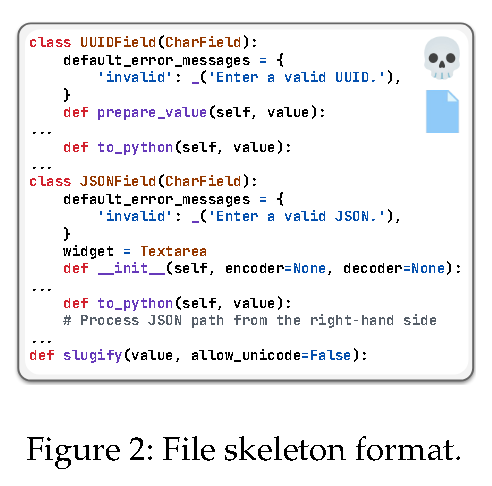


>这里简洁的 agent computer interface （ACI）设计 concise representation, 对 该过程有较好影响

>?结构化输入 对llm的 影响   相关有论文吗
>
>大语言模型使用Json格式输出会降低模型性能吗？

定位具体编辑区域

5. 将上述相关class、function及其具体内容 提供给llm，要求llm给出具体需要edit的行号、function以及class


二、修补

6. 根据每一个待编辑区域提供的具体行号区间， 增加一个context window。 将多个待编辑区域通过 ... 拼接到一起， 送入llm， llm根据issue生成 多个 diff格式的patch(而**不是直接替换**)。生成先是通过greedy然后是 hight temperature

   >Search/Replace format包含原来的origin内容，以及目前生成的replace 代码片段
   >
   >这种diff格式能生成小的代码片段，更精确可信并且开销小
   >
   >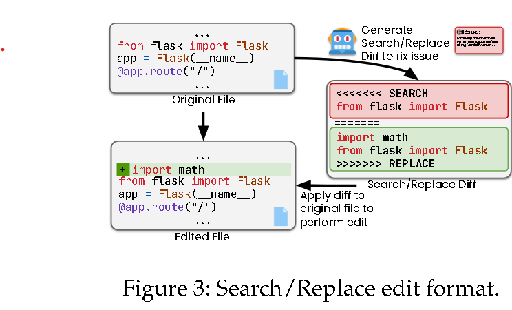


三、补丁验证

reproduction test generation

7. 由于数据集提供的仅仅是  codebase和issue description， **没有bug-trigging test。因此需要one-shot prompt llm去生产一个 test file， 该文件不仅 重现issue， 而且能用于后续修补的测试**。同样生成多个候选
8. 执行所有候选的test file并且**过滤出 真正重现了issue的test file**， 最后normalize test（即统一去掉注释、额外空白等）并选出 出现次数最多的test file作为最终结果。

patch selection

9.  由于**修补issue后程序不能影响原有设定， 所以率先进行回归测试**（即原有功能不能受到影响），

​	由于并非codebase所存在的所有测试都需要运行，所以首先由**llm 去除**掉一些 regression test。

​	agentless将 持有最低regression failure的patch， 然后进行 reproduction test。筛选出issue resolved的patch，由于reproduction 是llm写的可能有误，所以若没有patch能够通过reproductin test则忽略该步骤。

​	最后通过majority voting执行re-rank，具体来说：将patch标准化(将old和new code解析为ast->然后反解析为标准格式源代码 不含注释等)，最后提供diff格式


> 话说生成代码后，可以接着生成test case用于检查
>
> 那用到生成文本方面，怎么做自我检查呢？简单的用llm?还是基于belu分数是否还行?
>
> 或者 文本相似度？
>
> ### **3. 混合方法（推荐）**
>
> 结合**LLM评估** + **量化指标** + **外部工具**，例如：
>
> 1. **首轮过滤**：用BLEU/ROUGE筛除明显低质量文本。
> 2. **事实检查**：调用知识库API验证关键事实。
> 3. **LLM自评**：让LLM从流畅性、逻辑性打分（如1-5分）。
> 4. **人工规则兜底**：如敏感词过滤、语法树检查。


 

**实验：**

**dataset：**  swe-bench lite

**实现细节：**

采用**GPT-4o** (gpt-4o-2024-05-13)， query时采用greedy解码，sampling时采用0.8的temperature。

用LlamaIndex框架实现的 embedding-based retrieval，

用的OpenAI’s **text-embedding-3-small**，chunk size是512，chunk overlap是0


对每个issue，首先定位top-3 价值文件，然后到不受严格数量限制相关元素，

然后采样4个 edit location，context window size是 10行

generate 10 patches (1 greedy and 9 samples)

reproduction test也是总共40个（但1 greedy and 39 samples)

首先跑一次原始repo测试，通过的作为回归测试集

**baselines：**

26种agent-based approaches

一个 RAG using BM25

对于基线工具，我直接使用来自官方排行榜 [45] 或工具的官方论文/存储库的报告结果。

**Metrics:**

1)% Resolved:

2)Avg. $ Cost

3)Avg. # Tokens:

4)% Correct Location: 

方法产生的patch是否覆盖真实的patch区域

3种粒度 file function line


**结果：**

1）**性能：**

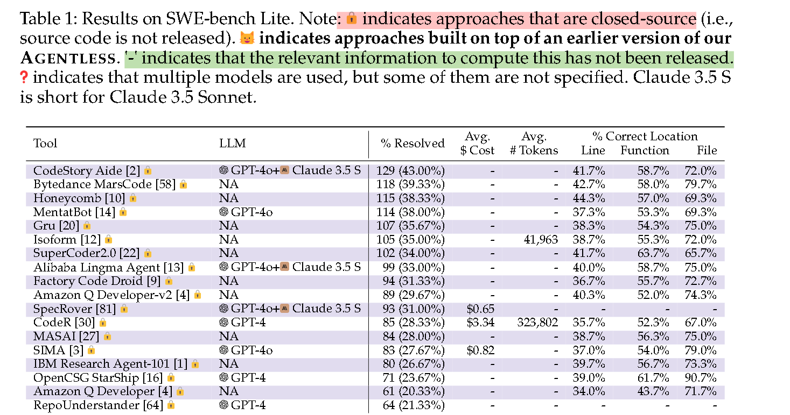

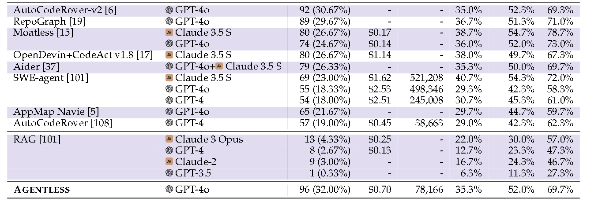


AGENTLESS 能够解决 **300 个问题中的 96 个 （32.00%）**。虽然这不是 SWE-bench Lite 上解决的问题百分比最高，但与之前基于代理的方法相比，AGENTLESS 具有极强的竞争力，同时使用了更简单的设计和整体技术。

**开源方法中，性能最好**


2）**Unique issues fixed.**

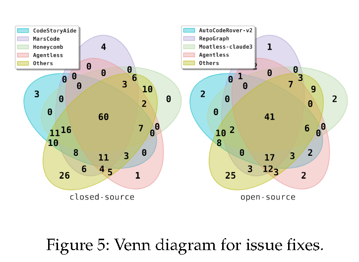


3）**Localization performance.**

我们在此处指出，可以在与实际不同的位置修复错误，但与实际补丁进行比较仍然可以作为近似度量。

Table 1可见

保持有一定竞争力


**消融实验：**

1. 定位

Contains GT即  此时包含 ground truth的 patch区域

LoC即 目前包含的code行数  code of line

粗体表明 default setting


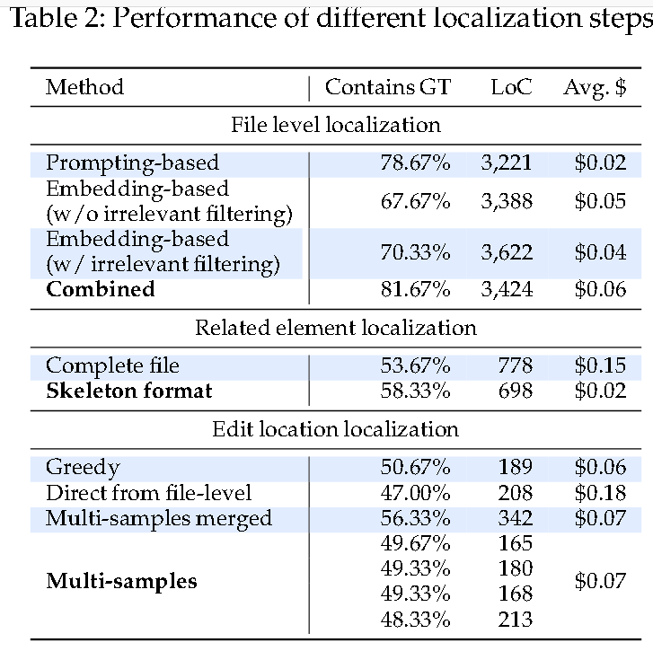

  **文件级定位**：排除不相关文件夹的嵌入式检索方法更具成本效益和效率。基于提示和基于嵌入的检索方法可以**互补**，将正确的文件定位率提高到 **81.7%**。

  **相关元素定位**：使用**骨架格式**（一种**简洁的文件表示**，包含类、函数声明头和注释）比提供完整文件内容更能有效定位相关位置，同时显著降低成本和提高准确性，**因为 LLM 难以处理长上下文**。

  **编辑位置定位**：分层定位设计非常重要，直接从文件级定位到编辑位置会导致成本和性能下降。通过多次采样编辑位置，并在后续阶段独立处理这些位置，可以最大限度地提高修复性能，因为**不同的位置集可能涵盖不同的真实位置并提供不同的上下文。**


2.Repair

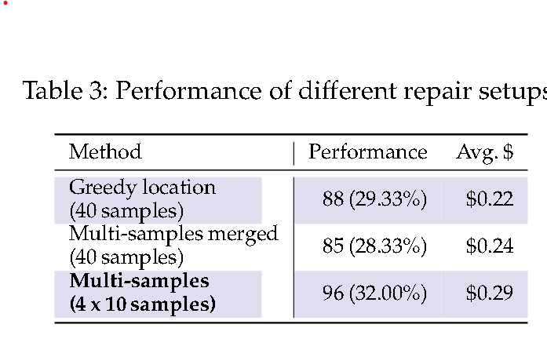

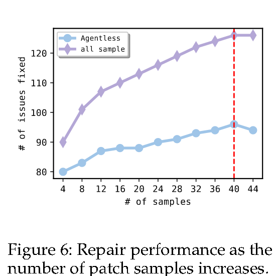

 增加候选补丁采样数量可以提高修复性能，但大约在 **40 个样本**后性能趋于平稳

3.Patch validation

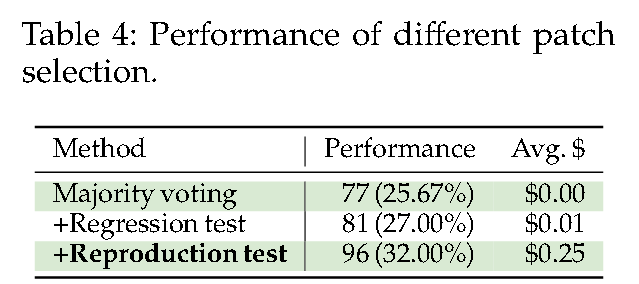

 **补丁选择**：仅使用多数投票可以解决 77 个问题。加入现有回归测试过滤可以提高到 81 个。**最显著的性能提升来自于结合生成的复现测试进行过滤**，最终使 AGENTLESS 达到 96 个修复


## **review comment generation task** 和**code refinement task**  数据集


https://github.com/microsoft/CodeBERT/tree/master/CodeReviewer

https://zenodo.org/records/6900648


下面是一个数据示例：

```
Demo data:
{
    "old_file": "import torch",  # f1
    "diff_hunk": "@@ -1 +1,2 @@\n import torch\n +import torch.nn as nn",  # f1->f2
    "comment": "I don't think we need to import torch.nn here.",  # requirements for f2->f3
    "target": "import torch"  # f3
}
```

- Comment Generation: **input with "old_file" and "diff_hunk"**, we need to generate a comment for the change. **An expected comment is as the "comment" above.**
- Code Refinement: **input with "old_file", "diff_hunk", and "comment"**, we need to change the code again according to the review comment. For the above example, as the comment indicated we don't need *import torch.nn*, we just delete this line of code here.


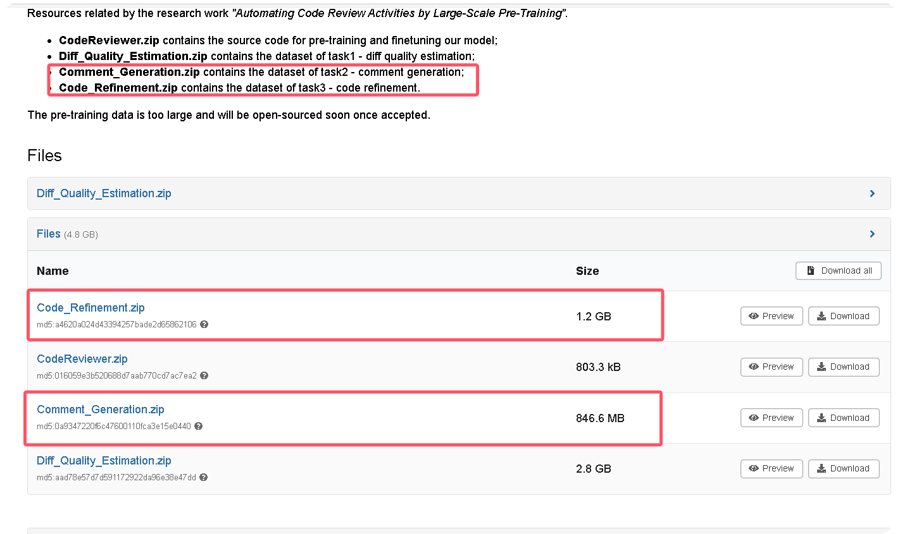


> 
>
> class RootPathHandler(BaseTaskHistoryHandler):
>     def get(self):
>         self.redirect("/static/visualiser/index.html")
> 	def head(self):
>     	self.set_status(204)
>     	self.finish()
>
> 
>
> @@ -273,6 +273,10 @@ ：
>
> - -273,6 ：原文件中，修改起始行为 第273行 ，涉及 6行代码 （被修改/删除的旧代码范围）。
> - +273,10 ：修改后文件中，新代码起始行为 第273行 ，涉及 10行代码 （新增/修改的新代码范围）。


Code_Refinement/ref-train.jsonl

150406

[**'old_hunk', 'oldf'**, 'hunk', **'comment'**, 'ids', 'repo', 'ghid', 'old', 'new', 'lang']

Code_Refinement/ref-test.jsonl

 13104

['old_hunk', 'oldf', 'hunk', 'comment', 'ids', 'repo', 'ghid', 'old', 'new', 'lang']

Code_Refinement/ref-valid.jsonl

 13103

['old_hunk', 'oldf', 'hunk', 'comment', 'ids', 'repo', 'ghid', 'old', 'new', 'lang']


数据是否有关联性？

该数据集中Comment_Generation和Code_Refinement**没有强关联性**。

通过(patch,msg)与 (old_hunk,comment)进行比对，发现基本没有相同的

> 直接使用Code_Refinement数据集就行了，
>
> 刚好'old_hunk', 'oldf', 'hunk', 'comment'!!!
>
> 


Comment_Generation/msg-train.jsonl

117739

[**'oldf', 'patch', 'msg'**, 'id', 'y']

Comment_Generation/msg-test.jsonl

10169

['patch', 'y', 'oldf', 'idx', 'id', 'msg', 'proj', 'lang']

Comment_Generation/msg-valid.jsonl

10319

['patch', 'y', 'oldf', 'idx', 'id', 'msg', 'proj', 'lang']

发现二：  CodeReviewer 中 valid与 test也有238条完全重复的patch

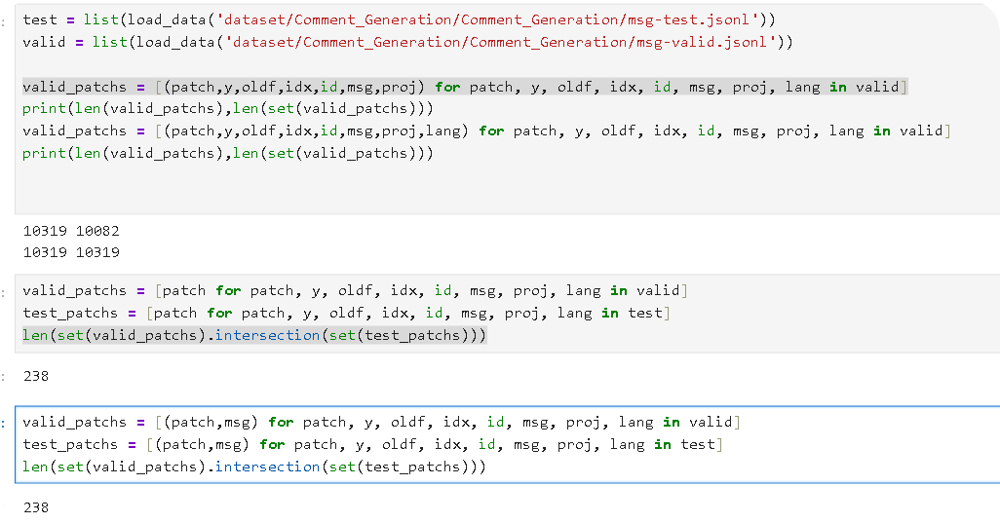

这个y字段是什么意思？


## BLEU a Method for Automatic Evaluation of Machine Translation

IBM ACL 2002

> bleu 提出的主要思想是什么？
>
> 各级bleu分数 分别代表 什么样的人工水平？
>
> 代码   准确的代码 ？


**简介：**

人工评估 机器翻译（MT）耗时耗力，

本文提出一种自动评估机器翻译的方法，

该方法 迅速、便宜、语言无关， 与人工评估高度相关，并且每次运行的边际成本很小。


**具体方法：**


机器翻译需要与人类翻译对齐（合情合理）。机器翻译越接近于专业的人类翻译，它就越好。

他们设计的评估系统具备两个特点：首先，评估能输出数值；其次，评估需要一定量的人类参考文本来作为机器翻译的“参考答案”。


受到语音识别社区 的 word error rate启发，

适用于翻译任务时 运行 word的选择和顺序不同，

**bleu**使用 **可变长的短语 的匹配度 的加权平均值**来衡量。 

*即使用可变长度短语作为模板 来匹配 参考翻译句子集合，并求加权平均值得出结果。*

> bilibili的一个清楚易懂的讲解
> https://www.bilibili.com/video/BV1Jb411W7ah/?spm_id_from=333.337.search-card.all.click&vd_source=39767bfbc4ae772d0c2f8d8b32b54ce6
>
> 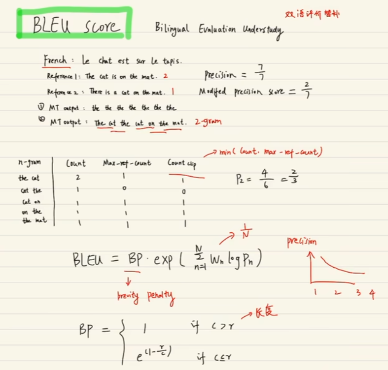

1. Modified n-gram precision

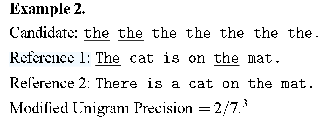

以该例子计算：

对于1-gram， 计算了candidate中 the的1-gram为7，

然而如果简单的认为the在参考译文中出现过，然后用 7除以candidate句子的长度的话，精确度是 7/7=1

因此，需要 额外计算一个 t**he在reference的每个句子中出现的最大数目**， 然后用这个数目做下裁剪，

这里 reference 1 中the的数目最多，是2， 因此 modified 1-gram最后为 2/7

至于modified 2-gram则为0


2. 多句衡量。

**一个源句子可以翻译成多个目标句子**，在这些句子中，我们滥用术语并将相应的目标句子称为 “句子”。

我们首先逐句计算 n-gram 匹配项。

接下来，我们将所有候选句子的 n-gram 裁剪，计数相加，

并除以测试语料库中候选 n-gram 的数量，以计算修改后的精确率分数

>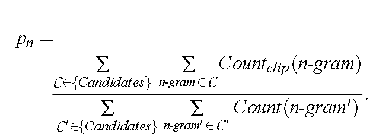


3. 指标的可靠性衡量

为了验证修改后的 n-gram 精度是否区分非常好的翻译和糟糕的翻译，

我们计算了（好的）人工翻译和标准（差的）机器翻译系统的输出上的修改精度数字，

对 127 个源句子中的每个句子使用 4 个参考翻译。平均精度结果如图 1 所示。

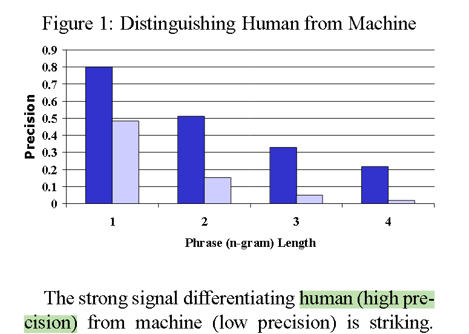


为此，我们获得了由源语言（中文）和目标语言（英语）均不精通的人进行的人工翻译。

为了进行比较，我们获得了由英语为母语的人对相同文档的人工翻译

我们还获得了三个商业系统的机器翻译。、

这五个“系统”（两个人工和三个机器）与 两个专业人工翻译作为参考 进行评分。

平均的 modified n-gram 精度结果如图 2 所示。

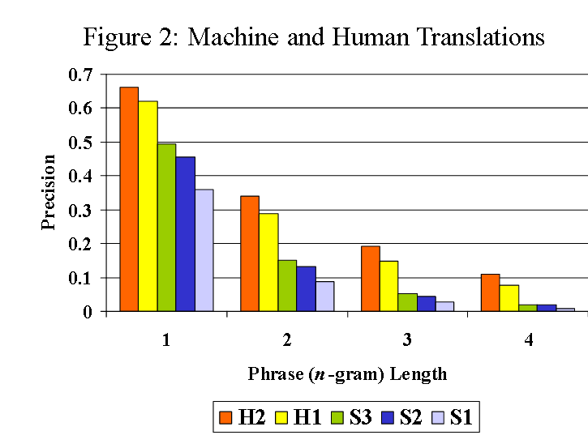


值得注意的是，**`这与人类裁判分配给这些 “系统” 的等级顺序相同`**，我们将在后面讨论。


4. 将 n gram结合为 bleu

如图 2 所示，**修改后的 n-gram 精度大致呈指数衰减**:

修改后的 unigram 精度远大于修改后的二元语法精度，而修改后的二元语法精度又比修改后的 trigram 精度大得多。

**一个合理的平均方案必须考虑到这种指数衰减;修改后的精度的对数的加权平均值满足此要求。**

实验上，与单母语人类评估最接近的  最大 N 元语法阶数为 4，而3-gram和5-gram得到的结果相当。


5. 长度

候选翻译不应太长或太短，评估指标应强制执行此规定。

在某种程度上，n-gram 精度已经实现了这一点。


如果某个单词在候选翻译中出现的频率高于其最大引用计数，则修改后的精度会受到惩罚。这会奖励使用单词的次数与需要的次数相同，并惩罚使用单词的次数超过在任何参考文献中出现的次数。--> 惩罚真实词过多


N 元语法精度会惩罚候选词中未出现在任何参考翻译中的虚假词。--> 惩罚虚假词过多


然而，仅修改后的 n-gram 精度并不能强制执行适当的翻译长度，如下面简短而荒谬的示例所示。

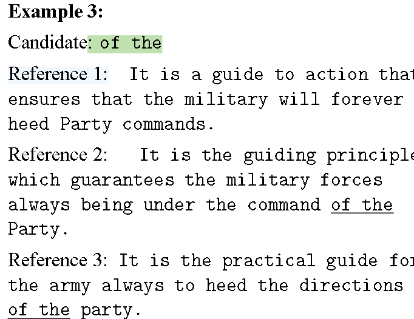


因为与适当的长度相比，

这个候选者太短了，所以得到了夸大的precision：修改后的一元语法精度是 2/2，修改后的二元语法精度是 1/1。

6. 短句惩罚

比参考文献更长的候选翻译已经受到修改后的 n-gram 精度度量的惩罚：没有必要再次惩罚它们。

**虚假词或真实词过多 均已经得到惩罚**

因此，我们引入了一个乘法 短句惩罚因子。

仍然存在一个考虑因素：如果我们**逐句计算简洁性惩罚并平均惩罚，那么短句的长度偏差将受到严厉的惩罚**。**相反，我们计算整个语料库的简洁性惩罚**，以便在句子级别允许一些自由度。

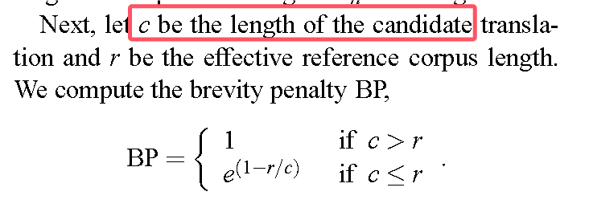

最后 Bilingual evaluation understudy 如下：

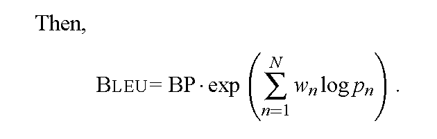

> 由该式子可见，  BLEU 指标的范围为 0 到 1。
>
> 那么请问  Leveraging Reward Models for Guiding Code Review Comment Generation（PPO）中 8.多 是怎么来的？百分数吗？

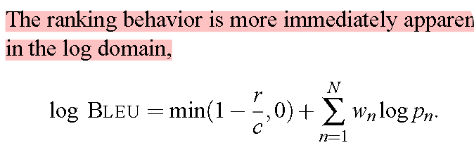


7. 传统的、伴随precision的 recall是难做的

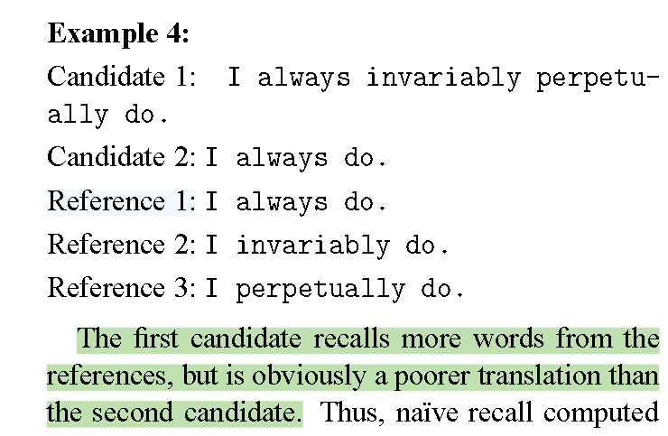


**实验评估 BLEU**：


The first group, called **the monolingual group,** consisted of **10 native speakers of English.** 

The second group, called **the bilingual group,** **consisted of 10 native speakers of Chinese who had lived in the United States for the past several years.**

所有评委都使用同一个网页，并以相同的顺序看到句子对。

**他们对每个翻译的评分从 1（非常差）到 5（非常好**）。单语组仅根据翻译的可读性和流利度做出判断。

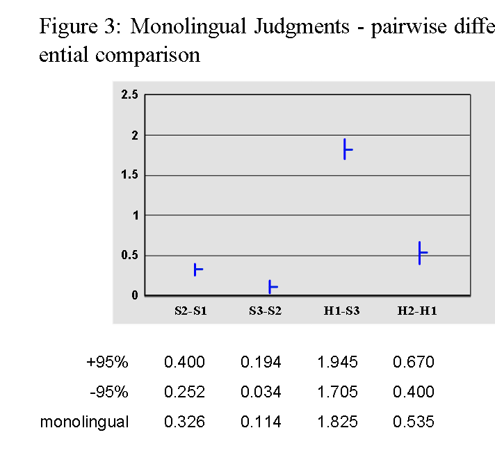

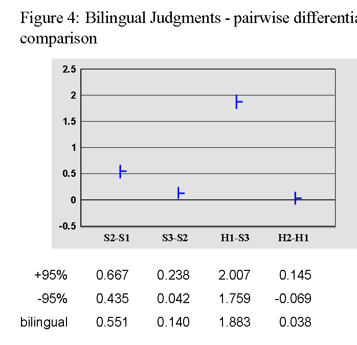


最后是 bleu与human的对比图

下图**按顺序其相关系数(correlation coefficient)分别为0.99  0.96**

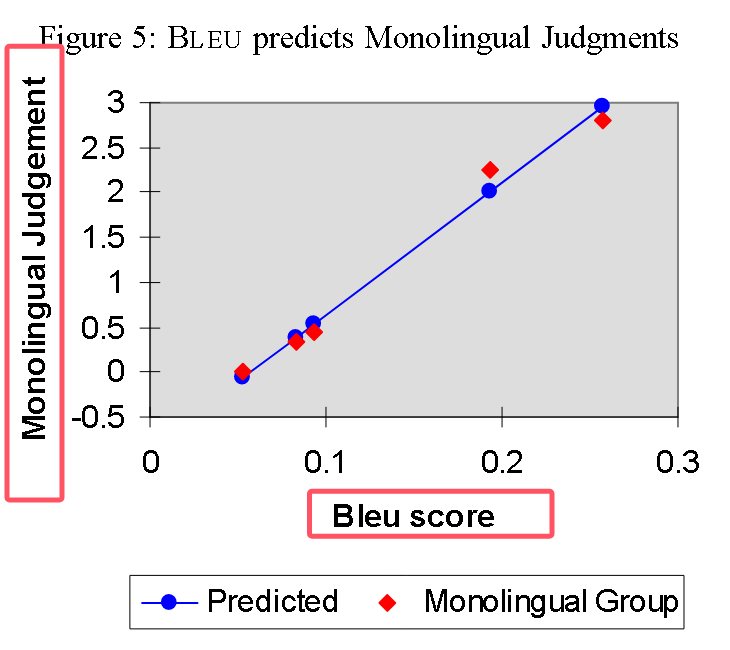

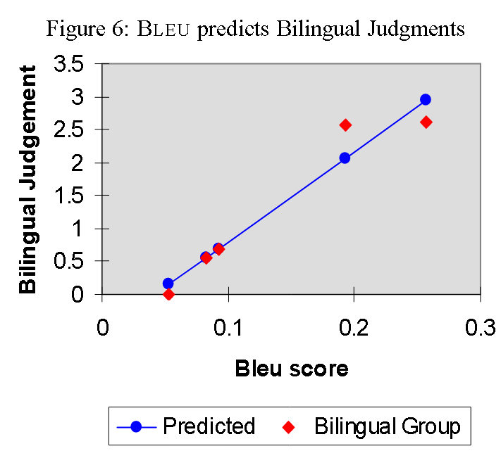


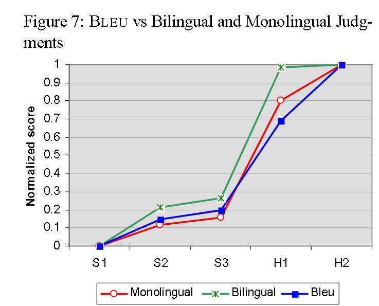


> 图看的不是很懂，但是会计算了


### BLEU code 及 分数直觉


简要介绍bleu的库

https://blog.csdn.net/qq_38515845/article/details/115597878


> nltk （natural language toolkit）库使用，以及简单的bleu 分数直觉
>
> https://machinelearningmastery.com/calculate-bleu-score-for-text-python/
>
> 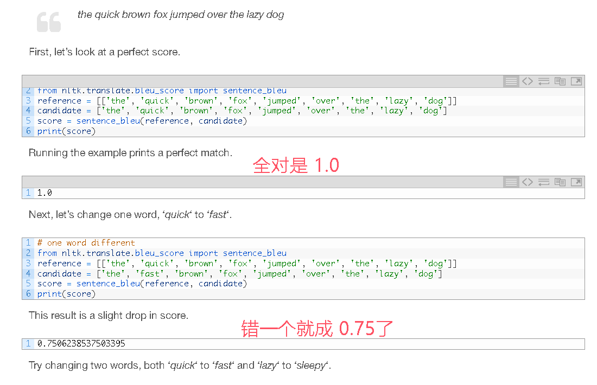
>
> 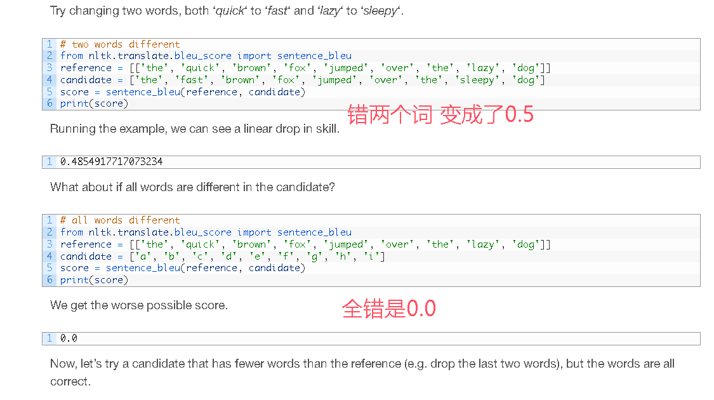
>
> ​     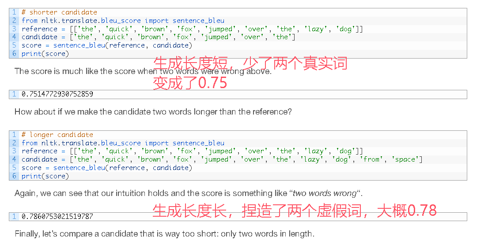
>
> 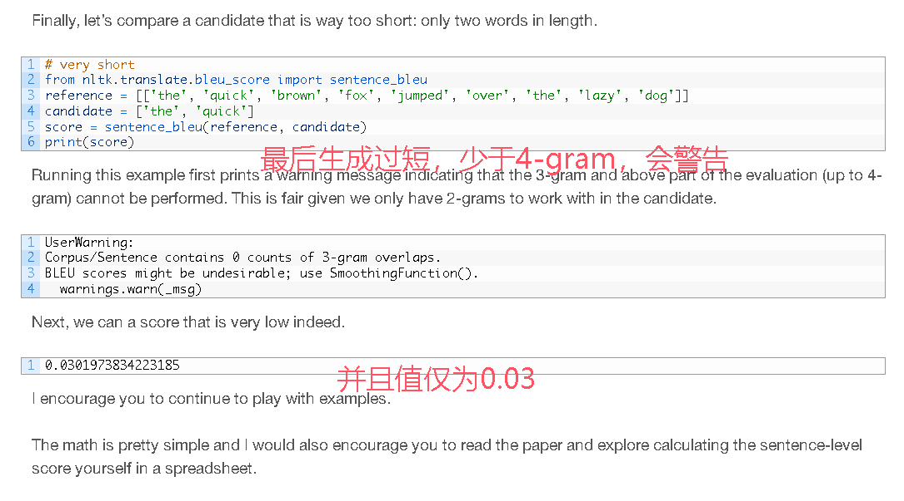


论文leverage RL 到review中的实现, 使用了nltk库，使用的是1972年版本，MOSE5

$Id: bleu.py 1307 2007-03-14 22:22:36Z hieuhoang1972 $ 

https://github.com/microsoft/CodeBERT/blob/master/CodeReviewer/code/evaluator/bleu.py

> 注意： 
>
> 模型训练的时候使用的 自己的tokenizer
>
> 然后评估bleu时，这里 decode为 natural language，
>
> 最后 nltk库的nltk.wordpunct_tokenize进行分词评估，
>
> 该函数对英文将分为一个一个词，对中文则一个一个字。


> **最后使用nltk库自带的bleu评估得了**
>
> huggingface官方的evaluator自带有bleu计算库
>
>
> 如果langchain自带的话，后续可以更换， 


> 对于bleu超过10的问题，暂且认为是 百分数， 简单让llm生成一个review看下bleu分数


Adaptive Multi-Agent AI Framework for Real-Time Energy Optimization and Context-Aware Code Review in Software Development

2025 5th International Symposium on Computer Technology and Information Science (ISCTIS)


## CrystalBLEU: Precisely and Efficiently Measuring the Similarity of Code

ASE 2022     University of Stuttgart Stuttgart, Germany

> 不能用pass@k评估的code应该怎么评估？

**简介**:

近年来预测源代码的工作很多，大部分采用BLEU作为评估指标。

BLEU，基于n元语法，最初是为了自然语言翻译所提出。

然而，在自然语言和编程语言间存在着关键的不同，

仅仅简单的不加修改的将BLEU应用于代码评估是 不太恰当的。

如下例所示：

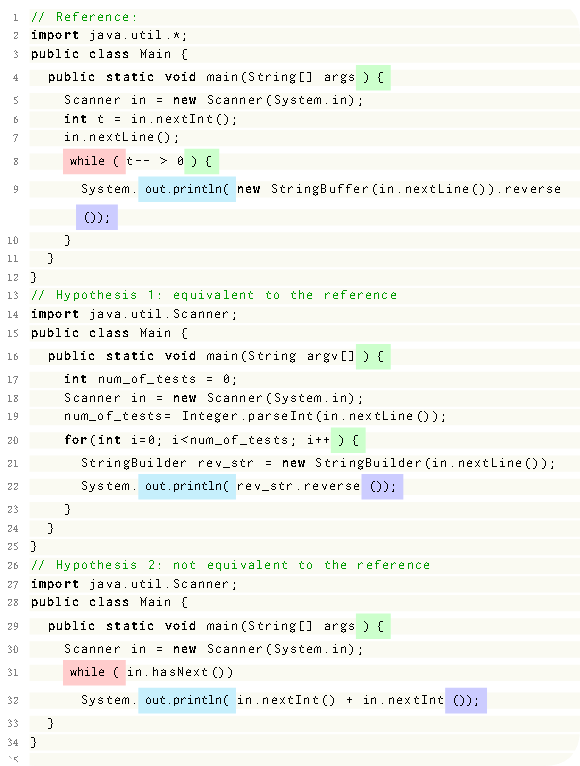

参考示例 功能是首先输入多少个字符串，然后将这些字符串反转输出

**假设1成功地实现了该功能**，**假设2则**是实现了  n对元素的加法。

但是，**假设1的BLEU分数是0.48，而假设2的确是0.55。**

显然BLEU无法准确评估这个例子。

其原因在于：

1. 与自然语言相比，编程语言在语法上是冗长的，有限制的

   其语法通常强制多个标记一起出现，如if()

​	语法规定了在完全不相关的代码示例中共享的各种 n-gram

2. 现代编程习惯 以及 广泛使用的api

如 out.println(

这些shared n-grams是琐碎微不足道的，但使评估产生了严重的偏移。

记作 trivially shared n-grams。

用同一种编程语言编写的代码示例 将天然具有trivially shared n-grams，不论两个代码示例在**语义上是否相似**。

> 由此，提出crystalBLEU
>
> 基本思路是  在计算BLEU前，去除掉这些trivially shared n-grams

对于上例，

**假设1的CrystalBLEU分数是0.24，而假设2的确是0.0。**


> 之前有两项相关工作， 分别是RUBY 和 CodeBLEU
>
> 不过它们均利用的ast， 只有在code能够转换为ast时才能计算
> 对于代码片段，则无能为力

在处理code时，将整个source code作为一个sentence 用BLEU计算


**CrystalBLEU具体方法：**


1. 为了验证我们的假设，即trivially shared n-grams 是一种特定于编程语言的现象，我们提出了三个实验。


Brown dataset和 java small dataset


实验一：最频繁的n gram

如下图，Java 中最频繁的百分比明显高于英语，这表明相较于自然语言， 常见的 n-gram 在 Java 中贡献了更大的份额。

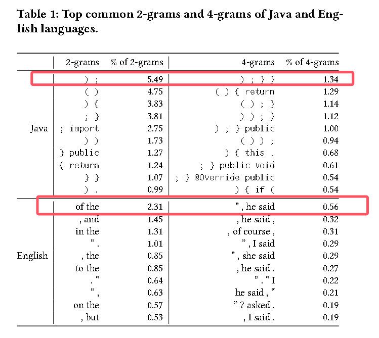

实验二： 频繁n gram的分布

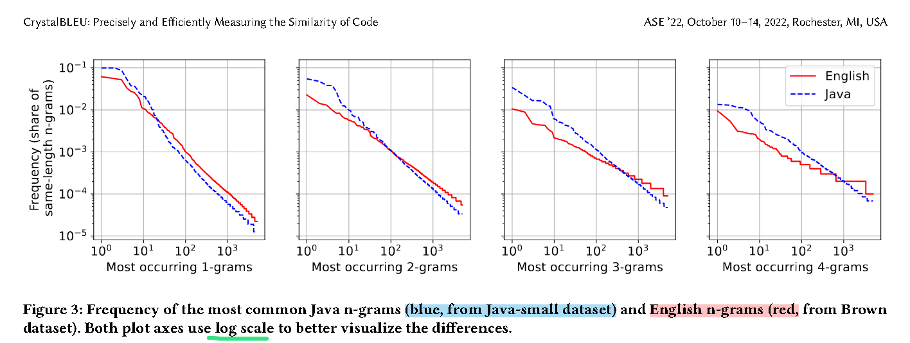

编程语言中一些出现频率最高的 n-gram 比自然语言中出现次数最多的 n-gram 要频繁得多，但对于频率较低的 n-gram（即尾部）则相反


实验三： 随机选择相同语言的代码或文本示例，并计算它们共享多少个 n-gram，如图 4 所示。

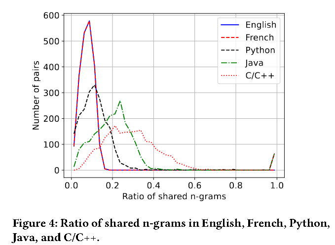

可见 两个随机的程序 共享更多的n gram ，相较于 两个随机的自然语言文本


BLEU一般 不同频率的n gram对最终分数的贡献相同。

因此，这些 不相干的代码例子中的 trivially n gram越多，最终BLEU分数 能表达的 语义相似度的 准确性就越少


2. distinguishability  一个用于衡量  衡量代码相似度代表语义相似度程度的评估指标   的准确度。

利用了这样一个事实，即与自然语言相比，代码通过其**执行语义**为语义等效性提供了明确的预言机。

直观地说，对于具有相同执行行为的代码示例，指标应报告较高的相似度，而对于具有不同行为的代码示例，指标应报告较低的相似度。

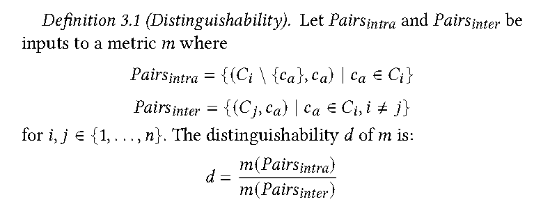

好像没说具体计算过程，不过对crystal 影响不大， 暂时忽略


**3.crystalBLEU 算法**

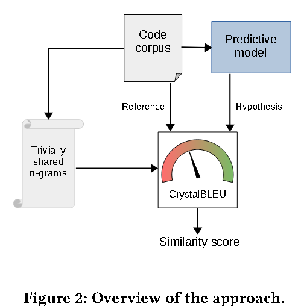

3.1 识别 trivially shared n-grams

在代码语料库中计算n-grams时，同时考虑其频率

然后将 k most common n-grams放在一个集合S中,k作为算法的参数

3.2 考虑这些 shared n-gram ，然后计算修正后的BLEU

简单来说，有两种思路，

一种是直接去除这些 trivially shared n-grams

另一种是 根据频率加权，

经过实验，最终需要关注 **直接去除**的方法 

> 最终实现扩充了 nltk库，
>
> 相较于原始算法，仅仅是多了一个 直接去除trivially shared n-grams的步骤， 伪代码只多了一行


**实验评估：**

**baseline:** BLEU CodeBLEU

**dataset:**

​	 ShareCode: 语义相等的人类手写code， 来源于编程竞赛

​	 BigCloneBench: 1.7 million java程序对，标签是clone或non-clone

​	  Concode： 利用nl生成java code的数据集

**results:**

1. CrystalBLEU 在区分等效和非等效代码对方面更有效

首先,在bigclonebench上用不同指标测量

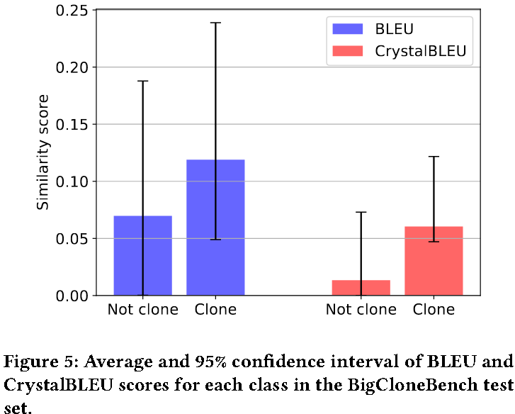

CrystalBLEU 的非克隆和克隆之间的相对差异高于 BLEU。

CrystalBLEU的置信区间重叠较少，这是其较高的可区分性的结果


其次，利用这些指标计算得分， 根据一个阈值分类，得到：

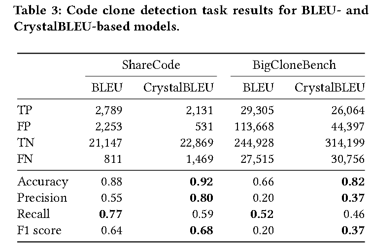

比较 BLEU 和 CrystalBLEU 表明，

CrystalBLEU 能够更好地区分非等效对和等效对，从而转化为具有更高准确性和更高 F1 分数的分类器。


2.CrystalBLEU 可以避免误导性结果

在比较预测代码的不同技术时，由trivially shared n-gram 引起的噪声可能会影响 BLEU 并导致误导性结论。


我们使用 Concode，它使用神经模型从自然语言文本生成代码。

作为 Concode 的假设竞争对手，我们创建了一个人工虚拟模型，其设计看起来与 Concode 一样好，但实际上生成的代码明显比 Concode 差。

我们假设这个虚拟模型知道预期代码中有多少个标记、一些正确的标记以及该域中 trivially shared n-gram。

***该模型生成其输出如下：直到预测的长度短于正确解，以 82% 的概率在预测的开头添加一个trivially shared n-gram。在概率 1 − 0.82 的情况下，将正确解中的标记附加到预测末尾。***

**这意味着虚拟模型正在生成代码，在大多数情况下，这些代码从大部分无意义但常见的标记开始，然后是一小段正确的代码。**

由于虚拟模型预测的大多数代码仅由trivially shared n-gram组成，因此其**预测显然无法成功**预测给定自然语言描述的代码。


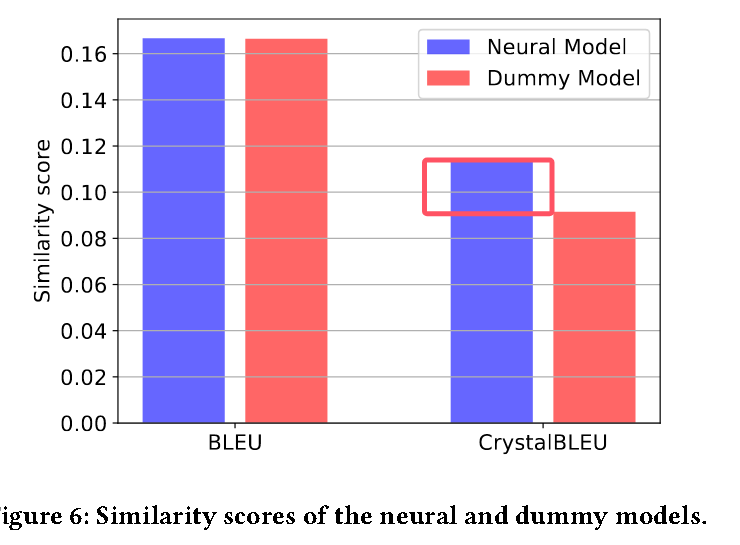

如图，两种模型的 BLEU 分数非常相似，即 BLEU 可能会导致两种模型同样成功的错误结论。相比之下，CrystalBLEU 显示神经模型比虚拟模型好 1.2 倍。

> On some pitfalls in automatic evaluation and significance testing for MT
>
> 执行了一个statistical test来验证BLEU和CrystalBLEU的差异影响
>
> 将原假设设置为 “虚拟模型与神经模型一样好”，我们得到 BLEU 的 p 值为 0.22，CrystalBLEU 的 p 值为 0.01。这拒绝了 CrystalBLEU 的零假设
>
> 这表明 CrystalBLEU 有助于区分这两个模型，而 BLEU 表明它们是相同的。


3.CrystalBLEU 与 BLEU 一样高效，可以在短时间内对代码相似性进行大规模评估。

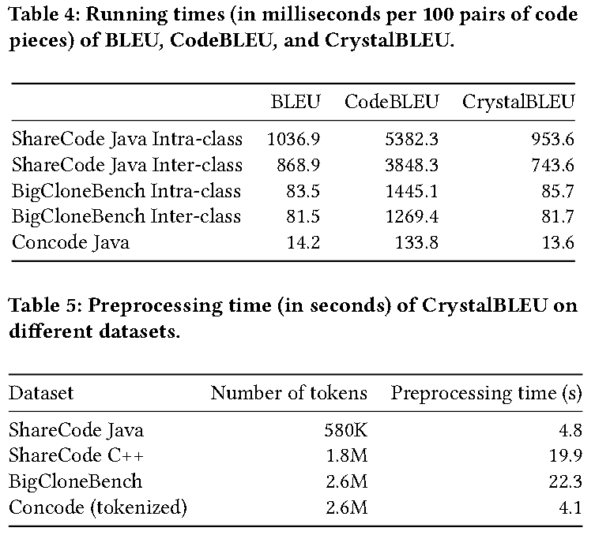


4. 参数 k 会影响 CrystalBLEU 的结果，但合理值的范围相对较大

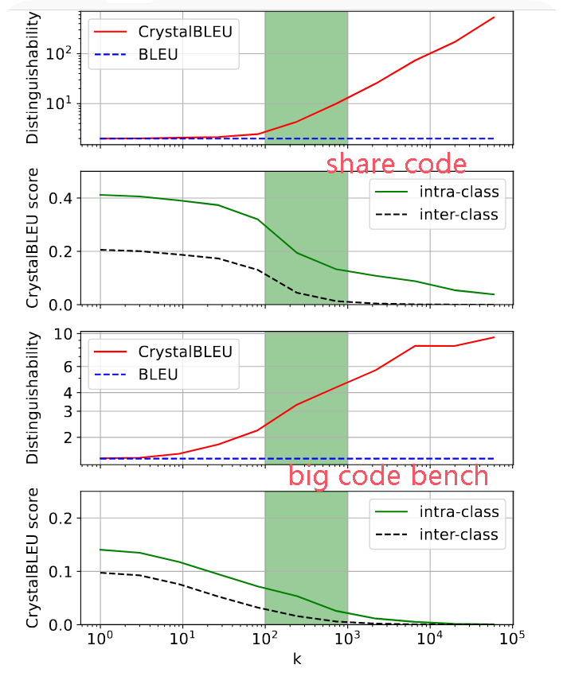

实验表明，CrystalBLEU 在具有 100 ≤k ≤ 1000 的完整 Java 和 C++ 程序上具有最佳性能

inter-class间分数的主要下降也在该范围内, 不同语料库的k选择也可以通过这种方式来选取


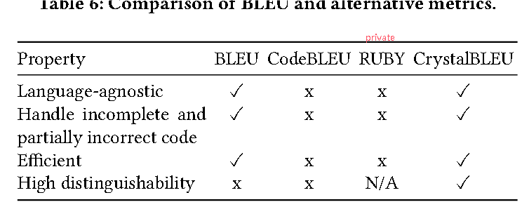


### code

https://github.com/sola-st/crystalbleu


## Improving the Learning of Code Review Successive Tasks with Cross-Task Knowledge Distillation. 

https://github.com/OussamaSghaier/DISCOREV

通过**跨任务知识蒸馏**改进代码审查连续任务的学习

**24年 FSE**

 

**研究动机：**

**传统的代码审查任务自动化方法通常将review任务孤立地处理**，

而本文明确考虑了**三个主要代码审查任务之间的相互联系**：质量估计、注释生成和代码优化。

**这些任务共享知识**，因为一个任务的输出用作另一个任务的输入。注释生成任务生成的注释馈送到代码优化任务中，而后者生成的修订后的代码用于质量评估任务，以确定是否需要进一步审查。

从本质上讲，注释生成涉及描述问题以指导后续的代码优化阶段。反过来，代码优化包括进行必要的代码调整，以与审阅注释保持一致并通过质量评估阶段。

**由此：**

**提出DISCOREV (cross-task knowledge DIStillation for COde REView)**，它结合了两个模型，分别针对两个相关任务进行了联合训练。

此架构**应用于成对的代码审查任务**，特别是注释生成/代码优化和代码优化/质量估计。


**DISCOREV具体方法：**

 **反馈机制**：一个模型的输出作为另一个模型的输入，提供反馈信号。

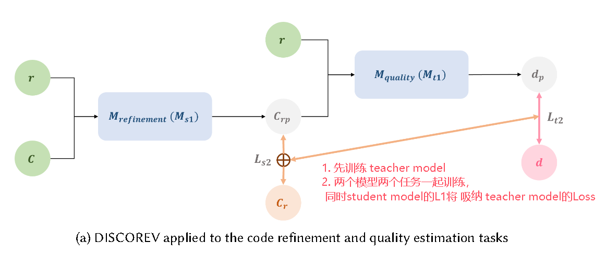

具体来说：

1. **代码优化模型的微调受质量评估模型的指导**。质量评估模型（教师模型）的损失梯度会反向传播到代码优化模型（学生模型），以指导学生模型生成更可能被接受的代码修改


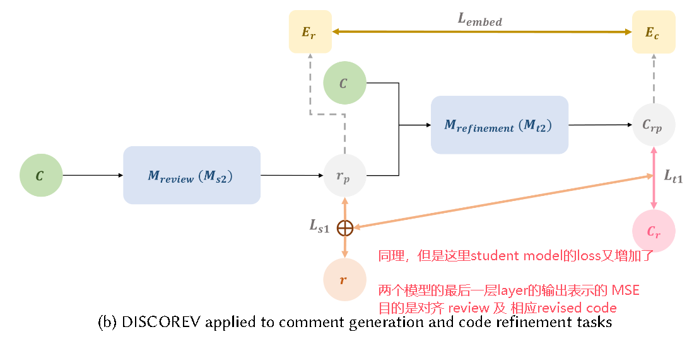

2.  **评论生成模型的微调受代码优化模型的指导**。代码优化模型（教师模型）会向评论生成模型（学生模型）提供反馈，表明生成评论的相关性以及它在多大程度上帮助教师模型生成了合适的代码优化

由于评论和代码优化共享相似的含义，DISCOREV 引入了一个**嵌入对齐目标**，旨在**使评论和代码优化的嵌入表示更接近**，从而增强模型性能


> comment 与 revised code有 语义相似性
>
> 那么 这个diff_hunk 与 comment不也应该有 这样子类似的操作吗？
>
> diff_hunk与comment的对齐是否有益于 comment的生成呢？?


**实验：**

**数据集：** Automating code review activities by large-scale pre-training（数据集）

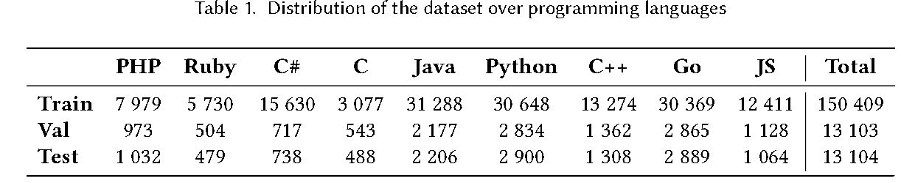


**Baseline：** T5和CodeT5的fine-tuning版本、CodeReviewer

**metrics：**BLEU 和 CodeBLEU

> CodeBLEU 对 n-gram 匹配、语法AST匹配 和 语义数据流匹配加权。


1. DISCOREV 在**代码优化任务**上的表现优于基线模型，CodeBLEU 分数达到 85.49，高于 CodeReviewer 的 82.61

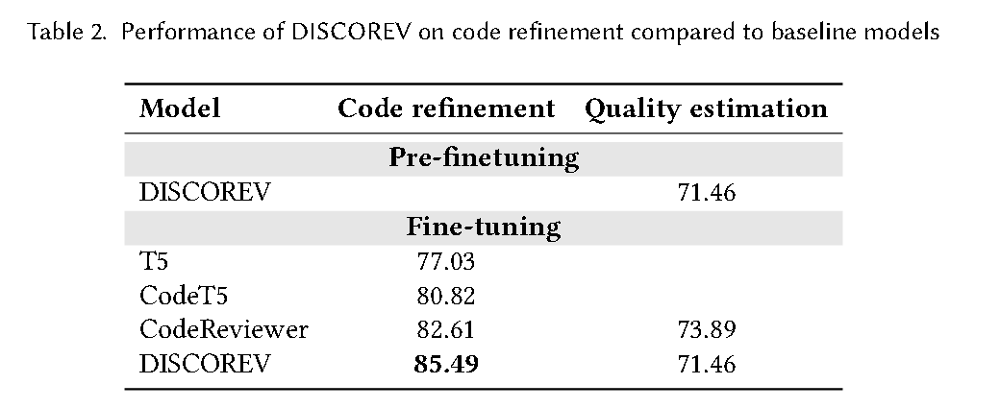

2.  在**评论生成任务**上，DISCOREV 也显著优于基线模型，BLEU 分数达到 7.33，相较于 T5、CodeT5 和 CodeReviewer 分别提高了 67%、52% 和 38%

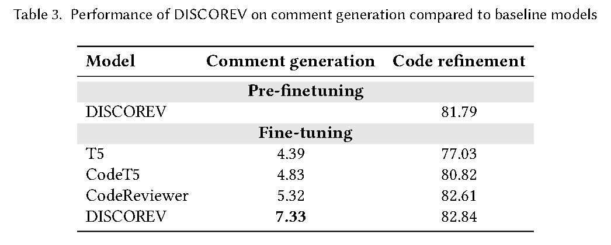

3.  **嵌入对齐目标对模型性能有积极影响**：去除该目标会导致评论生成任务的 BLEU 分数下降（从 7.33 降至 6.68），代码优化任务的 CodeBLEU 分数也略有下降，这表明了该目标的重要性

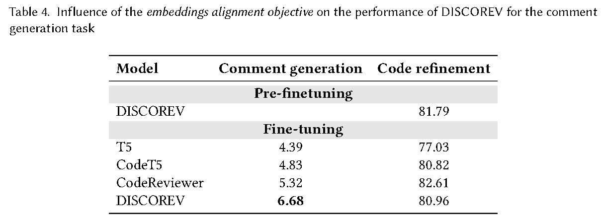

4.  **教师模型的预微调（pre-finetuning）至关重要**：对教师模型进行预微调可以使其获得先验知识，从而提供更具信息量的反馈，进一步提高学生模型的准确性

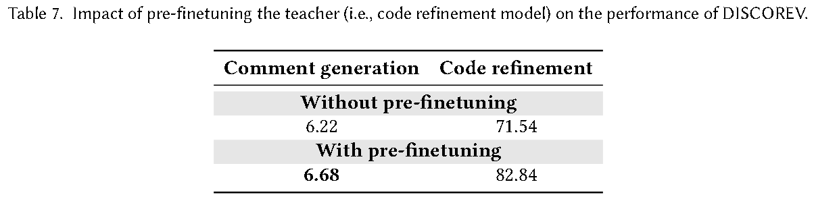

5. DISCOREV 在**所有编程语言**的评论生成任务上都优于 CodeReviewer，**优势程度因语言而异**，这取决于每种编程语言的质量和数据量。此外，软件问题和最佳实践也因不同编程语言而异。

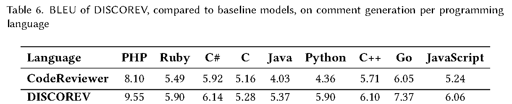


6.  **训练时间**：DISCOREV 的训练时间相对较长（每 epoch 411 分钟，包含嵌入对齐则为 524 分钟），不过这种资源密集型阶段只发生在训练期间

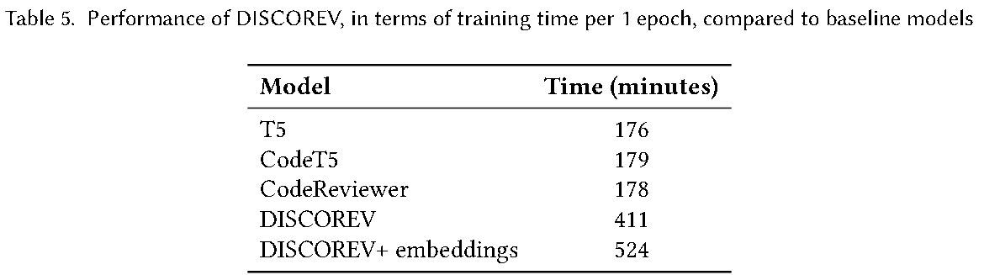


>  在利用 代码优化任务 指导 comment生成任务时， 其嵌入对齐objective有启发意义
>
> 由于  comment 和 **对应**的revised code 共享有相似的含义，这里选择 模型的最后一层layer的输出representations的 均方根误差 作为该表示加入到了loss中


## idea

> 一个最最直接的pipeline  
>
> 直接将oldfile 和 hunk 送入llm， 最后用bleu评估comment
>
> 然后也是直接让llm基于comment生成revised code，用crystalBlEU评估


> 第一步生成的bleu基本就是0，  生成10个，9个是0，剩下一个是0.03
>
> 与微软亚研文章说  现有用于代码的预训练模型（如Codex）**在source code上训练**，**对代码审查知之甚少**，难以处理代码审查过程， 吻合。
>
> 参考注释：alpha sort the imports
>
> 生成的注释：
> The patch appears to be adding two new imports to the existing code. 
>
> The first new import is `EmailFactory` from `google.cloud.forseti.common.util.email.email_factory`, which suggests that email functionality is being added to the notifier. 
>
> The second new import is `email_violations` from `google.cloud.forseti.notifier.notifiers`, which implies that a new notifier for email violations is being introduced.
>
> However, the patch only includes the addition of these two imports and does not show the actual implementation of the email functionality or the `email_violations` notifier. 
>
> To properly review this patch, **it would be necessary to see the rest of the changes**, including how these new imports are being used in the code. 
>
> Additionally, it would be helpful to include a description of the changes being made and the purpose of the new imports in the patch commit message.

> ﹤0.1 几乎没用 0.1-0.19 很难掌握要点 0.2-0.29 要点很清楚，但有明显的语法错误 0.3-0.39 易于理解的良好翻译 0.4-0.49 高质量翻译 0.5-0.59 非常高质量、充分且流畅的翻译 ≥0.6 质量通常比人类更好


1. 由于 swe-agent里可知 **无关信息将影响 llm的处理效率**效果，

   因此，产生了将 old_file根据diff_hunk进行精简后，送入llm从而产生review的想法

   具体来说，借鉴agentless的部分处理方法: **将old_file首先抽取出一个 skeleton， 然后diff_hunk已经提供天然的定位，不过要在这附近再加一个上下文窗口(100-300行)**

> 问题，
>
> 
>
> 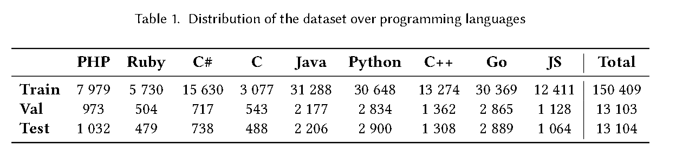
>
> 这个数据集有 9编程语言
>
> py的使用ast ，转化为抽象语法树后 去除function下的节点 即能够完成
>
> 其他语言咋办？ 是否考虑模型自己提取，效果如何。tree sitter

2. 由于  首先人类天然地从历史中学习到经验教训，而且在review时 reviewer本身也经常遇到相似的反应相近原理的代码提交，并且甚至有时会做出相似相同的反馈， 因此也认为reviewer可以受益于历史经验，

   因此，**将提供给llm 历史相似信息**

   具体可以 通过从历史知识库检索，rag，基于 sbert计算相似度，然后**检索topk** （**能不能借鉴下，从train数据集split检索**，然后test时使用）


3. 关于产生review comment， 经典采样即可（greedy 1个 比较稳定， 然后 high temperature 4个），最后选最好的。关于**review comment的后处理**， 基于此comment进行revised得到的code， 与reference的 crystalBleu越高越好？ 最后选择最好的bleu

   理由是 1)执行反馈生成代码方面的有效性 2)这两个代码审查任务是高度关联的


4.  关于agent的简单设计思路：

> 应该做agent，对于简单的问题，agent自己判断是否无需进行一系列复杂流程，就直接给出答案
>
> 可以自制一个workflow让agent参考

涉及 langchain的模块

学langchain

**Agents**：能够根据用户输入和当前状态，动态决定使用哪些工具和执行哪些操作的智能代理 **考虑react_agent或者更好的**

**Memory**: 应考虑memory的留存机制是啥，像agentless一样**折叠精简history**

**Tools**： **搜索引擎**、**sonarcube**， 此处实考虑使用**langchain_mcp_adapters**，若没有现成的mcp_server的话，只能function calling或者自己封装

> 搜索引擎的结果是否会有用呢？  是否应该给个review的知识库呢

**Document Loaders**、**Text Splitters**、**Embeddings**、**Vector Stores**


5.  ppo那篇文章中 BLEU分数应该是 百分数？ 该文章对比的基线一个是 **codellama7b_sft**、一个是**DISCORV**， 然后评估是bleu、crystalbleu以及 ai 评估

> 普通模型基本zero-shot能力就很差， 是否agent的大脑应该用finetuning的模型，或者说那个ppo训练出来的模型

> 7天服务器node5卡一直是满功率、api 

> 文章为啥要用ppo，用real comment做语义相似度奖励、用revised code做 crystalbleu奖励? 能不能直接收集数据，然后dpo就微调下
>
> DPO (Direct Preference Optimization) 则以其**无需奖励建模的简化流程**在学术基准测试中表现优异，DPO号称以更低的计算成本，实现了与PPO相当的偏好对齐效果


## 7.22

1. 22年的数据集太老，train可以使用，但是test需要考虑是否收集
2. 注释是否合理，效果差是数据质量问题
3. 还是现有模型能力问题
4. prompt调整


## Neural-Machine-Translation-Based Commit Message Generation: How Far Are We?

**Xin Xia 、 Ahmed E. Hassan、 David Lo**

**ASE** 2018


**提交消息的重要性**：提交消息被认为是软件更改的文档，它们描述了更改的内容和目的，对于程序理解和软件维护至关重要。

然而，由于时间紧迫和缺乏直接动机，开发者常常忽视编写高质量的提交消息


针对该问题，Jiang等人提出**NMT方法，将神经网络翻译算法应用到该领域，从code生成commit message**。

这个方法性能较佳，但是**他们并没有深入分析该方法为什么表现出这样的性能**。


本文：

​	对Jiang等人的实验结果进行了详细深入的分析，发现

​		1)大多数NMT能够生成高质量commit message的 **test diff与 train diff相似**

​		2)Jiang等的数据中 大约16%是噪声，包括由其他开发工具自动生成的（例如，持续集成机器人生成的）或由人工编写但包含少量冗余信息的（例如，“update readme.md”）

​		3）当去除掉这些噪声后，NMT方法性能显著下降

​	由此，提出了NNGen,使用**最近邻算法**来生成简洁的commit message。

​	该方法**BLEU提升了21%**，**速度**是NMT的**2600倍快。**

​	**工作原理**：NNGen 不需要训练过程。它通过计算新差异与训练集中每个差异的余弦相似度（初步筛选），然后通过 BLEU-4 分数选择最相似的（即最近邻）训练差异，并直接输出该最近邻的提交消息作为结果


**NNGen 表现更好的原因**：文章推测 NNGen 性能更好的原因是，对于给定的测试提交，很可能总是存在一个非常相似的训练提交

**NMT 表现更好的情况**：尽管 NNGen 整体表现更好，但在某些情况下 NMT 也能获得更高的分数。这可能是因为 NMT 捕获了更好的最近邻，或者在某些特殊情况下，NMT 展现出有限的泛化能力，能够生成更具体和准确的消息


 **对未来研究的启示**：

1. **仔细清理数据**：软件仓库中可能存在噪声数据，对噪声数据进行训练和测试可能会得到误导性结果。

2.  **优先考虑简单方法**：在应用复杂耗时的方法之前，尝试简单快速的方法是有价值的。简单方法实现成本低，可以提供对数据的深入理解，并且有时能够达到甚至超越复杂方法的性能。

3.  **仅靠差异和历史提交消息不足**：仅依赖差异和历史提交消息无法生成高质量的提交消息，因为某些关键信息（如上下文信息和项目特定知识）可能未包含在其中。

4.  **任重道远**：自动提交消息生成任务仍有很长的路要走，当前方法与理想性能之间仍存在巨大差距


## Understanding Practitioners’ Expectations on Clear Code Review Comments

组内论文 junkai chen  25年  issta

https://github.com/iCSawyer/ClearCRC

#### 24提示词工程

https://www.promptingguide.ai/zh


**动机：**

clear code review comment对于开发者之间的有效沟通很重要，

但**目前 缺乏关于什么是良好的清晰度的定义及评估手段**。


1. 针对code review comments的清晰度，提出**RIE指标** 以及 相应**评估标准**
2. 发现开源项目中大部分review comments不够清晰
3. 提出**ClearCRC,一个自动评估code review comments的清晰度的框架**。并深度学习机器学习、预训练模型(CodeBert、CodeReview等)、大语言模型(Llama等)**进行了评估**


#### 1. 通过分析**文献综述**、**与行业人士访谈**、对从业人员**在线问卷调**查等

**得出RIE指标及其评估标准**

| RIE指标 | 评估标准(E代表essential O代表optional) | 详细解释 |
| ----------------- |  | ----------------- |
| 关联性(Relevence)<br />是否与代码变更有关 | E1 与代码变更相关 | CRC应该是不言自明的。仅仅根据当前代码变更便能够进行解释。无需依赖外部信息 |
|                   | O1 指明相关位置 | CRC应该能够指明有缺陷的code的位置 |
|                   | O2 正确理解代码变更 | CRC应该显示的表现出对代码变更的正确理解 |
| 信息量(Informativeness)<br />是否提供了充足的信息 | E1 意图明确 | CRC应清楚说明其意图（即需要采取的进一步行动），以确保CRC是可操作的。<br />意图可以包括：提出问题并要求回答；识别应修复的问题；提供非阻塞且不紧急的建议 |
|  | E2 提供原因、上下文信息 | 根据意图，在CRC中提供上下文。<br />例如，提问时说明问题的重点；识别问题时解释问题是什么；提供建议时说明建议的原因 |
|  | O1 提供下一步的建议 | 如果可行，尝试提供下一步的建议 |
|  | O2 提供参考信息 | CRC提供可能对目标开发者有帮助的参考信息；<br />这些信息可能包括参考文档、指南、代码等的链接 |
| 表达性（Expression）<br />是否易于读懂、理解且语气友好 | E1 简洁明了 | 尽可能精确简洁地描述想法，避免模糊、歧义和不连贯 |
|  | E2 礼貌客观 | 应以礼貌的方式表达想法，并关注代码而非个人 |
|  | O1 格式易读 | 以人类可读的格式书写 |
|  | O2 语法和拼写正确 | 以正确的语法和拼写书写，没有错别字或不完整的单词 |


#### 2. **开源项目**中大部分review comments不够清晰

**数据获取**：用Zhiyu Li等的数据集**（该数据集是22年提出的，从github爬取的大规模开源数据集，原本用于PLM的预训练）**进行手动调查。

从该数据集的验证数据集中**随机抽样**了一部分数据。在确保95%的置信水平和5%的置信区间下，**总共随机抽取了2,438对差异块和CRC**，不同编程语言的样本量从C的216个到Golang的339个不等

**达成共识**：两名论文作者首先仔细阅读了先前阶段推导出的RIE属性及其评估标准，并进行了充分讨论，对细节有了清晰和一致的理解。

**独立标注**：对于每一对抽样数据，两名作者**独立地检查CRC及其对应的代码变更**，并根据RIE属性的评估标准进行标注

**标注规则**：

​    ▪ 如果一个CRC符合某个属性的**所有基本标准**（essential criteria）并且至少符合**一个可选标准**（optional criteria），则该属性被标记为**“正面”（positive）**。

​    ▪ 否则，该属性被标记为**“负面”（negative）**，表示缺乏清晰度。

​    ▪ 每个RIE属性都是**单独且独立地被标注**的，一个指标的结果不会影响其他两个指标的标注。

**可信度评估**：在整个过程中，**Cohen’s Kappa值达到了0.87**，这表明两位标注者之间存在**实质性的一致性**

**结果：**

**总体而言，只有71.2%的CRCs在所有三个RIE属性上都满足评估标准（即“完全清晰”）**。

**有很大一部分（即28.8%）的CRCs至少在一个属性上缺乏足够的清晰度**。

**在这些缺乏清晰度的CRCs中，信息性（Informativeness）是不足程度最显著的**，平均有19.3%的CRCs在信息性方面不足，而关联性为11.4%，表达性为5.8%

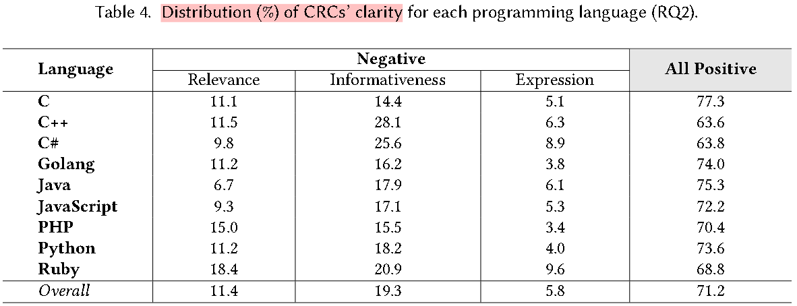


#### 3. 提出**ClearCRC,一个自动评估code review comments的清晰度的框架**。并对深度学习机器学习、预训练模型(CodeBert、CodeReview等)、大语言模型(Llama等)**进行了评估**


**评估模型选择**： 为了实证研究不同模型在自动评估CRCs清晰度方面的有效性，ClearCRC采用了**三组不同的骨干模型**进行评估：

   **模型组1：深度学习和机器学习模型**

​    ▪ 选择了**Bi-LSTM**和**Random Forest**。

​    ▪ 选择理由：先前的研究表明，Bi-LSTM和Random Forest在分类优秀的提交信息（commit messages）和日志信息（log messages）方面是有效的。

   **模型组2：预训练语言模型**

​    ▪ 选择了**CodeBERT**和**CodeReviewer**。

​    ▪ **CodeBERT**：一种双模态预训练语言模型，适用于编程语言和自然语言，在分类任务中表现出良好的性能和计算资源成本平衡。

​    ▪ **CodeReviewer**：一种专门为代码审查活动自动化而设计的预训练模型，通过代码差异去噪等预训练任务，在大规模代码审查数据集上进行训练，在代码改进等任务中表现出竞争力。

​    ▪ 选择理由：预训练模型在代码知识和任务特定微调方面具有优势。

  **模型组3：大型语言模型（LLMs）**

​    ▪ 选择了**Llama3-70B-Instruct**和**CodeLlama-34B-Instruct**。

​    ▪ 选择理由：Llama系列模型在不同LLMs中表现出色，并在代码审查相关研究中非常流行


**数据集详细信息**：使用了研究前一阶段手动标注的2,438对代码变更（diff hunk）和CRC数据。

  **数据划分**：数据集被随机划分为**80%训练集、10%验证集和10%测试集**。

  **数据增强**：由于数据集中**负面（不清晰）实例和正面（清晰）实例的分布不平衡**，研究团队对训练集中的负面实例进行了**上采样**（随机重复），使其数量与正面实例相同，以缓解不平衡数据带来的影响。测试集的数据则保持一致

**数据预处理**：

​    ▪ 移除了与代码变更无关的代码行。

​    ▪ 对于模型组1和模型组2，将代码变更中的“`‐`”和“`+`”标记分别替换为“`[DELETE]`”和“`[ADD]`”，然后将CRC和处理后的代码变更连接起来，并在它们之间添加一个“`[SEP]`”标记。

​    ▪ 对于模型组3（LLMs），将代码变更和CRC的信息嵌入到**提示（prompt）**中，并遵循Prompt Engineering Guide设计提示模板。提示模板首先提供了任务说明、RIE属性及评估标准，然后告知模型如何使用评估标准（需满足所有基本标准和至少一个可选标准），以及期望的输出格式，最后附上实际数据供模型评估

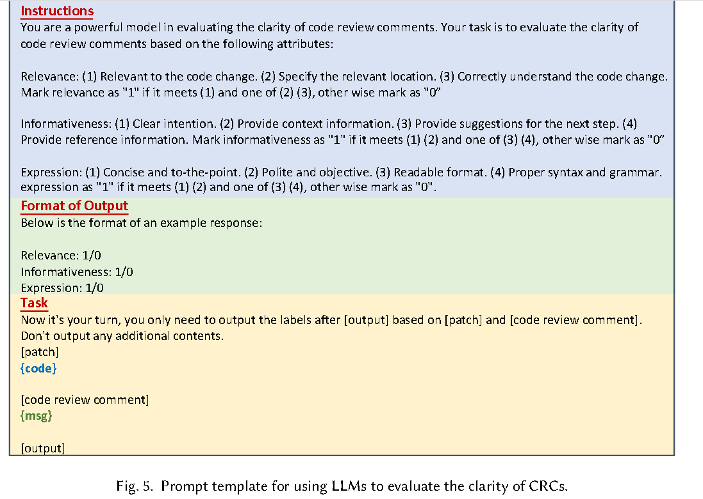


​	采用**5折交叉验证**来减轻随机性的影响，并报告平均结果。每个回合中，20%的数据用于验证和测试（各占一半），80%用于训练


**结果：**

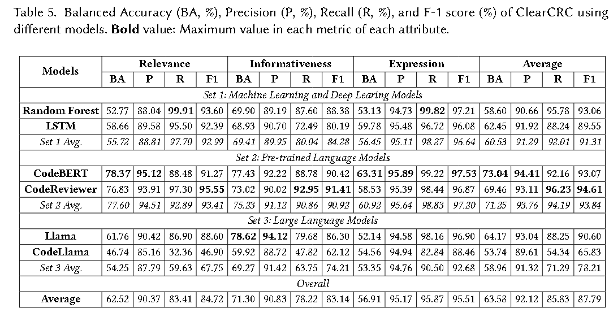

​	**预训练语言模型（模型组2）在所有四个指标上均表现最佳**。例如，模型组2的平衡准确率为71.25%，显著优于模型组1（机器学习/深度学习模型，相对提升17.7%）和模型组3（大型语言模型，相对提升20.8%）。

这归因于预训练语言模型具有先验代码知识和任务特定微调。

大型语言模型则表现不佳，可能是因为它们未能获得足够的CRCs清晰度知识


​	**泛化能力**：**ClearCRC具有良好的泛化能力**

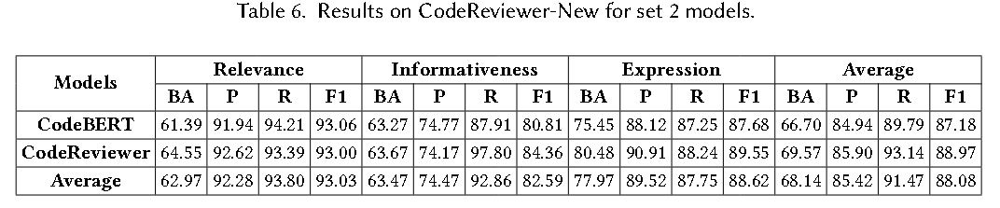

​	从CodeReviewer-New数据集中**随机抽样了135个示例**，其中包含9种编程语言，每种语言15个样本，使用**同样的方法进行数据标注以及实验评估**。

​	与在原始CodeReviewer数据集上的结果相比，ClearCRC在CodeReviewer-New数据集上的性能出现了轻微下降。平衡准确率（Balanced Accuracy）**71.25%下降到68.14%。**F-1分数从**93.84%下降到88.08%**


>咋确定的抽样数量，解释如下：
>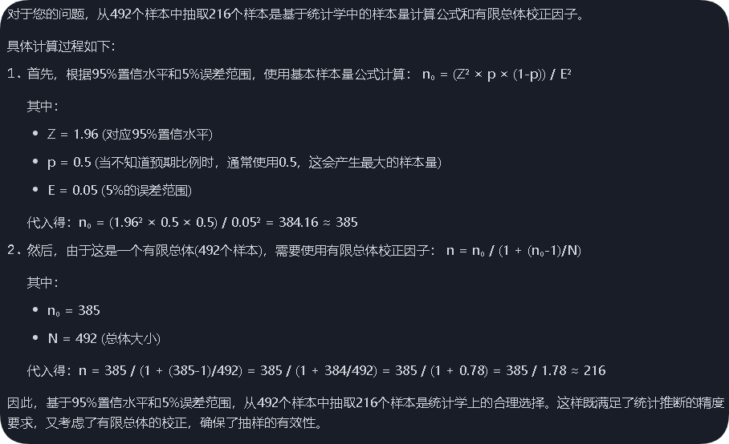


> Cohen’s Kappa值达到了0.87，这值怎么得来的：解释如下
>
> 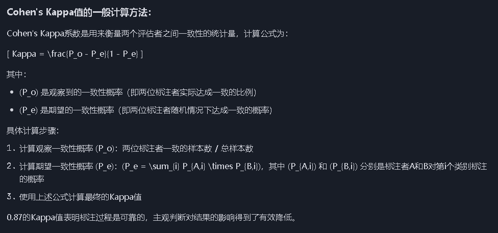


#### 4. 数据详情

> 列信息:
>
> - patch: 代码补丁内容
> - msg: 评论消息
> - lang: 编程语言
> - relevance: 相关性评分 (0或1)
> - informativeness: 信息性评分 (0或1)
> - expression: 表达性评分 (0或1)
> 数据类型:
>
> - patch, msg, lang 列是object类型(字符串)
> - relevance, informativeness, expression 列是int64类型(整数)
> 前两个样本数据:
>                                                patch                                                msg lang  relevance  informativeness  expression
> 0  @@ -161,6 +161,13 @@ static void gamma_control...  This code could be rerouted to avoid the unnec...    c          1                1           1
> 1  @@ -3481,5 +3481,17 @@ move_mm_reg_opcode(bool...  Isn't this an internal function? CLIENT_ASSERT...    c          1                1           1
>
> 1.
>    第一个样本是关于gamma_control分配的代码优化建议，所有三个评分都是1
> ********************
> c
> ********************
> @@ -161,6 +161,13 @@ static void gamma_control_manager_get_gamma_control(struct wl_client *client,
>         wl_resource_set_implementation(gamma_control->resource, &gamma_control_impl,
>                 gamma_control, gamma_control_handle_resource_destroy);
>
> +       if (output == NULL) {
> +               wl_resource_set_user_data(gamma_control->resource, NULL);
> +               zwlr_gamma_control_v1_send_failed(gamma_control->resource);
> +               free(gamma_control);
> +               return;
> +       }
>         +
>         wl_signal_add(&output->events.destroy,
>                 &gamma_control->output_destroy_listener);
>         gamma_control->output_destroy_listener.notify =
> ********************
> This code could be rerouted to avoid the unnecessary gamma_control allocation
> ********************
> 1
> ********************
> 1
> ********************
> 1


暂且使用后者作为数据集、并将oldf从前者补充到后者

> 发现一：  ClearCRC中 号称有 2438条，但是set去重后发现剩下2422条
>
> 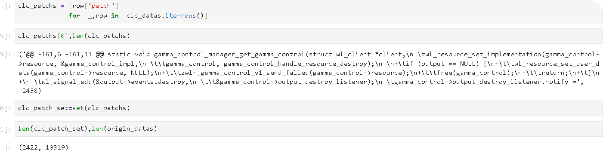
>
> 发现二：  CodeReviewer 中 valid与 test也有238条完全重复的patch
>
> 


##  SeRe: A Security-Related Code Review Dataset Aligned with Real-World Review Activities


1. 基于主动学习方法  构建了一个 专注于安全的review comment数据集


2. 评估当前review comment生成方法在该数据集上的效果


主动学习方法  框架：

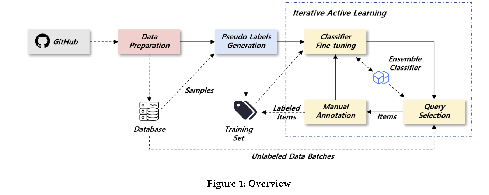


构建了一个高质量、可扩展的安全相关代码审查数据集，由来自多个高质量存储库的 **6,732** 个实例组成，涵盖各种安全问题和编程语言

数据格式如下：  refinement即根据review comments修改后得到的新code


数据分类：分为14个子类

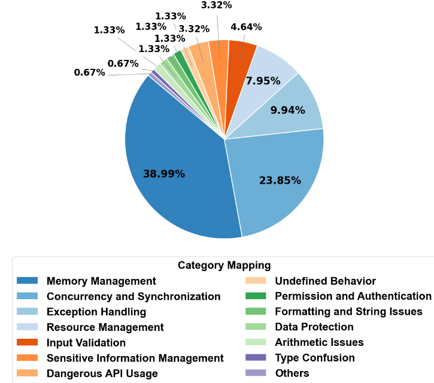


评估结果：

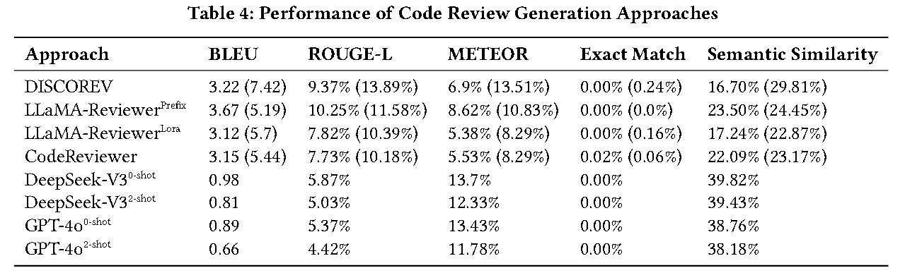

评估的prompt：

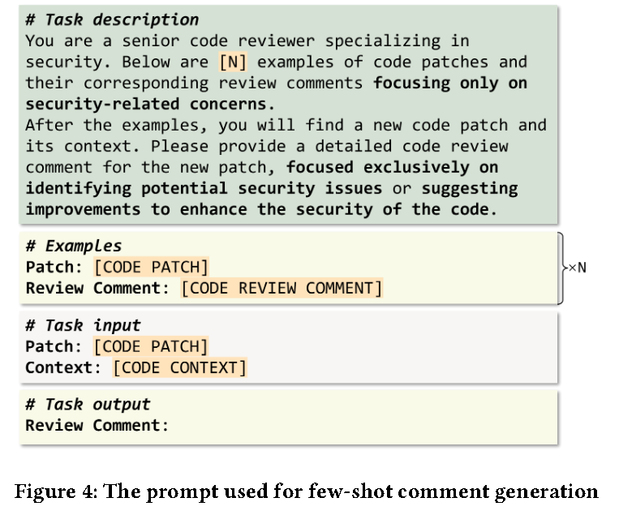


## tree_sitter_python

### 简介


https://tree-sitter.github.io/tree-sitter/index.html

tree-sitter是一个解析生成工具，一个能够增量解析的库。

它能够将一个源文件解析为一颗具体语法树，并且在编辑该文件时同时高效地更新该语法树。

特点：

​	1) 能够解析任意编程语言

​	2) 足够快

​	3) 足够robust，对语法有误的源文件也能提供有用结果，并且定位错误位置

​	4）轻依赖、无依赖： 能够被用于任意程序


提供了各种语言接口，这里主要学习下python版本的库。

[py-tree-sitter](https://github.com/tree-sitter/py-tree-sitter)

```python
pip3 install tree_sitter
# Successfully installed tree_sitter-0.23.2
```


```sh
# 下载parsers库  
# 注意之前是要git clone的，但是新版本不用，变成pip
pip install tree-sitter-c
pip install tree-sitter-cpp
pip install tree-sitter-python
pip install tree-sitter-java

pip install tree-sitter-c-sharp
pip install tree-sitter-go
pip install tree-sitter-javascript
pip install tree-sitter-php
pip install tree-sitter-ruby
```


### 遍历

```python
from typing import Generator,Set
import tree_sitter_c,tree_sitter_cpp,tree_sitter_java, tree_sitter_python
from tree_sitter import Language, Parser, Node, Tree

python_language = Language(tree_sitter_python.language())
c_language = Language(tree_sitter_c.language())
java_language = Language(tree_sitter_java.language())
cpp_language = Language(tree_sitter_cpp.language())


python_parser = Parser(python_language)
python_tree = python_parser.parse(
    bytes(
        """
\"\"\"
这是一个模块
\"\"\"
class A:
    pass
class B:
    \"\"\"
    这是一个类
    \"\"\"
    def __init__(self):
        pass
# 这是#注释
def foo():
    \"\"\"
    这是一个Python函数
    \"\"\"
    if bar:
        baz()
def sub():
    return a+b
""",
        "utf8"
    )
)

def traverse_tree(tree: Tree) -> Generator[Node, None, None]:
    """
    深度优先遍历树， 但是是生成器
    """
    cursor = tree.walk()

    visited_children = False
    while True:
        if not visited_children:
            yield cursor.node
            if not cursor.goto_first_child():
                visited_children = True
        elif cursor.goto_next_sibling():
            visited_children = False
        elif not cursor.goto_parent():
            break


# def breadth_first_traverse(tree: Tree) -> Generator[Node, None, None]:
#     """
#     层序遍历（广度优先遍历）树，使用队列实现
#     """
#     from collections import deque
#     queue = deque([tree.root_node])
    
#     while queue:
#         node = queue.popleft()
#         yield node
#         # 将所有子节点加入队列
#         for child in node.children:
#             queue.append(child)
print("\n深度优先遍历结果:")
node_names = map(lambda node: node.type, traverse_tree(python_tree))
for name in node_names:
    print(name)

# print("\n广度优先遍历结果:")
# bfs_node_names = map(lambda node: node.type, breadth_first_traverse(python_tree))
# for name in bfs_node_names:
#     print(name)
```


>结果为：
>
>深度优先遍历结果:
>module
>expression_statement
>string
>string_start
>string_content
>string_end
>class_definition
>class
>identifier
>:
>block
>pass_statement
>pass
>class_definition
>class
>identifier
>:
>block
>expression_statement
>string
>string_start
>string_content
>string_end
>function_definition
>def
>identifier
>parameters
>(
>identifier
>)
>:
>block
>pass_statement
>pass
>comment
>function_definition
>def
>identifier
>parameters
>(
>)
>:
>block
>expression_statement
>string
>string_start
>string_content
>string_end
>if_statement
>if
>identifier
>:
>block
>expression_statement
>call
>identifier
>argument_list
>(
>)
>function_definition
>def
>identifier
>parameters
>(
>)
>:
>block
>return_statement
>return
>binary_operator
>identifier
>+
>identifier


### 抽取skeleton(初级)


> 借助0)深度优先遍历1）节点类型 2) point节点位置行号列号 对原codes进行操作

```python

def extract_skeleton_python(code: str, reserved_lines: Set[int] = None) -> str:
    """
    将Python代码中所有函数的函数体仅保留指定行和函数级注释（文档字符串）
    
    Args:
        code: Python源代码
        reserved_lines: 需要额外保留的行号集合（相对于函数体内部的行号），默认为None
    
    Returns:
        处理后的代码
    """
    if reserved_lines is None:
        reserved_lines = set()
    
    # 解析代码
    parser = Parser(python_language)
    tree = parser.parse(bytes(code, "utf8"))
    
    # 将代码转换为可编辑的列表
    lines = code.split('\n')
    
    # 记录需要删除的行号
    lines_to_delete = []
    
    # 遍历语法树，找到所有函数定义
    for node in traverse_tree(tree):
        if node.type == 'function_definition':
            # 找到函数体
            block_node = None
            for child in node.children:
                if child.type == 'block':
                    block_node = child
                    break
            
            if block_node:
                # 获取函数体的起始和结束位置 point是一个二维坐标 (行，列)
                block_start = block_node.start_point[0]
                block_end = block_node.end_point[0]
                
                # 找到函数体内的文档字符串
                docstring_start = None
                docstring_end = None
                
                # 检查函数体内的第一个语句是否为文档字符串
                for child in block_node.children:
                    if child.type == 'expression_statement':
                        for grandchild in child.children:
                            if grandchild.type in ['string', 'identifier']:
                                docstring_start = child.start_point[0]
                                docstring_end = child.end_point[0]
                                break
                    if docstring_start is not None:
                        break
                
                # 标记需要删除的行（除了保留行、return语句和文档字符串）
                for i in range(block_start, block_end+1):
                    # 如果在文档字符串范围内，跳过
                    if docstring_start is not None and docstring_start <= i <= docstring_end:
                        continue
                    
                    # 如果在保留行中，跳过
                    if i in reserved_lines:  # 转换为函数体内的相对行号
                        continue
                    
                    lines_to_delete.append(i)
    
    # 设置为空行
    for line_num in sorted(lines_to_delete, reverse=True):
        del lines[line_num]
    
    # 重新组合代码
    return '\n'.join(lines)
     
sample_code = """\"\"\"
这是一个模块
\"\"\"
class A:
    pass
class B:
    \"\"\"
    这是一个类
    \"\"\"
    def __init__(self):
        \"\"\"
        这是一个Python函数
        \"\"\"
        pass
# 这是#注释
def foo():
    \"\"\"
    这是一个Python函数
    \"\"\"
    if bar:
        baz()
def sub():
    \"\"\"
    这是一个Python函数
    \"\"\"
    return a+b
"""

print("原始代码:")
print(sample_code)

print("\n提取骨架后的代码(仅保留return语句和函数级注释):")
result1 = extract_skeleton_python(sample_code)
print(result1)

print("\n提取骨架后的代码(保留指定行和函数级注释):")
result2 = extract_skeleton_python(sample_code, {10,11,12,13}) # 行号从0开始
print(result2)


```

##### python case

```python
原始代码:
"""
这是一个模块
"""
class A:
    pass
class B:
    """
    这是一个类
    """
    def __init__(self):
        """
        这是一个Python函数
        """
        self.a=a
# 这是#注释
def foo():
    """
    这是一个Python函数
    """
    if bar:
        baz()
def sub():
    """
    这是一个Python函数
    """
    return a+b
```

```python
提取骨架后的代码(保留指定行和函数级注释):
"""
这是一个模块
"""
class A:
    pass
class B:
    """
    这是一个类
    """
    def __init__(self):
        """
        这是一个Python函数
        """
        pass
# 这是#注释
def foo():
    """
    这是一个Python函数
    """
def sub():
    """
    这是一个Python函数
    """
```


> scale到 cpp和java上， 注意:节点type不完全相同


```python
def extract_skeleton_cpp(code: str, reserved_lines: Set[int] = None) -> str:
    """
    将C++代码中所有函数的函数体仅保留指定行和函数级注释（文档字符串）
    
    Args:
        code: C++源代码
        reserved_lines: 需要额外保留的行号集合（相对于函数体内部的行号），默认为None
    
    Returns:
        处理后的代码
    """
    if reserved_lines is None:
        reserved_lines = set()
    
    # 解析代码
    parser = Parser(cpp_language)
    tree = parser.parse(bytes(code, "utf8"))
    
    # 将代码转换为可编辑的列表
    lines = code.split('\n')
    
    # 记录需要删除的行号
    lines_to_delete = []
    
    # 遍历语法树，找到所有函数定义
    for node in traverse_tree(tree):
        if node.type == 'function_definition':
            # 找到函数体
            block_node = None
            for child in node.children:
                if child.type == 'compound_statement':
                    block_node = child
                    break
            
            if block_node:
                # 获取函数体的起始和结束位置 point是一个二维坐标 (行，列)
                block_start = block_node.start_point[0]
                block_end = block_node.end_point[0]
                
                # 找到函数体内的文档字符串
                docstring_start = None
                docstring_end = None
                
                # 检查函数体内的第一个语句是否为文档字符串
                # 在C++中，文档字符串通常是注释形式
                for child in block_node.children:
                    if child.type == 'comment':
                        # 检查是否为文档字符串注释
                        docstring_start = child.start_point[0]
                        docstring_end = child.end_point[0]
                        break
                
                # 标记需要删除的行（除了保留行、return语句和文档字符串）
                for i in range(block_start+1 , block_end):  # 不包括大括号行
                    # 如果在文档字符串范围内，跳过
                    if docstring_start is not None and docstring_start <= i <= docstring_end:
                        continue
                    
                    # 如果在保留行中，跳过
                    if i in reserved_lines:  # 转换为函数体内的相对行号
                        continue
                    
                    lines_to_delete.append(i)
    
    # 设置为空行
    for line_num in sorted(lines_to_delete, reverse=True):
        del lines[line_num]
    
    # 重新组合代码
    return '\n'.join(lines)


def extract_skeleton_java(code: str, reserved_lines: Set[int] = None) -> str:
    """
    将Java代码中所有函数的函数体仅保留指定行和函数级注释（文档字符串）
    
    Args:
        code: Java源代码
        reserved_lines: 需要额外保留的行号集合（相对于函数体内部的行号），默认为None
    
    Returns:
        处理后的代码
    """
    if reserved_lines is None:
        reserved_lines = set()
    
    # 解析代码
    parser = Parser(java_language)
    tree = parser.parse(bytes(code, "utf8"))
    # node_names = map(lambda node: node.type, traverse_tree( parser.parse(bytes(code, "utf8"))))
    # for name in node_names:
    #     print(name)

    # 将代码转换为可编辑的列表
    lines = code.split('\n')
    
    # 记录需要删除的行号
    lines_to_delete = []
    
    # 遍历语法树，找到所有函数定义
    for node in traverse_tree(tree):
        if node.type == 'method_declaration' or node.type == 'constructor_declaration':
            # 找到函数体
            block_node = None
            for child in node.children:
                if child.type == 'block' or child.type == 'constructor_body':
                    block_node = child
                    break
            
            if block_node:
                # 获取函数体的起始和结束位置 point是一个二维坐标 (行，列)
                block_start = block_node.start_point[0]
                block_end = block_node.end_point[0]
                
                # 找到函数体内的文档字符串
                docstring_start = None
                docstring_end = None
                
                # 检查函数体内的第一个语句是否为文档字符串
                # 在Java中，文档字符串通常是注释形式
                for child in block_node.children:
                    if child.type == 'line_comment' or child.type == 'block_comment':
                        # 检查是否为文档字符串注释
                        docstring_start = child.start_point[0]
                        docstring_end = child.end_point[0]
                        break
                
                # 标记需要删除的行（除了保留行、return语句和文档字符串）
                for i in range(block_start+1 , block_end):  # 不包括大括号行
                    # 如果在文档字符串范围内，跳过
                    if docstring_start is not None and docstring_start <= i <= docstring_end:
                        continue
                    
                    # 如果在保留行中，跳过
                    if i in reserved_lines:  # 转换为函数体内的相对行号
                        continue
                    
                    lines_to_delete.append(i)
    
    # 设置为空行
    for line_num in sorted(lines_to_delete, reverse=True):
        del lines[line_num]
    
    # 重新组合代码
    return '\n'.join(lines)

```


## BLEU的平滑


A Systematic Comparison of Smoothing Techniques for Sentence-Level


CodeReviewer测评用的 加1平滑的BLEU

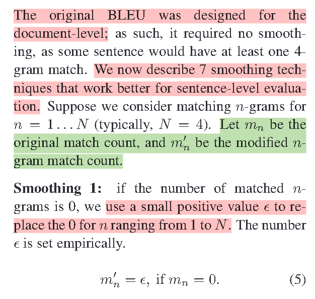


RL4CR用的使用 NLTK的method7平滑

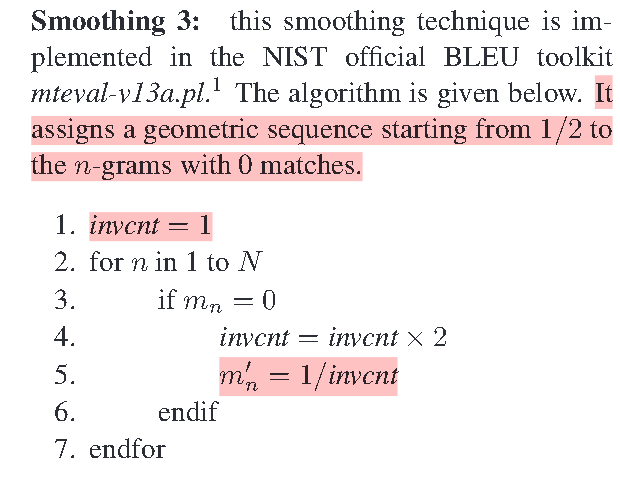

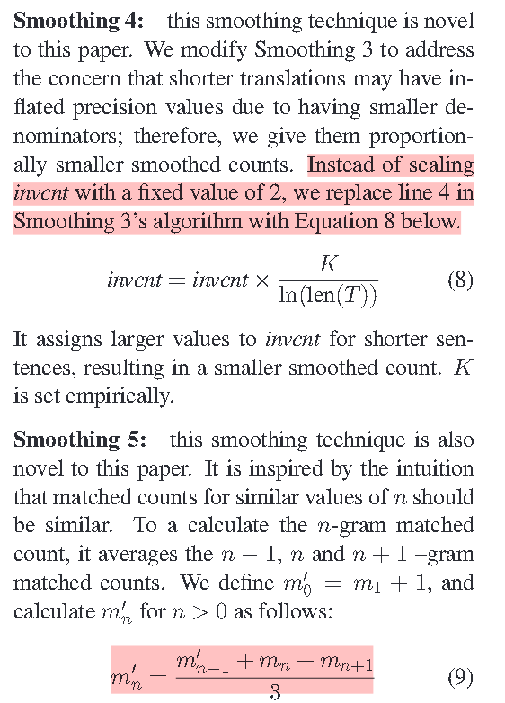

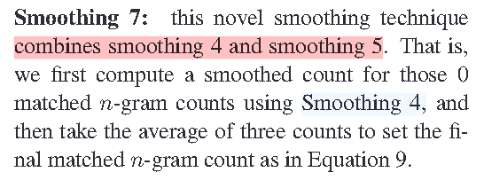


## 数据集查看

0. 能用个 ClearCRC 预处理下所有数据， 然后只用高质量数据进行微调 以及 agent构建

破灭了，ClearCRC是相较于BLEU的评估指标

又好了。。由于论文中模型预测正确

率很高，所以权当使用这些llm清洗下数据，也可以考虑加入人工、主动学习等


1. 先cpp java python 每个选10个质量高的、易懂的数据
2. 用LLM prompt验证下情况,再看该怎么办


Comment_Generation/msg-test.jsonl

10169

['patch', 'y', 'oldf', 'idx', 'id', 'msg', 'proj', 'lang']


发现的困难：

1. 背景知识严重不足

2. 简易的错误review comment表达不够clear,太短或太长

3. 代码变更对应的文件 的注释不健全

   

   数据质量实在是太差了，应该想办法过滤出高质量数据。


> 尝试使用ClearCRC所提供的过滤后的数据， 我仅仅使用 relevent、information、expression均为1的 数据
>
> 然后同时改进prompt，严格格式化输入输出：
> 最终，当使用平滑方法7的BLEU时，有较明显高质量
>
> 注意： 这里clearCRC中给的数据没有 相关上下文文件参考即oldfile参考
>
> 共223个样本
>
> 平均bleu分数：0.0876
>
> 平均分: 0.0876
> 最低分: 0.0  （只有两个0.0，都是API调用失败）
> 最高分: 0.1925
> 中位数: 0.083
>
> Token统计:
> 平均输入token: 532
> 平均输出token: 85
>
> 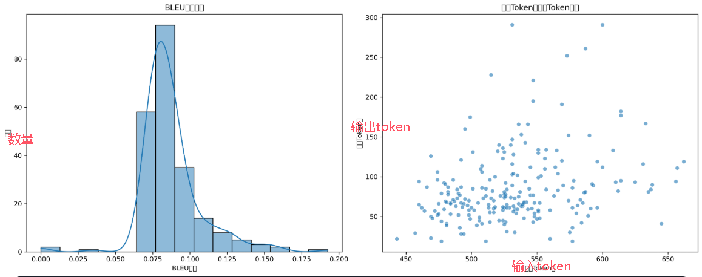
>
> > #### prompt
> > \# 标题符号 和 example对格式化输出有很重要的影响
> > template = """
> >
> > \# Instructions:
> >
> > ​    You are a ... in evaluating the clarity of code review comments.
> > ​    Your task is to .. the clear code review comments based on the context and diffs.
> > ​    You can ... the following suggestions to improve the comment's quality:
> > ​        Your review comment should  1) be relevant to the code change; 2) specify the relevant location; 3) and correctly understand the code change. 
> > ​        Your review comment should  1) have clear intention; 2) provide context information; 3) provide maybe suggestions for the next step; 4) and provide reference information. 
> > ​        Your review comment should  1) be concise and to-the-point; 2) be polite and objective; 3) be readable format; 4) and have proper syntax and grammar. 
> >
> > \# Format of Input and Output:
> >
> > ​    Below is the format of an example:  
> > ​        [context] 
> > ​        ... 
> > ​        the content of old file, which is the context of the patch
> > ​        ...
> > ​        [diffs] 
> > ​        ... 
> > ​        the content of diff
> > ​        ...
> > ​        [code review comment]
> > ​    Then, you can generate a comment base the offered information as follows:
> > ​        I would prefer a simple break statement here instead of return. What do you think about it?
> >
> > \# Task:  
> >
> > ​    `Now Assume three different experts are answering this question.
> > ​    All experts write down their first step in thinking about this problem, then share with everyone.
> > ​    Then, all experts write down their next step and share.
> > ​    And so on, until all experts have written down all their steps.
> > ​    As long as everyone finds that an expert's step is wrong, that expert leaves.
> > ​    Please only output the comment based on the following [oldf] and [diffs] . Don't output any additional contents. `
> > ​    [oldf] 
> > ​    {oldf}  
> > ​    [diffs] 
> > ​    {patch}  
> > ​    [code review comment]
> > """,
> >
> > > prompt里需要进一步解释 - +, 还有review相关知识等（应该可以从review comment classify任务受到启发）


最好的0.19的情况，  找到了'cn-northwest-1, EU'格式不符，没有找到us-east-1的缺失

>********************
>@@ -95,6 +95,11 @@ CORS_HEADERS = [
>'Access-Control-Request-Headers', 'Access-Control-Request-Method'
>]
>     
> \+LOCATION_CONSTRAINT_VALID_REGION = ['af-south-1', 'ap-east-1', 'ap-northeast-1', 'ap-northeast-2', 'ap-northeast-3',
>\+    'ap-south-1', 'ap-southeast-1', 'ap-southeast-2', 'ca-central-1', 'cn-north-1', 'cn-northwest-1, EU',
>\+    'eu-central-1', 'eu-north-1', 'eu-south-1', 'eu-west-1', 'eu-west-2', 'eu-west-3', 'me-south-1', 'sa-east-1',
>\+    'us-east-2', 'us-gov-east-1', 'us-gov-west-1', 'us-west-1', 'us-west-2']
>\+
>
>def event_type_matches(events, action, api_method):
>""" check whether any of the event types in `events` matches the
> 
>     ********************
>Token统计｜输入:656｜输出:94｜耗时:3.08s
>**************************************************
>参考注释：nit: Looks like a typo in string `'cn-northwest-1, EU'`. Also, I think we should probably rather match for `us-east-1` (rather than matching against all the other regions here) - to my knowledge `us-east-1` is literally the only region that is an exception when it comes to `LocationConstraint`.
>**************************************************
>BLEU score (default smoothing): 0.1035
>BLEU score (with smoothing): 0.1925
>生成的注释：The list `LOCATION_CONSTRAINT_VALID_REGION` contains a mix of valid AWS region names and invalid entries like `'cn-northwest-1, EU'`. This may lead to incorrect region validation logic in the code. It's recommended to double-check and correct the region names to follow the standard format (e.g., `'cn-northwest-1'` and `'eu-west-1'` instead of `'cn-northwest-1, EU'`).


剩下的1200条全api调用失败了

=== BLEU分数统计 ===
样本数量: 10
平均分: 0.0789
最低分: 0.0674
最高分: 0.0913
中位数: 0.0776

=== Token统计 ===
样本数量: 10
输入Token: 平均2372.1 (范围942-5340)
输出Token: 平均107.1 (范围70-147)


> 思路
>
> 1. 使用多llm 过滤下ClearCRC 数据，  理由是论文中当前llm的 precision很高，查的较准、不过可能不全
> 2. 率先做后处理， 可以借鉴AGIS的有限状态自动机设计
> 3. 再考虑 外部知识注入， 一个是当前所需背景知识、另一个是review背景知识
> 4. 评估指标除了bleu外，加入文本相似度度量


### 图


review知识: 比如这个格式规范，需要alpha sort the import， 而且质量不高，太短

> @@ -24,6 +24,8 @@ from google.cloud.forseti.notifier.notifiers import cscc_notifier
>
> from google.cloud.forseti.notifier.notifiers.inventory_summary import InventorySummary
>
> from google.cloud.forseti.services.inventory.storage import DataAccess
>
> from google.cloud.forseti.services.scanner import dao as scanner_dao
>
> +from google.cloud.forseti.common.util.email.email_factory import EmailFactory
>
> +from google.cloud.forseti.notifier.notifiers import email_violations
>
> \# pylint: enable=line-too-long
>
> 
>
> 
>
> ********************
>
> Token统计｜输入:1143｜输出:70｜耗时:2.68s
>
> **************************************************
>
> 参考注释：alpha sort the imports
>
> 生成的注释：I think adding the import for `EmailFactory` and `email_violations` makes sense if they are going to be used in the notifier logic. However, could you clarify where these modules are utilized in the code? If they are not yet used, it would be better to add them only when necessary to keep the imports clean and relevant.
>


review知识，可以改名字

>********************
>
>@@ -62,6 +62,9 @@ class kubernetes(luigi.Config):
>
>   kubernetes_namespace = luigi.OptionalParameter(
>
>​     default=None,
>
>​     description="K8s namespace in which the job will run")
>
>\+   max_retrials_to_get_pods = luigi.IntParameter(
>
>\+     default=0,
>
>\+     description="Max retrials to get pods' informations")
>
> 
>
> class KubernetesJobTask(luigi.Task):
>
>********************
>
>Token统计｜输入:2073｜输出:138｜耗时:5.03s
>
>**************************************************
>
>参考：`retrials` isn't the word you intend. I think you mean `retries` and to that end, can the var name just be `max_retries`?
>
>**************************************************
>
>BLEU score (default smoothing): 0.0000
>
>BLEU score (with smoothing): 0.0809
>
>生成的注释：The new configuration parameter `max_retrials_to_get_pods` introduces a limit for retrieving pod information, which seems to be a retry mechanism for handling transient failures during pod status fetching. However, the parameter lacks a clear docstring explaining its exact purpose, scope, and how it differs from `max_retrials`.


与changlist描述不符， 质量问题

> ********************
>@@ -419,7 +419,10 @@ class S3KeyTest(unittest.TestCase):
>    remote_metadata = check._get_remote_metadata()
>			\#TODO: investigate whether encoding ' ' as '%20' makes sense
> \-        self.assertEqual(check.cache_control, 'public,%20max-age=500')
>\+        self.assertIn(
> \+            check.cache_control,
>\+            ('public,%20max-age=500', 'public, max-age=500')
> \+        )
>   self.assertEqual(remote_metadata['cache-control'], 'public,%20max-age=500')
>    self.assertEqual(check.get_metadata('test-plus'), 'A plus (+)')
>   self.assertEqual(check.content_disposition, 'filename=Sch%C3%B6ne%20Zeit.txt')
> 
>********************
> Token统计｜输入:1872｜输出:147｜耗时:2.99s
>**************************************************
> 参考注释：This change looks unrelated to the CL description?
>**************************************************
> BLEU score (default smoothing): 0.0000
>BLEU score (with smoothing): 0.0714
> 生成的注释：The change in the test case for `check.cache_control` from using `assertEqual` to `assertIn` with multiple expected values seems reasonable to accommodate potential variations in how spaces are encoded. However, this change should be clarified with a comment explaining why multiple values are acceptable, especially since the test is about verifying correct header encoding behavior.
>
> A possible review comment:
>
> Instead of using `assertIn` with two possible string values, would it be better to normalize the value before comparison or clarify in a comment why both `'public,%20max-age=500'` and `'public, max-age=500'` are considered valid? This will help maintainability and clarity for future readers of the test.


质量不好，cmdline.py上下文没有即项目特定知识cmdline.py未包含在其中。

> ********************
>
> @@ -18,8 +18,11 @@ from mitmproxy import io
>
>  from mitmproxy import log
>
>  from mitmproxy import version
>
>  from mitmproxy import optmanager
>
> +from mitmproxy import options
>
>  import mitmproxy.tools.web.master # noqa
>
>  
>
> +CONFIG_PATH = os.path.join(options.CA_DIR, 'config.yaml')
>
> +
>
>  
>
>  def flow_to_json(flow: mitmproxy.flow.Flow) -> dict:
>
>    """
>
> ********************
>
> Token统计｜输入:1450｜输出:93｜耗时:2.95s
>
> **************************************************
>
> 参考注释：Don't redefine, just import the existing one in `cmdline.py`. :)
>
> **************************************************
>
> BLEU score (default smoothing): 0.0000
>
> BLEU score (with smoothing): 0.0776
>
> 生成的注释：The addition of `from mitmproxy import options` and the constant `CONFIG_PATH` seems unrelated to the rest of the file, as there is no usage of these imports or the `CONFIG_PATH` variable in the provided context. 
>
> 
>
> Is there a plan to use `options` or `CONFIG_PATH` in subsequent code changes? If so, please clarify the intended usage. Otherwise, consider removing the unused import and constant to keep the code clean and readable.


>提供了完整的上下文，结果上下文中也没有CONFIG_PATH，因此认为是合理的
>
>********************
>
>@@ -18,8 +18,11 @@ from mitmproxy import io
>
> from mitmproxy import log
>
> from mitmproxy import version
>
> from mitmproxy import optmanager
>
>+from mitmproxy import options
>
> import mitmproxy.tools.web.master # noqa
>
> 
>
>+CONFIG_PATH = os.path.join(options.CA_DIR, 'config.yaml')
>
>+
>
> 
>
> def flow_to_json(flow: mitmproxy.flow.Flow) -> dict:
>
>   """
>
>********************
>
>Token统计｜输入:4020｜输出:48｜耗时:3.68s
>
>**************************************************
>
>参考注释：Don't redefine, just import the existing one in `cmdline.py`. :)
>
>**************************************************
>
>BLEU score (default smoothing): 0.0000
>
>BLEU score (with smoothing): 0.0888
>
>生成的注释：Consider adding a comment to explain why `CONFIG_PATH` is being defined here and how it will be used. This would improve code readability and maintainability. For example: `# Define path for configuration file to be used in settings management`.


## 软工四大顶会两大顶刊


1. **ASE** (IEEE/ACM International Conference on Automated Software Engineering)
   - 专注于**自动化软件工程**领域的国际会议
   - 由IEEE和ACM联合举办
   - 覆盖**自动化软件开发、测试、维护**等方向
2. **ICSE** (International Conference on Software Engineering)
   - 软件工程领域历史最悠久、最具影响力的会议之一
   - 涵盖**软件工程全领域**的研究成果和实践经验
   - 通常包含技术论文、工业界报告、教程等多种形式
3. **ISSTA** (International Conference on Software Testing and Analysis)
   - 专注于**软件测试与分析**的顶级会议
   - 关注测试理论、方法、工具以及实证研究
   - 对软件可靠性、安全性保障具有重要意义
4. **FSE** (Foundations of Software Engineering)
   - 聚焦**软件工程基础理论与方法**的国际会议
   - 注重创新性研究和理论贡献
   - 涵盖形式化方法、软件架构、程序分析等方向 两大顶级刊物
1. **TSE** (IEEE Transactions on Software Engineering)
   - 创刊时间：1975年
   - 出版社：IEEE
   - 发行频率：**月刊**（2013年起恢复月刊，此前2008-2012年为双月刊）
   - 影响：软件工程领域最权威的学术期刊
   - 特点：每期约6-10篇论文，录用率低，投稿到见刊周期约2年
   - 覆盖范围：软件开发维护方法、评价方法、项目管理、工具环境等
2. **TOSEM** (ACM Transactions on Software Engineering Methodology)
   - 出版社：ACM
   - 发行频率：**季刊**（每年1月、4月、7月、10月发行）
   - 影响：软件工程领域最负盛名的期刊之一
   - 特点：每年1卷4期，注重理论与实证研究结合
   - 覆盖范围：需求工程、设计工程、软件测试、配置管理、过程工程等 科研建议


**会议论文**适合快速分享最新研究成果，**审稿周期较短（通常3-6个月）**

**期刊论文**适合发表更完善、深入的研究，**影响因子更高但周期更长**

TSE和TOSEM作为顶级期刊，对论文创新性和完整性要求极高

四大会议是展示研究、建立学术网络的重要平台，**部分会议录用论文有机会推荐至期刊发表**


## arXiv与CoRR

> CoRR和arXiv一样，都是**Cornell**大学运营的,**CoRR是arXiv电子服务的一部分，同时只关注与计算机领域的内容**。

arXiv的说明：

​	arXiv在90年代最初创办时，主要是为了收录物理方面的论文，方便研究人员共享，后来逐渐加入了数学，计算机等学科。所以现在的CoRR应该主要是为了分出来单独收录计算机方面的论文和进展吧——毕竟现在计算机行业是学术界的网红专业。

​	再进一步，还可以发现CoRR官网By Category下面的分类和arXiv官网的Computer Science下的分类是一样的。


## 7.29


JDT、做python 和java的数据集就行了 

模型的思考过程可以着重看一下

context需要优化下

翻阅4大会，accept list慢慢找，多看一下multi-agent的文章


## AI-Assisted Fixes to Code Review Comments at  Scale

Nachiappan Nagappan  Rui Abreu

Meta(前身是Facebook)


### 简介

研究目标是 使用ai辅助对reviewer comment生成revised code

1. 提出来一个64k的benchmark   <review_coment,patch> （**meta内部**、**不公开**）

2. 用该benchmark**对 llama的大小规模参数模型进行微调**，并**与gpt-4o对比**

   largeLlamaSFT在 创建精确匹配patch上达到68%，比gpt-4o高9%

3. 进行了安全试验，即**将MetaMateCR投入生产**，发现reviewer花费更多时间，有**倒退现象**，当仅**仅展示给author**这些ai patches后不再倒退。


### 效果

基于reviewer comment生成revised code

一个case：

1. gpt4o生成了过时的php function

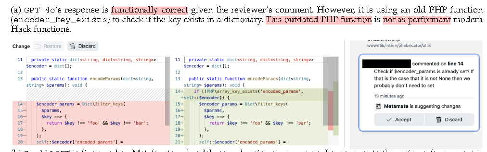

2. SmallLSFT使用了 Hack function （Hack是由Facebook开发的一种编程语言，它扩展了PHP，增加了静态类型等特性，同时保持了与PHP的向后兼容性）

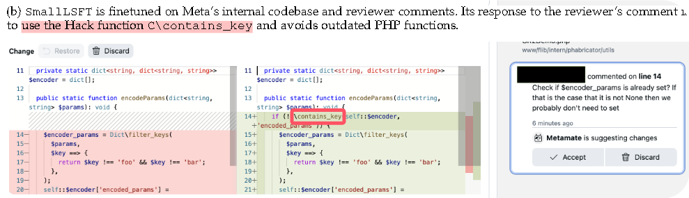

3. LargeLSFT 使用了Hack function、使用语言特性简化代码、并且遵从meta的编程规范。

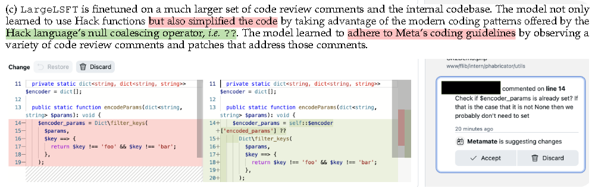


### 模型方法

**GPT-4o刚问世时参数量约为200B，GPT-4o-mini (gpt-4o-2024-05-13) 的参数量只约为8B**


用**LLaMA 3.1 70B**作为基础模型


**SmallLSFT**:Supervised Fine Tuned model with small data set

首先用如Hack等代码**接着进行预训练**

然后构建数据集进行sft


1. 从meta平台随机挖掘**\<review_comment, patch\>数据**
1. **排除在linter、test、build失败**的数据、最后得到**5k**
1. **两个专家**分别标注，得到高质量数据（r**eview_comment确实需要fix、review_comment提供了清晰的指令建议、对应的patch fix确实解决了问题**）
1. 最后得到**2.9k的高质量数据**点，进行sft（context size 16k）


> 这个过滤标准，是否可以借鉴为使用llm进行相关数据过滤


**LargeLSFT**: Supervised Fine Tuning with a large data set based on human and AI labeled data

1. **遵循上述SmallLSFT人工标注过程**，雇佣平均7个标注员标注了14周，最后得到**18k数据**

2. **随机**选取**7.5k**数据，对**Llama 8B微调**，从而**充当分类器**
3. 再次**随机选取非重叠数据700**进行**分类器评估**，**precision是0.88**，recall是0.75，accuracy是79%
4. 用分类器**扩充了 46k** 数据
5. 结合使用18k人工标注数据、46k模型分类数据进行sft（context size 128k）


gpt4o、Llama-SFT的**评估数据集**：

​	同养遵循上述SmallLSFT人工标注过程，最终得到了**206**个高质量数据


### 具体实验及结果

总共2个方面实验


**1.性能比对实验**： 如下图，LargeLSFT超出GPT-4o


**精确匹配( Exact Match，EM )**

**检查AI生成的补丁内容是否与人类所推送的最终内容完全匹配。**

从理论上讲，一个程序可以通过多种方式进行编写。在简单层面上，人工智能生成的程序可能与真实程序(人类生成的程序)在变量名上存在差异，而逻辑仍然是一样的。

因此，EM具有极大的限制性，在检查AI生成补丁的准确性时可以被认为是一个**下界**。


**成功补丁生成( Success Patch Generation，SPG )**

该指标**衡量模型是否能够首先生成补丁，以及系统是否能够将AI生成的补丁应用到程序中**。

由于各种原因无法生成或应用补丁：LLM调用错误、生成补丁中的行数不匹配等。测量这个指标有助于我们理解那些不一定与补丁精度相关的失效场景。


**2.实际生产实验**:

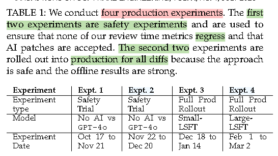

**评估指标：**

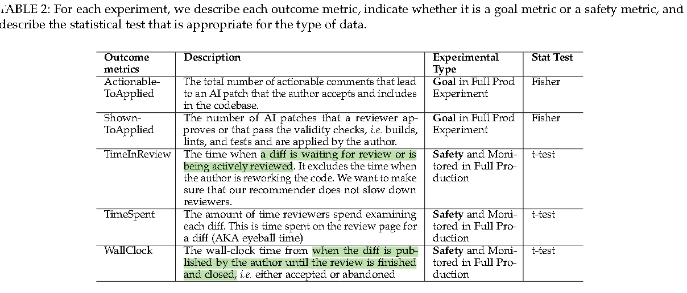


如下图：

Meta的代码审查评论全集首先通过一个可操作性分类器进行过滤。

如果评论是可操作的，则会进行有效性检查，即判断AI生成的补丁是否能够成功构建并通过代码检查器（linters）和测试。

若检查通过，则该评论会在用户界面（UX）中显示，并可被接受（即获得辅助）；否则，该评论将被丢弃。

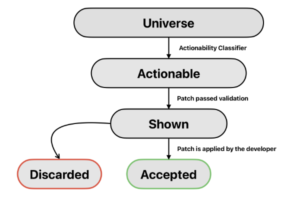

由此，产生了“**ActionableToApplied**”以及“**ShownToApplied**”指标。


至于

“TimeInReview”、“TimeSpent”、“WallClock”

- TimeInReview（审查时长） ：指代码差异（diff）处于审查状态的总时间，包括等待审查和正在被积极审查的时间。
- TimeSpent（实际查看时间） ：指**审查者在Phabricator（代码审查工具）中积极查看审查内容的时间**，即“ **eyeball time”（眼球时间，实际关注时间）。**
- WallClock（挂钟时间） ：指从作者发布代码差异到补丁关闭（通常是被接受或放弃）的总时间，包括审查时长和作者进行修复的时间。


最后是

> t-test: 
>
> p值判断标准 ：通常以显著性水平α=0.05为阈值。若p < α，认为两组均值有显著差异；若p ≥ α，不拒绝原假设，尚不能认为差异显著。
>
>
> Fisher的p值判定标准同样。


实验结果：

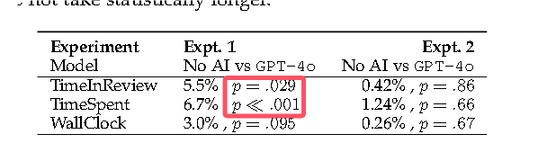

TimeInReview（审查时长）和TimeSpent（实际查看时间）均有明显时间延长，发生倒退现象。


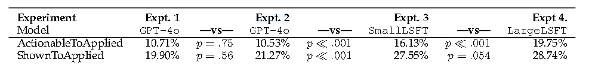

 SmallLSFT 和 LargeLSFT 的 ActionableToApplied 中分别比 GPT-4o高5.6pp 和 9.22pp 有了实质性改进。


与 SmallLSFT 相比，我们没有看到 ShownToApplied （28.74%，p = .054） 有任何统计学上的显着变化。我们怀疑这是因为两者在 UX 中实际显示的差异数量相似。

鉴于未来 LargeLSFT 的离线准确率更高，我们计划尝试展示更多的 AI 建议补丁


### 提交一个pr要经历什么？

1.linter 静态分析工具

静态分析工具可以 强制编码风格标准、自动检查语法错误、识别潜在漏洞、提供可读性

2.tests 运行代码进行测试

分为单元测试、集成测试（单元模块间）、端到端测试（用户视角从输入到输出）

3.build check 验证代码能否被编译与构建

分为语法检查、 依赖检查、 代码签名：验证生成代码的真实性和完整性。


## 数据过滤-ClearCRC

目前有俩数据集，一是CodeReviewer、另一个是ClearCRC, 

后者是前者review comment generation任务的验证集中置信度 5%-95%随机抽取、然后按新标准人工标注的数据。


> **Llama3-70B-Instruct**和**CodeLlama-34B-Instruct**。
>
> 原来是上面两个模型，  现在用新的模型做过滤， 也应该测评下新的模型？
>
> 


首先，手动尝试效果

>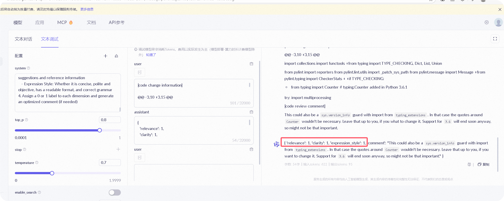
>提示词：
>
># Role and Task
>You are an expert assistant specializing in evaluating the quality of code review comments. Your core task is to assess code review comments against three dimensions (1 for compliance, 0 for non-compliance) based on the provided code change information.
>
>## Comment Quality Standards
>
>**Relevance:** (1) Relevant to the code change. (2) Specify the relevant location. (3) Correctly understand the code change. Mark relevance as "1" if it meets (1) and one of (2) (3), other wise mark as "0"
>
>**Informativeness:** (1) Clear intention. (2) Provide context information. (3) Provide suggestions for the next step. (4) Provide reference information. Mark informativeness as "1" if it meets (1) (2) and one of (3) (4), other wise mark as "0"
>
>**Expression:** (1) Concise and to-the-point. (2) Polite and objective. (3) Readable format. (4) Proper syntax and grammar. expression as "1" if it meets (1) (2) and one of (3) (4), other wise mark as "0".
>
>## Input/Output Format
>### Input Format:
>[code change information]
>Code change difference content
>
>[code review comment]
>Comment to be evaluated
>
>### Output Format:
>{
>  'relevance': 0 or 1,
>  'clarity': 0 or 1,
>  'expression_style': 0 or 1,
>  'comment': "Optimized comment (if needed)"
>}
>
>## Thinking Framework
>1. Understand and specific the code change content
>
>2. Analyze the intent and potential impact of the code change
>
>3. Evaluate whether the existing comment meets the three comment quality standards dimensions:
>   
>   Relevance、Clarity、Expression Style
>   
>4. Assign a 0 or 1 label to each dimension and generate an optimized comment (if needed)
>
>## Input
>[code change information]
>{patch}
>
>[code review comment]
>{msg}


从已经标注好的数据集中选择  100条， 调整prompt，进行测评

model_name="qwen-turbo-2025-07-15",

max_tokens=20,

temperature=0.6

>Response: {'relevance': 1, 'clarity': 0, 'expression_style': 1, 'comment': 'The return statement on line 213 should return an empty dict instead of overriding the pylint disable comment. This ensures consistent behavior and avoids potential confusion from disabling pylint checks without justification.'}
>{
>  "relevance": {
>    "precision": `0.872093023255814`,  验证precision = TP / (TP + FP) 75 /(75+11)=0.87
>    "recall": 0.8928571428571429,
>    "f1": 0.8823529411764706,
>    "accuracy": `0.8`
>  },
>  "clarity": {
>    "precision": `0.94`,
>    "recall": 0.6025641025641025,
>    "f1": 0.734375,
>    "accuracy": `0.66`
>  },
>  "expression_style": {
>    "precision": `0.9587628865979382`,
>    "recall": 0.96875,
>    "f1": 0.9637305699481865,
>    "accuracy": `0.93`
>  }
>}
>Results saved to result_content.jsonl
>Results saved to result_metric.jsonl

初步来看，以这种标准过滤出ClearCRC可行

>max_tokens=20,
>
>temperature=0.1
>
>{
>  "relevance": {
>    "precision": `0.9176470588235294`,
>    "recall": 0.9069767441860465,
>    "f1": 0.9122807017543859,
>    "accuracy": `0.8484848484848485`
>  },
>  "clarity": {
>    "precision": `0.8958333333333334`,
>    "recall": 0.5584415584415584,
>    "f1": 0.688,
>    "accuracy": `0.6060606060606061`
>  },
>  "expression_style": {
>    "precision": `0.9680851063829787`,
>    "recall": 0.9479166666666666,
>    "f1": 0.9578947368421052,
>    "accuracy": `0.9191919191919192`
>  }
>}


首先使用ClearCRC标准过滤 几条，用于后面baseline及改造探索


> ---------
> 
>    old_hunk:
>    
>    ---------
> @@ -675,7 +675,8 @@ def _dispatch_to_method_handler(self, attr_name, self_arg,
>       method_handler = self._find_handler(
>           "method_%s_%s" % (type_name, attr_name), kwargs)
>       if method_handler is None:
> \-            if (attr_name in TypeSlots.method_name_to_slot
> \+            # in this case we don't need the real directives on the call to get_slot_table
>   \+            if (attr_name in TypeSlots.get_slot_table({}).method_name_to_slot
>
>-----------
>
>     code review comment:
>
>    -------------
>     I'd rather make this as fast as before again. This is called a _lot_. We can have a global set `TypeSlots.special_method_names` or just use the default `method_name_to_slot` dict for it. In fact, since `old_binops=False` should be the default (also for Cython utility code, for example), we'll most likely need that setup anyway, so it won't hurt much to instantiate it on import.
>
>    ---------------------
>
>     revised code:
>     
>    ------------------
>
>      if method_handler is None:
>             \# in this case we don't need the real directives on the call to get_slot_table
>     \+            if (attr_name in TypeSlots.special_method_names
>                     or attr_name in ['__new__', '__class__']):
>                 method_handler = self._find_handler(
>                     "slot%s" % attr_name, kwargs)

初步学习了langchain与langgraph


## baseline

尝试使用ClearCRC所提供的过滤后的数据， 我仅仅使用 relevent、information、expression均为1的 数据

然后同时改进prompt，严格格式化输入输出：
最终，当使用平滑方法7的BLEU时，有较明显高质量

注意： 这里clearCRC中给的数据没有 相关上下文文件参考即oldfile参考

共223个样本

平均bleu分数：0.0876

平均分: 0.0876
最低分: 0.0  （只有两个0.0，都是API调用失败）
最高分: 0.1925
中位数: 0.083


重新标定任务为  基于 old_diff_hunk生成 code review comment,并进一步生成revised code

换为采用CodeReviewer的CodeRefinement的数据集，刚好上面三个数据都包含在内


1.清洗旧22年数据集(效果不好)

2.造一个23-25年高star github project 新评估数据集（22年数据太旧）

3.提出multi-agent方法，（关于review and revised联动的研究不彻底，且agent有利于适配该复杂自动化过程，各个流程里 极大适配该任务本身地制造agent）

4.评估下基线方法如DISCOVER、 CodeReviewer、普通llm、 multi-agent


一个controller agent决定进行哪个流程

根据memory做决定，并且memroy 需要精简

每个流程有多个agent， 这些agent 宏观上靠memory进行间接交互， 然后各司其职，并且相互间可以求救（但该求救信息不记入大memory）


这种复杂流程适用于agent，而目前code review关于这方面研究非常匮乏

各个流程里 极大适配该任务本身地制造agent


> 可见这个code review comment生成的效果并不好

> 我认为应该 
>
> 需要明确一个好的代码，一个能够让reviewer喜爱的代码库长什么样子？再据此生成review comment，然后用clearCRC的标准再提炼下
>

查找bug、

代码改进（在可读性、注释、一致性、死代码删除等方面）、

可替代的解决方案、

知识传授、


review comment generation

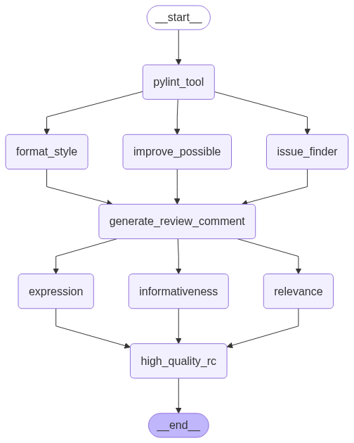


>https://zhuanlan.zhihu.com/p/1919322820669841788
>
>1. **Black + Flake8** 用于保持格式一致和代码审查
>2. **mypy** 用于类型检查
>3. **pre-commit** 用于自动化质量检查
>4. [Bandit](https://zhida.zhihu.com/search?content_id=259316451&content_type=Article&match_order=1&q=Bandit&zhida_source=entity)  ...

## 手动尝试效果


>
>
># Role and Task
>
>You are an expert assistant specializing in generate high quality code review comments. Your core task is to generate code review comments based on the provided code change information and context. Let's think it step by step.
>
>## Comment Quality Standards
>
>**Relevance:** (1) Relevant to the code change. (2) Specify the relevant location. (3) Correctly understand the code change. Mark good relevance if it meets (1) and one of (2) (3), otherwise bad.
>
>**Informativeness:** (1) Clear intention. (2) Provide context information. (3) Provide suggestions for the next step. (4) Provide reference information. Mark good informativeness if it meets (1) (2) and one of (3) (4), otherwise bad
>
>**Expression:** (1) Concise and to-the-point. (2) Polite and objective. (3) Readable format. (4) Proper syntax and grammar. Mark good expression if it meets (1) (2) and one of (3) (4), otherwise bad.
>
>## Possible Thinking Framework
>
>1. recall the general code review comment generation knowledge
>2. Understand and specific the code change content
>3. Analyze the intent and potential impact of the code change
>4. generate the possible code review comment,you can recall if there is similarity situation and what the answer of it
>5. improve the quality of code review comment by checking the Comment Quality Standards
>6. give the END code review comment
>
>## Input/Output Format
>
>### Input Format:
>
>[context] the context
>
>[code change information] Code change difference content
>
>### Output Format:
>
>{ 'comment': "the high quality code review comment" }
>
>## Input
>
>[context]
>
>[code change information]


### 代码风格  注释case

####  oldf

```python
# -*- coding: utf-8 -*-
#
# Copyright 2012-2015 Spotify AB
#
# Licensed under the Apache License, Version 2.0 (the "License");
# you may not use this file except in compliance with the License.
# You may obtain a copy of the License at
#
# http://www.apache.org/licenses/LICENSE-2.0
#
# Unless required by applicable law or agreed to in writing, software
# distributed under the License is distributed on an "AS IS" BASIS,
# WITHOUT WARRANTIES OR CONDITIONS OF ANY KIND, either express or implied.
# See the License for the specific language governing permissions and
# limitations under the License.
#
"""
Simple REST server that takes commands in a JSON payload
Interface to the :py:class:`~luigi.scheduler.Scheduler` class.
See :doc:`/central_scheduler` for more info.
"""
#
# Description: Added codes for visualization of how long each task takes
# running-time until it reaches the next status (failed or done)
# At "{base_url}/tasklist", all completed(failed or done) tasks are shown.
# At "{base_url}/tasklist", a user can select one specific task to see
# how its running-time has changed over time.
# At "{base_url}/tasklist/{task_name}", it visualizes a multi-bar graph
# that represents the changes of the running-time for a selected task
# up to the next status (failed or done).
# This visualization let us know how the running-time of the specific task
# has changed over time.
#
# Copyright 2015 Naver Corp.
# Author Yeseul Park (yeseul.park@navercorp.com)
#

import atexit
import datetime
import json
import logging
import os
import signal
import sys
import time

import pkg_resources
import tornado.httpserver
import tornado.ioloop
import tornado.netutil
import tornado.web

from luigi import Config, parameter
from luigi.scheduler import Scheduler, RPC_METHODS

logger = logging.getLogger("luigi.server")


class cors(Config):
    enabled = parameter.BoolParameter(
        default=False,
        description='Enables CORS support.')
    allowed_origins = parameter.ListParameter(
        default=[],
        description='A list of allowed origins. Used only if `allow_any_origin` is false.')
    allow_any_origin = parameter.BoolParameter(
        default=False,
        description='Accepts requests from any origin.')
    allow_null_origin = parameter.BoolParameter(
        default=False,
        description='Allows the request to set `null` value of the `Origin` header.')
    max_age = parameter.IntParameter(
        default=86400,
        description='Content of `Access-Control-Max-Age`.')
    allowed_methods = parameter.Parameter(
        default='GET, OPTIONS',
        description='Content of `Access-Control-Allow-Methods`.')
    allowed_headers = parameter.Parameter(
        default='Accept, Content-Type, Origin',
        description='Content of `Access-Control-Allow-Headers`.')
    exposed_headers = parameter.Parameter(
        default='',
        description='Content of `Access-Control-Expose-Headers`.')
    allow_credentials = parameter.BoolParameter(
        default=False,
        description='Indicates that the actual request can include user credentials.')

    def __init__(self, *args, **kwargs):
        super(cors, self).__init__(*args, **kwargs)
        self.allowed_origins = set(i for i in self.allowed_origins if i not in ['*', 'null'])


class RPCHandler(tornado.web.RequestHandler):
    """
    Handle remote scheduling calls using rpc.RemoteSchedulerResponder.
    """

    def __init__(self, *args, **kwargs):
        super(RPCHandler, self).__init__(*args, **kwargs)
        self._cors_config = cors()

    def initialize(self, scheduler):
        self._scheduler = scheduler

    def options(self, *args):
        if self._cors_config.enabled:
            self._handle_cors_preflight()

        self.set_status(204)
        self.finish()

    def get(self, method):
        if method not in RPC_METHODS:
            self.send_error(404)
            return
        payload = self.get_argument('data', default="{}")
        arguments = json.loads(payload)

        if hasattr(self._scheduler, method):
            result = getattr(self._scheduler, method)(**arguments)

            if self._cors_config.enabled:
                self._handle_cors()

            self.write({"response": result})  # wrap all json response in a dictionary
        else:
            self.send_error(404)

    post = get

    def _handle_cors_preflight(self):
        origin = self.request.headers.get('Origin')
        if not origin:
            return

        if origin == 'null':
            if self._cors_config.allow_null_origin:
                self.set_header('Access-Control-Allow-Origin', 'null')
                self._set_other_cors_headers()
        else:
            if self._cors_config.allow_any_origin:
                self.set_header('Access-Control-Allow-Origin', '*')
                self._set_other_cors_headers()
            elif origin in self._cors_config.allowed_origins:
                self.set_header('Access-Control-Allow-Origin', origin)
                self._set_other_cors_headers()

    def _handle_cors(self):
        origin = self.request.headers.get('Origin')
        if not origin:
            return

        if origin == 'null':
            if self._cors_config.allow_null_origin:
                self.set_header('Access-Control-Allow-Origin', 'null')
        else:
            if self._cors_config.allow_any_origin:
                self.set_header('Access-Control-Allow-Origin', '*')
            elif origin in self._cors_config.allowed_origins:
                self.set_header('Access-Control-Allow-Origin', origin)
                self.set_header('Vary', 'Origin')

    def _set_other_cors_headers(self):
        self.set_header('Access-Control-Max-Age', str(self._cors_config.max_age))
        self.set_header('Access-Control-Allow-Methods', self._cors_config.allowed_methods)
        self.set_header('Access-Control-Allow-Headers', self._cors_config.allowed_headers)
        if self._cors_config.allow_credentials:
            self.set_header('Access-Control-Allow-Credentials', 'true')
        if self._cors_config.exposed_headers:
            self.set_header('Access-Control-Expose-Headers', self._cors_config.exposed_headers)


class BaseTaskHistoryHandler(tornado.web.RequestHandler):
    def initialize(self, scheduler):
        self._scheduler = scheduler

    def get_template_path(self):
        return pkg_resources.resource_filename(__name__, 'templates')


class AllRunHandler(BaseTaskHistoryHandler):
    def get(self):
        all_tasks = self._scheduler.task_history.find_all_runs()
        tasknames = [task.name for task in all_tasks]
        # show all tasks with their name list to be selected
        # why all tasks? the duration of the event history of a selected task
        # can be more than 24 hours.
        self.render("menu.html", tasknames=tasknames)


class SelectedRunHandler(BaseTaskHistoryHandler):
    def get(self, name):
        statusResults = {}
        taskResults = []
        # get all tasks that has been updated
        all_tasks = self._scheduler.task_history.find_all_runs()
        # get events history for all tasks
        all_tasks_event_history = self._scheduler.task_history.find_all_events()

        # build the dictionary tasks with index: id, value: task_name
        tasks = {task.id: str(task.name) for task in all_tasks}

        for task in all_tasks_event_history:
            # if the name of user-selected task is in tasks, get its task_id
            if tasks.get(task.task_id) == str(name):
                status = str(task.event_name)
                if status not in statusResults:
                    statusResults[status] = []
                # append the id, task_id, ts, y with 0, next_process with null
                # for the status(running/failed/done) of the selected task
                statusResults[status].append(({
                                                  'id': str(task.id), 'task_id': str(task.task_id),
                                                  'x': from_utc(str(task.ts)), 'y': 0, 'next_process': ''}))
                # append the id, task_name, task_id, status, datetime, timestamp
                # for the selected task
                taskResults.append({
                    'id': str(task.id), 'taskName': str(name), 'task_id': str(task.task_id),
                    'status': str(task.event_name), 'datetime': str(task.ts),
                    'timestamp': from_utc(str(task.ts))})
        statusResults = json.dumps(statusResults)
        taskResults = json.dumps(taskResults)
        statusResults = tornado.escape.xhtml_unescape(str(statusResults))
        taskResults = tornado.escape.xhtml_unescape(str(taskResults))
        self.render('history.html', name=name, statusResults=statusResults, taskResults=taskResults)


def from_utc(utcTime, fmt=None):
    """convert UTC time string to time.struct_time: change datetime.datetime to time, return time.struct_time type"""
    if fmt is None:
        try_formats = ["%Y-%m-%d %H:%M:%S.%f", "%Y-%m-%d %H:%M:%S"]
    else:
        try_formats = [fmt]

    for fmt in try_formats:
        try:
            time_struct = datetime.datetime.strptime(utcTime, fmt)
        except ValueError:
            pass
        else:
            date = int(time.mktime(time_struct.timetuple()))
            return date
    else:
        raise ValueError("No UTC format matches {}".format(utcTime))


class RecentRunHandler(BaseTaskHistoryHandler):
    def get(self):
        tasks = self._scheduler.task_history.find_latest_runs()
        self.render("recent.html", tasks=tasks)


class ByNameHandler(BaseTaskHistoryHandler):
    def get(self, name):
        tasks = self._scheduler.task_history.find_all_by_name(name)
        self.render("recent.html", tasks=tasks)


class ByIdHandler(BaseTaskHistoryHandler):
    def get(self, id):
        task = self._scheduler.task_history.find_task_by_id(id)
        self.render("show.html", task=task)


class ByParamsHandler(BaseTaskHistoryHandler):
    def get(self, name):
        payload = self.get_argument('data', default="{}")
        arguments = json.loads(payload)
        tasks = self._scheduler.task_history.find_all_by_parameters(name, session=None, **arguments)
        self.render("recent.html", tasks=tasks)


class RootPathHandler(BaseTaskHistoryHandler):
    def get(self):
        self.redirect("/static/visualiser/index.html")

    def head(self):
        self.set_status(204)
        self.finish()


class MetricsHandler(tornado.web.RequestHandler):
    def initialize(self, scheduler):
        self._scheduler = scheduler

    def get(self):
        metrics_collector = self._scheduler._state._metrics_collector
        metrics = metrics_collector.generate_latest()
        if metrics:
            metrics_collector.configure_http_handler(self)
            self.write(metrics)


def app(scheduler):
    settings = {"static_path": os.path.join(os.path.dirname(__file__), "static"),
                "unescape": tornado.escape.xhtml_unescape,
                "compress_response": True,
                }
    handlers = [
        (r'/api/(.*)', RPCHandler, {"scheduler": scheduler}),
        (r'/', RootPathHandler, {'scheduler': scheduler}),
        (r'/tasklist', AllRunHandler, {'scheduler': scheduler}),
        (r'/tasklist/(.*?)', SelectedRunHandler, {'scheduler': scheduler}),
        (r'/history', RecentRunHandler, {'scheduler': scheduler}),
        (r'/history/by_name/(.*?)', ByNameHandler, {'scheduler': scheduler}),
        (r'/history/by_id/(.*?)', ByIdHandler, {'scheduler': scheduler}),
        (r'/history/by_params/(.*?)', ByParamsHandler, {'scheduler': scheduler}),
        (r'/metrics', MetricsHandler, {'scheduler': scheduler})
    ]
    api_app = tornado.web.Application(handlers, **settings)
    return api_app


def _init_api(scheduler, api_port=None, address=None, unix_socket=None):
    api_app = app(scheduler)
    if unix_socket is not None:
        api_sockets = [tornado.netutil.bind_unix_socket(unix_socket)]
    else:
        api_sockets = tornado.netutil.bind_sockets(api_port, address=address)
    server = tornado.httpserver.HTTPServer(api_app)
    server.add_sockets(api_sockets)

    # Return the bound socket names.  Useful for connecting client in test scenarios.
    return [s.getsockname() for s in api_sockets]


def run(api_port=8082, address=None, unix_socket=None, scheduler=None):
    """
    Runs one instance of the API server.
    """
    if scheduler is None:
        scheduler = Scheduler()

    # load scheduler state
    scheduler.load()

    _init_api(
        scheduler=scheduler,
        api_port=api_port,
        address=address,
        unix_socket=unix_socket,
    )

    # prune work DAG every 60 seconds
    pruner = tornado.ioloop.PeriodicCallback(scheduler.prune, 60000)
    pruner.start()

    def shutdown_handler(signum, frame):
        exit_handler()
        sys.exit(0)

    @atexit.register
    def exit_handler():
        logger.info("Scheduler instance shutting down")
        scheduler.dump()
        stop()

    signal.signal(signal.SIGINT, shutdown_handler)
    signal.signal(signal.SIGTERM, shutdown_handler)
    if os.name == 'nt':
        signal.signal(signal.SIGBREAK, shutdown_handler)
    else:
        signal.signal(signal.SIGQUIT, shutdown_handler)

    logger.info("Scheduler starting up")

    tornado.ioloop.IOLoop.instance().start()


def stop():
    tornado.ioloop.IOLoop.instance().stop()


if __name__ == "__main__":
    run()

```


```python
# 最相关的上下文
class RootPathHandler(BaseTaskHistoryHandler):
    def get(self):
        self.redirect("/static/visualiser/index.html")

    def head(self):
        self.set_status(204)
        self.finish()

```

####  old_hunk

```python
@@ -273,6 +273,10 @@ class RootPathHandler(BaseTaskHistoryHandler):
     def get(self):
         self.redirect("/static/visualiser/index.html")
 
+    def head(self):
```

#### code review comment

Is the **name "head" a convention for health checking?** Regardless it caught me by surprise, maybe **add some docs to this function** on why it exist? It should **also say what 204.**

#### revised_code

```python
         self.redirect("/static/visualiser/index.html")
     def head(self):
+        """HEAD endpoint for health checking the scheduler"""
         self.set_status(204)
         self.finish()
```

> 这个revised_code只回答了第一个问题，第二个问题 It should also say what 204.也没回答  no content


选择模型 qwen-plus-2025-07-28

首先模型认为符合ClearCRC标准

{
  "relevance": 1,
  "clarity": 1,
  "expression_style": 1,
  "comment": "Is the name 'head' a convention for health checking? Regardless, it caught me by surprise. Please add documentation explaining why this method exists and what the 204 status code means."
}

> 然后让模型自己生成reveiw comment
>
> ># Role and Task
> >
> >You are an expert assistant specializing in generate high quality code review comments. Your core task is to generate code review comments based on the provided code change information and context. Let's think it step by step.
> >
> >## Comment Quality Standards
> >
> >**Relevance:** (1) Relevant to the code change. (2) Specify the relevant location. (3) Correctly understand the code change. Mark good relevance if it meets (1) and one of (2) (3), otherwise bad.
> >
> >**Informativeness:** (1) Clear intention. (2) Provide context information. (3) Provide suggestions for the next step. (4) Provide reference information. Mark good informativeness if it meets (1) (2) and one of (3) (4), otherwise bad
> >
> >**Expression:** (1) Concise and to-the-point. (2) Polite and objective. (3) Readable format. (4) Proper syntax and grammar. Mark good expression if it meets (1) (2) and one of (3) (4), otherwise bad.
> >
> >## Input/Output Format
> >
> >### Input Format:
> >
> >[context]
> >the context
> >
> >[code change information]
> >Code change difference content
> >
> >### Output Format:
> >
> >{
> >'comment': "the high quality code review comment"
> >}
> >
> >## Input
> >
> >[context]
> >the context
> >
> >[code change information]
> >Code change difference content
>
> 

将context

```python
# 最相关的上下文
class RootPathHandler(BaseTaskHistoryHandler):
    def get(self):
        self.redirect("/static/visualiser/index.html")

    def head(self):
        self.set_status(204)
        self.finish()

```

code change information]

```python
@@ -273,6 +273,10 @@ class RootPathHandler(BaseTaskHistoryHandler):
     def get(self):
         self.redirect("/static/visualiser/index.html")
 
+    def head(self):
```

送入llm后，得到很好的效果。(借鉴了之前的了历史， 或许这里可以作为数据过滤的方法)

{ "comment": "**Adding a HEAD endpoint for health checks** is a good practice. The **204 No Content status** is appropriate here since HEAD requests shouldn't return response bodies. Please **add a docstring explaining this method's purpose and the significance of the 204 status code** to help future maintainers understand its role in the health check workflow." }


> Okay, let's tackle this. The user wants me to generate a high-quality code review comment based on the provided context and code change.
>
> **`First`, I need to understand the context.** The context shows a class called RootPathHandler which inherits from BaseTaskHistoryHandler. There's a get method that redirects to a visualizer index. Then there's a head method that sets the status to 204 and finishes.
>
> The code change information is a diff showing that the head method was added. **The diff line is + def head(self):, but the context shows the full method including self.set_status(204) and self.finish(). So the actual change is adding the head method with those two lines.**
>
> **`Now`, applying the quality standards**. **For relevance**, the comment must be relevant to the code change, specify location, and correctly `understand` the change. The code change is adding a head method for health checks, returning 204. So the comment `should address why` head is used, maybe the 204 status.
>
> **Informativeness** needs clear intention, context, and either next steps or references. The comment should `explain that HEAD is used for health checks, mention the 204 status` (No Content), and `suggest adding a docstring` to clarify purpose.
>
> **Expression** should be concise, polite, readable, and grammatically correct. Avoid being too wordy, use polite language like "`please consider`" instead of demanding.
>
> **Looking at the previous example in the history, the assistant's comment was: "Is the name 'head' a convention for health checking? Regardless, it caught me by surprise. Please add documentation explaining why this method exists and what the 204 status code means."**
>
> **But maybe we can improve it.** The context shows that head sets 204, so the comment should note that 204 is correct for HEAD requests (since they shouldn't have a body). Also, confirming that using 'head' here is standard for health checks in the framework (like Tornado, since it uses self.set_status and self.finish).
>
> So a good comment would:
>
> - Note that adding the HEAD method is good for health checks.
> - Confirm 204 is appropriate (HEAD responses must not have a body, 204 is safe).
> - Suggest adding a docstring to explain its purpose, especially since it's not obvious to reviewers.
>
> **Check relevance: mentions the head method (location), understands it's for health checks (correct understanding). Meets relevance.**
>
> **Informativeness: clear intent (suggest doc), context (HEAD for health checks, 204 status), next step (add docstring). Meets all.**
>
> **Expression: concise, polite ("please consider"), proper grammar. Good.**
>
> So the comment could be: "Adding a HEAD handler for health checks is a good practice. The 204 No Content status is appropriate here since HEAD responses must not include a body. Please add a docstring to clarify the purpose of this method, as it may not be immediately obvious to reviewers."
>
> Check if it meets all criteria. Relevance: yes. Informativeness: explains why 204 is correct (context), suggests docstring (next step). Expression: polite, concise.
>
> Yes, this should be a high-quality comment.


#### 原始输出

{
    "comment": 

"Nice addition of the HEAD method for the RootPathHandler. To maintain HTTP semantics consistency with the GET method (which redirects to '/static/visualiser/index.html'), consider having the HEAD method also trigger a redirect. HEAD requests should return the same headers as GET but without the body. Using `self.redirect()` would achieve this:\n\n```python\ndef head(self):\n    self.redirect(\"/static/visualiser/index.html\")\n```\n\nThis ensures clients receive the expected 302 redirect status and location for HEAD requests, aligning with standard HTTP behavior rather than returning 204 No Content which doesn't reflect the redirect nature of this endpoint."
}

```
Let me analyze the provided input to generate a high-quality code review comment.

Input Analysis
Context
The context shows a class RootPathHandler that inherits from BaseTaskHistoryHandler. It currently has a get method that redirects to "/static/visualiser/index.html".

class RootPathHandler(BaseTaskHistoryHandler):
    def get(self):
        self.redirect("/static/visualiser/index.html")

    def head(self):
        self.set_status(204)
        self.finish()

Code Change Information
The code change information shows a diff where a head method is being added to the RootPathHandler class:

@@ -273,6 +273,10 @@ class RootPathHandler(BaseTaskHistoryHandler):
     def get(self):
         self.redirect("/static/visualiser/index.html")
 
+    def head(self):
Wait, this seems odd. The context already shows the head method with its implementation, but the diff is showing only the beginning of the head method being added. This suggests that either:

The context is showing the code after the change, but the diff is incomplete
Or there's a mismatch between the context and the diff
Let me double-check:

The context shows:

class RootPathHandler(BaseTaskHistoryHandler):
    def get(self):
        self.redirect("/static/visualiser/index.html")

    def head(self):
        self.set_status(204)
        self.finish()

The diff shows:

@@ -273,6 +273,10 @@ class RootPathHandler(BaseTaskHistoryHandler):
     def get(self):
         self.redirect("/static/visualiser/index.html")
 
+    def head(self):
This suggests that the diff is incomplete - it only shows the beginning of the head method being added, but doesn't show the implementation. However, the context already includes the full implementation of the head method.

----------------------------------
Actually, I think I understand what's happening. The context is showing the code before the change, and the diff is showing what's being added. But there's a mistake in how the information is presented
---------------------------------

Let me reinterpret:

The context shows the class definition with just the get method (without the head method). Then the diff is showing that a head method is being added. But the diff output is cut off and doesn't show the full implementation of the head method.

Actually, looking more carefully, the context section shows the class with both get and head methods, but the diff shows only the addition of the head method declaration. This is confusing.

Wait, I think I've figured it out. The context section is showing what the code looks like after the change, but the diff is showing the specific changes being made. The diff is incomplete - it only shows the addition of the def head(self): line, but not the implementation body.

Given the information available, I'll assume that the change is adding a head method to the RootPathHandler class, and the implementation of that method is:

def head(self):
    self.set_status(204)
    self.finish()

This is a common pattern for handling HEAD requests in web frameworks like Tornado (which this appears to be, given the use of self.redirect, self.set_status, and self.finish).

Analysis for Code Review Comment
Now, let's analyze this change to create a high-quality code review comment.
--------------------------------------------------
Relevance
The comment should be relevant to the code change - adding a HEAD method to handle HEAD requests.
It should specify the relevant location - the RootPathHandler class.
It should correctly understand the code change - adding a method to handle HEAD requests with a 204 No Content response.
-------------------------------------------------
Informativeness
Clear intention - explain why this change is good or if there are concerns.
Provide context information - explain what HEAD requests are and why they might be needed.
Provide suggestions for the next step - if there are improvements or considerations.
Provide reference information - link to relevant documentation or standards.
-------------------------------------------------
Expression
Concise and to-the-point - don't add unnecessary fluff.
Polite and objective - use professional language.
Readable format - well-structured comment.
Proper syntax and grammar - correct English.
Creating the Comment
Let me craft a comment that meets these standards:

The change adds a HEAD method to the RootPathHandler class. HEAD requests are similar to GET requests but only return headers, not the response body. This is useful for checking if a resource exists or getting metadata about a resource without transferring the full content.

In web frameworks like Tornado (which this appears to be), implementing a HEAD method is a good practice for completeness. The implementation sets a 204 No Content status and finishes the request, which is appropriate for a HEAD request to this endpoint.

However, I should check if this is the most appropriate response. A 204 No Content response is typically used when there is no content to return, but for a HEAD request to a resource that would return a redirect on a GET request, a 200 OK might be more appropriate, or perhaps mirroring the GET response's status code (which would be a 302 Found for a redirect).

Actually, let me double-check HTTP semantics for HEAD requests:

According to RFC 7231 (HTTP/1.1), the HEAD method is identical to GET except that the server MUST NOT send a message body in the response. The server should return the same headers it would have returned for a GET request, but without the body.

In this case, for a GET request, the server redirects to "/static/visualiser/index.html" with a 302 Found status. For a HEAD request, the server should return the same headers (including the Location header for the redirect) but without the body, and with a status code appropriate for the HEAD request.

A 204 No Content doesn't seem right here. A 200 OK would be more appropriate if the resource exists, or a 302 Found to indicate the redirect (since that's what would happen with a GET request).

Actually, let me check some references:

According to MDN Web Docs on HEAD: "The HEAD method asks for a response identical to that of a GET request, but without the response body."

And for status codes:

200 OK: The request has succeeded.
302 Found: The target resource resides temporarily under a different URI.
Given that a GET request to this endpoint results in a 302 redirect, a HEAD request should also return a 302 redirect (with the Location header but without the body).

So the current implementation of returning 204 No Content for a HEAD request seems incorrect. It should probably return 302 Found with the Location header set to "/static/visualiser/index.html", similar to what happens in the GET method.

Actually, let me double-check Tornado's behavior. In Tornado, when you call self.redirect(), it sets the status code to 302 (or whatever redirect code you specify) and sets the Location header.

For a HEAD request, if we want to mirror the behavior of the GET request, we should also set the redirect. But since there's no body to render, we can just set the status and headers.

So the HEAD method should probably be:

1
2
3
⌄
def head(self):
    self.redirect("/static/visualiser/index.html", status=302)

This would set the appropriate status code and Location header, but not render the body (since it's a HEAD request).

Wait, I need to check how Tornado handles this. In Tornado, the redirect method works for both GET and HEAD requests. It sets the status code and Location header, and for GET requests, it also writes a default redirect message to the body. For HEAD requests, it should just set the headers without writing to the body.

So actually, the simplest implementation might be:

1
2
3
⌄
def head(self):
    self.redirect("/static/visualiser/index.html")

This would handle HEAD requests correctly by setting the appropriate headers without a body.

Given all this, my code review comment should point out that the current implementation of returning 204 No Content might not be the most appropriate response for a HEAD request to an endpoint that redirects on GET, and suggest using the redirect method instead.

Let me craft the comment:

"Good addition of the HEAD method for completeness. However, for consistency with the GET method (which redirects to '/static/visualiser/index.html'), the HEAD method should likely also trigger a redirect rather than returning 204 No Content. Since HEAD requests should return the same headers as GET but without the body, consider using self.redirect() in the HEAD method as well:

1
2
3
⌄
def head(self):
    self.redirect("/static/visualiser/index.html")

This would ensure clients receive the correct redirect status and location for HEAD requests, maintaining expected HTTP semantics."

This comment:

Is relevant to the code change (adding a HEAD method)
Specifies the relevant location (RootPathHandler.head)
Correctly understands the code change
Has clear intention (suggesting an improvement)
Provides context (HEAD should mirror GET headers)
Provides a suggestion for the next step (use self.redirect)
Is concise and polite
Has proper syntax and grammar
Let me double-check if there's anything I'm missing.

Actually, I should verify if Tornado's redirect method works correctly for HEAD requests. In Tornado, the redirect method calls self.set_status() and self.set_header('Location', url), and then writes a default redirect message for GET requests. For HEAD requests, since there's no body, it shouldn't write the message, but the status and headers should still be set correctly.

Yes, this seems right. The redirect method should work fine for HEAD requests, setting the appropriate status code and Location header without attempting to write a body.

So my comment stands.

Actually, I should check if there's a specific reason why the developer chose 204 No Content. Maybe they wanted to avoid the redirect for HEAD requests? But that would be unusual - typically, HEAD requests should mirror the behavior of GET requests in terms of status codes and headers.

Another possibility: maybe they're trying to indicate that there's no content at the root path, and the redirect is just for user convenience with GET requests. But that doesn't align with standard HTTP semantics.

Given standard HTTP practices, I think my suggestion is valid.

Let me refine the comment slightly for clarity and professionalism:

"Nice addition of the HEAD method for the RootPathHandler. To maintain HTTP semantics consistency with the GET method (which redirects to '/static/visualiser/index.html'), consider having the HEAD method also trigger a redirect. HEAD requests should return the same headers as GET but without the body. Using self.redirect() would achieve this:

1
2
3
⌄
def head(self):
    self.redirect("/static/visualiser/index.html")

This ensures clients receive the expected 302 redirect status and location for HEAD requests, aligning with standard HTTP behavior."

This comment is:

Relevant: It addresses the specific code change (adding a HEAD method)
Informativeness: It explains why the change might need adjustment and provides a concrete suggestion
Expression: It's concise, polite, and well-structured
Let me check once more against the quality standards:

Relevance:

Relevant to the code change: Yes, it addresses the addition of the HEAD method
Specify the relevant location: Yes, it mentions "RootPathHandler"
Correctly understand the code change: Yes, it recognizes that a HEAD method is being added
Informativeness:

Clear intention: Yes, it suggests improving the HEAD method implementation
Provide context information: Yes, it explains HTTP semantics for HEAD requests
Provide suggestions for the next step: Yes, it provides a code snippet with an alternative implementation
Provide reference information: It references standard HTTP behavior
Expression:

Concise and to-the-point: Yes
Polite and objective: Yes ("Nice addition", "consider having")
Readable format: Yes, with a clear structure and code snippet
Proper syntax and grammar: Yes
This comment meets all the quality standards.
```

#### 考虑 pylint工具在相关行的输出，该reveiw comment质量提升

```python
## 相关静态分析工具输出
已知pylint工具，对于该变更位置的相关输出为：
example.py:5:4: C0116: Missing function or method docstring (missing-function-docstring)
```

{ "comment": "The newly added `head` method is missing a docstring, which triggers pylint's C0116 warning. Please **add a concise docstring** (e.g., **"Responds to HEAD requests with 204 No Content."**) to clarify its purpose and maintain consistency with documentation standards." }

bleu

#### oldf

```python
# vim: ft=python fileencoding=utf-8 sts=4 sw=4 et:

# Copyright 2014-2020 Florian Bruhin (The Compiler) <mail@qutebrowser.org>
#
# This file is part of qutebrowser.
#
# qutebrowser is free software: you can redistribute it and/or modify
# it under the terms of the GNU General Public License as published by
# the Free Software Foundation, either version 3 of the License, or
# (at your option) any later version.
#
# qutebrowser is distributed in the hope that it will be useful,
# but WITHOUT ANY WARRANTY; without even the implied warranty of
# MERCHANTABILITY or FITNESS FOR A PARTICULAR PURPOSE.  See the
# GNU General Public License for more details.
#
# You should have received a copy of the GNU General Public License
# along with qutebrowser.  If not, see <http://www.gnu.org/licenses/>.

"""Debugging console."""

import sys
import code
import typing

from PyQt5.QtCore import pyqtSignal, pyqtSlot, Qt
from PyQt5.QtWidgets import QTextEdit, QWidget, QVBoxLayout, QApplication
from PyQt5.QtGui import QTextCursor

from qutebrowser.config import stylesheet
from qutebrowser.misc import cmdhistory, miscwidgets
from qutebrowser.utils import utils, objreg


console_widget = None


class ConsoleLineEdit(miscwidgets.CommandLineEdit):

    """A QLineEdit which executes entered code and provides a history.

    Attributes:
        _history: The command history of executed commands.

    Signals:
        execute: Emitted when a commandline should be executed.
    """

    execute = pyqtSignal(str)

    STYLESHEET = """
        ConsoleLineEdit {
            font: {{ conf.fonts.debug_console }};
        }
    """

    def __init__(self, _namespace, parent):
        """Constructor.

        Args:
            _namespace: The local namespace of the interpreter.
        """
        super().__init__(parent=parent)
        stylesheet.set_register(self)
        self._history = cmdhistory.History(parent=self)
        self.returnPressed.connect(self.on_return_pressed)

    @pyqtSlot()
    def on_return_pressed(self):
        """Execute the line of code which was entered."""
        self._history.stop()
        text = self.text()
        if text:
            self._history.append(text)
        self.execute.emit(text)
        self.setText('')

    def history_prev(self):
        """Go back in the history."""
        try:
            if not self._history.is_browsing():
                item = self._history.start(self.text().strip())
            else:
                item = self._history.previtem()
        except (cmdhistory.HistoryEmptyError,
                cmdhistory.HistoryEndReachedError):
            return
        self.setText(item)

    def history_next(self):
        """Go forward in the history."""
        if not self._history.is_browsing():
            return
        try:
            item = self._history.nextitem()
        except cmdhistory.HistoryEndReachedError:
            return
        self.setText(item)

    def keyPressEvent(self, e):
        """Override keyPressEvent to handle special keypresses."""
        if e.key() == Qt.Key_Up:
            self.history_prev()
            e.accept()
        elif e.key() == Qt.Key_Down:
            self.history_next()
            e.accept()
        elif e.modifiers() & Qt.ControlModifier and e.key() == Qt.Key_C:
            self.setText('')
            e.accept()
        else:
            super().keyPressEvent(e)


class ConsoleTextEdit(QTextEdit):

    """Custom QTextEdit for console output."""

    STYLESHEET = """
        ConsoleTextEdit {
            font: {{ conf.fonts.debug_console }};
        }
    """

    def __init__(self, parent=None):
        super().__init__(parent)
        self.setAcceptRichText(False)
        self.setReadOnly(True)
        stylesheet.set_register(self)
        self.setFocusPolicy(Qt.ClickFocus)

    def __repr__(self):
        return utils.get_repr(self)

    def append_text(self, text):
        """Append new text and scroll output to bottom.

        We can't use Qt's way to append stuff because that inserts weird
        newlines.
        """
        self.moveCursor(QTextCursor.End)
        self.insertPlainText(text)
        scrollbar = self.verticalScrollBar()
        scrollbar.setValue(scrollbar.maximum())


class ConsoleWidget(QWidget):

    """A widget with an interactive Python console.

    Attributes:
        _lineedit: The line edit in the console.
        _output: The output widget in the console.
        _vbox: The layout which contains everything.
        _more: A flag which is set when more input is expected.
        _buffer: The buffer for multi-line commands.
        _interpreter: The InteractiveInterpreter to execute code with.
    """

    def __init__(self, parent=None):
        super().__init__(parent)
        if not hasattr(sys, 'ps1'):
            sys.ps1 = '>>> '
        if not hasattr(sys, 'ps2'):
            sys.ps2 = '... '
        namespace = {
            '__name__': '__console__',
            '__doc__': None,
            'q_app': QApplication.instance(),
            # We use parent as self here because the user "feels" the whole
            # console, not just the line edit.
            'self': parent,
            'objreg': objreg,
        }
        self._more = False
        self._buffer = []  # type: typing.MutableSequence[str]
        self._lineedit = ConsoleLineEdit(namespace, self)
        self._lineedit.execute.connect(self.push)
        self._output = ConsoleTextEdit()
        self.write(self._curprompt())
        self._vbox = QVBoxLayout()
        self._vbox.setSpacing(0)
        self._vbox.addWidget(self._output)
        self._vbox.addWidget(self._lineedit)
        self.setLayout(self._vbox)
        self._lineedit.setFocus()
        self._interpreter = code.InteractiveInterpreter(namespace)

    def __repr__(self):
        return utils.get_repr(self, visible=self.isVisible())

    def write(self, line):
        """Write a line of text (without added newline) to the output."""
        self._output.append_text(line)

    @pyqtSlot(str)
    def push(self, line):
        """Push a line to the interpreter."""
        self._buffer.append(line)
        source = '\n'.join(self._buffer)
        self.write(line + '\n')
        # We do two special things with the context managers here:
        #   - We replace stdout/stderr to capture output. Even if we could
        #     override InteractiveInterpreter's write method, most things are
        #     printed elsewhere (e.g. by exec). Other Python GUI shells do the
        #     same.
        #   - We disable our exception hook, so exceptions from the console get
        #     printed and don't open a crashdialog.
        with utils.fake_io(self.write), utils.disabled_excepthook():
            self._more = self._interpreter.runsource(source, '<console>')
        self.write(self._curprompt())
        if not self._more:
            self._buffer = []

    def _curprompt(self):
        """Get the prompt which is visible currently."""
        return sys.ps2 if self._more else sys.ps1


def init():
    """Initialize a global console."""
    global console_widget
    console_widget = ConsoleWidget()
```


#### old_hunk

```python
@@ -48,15 +48,20 @@ class ConsoleLineEdit(miscwidgets.CommandLineEdit):
 
     execute = pyqtSignal(str)
 
+    STYLESHEET = """
+        ConsoleLineEdit {
+            font: {{ conf.fonts.debug_console }};
+        }
+    """
```


#### code review 

```python
"Couldn't you move the stylesheet to `ConsoleWidget` with a `ConsoleLineEdit, ConsoleTextEdit` selector so that it applies to both without needing to duplicate it?"
```

#### revised

```python
execute = pyqtSignal(str)
def __init__(self, _namespace, parent):
    """Constructor.
```

{ "comment": "Good addition of the STYLESHEET attribute to ConsoleLineEdit. This ensures the input line in the debug console uses the same font configuration as the output area (ConsoleTextEdit), maintaining visual consistency. I notice ConsoleTextEdit already had a similar stylesheet definition, so this change follows the established pattern. Since you're adding font styling, you might want to check if other styling properties like padding or background color from ConsoleTextEdit should also apply to the input line for complete consistency." }


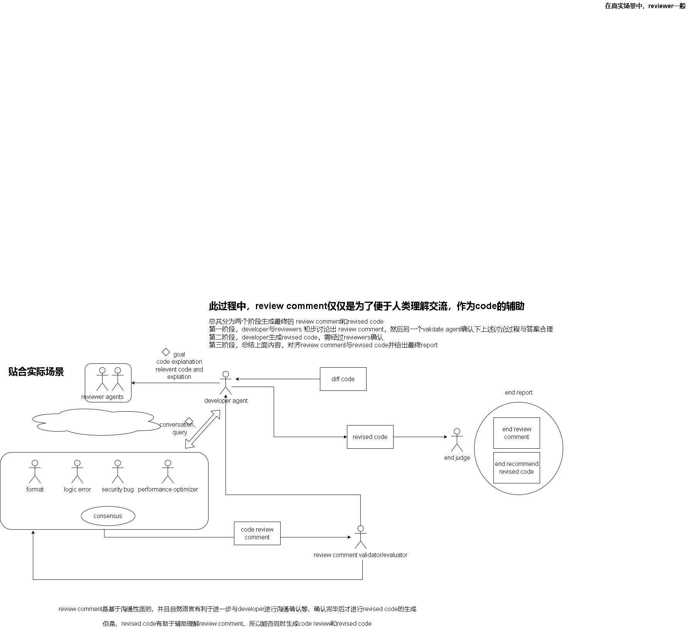

## 8.5


code review 哪些方面，了解code review

真实场景往往是多轮code review，轮次、多轮的关联性

从挑战出发 ，多agent的必要性（不能是没人做过）

challenge

deep research


> 深入学习真实场景，发现challenge

给发了5篇文章


## CodeEditor: Learning to Edit Source Code with Pre-trained Models

**23** **TOSEM**   **Ge Li**、**Jin Zhi**、**胡老师**


### 简介

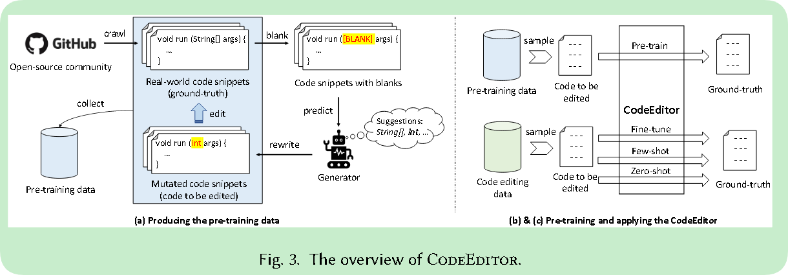

1.  提出一个 专门用于code editing的 novel **预训练任务**

之前用于代码任务的预训练模型（如CodeBERT, CodeT5）所使用的预训练方法（例如代码填空/Masked Language Model）虽然有效（**主要是从自然语言处理（NLP）领域衍生而来**），但并非为 **“代码编辑”** 这个特定任务量身定做。它们通常专注于**代码填充（code infilling）**，而非真正的代码修改模式学习

因此，作者提出了一种全新的、更贴近真实世界代码编辑场景的预训练任务，并基于此训练了名为 **CODEEDITOR** 的模型。


2. 做出该**任务数据集**，并**预训练**出 一个code editing 模型 CodeEditor

> 新预训练任务的流程是：
>
> 1. **获取高质量代码**：从GitHub等开源社区收集大量真实、高质量的代码片段作为“正确答案”（Ground Truth）。
> 2. **制造“突变”版本**：使用一个强大的代码生成模型（本文使用CodeGPT）来对这些高质量代码进行“重写”，故意制造出一些有细微错误但看起来又很合理的“突变”版本（Mutated Version）。例如，把一个正确的方法参数类型 `String[]` 改成 `int`。
> 3. **学习“修复”**：然后，训练CODEEDITOR模型，让它学习如何将这些“突变”的代码版本**修复回**最初的、正确的版本。
>
> 通过这种方式，CODEEDITOR不再是学习填空，而是直接学习 **“代码的编辑模式和修复逻辑”**。


3. 最后进行了**实验评估**：

​	在**code-to-code**的两个数据集、 **comment&code-to-code**的两个数据集

​	通过以下三种设置进行评估：

​	• **微调（Fine-tuning）**：使用特定代码编辑数据集对预训练的CodeEditor进行微调。

​	• **少样本学习（Few-shot）**：使用有限的样本对预训练的CodeEditor进行微调。

​	• **零样本学习（Zero-shot）**：不进行任何微调，直接将预训练的CodeEditor应用于代码编辑任务

分别与10多个baseline比较，**均达到最好**


### 方法


CodeEditor的实现分为三个主要阶段：

#### 1.**生产预训练数据**

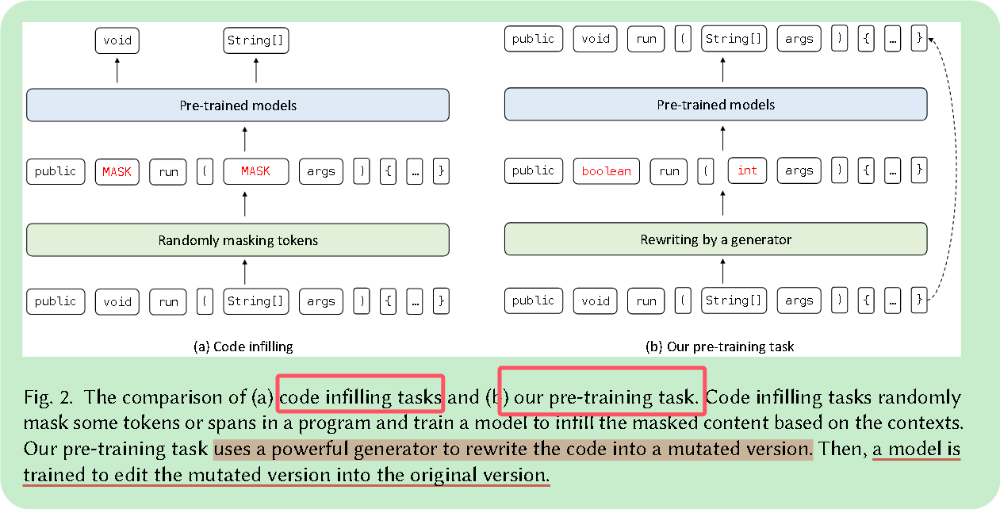

这是CodeEditor创新的核心。

• **数据来源**：从GitHub等开源社区收集大量真实世界的代码片段，这些代码经过严格的代码审查，被视为**（ground truth）**。

• **`变异版本生成`**：

  对于每个“黄金标准”代码片段，使用一个**强大的生成器（例如基于CodeGPT 的预训练语言模型）**将其重写成“变异版本”（mutated versions）。这些变异版本是自然但“低劣”的代码，类似于需要被编辑的旧版本代码。

  具体过程是：随机选择原始代码中的`k`个代码片段（长度**在1到6个token之间**，模拟真实世界中常见的修改大小），并用**空白**替换它们。

  然后，利用**生成器为这些空白预测多个可能的替代方案**，并选择**第一个非“ground truth”的次优（sub-optimal）替代方案**来填充空白，从而得到一个“变异版本”。

• **预训练样本构建**：将这些“变异版本”作为待编辑的输入代码（𝒙），将对应的“ground-truth”原始代码作为输出代码（𝒚）。如果原始代码包含自然语言注释（𝒛），则将其作为额外输入。


• **动机**：通过训练模型将这些“低劣”的变异代码编辑回“ground-truth”代码，CodeEditor能够学习到**多种有意义的编辑模式**，例如API更新、类型/对象更改和标识符重命名，这些模式与真实世界的代码更改非常相似

>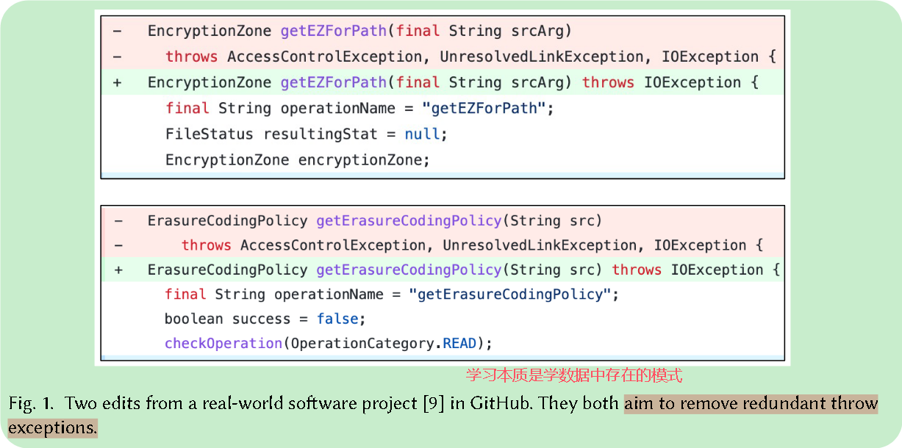
>
>下图 制造的预训练数据与真实世界相关数据非常接近
>
>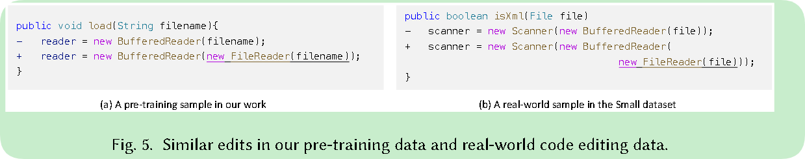


#### 2. 预训练CodeEditor 

• **任务定义**：将代码编辑任务视为**序列到序列（sequence-to-sequence, Seq2Seq）任务**。

• **输入输出**：输入序列为待编辑代码（𝒙），若有注释则拼接注释（𝒙[SEP]𝒛）；输出序列为“黄金标准”代码（𝒚）。

• **训练目标**：通过最小化交叉熵损失函数，自回归地生成输出序列。

• **模型架构**：CodeEditor采用**基于Transformer的编码器-解码器神经网络**，具体架构与Text-to-Text-Transfer Transformer (T5) 模型相似，**参数量为60M**。模型初始化使用预训练的CodeT5-small权重，并在**其基础上进行持续预训练**

  

​	具体参数：6层 (L=6)，模型维度 `d_model=512`，前馈层维度 `d_ff=2048`，自注意力头数 `h=8`，丢弃率 `p=0.1`。总参数量为 **60M**

 **预训练细节**:

  硬件：在包含 **32个NVIDIA A100 GPU (40G内存)** 的集群上进行预训练。

  最大序列长度：输入和输出序列的最大长度均设置为 **512**。

  训练步数：**180,000步**。

  批次大小：**512**。

  学习率：**5e-5**，前10,000步采用线性热身。

  模型选择：每10,000步在开发集上评估模型性能，选择损失最小的检查点作为预训练的CodeEditor。

• **微调细节**:

  批次大小：**32**。

  学习率：**5e-5**。

  热身步数：**1000步**。

  测试阶段：使用 **束搜索 (beam search)**，束大小设置为 **10**。

#### 3. 应用预训练的CodeEditor 

预训练好的CodeEditor可以通过以下三种设置应用于代码编辑任务：

• **微调（Fine-tuning）**：使用特定代码编辑数据集对预训练的CodeEditor进行微调。

• **少样本学习（Few-shot）**：使用有限的样本对预训练的CodeEditor进行微调。

• **零样本学习（Zero-shot）**：不进行任何微调，直接将预训练的CodeEditor应用于代码编辑任务。

同时，CodeEditor支持两种代码编辑场景：

• **代码到代码编辑（Code-to-code editing）**：仅根据待编辑代码生成新版本。

• **注释与代码到代码编辑（Comment&code-to-code editing）**：根据待编辑代码和自然语言注释生成新版本


### 实验

#### **1.数据集**：

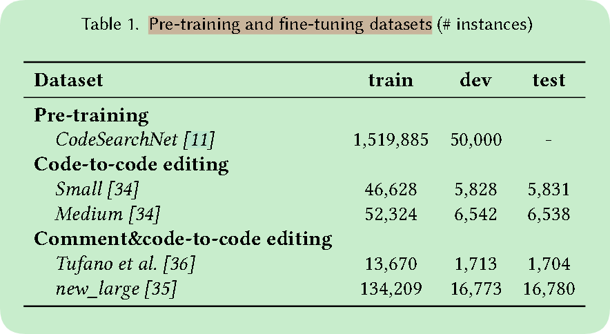

  **预训练**：CodeSearchNet-java。

  **微调**：两个代码到代码编辑数据集（Small, Medium）和两个注释与代码到代码编辑数据集（Tufano et al., new_large）。

####  **2.评估指标**：

精确匹配（Exact Match, EM）

CrystalBLEU

编辑距离（Edit Distance）

####  **3.基线模型**：

包括从零开始训练的模型（如Transformer）和预训练模型（如CodeBERT、CodeT5）

 **从头训练的模型 (Trained from scratch)**:

  Tufano et al.、Tufano et al. (代码到代码/注释与代码到代码).

  CODIT (基于树的结构化代码编辑).

  Transformer (流行的深度学习模型).

  AutoTransform (自动化代码转换).

• **预训练模型 (Pre-trained Models)**:

  CodeBERT、GraphCodeBERT (经典代码预训练模型，编码器-解码器架构)。

  CodeGPT (GPT-2 变体，强大的自然语言生成预训练模型).

  SPT-Code (序列到序列代码预训练模型).

  T5-review (将T5 应用于代码审查自动化).

  CodeT5 (SOTA代码预训练模型，参数量为60M，采用标识符感知预训练任务)


**4.结果**

**4.1 微调设置下的卓越性能**：

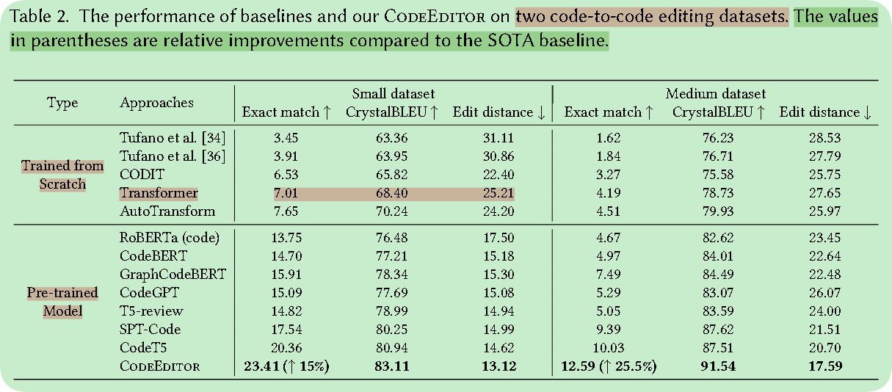

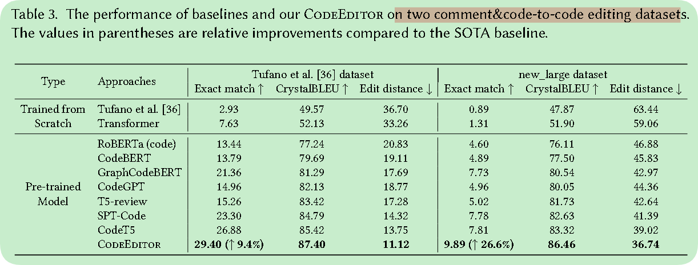

  在**代码到代码编辑场景**中，CodeEditor在两个数据集上均优于所有基线模型。在精确匹配方面，CodeEditor比SOTA基线CodeT5分别高出15%和25.5%。

  在**注释与代码到代码编辑场景**中，CodeEditor同样表现最佳，精确匹配比SOTA基线CodeT5分别高出9.4%和26.6%。

  `这些显著改进证明了CodeEditor在自动化代码编辑方面的优越性，得益于其独特的预训练任务，该任务能够学习到更实用的编辑模式`。

 

 此外，实验结果也再次强调了**预训练模型相对于从零开始训练的模型具有显著优势**，并且**序列到序列（Seq2Seq）学习对于代码编辑任务是有效且有利的**。`图中pre-trained model明显均优于 scratch trained`


**4.2零样本和少样本设置下的强大泛化能力**：

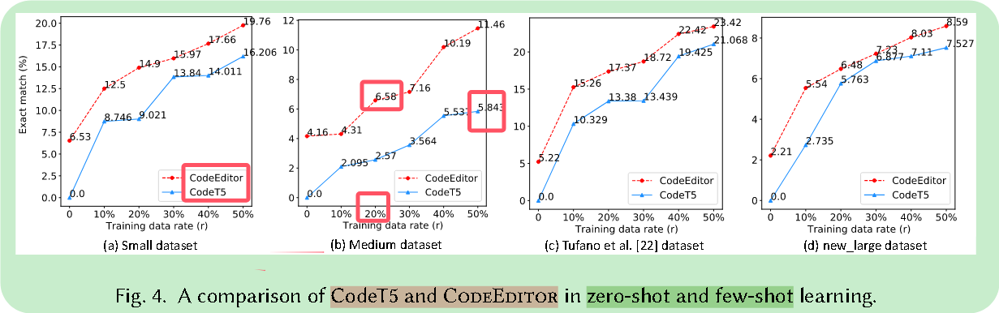

  在**零样本设置**（即不进行任何微调）下，CodeEditor成功编辑了**1,113个真实世界的代码片段**，而SOTA基线CodeT5则无法正确编辑任何代码。这表明CodeEditor的`预训练任务与真实世界的代码编辑任务更接近`，其学习到的编辑模式可以直接应用。

  在**少样本学习**中，即使仅使用少量数据进行微调，**CodeEditor的性能也显著优于CodeT5，甚至超过了某些使用全部数据进行微调的基线模型**。这突出显示了CodeEditor强大的泛化能力。


> - **零样本成功的背后原因**: 为什么CODEEDITOR在零样本下表现如此出色？
>
>   因为它学习的**预训练任务和下游的“代码编辑”任务在形式上高度一致**，所以模型可以将在预训练中学到的能力**直接迁移**过去，而无需针对新任务进行调整。


### 可能的启发

1.**与其依赖通用的、大而全的预训练任务，不如设计一个`与最终目标任务高度一致`（task-aligned）的、`模拟真实场景`的预训练任务。**

这就像为了培养一名外科医生，除了学习基础医学知识（通用预训练），更重要的是让他从一开始就大量练习缝合、解剖等模拟手术（任务对齐预训练），而不是让他去练习举重。

2.**“生成-破坏-修复”的`数据合成`范式**

很多任务都面临标注数据稀缺的问题。CODEEDITOR提供了一个非常聪明的、可自动化的数据创造方法，这个范式可以被广泛应用：

**起点 (Start with Gold)**: 找到大量高质量、正确的样本（“黄金数据”）。

**破坏 (Corrupt Realistically)**: 使用另一个模型或规则，对黄金数据进行**有意义、有逻辑的**破坏，创造出大量“看起来合理但其实有错”的负样本。关键在于，这种破坏要模拟真实世界中常见的错误。

**修复 (Learn to Fix)**: 训练你的主模型，将这些被破坏的样本修复回原始的黄金版本。

3.**将`“错误”和“噪音”`转化为宝贵的`学习信号`**

- 在传统机器学习中，错误和噪音通常被视为需要清洗或避免的干扰项。
- CODEEDITOR则反其道而行之，它主动、系统性地**创造错误**，并将这些错误作为最宝贵的学习信号。它不是在教模型“什么是对的”，而是在教模型“如何把错的变成对的”，后者是一种更高阶、更动态的能力。


**可能的关于 code review multi-agent的启发**

> 可能的关于 code review multi-agent的启发
>
> ​	制造一组各司其职的专家agent，各个agent均可以采用上述数据合成方式来提高专家水平：如
>
> **`BugDetectorAgent` (bug检测员)**、
>
> 专门发现代码中的逻辑错误、运行时异常、并发问题等。
>
> > 1. **收集“黄金代码”**: 从大量已合并、已通过测试的Pull Requests中获取高质量的函数或代码块。
> >
> > 2. 制造“真实世界的Bug”
> >
> >    : 你可以写脚本或用LLM，系统性地在这些黄金代码中引入
> >
> >    经典的、高频的Bug
> >
> >    。例如：
> >
> >    - 数组/列表的 off-by-one 错误。
> >    - 在可能为null的对象上直接调用方法，制造 `NullPointerException`。
> >    - 颠倒if-else分支的逻辑。
> >    - 在循环中错误地修改了迭代变量。
> >
> > 3. **训练Agent**: 训练`BugDetectorAgent`，让它的输入是“有Bug的代码”，输出是**“定位Bug的注释 + 修复后的代码”**。这样它不仅学会了找Bug，还学会了如何解释和修复Bug。
>
> **`StyleCopAgent `(代码风格警察)** 、
>
> 检查代码是否符合团队的编码规范、命名是否清晰、是否存在“坏味道”（code smells）如过长函数、magic numbers等。
>
> **`PerformanceOptimizerAgent` (性能优化师)**
>
> 发现潜在的性能瓶颈，如不高效的算法、数据库的N+1查询等。
>
> **`SecurityAuditorAgent` (安全审计员)**
>
>  专门寻找安全漏洞，如SQL注入、跨站脚本（XSS）、硬编码的密钥等
>
> 
>
> 系统工作流程可以是
>
> 1.  当一段代码提交review时，上述所有Agent同时对代码进行分析，各自从自己的专业领域提出建议。
> 2. **信息汇总**: 一个**`LeadReviewerAgent` (主审查员)** 负责汇总所有专家的意见。最后**生成统一报告**


## AEGIS: An Agent-based Framework for Bug Reproduction from Issue Descriptions

**fse 2025**   **hitsz 与 bytedance**    **Cuiyun Gao**


### 简介

**目标任务：**

旨在解决软件开发中的一个关键痛点：**根据用户提交的问题报告（issue descriptions）自动生成能复现该问题的测试脚本**。


**核心问题与挑战：** 现有的基于大语言模型（LLM）的智能体（agent）在尝试完成这项任务时，主要面临两个难题：

1. **信息过载**：从代码库中检索到的与错误相关的信息通常非常冗长，包含大量无关内容，这给LLM的理解带来了巨大负担。

2. **缺乏引导**：在生成和修改复现脚本的过程中，智能体的行为很盲目，常常进行随机、重复或无效的修改，导致最终失败。

   

**AEGIS 框架的解决方案：** 为了解决上述问题，AEGIS 设计了两个核心模块：

1. **错误相关上下文摘要模块 (Bug-related Context Summarization Module)**：该模块首先检索与错误相关的所有信息，然后通过**重排序（reranking）和摘要（summarization）技术**，将这些庞杂的信息提炼成一份结构清晰、内容精简的“摘要报告”交给LLM。这使得LLM能够更准确地理解问题的本质。

2. **有限状态机（FSM）引导的脚本生成模块** (FSM-guided Script Generation Module)

   ：这是AEGIS最主要的创新。它建立了一个有限状态机模型，用来规范和引导LLM智能体的整个工作流程。这个FSM定义了包括

   **创建、执行、自验证、外部验证、修改、重启**

   等多个状态。智能体必须遵循预设的规则在这些状态间转换，例如：

   - 当修改陷入僵局时，可以触发“重启”状态，避免无限循环。
   - 在提交最终脚本前，会引入“外部验证”状态，防止智能体通过伪造结果（比如直接 `raise AssertionError`）来“假装”成功。
   - 这种机制极大地约束了智能体的盲目探索，使其行为更具逻辑性和目的性。

**实验结果：**

- **性能卓越**：在公开基准数据集 SWE-Bench上的测试结果显示，AEGIS 的错误复现成功率达到了 **36.0%**，比之前最好的方法提升了 **19.0%**（绝对值），效果显著。
- **工业应用验证**：该框架在字节跳动（ByteDance）的内部项目中进行了为期三个月的部署，成功为开发者复现了12个真实的线上错误，证明了其在工业环境下的实用价值。


### 方法

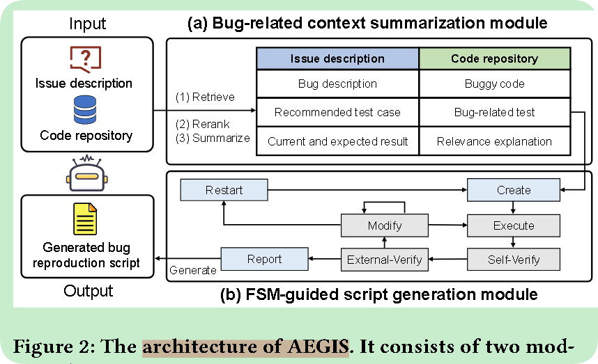

#### 1.**错误相关上下文摘要模块 (Bug-related Context Summarization Module - `BCS`)**

该模块旨在将检索到的错误相关信息**浓缩成结构化的上下文**，以便 LLM 更好地理解和利用缺陷信息。其工作流程包括：

• **检索 (Retrieve)**：

  AEGIS 利用**抽象语法树 (AST)** 来解析代码库文件，从而提取出**代码结构，如方法、类和标识符。**

  设计了专门的搜索工具，包括 `search_method`（搜索方法）、`search_class`（搜索类）和 `search_identifier`（搜索标识符），LLM 代理可以调用这些工具。这些搜索请求在本地基于解析的文件进行处理，结果作为检索到的上下文反馈给 LLM 代理。

  此外，LLM 代理还可以利用常见的 **Bash 命令**，例如 `ls`（列出文件）、`grep`（搜索内容）和 `find`（查找文件）来获取上下文信息。


• **重新排序 (Rerank)**：

  检索到的上下文 `C_retrieve` 包含大量代码片段。

  LLM 代理会根据这些**代码片段与问题描述**的**`相关性`**进行**多次独立重新排序**（例如，进行 `m` 次排序），并计算每个片段的**平均排名** `R_avg`，从而获得重新排序后的上下文 `C_rerank`。


• **总结 (Summarize)**：

  基于重新排序后的上下文 `C_rerank`，LLM 代理会**过滤掉冗长和不相关的片段**。

  然后，它将剩余的相关片段与原始问题描述相结合，生成一个**总结后的结构化错误相关上下文**。这个总结包括以下关键信息：

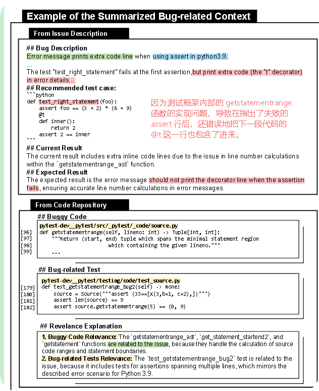

​    ▪ **从问题描述中提取**：

​      • **缺陷描述 (Bug description)**：清晰详细的缺陷说明，帮助 LLM 代理理解问题。

​      • **推荐的测试用例 (Recommended test case)**：如果问题描述中已包含测试用例，LLM 代理可以利用此信息生成复现脚本。

​      • **当前结果和预期结果 (Current result and expected result)**：对缺陷导致的当前结果以及修复后的预期结果的分析，有助于验证执行信息是否准确反映缺陷。

​    ▪ **从代码库中提取**：

​      • **可能导致缺陷的代码片段 (Buggy code)**。

​      • **与缺陷相关的测试用例 (Bug-related test)**：可以直接复用或与复现缺陷相关的测试用例。

​      • **相关性解释 (Relevance explanation)**：详细解释缺陷代码、相关测试与缺陷之间的关联性，帮助 LLM 代理更好地利用这些代码片段进行复现。


#### 2. 有限状态机 (FSM) 引导脚本生成模块 (FSM-guided Script Generation Module - `FSG`)

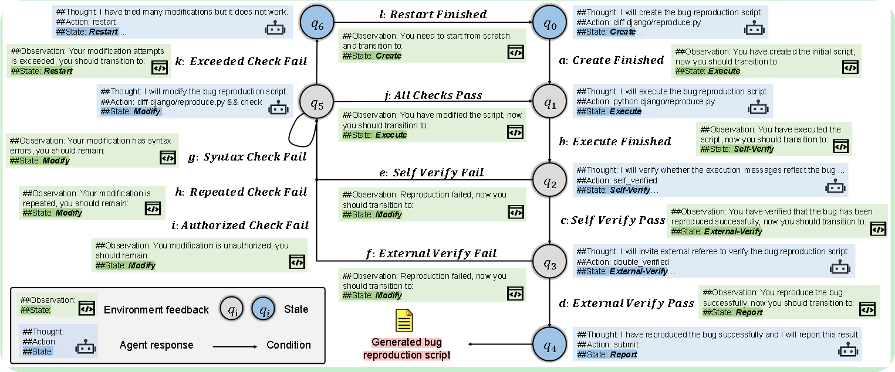

该模块通过一个预定义的**有限状态机 (FSM)** 来**指导脚本修改过程**，以防止代理生成重复或虚假的修改。


**有限状态机 (Finite State Machine, FSM)**的目标是解决**“缺乏引导”**的问题，为 LLM 工程师提供一套严格的“操作规程”。

这个“操作规程”定义了几个关键的工作状态，工程师必须按规则在这些状态间流转：

- **`Create` (创建)**: 根据第一阶段的“卷宗”，生成第一版复现脚本。

- **`Execute` (执行)**: 运行刚刚生成的脚本，并观察其输出结果（比如报错信息、日志等）。

- `Self-Verify` (自我验证)

  LLM 工程师自己判断：“执行结果是否准确反映了 Bug 的现象？”

  - **如果“是”**: 进入下一步 `External-Verify`。
  - **如果“否”**: 说明脚本还有问题，进入 `Modify` 状态进行修改。

- `External-Verify` (外部验证)

  - 这是 AEGIS 的一个“杀手锏”。它会引入**另一个独立的 LLM 智能体**作为**“外部审查员”**。
  - 这个审查员会拿到脚本、执行结果和原始“卷宗”，进行一次公正的、无偏见的判断，以防止工程师“自欺欺人”（例如通过伪造 `assert` 来假装成功）。
  - **如果通过审查**: 证明脚本完美，进入最终的 `Report` 状态。
  - **如果未通过审查**: 说明脚本依然有问题，打回 `Modify` 状态。

- `Modify` (修改)

  - 这是最核心的“动手”环节。工程师根据验证失败的原因，对脚本进行修改。

  - 为了防止乱改，这里有

    严格的“安全检查”

    1. **语法检查**: 保证修改后的代码没有语法错误。
    2. **重复检查**: 保证本次修改和之前的某次修改不一样，避免原地打转。
    3. **权限检查**: 保证只修改复现脚本本身，而不去动项目原有的代码。

  - 只有通过全部检查，修改才会被应用。

- **`Report` (报告)**: 任务成功，提交最终的 bug 复现脚本。

- `Restart` (重启)

  - 这是一个“保险丝”机制。如果在一个循环里修改了太多次（例如超过5次）还是不成功，说明可能思路走进了死胡同。
  - 此时会触发 `Restart`，清空当前脚本，总结失败经验，然后回到 `Create` 状态，尝试用一种全新的思路从头再来。

通过这套 FSM 引导的流程，AEGIS 确保了 LLM 智能体的每一步操作都是有目的、有逻辑且受到约束的，从而极大地提升了自动化生成正确复现脚本的成功率。


### 实验

#### 1.实验设置 (Setup)

- **数据集 (Dataset)**: 使用的是 **SWE-Bench Lite**。这是一个专门为评测 AI 修复软件 Bug 能力而设计的基准数据集的精简版，包含了 300 个真实的软件问题实例。

- **模型 (Model)**: AEGIS 使用的是 OpenAI 的 `gpt-4o` 模型（论文中写作 `GPT4o-2024-0513`）。

- 评测指标 (Metrics)

  - **核心指标 `F → P` (Bug Reproduction Rate)**: 这是最重要的指标，代表“错误复现率”。意思是，生成的脚本必须在**未修复的旧代码上运行失败 (Fail)**，但在**已修复的新代码上运行通过 (Pass)**。只有同时满足这两个条件，才算成功复现了 Bug。
  - **辅助指标** `F → ×` 和 `P → P`
    - `F → ×` (Fail-to-any): 在旧代码上运行失败。这个指标越高，说明智能体越倾向于生成能“触发失败”的脚本，这是成功的前提。
    - `P → P` (Pass-to-pass): 在新旧代码上都运行通过。这个指标越高，说明生成的脚本越可能是无用的，因为它根本没找到 Bug、

- **对比的基线方法 (Comparative Methods)**

  为了证明 AEGIS 的先进性，研究人员选取了当前解决此类问题的两类主流方法作为比较对象：

  ##### **第一类：LLM-based Methods (基于大语言模型的方法)**

  这类方法通常是“一锤子买卖”，它们直接调用 LLM 生成一个完整的解决方案，缺乏与环境的交互和迭代能力。

  - **ZEROSHOT**: 最简单直接的方法。将**问题描述和用传统方法（BM25）检索到的代码上下文一起打包**，直接让 LLM 生成一个修复脚本。
  - **ZEROSHOTPLUS**: ZEROSHOT 的增强版，它允许 LLM 使用一种更灵活的格式来修改代码，比如可以一次性插入或替换整个函数/类，而不仅仅是修改几行。
  - **LIBRO**: 采用“广撒网”策略。它让 LLM **一次性生成多个** 候选的复现脚本，然后把这些脚本全部执行一遍，最后挑选出那个执行结果最符合 Bug 描述的脚本作为最终答案。
  - **AUTOCODEROVER**: 采用两阶段方法。第一阶段检索相关的代码片段，第二阶段基于这些信息生成补丁，并且会不断重试直到生成的补丁能被成功应用。

  ##### **第二类：Agent-based Methods (基于智能体的方法)**

  这类方法比第一类更高级，它们赋予了 LLM 与代码环境交互的能力，可以执行命令、查看文件、并进行多轮迭代修改。AEGIS 也属于这一类。

  - **`SWE-AGENT`**: 一个非常知名的通用软件工程智能体。它拥有一个复杂的工具集（文件搜索、查看、编辑等），可以自主地在代码库中进行探索和修改来修复 Bug。错误复现只是其整个工作流中的一个环节。
  - **AIDER**: 它的特点是会先对**整个代码仓库建立索引**，以帮助 LLM 更好地选择要修改的文件。在应用修改前，它也会进行语法检查等验证。

#### 2.RQ1: AEGIS 与其他方法相比效果如何？(对比实验)

**目的**: 验证 AEGIS 是否是“业界领先”(State-of-the-art)。

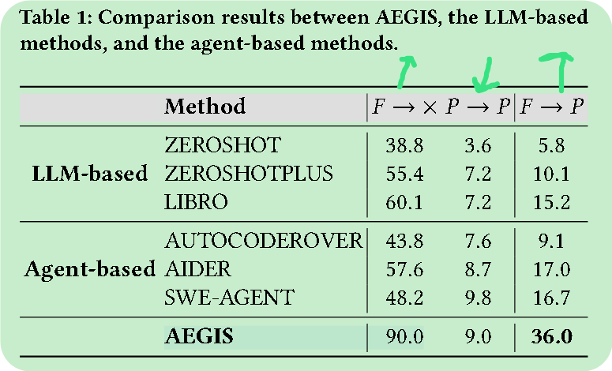

- **AEGIS 遥遥领先**: AEGIS 的错误复现率 `(F → P)` 达到了 **36.0%**。
- **超越最佳基线**: 这个成绩比之前的最佳方法 (AIDER, 17.0%) 高出了 **19.0%** 的绝对值，几乎是翻了一倍还多。
- **完胜所有对手**: 无论是基于 LLM 的方法（如 ZEROSHOT）还是基于 Agent 的方法（如 SWE-AGENT），AEGIS 的表现都全面胜出。
- **攻击性强**: AEGIS 的 `F → ×` (触发失败的能力) 高达 **90.0%**，远超其他方法。这说明 FSM 引导机制非常有效地驱使 LLM 去创造能导致失败的场景，而不是生成一堆无用的“和事佬”脚本。

**结论**: AEGIS 的架构设计非常成功，在错误复现任务上取得了突破性的性能提升。

#### 2.RQ2: AEGIS 的不同模块有多大作用？(消融实验)

**目的**: 探究 AEGIS 成功的秘诀是什么，是哪个模块贡献最大。

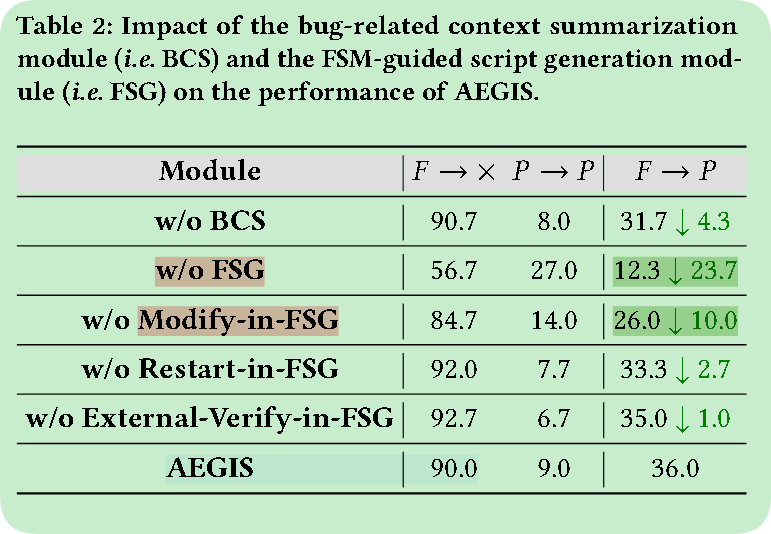

- 移除“情报分析师” (w/o BCS)
  - 去掉**上下文摘要模块 (BCS)** 后，性能 `(F → P)` 从 36.0% 下降到 31.7%，**降低了 4.3%**。
  - **分析**: 这说明高质量的、经过提炼的输入信息确实很重要。没有它，LLM 会更难理解问题，成功率下降。
- 移除“工程师规程” (w/o FSG)
  - 去掉**有限状态机引导模块 (FSG)** 后，性能 `(F → P)` 从 36.0% 骤降到 12.3%，**暴跌了 23.7%**！
  - **分析**: 这是最关键的发现。它证明了**FSM 提供的流程引导是 AEGIS 成功的核心因素**。<u>*没有这个“规程”，LLM 就像一匹脱缰的野马，虽然有能力，但行为混乱、效率低下，最终难以成事*</u>。
- 进一步拆解 FSM实验还分别移除了 FSM 中Modify（修改）、Restart（重启）和External-Verify（外部验证）状态。
  - `Modify` 贡献最大（**提升10.0%**），说明<u>**反复迭代优化的能力至关重要**</u>。
  - `Restart` 和 `External-Verify` 也分别贡献了 **2.7%** 和 **1.0%** 的性能提升，证明了避免钻牛角尖和引入第三方监督的价值。

**结论**: 上下文摘要（BCS）和 FSM 引导（FSG）都有用，但 **FSM 的流程控制是决定性的、贡献最大的模块**。

#### 4.RQ3: 超参数如何影响 AEGIS 的性能？(参数敏感性实验)

**目的**: 了解如何最好地配置 AEGIS，找到最佳参数。

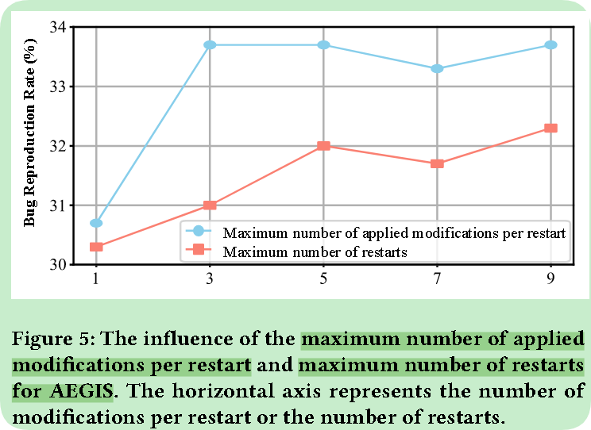

- 最大重启次数 (Maximum number of restarts)
  - 从 1 次增加到 5 次，性能 `(F → P)` 持续提升。<u>**这说明给 LLM 更多“从头再来”的机会，让它探索不同的路径，是有好处的。**</u>
  - 超过 7 次后，性能趋于稳定。这表明试错的价值有其极限，再多尝试也难以发现新的思路了。
- 每次重启中的最大修改次数 (Maximum number of applied modifications per restart)
  - 从 1 次增加到 5 次，性能也在提升。**<u>这说明在确定一个大方向后，精细地进行多次微调是很有价值的。</u>**
  - 超过 5 次后，性能也趋于稳定，说明在一个方向上过度“打磨”的边际效益递减。

**结论**: 超参数确实会影响性能，但 AEGIS 的表现在一个合理的范围内是比较鲁棒的。论文选择的默认设置（例如重启5次，修改5次）是在性能和计算成本之间取得了一个很好的平衡点。

#### 5. 实际部署效果 

**目的**: 验证 AEGIS 在学术环境之外，是否能在真实的工业开发流程中产生价值，并辅助开发者解决问题。

**实验设计**:

**赋能 Bug 修复**: 将 AEGIS 生成的复现脚本，用于一个名为 `Agentless` 的先进 Bug 修复框架，作为其筛选候选补丁的“试金石”。

逻辑是：如果一个补丁能让 AEGIS 的复现脚本从“失败”变为“成功”，那么这个补丁大概率是有效的。

**字节跳动内部署**: 将 AEGIS 直接部署在字节跳动的 **5 个内部代码仓库**中，覆盖多种编程语言和超过 200 名开发者。进行为期 **3 个月**的实地测试。

**结果**:

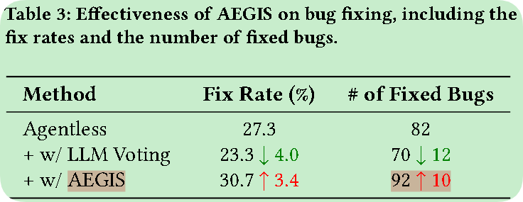

- 提升 Bug 修复率 
  - 在 `Agentless` 框架中引入 AEGIS 的复现脚本后，整体的 Bug 修复成功率从 27.3% 提升到了 **30.7%**，相对提升了 **12.5%**。
  - 成功修复的 Bug 数量从 82 个增加到了 **92 个**。这有力地证明了 AEGIS 生成的脚本能够作为高质量的测试用例，有效帮助其他工具验证 Bug 是否被真正修复。
- 工业实践成功
  - 在三个月的部署期间，<u>AEGIS 针对 **25 个**由员工报告的真实 Bug 生成了复现脚本。</u>
  - <u>经过人工评估，其中 **12 个**脚本被确认为能够**准确地复现**所报告的 Bug。</u>
  - 这些成功的脚本及其执行信息，帮助开发者更快地定位问题并实施修复。

**结论**: AEGIS 不仅仅是一个“跑分高”的实验模型，它具备**切实的工业应用价值**，能够无缝集成到现有的开发工作流中，并显著提升 Bug 修复的效率和成功率。

#### 6.不同搜索工具对性能的影响 

**目的**: 探究 AEGIS 的性能在多大程度上依赖于其内部使用的“信息检索”工具。一个鲁棒的系统，不应该因为换了一种搜索方法就导致性能大幅下降。

**实验设计**:

- 创建了两个 AEGIS 的变体：
  1. **AEGIS-BM25**: 将 AEGIS 内置的、基于 AST 的智能搜索工具，替换为传统的、基于关键词匹配的 **BM25 算法**。
  2. **AEGIS-BashCommand**: 只允许 AEGIS 使用基础的 **Bash 命令**（如 `grep`, `ls`）进行搜索，完全禁止使用任何高级或智能搜索工具。

**结果**:

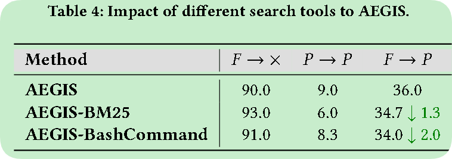

- 性能略有下降，但依然强大
  - 相较于标准版 AEGIS (36.0%)，使用 BM25 (34.7%) 和纯 Bash 命令 (34.0%) 的版本，其错误复现率 `(F → P)` 分别只**轻微下降了 1.3% 和 2.0%**。
- **依然远超其他方法**: 即使在只使用最基础搜索工具的情况下，AEGIS (34.0%) 的性能依然远超之前的最佳基线方法 AIDER (17.0%)。

**结论**: AEGIS 的性能对具体的搜索工具表现出**很强的鲁棒性 (Robustness)** 和**弱依赖性 (Weak Dependency)**。这说明 AEGIS 成功的核心秘诀**不在于“如何搜”**，而在于后续的**“如何提炼信息” (BCS 模块)** 和**“如何控制流程” (FSG 模块)**。无论前端用什么工具把信息捞出来，AEGIS 强大的后端处理能力都能保证最终的优异表现。这极大地增强了它的通用性和可靠性。

#### 可能的启发

1. 将 Code Review **流程 “FSM 化”**：定义智能体协作的“章法”

Code Review 不是一个单一的动作，而是一个有明确阶段和状态转换的**流程**。您可以直接借鉴 AEGIS 的 FSM 思想，为您的多智能体系统定义一个清晰的工作流。

- **AEGIS 启发**: 用 FSM（有限状态机）来引导 Bug 复现的整个过程。
- 您的 Code Review 应用
  - **设计一个 Code Review FSM**，包含以下状态：
    1. `Pending_Review` (待审查): PR (Pull Request) 提交，系统启动。
    2. `Static_Analysis` (静态分析): 一个基础智能体首先运行，负责检查代码风格、格式、简单的语法错误（Linter）。
    3. `Specialist_Review` (专家审查): 这是**多智能体协作的核心**。工作流进入此状态，将代码分发给多个“专家”智能体并行审查。
    4. `Feedback_Consolidation` (反馈整合): 所有专家智能体完成后，进入此状态，由一个“整合者”智能体负责处理所有评审意见。
    5. `Awaiting_Author_Action` (等待作者修改): 将整合后的意见呈现给人类开发者。
    6. `Verification` (变更验证): 作者提交修改后，触发此状态。一个“验证者”智能体检查新的代码是否解决了之前提出的问题。
    7. `Approved / Needs_More_Work` (通过 / 需再修改): 最终状态。
  - **价值**: 这个 FSM 让您的多智能体系统不再是一盘散沙，而是像一个**有纪律、有流程的专业团队**在协作。

2. 设计**专门的、角色驱动的智能体** (Role-Driven Agents)

AEGIS 的 `External-Verify` 智能体启发我们，不同的智能体应该有**不同的角色和职责**，而不是让一个“万能”智能体包办一切。

- **AEGIS 启发**: 主智能体负责尝试，外部验证智能体负责客观评判。
- 您的 Code Review 应用
  - 在 `Specialist_Review` 状态中，您可以设计多个并行的专家智能体：
    - **安全评审员 (Security Reviewer Agent)**: 专门训练用于寻找安全漏洞（如 SQL 注入、XSS、不安全的依赖包）。它的知识库是 OWASP Top 10、CVE 数据库等。
    - **性能评审员 (Performance Reviewer Agent)**: 专门寻找性能瓶颈，例如 N+1 查询问题、低效的循环、不合理的数据结构使用等。
    - **可读性/可维护性评审员 (Readability Reviewer Agent)**: 负责评估代码的“坏味道”(Code Smells)，例如过长函数、过大的类、命名模糊、缺乏注释等。
    - **逻辑与测试评审员 (Logic & Test Reviewer Agent)**: 这是最难但最有价值的。它负责理解代码的业务逻辑，检查是否与 PR 描述一致，并评估测试用例的覆盖度，甚至提出需要补充的边缘情况测试。
    - **主持人/编排者智能体 (Orchestrator Agent)**: 它不直接审查代码，而是扮演 FSM 的“引擎”，负责在不同状态间流转，并将任务分发给合适的专家智能体。
  - **价值**: 角色专业化使得评审的**深度和广度**远超单个通用智能体，能够发现更复杂、更隐蔽的问题。

3. 设计**“反馈整合”**智能体：从“信息轰炸”到“有效沟通”

这是直接借鉴 AEGIS **上下文摘要模块 (BCS)** 的思想，并且对于 Code Review 场景至关重要。

- **AEGIS 启发**: 在行动前，先对冗长的信息进行提炼和摘要。
- 您的 Code Review 应用
  - 在 `Feedback_Consolidation` 状态中，“整合者”智能体负责：
    1. **去重与合并**: 不同的专家智能体可能从不同角度指出了同一个问题。整合者需要将这些重复意见合并成一条。
    2. **优先级排序**: 一个安全漏洞的优先级，显然高于一个变量命名风格的建议。整合者需要为所有评审意见打上标签，如 `[Blocker]` (阻塞性问题), `[Major Suggestion]` (重要建议), `[Minor Nitpick]` (细节修饰)。
    3. **提供可行的修复建议**: 不只是指出“这里有问题”，而是尽可能给出具体的、可操作的修改方案。
    4. **生成摘要报告**: 为人类开发者生成一份简洁、清晰、按优先级排序的 Review 报告。
  - **价值**: 避免了多个智能体七嘴八舌地对开发者进行“信息轰炸”，极大地**提升了沟通效率和用户体验**。

4. 设计**“验证者”智能体**与闭环反馈

AEGIS 的 `Modify -> Verify` 循环，完美对应了 Code Review 中的“作者修改 -> 评审员复查”这一核心互动。

- **AEGIS 启发**: `Restart` 带有记忆，`Verify` 确保修改的有效性。
- 您的 Code Review 应用
  - 在Verification 状态中，“验证者”智能体的任务不是重新做一遍完整的 Review，而是：
    - **聚焦于变更**: 它只关注作者针对上一轮评审意见所做的代码修改。
    - **逐一核对**: 它的任务清单就是上一轮的评审意见。例如，“意见1：添加空指针检查。检查点：作者是否在新代码的相应位置添加了空指针检查？”
  - **价值**: 这使得 Review 的第二轮、第三轮...变得极其高效，形成了一个**快速迭代的闭环**，避免了重复劳动。


## CodeVisionary: An Agent-based Framework for Evaluating Large Language Models in Code Generation

arxiv  、Cuiyun Gao 、  hitsz bytedance

### 简介

1. **现有问题：** 论文首先指出，目前评估LLM代码生成的方法主要有三类：人工评估、基于指标的评估（如BLEU分数）和基于LLM的自动评估。这些方法各有缺点：

- **人工评估**：成本高、耗时长。
- **基于指标的评估**：往往过于依赖参考答案，无法很好地评估复杂或没有标准答案的代码。
- **基于LLM的评估**：虽然效率高，但常常**因为缺乏多源领域知识**（例如，无法执行代码、无法看到前端界面、不了解最新的编程技术）**和对复杂代码的理解不足**，导致评估结果不准确。

**2. 解决方案：CodeVisionary框架** 为了解决以上问题，作者提出了一个名为 **CodeVisionary** 的新型LLM智能体评估框架。该框架的核心思想是模拟人类专家的评估过程，通过两个主要阶段来评估生成的代码：

- **第一阶段：多源知识分析（Multisource Knowledge Analysis Stage）**：在这个阶段，一个LLM智能体会首先理解任务需求，然后制定一个详细的评估计划。接着，它会像一个真正的开发者一样，利用多种工具（如代码执行、静态分析、网页浏览、截图分析等）来收集全面的信息，从而弥补LLM在知识上的短板。
- **第二阶段：基于协商的评分（Negotiation-based Scoring Stage）**：这个阶段引入了多个LLM“评委”。它们会根据第一阶段收集到的分析报告，对代码进行打分，并像一个评审小组一样进行讨论和辩论。通过这种多方协商的方式，最终就评估分数达成共识。这个过程有助于减少单个LLM的偏见，并更深入地理解复杂的代码逻辑

**有效性**：实验结果表明，与现有的先进评估方法（如CODEJUDGE、ICE-Score）相比，CodeVisionary的评估结果与人类专家的评分具有更高的一致性，显著提升了评估的准确性。

**实用性**：该框架不仅能给出一个评分，还能生成一份详细的评估报告，指出代码的优缺点和可改进之处，为开发者提供了宝贵的反馈。


### 方法

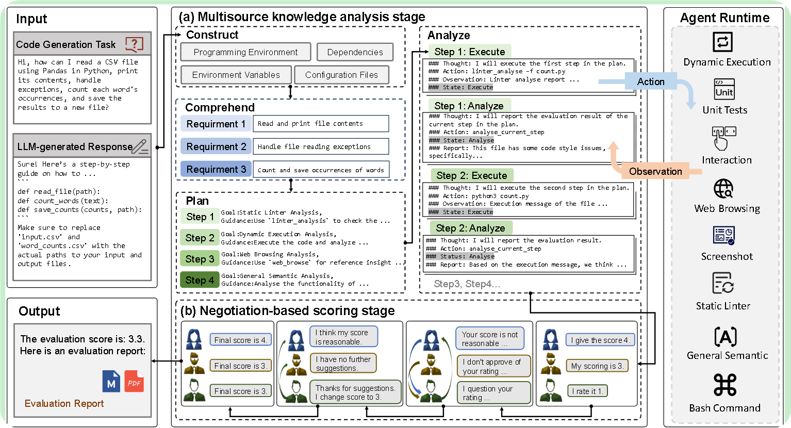

CodeVisionary是一个**基于LLM（大型语言模型）的智能体框架**，专门用于**评估大型语言模型在代码生成任务中的能力**。它旨在解决现有LLM评估方法面临的两大挑战：**缺乏多源领域知识**和**对复杂代码的理解不足**。

CodeVisionary通过以下两个主要阶段进行评估：

1. 多源知识分析阶段（Multisource Knowledge Analysis Stage - MKA）

此阶段旨在**收集全面且多源的领域知识**。它模仿人类解决复杂问题的方式，遵循“构建 (construct)”、“理解 (comprehend)”、“规划 (plan)”和“分析 (analyze)”的范式。

• **构建 (Construct)**：

  LLM智能体根据代码生成任务和LLM生成的响应，在Docker容器中**构建必要的执行环境**。

  这包括设置编程环境和安装外部依赖项。

  对于更复杂的任务，还需要配置额外的配置文件、环境变量及其他必要组件。

• **理解 (Comprehend)**：

  此阶段旨在增强LLM智能体对任务需求的理解，并为制定全面的评估计划做准备。

  LLM智能体**理解代码生成任务的需求**，并将其**分解为更小、更易于管理的具体要求。**（**decompose更有利于理解**）例如，将任务分解为“读取并打印文件内容”、“处理文件读取异常”和“统计并保存单词出现次数”等。

• **规划 (Plan)**：

  智能体**制定详细的评估计划**，将LLM生成响应的评估过程分解为多个步骤。

  每个步骤都包含一个简短的**目标 (Goal)** 和具体的**指导 (Guidance)**，以帮助验证每个任务要求。

  这些目标和指导共同指定了LLM智能体应采取的操作。CodeVisionary支持多种分析类型以获取多源信息：

​    ▪ **动态执行分析 (Dynamic Execution Analysis)**：检查编译错误，分析执行消息是否与预期结果一致，例如运行Python脚本或编译执行C程序。

​    ▪ **静态代码检查分析 (Static Linter Analysis)**：检查语法错误、代码问题和风格不一致，无需执行代码，提供结构化的检查报告。

​    ▪ **屏幕截图分析 (Screenshot Analysis)**：针对前端代码，捕获屏幕截图进行可视化分析，通过多模态LLM生成分析报告，并可查询截图提取相关信息。

​    ▪ **交互分析 (Interaction Analysis)**：模拟用户与前端代码的交互，评估互动元素，如点击、填写输入字段、悬停、滚动等。

​    ▪ **网络浏览分析 (Web Browsing Analysis)**：从网站检索额外信息，弥补LLM的知识空白，获取最新技术和专业答案。

​    ▪ **通用语义分析 (General Semantic Analysis)**：利用LLM强大的上下文理解能力，评估代码的功能、逻辑、复杂性、安全性、鲁棒性等，无需外部工具。

​    ▪ **Bash 命令 (Bash Command)**：执行基本的Shell命令来编写代码、查看文件和导航文件系统，例如写入文件、创建目录等。

• **分析 (Analyze)**：

  在此阶段，LLM智能体遵循评估计划，执行每个步骤中的操作并分析相应的执行结果。

  它在“执行状态 (Execute State)”和“分析状态 (Analyze State)”之间交替进行。

  “执行状态”下，智能体执行计划中指定的操作，并将<u>执行结果作为“观察 (observation)”反馈给智能体。</u>

  “分析状态”下，智能体<u>提交当前步骤的分析报告</u>，然后审查已完成的步骤并进行下一步。

 

2. 基于协商的评分阶段（Negotiation-based Scoring Stage - NS）

此阶段旨在通过**多个LLM智能体充当“评委”之间的讨论来评估LLM生成的响应**。这种协商策略有助于**减轻LLM在理解复杂代码时的不准确性和偏见**，通过多样化的视角和评委之间的共识，确保更全面的评估。

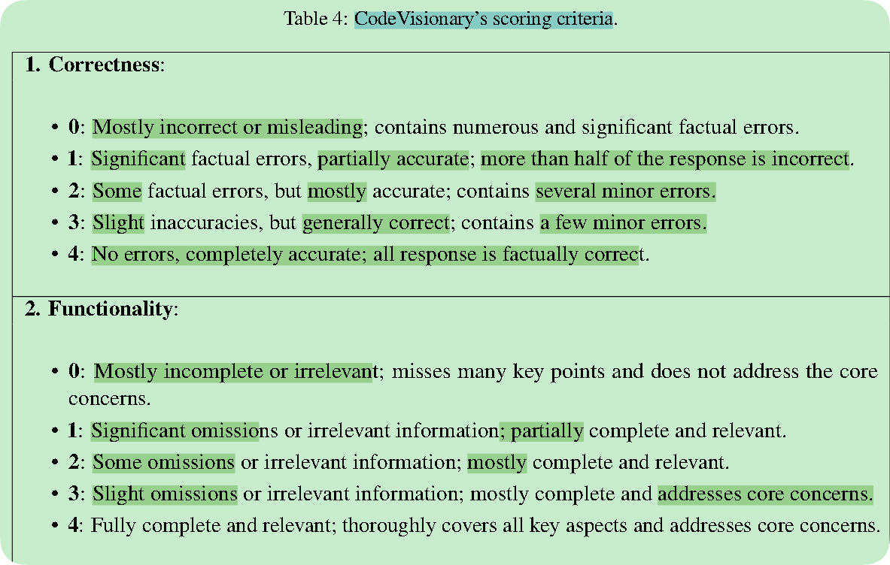

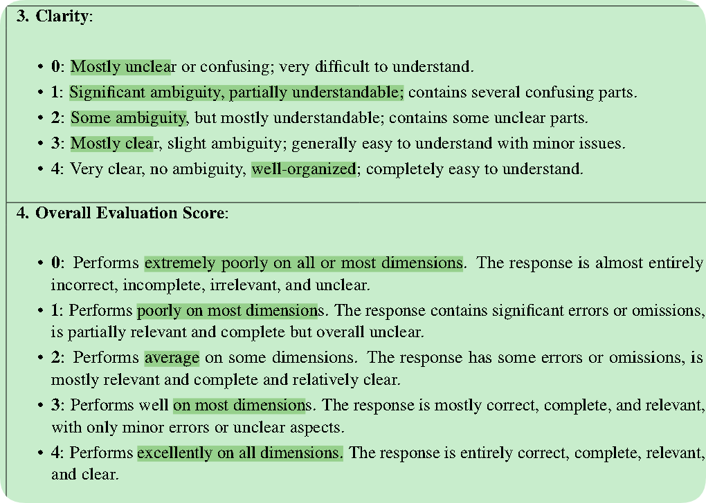

1. **多“法官”独立评分：**
   - 框架会启用多个（例如3个）独立的 LLM Agent 作为“法官 (Judges)”。
   - 每个“法官”都会接收到第一阶段生成的完整分析报告。
   - 基于这些报告和预设的评分标准（如正确性、功能性、清晰度，见论文表4），每个“法官”独立地给出一个初始分数和详细的评分理由。
2. **协商与共识：**
   - 所有“法官”的初始分数和理由会被公开给彼此。
   - 接着，它们会进行多轮“讨论”或“协商”。在每一轮中，每个“法官”代理可以执行三种操作：
     - **维持 (Maintain):** 坚持自己的分数和理由。
     - **改变 (Change):** 在看了其他“法官”的意见后，修改自己的分数和理由。
     - **质询 (Query):** 对其他“法官”的评分提出疑问，要求对方进一步解释。
   - 这个过程会持续进行，直到所有“法官”达成共识，或者达到预设的最大协商轮次。

• **评估报告生成**：

  使用**一个新的agent** **生成详细的评估报告**（提供标准template），其中包含环境配置、任务要求、分步分析报告、评估理由和优化建议。

  这些报告有助于开发者识别不足并进行改进。为了增强可读性，**报告会进行标准化和美化。**


### 实验

实验设置

CodeVisionary 和baseline方法基于GPT-4o 。

CodeVisionary 中使用的 LLM 的采样温度设置为 0.2。

在多源知识分析阶段，我们将最大交互次数限制为 40 次。

在基于谈判的评分阶段，我们将评委人数设置为 3 人，最多允许 5 轮谈判


• **数据集**

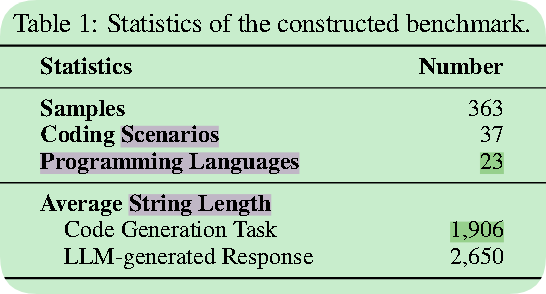

  

​	评估使用了**CodeArena基准测试集**作为**数据源**，这是一个包含397个高质量代码生成任务的人工策划数据集，涵盖了多种编码场景和编程语言。

  为确保评估的挑战性和相关性，实验中**筛选了被标记为“困难”的任务**，并排除了依赖特定软件或平台（如MATLAB、Verilog）的任务。

  针对每个筛选后的任务，使用**GPT-3.5-turbo、Claude-3.5-Sonnet和GPT-4o**三种流行的LLM生成响应。

  每个LLM生成的响应由**两位经验丰富的专家（拥有5年以上代码生成经验）进行0到4分的评分**，遵循预定义的评估标准。如果评分存在差异，则引入第三位专家进行仲裁。专家们在评分时不知道响应是由哪个LLM生成的。

> 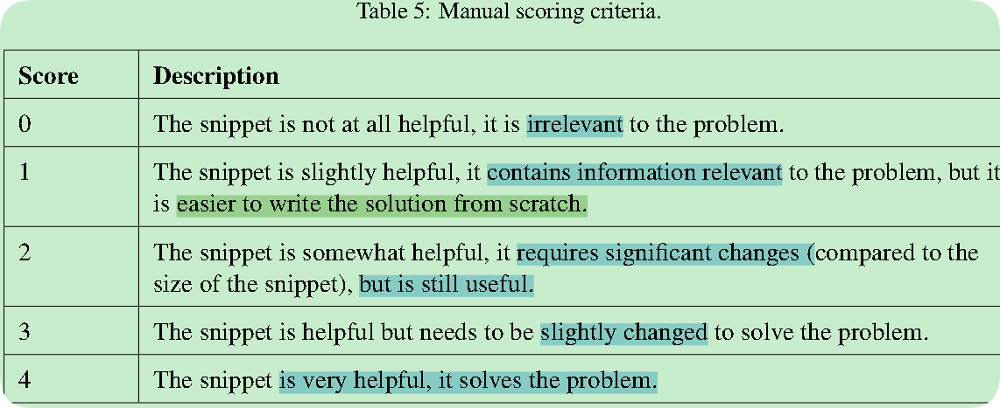

  最终构建的基准测试集包含**363个样本，涵盖37种编码场景和23种编程语言**。任务的平均字符串长度为1,906，LLM生成响应的平均字符串长度为2,650。


• **对比基线方法**

  实验将CodeVisionary与以下最先进的基于LLM的评估方法进行了比较：

​    ▪ **VANILLA**：直接提示LLM来判断响应的正确性和实用性。

​    ▪ **ICE-Score**：利用评估标准和评估步骤模板来评估LLM生成响应的实用性和功能正确性。

​    ▪ **CODEJUDGE**：引导LLM进行“慢思考”，以实现对代码语义正确性的深入可靠评估。


• **评估指标**

  为衡量评估分数与人工标注的真实分数之间的相关性，实验采用了自然语言生成（NLG）评估中常用的三个相关系数：**Kendall-Tau (τ)、Pearson (rp) 和 Spearman (rs) 系数**。

**相关性系数越高，代表该方法的评估结果越接近人类判断，性能越好**。

- **Pearson (rp):** 衡量线性关系。
- **Spearman (rs):** 衡量排序的一致性。
- **Kendall-Tau (τ):** 同样衡量排序的一致性，对数据中的异常值不敏感。


 **实验结果**

1.总体表现

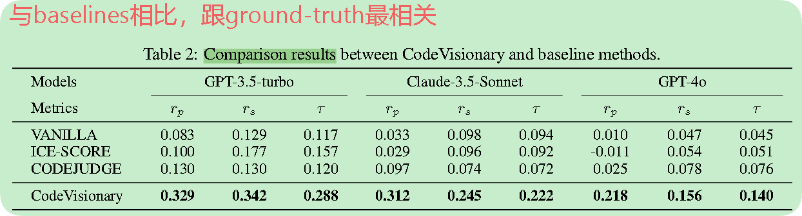

  **CodeVisionary在所有三个LLM（GPT-3.5-turbo、Claude-3.5-Sonnet和GPT-4o）的评估中始终优于所有基线方法**。

  相较于表现最佳的基线方法，CodeVisionary的平均改进分别为：**Pearson系数平均提高了0.202，Spearman系数平均提高了0.139，Kendall-Tau系数平均提高了0.117**。

  CodeVisionary在评估GPT-4o生成的响应时性能有所下降，这可能由于CodeVisionary本身也使用GPT-4o作为控制代理，从而引入了**自我增强偏见**。


  研究发现，VANILLA、ICE-Score和CODEJUDGE之间的性能差异很小，这表明**当前基于LLM的方法在理解复杂代码方面仍面临挑战**。


2. **消融研究**

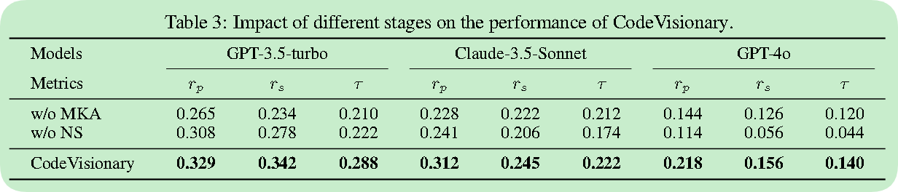

  为了探究不同组件对CodeVisionary性能的影响，构建了两个变体：

​    ▪ **不含多源知识分析阶段（w/o MKA）**：该变体采用完全自由的评估过程，而非细致的计划。

​    ▪ **不含基于协商的评分阶段（w/o NS）**：该变体多次对LLM生成响应进行评分并取平均值，但没有多评委之间的讨论。

   实验结果表明，**MKA和NS这两个阶段的加入都显著提升了CodeVisionary的性能。这证明了：**多源知识分析 (MKA) 阶段** 对于理解复杂任务、制定详细评估计划至关重要。**协商评分 (NS) 阶段** 对于整合不同观点、减少单个评估者的偏见、准确理解复杂代码非常有效。


3. **在不同编程语言和编码场景下的表现**

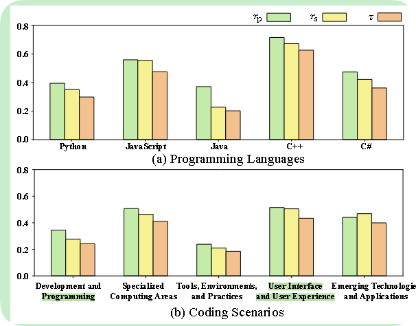

   **编程语言方面**：CodeVisionary在**C++**、**JavaScript**中也表现优异，这可能得益于其**“屏幕截图分析”功能**，能够将前端代码转换为视觉截图进行分析。

   **编码场景方面**：CodeVisionary在**“用户界面和用户体验”**以及**“新兴技术和应用”**编码场景中表现突出（rs分数分别为0.505和0.469）。这归因于其**“交互分析”**（模拟用户交互）和**“网络浏览分析”**（检索最新技术以弥补LLM知识空白）能力。


4.**评估报告案例研究**

  论文的附录（Figures 5 & 6）提供了两个完整的评估报告示例，一个是前端任务（设计一个按钮），另一个是算法任务（找出数组中只出现一次的数字）。这些案例具体展示了 CodeVisionary 如何一步步设置环境、进行多维度分析，并最终给出一个包含详细优化建议的综合报告

### 可能的启发

**1. 采用“分析+评审”的两阶段流程**

CodeVisionary 最核心的架构就是“多源知识分析”+“协商评分”。这完全可以迁移到 Code Review 中，形成一个“**自动化深度分析**”+“**多智能体协同评审**”的流程。

- **启发：** 不要让评审智能体（Reviewer Agents）直接上手看代码。而是先让一个专门的 **“分析员”智能体 (Analyst Agent)** 去做大量的预处理和信息收集工作。

- 如何实现：

  1. 自动化分析阶段 (Stage 1):

      

     当一个 Pull Request (PR) 被创建时，“分析员”智能体首先启动。它会：

     - **构建环境 (Construct):** 像 CodeVisionary 一样，在 Docker 容器中完整复现项目环境，安装所有依赖。这能直接发现“在我机器上能跑”类型的问题。
     - **执行与测试 (Dynamic Execution):** 运行所有相关的单元测试、集成测试。如果测试失败，评审流程可以直接提前终止并通知作者。
     - **深度静态分析 (Static Analysis):** 不仅是代码风格，还要运行更专业的工具，如安全漏洞扫描（如 `Bandit`）、代码复杂度分析、性能瓶颈分析等。
     - **理解意图 (Comprehend):** 分析PR的标题、描述和关联的Issue，理解这次代码变更的 **业务目的**。

  2. **协同评审阶段 (Stage 2):** “分析员”智能体将一份结构化的、包含上述所有信息的 **预分析报告** 交给一组专门的 **“评审员”智能体 (Reviewer Agents)**。这些评审员不再需要操心环境和测试，可以专注于代码逻辑本身。

**2. 引入角色扮演的专业评审智能体**

CodeVisionary 使用多个“法官”通过协商达成共识。在 Code Review 中，我们可以更进一步，为每个智能体分配一个独特的“专家角色”，模拟一个真实的、经验丰富的技术团队。

- **启发：** 放弃单一的全能评审AI，构建一个由不同专家组成的“虚拟评审委员会”。
- 如何实现：
  - **“安全专家”智能体:** 它的唯一任务就是从安全的角度审查代码，寻找潜在的SQL注入、跨站脚本（XSS）、不安全的依赖库、敏感信息泄露等问题。
  - **“性能大师”智能体:** 专注于性能。它会检查代码中是否存在效率低下的算法、数据库的 N+1 查询问题、内存泄漏风险等。
  - **“代码可读性与架构师”智能体:** 负责评估代码是否遵循了项目的设计模式和架构规范，命名是否清晰，注释是否有效，模块划分是否合理。
  - **“逻辑正确性”智能体:** 这是最难的角色。它需要结合“分析员”给出的业务意图，去判断代码逻辑是否准确地实现了需求。

这些智能体在同一个PR下进行 **“讨论”**（类似CodeVisionary的协商），它们可以互相认同、质疑或补充彼此的发现，最终形成一个全面、多维度的评审意见。

**3. 生成结构化、可操作的评审报告**

CodeVisionary 最终会生成一份精美的PDF报告。Code Review 的最终产出也应该是高质量、易于开发者理解和操作的。

- **启发：** AI 的评审意见不应是零散的评论，而应是一份 **结构化的总结报告**。
- 如何实现：
  - **分级分类:** 将所有发现的问题按照 **严重性**（如 `Critical`, `Major`, `Minor`, `Suggestion`）和 **类别**（如 `Security`, `Performance`, `Bug`, `Style`）进行分类。
  - **提供解决方案:** 对于发现的每个问题，不仅要指出问题所在，还要尽可能提供具体的、可复制粘贴的 **修改建议**。
  - **总结性概览:** 在所有评论的开头，给出一个总体性的总结，例如：“本次PR在功能上已完成，但发现1个严重安全隐患和3个可读性建议。请优先处理安全问题。”

**4. 警惕并利用“模型偏见”**

CodeVisionary 的实验揭示了GPT-4o在评估自己生成的代码时可能存在的“自我增强偏见”。这在Code Review中是一个至关重要的警示。

- **启发：** 如果代码是AI（如Copilot）辅助生成的，那么评审AI如果和生成AI是同源的，可能会“放水”。我们可以利用这个发现来构建更鲁棒的系统。
- 如何实现：
  - **引入异构模型:** 在“虚拟评审委员会”中，故意使用 **来自不同公司、不同架构的LLM**。例如，“安全专家”使用 Claude-3.5-Sonnet，“性能大师”使用 GPT-4o，“架构师”使用一个微调过的 Llama-3 模型。这种模型的“多样性”可以有效打破偏见，提供更多元的视角。
  - **设立“挑战者”角色:** 可以设置一个专门的“红队”或“挑战者”智能体，它的任务就是质疑其他智能体的发现，以减少误报和群体思维。


## The Rise of AI Teammates in Software Engineering (SE) 3.0: How Autonomous  Coding Agents Are Reshaping Software Engineering

arxiv  、Queen’s University, Canada  、 **AHMED E. HASSAN**,


 **SE 3.0的定义与演进** 论文将软件工程的发展划分为几个阶段：

 **SE 1.0 (经典软件工程)**：传统的手动编码时代，没有AI辅助。

 **SE 1.5 (预测性编码)**：引入了代码自动补全、智能建议等微观层面的辅助，但没有自主性。

 **SE 2.0 (AI辅助软件工程)**：大型语言模型（LLMs）开始生成完整的功能、测试或样板代码，人类开发者仍处于控制地位，AI作为强大助手。

 **SE 3.0 (智能体软件工程)**：开发者与自主AI队友协作，AI智能体能在任务层面进行端到端的操作（设计→编码→测试→提交），开发者角色转变为设定目标、权限和审查最终变更

### 简介

核心思想与目标

论文的核心观点是，**自主AI编码agent（如Devin, OpenAI Codex等）已经不再是未来的概念，而是正在真实世界中大规模、积极地参与软件开发的“AI队友”**。作者将这个由AIagent深度参与、以意图驱动的软件开发新范式称为**软件工程3.0 (SE 3.0)**。

为了从理论推测转向实证研究，论文的主要目标是：

1. 构建并发布第一个大规模、捕获野生（in-the-wild）AI agent活动的数据集 **AIDEV**。
2. 利用该数据集**分析这些AI队友的实际表现**、它们如何与人类开发者协作，以及它们对软件开发流程的真实影响。为未来在人-AI协作、AI治理和下一代软件工程工具的研究奠定经验基础。

主要贡献

1. **发布AIDEV数据集**：这是论文最核心的贡献。该数据集包含了由五大主流自主编码代理（OpenAI Codex, Devin, GitHub Copilot, Cursor, Claude Code）创建的超过 **45.6万个** GitHub拉取请求（Pull Requests, PRs），覆盖了超过6.1万个代码仓库和4.7万名开发者。数据集的详细信息可在 [GitHub](https://github.com/SAILResearch/AI_Teammates_in_SE3) 查看。
2. **揭示真实世界表现**：通过对数据集的分析，论文首次系统性地揭示了AI代理在真实项目中的表现，发现其与在受控基准（如SWE-bench）上的表现存在显著差异。
3. **提出九个未来研究方向**：基于实证发现，论文为学术界和工业界指出了九个具体且重要的研究方向，旨在更好地理解、评估和引导AI代理的发展。


### AIDEV数据集

- **数据来源**：研究者们从GitHub上收集了由五个顶尖自主编码代理——**OpenAI Codex, Devin, GitHub Copilot, Cursor, Claude Code**——创建的公开PRs。

- 收集方法

  ：他们利用了这些代理在GitHub上留下的独特“指纹”，例如：

  - OpenAI Codex: `head:codex/` (PR来自以`codex/`开头的分支)
  - Devin: `author:devin-ai-integration[bot]` (PR作者是Devin的机器人账号)
  - Claude Code: `"Co-Authored-By: Claude"` (PR描述中包含特定文本)

- **数据规模**：最终获得了**456,535个PRs**，来自**61,453个代码仓库**和**47,303名开发者**。这是一个前所未有的规模。

- **数据内容**：不仅仅是PR列表，每个PR都包含了丰富的元数据，如：代码改动、提交历史、评审评论、评审人身份、PR生命周期事件（打开、合并、关闭时间）等。这使得进行深度分析成为可能。

- **高质量子集 (AIDEV-POP)**：为了确保分析的现实意义，他们创建了一个名为`AIDEV-POP`的子集，只保留那些在流行项目（GitHub星标数 > 500）中的PRs，排除了大量可能仅用于测试或玩票性质的提交。论文中的大部分发现都基于对这个子集的分析。

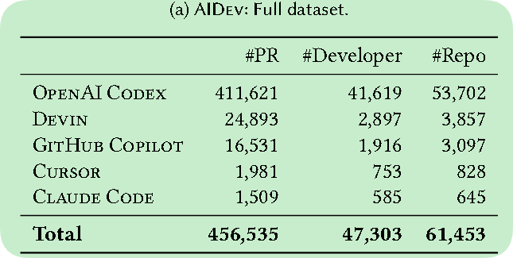

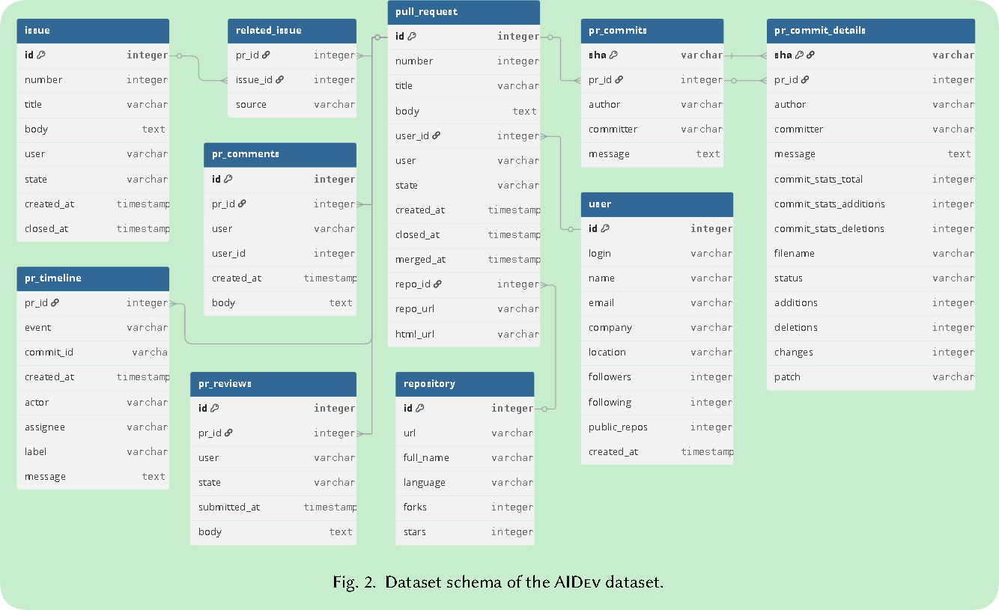


​	为了进行有意义的分析，进一步创建了一个名为 **AIDEV-POP** 的高质量子集，该子集只包含在受欢迎的代码仓库（GitHub星标 > 500）中的PRs。论文中的大部分发现都基于对这个子集的分析，并**与同一仓库中由人类创建的PRs**进行对比。

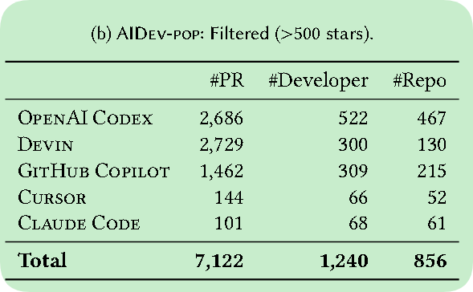


### 统计与主要发现

论文通过统计分析研究，得出了多个深刻且有些出人意料的发现：

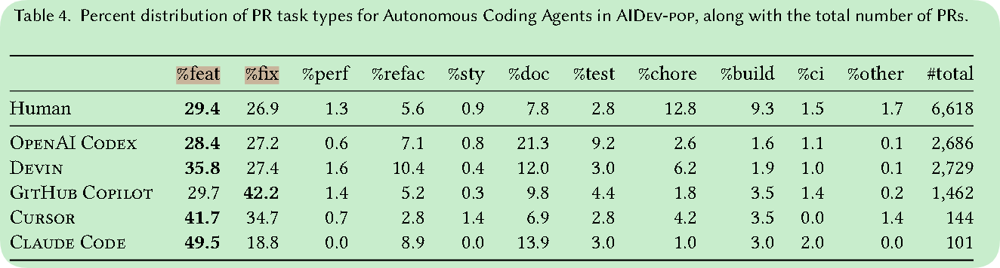

1.**AI已成协作者，而非仅是助手 (Finding #1)**：超过55%的AI代理PRs用于**功能开发(feat)**和**Bug修复(fix)**这类核心开发任务，其**任务分布与人类开发者非常相似**，表明AI已经深度参与到创造性工作中。


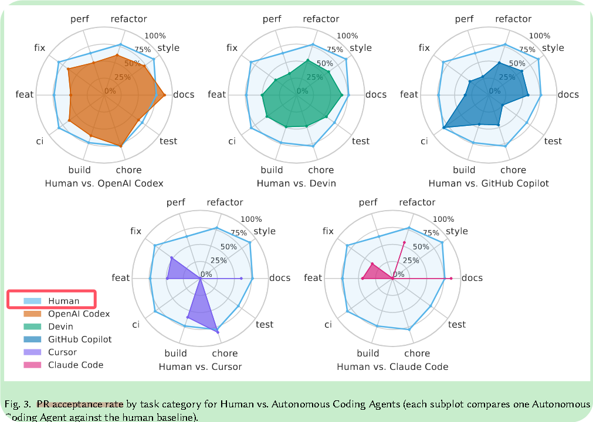

2.**PR接受率显著低于人类 (Finding #2)**：尽管AI在基准测试中表现优异，但在真实世界中，**所有AI agent的PR接受率都远低于人类**。例如，OpenAI Codex的接受率最高，也只有64%，而人类PR的接受率为76.8%。这揭示了基准测试与现实应用之间的巨大鸿沟。

3.**文档任务是AI的强项 (Finding #3)**：在**文档(docs)**相关的PRs上，AIagent（特别是OpenAI Codex和Claude Code）的接受率超过了人类。

 文档任务主要涉及自然语言生成而非复杂的程序逻辑，这与LLM的核心优势高度吻合。

 高接受率也可能反映出审阅者对AI生成的文档有更高的信任度，因为文档修改的功能风险较低


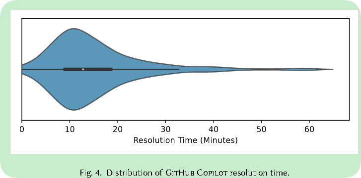

**4. GitHub Copilot完成任务的速度极快 (Finding #4)** 它能在**18.5分钟内完成75%的PR任务**，中位时间仅为12.8分钟。这远快于人类通常需要数天才能解决问题的周期，极大地提高了开发迭代速度。

虽然平均表现强劲，但其**任务完成时间分布存在长尾效应**，95%的任务在一小时内完成，这可能表明存在冷启动或API限制等潜在基础设施问题


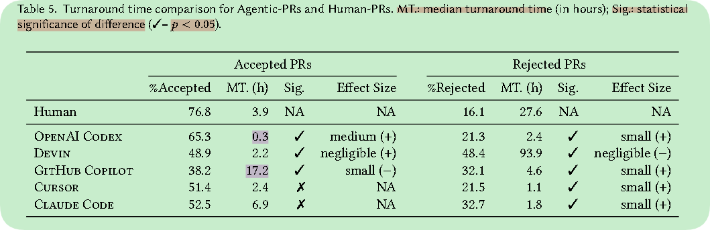

**5. OpenAI Codex的PRs周转时间缩短10倍，但引发了对审查深度的质疑**。

   **OpenAI Codex接受的PRs中位周转时间为0.3小时（18分钟）**，显著快于人类PRs（3.9小时）。被拒绝的PRs处理速度也更快。

   这表明OpenAI Codex的PRs要么明显正确，要么明显有缺陷，允许审阅者快速做出决策。

   相比之下，**GitHub Copilot**的情况则相反：接受慢，拒绝快。其接受的PRs需要17.2小时，是被接受的人工PRs的4倍多。

   这些趋势虽然提高了效率，但**引发了对审查深度不足的担忧**，尤其是在缺乏问责机制的情况下


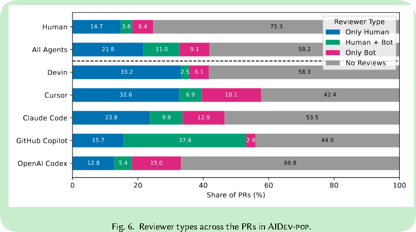

**6. 人机混合评审模式正在兴起 (Finding #6)** 虽然人类评审员仍是主力，但以GitHub Copilot为代表的代理正推动一种转变：其**37.4%的PRs由人类和机器人共同评审**。这预示着代码审查流程的未来将是人机协作的。

  多数PRs（无论是人类还是AI生成）没有明确的审查。

  在AI生成的PRs中，机器人审阅者（20.1%）比人工PRs（10.0%）更为普遍。

  **GitHub Copilot的PRs显著转向了人机混合审查模式（37.4%的PRs涉及人机共同审查）**，其中机器人常作为共同审阅者或初步筛选者。


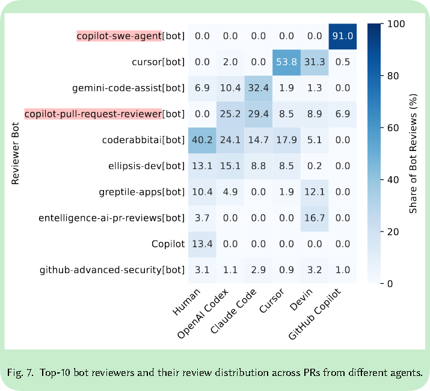

**7. ** **自主编码智能体及其配套审查机器人常来自同一供应商，可能强化偏见 (Finding #7) **

​	例如，**GitHub Copilot的PRs大部分由copilot-pull-request-reviewer[bot]审查**（占GitHub Copilot PRs机器人审查的91.0%）。

   这种供应商对齐的审查循环简化了工作流程，但也**可能导致内部偏见**，因为机器人可能会忽略其调优假设之外的风格问题或潜在错误


**8.AI编码以“量”取胜，而非“质”，AI辅助编码优先考虑吞吐量而非复杂度 (Finding #8)** 

 对OpenAI Codex使用情况的分析显示，一位开发者在3天内提交了164个由Codex辅助的PRs，几乎与过去三年半人类提交的PR数量（176个）持平。

 然而，**AI辅助的PRs中只有9.1%引入了圈复杂度变化，远低于人工PRs的23.3%**。

  这表明AI生成的代码倾向于更简单、模板式的更新，**以吞吐量为代价换取PRs的精细度**


**9. 作者归属混乱，问责制度缺失 (Finding #9)** 

 **Devin、GitHub Copilot和Cursor**在提交元数据中明确标明了作者身份。

 但**OpenAI Codex和Claude Code**通常将贡献归因于人类开发者，OpenAI Codex甚至不提供任何归属信息。

 这种透明度的缺乏损害了负责任AI的核心原则（如透明度、可审计性和问责制），使得后续调试、bug分类或责任追溯变得困难


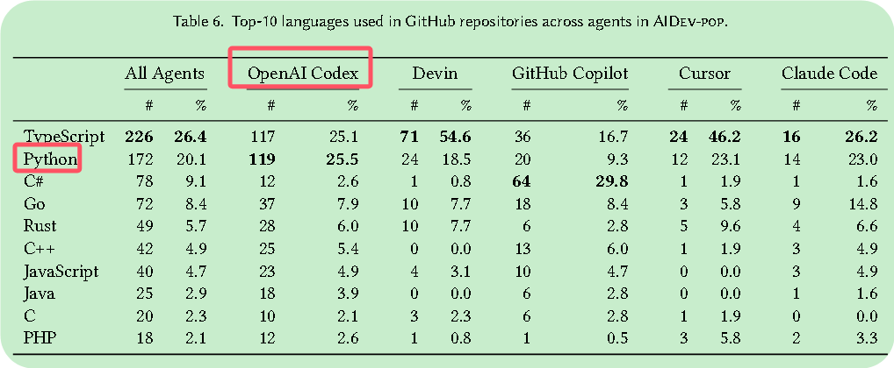

**10. AI代理展现出不同的语言偏好和领域特化 (Finding #10)**

 **TypeScript**是所有智能体中最常用的语言。

 **OpenAI Codex**明显偏向**Python**，而**GitHub Copilot**则大量偏向**C#**。

 这些差异表明，每个智能体都在特定领域发展了特长，这由工具生态系统、开发者意图和集成环境塑造


### 重要研究方向

以下是**自主编码智能体**未来发展的九个重要研究方向

 **研究方向1：开发面向集成的基准测试，并将其植根于真实的软件工程工作流中**。 

当前的静态基准测试（如SWE-bench）虽能评估代码的语法正确性，但**无法有效捕捉现实世界中PR（Pull Request）接受所依赖的细微人为判断**，例如可维护性、代码风格和项目特有上下文。

研究指出，AI生成的PRs尽管在基准测试中表现出色，但实际接受率远低于人类。因此，未来的基准测试应关注**AI贡献是否真正改进了现实世界中的软件开发**，而不仅仅是功能正确性。AIDev数据集为此提供了基础，能帮助研究人员识别当前自主编码智能体在**原子级软件工程能力方面**与人类开发者的差距，从而指导有针对性的改进

• **研究方向2：分析被拒绝的PRs，以识别自主编码智能体的失败模式**。 

被拒绝的PRs中包含着宝贵的诊断信息，如审查评论、时间线事件和补丁级反馈。通过将GitHub事件映射到具体的失败模式（如逻辑错误、语法错误、测试不足或与项目规范不符），可以对AI智能体的错误进行分类，并**开发有针对性的缓解策略**。

这项研究将有助于设计具有重试能力或自我诊断功能的智能体，使其能够**自我检测并修正错误**

**研究方向3：对自主编码智能体进行延迟感知编排**。 

GitHub Copilot的PR任务完成时间呈现出“长尾”现象，即虽然大部分任务完成迅速，但仍有部分任务存在显著的延迟（75%的任务在18.5分钟内完成，但95%的任务需要超过一小时）。这种不稳定的延迟会**阻碍现代CI/CD（持续集成/持续交付）工作流的及时反馈**。未来的研究应探索系统级解决方案（如缓存、推测执行）和提示层面的效率技术（如Chain-of-Draft策略，可显著减少Token使用和时间）。目标是减少中位和长尾延迟，使自主编码智能体能在更短、更可预测的时间内交付成果。

**研究方向4：理解并降低人工审查AI代码变更的成本**。

 AI生成的PRs审查成本不仅在于代码的正确性，还在于**验证其模糊性和所需的人工心力**。虽然部分AI生成的PRs审查迅速，但其背后的审查深度和监督程度仍不明确。未来的研究可以利用AIDev数据集捕捉审查工作量的信号，例如审查评论量、变更请求的存在、针对反馈的后续提交，以及整合反馈所需的时间。这有助于设计新的智能体能力或工作流，使其能够**解释代码变更、主动解决合并冲突或最小化差异复杂度**，从而减轻审查负担

 **研究方向5：理解并改进智能体代码审查对拉取请求工作流 质量和流程 的贡献**。

 随着审查机器人（如coderabbitai和copilot-pull-request-reviewer）和自主编码智能体在软件开发工作流中变得日益活跃，代码审查作为**确保软件质量的关键环节**变得愈发重要。

但现有评估自动化代码审查工具的方法，未能充分回答这些审查的**实际效用**。AIDev数据集**`可用于深入研究审查行为，包括机器人提供反馈的类型、反馈与PR合并结果的关系，以及机器人如何与人类审查者协同工作`**。这对于**提升智能体代码审查在真实世界工作流中的质量和效率**至关重要。

**研究方向6：设计审查分流系统，以管理AI生成贡献的规模和复杂性**。

 自主编码智能体大规模生成PRs将使人工审查工作量成为瓶颈。未来的分流系统需要超越静态规则，整合动态因素如PR的复杂性、风险级别和审查者的可用性。例如，低风险的文档修改可以路由给初级开发者或机器人，而高影响力的系统级变更应由经验丰富的审查者处理。AIDev数据集包含审查者身份、时间戳和任务类别等元数据，可用于识别和评估分流策略的效果，例如**节省的审查时间、工作量分布以及审查缺陷的减少**

• **研究方向7：理解和评估智能体代码贡献的长期质量**。 

尽管AI生成代码可能简化某些维护任务，但其对软件质量的长期影响仍存在关键问题。未来的研究应超越静态复杂度指标，通过缺陷密度、审查延迟、测试覆盖率和bug修复工作量等指标，**检查AI生成代码的长期性能**。同时，还需考虑AI在不同项目类型（如基础设施库、移动应用、后端系统）中的不同表现，进行更细致的评估，并纳入领域、项目规模和团队实践等因素。

AIDev数据集提供了丰富的Agentic-PR历史数据，包括AI代理出现前人类开发者的贡献，为**跨时间、作者和工具使用的基准测试**提供了坚实基础。

 **研究方向8：分析和改进人机软件协作的规划阶段**。 

在任何代码编写之前，**任务的范围界定和规划**是关键的、但常被忽视的阶段。这个规划过程对于将人类意图转化为可执行步骤至关重要，并对AI生成代码的成功起着决定性作用。然而，许多当前的智能体**模糊了这一推理阶段**，使得难以理解决策是如何做出的或错误是如何产生的。

`GitHub Copilot在PR描述中保留了丰富的规划痕迹`，未来研究可利用这些痕迹调查**`哪些输入提示和规划结构能带来更有效的结果`**，开发者如何与AI生成的计划互动，以及哪些规划能力能区分强弱智能体。


**研究方向9：研究编程语言特性如何影响智能体的有效性和可靠性**。 

一个悬而未决的问题是，**具有更强类型系统（如TypeScript和Rust）的语言是否能为自主智能体提供隐含优势**。这些语言可能通过更丰富的编译时反馈和结构性约束，提供一种内置的“脚手架”，帮助智能体**避免错误并更有效地实现正确的代码**。

这一假设指向了编程语言设计与AI驱动自动化交叉领域一个有前景的未来研究方向：语言层面的特性如何支持、放大或限制智能体的行为。

深入研究这种相互作用可以指导选择更适合智能体能力的语言，并塑造**语言感知型AI队友**的设计。


### 可能的启发价值

太棒了！这篇论文对您正在进行的 **Code Review Multi-Agent（代码审查多代理）研究** 来说，其价值和启发点是巨大且直接的。它几乎可以被看作是为您这个领域提供了第一份大规模的、来自真实世界的“战报”和“地图”。

简单来说，这篇论文**为您正在构建的理论和系统，提供了亟待解决的真实问题、可供验证的实验数据和极具说服力的研究动机**。

以下是我为您提炼的核心启发点和价值：

1. 提供了真实世界的“战场”和数据集 (启发点：从模拟到现实)

您的研究可能依赖于模拟环境或小规模数据集，而这篇论文的核心贡献 **AIDEV 数据集**，为您提供了一个宝贵的、真实的实验平台。

- **直接价值**：您可以直接利用 AIDEV-POP 数据集来**测试和验证您的多代理系统**。例如，`您可以将数据集中的 PRs 作为输入，让您的代理系统进行审查，然后将其输出（如评论、建议）与数据集中真实的人类和机器人评审历史进行对比`。这比任何模拟数据都更有说服力。
- **启发点**：分析数据集中现有评审机器人（如 `coderabbitai[bot]`, `copilot-pull-request-reviewer[bot]`）的行为模式。它们是如何分工的？它们关注哪些问题？您的多代理系统可以**将这些现有机器人作为“基线”**，证明您的系统在哪些方面更优越。

2. 揭示了多代理系统亟待解决的核心问题 (启发点：找到研究的“靶心”)

这篇论文用数据明确指出了当前代码审查流程中的痛点，这些痛点恰好是您的多代理系统可以着力解决的。

- **问题1：供应商闭环与偏见 (Finding #7)**

  - **直接价值**：这是**您研究的最佳切入点**。论文揭示了单一供应商的“代理+评审机器人”闭环会带来偏见。这为您构建一个**异构、中立的多代理审查系统**提供了强有力的动机。
  - **启发点**：您可以设计一个包含来自**不同提供商**的评审代理的“联盟”。您的研究核心将是如何让这些异构代理进行**通信、协作和达成共识**。例如，一个代理发现风格问题，另一个发现安全漏洞，第三个代理负责总结并呈现给人类。

- **问题2：人类评审成为瓶颈 (Finding #5, #6)**

  - **直接价值**：论文用数据证明了人类审查者面对AI海量PR时的挣扎（评审时间变长）。这完美地论证了您的多代理系统在**负载均衡和任务分诊 (Triage)** 方面的必要性。

  - 启发点

    ：您的多代理系统可以设计成一个

    分层审查框架

    。例如：

    - **第一层**：低阶代理（如Linter）负责快速过滤掉语法和风格问题。
    - **第二层**：中阶代理负责更复杂的逻辑检查和测试用例生成。
    - **第三层**：高阶代理（或人类）负责架构和业务逻辑的最终审核。 这直接对应了论文的**研究方向 #6 (Design review triage systems)**。

3. 为您的代理设计提供了深刻洞见 (启发点：如何设计更智能的代理)

论文的发现能直接指导您如何设计多代理系统中的每一个代理角色。

- **洞见1：代理需要专业化 (Finding #10)**
  - **启发点**：您的多代理系统不应是同质的。论文证明了AI代理存在语言偏好（Python vs C#）。因此，您可以设计**“专家代理”**，例如一个“Python 专家代理”，一个“安全漏洞专家代理”，一个“前端性能专家代理”。您的研究可以关注**如何根据PR的内容动态地调度这些专家代理**。
- **洞见2：审查需要超越“正确性” (Finding #2, #8)**
  - **启发点**：您的代理系统不能只关注“找 Bug”。论文证明，PR被拒的很多原因是可维护性、代码复杂度等。您可以在系统中引入一个**“架构守护者”代理**，它不关心代码是否能运行，而专门负责评估其对长期项目健康的影响，例如圈复杂度的变化、是否引入技术债等。
- **洞见3：降低人类的认知负荷 (Research Direction #4)**
  - **启发点**：这是一个非常新颖的方向。您的多代理系统最终目标不仅是发现问题，更是**辅助人类高效决策**。您可以设计一个**“沟通者”代理**，其唯一任务是将在其他代理发现的10个技术问题，智能地总结成3条清晰、可操作的建议呈现给人类审查者，极大地降低其心智负担。

4. 提供了全新的评估指标 (启发点：如何科学地衡量系统效果)

- **直接价值**：别再用“发现 Bug 的数量”作为您系统的唯一评估指标了！这篇论文证明这是一个虚荣指标。

- 启发点

  ：您应该采用更贴近现实的、更高级的评估指标来衡量您的多代理系统，例如：

  - **PR 合并率 (Acceptance Rate)**：您的系统介入后，PR的合并率是否提升了？
  - **合并时间 (Time to Merge)**：合并PR所需的时间是否缩短了？
  - **人类审查评论数量**：人类审查者需要手动输入的评论是否减少了？

**总结一下，这篇论文对您的价值是：**

1. **给你数据**：提供了可以直接用来做实验的 AIDEV 数据集。
2. **给你问题**：揭示了真实世界中亟待解决的核心问题（如供应商偏见、人类瓶颈），让您的研究“师出有名”。
3. **给你方向**：为您的代理设计（专业化、分层、降低认知负荷）和系统评估（新指标）提供了清晰的指导。
4. **给你弹药**：在您撰写自己的论文时，可以大量引用这篇论文的发现来论证您工作的必要性和创新性。

可以说，这篇论文为您在“代码审查多代理”这个前沿领域的研究，铺平了道路，并点亮了前方的灯塔。


## A SURVEY OF SELF-EVOLVING AGENTS: ON PATH TO  ARTIFICIAL SUPER INTELLIGENCE（ai辅助）

arxiv 、  Mengdi Wang、 Princeton AI Lab, Princeton University


"It is not the most intellectual of the species that survives; it is not the strongest that survives; but **the species that survives is the one that is able best to adapt and adjust to the changing environment** in which it finds itself."

​													 — Charles Darwin

### 简介

传统的AI模型（如GPT-4）是**静态的**，一旦训练完成就不会再改变。

而“自进化智能体”能够克服这一根本限制，通过与环境的持续互动、从成功或失败的经验中学习，从而实现**自主地、持续地改进和演化**。

这是通向更高级别的人工智能，乃至人工超级智能（ASI）的必经之路。

这篇综述的**主要贡献**在于，它首次系统性地整理了该领域的研究现状，并提出了一个清晰的分析框架，围绕以下三个核心问题展开：

1. **什么能够进化 (What to Evolve?)**：智能体可以改进哪些部分？论文探讨了从核心**模型**、**记忆**系统、**工具**使用到整个智能体的**架构**等多个可进化的方面。
2. **何时进化 (When to Evolve?)**：进化发生在什么时候？文章将其分为任务执行中的**实时进化**和任务完成后的**回顾式进化**。
3. **如何进化 (How to Evolve?)**：用什么方法来进化？论文总结了三大主流路径：**基于奖励的进化**、**模仿与演示学习**，以及受生物学启发的**群体进化**。

同时也介绍了如何**评测**


### 进化什么

**不要只盯着模型参数，一个智能体的所有组成部分都应该是活的、可迭代的。**

1. **模型 (The Cognitive Core):** 这是智能体的大脑，即底层的语言模型本身。进化它意味着通过自学习、自奖励、或与环境交互，直接更新模型的内部参数和策略，目的是实现能力的深度跃迁。这是最根本但也最“重”的进化方式。

   **SELF (Self-Evolution with Language Feedback)**

   - **如何进化:** 这个智能体在执行任务后，会收到人类或其他模型给出的自然语言反馈，比如“你的回答不够全面，应该补充XXX方面”。SELF框架会将这些语言反馈转化为新的训练数据，然后用监督式微调（SFT）来更新模型权重。

2. **上下文 (The Working Memory & Instruction Set):** 这是智能体思考和行动的“临时记忆”和“行为准则”，主要包括记忆和提示词。进化它意味着优化**智能体如何存储、检索、遗忘过去的经验（记忆演化）**，以及如何**更好地理解和执行指令（提示词优化）**。这是最灵活、成本最低的进化方式。

   **例子 (记忆): Mem0**

   - **它如何进化:** Mem0 不是一个简单的记忆存储器，它建立了一套完整的记忆管理系统。当智能体接收新信息时，它会执行`ADD`（添加新事实）、`MERGE/UPDATE`（合并或更新旧事实）、`DELETE`（删除矛盾事实）等操作。这使得智能体的长期记忆库像一个动态演化的知识图谱，能保持一致性和时效性。智能体的进化体现在它拥有的知识库越来越优质和结构化。

   **例子 (提示词): PromptBreeder**

   - **它如何进化:** 这个框架把提示词（Prompt）看作是生物的基因（DNA）。它会生成一个“提示词种群”，然后通过模拟生物进化的方式，对这些提示词进行“变异”（随机修改词语、句子）和“交叉”（组合不同提示词的优点）。每一代都会淘汰表现差的提示词，保留表现好的，如此循环往复。最终，进化出能让大模型表现最佳的“超级提示词”。这里进化的不是模型本身，而是驱动模型的指令集。

3. **工具 (The Action Toolkit):** 这是智能体与世界交互的“双手”。进化它意味着智能体**不应局限于使用给定的工具**，而要能自主地发现、**创造**、**调试和管理自己的工具集**，从而不断扩展自身的能力边界。

   **例子: Voyager**

   - **它如何进化:** 在《我的世界》（Minecraft）这个开放世界里，Voyager 会根据任务需求，自主编写新的代码（JavaScript函数）来形成新的技能。比如，当它需要“挖铁矿”时，如果技能库里没有，它就会当场写一个`mineIron()`函数。这个函数会被存入它的技能库，供以后随时调用。随着探索的深入，它的技能库不断膨胀和进化，让它能完成越来越复杂的任务。

4. **架构 (Architecture)**：

   **单智能体系统优化 (Single-Agent System Optimization)**：这关注的是单个智能体**内部组成模块如何更好地协同工作**。例如，智能体可以调整其规划模块、记忆模块或工具使用模块之间的连接方式，甚至修改其自身的“源代码”，从而优化其整体性能和效率。

   **多智能体系统优化 (Multi-Agent System Optimization)**：这更进一步，关注的是**多个智能体如何组织和协作**。这包括优化它们之间的沟通模式、任务分配策略，甚至动态地调整团队结构，以最大化整个智能体群体的协作效能，解决复杂问题。

- **例子 (单智能体): AgentSquare**
  - **它如何进化:** 这个框架把一个智能体的构成（如规划模块、记忆模块、行动模块）看作可以自由组合的“乐高积木”。它定义了一个包含各种不同模块选项的“设计空间”，然后用进化算法来自动搜索，为特定任务“组装”出一个最高效的智能体架构。这里进化的不是某个具体部件，而是智能体自身的“组织架构图”。
- **例子 (多智能体): AFlow (Automating agentic workflow generation)**
  - **它如何进化:** 当面对一个复杂问题需要多个智能体协作时，AFlow可以自动设计它们的协作流程。它会利用蒙特卡洛树搜索（MCTS）来探索由不同智能体节点和连接构成的庞大工作流空间，自动找出最高效的团队沟通和任务分配结构。这里进化的不再是单个智能体，而是整个“团队”的协作模式


### 什么时候进化

1. **测试中进化 (Intra-test-time Self-Evolution) —— 临场应变**

- **核心理念:** **在单次任务执行的过程中进行实时的自我调整和进化。** 学习和行动是紧密耦合的，目标是立即提升在**当前这个任务**上的表现。
- **工作方式:** 智能体在解决一个问题的途中，如果遇到困难或发现计划行不通，它会立即暂停，进行反思、修正计划、或调用一个即时学习机制，然后带着新的策略继续完成**同一个任务**。
- 典型例子: Reflexion
  - 这个智能体在一次尝试失败后，不会直接开始下一次。它会先生成一段“自我反思”的文本（例如，“我刚才的计划失败了，因为我错误地以为工具A能做到B。下一次我应该先用工具C检查一下”）。这段反思会被立刻加入到它的上下文（短期记忆）中，指导它在**同一任务中的下一次尝试**。进化发生在两次尝试之间，是即时的。
- **一句话概括:** 这是智能体的“快思考”和“即时反应”能力，非常适合处理动态、不可预测的环境，但学习到的经验可能比较局部，不一定能泛化到其他任务。

2. **任务间进化 (Inter-test-time Self-Evolution) —— 课后复盘**

- **核心理念:** **在完成一个或一批任务之后，进行回顾式的、累积性的学习和进化。** 学习和行动是解耦的，目标是提升在**未来所有任务**上的通用能力。
- **工作方式:** 智能体完成任务后，系统会收集它所有的成功和失败轨迹。然后通过离线（offline）或在线（online）的方式，从这些经验中提炼知识，用于更新模型参数、记忆库或工具集。
- 典型例子: STaR (Self-Taught Reasoner)
  - 这个框架让模型先尝试解决一批问题。对于那些它最终做对的题目（即使一开始思路是错的），它会反过来为正确答案生成一个完美的“解题思路”（rationalization）。然后，系统会把这些“问题+完美解题思路”的样本收集起来，对模型进行一次监督式微调（SFT）。通过这种方式，模型在任务之间，通过“复盘”成功经验，系统性地提升了自己未来的推理能力。
- **一句话概括:** 这是智能体的“慢思考”和“刻意练习”能力，它能将经验沉淀为更稳固、更通用的能力，但对于任务中突发的状况反应较慢。

**小结：**

这两个时机并非相互排斥，而是**互补的**。一个理想的自进化智能体应该兼具两种能力：

- **用“测试中进化”来应对眼前的挑战，保证任务的成功率。**
- **用“任务间进化”来总结经验教训，实现长期的、根本性的成长。**

将两者结合，就形成了一个强大的学习闭环：在执行任务时灵活应变，在任务结束后深入复盘，从而实现快速适应和持续成长的统一。

### 怎么进化

1. **基于奖励的自进化 (Reward-based Self-Evolution) —— “从反馈中试错”学派**

- **核心理念:** **通过接收和最大化“奖励”信号来学习和改进。** 智能体的行为由一个反馈回路引导，做得好就给正向激励，做得差就给负向激励。这是最接近强化学习（RL）思想的范式。
- 奖励信号的来源非常多样，决定了学习的风格：
  - **文本反馈 (Textual Feedback):** 奖励不是一个简单的分数，而是具体的自然语言批评或建议。例如 **Reflexion**，智能体失败后会自我反思：“我本应先检查文件是否存在，而不是直接读取。” 这段文本就成了指导下一次行为的“奖励信号”。
  - **内部奖励 (Internal Rewards):** 奖励信号来自智能体自身，无需外部评判。最常见的是模型的“置信度”。例如，智能体对自己的某个答案有99%的置信度，这本身就可以作为一个强烈的正向奖励。
  - **外部奖励 (External Rewards):** 奖励由外部环境或规则直接给出。比如，在编程任务中，代码成功编译运行就是一个明确的奖励；在玩游戏时，得分就是奖励。
  - **隐式奖励 (Implicit Rewards):** 奖励信号没有被明确标注，而是隐藏在交互数据中，需要智能体自己去发现。例如，模型可能发现，只要它的回答中包含某种格式，用户就更倾向于采纳，于是它就学会了这种格式，尽管没人明确告诉它“这样写可以加分”。
- **一句话概括:** 智能体像一个不断试错的学生，通过老师（外部环境）、同学（语言反馈）或自己（内部置信度）的打分来调整学习策略，最终学会如何“考高分”。

2. **模仿与演示学习 (Imitation and Demonstration Learning) —— “从榜样中学习”学派**

- **核心理念:** **通过学习高质量的“成功案例”（demonstrations）来提升能力。** 重点不是试错，而是直接模仿好的行为模式，从而高效地掌握技能。
- 成功案例的来源决定了模仿的方式：
  - **自我生成 (Self-Generated):** 智能体自己创造学习榜样。最典型的就是 **STaR** 框架，模型先自己解题，然后为那些做对的题目，反过来生成完美的解题步骤，再用这些“自己教自己”的完美范例来训练自己。
  - **跨智能体学习 (Cross-Agent Learning):** 从其他智能体的成功经验中学习。在一个多智能体系统中，一个智能体的成功轨迹可以被存入一个共享的“经验库”，供所有其他智能体学习和模仿。
  - **混合模式 (Hybrid):** 结合自我生成的案例和人类专家提供的案例，取长补短，实现更稳健的学习。
- **一句话概括:** 智能体像一个学徒，通过观摩和拆解大师（专家或其他成功的自己）的作品来快速入门和提升技艺，避免了从零开始摸索的低效率。

3. **基于群体的进化方法 (Population-based and Evolutionary Methods) —— “从竞争中择优”学派**

- **核心理念:** **模拟达尔文的自然选择，优胜劣汰。** 它不再优化单个智能体，而是维护一个由众多不同智能体（或智能体设计方案）组成的“种群”，通过竞争、变异和选择，让整个种群朝更强的方向迭代。
- 进化的单位可以是：
  - **单个智能体的进化:** 种群由一个智能体的不同版本组成（比如拥有不同提示词、不同代码或不同超参数）。例如 **PromptBreeder**，它会进化一个提示词种群，最好的提示词被保留下来产生下一代。
  - **多智能体的进化:** 进化的单位是整个“团队”。种群由不同的团队协作架构和沟通策略组成。通过评估每个团队完成任务的效率和效果，来选择和演化出最高效的“梦之队”。
- **一句话概括:** 智能体系统像一个生态系统，通过内部的“生存竞赛”，让最适应环境的策略、架构和团队脱颖而出，实现全局和开创性的优化。

**小结**

这三大“学派”为“如何进化”提供了丰富的工具箱。在实践中，它们常常被结合使用：

- 可以用**模仿学习**来快速冷启动，让智能体达到一个基础水平。
- 然后用**奖励驱动**的方式，在特定任务上进行精细打磨和持续优化。
- 当遇到系统级瓶颈或需要探索全新解决方案时，可以引入**进化方法**来进行结构性的、全局的搜索和创新。

理解这三种范式，就能为你的智能体设计出具体、可行的成长路径。

### 怎么评测

**对自进化智能体的评测，必须从一张“静态快照”（单次任务得分）转变为一部“动态纪录片”（长期成长轨迹）**

将评测体系拆解为两大块：**评测的目标**（评什么）和**评测的范式**（怎么评）


**评测的五大目标 (The 'What' to measure)：**

一个好的自进化智能体，不能只看它最后“会不会”，还要看它成长的“好不好”。因此，评测需要关注以下五个核心维度：

1. **适应性 (Adaptivity):**
   - **衡量什么？** 智能体通过经验提升自身表现的能力，即它的**学习曲线有多陡峭**。
   - **怎么评？** 追踪它在多次尝试或迭代后，成功率、准确率等指标的变化情况。
2. **保持力 (Retention):**
   - **衡量什么？** 在学习新知识时，不遗忘旧知识的能力。这是为了对抗“灾难性遗忘”（catastrophic forgetting）。
   - **怎么评？** 使用**遗忘度（FGT）**来计算学了新任务后，旧任务性能下降了多少；使用**反向迁移（BWT）**来评估学习新知识是否反而巩固了旧知识。
3. **泛化性 (Generalization):**
   - **衡量什么？** 将学到的技能应用到全新、未见过的任务或领域中的能力。
   - **怎么评？** 在智能体完成一系列训练后，把它扔到一个它从未见过的“跨领域”测试集上，看它的表现如何。
4. **效率 (Efficiency):**
   - **衡量什么？** 智能体完成任务和自我进化的“成本”有多高。一个不断学习但成本高到无法承受的智能体是没有实用价值的。
   - **怎么评？** 记录完成任务所需的 **Token消耗量、时间、交互步数、工具调用次数**等。
5. **安全性 (Safety):**
   - **衡量什么？** 智能体在整个进化过程中，是否会产生有害或不可控的行为。
   - **怎么评？** 评估它在遵守规则下的任务完成率（Completion Under Policy）、产生有害内容的频率、以及对敏感信息的泄露率等。
   - 

**评测的三大范式** 

为了衡量上述五个目标，评测方法本身也需要进化，从静态走向动态。作者提出了一个评测的“时间谱”：

1. **静态评测 (Static Assessment) —— 如同“期末考试”**
   - **怎么评？** 在某个时间点，用一个固定的、标准的基准测试集来评估智能体的即时性能。这是最传统的方式。
   - **目的？** 建立性能基线，方便在同一标准下横向比较不同架构的智能体。但它无法体现“进化”的过程。
2. **短时适应性评测 (Short-Horizon Adaptive Assessment) —— 如同“课堂测验”**
   - **怎么评？** 在一个较短的时间窗口内（比如一次对话或少数几次交互），评估智能体即时学习和适应的能力。
   - **目的？** 专门考察智能体的“临场应变”能力，看它能否从最近的几次交互中快速学习。
3. **长时终身学习评测 (Long-Horizon Lifelong Learning Assessment) —— 如同“整个学业生涯的追踪”**
   - **怎么评？** 设计一个包含一系列连续、多样化、甚至难度递增的任务流，让智能体在其中长期运行，并持续追踪其所有五个维度的指标变化。
   - **目的？** 这是最能体现“自进化”本质的评测方式。它能全面评估智能体是否具备持续学习、学以致用、并且不忘初心的能力。这是目前最前沿但也最困难的评测方向。

**小结**

一个真正强大的自进化智能体，不应只有一个漂亮的“静态分数”，更应拥有一条健康的“成长曲线”：**适应性强（学得快）、保持力高（忘得少）、泛化性好（用得活），同时还要保证效率（成本低）和安全（不出格）**。


## 熟悉code review(未完)

https://github.com/huggingface/accelerate/pull/928/files


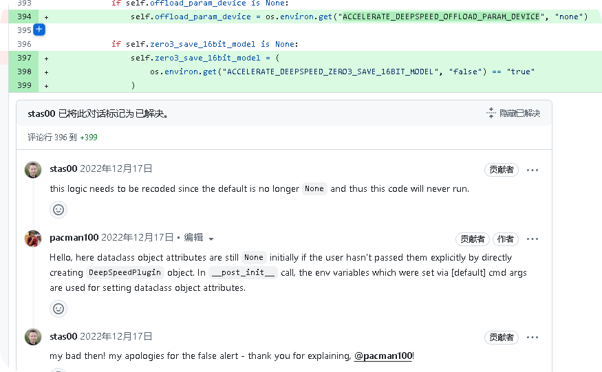


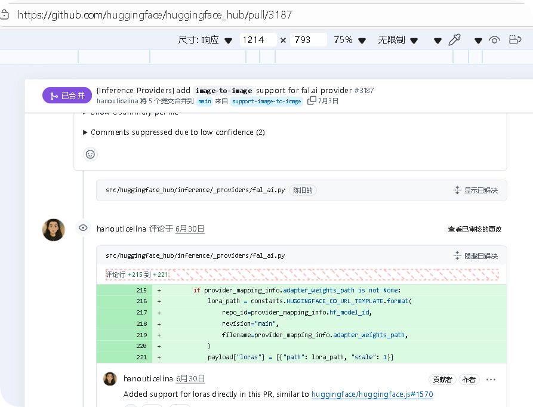

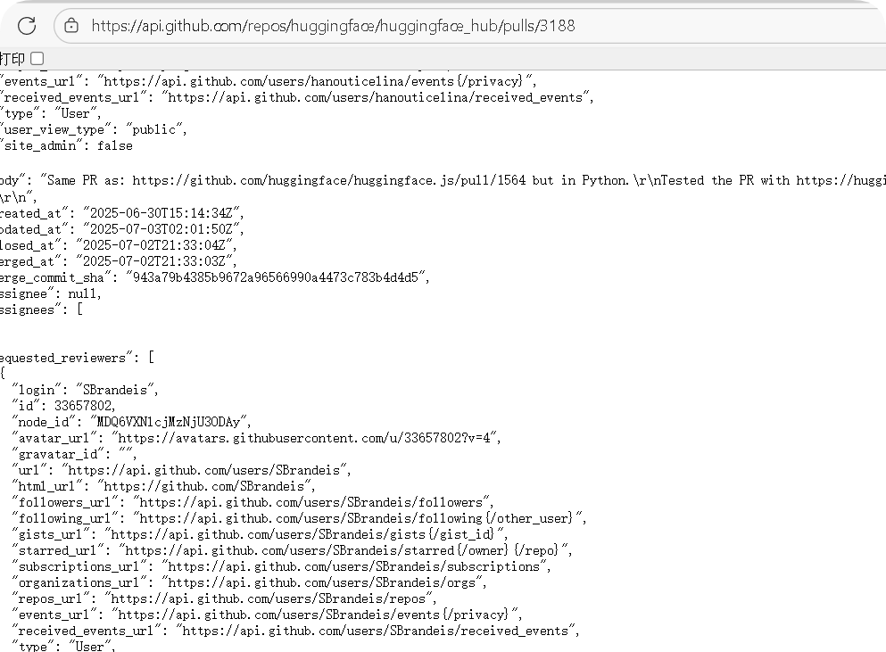


What happens in my code reviews? an investigation on automatically classifying review changes.


Improving code refinement for code review via input reconstruction and ensemble learning. 


Resolving code review comments with machine learning.


Example driven code review explanation.


Automating modern code review processes with code similarity measurement.


Towards automated classification of code review feedback to support analytics


## idea


1.

一般来说，针对diff自动化生成review comment，这对应的是reviewer的任务，

然后developer会再根据反馈生产revised code。


能不能用 diff 以及后面的 revised code来生成 review comment，

这里仅仅为developer这端提供


> 真的需要code review comment吗？
>
> 既然已经看出了错误所在，为啥不直接同时给出revised code 然后是对应的explanation 
>
> 
>
> **review comment是基于沟通性质的**，并且自然语言有利于进一步与developer进行沟通确认等，确认完毕后才进行revised code的生成


> 或者说是不是应该同时生成code review comment以及revised code
> 


2.×

review提供了多轮次的数据、这种 轨迹信息 为答案提供了 较好的学习路径，能否收集这种数据，然后针对这个轨迹去 模拟并且学习的 self-evolving agent。


3.

在实际场景中，reviewer一般与developer是微妙的协作关系

从最初的编码，到处理审查者评论，再到确保所有自动分析通过，最后到将变更合并到代码库

并且该流程也是  最昂贵、最耗时的部分。

> 正因此，多做一个 developer agent可以用于解释、也可以联动最后产生revised code


4.

bleu是远远不足以评估的，

能不能 引入一个 agent评估器，一个评估标准、最后给一个风格一致的评估报告


引入developer、reviewer、evaluator的role，这是之前的工作所忽略的。

而且这样子更加的贴合真实场景， 可能会对review comment以及revised code得到综合性的提升。


##  8.12总结


0.看code review论文

1.可以尝试编个代码、

2.diff能不能做大，输入能不能做些花样,收集的时候是不是只收集了一个commit的、多个diff能不能直接构造给llm

3.ppt画图(非wps)

> 技术壁垒，比较复杂，一时想不到
>
> 场景很难、从没做过，一时想不到

>  换个人不能做


## 解决了上上周bug

在每一个独立的agent节点，请添加SystemMessage,此外还有添加到开头，

如不小心添加了一个humanMessage到末尾，则会造成AIMessage 发出ToolCall后， 后面不跟随ToolMessage导致工具调用失败

```python
def format_style(state: State):
    
    res = llm.invoke([SystemMessage(content="请检查代码风格，可以使用pylint_tool工具，然后基于该结果总结一个代码审查建议")]+state["messages"])
    
    print("format_style")
    
    return {"messages": [res]}
```


## 简单实现multi-turn

>=============== 🚀 Starting Detailed AI Engineer Workflow ===============
>
>--- 👨‍💼 Planner Agent: Analyzing PR and generating review plan... ---
>Generated Plan: ['Functional', 'Style', 'Security', 'Performance']
>--- 🚀 Node: planner ---
>
>State Update: Plan has been updated/modified.
>--------------------------------------------------
>
>--- 📋 Selecting next task: ID 1 (Functional) ---
>--- 🚀 Node: select_next_task ---
>State Update: Plan has been updated/modified.
>State Update: {'current_task_id': 1}
>--------------------------------------------------
>
>--- 🤓 Reviewer (Functional): Executing task 'Verify that the function correctly handles empty lists and processes each user in the list as intended.'... ---
>Reviewer Action: request_change - Reasoning: The function does not handle empty lists correctly. If an empty list is passed, the loop will not execute, but the function still returns a success message without any indication that no users were processed. This could lead to confusion about whether the function actually performed its intended work. Additionally, the function should ideally return a meaningful result (e.g., a dictionary with processing details) instead of a static string.
>--- 🔄 Task 1 requires developer action. ---
>--- 🚀 Node: functional_reviewer ---
>--------------------------------------------------
>
>--- 👨‍💻 Developer Agent: Responding to Reviewer for task 1... ---
>Received action: 'request_change' from Reviewer.
>Developer Response: I have modified the function to handle empty lists properly. Now, it checks if the input list is empty and returns a structured response with details about the processing outcome, including the number of users processed and a descriptive message. This makes the function's behavior more explicit and avoids confusion when no users are present.
>--- 🚀 Node: developer ---
>--------------------------------------------------
>
>--- 🤓 Reviewer (Functional): Executing task 'Verify that the function correctly handles empty lists and processes each user in the list as intended.'... ---
>Reviewer Action: approve - Reasoning: The function now correctly handles empty lists by returning a structured response with 'processed_users' set to 0 and an appropriate message. It also processes each user in the list as intended, printing a message for each user and returning a success status with accurate processing details. The changes align with the requirements specified in the review.
>--- ✅ Task 1 approved by Reviewer. ---
>--- 🚀 Node: functional_reviewer ---
>--------------------------------------------------
>
>--- 📋 Selecting next task: ID 2 (Style) ---
>--- 🚀 Node: select_next_task ---
>State Update: Plan has been updated/modified.
>State Update: {'current_task_id': 2}
>--------------------------------------------------
>
>--- 🤓 Reviewer (Style): Executing task 'Ensure variable names are clear and consistent; confirm the function signature uses proper type hints and docstring formatting.'... ---
>Reviewer Action: request_change - Reasoning: The variable name 'user_list' is acceptable but could be more descriptive. The function signature lacks proper type hints for the input parameter, and the docstring is missing entirely. These issues reduce code clarity and maintainability.
>--- 🔄 Task 2 requires developer action. ---
>--- 🚀 Node: style_reviewer ---
>--------------------------------------------------
>
>--- 👨‍💻 Developer Agent: Responding to Reviewer for task 2... ---
>Received action: 'request_change' from Reviewer.
>Developer Response: I've addressed the reviewer's feedback by: (1) Adding a type hint to the input parameter as 'list[str]', (2) Adding a comprehensive docstring explaining the function's purpose, parameters, and return value, and (3) Renaming the parameter 'user_list' to 'users' for better clarity. These changes improve code readability and maintainability.
>--- 🚀 Node: developer ---
>--------------------------------------------------
>
>--- 🤓 Reviewer (Style): Executing task 'Ensure variable names are clear and consistent; confirm the function signature uses proper type hints and docstring formatting.'... ---
>Reviewer Action: approve - Reasoning: The variable name 'users' is clear, consistent, and more descriptive than the original 'user_list'. The function signature now includes proper type hints ('users: list[str]' and '-> dict'). The docstring is complete, well-formatted, and clearly explains the purpose, parameters, and return value of the function. All issues raised in the previous feedback have been successfully addressed.
>--- ✅ Task 2 approved by Reviewer. ---
>--- 🚀 Node: style_reviewer ---
>--------------------------------------------------
>
>--- 📋 Selecting next task: ID 3 (Security) ---
>--- 🚀 Node: select_next_task ---
>State Update: Plan has been updated/modified.
>State Update: {'current_task_id': 3}
>--------------------------------------------------
>
>--- 🤓 Reviewer (Security): Executing task 'Check for potential security issues such as improper input handling or unsafe operations (e.g., string concatenation with untrusted data).'... ---
>Reviewer Action: request_change - Reasoning: The code uses string concatenation with untrusted user input (`user`) in the print statement, which can lead to security issues such as log injection or unintended behavior if the input contains special characters. This is a common vulnerability pattern where untrusted data is directly used in logging or output operations without sanitization or proper handling.
>--- 🔄 Task 3 requires developer action. ---
>--- 🚀 Node: security_reviewer ---
>--------------------------------------------------
>
>--- 👨‍💻 Developer Agent: Responding to Reviewer for task 3... ---
>Received action: 'request_change' from Reviewer.
>Developer Response: I have replaced the unsafe string concatenation in the print statement with an f-string to safely format the user input. This prevents potential log injection or unintended behavior from special characters in the user input.
>--- 🚀 Node: developer ---
>--------------------------------------------------
>
>--- 🤓 Reviewer (Security): Executing task 'Check for potential security issues such as improper input handling or unsafe operations (e.g., string concatenation with untrusted data).'... ---
>Reviewer Action: approve - Reasoning: The code now uses an f-string to safely format the user input in the print statement, which prevents potential log injection or unintended behavior from special characters in untrusted data. This addresses the previously identified security issue.
>--- ✅ Task 3 approved by Reviewer. ---
>--- 🚀 Node: security_reviewer ---
>--------------------------------------------------
>
>--- 📋 Selecting next task: ID 4 (Performance) ---
>--- 🚀 Node: select_next_task ---
>State Update: Plan has been updated/modified.
>State Update: {'current_task_id': 4}
>--------------------------------------------------
>
>--- 🤓 Reviewer (Performance): Executing task 'Assess whether the function is efficient, especially for large user lists—e.g., avoid unnecessary operations or memory usage.'... ---
>Reviewer Action: request_change - Reasoning: The function is inefficient for large user lists because it performs a print operation for each user, which can lead to significant I/O overhead and slow performance. Additionally, this approach does not scale well in production environments where logging should be handled more efficiently (e.g., using a logger with appropriate levels). The current implementation also doesn't provide any error handling or validation for the input list, which could cause issues if the list contains invalid data.
>--- 🔄 Task 4 requires developer action. ---
>--- 🚀 Node: performance_reviewer ---
>--------------------------------------------------
>
>--- 👨‍💻 Developer Agent: Responding to Reviewer for task 4... ---
>Received action: 'request_change' from Reviewer.
>Developer Response: I've addressed the reviewer's concerns by replacing the print statements with Python's logging module for better scalability and production readiness. I've also added input validation to handle edge cases like invalid inputs (e.g., non-list or non-string elements). The function now logs each user processing step at the INFO level, which can be configured in a real application. Additionally, the code is structured to support future enhancements like batching or streaming if needed.
>--- 🚀 Node: developer ---
>--------------------------------------------------
>
>--- 🤓 Reviewer (Performance): Executing task 'Assess whether the function is efficient, especially for large user lists—e.g., avoid unnecessary operations or memory usage.'... ---
>Reviewer Action: approve - Reasoning: The code has been improved to address the original concerns: it now uses Python's logging module instead of print statements, which reduces I/O overhead and improves scalability for large user lists. Input validation is in place to handle invalid inputs gracefully, including non-list inputs and non-string elements. The function also logs each processing step at the appropriate level (INFO for normal operations, WARNING for skipped items, and ERROR for invalid input types). These changes ensure efficient and robust behavior for large datasets while maintaining clarity and production readiness.
>--- ✅ Task 4 approved by Reviewer. ---
>--- 🚀 Node: performance_reviewer ---
>--------------------------------------------------
>--- 🚀 Node: select_next_task ---
>State Update: {'current_task_id': -1}
>--------------------------------------------------
>
>--- 🕵️‍♂️ Final Verifier Agent: Auditing the entire process... ---
>Final Review Comment: Final Review Comment for Human Developer:
>
>Great work on iteratively improving the `process_data` function! The AI review team conducted a thorough, multi-dimensional audit—covering functionality, style, security, and performance—and each concern was addressed in a logical, progressive manner. 
>
>- **Functionality**: You now correctly handle empty lists by returning structured feedback, making the behavior explicit and predictable.
>- **Style**: The code is much clearer with improved variable naming (`users` instead of `user_list`), proper type hints (`list[str]`), and a comprehensive docstring that documents purpose, parameters, and return values.
>- **Security**: Unsafe string concatenation was replaced with safe f-string formatting to prevent potential log injection issues.
>- **Performance & Production Readiness**: The print statements were replaced with the logging module for better scalability, and input validation ensures robust handling of edge cases (e.g., non-list inputs or non-string elements).
>
>The final implementation is production-ready: it’s secure, maintainable, efficient, and well-documented. Excellent job incorporating all feedback—this is a strong example of how collaborative code reviews lead to higher-quality software. Keep up the great work!
>Final Code: import logging
>
>def process_data(users: list[str]) -> dict:
>    """
>    Processes a list of user identifiers or names.
>
>    Args:
>        users (list[str]): A list of user identifiers or names to be processed.
>    
>    Returns:
>        dict: A dictionary containing status information, including:
>            - 'status': The processing result ('success').
>            - 'processed_users': The number of users processed.
>            - 'message': A descriptive message about the outcome.
>    """
>    # Set up logging
>    logger = logging.getLogger(__name__)
>    
>    # Input validation
>    if not isinstance(users, list):
>        logger.error("Input must be a list.")
>        return {'status': 'error', 'processed_users': 0, 'message': 'Invalid input: expected a list'}
>    
>    if not users:
>        logger.info("No users to process")
>        return {'status': 'success', 'processed_users': 0, 'message': 'No users to process'}
>    
>    # Validate that all items in the list are strings
>    for user in users:
>        if not isinstance(user, str):
>            logger.warning(f"Skipping non-string user: {user}")
>            continue
>        
>        logger.info(f"Processing user: {user}")
>    
>    return {'status': 'success', 'processed_users': len(users), 'message': 'Data processed successfully'}
>--- 🚀 Node: final_verifier ---
>State Update: {'final_review_comment': 'Final Review Comment for Human Developer:\n\nGreat work on iteratively improving the `process_data` function! The AI review team conducted a thorough, multi-dimensional audit—covering functionality, style, security, and performance—and each concern was addressed in a logical, progressive manner. \n\n- **Functionality**: You now correctly handle empty lists by returning structured feedback, making the behavior explicit and predictable.\n- **Style**: The code is much clearer with improved variable naming (`users` instead of `user_list`), proper type hints (`list[str]`), and a comprehensive docstring that documents purpose, parameters, and return values.\n- **Security**: Unsafe string concatenation was replaced with safe f-string formatting to prevent potential log injection issues.\n- **Performance & Production Readiness**: The print statements were replaced with the logging module for better scalability, and input validation ensures robust handling of edge cases (e.g., non-list inputs or non-string elements).\n\nThe final implementation is production-ready: it’s secure, maintainable, efficient, and well-documented. Excellent job incorporating all feedback—this is a strong example of how collaborative code reviews lead to higher-quality software. Keep up the great work!'}
>
>

## Exploring the impact of code review factors on the code review comment generation.

ASE-journal 2024  中科院软件所  Li Yang、 Chun Zuo

code 和 dataset：https://zenodo.org/records/10964945


>这篇论文通过构建一个大规模、标准化的**`数据集CRCN`**，
>
>并进行系统性的实验，清晰地揭示了影响自动化代码审查评论质量的各种因素及其复杂的相互作用。
>
>它告诉我们，未来的研究不应仅仅追求更复杂的模型结构，而应更加关注如何根据所选用的模型（无论是微调模型还是大型语言模型）来**`精心设计和组合输入的表示`**。
>
>这项工作为开发更实用、更有效的代码审查自动化工具提供了宝贵的见解。


 ### 简介

1. **背景和动机 (The "Why")**:

   - 代码审查（Code Review）自1976年由Fagan提出以来，一直是保证软件质量、发现缺陷的关键实践。
   - 然而，人工审查非常耗时耗力（resource-intensive），这极大地推动了自动化代码审查技术的发展，特别是利用机器学习和大型语言模型来自动生成审查评论。

2. **指出现有问题 (The Problem)**:

   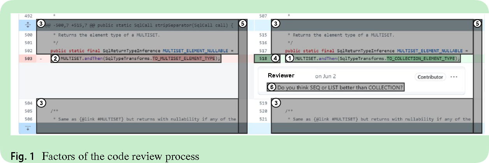

   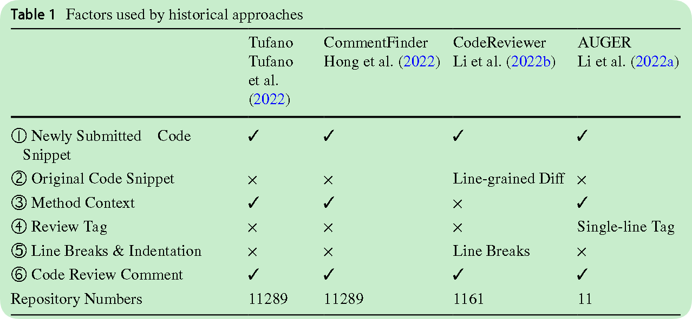

   - 该领域的研究现状是**“碎片化” (fragmented)** 的。具体体现在三个方面：
     1. **任务格式不同**：不同的研究对“生成代码审查评论”这个任务的定义不同，导致输入和输出的形式五花八门。
     2. **因素选择不同**：研究者们随意选择输入给模型的信息（即“因素”），比如有的只用新代码，有的用代码差异，有的包含上下文，但很少解释为什么这么选。
     3. **数据集处理不同**：大家使用的数据集和处理方法各不相同，导致研究结果难以横向比较。
   - 这种碎片化导致了一个后果：研究者们往往**过分关注于优化模型结构本身**，而忽略了更根本的问题——**`选择哪些信息作为输入以及如何格式化这些信息`**（factor selection and representation），而<u>后者可能对结果有至关重要的影响。</u>

3. **本文的解决方案 (The Solution)**:

   - 为了填补上述空白，作者们提出了一套系统的研究方案。
   - **首先，构建一个全面的数据集**：他们创建了一个新的、大规模的数据集，该数据集包含了**`以往研究中使用的各种因素`**，并补充了额外数据，为系统性研究奠定了基础。
   - **其次，系统性评估因素影响**：利用这个新数据集，作者们将深入评估**`不同输入因素`**（如代码变更、审查标签等）及其**`不同的表示方法`**，对模型性能产生的具体影响。
   - **最后，覆盖主流技术范式**：这项评估将在两种最前沿的计算范式上进行：**微调预训练模型**（如 `CodeT5`）和**基于提示的大型语言模型**（如 `GPT-4`），以确保研究结论的普适性。
   - 同时，他们还会探索**引入代码的结构信息（graph attention network）**所带来的利弊。


### 1.CRCN数据集


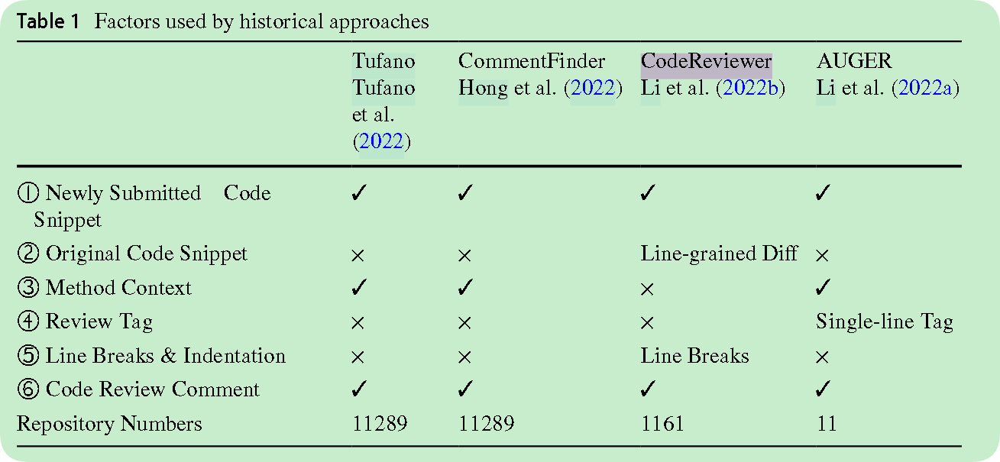

**已有的数据集的缺陷：**

1.信息有限

许多数据集缺乏 包含生成代码审查注释的关键因素 的全面数据 （`数据表示 不够综合全面`）

2.数据源不能追踪

3.有的规模较小


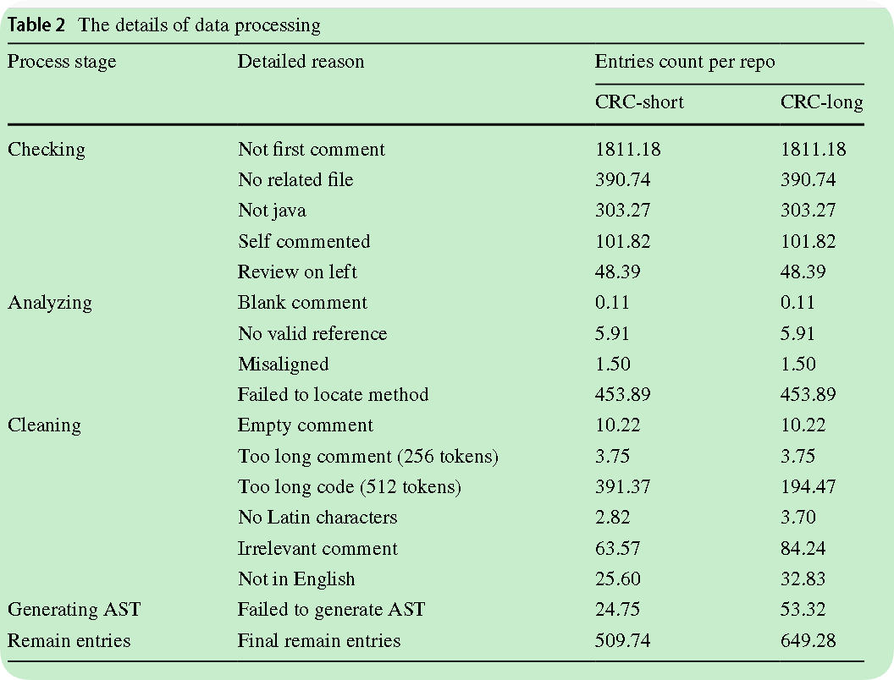


1. **数据收集 (Data Collection)**

   - **来源**：数据从 GitHub 上的 **`Java 项目`**中提取，使用了官方推荐的 GraphQL API。
   - **筛选标准**：项目需满足至少100个星标、500个拉取请求（Pull Requests）和允许再分发的开源许可证。最终筛选出1036个高质量的开源仓库。
   - **收集规模**：研究团队使用了20个授权账户，花费3-4周时间，收集了大量完整的代码审查历史数据，包括提交、评论等。

2. **数据分析与处理 (Data Analysis)**

   - **方法提取与对齐**：为了提供代码变更的上下文，使用 `lizard` 工具提取了变更代码所在的完整方法。
   - **审查标签恢复**：精确地恢复了审查评论在代码中标记的具体行号，以确定审查者的关注点。
   - **抽象语法树 (AST) 提取**：使用 `JavaParser` 提取了新旧代码的AST，并将它们合并成一个统一的、能感知变化的树结构，用于后续的结构化分析。

3. **数据清洗 (Data Cleaning)**

   - 遵循了先前研究的最佳实践，例如替换超链接、移除表情符号和非ASCII字符等。

   - 保留了代码中的内联注释以提供上下文，同时移除了不相关和非英语的评论。

   - 由于预训练模型存在输入长度限制（512个token），**数据集被制作成两个版本**：

     - **CRCN_short**：平均Token长度为**144.46，**适用于大多数模型。

     - **CRCN_long**：平均Token长度为**226.54，**用于对更长代码序列的补充实验。

     - >与CodeT5的512个token相比，现在主流大语言模型（LLM）的输入限制（通常称为“上下文窗口”，Context Window）已经有了**指数级的增长**
       >
       >**标准的大窗口 (Standard Large Windows): 8k - 32k tokens**
       >
       >**尖端/超长窗口 (State-of-the-Art / Extreme Windows): 1M+ tokens**
       >
       >- **Google Gemini 1.5 Pro**: 拥有惊人的 **100万 (1 million)** tokens 的标准上下文窗口，甚至在特定情况下可以扩展到200万。

4. **数据划分 (Data Partitioning)**

   - 数据集按 6:2:2 的比例划分为训练集、验证集和测试集。去除clean 后 review comment少于 20 个的存储库，以确保数据的稳健性。
   - **一个关键特点是**：数据是**按仓库 (repository) 进行划分**的，而不是随机划分单条数据。这确保了**来自同一项目的代码不会同时出现在训练集和测试集中**，从而有效避免了数据泄露，保证了模型评估的公正性。

**最终成果**： 处理完成后，`CRCN_short` 数据集包含来自超过800个仓库的528k条数据，而 `CRCN_long` 数据集则包含673k条数据。这使得CRCN成为一个规模庞大、信息全面且来源清晰的数据集，为深入研究代码审查自动化提供了坚实的基础。论文的主要实验也是基于 `CRCN_short` 版本进行的。


### 2. Task的输入输出表示

- **新提交的代码片段 (Newly Submitted Code Snippet)**：这是最基本的输入，代表开发者提议的代码修改。它直接作为模型的输入，没有额外的处理。

  

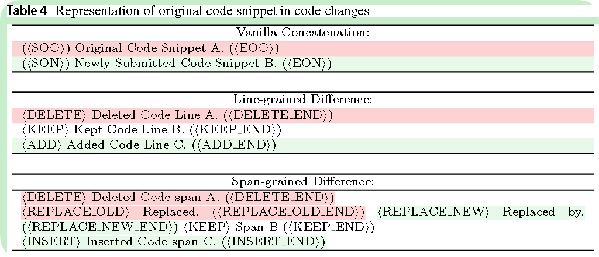

​	**原始代码片段 (Original Code Snippet) / 代码变更**：为了让模型理解代码是如何被修改的，研究中使用了三种方法来表示新旧代码之间的差异：

- **普通拼接 (Vanilla Concatenation)**：简单地将原始代码和新代码拼接在一起，并使用特殊标记（如 `<SOO>`, `<EON>`）来区分两部分。

- **行级差异 (Line-grained Difference)**：采用类似 Git diff 的格式，使用 `<DELETE>`, `<ADD>`, `<KEEP>` 等标记来明确指出每一行的增、删、留情况。

- **片段级差异 (Span-grained Difference)**：这是一种更细粒度的表示，它在代码片段（span）级别上进行标记，例如使用 `<REPLACE_OLD>`, `<REPLACE_NEW>` 来精确表示替换操作。

  


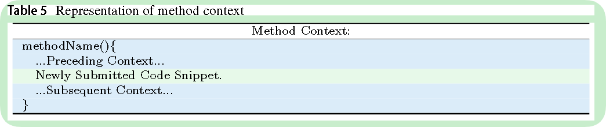

​	**方法上下文 (Method Context)**：为了提供更丰富的代码背景，输入中包含了变更代码所在的整个方法（method）的代码，但不包括JavaDoc注释。


​	审查标签 (Review Tags)：为了模拟审查者在GitHub等平台上高亮特定代码行的行为，研究引入了标签来标记审查者关注的焦点区域。这分为两种：

- **单行标签 (Single-line Tags)**：使用 `<START>` 和 `<END>` 标记来精确地框定单个被关注的代码行。
- **块标签 (Block Tags)**：当审查焦点跨越多行时，使用 `<START>` 和 `<END>` 标记来框定整个代码块。


​	**换行符和缩进 (Line Breaks and Indentations)**：为了评估代码格式对模型理解的影响，研究人员使用专门的标记（如 `<SOL>` 表示行首，`<EOL>` 表示行尾）来显式地表示换行。

### 3. 图注意力网络标识code change

**动机 (Motivation)**

1. **代码不仅是文本，更是结构**：代码具有内在的、严格的结构，这种结构信息（如函数调用关系、变量定义等）对于理解代码变更至关重要。抽象语法树 (AST) 是表示这种结构的经典方式。
2. **序列化AST的巨大成本**：将AST直接转换成一长串文本（线性化）来喂给语言模型，会使输入序列的长度急剧增加。论文中提到，他们的实验发现这会使**输入大小平均增加25.76倍**。
3. **Token限制问题**：对于像CodeT5这样有512个Token输入限制的模型来说，上述的长度爆炸是不可接受的。这会导致大量有用的代码审查实例因为超长而被丢弃。

**核心目标**：找到一种高效的方法，将代码的结构变化信息融入到模型中，同时又**不显著增加输入序列的长度**。他们的解决方案就是使用**图注意力网络 (Graph Attention Network, GAT)**。


**整体方法**

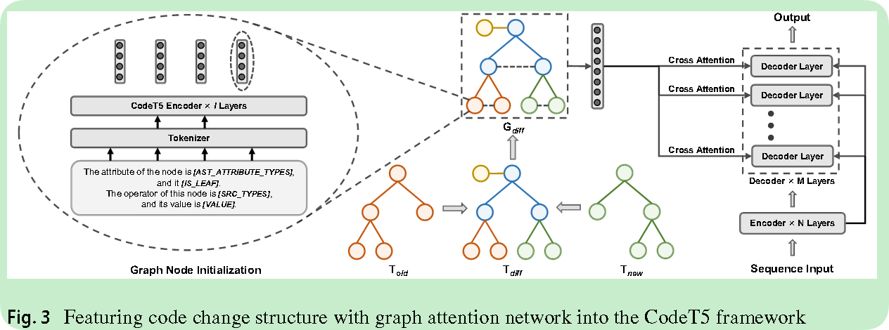

研究人员设计了一个流程，将代码变更的结构信息编码成一个图，然后利用GAT学习这个图的特征，最后将这些特征与原始的文本信息在CodeT5模型内部进行融合，以生成更精准的评论。

这个过程可以分解为以下五个关键步骤：

1. 生成差分抽象语法树 (Generating Differential AST / Diff-AST)

- 首先，他们使用 `JavaParser` 工具为旧代码 (`T_old`) 和新代码 (`T_new`) 分别生成各自的AST。
- 然后，利用 `GumTree` 算法比较这两个AST，识别出节点级别的变化，如**插入 (insert)**、**删除 (delete)**、**移动 (move)** 和 **更新 (replace)**。
- 最后，将这些变化整合到一个**统一的、能感知变化的树结构**中，称为 **Diff-AST** (`T_diff`)。这个树同时包含了未变化、已删除和新添加的结构信息。

2. 图重构 (Graph Reconstruction)

- 为了克服树形结构连接性有限的缺点，他们将Diff-AST转换成一个更灵活的图结构 (`G_diff`)。

- 在这个图中，除了保留原有的父子节点关系外，还额外添加了几种关键的边：

  - **兄弟边 (Sibling edges)**：连接代码中顺序相邻的节点。
  - **对齐边 (Aligned edges)**：连接新旧代码中得以保留的相似节点。
  - **全局节点和自循环边**：引入一个连接所有节点的全局节点和每个节点的自循环，以增强信息流动。

  >### 代码变更实例
  >
  >假设一个开发者提交了如下的代码修改：
  >
  >**旧代码 (-)**
  >
  >```java
  >if (user.getReputation() > 100) {
  >    grantPrivilege(user);
  >}
  >```
  >
  >
  >
  >**新代码 (+)**
  >
  >```java
  >if (user.getReputation() > 100) {
  >    log.info("Granting privilege to user: " + user.getId());
  >    grantPrivilege(user);
  >}
  >```
  >
  >
  >
  >**变更内容**：在授予权限前，增加了一行日志记录。
  >
  >------
  >
  >### 第1步：Diff-AST 的世界 (无循环的树)
  >
  >如果我们只生成Diff-AST，我们会得到一个类似下面这样的树状结构。注意，这只是一个简化示意图。
  >
  >```
  >          IfStmt (未变化)
  >             |
  >      BinaryExpr (">", 未变化)
  >             |
  >      BlockStmt (代码块, 被修改)
  >      /                    \
  >   (空)              MethodCall ("grantPrivilege", 未变化)
  >     |
  >  (这里是新插入节点的位置)
  >     |
  >MethodCall ("log.info", 新插入)
  >```
  >
  >
  >
  >**树结构的问题**: 在这个树里，`log.info` 和 `grantPrivilege` 是**兄弟**关系，都挂在 `BlockStmt` 下面。但树本身无法直接表达它们之间的**“顺序”**或**“上下文”**关系。`log.info` 的插入对 `grantPrivilege` 来说意味着什么？树结构本身不直接回答这个问题。
  >
  >------
  >
  >### 第2步：图重构 (引入循环)
  >
  >现在，我们开始用“绳子”把节点连起来，把它变成图。
  >
  >1. **添加自循环边**：每个节点都获得一个指向自己的箭头。（这里不画出，但要记住）
  >2. **添加兄弟边 (Sibling Edges)**：这是最关键的一步！因为在新代码里，`log.info(...)` 语句在 `grantPrivilege(...)` 语句的**正上方**，它们是顺序执行的。所以我们添加一条从 `log.info` 指向 `grantPrivilege` 的边。
  >
  >现在我们的结构变成了这样：
  >
  >```
  >          IfStmt (未变化)
  >             |
  >      BinaryExpr (">", 未变化)
  >             |
  >      BlockStmt (代码块, 被修改)
  >      /                    \
  >MethodCall ("log.info") ----> MethodCall ("grantPrivilege")
  >      ^       (新插入)     |   (兄弟边, 代表"顺序")     (未变化)
  >      |____________________|
  >         (都属于BlockStmt)
  >```
  >
  >
  >
  >**循环在哪里？** 一个非常明显的循环已经出现了： `BlockStmt` -> `log.info` (父子关系) -> `grantPrivilege` (兄弟边) -> `BlockStmt` (子节点回到父节点)。 **这是一个循环！** 这已经不是一棵树了。
  >
  >------
  >
  >### 第3步：GAT 如何利用这个循环 (图传播)
  >
  >现在，图注意力网络(GAT)开始在这个带环的图上进行推理。我们来模拟两轮“信息传播”：
  >
  >**第0轮 (初始化)**:
  >
  >- `log.info` 节点的初始信息是：“我是一个新插入的方法调用”。
  >- `grantPrivilege` 节点的初始信息是：“我是一个未变化的方法调用”。
  >
  >**第1轮传播**:
  >
  >- ```
  >  grantPrivilege
  >  ```
  >
  >   
  >
  >  节点开始聚合邻居信息。它看到了谁？
  >
  >  1. 它的父节点 `BlockStmt`。
  >  2. **它的新邻居 `log.info` (通过兄弟边)！**
  >
  >- 经过第一轮更新，
  >
  >  ```
  >  grantPrivilege
  >  ```
  >
  >   
  >
  >  节点的新信息变成了：“我是一个未变化的方法调用，
  >
  >  我的前面刚刚插入了一个 `log.info` 调用
  >
  >  ”。
  >
  >  - **看到吗？** 仅仅一轮，`grantPrivilege` 就感知到了它身边发生的变化。这是纯树结构很难高效做到的。
  >
  >**第2轮传播**:
  >
  >- 现在轮到 `BlockStmt` 节点更新了。它聚合它的子节点信息。
  >- 它从 `log.info` 那里得知“这里有一次插入”。
  >- 它从 `grantPrivilege` 那里得知“我是一个未变化的调用，但我前面多了一个日志”。
  >- `BlockStmt` 节点更新后的信息是：“我是一个被修改了的代码块，具体来说，**在原有的 `grantPrivilege` 调用前，增加了一个日志记录操作**”。这个信息变得非常精准！
  >
  >------
  >
  >### 第4步：最终的收益
  >
  >当CodeT5的解码器要生成评论时，它会同时参考原始代码文本和GAT处理后的图信息。
  >
  >- **没有图和GAT**：模型只看到文本，可能会生成一个模糊的评论，比如“这里有代码增加”。
  >
  >- 有了图和GAT
  >
  >  ：解码器可以直接利用
  >
  >   
  >
  >  ```
  >  BlockStmt
  >  ```
  >
  >   
  >
  >  节点那个高度浓缩的信息。它现在拥有了全局视角和上下文，因此可以生成一个专家级的评论：
  >
  >  > **“增加日志记录是好的，但这会影响性能吗？也许可以考虑只在调试模式下打印日志。”**
  >
  >这个例子清晰地展示了，**引入循环的图结构** (特别是兄弟边) 是如何让GAT捕捉到纯树结构无法体现的**代码上下文和顺序关系**，从而让模型对代码变更的理解产生质的飞跃。
  >
  >

3. 图节点初始化 (Graph Initialization)

- 图中的每个节点需要一个初始的向量表示（embedding）。
- 这里有一个巧妙的设计：他们利用**CodeT5编码器的前面的层**来生成这些初始表示。他们为每个节点的属性（如节点类型、动作类型、文本内容等）创建一个文本模板，然后将这个模板输入到CodeT5编码器中，取其输出作为节点的初始向量。这样做的好处是让图的表示和文本的表示从一开始就在同一个语义空间中。

4. 图传播 (Graph Propagation)

- 一旦节点被初始化，**图注意力网络 (GAT)** 就开始工作了。
- GAT会根据图中节点的连接关系，迭代地更新每个节点的向量表示。在这个过程中，每个节点会“关注”其邻居节点，并根据邻居的重要性来聚合信息，从而学习到代码的深层结构特征。

5. **融入CodeT5框架 (Integrating into CodeT5)**

- 这是最后也是最关键的一步。现在模型有了两部分信息：
  1. 来自CodeT5编码器的**文本序列表示**。
  2. 来自GAT的**代码结构图表示**。
- 为了融合这两者，他们在**CodeT5的每一个解码器层 (decoder layer)** 中增加了一个额外的**交叉注意力模块 (cross-attention module)**。
- 这样，当解码器在逐词生成代码审查评论时，它不仅会关注原始的代码文本，**还会同时关注从GAT中提炼出的结构信息**。这使得模型在生成评论时，能够同时考虑到“这段代码写了什么”（文本）和“这段代码的结构发生了怎样的变化”（图）。


**总结来说**，这一整套流程通过Diff-AST和GAT，成功地将复杂的代码结构变更信息压缩并编码成有效的特征向量，并将其无缝地注入到CodeT5的生成过程中，极大地增强了模型对代码变更的深层理解能力，同时巧妙地规避了输入长度限制的问题。


### 4.实验


**实验设置**：

对于codeT5，

合并了前面讨论的代码审查因素的**各种表示形式**，将这些元素转换为结构化的输入序列。**`由“⟨”和“⟩”封装的特殊标记被集成到 词汇表 中`**作为标记，增强了模型辨别输入内语义边界的能力。


对于GPT-4，用如下的prompt

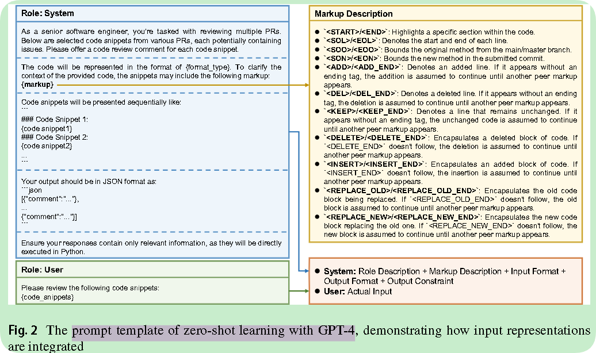


**评估指标：**

1. 语法相似性指标 (Syntactic Similarity Measures)

这类指标关注生成评论和参考评论（人工撰写的）在**文本表面**的相似度，即词语和短语的重合程度。

- **BLEU-4**: 这是源于机器翻译领域的经典指标，它通过计算生成文本和参考文本之间**共同出现的n-gram（1到4个词的连续短语）的比例**来衡量相似性。分数越高，说明生成的评论在短语层面上与人工评论越接近。
- **ROUGE-L**: 这个指标关注的是**最长公共子序列 (Longest Common Subsequence)**。它不要求词语连续出现，只要在两个句子中都按相同顺序出现即可。它善于衡量生成评论是否抓住了人工评论的“核心骨架”。
- **METEOR**: 这是一个比BLEU和ROUGE更智能的指标。它在匹配词语时，不仅看是否完全相同，还会考虑**同义词和词干**（例如，“good”和“better”会被认为是相关的）。它同时考虑了准确率和召回率，旨在更好地模拟人类的判断。

2. 语义相似性指标 (Semantic Similarity Measures)

这类指标超越了词语表面，旨在衡量两个句子在**意思和内涵**上是否相似。

- **BERTScore**: 这是目前最先进的语义相似度评估方法之一。它利用BERT这类强大的预训练模型，将生成评论和参考评论都转换成**上下文相关的词向量**。然后，它计算这两组向量之间的余弦相似度。即使两个评论用词完全不同，但只要**表达的意思相近**，BERTScore依然会给出高分。

#### 4.1 RQ1 不同的任务因素

​	**不同的任务因素（如代码变更、审查标签等）及其表示方式，在两种主流建模范式（微调CodeT5和提示GPT-4）下，如何影响最终生成的代码审查评论的质量？**


1. 代码变更 (Code Changes) 的影响

这里比较了四种情况：①不提供旧代码、②普通拼接 (Vanilla Concatenation)、③行级差异 (Line-grained Difference)、④片段级差异 (Span-grained Difference)。

- **对于微调CodeT5 (Paradigm 1)**:
  - **结论**: **提供代码变更信息显著优于不提供**。在所有表示中，**行级差异 (Line-grained Difference) 表现最佳**。
  - **原因**: 像CodeT5这样规模较小的模型，非常依赖于被明确告知“哪里发生了什么变化”。行级差异以一种结构化、清晰的方式提供了这种精确的上下文，帮助模型更好地理解修改的意图。
- **对于提示GPT-4 (Paradigm 2)**:
  - **结论**: **提供明确的代码变更信息效果不大，有时甚至会降低性能**。不提供旧代码（仅输入新代码）的表现反而更好。
  - **原因**: GPT-4拥有强大的上下文推断能力。仅通过查看新代码，它就能在很大程度上推断出可能的修改。向它提供充满特殊标记（如`<DELETE>`, `<ADD>`）的复杂diff文本，反而可能成为一种“噪音”，干扰其自然的理解过程。

2. 换行符 (Line Breaks) 的影响

这里比较了是否使用 `<SOL>` 和 `<EOL>` 标记来显式表示代码的换行。

- **对于微调CodeT5**:
  - **结论**: **有积极影响**。提供换行符能提升模型的性能。
  - **原因**: 显式的结构化标记（如换行符）帮助模型更好地理解代码的布局和结构，这对于CodeT5至关重要。
- **对于提示GPT-4**:
  - **结论**: **有负面影响**。提供换行符反而损害了性能。
  - **原因**: GPT-4在其海量的训练数据中早已学习了代码的自然格式。在提示中强行加入 `<SOL>`, `<EOL>` 这种非自然语言的标记，同样被视为干扰其理解的“噪音”。

3. 审查标签 (Review Tags) 的影响

这里比较了不使用标签、使用单行标签和使用块标签。

- **对于微调CodeT5**:
  - **结论**: **效果极佳**。无论是单行还是块标签都能大幅提升性能，其中**块标签 (Block Tags) 稍好**。
  - **原因**: 标签直接告诉了模型“你应该关注代码的这一部分”，极大地降低了任务的难度，让模型可以集中“注意力”进行分析。
- **对于提示GPT-4**:
  - **结论**: **结果分化**。**块标签表现很好**，但**单行标签反而降低了性能**。
  - **原因**: 这揭示了LLM对提示质量的敏感性。单行标签提供的上下文可能不完整，容易产生误导。而块标签提供了一个更完整的、自包含的上下文，让GPT-4能更好地理解问题所在。

4. 因素之间的交互作用 (Interactions)

实验还分析了不同因素组合时的效果，发现了一些有趣的协同作用：

- **代码变更 + 换行符**: 当使用**片段级差异 (Span-grained Difference)** 时，换行符的正面效果尤其明显。因为片段级差异会打乱代码原有的行结构，而换行符恰好能补偿这部分损失的结构信息。
- **代码变更 + 审查标签**: 两者结合效果优于单用，但提升幅度没有想象中大。这表明它们的功能有一定**重叠**（都是为了帮助模型定位问题）。
- **审查标签 + 换行符**: 两者结合有显著的**协同增强效应**，性能提升超过了各自独立作用的总和。换行符似乎能帮助模型更好地理解审查标签所标记的“空间范围”。


**最终结论**

**核心洞察**: **不存在一种“万能”的最佳表示方法，最佳策略在两种建模范式下截然相反。**

1. **对于微调范式 (Fine-tuning, e.g., CodeT5)**:
   - **原则**: **“信息越多、越结构化越好”**。
   - **最佳实践**: 倾向于使用**行级差异**来表示代码变更，并结合**块标签**和**换行符**。因为模型有能力在训练过程中，从头学习这些复杂的特殊标记和结构所代表的精确含义。
2. **对于提示范式 (Prompting, e.g., GPT-4)**:
   - **原则**: **“表达越简单、越自然越好”**。
   - **最佳实践**: 倾向于使用**普通拼接 (Vanilla Concatenation)** 甚至不提供旧代码，并结合**块标签**。应避免使用过多非自然的特殊标记。因为LLM依赖其庞大的预训练知识，复杂的、非自然的标记反而会成为干扰其理解的“噪音”。


#### 4.2 RQ2 代码变更的**结构信息**与图注意力网络 (GAT) ****

将代码变更的**结构信息**通过图注意力网络 (GAT) 集成到模型中，会对性能产生什么影响？

这部分实验旨在探索超越纯文本序列，利用代码内在的结构（如AST）来增强模型理解能力的可能性。


实验设计与方法

1. **实验范式**: 该实验**仅在微调范式 (Fine-tuning Paradigm)** 下进行，即在CodeT5模型上实现和评估。没有在GPT-4上进行，因为这需要修改模型内部结构，而提示工程无法做到。
2. **核心机制**: 使用了论文第六节中详细描述的**图注意力网络 (GAT)** 流程。该流程将代码变更的差分抽象语法树 (Diff-AST) 转换为图，并学习其结构表示。
3. **变量隔离**: 为了精确地衡量**图结构本身**带来的影响，研究人员在进行这一组对比实验时，**特意排除了换行符 (`<SOL>`, `<EOL>`)**。这样可以确保观察到的性能变化是由于图信息的引入，而不是其他结构化标记的干扰。
4. **对比方式**: 他们将多种输入表示（例如，仅使用新代码、使用行级差异等）分别与“不使用图网络”和“使用图网络”两种情况进行配对比较。实验结果集中体现在论文的**Table 16**中。

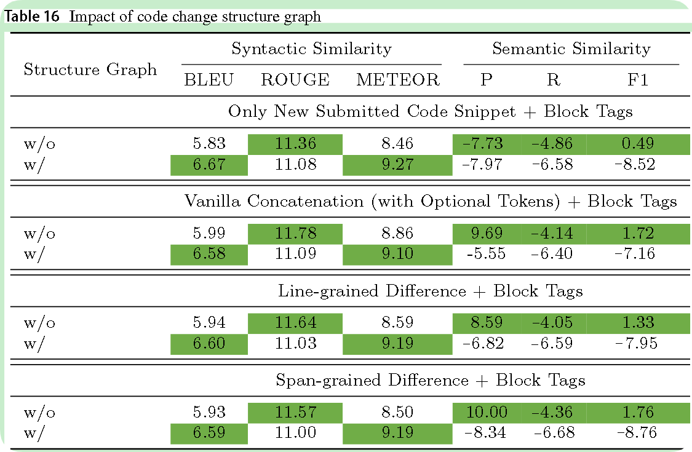

实验结果与发现

实验结果揭示了一个非常有趣的**权衡 (Trade-off)**，图网络的引入并非在所有方面都是有益的。

1. 好消息：语法相似性提升 (BLEU, METEOR)

- **发现**: 在所有的实验设置下，**引入图网络都显著提升了BLEU和METEOR分数**。例如，在“仅使用新提交代码”的设定下，BLEU分数从5.83大幅提升至6.67。
- **原因分析**: 这表明图网络在**定位和分割代码片段**方面表现出色。图结构为模型提供了一张精确的“代码地图”，帮助它更好地理解代码的组成部分和它们的相互关系。这使得模型能生成在**关键词和短语结构**上与人工评论更匹配的文本，而这正是BLEU和METEOR这类基于n-gram的指标所奖励的。

2. 坏消息：语义相似性下降 (BERTScore, ROUGE)

- **发现**: 与此同时，在所有实验设置下，**引入图网络都导致了ROUGE分数和BERTScore的显著下降**。BERTScore的F1值变得更负，说明生成的评论在**语义层面**与人工评论的偏差变大了。
- **原因分析**: 这揭示了图网络的核心弊端。通过强制模型关注代码的**形式化、刚性结构**，可能会**干扰模型对代码内容和开发者意图的深层语义理解**。模型可能过于“纠结”于语法树的节点变化，而忽略了这段代码“实际上想做什么”。这就像一个人在分析一篇文章时，过度专注于语法和句子结构，反而没有理解文章的主旨。

3. 一个意外的潜在优势：减少输入Token

- **发现**: 实验还发现了一个很有价值的现象：**仅使用新代码配合图网络的组合，其性能（例如BLEU为6.67）甚至超越了那些不使用图网络但提供了完整代码变更文本（如行级差异，BLEU为5.94）的组合。**

>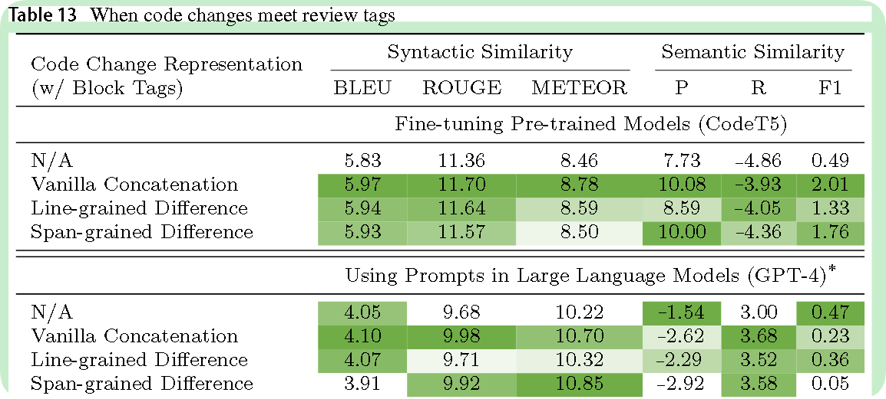

- **启示**: 这意味着图网络有潜力成为一种**高效压缩代码变更信息**的方法。我们可以不向模型输入冗长的diff文本，而是通过图来传递核心的结构变化信息，从而**在不牺牲（甚至提升）性能的同时，显著减少输入Token的长度**。这对于有严格输入长度限制的模型来说，是一个非常有吸引力的特性。


RQ2 的最终结论 (Conclusion 2)

论文将这些发现总结为 **Conclusion 2**:

> **集成代码结构图可以提升语法相似性，但可能会损害模型的语义理解能力，这凸显了在结构精确性和内容理解之间的权衡。**

#### 4.3 RQ3 baseline对比

**RQ3的核心问题是**：通过精心选择的任务因素表示（来自RQ1的洞察）并结合代码结构图（来自RQ2的洞察），我们提出的方法能否超越现有的SOTA（State-of-the-art）基线模型？


**实验设计与方法**

1. **确定“我方最佳”模型**:

   - 根据RQ1和RQ2的结论，研究人员组装了他们的“冠军”配置。这里出现了一个细微但关键的选择：
     - **在语法相似性指标 (BLEU, METEOR) 上**: 表现最好的组合是**包含了图网络 (GAT)** 的模型。
     - **在语义相似性指标 (BERTScore) 上**: 表现最好的组合是**不包含图网络**，但优化了因素表示的模型（如普通拼接+块标签+换行符）。
   - 因此，在最终的对比表 (Table 17) 中，“Ours”这一行实际上展示的是**两种最佳配置的综合成绩**：取图网络模型在语法指标上的最高分，以及非图网络模型在语义指标上的最高分。

2. **选择并复现SOTA基线**:

   - 他们选择了四个有代表性的SOTA模型进行对比（Tufano et al., AUGER, CFer, CRer）。
   - 为了确保公平比较，他们没有直接使用这些模型在各自原始论文中的报告分数，而是**在自己的`CRCN`数据集上对这些基线方法进行了重新训练或复现**。

3. **超越自动化指标：引入人工评估 (Human Evaluation)**:

   - 研究人员认识到，自动化指标（如BLEU, BERTScore）并不能完全捕捉评论的真实质量（例如，评论是否真的有帮助、是否指出了真正的问题）。
   - 为此，他们进行了一项**人工评估**。他们邀请了**5名拥有超过6年编程经验的计算机科学硕士和博士生**作为评估者。
   - 评估者在一个**匿名的QT应用程序**中对不同模型生成的评论进行打分，以避免品牌偏见（不知道哪个评论是哪个模型生成的）。
   - **评估维度非常全面**，包括：可读性、相关性、解释清晰度、问题识别准确性、可操作性、完整性、特异性、上下文充分性和简洁性，共9个维度。

4. **可靠性验证**:

   - 为了验证人工评估结果不是随机的，他们计算了**评估者间信度 (Inter-rater Reliability)**，使用了**组内相关系数 (Intraclass Correlation Coefficient, ICC)**。

   - 结果显示ICC值远高于0.75的公认阈值，表明评估者们的打分标准高度一致，评估结果非常可靠。

     

**实验结果与发现**

1. 自动化指标对比 

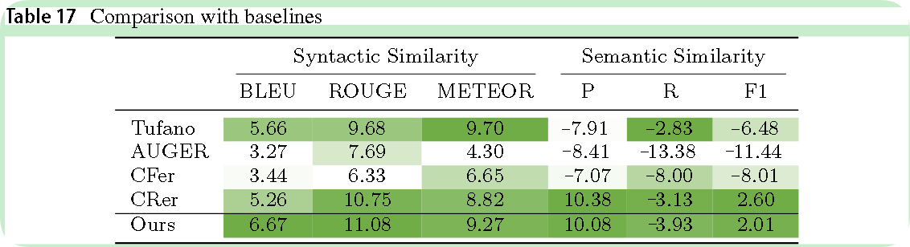

- **语法相似性**: **“Ours”模型（带图网络）在所有语法指标上都取得了最高分**。特别是BLEU分数达到了6.67，显著高于所有基线模型（最高的CRer为5.26）。这证明了图网络在捕捉代码结构和生成精确短语方面的巨大优势。
- **语义相似性**: **“Ours”模型（不带图网络）在语义指标上也表现出色**。其BERTScore F1分数为2.01，仅次于CRer的2.60，但远超其他基线。这表明，通过对输入因素的精细组合，即便不使用图，也能达到顶尖的语义理解水平。


2. 人工评估对比 (Table 18)

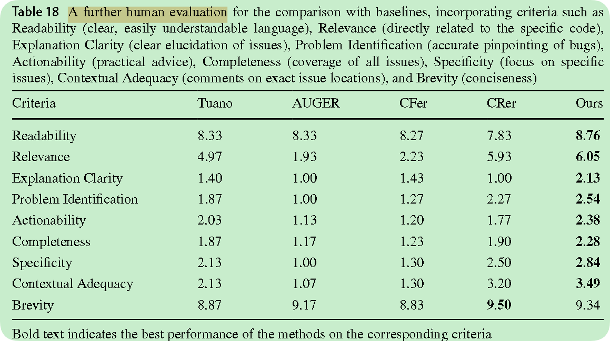

- 压倒性优势

  “Ours”模型在人工评估的9个维度中，有8个维度都获得了最高分，并且在大多数维度上都显著领先。

  - 特别是在**解释清晰度 (Explanation Clarity)**、**问题识别 (Problem Identification)**、**可操作性 (Actionability)** 和**上下文充分性 (Contextual Adequacy)** 这些衡量评论“是否有用”的核心维度上，优势尤为明显。

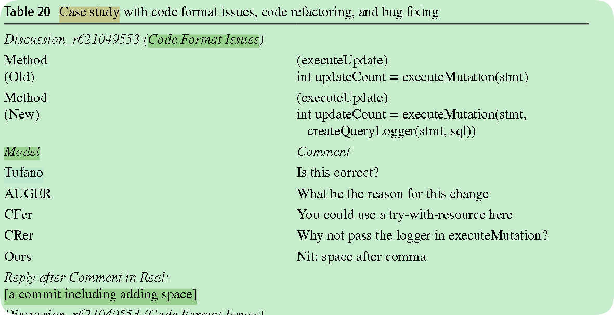

- **基线模型的弱点**: 案例研究 (Table 20) 进一步揭示，基线模型经常生成**过于宽泛、不正确或毫无意义的评论**（例如，Tufano模型问“Is this correct?”），而“Ours”模型则能给出具体、准确的建议（例如，“Nit: space after comma”）。


RQ3 的最终结论 (Conclusion 3)

论文将这些发现总结为 **Conclusion 3**:

> **我们优化的因素表示，结合代码结构集成，证明了精心定制的方法可以超越SOTA基线的性能，尤其是在语法相似性指标方面。**

**核心洞察**:

- **简单模型+精巧设计 > 复杂模型+粗糙设计**: 研究证明，不一定要依赖于更复杂的预训练任务或私有的大规模数据集（像一些基线模型那样）。通过在**公开模型（CodeT5）\**的基础上，对\**输入表示进行系统性的、精巧的设计**，就能达到甚至超越那些专门预训练的SOTA模型。
- **人工评估的重要性**: 自动化指标只能讲故事的一部分。人工评估最终证实了他们的方法不仅在“文本相似度”上得分高，而且生成的评论在**“对开发者的实际帮助”**这个黄金标准上也是最优秀的。


### 5.相关工作总结 

这一节回顾了代码审查评论自动化领域的研究演进，并将本文的研究定位在填补现有空白上。作者将该领域的发展大致归纳为几个阶段：

1. **早期：基于检索的方法 (Retrieval-based)**
   - 早期的工作（如Gupta and Sundaresan, 2018）主要使用LSTM等模型，通过在新代码和历史代码变更之间进行**匹配**，来找到相似的旧评论并推荐给开发者。这些方法的核心是“检索”而非“生成”。
2. **中期：生成模型的兴起与发展 (Rise of Generative Models)**
   - 随着深度学习的发展，研究焦点转向了**生成式模型**。**Tufano et al. (2021, 2022)** 是该领域的先驱，他们率先使用T5这样的文本到文本转换模型来直接**生成**代码审查评论。
   - 随后，一系列工作对生成模型进行了改进和细化：
     - **Li et al. (CodeReviewer, 2022b)** 专注于在大量的代码变更（diffs）数据上进行专门的**预训练**，以提升模型性能。
     - **Li et al. (AUGER, 2022a)** 同样采用了预训练策略，并创新地引入了**行级审查标签**来模拟审查者的关注点。
     - **Hong et al. (CommentFinder, 2022)** 则回归到检索方法，但提出了一种更高效、更快速的方案，解决了生成模型计算成本高的问题。
3. **最新趋势：大语言模型（LLMs）的应用**
   - 随着LLM的兴起，近期的研究（如Lu et al., LLaMA-Reviewer, 2023）开始探索使用参数高效微调（Parameter-Efficient Fine-Tuning）等技术，将强大的LLM适配到代码审查任务中。


在梳理了这些工作后，指出了当前研究中存在的**核心空白**：

- **缺乏系统性分析**：尽管有很多方法，但对于各种输入因素（如代码变更的表示、审查标签等）如何影响模型性能，**缺乏一个跨模型、跨范式（微调 vs. 提示）的系统性比较研究**。
- **忽视代码结构**：大多数工作仍将代码视为纯文本序列，而**很少有研究探索如何将代码的内在结构（如AST）通过图网络等方式融入模型**。

因此，本文的工作旨在**填补这两个空白**，通过全面的实验提供了一个关于输入因素影响的基准，并 pioneeringly 探索了图网络在代码审查任务中的应用。

### 6.Threats to Validity

在这一节，作者坦诚地讨论了其研究中可能存在的局限性和潜在的弱点，这体现了严谨的学术态度。

1. **评估指标的局限性 (Limitation of Evaluation Metrics)**
   - **威胁**: 作者承认，像BLEU和ROUGE-L这样的传统自动化指标，并不能完全捕捉生成评论的真实质量。一个分数高的评论不一定真的对开发者有帮助。
   - 缓解措施
     - 他们采用了**更多样化的指标组合**，加入了更先进的METEOR和BERTScore来从不同维度进行评估。
     - 更重要的是，他们进行了**严格的人工评估**，这被认为是评估生成质量的“黄金标准”，弥补了自动化指标的不足。
2. **Token长度限制 (Token Length Limitation)**
   - **威胁**: 主要实验是在`CRCN_short`数据集上进行的，这可能无法代表那些代码变更非常长的情况。
   - **缓解措施**: 他们在允许更长Token的`CRCN_long`数据集上进行了**补充实验**，并发现主要结论保持一致，增强了结果的普适性。**结果在仓库附录**。
3. **模型选择的单一性 (Limited Model Diversity)**
   - **威胁**: 实验只使用了CodeT5-Base和GPT-4作为两个范式的代表，研究结果能否推广到其他模型（如Claude、Llama系列）尚不确定。
   - **缓解措施**: 作者承认这是一个局限，并计划在**未来的工作**中，随着计算资源的增加，将更多不同类型的模型纳入研究范围。
4. **编程语言的单一性 (Single Programming Language)**
   - **威胁**: 所有实验**只针对Java语言**进行，结论能否直接应用于Python、JavaScript等其他语言是个未知数。
   - **缓解措施**: 作者认为，考虑到Java是世界上最广泛使用的编程语言之一，他们的发现对广大的软件开发社区仍然具有**显著的相关性和价值**。他们承认这是个局限，但也强调了其研究对Java生态的直接贡献。
5. **统计显著性的问题 (Issue of Statistical Significance)**
   - **威胁**: 作者提到，由于他们的数据集规模巨大（超过10万条测试数据），即使是非常微小的、在实践中可能无意义的性能差异，在统计检验（如ANOVA）中也可能显示为“显著”（p < 0.05）。
   - **缓解措施**: 他们**公开承认了这一点**，提醒读者在解读统计结果时要考虑到这个因素。


## Towards automating code review activities.

Rosalia Tufano、Michele Tufano、**Gabriele Bavota**

21 icse

https://github.com/RosaliaTufano/code_review

​	论文旨在探索使用深度学习中Transformer模型来 partially automated code review。主要从 contributor以及reviewer两个角度出发，分别设计任务与训练模型。

即对于contributor视角：  code to code任务、一层encode-一层decoder模型。

对于reviewer视角： code&comments to code任务，2层encoder-1层decoder模型。

### 动机与简介

代码评审是保障软件质量的关键环节，能有效发现缺陷、提升代码可读性。

然而，它也是一个非常耗时、耗力的手动过程，会占用开发人员大量时间并导致他们频繁地在不同任务间切换，从而影响开发效率。


为了解决这个问题，研究团队构建了两个基于Transformer架构的深度学习模型：

1. **贡献者模型（单编码器模型）：**
   - **目标：** 帮助代码贡献者在提交代码前，提前预测并获得评审者可能会提出的修改建议。
   - **工作方式：** 模型输入是开发者提交的原始代码片段（Cs），输出是修改后的代码版本（Cr）。它学习了**大量真实代码评审中从“提交前”到“提交后”的代码变更模式**。
   - **用途：** 开发者可以在提交评审前运行此模型，获得一个“预评审”版本，从而提前修复一些潜在问题。
2. **评审者模型（双编码器模型）：**
   - **目标：** 帮助代码评审者，当他们用自然语言提出修改意见时，能自动生成实现了该意见的代码。
   - **工作方式：** 模型输入包含两个部分：原始代码片段（Cs）和评审者的自然语言评论（Rnl）。**模型根据这两部分信息，直接生成修改后的代码（Cr）。**
   - **用途：** 评审者在写下评论（如“请将这个变量改为私有”）的同时，可以附上模型生成的代码预览，让贡献者更清晰地理解修改意图，甚至可以直接采纳。

为了训练这些模型，研究者从GitHub和Gerrit上挖掘了大量的Java项目代码评审数据，并进行了复杂的预处理，包括将代码“抽象化”以减小词汇量，从而帮助模型更好地学习代码结构。


### 方法

1. **数据挖掘：** 从公开的代码托管平台（GitHub和Gerrit）大规模抓取代码评审数据。
2. **数据预处理：** 通过一系列复杂的清洗、过滤和抽象化步骤，将原始数据转化为适合深度学习模型训练的格式。
3. **模型构建与训练：** 设计两个基于Transformer的神经网络模型，分别对应“贡献者”和“评审者”两个场景，并在处理好的数据集上进行训练。
4. **模型评估：** 使用定量指标和定性分析，全面评估两个模型在自动化代码评审任务上的表现。


具体来说：

**数据收集 (Mining Code Review Data)**

- **数据源：** 研究人员选择了两个主流的、支持代码评审的平台：**Gerrit**（常用于大型项目，如Android）和**GitHub**（全球最大的代码托管平台）。

- **抓取工具：** 他们开发了两个定制化的爬虫程序，分别调用Gerrit和GitHub的公共API来系统性地获取数据。

- **数据规模：** 总共挖掘了6个Gerrit实例（覆盖6,388个项目）和2,566个满足特定标准（至少有50个Pull Requests）的GitHub Java项目。

- 收集内容：

  收集的基本单位是“评审轮次”（Review Round）。一个评审轮次包含三个核心部分，构成一个数据三元组：

  1. **提交的代码 (Cs)：** 开发者最初提交的、需要被评审的代码文件。
  2. **评审评论集 ( {rnl} )：** 评审者针对这版代码提出的所有自然语言评论。
  3. **修订后的代码 (Cr)：** 开发者根据评审意见修改后，重新提交的代码文件。

> multi-turn的commits对应的reviews comment
>
> > 该实验用的beam search，  这里是否代表着模型 多轮次生成 的潜力呢？

>multi-turn的reviewThread里的，  但是好像没有区分developer以及contributor
>
>后面又给他删掉了,只保留最后一条
>
>但是好像无所谓！因为这里做的是 code_to_code以及 code&comment_to_code的任务


2. 数据预处理 (Data Preprocessing)

这是整个研究中最复杂且关键的一步，目的是将原始、嘈杂的数据提炼成干净、结构化的训练样本。

**第一步：方法级粒度提取与代码抽象**

- **粒度选择：** 研究人员决定在**Java方法（method）**级别上进行分析，而不是整个文件。因为方法是功能的基本单元，变更通常也集中在方法内部，这使得模型的学习目标更明确。

- **方法提取：** 使用一个名为 **Lizard** 的代码解析库，从提交前（Cs）和修订后（Cr1）的Java文件中抽取出所有对应的方法，得到方法对 (ms, mr)。

- 代码抽象 (Code Abstraction)： 

  这是为了解决代码中词汇量爆炸（有无数种变量名、方法名）问题的关键技术。他们使用了

  ```
  src2abs
  ```

  工具：

  - **工作原理：** 它将代码中的自定义标识符（如变量名`totalSum`）和字面量（如字符串`"Error"`）替换为标准化的占位符（如`VAR_1`、`STRING_1`）。
  - **保留“习语”：** 对于非常常见的标识符（如循环变量`i`, `j`）和字面量（如`0`, `1`, `null`），工具会保留它们的原样，因为这些是编程语言中的常见“习语”。
  - **配对抽象：** 在处理 (ms, mr) 对时，`src2abs`会确保同一个实体在两个版本中被抽象为相同的占位符（例如，如果`totalSum`在ms中被抽象为`VAR_1`，那么在mr中它也会被抽象为`VAR_1`），这对于模型学习变更至关重要。

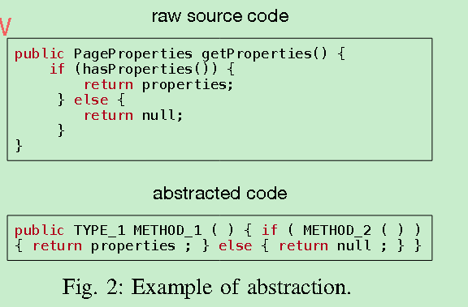

**第二步：过滤无关评论 (Filtering Out Noisy Comments)**

- **问题：** 很多评审评论与代码修改无关，例如“谢谢！”、“写得不错”、“请修复一下格式”。这些评论对于学习代码转换是“噪音”。

- 解决方案：

  研究人员设计了一套**基于关键词的启发式规则**

  来自动过滤这些噪音评论。这套规则旨在移除：

  1. 无意义的单次评论（如 “nice”）。
  2. 只要求修改格式或缩进的评论。
  3. 感谢或批准性的评论。
  4. 要求添加测试代码或文档的评论（因为这不会改变被评审方法本身）。

- **效果：** 这套启发式规则在测试集上分类“相关评论”的精确度达到了**93.4%**，效果甚至优于他们尝试训练的机器学习分类器。

**第三步：构建最终数据集** 在完成上述步骤后，研究人员对数据进行了最后几轮过滤，以确保高质量的训练样本：

- **筛选单一评论：** **`只保留那些在一个评审轮次中仅收到一条相关评论的方法。这样可以确保代码的修改 (ms→mr) 是由这条唯一的评论 (rnl) 引起的，建立了清晰的因果关系。`**
- **确保代码有变化：** 移除那些抽象后ms和mr完全相同的样本（例如，只改了注释或空行）。
- **限制长度：** 移除抽象后长度超过100个token的方法，以适应Transformer模型的处理能力。
- **无新标识符：** 移除那些在mr中引入了ms中从未出现过的新标识符的样本。因为模型从抽象代码中无法“猜出”具体的新变量名是什么。

经过这一系列严格的过滤，最终得到了 **17,194个**高质量的三元组样本 (`(ms, rnl, mr)`)。基于此，构建了两个数据集：

- **Dt(Triplet Dataset)：** 包含完整的 `(ms, rnl, mr)` 三元组，用于训练评审者模型（双编码器）。
- **Dp (Pair Dataset)：** 通过从 Dt 中移除评论 rnl 得到，只包含 `(ms, mr)` 对，用于训练贡献者模型（单编码器）。

### 实验

模型架构与训练

- **基础架构：** 两个模型都基于 **Transformer** 网络，这是一种在自然语言处理领域取得巨大成功的序列到序列模型，完全依赖于注意力机制。
- 模型一：贡献者模型 (1-Encoder Model)
  - **结构：** 一个编码器 + 一个解码器。
  - **输入：** 抽象后的原始代码 ms。
  - **输出：** 抽象后的建议修改代码 mr。
  - **训练数据：** Dp 数据集。
- 模型二：评审者模型 (2-Encoder Model)
  - **结构：** **两个编码器** + 一个解码器。这是该论文的一个创新点。
  - **输入：** 抽象后的原始代码 ms（输入给第一个编码器）和处理过的评审评论 rnl（输入给第二个编码器）。
  - **输出：** 抽象后的修改代码 mr。解码器在生成代码时会同时关注代码和评论的信息。
  - **训练数据：** Dt 数据集。
- 训练细节：
  - **实现库：** 使用了 **OpenNMT-tf** 框架。
  - **超参数搜索：** 采用**贝叶斯优化**（Bayesian Optimization）来自动寻找最佳的超参数组合（如网络层数、隐藏单元数、学习率等），以最大化模型性能。
  - 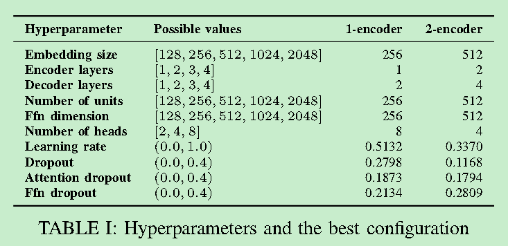

评估方法

为了全面评估模型的效果，研究人员结合了定量和定性分析。

- **生成策略：** 在测试阶段，使用**集束搜索（Beam Search）**来生成k*k*个（k=1,3,5,10*k*=1,3,5,10）最可能的修改方案，而不是只生成一个。这更符合现实场景，即为开发者提供多个备选建议。
- **定量指标：**
  1. **完美预测率 (Perfect Predictions)：** 模型生成的k*k*个候选项中，**是否存在一个与开发者实际修改的代码完全一致**。这是最严格的评价指标。
  2. **BLEU-4得分：** 一种常用于机器翻译的指标，通过比较生成文本和参考文本中n-gram（本文中为4-gram）的重合度来衡量相似性。分数越高，说明生成的代码在结构上越接近目标代码。
  3. **Levenshtein距离：** 计算将生成代码转换为目标代码所需的最小编辑次数（增、删、改），距离越小说明两者越接近。

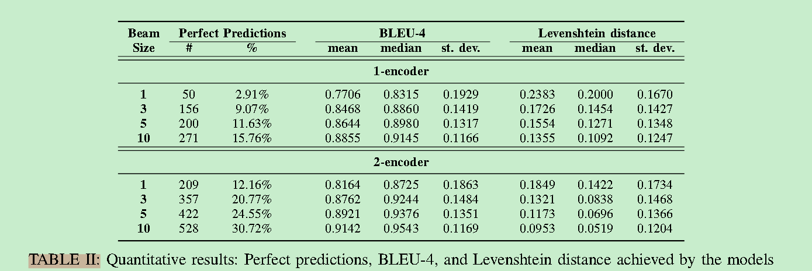

> 这里bleu很高是因为，所做的抽象过程（如将将代码中的自定义标识符（如变量名`totalSum`）和字面量（如字符串`"Error"`）替换为标准化的占位符（如`VAR_1`、`STRING_1`））

- **定性分析：**

  - 研究人员手动分析了数百个模型成功生成的“完美预测”样本，将它们所做的**代码修改类型进行分类**（例如，修改方法可见性、简化返回语句、修复bug等），以理解模型到底学会了什么。

  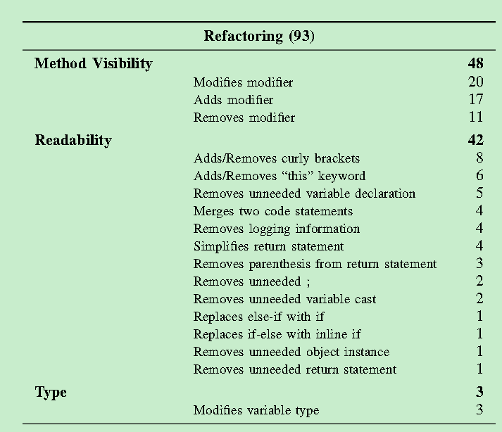

  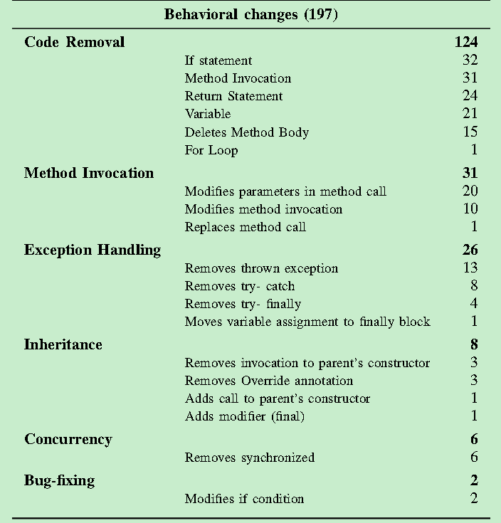

  

  - 他们还分析了那些不完美但BLEU得分较高的预测，以判断这些建议是否在语义上仍然有价值。


## Using pre-trained models to boost code review automation.

Rosalia Tufano、Gabriele Bavota

22 icse

https://github.com/RosaliaTufano/code_review_automation.

这篇论文提出了一种方法，利用预训练的“文本到文本传输器”（T5）模型来改进代码审查的自动化。

论文主要关注以下三个场景：

- **Code-to-code**: 模型根据原始代码提出修订版本，旨在提高代码质量。
- **Code-comment-to-code**: 模型根据原始代码和审查者的评论生成修订后的代码。
- **Code-to-comment**: 模型根据代码更改生成自然的审查评论。

为了实现这些目标，研究人员从Stack Overflow和GitHub收集了大量的代码审查数据，并进行了数据清理和预处理。他们还进行了超参数调优，以优化T5模型在这些代码审查任务上的性能。

研究结果表明，预训练的T5模型在提升代码审查自动化方面表现良好，尤其是在“code-to-code”和“code-comment-to-code”任务中，模型能够提出高质量的代码更改建议。尽管在“code-to-comment”任务中也显示出潜力，但生成自然语言评论的复杂性仍然是一个挑战。


### 方法

**模型选择：T5 (Text-To-Text Transfer Transformer)**

- 为什么选择T5?

  : T5模型的核心范式是将所有NLP任务都统一为

  输入文本 -> 输出文本

  的格式。这与代码审查的本质完美契合：

  - 输入一段代码（文本），输出修改后的代码（文本）。
  - 输入代码+评论（文本），输出修改后的代码（文本）。
  - 输入代码变更（文本），输出审查评论（文本）。

- **架构**: T5是一个标准的基于Transformer的**编码器-解码器 (Encoder-Decoder)** 架构，非常适合处理序列到序列的生成任务。

**关键策略：预训练 (Pre-training) + 微调 (Fine-tuning)**

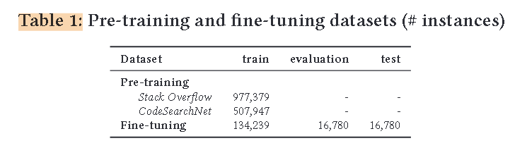

- **阶段一：预训练 (Pre-training)**

  - **目标**: 让模型在接触具体的代码审查数据之前，先学习关于**编程语言（Java）的通用知识**以及**代码与自然语言之间的关联**。
  - 数据集
    - **Stack Overflow (SO)**: 选取了包含Java代码的高质量问答对。这让模型学习如何理解与代码相关的自然语言问题和描述。
    - **CodeSearchNet (CSN)**: 包含了大量的Java函数及其对应的文档字符串（docstrings）。这让模型学习代码的功能与其自然语言注释之间的映射关系。
  - **任务**: 采用T5的**掩码语言模型（Masked Language Model）**任务。即随机遮盖（mask）输入文本（代码或自然语言）的一部分词元（tokens），让模型预测被遮盖的内容。

- **阶段二：微调 (Fine-tuning)**

  - **目标**: 将预训练好的、具备通用代码知识的模型，调优使其**专注于代码审查这个特定任务**。

  - 数据集

    - **来源**: 从GitHub和Gerrit（一个代码审查工具）上爬取了大量的真实代码审查记录。

    - 数据结构

      : 将每条记录处理成一个三元组：

      (c_s, c_l, c_a)

      - `c_s` (source code): 审查前的原始代码。
      - `c_l` (comment label): 审查者给出的自然语言评论。
      - `c_a` (accepted code): 开发者根据评论修改后，并被接受的最终代码。

    - 数据清洗 (极其重要)

      : 进行了严格的数据清洗，包括：

      - 过滤掉非Java代码和非英语评论。
      - 移除大型或过于复杂的代码变更（例如，涉及多个文件）。
      - 移除自动生成的、无信息的评论（如“Done”）。
      - 过滤掉格式化、导入语句等非实质性的代码修改。
      - 最终构建了一个包含数十万条高质量三元组的数据集。

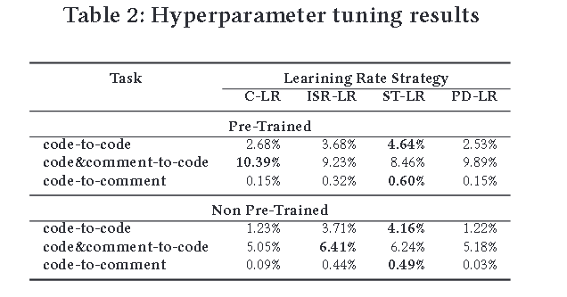

### 实验


**研究问题 (Research Questions - RQs)**:

- **RQ1**: 预训练的T5模型在这三个代码审查任务上表现如何？(评估模型的基础性能)
- **RQ2**: **预训练**到底有多大作用？与未经预训练的模型相比，性能提升了多少？(验证预训练的必要性)
- **RQ3**: 相比于之前的基线工作（该团队在[46]中提出的方法），预训练T5模型的性能是否有提升？(证明方法的先进性)
- **RQ4**: 模型的预测**置信度**（confidence）与其预测的**质量**之间是否存在关联？(探索模型在实际应用中的可靠性)

**实验结果与分析 (Results & Analysis)**

**对 RQ1 的回答 (模型性能)**

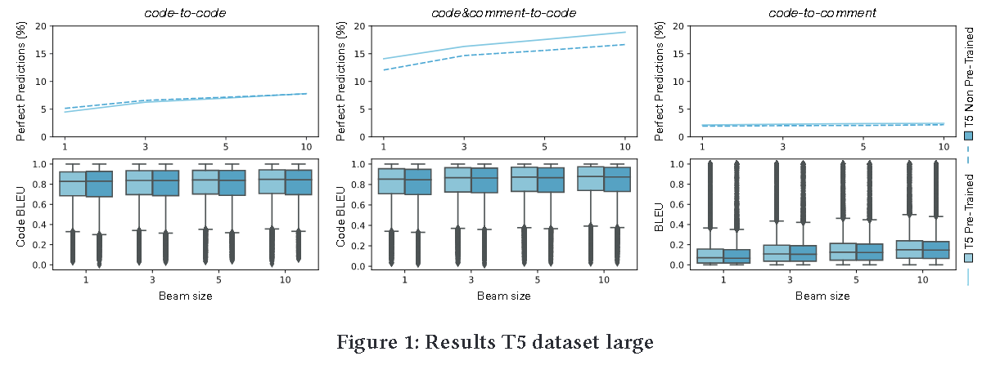

- 代码生成任务 (`code-to-code` & `code-comment-to-code`)
  - 模型表现**非常出色**。
  - **完美预测 (Perfect Predictions)**: 在 `code-to-code` 任务中，约**12.06%\**的预测与开发者最终的修改完全一致。在 `code-comment-to-code` 任务中，这一比例更是达到了\**14.08%**。这在代码生成领域是一个非常高的指标。
  - **手动分析**: 研究者对100个被评估为“错误”的预测进行了手动分析，发现其中**62个**实际上是**语义上等价**或**可行的替代方案**。这表明模型的实际有效性远高于自动化指标所显示的数字。
- 评论生成任务 (`code-to-comment`)
  - 表现相对较弱，生成的评论在BLEU分数上不高。这表明准确、流畅地生成符合人类习惯的自然语言评论，比生成结构化的代码更具挑战性。

**对 RQ2 的回答 (预训练的重要性)**

- **结论是决定性的**: **预训练模型在所有任务上的性能都显著优于（statistically significant）未经预训练的模型**。
- **量化对比**: 以 `code-to-code` 任务为例，预训练模型产生完美预测的几率是未经预训练模型的 **11.48倍** (Odds Ratio)。`code-comment-to-code` 任务中，该比率也高达 **5.69倍**。
- **根本原因**: 预训练使模型获得了丰富的代码语法、结构和常见模式知识，这是仅靠有限的微调数据集无法学到的。

**对 RQ3 的回答 (与基线的比较)**

- 预训练的T5模型**全面超越**了他们之前在论文[46]中提出的基线模型，证明了采用更大、更强的预训练模型是正确的方向。

**对 RQ4 的回答 (置信度与质量)**

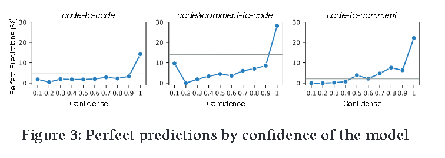

- 存在**明确的正相关关系**。模型为其预测给出的置信度分数越高，该预测是“完美预测”的概率也越高。
- **实际应用价值**: 这意味着在实际部署时，可以只向用户展示置信度高于某一阈值的AI建议，从而过滤掉大量低质量的预测，提高用户体验和信任度。


## Auger: automatically generating review comments with pre-training models.

22 FSE  软件所

Li Yang、 Chun Zuo

https://gitlab.com/ai-for-se-public-data/auger-fse-2022


AUGER的关键设计是将“哪一行值得评论”的信息显式编码为特殊标记 <review_tag> 注入模型输入，使模型“看齐人类注意力”，只围绕高亮行发言


### 背景与动机 

1.1 现代代码审查的重要性与挑战

现代代码审查被广泛认为是提高软件质量的最佳实践之一，它通过协作验证机制在开发早期阶段减少编程缺陷。典型的代码审查流程如下（见Figure 1）：

- (A) 开发者创建Pull Request提交代码变更
- (B) 审查者收到请求并检查相关编程文件
- (C) 审查者判断并标识有问题的代码行
- (D) 审查者在这些行后留下内联评论进行讨论

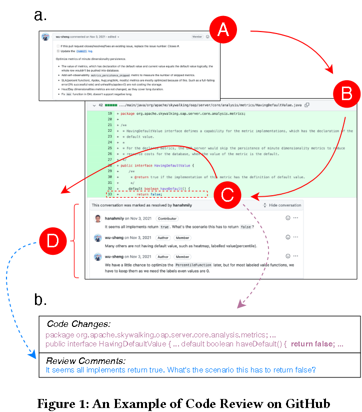


1.2 现有问题的双重挑战

作者识别出两个限制代码审查效益的关键因素：

**问题1：审查评论有效性不确定**

- Czerwonka等人发现只有15%的审查评论指示可能的缺陷
- Bosu等人报告Microsoft五个主要项目中34.50%的审查评论无用
- 低质量评论被认为无用且可能误导开发者

**问题2：人力投入巨大且耗时**

- 研究表明代码审查可能是开发中最耗时的部分
- 开发者平均每周花费6小时处理代码审查问题
- Mozilla约20%的开发者面临重负荷（每周超过10个补丁/审查）
- Microsoft Bing工业项目每月经历约3000次代码审查


1.3 既有解决方案的局限

现有自动化代码审查方法的问题：

- **Review-Bot (Balachandran)**：集成多个静态分析工具的间接方法
- **RevHelper (Rahman等人)**：预测审查评论是否有用，但不直接生成评论
- **Tufano等人最新研究**：专注自动代码修订，评论生成只是子任务，且粒度粗糙

### AUGER方法

整体架构概览

AUGER包含五个核心组件：

- **A. Data Preparation (3.2)**：数据准备
- **B. Review Lines Tagging (3.3)**：审查行标记
- **C. Cross Pre-training (3.4)**：跨模态预训练
- **D. Comments Generation (3.5)**：评论生成
- **E. Application (3.6)**：应用部署

数据准备 (Data Preparation)

数据获取

- 使用GitHub GraphQL API从11个知名Java项目获取数据
- 只保留确实触发代码修订的审查活动
- 移除非Java代码的审查
- 形成三元组`<Sub_Code, Rev_Code, C>`

数据清洗过程

**严格的数据过滤，从79,344条减少到11,672条有效数据（保留15%）**

被移除的数据包括：

- **40.77% (32,348条)**：代码修订或评论超出函数范围
- **44.52% (35,324条)**：函数或评论过短(<3词)或过长(>128词)

文本预处理

**代码文本处理：**

- `完全移除源代码注释`
- 保留除"."外的所有标点符号（保持结构知识）
- 使用WordNinja工具分割复合词（如"HavingDefaultValue" → "having default value"）

**评论文本处理：**

- 移除"@"等社交标记
- 缩略词展开（如"What's" → "What is"）
- 移除所有标点符号保留语义词
- 选择前3句当评论过长时

数据增强

使用Wei等人的方法进行语义数据增强，将训练三元组扩展9倍，最终得到约62,000条训练样本。

**`审查行标记 (Review Lines Tagging)`**

审查行定位

通过比较`Sub_Code`和`Rev_Code`找出差异行：

```
Diff = {v^s | v^s ∈ Sub_Code}
Diff_valid = {vi^s, vi+1^s, ..., vi+k^s}, k ∈ N
```


在确实被修改的行前添加特殊标记`<review_tag>`。

函数提取器

- 使用javalang工具将代码文件转换为AST
- 提取包含`<review_tag>`的函数级代码块
- 减少无关代码噪声的干扰


**跨模态预训练 (Cross Pre-training)**


**分词处理**

- 将处理后的评论`C`和函数`v_t^s`配对为`<v_t^s, C>`
- 使用T5-base分词器对文本对（包括`<review_tag>`）进行编码
- 随机选择10%的词进行掩码

 **T5-java-based掩码语言模型**

- 选择CodeTrans的T5变体（已在Java文档上预训练）
- 作为跨编码器同时编码代码和评论token
- 为`<review_tag>`增加特殊token嵌入
- 添加前缀"Generating review comments:"

损失函数定义为


评论生成 (Comments Generation)


文本编码器

使用T5分词器将代码块`v_t^s`（包含review_tag）编码为768维向量，并添加结束token `</s>`。

迁移学习

基于预训练模型进行文本生成微调：

```
f^D_δk(xi) = {P(yi^D|xi^D) | yi^D ∈ Y^D, i = 1,2,...,|X^D|}
f^T_τk(xi) = {P(yi^T|xi^T) | yi^T ∈ Y^T, i = 1,2,...,|X^T|}
```


损失函数：

```
Loss_trans = -1/|S| ∑∑ yij^s log(φij^s)
```


### 实验

#### 1研究问题

论文旨在回答三个核心研究问题：

- **RQ1**：AUGER在自动生成审查评论方面的有效性如何？
- **RQ2**：各子组件对整体性能的贡献是什么？
- **RQ3**：AUGER生成的评论有用性程度如何？

#### 2 数据源

选择11个知名Java仓库，所有项目都有至少4,000个pull request和100个贡献者：

| 仓库          | PR总数      | 成功PR数   | 有效审查数 |
| ------------- | ----------- | ---------- | ---------- |
| Graal         | 4,200       | 222        | 904        |
| Dubbo         | 9,500       | 678        | 1,447      |
| Netty         | 12,000      | 1,365      | 4,938      |
| Apollo        | 4,200       | 98         | 305        |
| Flink         | 18,200      | 4,759      | 23,274     |
| Kafka         | 11,605      | 2,039      | 10,544     |
| Skywalking    | 8,350       | 611        | 1,985      |
| Redisson      | 4,100       | 49         | 82         |
| Bazel         | 14,500      | 515        | 1,651      |
| Jenkins       | 6,100       | 965        | 3,379      |
| ElasticSearch | 82,200      | 8,215      | 30,735     |
| **总计**      | **174,955** | **19,516** | **79,344** |

#### 3 基线方法

选择四种具有代表性的基线方法：

- **LSTM**：经典循环神经网络，擅长序列信息存储
- **CopyNet**：序列到序列学习，带复制机制
- **CodeBERT**：微软提出的代码预训练模型
- **Tufano等人的T5变体**：专门用于代码到评论的生成

#### 4 评估指标

采用机器翻译评估中广泛使用的指标：

- ROUGE-1 & ROUGE-L

  ：测量词汇重叠和最长序列匹配

  - Precision：预测中正确的比例
  - Recall：真实中被预测到的比例
  - F1-score：Precision和Recall的调和平均

- **Perfect Prediction**：与理想结果完全相同的预测比例

#### 实验设置

数据划分

- 训练集：80%
- 验证集：10%
- 测试集：10%

超参数配置

**预训练模型参数：**

- 学习率：1e-4
- 最大输入长度：256
- 批次大小：16

**生成模型参数：**

- 学习率：1e-3
- 长度惩罚：1
- 最大输入长度：128
- 最大输出长度：128
- 批次大小：32

实验环境

- 硬件：NVIDIA GeForce RTX 3090 GPU
- CUDA版本：11.4
- 训练时间：预训练12小时 + 微调5小时


#### 实验结果与评估 (Evaluation)

RQ1：性能对比结果

自动评估指标结果

在Top-10生成中，AUGER在所有指标上都显著优于基线：

| 指标               | AUGER  | 最佳基线 | 相对提升   |
| ------------------ | ------ | -------- | ---------- |
| ROUGE-L            | 22.97% | 16.71%   | **37.38%** |
| Perfect Prediction | 4.32%  | 0.31%    | **14倍**   |
| Precision          | 26.11% | 21.51%   | **21.33%** |
| Recall             | 27.07% | 17.52%   | **54.51%** |
| F1-score           | 25.28% | 18.29%   | **38.22%** |

性能优势分析

AUGER优势源于两方面：

1. **先进的预训练和迁移学习技术**：提供大规模数据学习能力
2. **细粒度的行级标记设计**：帮助模型生成与关键代码行相关的评论

效率表现

- 生成一条评论平均需要20秒
- 相比人工评论的数分钟到数小时，大幅减轻审查负担
- 提供即时反馈，节省开发者和审查者的等待时间

案例对比分析

**原始代码变更：**

```java
protected void close() {
   // ... 其他代码 ...
   try {
      transformationChain.close();
   } catch (Throwable t) {
      log.warn("Could not stop transformation chain", t);
   }
}
```


**人类审查评论：**

> "Nit: the method is Transformation.close(), not "stop". The log message should probably reflect that."

**各方法生成结果：**

- **AUGER**: "the method be transformation close not stop the log message should probably reflect that"
- **Tufano等人**: "If we're going to stop the review, maybe we should change this to info?"
- **CodeBERT**: "stop method be producer close not stop the log message should probably reflect that"
- **CopyNET**: "i think this should be stop a log chain"
- **LSTM**: "i think this be a bug"

AUGER成功识别了缺陷并生成了与人类高度一致的评论。

RQ2：消融实验结果

基础模型对比

| 方法      | ROUGE-L    | Perfect Prediction |
| --------- | ---------- | ------------------ |
| T5 base   | 22.01%     | 3.95%              |
| T5 java   | 22.41%     | 4.14%              |
| **AUGER** | **22.97%** | **4.32%**          |

证明AUGER能比简单的T5微调更好地解决问题。

组件重要性分析

| 变体                | ROUGE-L    | Perfect Prediction | 性能变化   |
| ------------------- | ---------- | ------------------ | ---------- |
| AUGER -<review_tag> | 21.47%     | 3.31%              | **-6.53%** |
| AUGER -pretraining  | 22.91%     | 3.95%              | **-0.26%** |
| AUGER* (继续训练)   | 23.93%     | 4.04%              | **+4.18%** |
| **AUGER (完整)**    | **22.97%** | **4.32%**          | **基线**   |

**关键发现：**

- **审查行标记至关重要**：移除`<review_tag>`导致显著性能下降
- **跨模态预训练有贡献**：虽然提升相对较小，但对严格指标有帮助
- **可持续训练能力**：继续训练不仅不退化，还能进一步提升


RQ3：有用性评估结果

动机反映分析

从100个最佳（非完美）生成样本中分析AUGER覆盖的审查动机：

| 动机类型              | 占比 | 说明           |
| --------------------- | ---- | -------------- |
| Finding Defects       | 60%  | 发现缺陷       |
| Code Improvement      | 46%  | 代码改进       |
| Alternative Solutions | 34%  | 替代方案       |
| Team Awareness        | 22%  | 团队认知       |
| Knowledge Transfer    | 12%  | 知识传递       |
| Improving Dev Process | 6%   | 改进开发流程   |
| Share Code Ownership  | 6%   | 共享代码所有权 |
| Team Assessment       | 6%   | 团队评估       |
| Avoid Build Breaks    | 2%   | 避免构建中断   |
| Track Rationale       | 2%   | 跟踪理由       |

成功覆盖所有十类有价值的审查评论动机，分布与历史统计相似。


有用性分类对比

| 类别                     | AUGER | 人类审查者 |
| ------------------------ | ----- | ---------- |
| 有用 (Useful)            | 29%   | 45%        |
| 较有用 (Somewhat Useful) | 22%   | 17%        |
| 无用 (Non-useful)        | 49%   | 38%        |

**结果解读：**

- AUGER在约29%的情况下产生直接有价值的建议
- 考虑到20秒的生成速度，作为"评论草案生成器"具有现实价值
- 与人类仍有差距，但已具备实用意义


案例研究分析

**论文位置：第5.4节，第10页；Figure 8详细案例**

作者深入分析了100个样本中96个"非完美"预测，发现：

- **3个"接近完美"**：仅一个词不同
- **4个"语义完美"**：传达相同信息但措辞不同

#### 典型案例分析

**案例1：建议热修复**

- **代码**：`if (scheme.startsWith("s3") || scheme.startsWith("emr") || scheme.startsWith("oss"))`
- **人类评论**：`"Sounds good, I think hotfix will be better."`
- **AUGER生成**：`"i think this scheme should be a separate hot fix"`

**案例2：质疑reset语义**

- **代码**：`void reset(); long compare(...)`
- **人类评论**：`"why a comparator need to be reset?"`
- **AUGER生成**：`"what do think about reset be"`

**案例3：建议日志级别调整**

- **代码**：`log.info("Added records into the buffered queue...")`
- **人类评论**：`"Should this be debug level? Seems like this could be really spammy."`
- **AUGER生成**：`"can we just do this log to debug level"`

**案例4：建议移除无关变更**

- **代码**：`ActionListener<Boolean> deleteModelStateListener = ...`
- **人类评论**：`"Does UnusedStateRemover class need to be changed too?"`
- **AUGER生成**：`"could you revert this change since it be unrelated to the change"`

这些案例显示AUGER能够捕捉核心问题并提供有意义的建议


## idea

1.

llm的输入窗口 已经极大增长， 那么是否能从  commit 甚至是 pr级别做review comment generation。

这些同一个pr下的 code change是相互关联的，可能获得更好也更高效的结果。

具体来说，

将涉及到变更的行首先放缩到method级别， 然后是本文件内class级别的skeleton


接着将具体涉及变更行的  关联的函数 的doc搞过来（将正在review的method与其他该pr涉及的文件method做一个规则匹配，找到涉及的method，然后给出这些method路径、doc即可）


这是一个code change的处理

将多个code change处理后，去重，然后按照目录顺序摆放在一起，

最后输入llm


2.

输入可以做到commit即多文件级别


但是为什么？

人工是 一个文件一个文件看的diff，综合多个文件 总体理解一个commit


从functionality来看，多文件有助于code review

之前的方法聚集于预训练、微调等，受限于模型如T5的输入窗口大小，往往是method级别，而使用Llama等时，也没有提供充足上下文


> 不应该做到PR级别，因为 按理来说 交一个commit，然后review后，修改，然后再给一个commit
>
> 还是不对，可以做到pr级别，  每次智能的判定上次commit是否正确，developer是否智能的理解了reviewer的用意并正确实现。


## 8.20总结

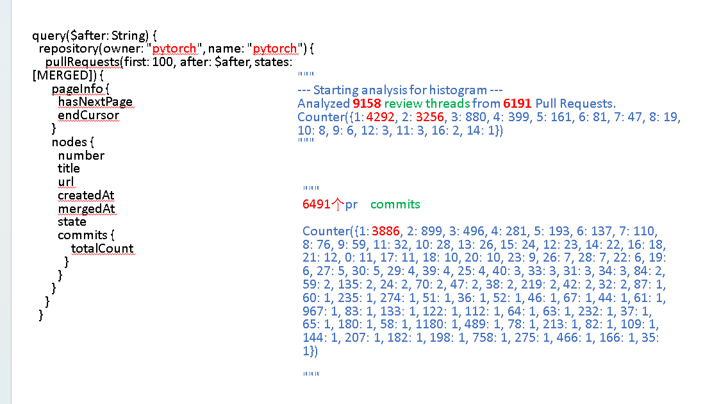

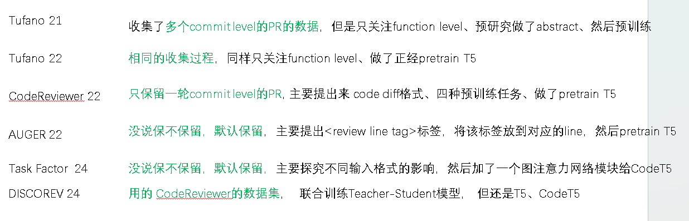

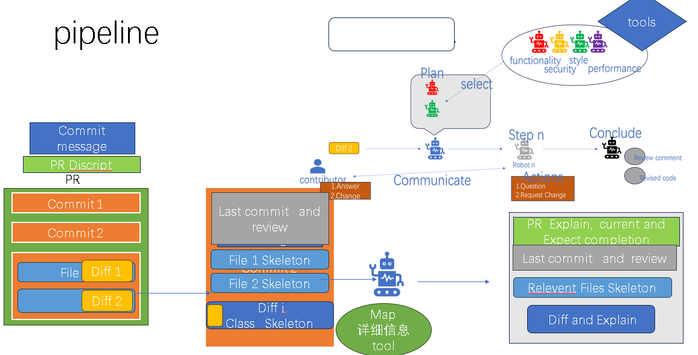

1. repo级别的输入，仔细查看agentless
2. 接着爬数据、数据有噪音
3. 找一个repo作为例子，然后进行agent编码构建
4. 接着看论文


## repo输入格式

设计方案：

1. 扫描整个repo所以py文件，对每个文件的所有函数提取基本信息  

   函数定义和函数调用信息

2. 导入关系分析、名称解析映射构建

2. 生成一个全局调用关系单向图

   节点是函数， 边即是调用关系

3. 给定输入目标函数func，生成 up_stream_tree和down_stream_tree,动态定义层数及详细信息

4. 给agent提供一个详细信息分析工具，使模型可以动态补充上述skeleton

5. 最后给agent的输入包括   repo_structure、包含target_func的class skeleton、以及target_func的up_stream_tree和down_stream_tree。


> preliminary:
>
> 1.先处理基本的直接函数调用、外部函数调用
>
> ​	内置库、常见库函数不处理
>
> ​	动态调用（如exec）、间接调用（通过存储函数引用调用）、类继承重写调用 等 先不做处理
>
> 2. 先简单用ast以及NetworkkX库函数进行实现


>import的分类


>函数内调用的分类
>
>文件内函数形如 func()
>
>文件外导入的函数from utils.validator import validate_input 形如 validate_input ()
>
>


>### 调用图分析的关键调用类型
>
>#### 1. 基本函数调用 (Basic Function Calls)
>
>这是最基础的类型，但也是构建一切分析的基石。
>
>- **文件内函数调用 (Intra-file Call):**
>  - **描述:** 在同一个 `.py` 文件中，一个函数直接调用另一个函数。
>  - **示例:** `main.py` 文件里的 `func_a()` 调用 `func_b()`。
>  - **测试目的:** 检验分析工具最基本的能力，即在单个作用域内识别调用关系。
>- **跨文件/模块函数调用 (Inter-file/Module Call):**
>  - **描述:** 一个文件中的函数调用另一个文件中导入的函数。这涉及到模块导入解析。
>  - **示例:** `main.py` 调用 `utils.helper.format_data()`。
>  - **测试目的:** 检验工具是否能正确处理 `import` 语句（包括 `import X`, `from X import Y`, `from . import Z` 等相对导入），并跨文件追踪调用链。
>
>#### 2. 面向对象调用 (Object-Oriented Calls)
>
>Python 是面向对象的语言，这类调用非常普遍且复杂。
>
>- **实例方法调用 (Instance Method Call):**
>  - **描述:** 创建一个类的实例（对象），然后调用该实例的方法。这是你提到的“变量方法调用”。
>  - **示例:** `user = User(); user.get_profile()`。
>  - **测试目的:** 检验工具能否将变量 (`user`) 与其类型 (`User` 类) 关联起来，并正确找到被调用的方法。
>- **继承与多态调用 (Inheritance and Polymorphism):**
>  - **描述:** 一个父类和一个或多个子类都定义了同名方法。当通过一个父类类型的变量调用该方法时，实际执行的是哪个子类的方法？
>  - **示例:** `animal = Dog(); animal.speak()` 应该调用 `Dog` 类的 `speak` 方法，而不是 `Animal` 类的。
>  - **测试目的:** 这是对静态分析工具的巨大挑战。工具需要能够推断出变量的“真实类型”，以确定多态调用的目标。一个不那么智能的工具可能会错误地将调用链接到父类或所有相关的子类。
>- **类方法和静态方法调用 (Class & Static Method Calls):**
>  - **描述:** 不通过实例，而是直接通过类本身调用被 `@classmethod` 或 `@staticmethod` 装饰的方法。
>  - **示例:** `Config.load_from_file()`。
>  - **测试目的:** 检验工具是否能正确识别这两种特殊的方法装饰器及其调用方式。
>
>#### 3. Python 动态与函数式特性 (Dynamic & Functional Features)
>
>这些特性是 Python 灵活性的体现，也是静态分析的难点。
>
>- **高阶函数调用 (Higher-Order Functions):**
>  - **描述:** 一个函数被当作参数传递给另一个函数，并在其内部被调用。
>  - **示例:** `def process(data, action_func): result = action_func(data); return result`，这里 `action_func` 是一个变量。
>  - **测试目的:** 检验工具能否追踪“函数对象”的传递，并确定在调用点 `action_func(data)` 处，究竟是哪个具体的函数被调用了。
>- **函数别名调用 (Function Aliasing):**
>  - **描述:** 将一个函数赋值给一个（或多个）新变量，然后通过新变量名进行调用。这也包括你提到的“全局变量调用”（如果全局变量持有一个函数的话）。
>  - **示例:** `calculate = perform_complex_calculation; result = calculate()`。
>  - **测试目的:** 检验工具的赋值追踪能力。它必须知道 `calculate` 和 `perform_complex_calculation` 指向的是同一个函数定义。
>- **存储在数据结构中的函数调用 (Functions in Data Structures):**
>  - **描述:** 将函数存储在列表、字典或其他数据结构中，在运行时根据条件取出并调用。
>  - **示例:** `actions = {"create": create_user, "delete": delete_user}; actions[user_choice]()`。
>  - **测试目的:** 这是对静态分析的终极考验之一。工具必须能推断出 `user_choice` 的可能值，才能确定 `actions[user_choice]` 对应哪个函数。很多工具在这里会失败或进行过度近似（over-approximation），即假设任何存储在字典里的函数都可能被调用。
>
>#### 4. 隐式与特殊方法调用 (Implicit & Special Method Calls)
>
>这类调用不是由用户代码直接写出的 `func()` 形式，而是由语言特性隐式触发的。
>
>- **构造函数调用 (`__init__`):**
>  - **描述:** 当创建一个类的实例时，它的 `__init__` 方法被自动调用。
>  - **示例:** `user = User()` 隐式调用了 `User.__init__()`。
>  - **测试目的:** 检验工具能否识别这种对象实例化的语法，并将其正确链接到 `__init__` 方法的调用。
>- **可调用对象 (`__call__`):**
>  - **描述:** 一个类的实例如果定义了 `__call__` 方法，那么这个实例本身就可以像函数一样被调用。
>  - **示例:** `processor = DataProcessor(); result = processor(data)` 隐式调用了 `processor.__call__(data)`。
>  - **测试目的:** 检验工具是否能识别这种特殊的“对象即函数”模式。
>
>#### 5. 全局/局部变量与函数引用 (Global/Local Variables & Function References)
>
>- **描述:** 一个在全局作用域定义的变量持有一个函数引用。模块内的任何函数都可以调用它。这个全局变量的值甚至可能在运行时被重新赋值，从而改变后续调用的目标。
>
>- 示例:
>
>  ```python
>  # a_module.py
>  def default_handler(data):
>      print("Default handler")
>  
>  # 全局变量，初始指向 default_handler
>  CURRENT_HANDLER = default_handler
>  
>  def process_data(data):
>      # 这里的调用目标是全局变量 CURRENT_HANDLER 的当前值
>      CURRENT_HANDLER(data)
>  
>  def set_custom_handler(handler_func):
>      global CURRENT_HANDLER
>      # 重新赋值全局变量
>      CURRENT_HANDLER = handler_func
>  ```
>
>  
>
>- **测试目的:** 检验工具是否能追踪全局变量的状态。一个简单的工具可能会将 `process_data` 中的调用同时链接到 `default_handler` 和任何可能被 `set_custom_handler` 传入的函数。这测试了工具进行“数据流分析”或“指向分析”的能力。
>
>#### 6. 闭包与非局部变量调用 (Closures and Nonlocal Variable Calls)
>
>- **描述:** 一个嵌套函数（内部函数）引用并调用了其外部（但非全局）函数作用域中的变量。这个变量通常是一个函数。
>
>- 示例:
>
>  ```python
>  def create_executor(logger_func):
>      def executor(task):
>          # logger_func 是一个 "nonlocal" 变量
>          # 它既不是全局的，也不是 executor 自己的局部变量
>          logger_func(f"Executing task: {task}")
>          # ... 执行任务 ...
>      return executor
>  
>  def main_logger(msg): 
>      print(f"[LOG]: {msg}")
>  
>  # create_executor 返回的函数 "记住" 了它被创建时的 logger_func
>  my_executor = create_executor(main_logger)
>  my_executor("send_email") # 这里的调用目标是 main_logger
>  ```
>
>  
>
>- **测试目的:** 这是对静态分析的严峻考验。工具必须理解词法作用域（lexical scoping），并能追踪闭包中捕获的变量，以正确链接 `executor` 内部对 `logger_func` 的调用。
>
>#### 7. 变量遮蔽 (Variable Shadowing)
>
>- **描述:** 在一个局部作用域（如函数内）定义了一个与全局变量同名的变量。在该作用域内对该名称的所有引用都指向局部变量，而不是全局变量。
>
>- 示例:
>
>  ```python
>  def process_globally(data): ...
>  
>  # 全局变量
>  processor = process_globally
>  
>  def analyze_report():
>      # 局部变量 "遮蔽" 了全局的 processor
>      def process_locally(report): 
>          ...
>      
>      processor = process_locally
>      # 这个调用应该只链接到 process_locally
>      processor("report.csv") 
>  ```
>
>  
>
>- **测试目的:** 检验工具是否正确遵循 Python 的 **LEGB 规则**（Local -> Enclosing -> Global -> Built-in）来解析变量。如果工具混淆了局部和全局的 `processor`，就会产生一个错误的从 `analyze_report` 到 `process_globally` 的调用边。


>### 静态分析策略：捕获复杂调用链
>
>#### 核心模块
>
>| 模块           | 用途                                                         |
>| :------------- | :----------------------------------------------------------- |
>| **`ast`**      | **语法分析 (Parsing)**: 将 Python 源代码解析成一个抽象语法树（AST）。这是所有分析的基础。 |
>| **`symtable`** | **作用域分析 (Scoping)**: 从 AST 中构建符号表，帮助识别变量是局部的、全局的还是非局部的。 |
>
>------
>
>### 阶段一：解析与遍历 (Parsing and Traversal)
>
>这是你的入口点。你需要遍历项目中的所有 `.py` 文件。
>
>1. **读取文件内容**: `file_content = Path("...").read_text()`。
>2. **生成 AST**: `tree = ast.parse(file_content)`。
>3. **遍历 AST**: 使用 `ast.NodeVisitor` 类。这是一个访问者模式的实现，你可以为感兴趣的节点类型（如 `FunctionDef`, `Call`, `Assign`）编写 `visit_NodeType` 方法。
>
>**示例代码:**
>
>```python
>import ast
>
>class MyCodeVisitor(ast.NodeVisitor):
>    def visit_FunctionDef(self, node):
>        print(f"发现函数定义: {node.name}")
>        self.generic_visit(node) # 继续遍历函数内部的节点
>
>    def visit_Call(self, node):
>        if isinstance(node.func, ast.Name):
>            print(f"发现函数调用: {node.func.id}")
>        self.generic_visit(node)
>
># source_code = "..."
># tree = ast.parse(source_code)
># visitor = MyCodeVisitor()
># visitor.visit(tree)
>```
>
>
>
>**局限性**: `ast` 根本不知道 `my_variable()` 中的 `my_variable` 是什么。它只是一个名字。要解决这个问题，我们需要进入下一阶段。
>
>------
>
>### 阶段二：构建语义模型与作用域 (Building a Semantic Model & Scopes)
>
>这是整个策略中最关键也最复杂的一步。你需要构建自己的数据结构来表示代码的“含义”。
>
>1. **定义作用域 (Scopes)**: 创建一个树状结构来表示作用域。根节点是内置作用域，下面是模块作用域，再下面是类或函数作用域。
>
>2. **创建符号表 (Symbol Tables)**: 每个作用域节点都应该有一个符号表，它是一个字典，将变量名映射到一个代表该符号的自定义对象。
>
>3. 使用 `symtable` 模块
>
>   : 在遍历 AST 之前或期间，可以先用
>
>   ```
>   symtable
>   ```
>
>   模块来预处理作用域。它可以告诉你每个变量的作用域（
>
>   ```
>   is_global()
>   ```
>
>   ```
>   is_local()
>   ```
>
>   ```
>   is_free()
>   ```
>
>   等），这极大地简化了作用域分析。
>
>   ```python
>   import symtable
>   # st = symtable.symtable(source_code, "file.py", "exec")
>   # st.get_symbols() # 可以获取顶层作用域的符号
>   ```
>
>   
>
>4. **填充符号表**: 在你的 `NodeVisitor` 中，当你遇到赋值语句 (`Assign`)、函数定义 (`FunctionDef`) 或类定义 (`ClassDef`) 时，就在当前作用域的符号表中创建或更新条目。
>
>------
>
>### 阶段三：指向分析 (Points-to Analysis)
>
>这是解决动态特性（如高阶函数、别名）的核心。目标是 **确定每个变量在任何时刻可能指向哪些对象或函数**。
>
>这是一个迭代过程，通常使用 **不动点算法 (Fixpoint Algorithm)**。
>
>1. **为每个符号附加一个“指向集”**: 在你的符号表对象中，每个符号都有一个集合，`points_to = set()`，用来存储它可能指向的对象/函数的唯一标识。
>
>2. **处理赋值语句 (`visit_Assign`)**:
>
>   - 当遇到 `y = x` 时，将 `x` 的 `points_to` 集合中的所有内容添加到 `y` 的 `points_to` 集合中。
>   - 当遇到 `obj = MyClass()` 时，创建一个 `MyClass` 的唯一实例标识，并将其添加到 `obj` 的 `points_to` 集合中。
>
>3. **处理函数调用 (`visit_Call`)**:
>
>   - **解析调用目标**: 找到被调用函数（例如 `func` in `func()`) 的符号。
>
>   - 遍历其 `points_to` 集合
>
>     :
>
>     - 对于集合中的每一个可能的函数定义 `F`，你就在你的调用图中添加一条从 **当前函数** 到 `F` 的边。
>
>   - **处理参数传递**: 将实参的 `points_to` 集合传播到 `F` 的形参符号中。
>
>4. **处理方法调用 (`visit_Call` with `node.func` as `ast.Attribute`)**:
>
>   - 对于 `obj.method()`，首先解析 `obj` 的 `points_to` 集合。
>   - 对于 `obj` 可能指向的每个类实例 `C`，在其类定义中（以及父类中，需要实现方法解析顺序 MRO）查找名为 `method` 的方法。
>   - 将调用链接到所有找到的方法。**这就是解决多态性的方法**。
>
>5. **迭代**: 因为一次赋值可能会影响后续的调用解析，这个过程需要反复进行，直到没有任何符号的 `points_to` 集合再发生变化为止。
>
>------
>
>### 阶段四：构建与输出调用图 (Building the Call Graph)
>
>这个阶段贯穿于阶段三中。
>
>1. **数据结构**: 使用一个字典来表示图，`call_graph = defaultdict(set)`。
>2. **添加边**: 在阶段三的函数调用处理步骤中，一旦你确定了一个调用关系（`caller` -> `callee`），就执行 `call_graph[caller_id].add(callee_id)`。
>3. **生成输出**: 分析完成后，遍历 `call_graph` 字典即可得到完整的调用链。
>
>### 如何利用此策略解决你的测试用例
>
>- **基础调用**: 阶段一和二即可基本解决。
>- **面向对象**: 阶段三的指向分析和 MRO 解析是关键。
>- **高阶函数/别名/数据结构**: 阶段三的指向分析（`points_to` 集合的传播）是唯一能解决这个问题的办法。
>- **`__init__` / `__call__`**: 在 `visit_Call` 中，如果调用目标是一个类，则将其重定向到 `__init__` 方法。如果目标是一个指向了带有 `__call__` 方法的类的实例，则重定向到 `__call__`。
>- **作用域/闭包**: 阶段二中对 `symtable` 的使用和精细的作用域树管理是解决这些问题的基础。
>
>**结论**:
>
>是的，你可以完全使用 Python 的标准库（主要是 `ast` 和 `symtable`）来实现一个强大的静态分析器来捕获所有这些调用。但这绝对不是一个简单的任务。你需要精心设计你的数据结构（作用域、符号表、指向集），并实现一个复杂的不动点分析算法。
>
>这正是论文中 **PyCG** 工具在内部所做的事情，也是 **Mypy**、**Pyright** 这类类型检查器工作的核心原理。
>
>


## 使用static analysis tool


>更换pycg为pyre
>
>
>
>> ```python
>> def run_oo_tests(my_dog:Dog):
>>     print("\n--- Running OO Tests ---")
>
>>     # === 实例方法调用 & 构造函数调用 ===
>>     # my_dog = Dog("Rex") # Dog.__init__ -> Animal.__init__
>>     my_dog.speak()
>
>>     # === 多态调用 ===
>>     animal_ref: Animal = Cat("Whiskers") # Cat.__init__ -> Animal.__init__
>>     animal_ref.speak() # 应该调用 Cat.speak
>
>>     # === 类方法和静态方法调用 ===
>>     PetManager.create_default_owner()
>>     Animal.is_living_being()
>>
>>     ```
>
>> 动态行为得到补充！！！！
>
>
>
>(review) gpu-node5% pyre query "callees(main.run_oo_tests)"
>{"response": {"callees": [{"kind": "method", "is_optional_class_attribute": false, "direct_target": "models.pets.PetManager.create_default_owner", "class_name": "models.pets.PetManager", "dispatch": "static"}, {"kind": "method", "is_optional_class_attribute": false, "direct_target": "models.base.Animal.__init__", "class_name": "models.pets.Cat", "dispatch": "static"}, {"kind": "method", "is_optional_class_attribute": false, "direct_target": "models.base.Animal.is_living_being", "class_name": "models.base.Animal", "dispatch": "static"}, {"kind": "method", "is_optional_class_attribute": false, "direct_target": "models.pets.Cat.speak", "class_name": "models.pets.Cat", "dispatch": "dynamic"}, {"kind": "method", "is_optional_class_attribute": false, "direct_target": "models.pets.Dog.speak", "class_name": "models.pets.Dog", "dispatch": "dynamic"}, {"kind": "function", "target": "print"}]}}
>
>

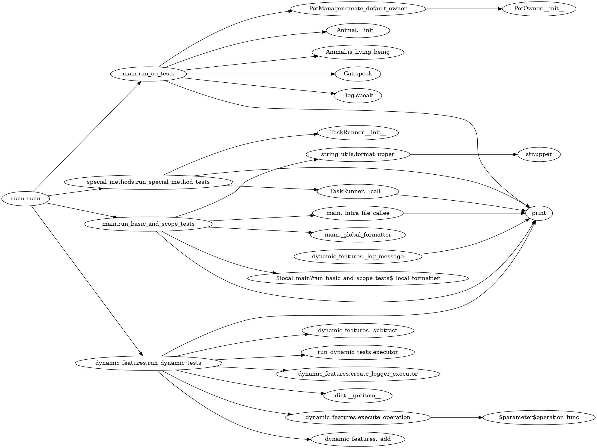


> 对于 obj，以及多态、magical method都有了较好的构建
>
> 但是对于 闭包函数、高阶函数即函数作为参数的、还做的不够细致
>
> #todo

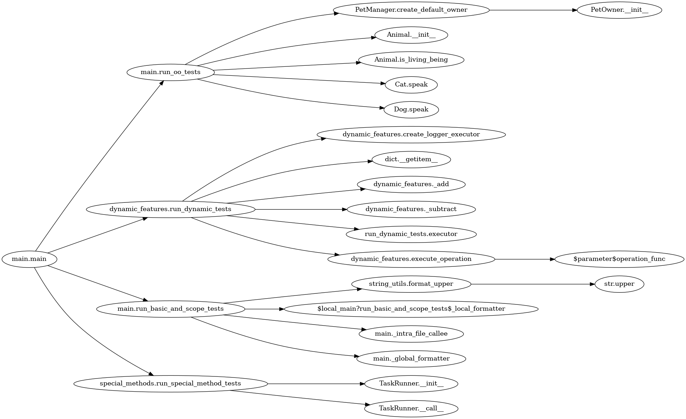


##################################################

==================== 分析函数: main.main (深度限制: 1) ====================

--- (Callee Tree for main.main) ---
main.main
├─ main.run_oo_tests
├─ features.dynamic_features.run_dynamic_tests
├─ main.run_basic_and_scope_tests
└─ features.special_methods.run_special_method_tests

--- (Caller Tree for main.main) ---
  (未找到上游调用或函数不存在)


==================== 分析函数: main.main (深度限制: 2) ====================

--- (Callee Tree for main.main) ---
main.main
├─ main.run_oo_tests
│   ├─ models.pets.PetManager.create_default_owner
│   ├─ models.base.Animal.__init__
│   ├─ models.base.Animal.is_living_being
│   ├─ models.pets.Cat.speak
│   └─ models.pets.Dog.speak
├─ features.dynamic_features.run_dynamic_tests
│   ├─ features.dynamic_features.create_logger_executor
│   ├─ dict.__getitem__
│   ├─ features.dynamic_features._add
│   ├─ features.dynamic_features._subtract
│   ├─ features.dynamic_features.run_dynamic_tests.executor
│   └─ features.dynamic_features.execute_operation
├─ main.run_basic_and_scope_tests
│   ├─ $local_main?run_basic_and_scope_tests$_local_formatter
│   ├─ main._intra_file_callee
│   ├─ main._global_formatter
│   └─ helpers.string_utils.format_upper
└─ features.special_methods.run_special_method_tests
    ├─ features.special_methods.TaskRunner.__init__
    └─ features.special_methods.TaskRunner.__call__

--- (Caller Tree for main.main) ---
  (未找到上游调用或函数不存在)


==================== 分析函数: main.main (深度限制: 3) ====================

--- (Callee Tree for main.main) ---
main.main
├─ main.run_oo_tests
│   ├─ models.pets.PetManager.create_default_owner
│   │   └─ models.base.PetOwner.__init__
│   ├─ models.base.Animal.__init__
│   ├─ models.base.Animal.is_living_being
│   ├─ models.pets.Cat.speak
│   └─ models.pets.Dog.speak
├─ features.dynamic_features.run_dynamic_tests
│   ├─ features.dynamic_features.create_logger_executor
│   ├─ dict.\__getitem__
│   ├─ features.dynamic_features._add
│   ├─ features.dynamic_features._subtract
│   ├─ features.dynamic_features.run_dynamic_tests.executor
│   └─ features.dynamic_features.execute_operation
│       └─ \$parameter$operation_func
├─ main.run_basic_and_scope_tests
│   ├─ \$local_main?run_basic_and_scope_tests\$_local_formatter
│   ├─ main._intra_file_callee
│   ├─ main._global_formatter
│   └─ helpers.string_utils.format_upper
│       └─ str.upper
└─ features.special_methods.run_special_method_tests
    ├─ features.special_methods.TaskRunner.__init__
    └─ features.special_methods.TaskRunner.__call__

--- (Caller Tree for main.main) ---
  (未找到上游调用或函数不存在)


## BitsAI-CR: Automated Code Review via LLM in Practice

[FSE Companion '25: Proceedings of the 33rd ACM International Conference on the Foundations of Software Engineering](https://dl.acm.org/doi/proceedings/10.1145/3696630)


fse 25 、 字节、北航


## git深入学习

[【深入Git-01】git是怎么存储数据的？_哔哩哔哩_bilibili](https://www.bilibili.com/video/BV1fsyHY3EEp?spm_id_from=333.788.videopod.sections&vd_source=39767bfbc4ae772d0c2f8d8b32b54ce6)

