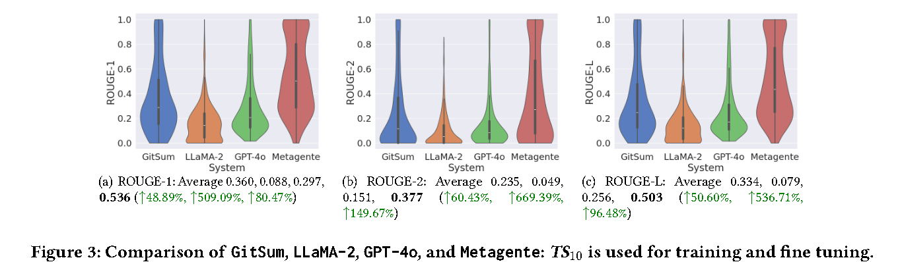
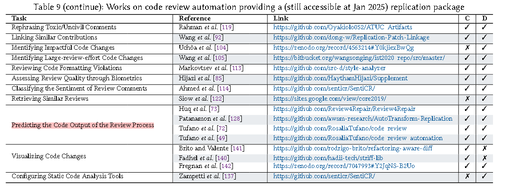
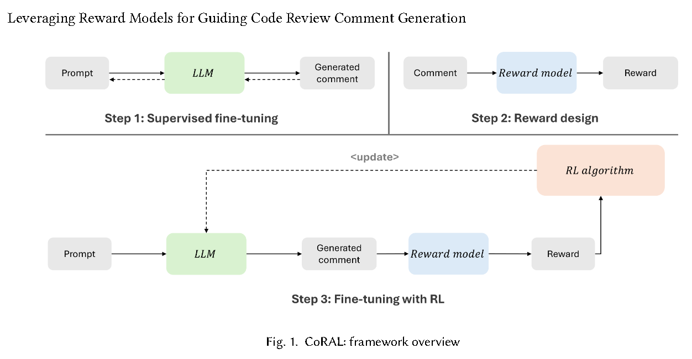
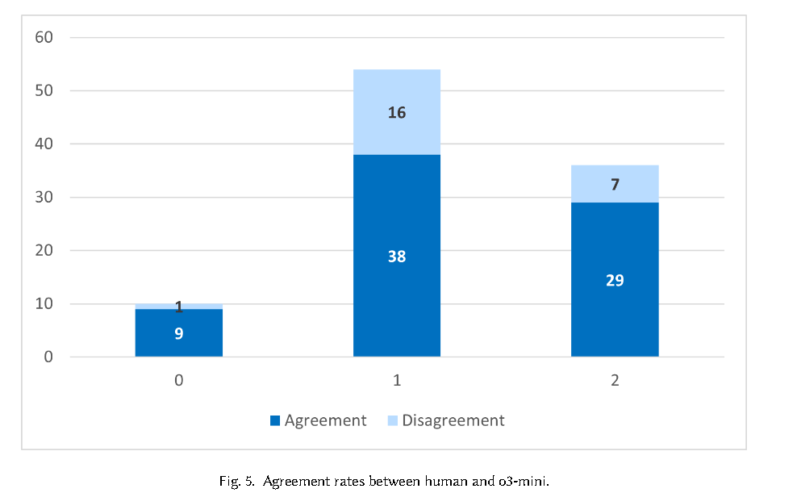
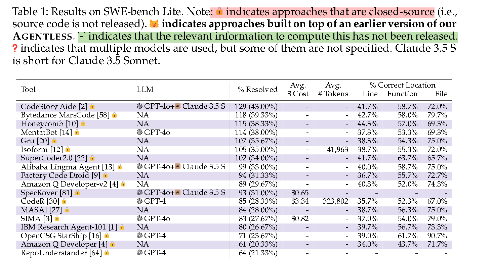
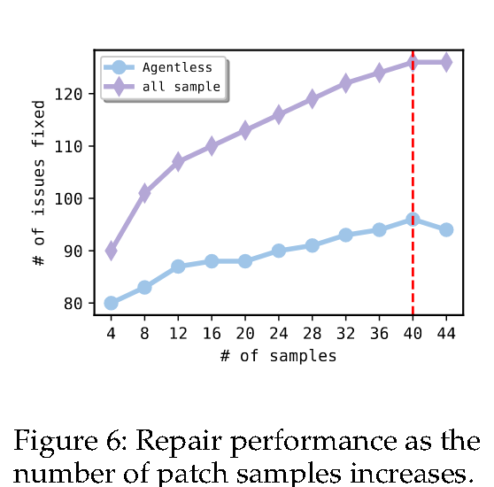
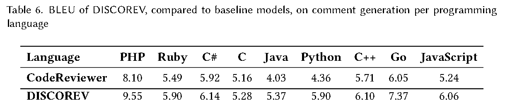

# Summer 2025 


------------------


## 2025.7.2

1. 需要坚定一些
   1. 随着对事物的了解增多，可选择项也就更多，然后也就容易改弦易张，所以坚定也就是能够忍耐最初的选择，并持之以恒地做到一定程度，这个程度不好把握，但是就科研而言，该程度即发一篇论文
   2. 还有就是做决定要深思熟虑
2. 大方向 代码生成、漏洞检测，  小方向 agent


1. 知道要做什么，翻翻fse，issta，然后下周一确定一个方向。


--------------

## FSE 2025

 6.23-27  


大致如下方向：


Requirements Engineering and Design

**clone**

bug检测

自动驾驶

漏洞

msr? szz?

**测试生成、测试**

library and product line

Employability and Professional Competence

performance性能

logging 

**code search**

程序分析

fuzzing 模糊测试->种子选择、突变、测试并报告异常状况

**llm4se**

**se4llm**

**repairs**

mobile apps

**code generation**

architecture、services and cloud

**Code Review, Build, and Release**
Blockchain and Smart Contract 区块链和智能合约

ui test 

process

Empirical Studies 

compiler

**debugging**

**agent**

ai-IDE


初步挑选的想看的论文：


> **[Teamwork makes the dream work: LLMs-Based Agents for GitHub README.MD Summarization](https://conf.researchr.org/program/fse-2025/program-fse-2025/?date=Mon 23 Jun 2025%2BTue 24 Jun 2025%2BWed 25 Jun 2025%2BThu 26 Jun 2025%2BFri 27 Jun 2025#)**
>
> Metagente is a Multi-Agent framework based on a series of LLMs to self-optimize the system through evaluation, feedback, and cooperation among specialized agents.
>
> Metagente是一个基于一**系列LLM的多代理框架**，通过评估、反馈和专门代理之间的合作来自我优化系统。**for GitHub README.MD Summarization**
>
> 
>
> **[Natural Language Outlines for Code: Literate Programming in the LLM Era](https://conf.researchr.org/program/fse-2025/program-fse-2025/?date=Mon 23 Jun 2025%2BTue 24 Jun 2025%2BWed 25 Jun 2025%2BThu 26 Jun 2025%2BFri 27 Jun 2025#)**
>
> 使用*自然语言大纲*作为一种新颖的模式和交互表面，在整个软件开发过程中为开发人员提供AI帮助
>
> **NL大纲支持代码和NL之间的双向同步**，开发人员可以更改代码或NL，并让LLM自动更新另一个。
>
> NL大纲的用处：它们可以加速代码和差异的理解和导航，简化代码维护，增强代码搜索，引导代码生成等等
>
> 
>
> **Automating API Documentation with LLMs: A BERTopic Approach**
>
> 开发人员依赖于 API 文档，但官方来源通常冗长、复杂或不完整。许多人转向 Stack Overflow 等社区驱动的论坛来获得实用的见解。
>
> 使用 BERTopic方法从 360 万篇 Stack Overflow 帖子中提取了流行主题，并应用提取式摘要技术来生成简洁的摘要，包括代码片段。
>
> 
>
> **AutoReview: An LLM-based Multi-Agent System for Security Issue-Oriented Code Review**
>
> 集成了三个agent：
>
> （1） **Issue Detector** 使用知识级检索增强生成来**识别潜在漏洞**，
>
> （2） **Issue Locator** 通过基于**图形的**代码切片精确**定位漏洞位置**
>
> （3） **Issue Repairer** 通过**迭代验证生成上下文感知修复程序**。在 ReposVul 上使用三个代码 LLM 进行评估，{\tool} 在安全代码审查中充分证明了其有效性，与基线相比，**F1** 检测分数提高了 18.72%，定位精度提高了 27.75%，修复 **BLEU** 提高了 14.82%。
>
> 
>
>
> #### **Knowledge-Based Multi-Agent Framework for Automated Software Architecture Design**
>
> 用于自动化软件架构设计的基于知识的多智能体框架
>
> MAAD使用代理来**模拟传统软件架构设计**过程中的人类角色，从而自动化设计过程。
>
> 为了赋予这些代理权力，MAAD整合了从三个关键来源提取的知识：1）现有系统设计，2）权威文献，以及3）架构专家。通过设想MAAD框架，我们旨在推进应用级系统开发的完全自动化。
>
> 
>
> #### From Overload to Insight: Bridging Code Search and Code Review with LLMs
>
> 代码搜索工具很多，但是代码审查时，**代码搜索工具生成的信息太过繁琐**，
>
> **使用LLM 帮助 人工进行代码审查**
> 该agent将总结相关见解，根据审查中的特定代码更改进行定制，并促进上下文感知交互
>
> 
>
> #### **An Empirical Study of the Non-determinism of ChatGPT in Code Generation**
>
> 对用于软件工程任务的大型语言模型（LLM）的研究激增，尤其是代码生成。然而，LLM的结果可能非常不稳定；**不确定性——针对同一提示符返回非常不同的代码。**
>
> 此外，我们发现*将温度设置为0并不能保证代码生成中的确定性*，尽管它确实比默认配置（温度=1）带来了更少的非确定性。
>
>
> **LLM-based Method Name Suggestion with Automatically Generated Context-Rich Prompts**
> 提出了一种基于大语言模型（LLM）的方法，**根据函数描述 生成 方法名称。**
>
> 该方法的关键是***ContextCraf**t*，这是一种自动算法，用于为LLM生成上下文丰富的提示，根据提示建议预期的方法名称
>
> 
>
> **SIGSOFT Impact Award** **[ Expectations, outcomes, and challenges of modern code review](https://conf.researchr.org/program/fse-2025/program-fse-2025/?date=Wed 25 Jun 2025%2BThu 26 Jun 2025%2BFri 27 Jun 2025%2B周五 2025 年 6 月 27 日%2B周四 26 6月 2025#)**
>
> 
>
> **Prompts Are Programs Too! Understanding How Developers Build Software Containing Prompts**
>
> 提示也是程序！了解开发人员如何构建包含提示的软件
>
> 
>
> **Codellm-Devkit: A Framework for Contextualizing Code LLMs with Program Analysis Insight**
>
> codellm-devkit：使用 Program Analysis Insights 将代码 LLM 置于上下文中的框架
> 为了充分利用代码 LLM 的潜力，**开发人员必须向模型提供特定于代码的上下文信息。这些通常是使用程序分析工具派生和提炼的**。但是，存在一个很大的差距 - **这些静态分析工具通常是特定于语言的，并且带有陡峭的学习曲线，**这使得它们的有效使用具有挑战性。这些工具是为特定的程序语言量身定制的，需要开发人员学习和管理多种工具，以涵盖其代码库的各个方面。此外，配置这些工具并将其集成到现有开发环境中的复杂性增加了额外的难度。这一挑战限制了更广泛、更                                                                                                                                                                                                                                                                                                                                                                                                                                                                                                                                                                                                                                                                                                                                                                                                                                                                                                                                                                                                                                                                                                                                                                                                                                                                                                                                                                                                                                                                                                                                                                                                               *  0+  00 有效地将静态分析与 LLM 结合使用所能获得的潜在好处。
> 为了应对这一挑战，我们提出了 codellm-devkit（以下简称“CLDK”），这是一个开源库，它显著简化了为不同编程语言以各种粒度级别执行程序分析的过程，以支持代码 LLM 用例。
>
> #### Beyond PEFT: Layer-Wise Optimization for More Effective and Efficient Large Code Model Tuning
>
> 超越 PEFT：逐层优化，实现更有效和高效的大型代码模型调优
>
> **ChatDBG: Augmenting Debugging with Large Language Models**
>
> 利用LLM增强调试
>
> **Towards Adaptive Software Agents for Debugging迈向用于调试的 Adaptive Software Agent**
> 使用多个代理可以提高大型语言模型的调试功能。然而，增加 LLM 代理的数量有几个缺点，例如增加运行成本和增加代理失去注意力的风险
>
> 提出了一种**自适应代理设计**，其中**代理的数量及其角色**是根据要完成的任务的复杂程度动态确定的。
>
> 
>
>
> **A Multi-agent Onboarding Assistant based on Large Language Models, Retrieval Augmented Generation, and Chain-of-Thought**
>
> onboarding 新人入职
>
> 
>
> #### **AEGIS: An Agent-based Framework for Bug Reproduction from Issue Descriptions**
>
> AEGIS：基于代理的 **Bug Reproduce** 框架**
>
> 
>
> **Hybrid Automated Program Repair by Combining Large Language Models and Program Analysis**
>
> **通过结合大型语言模型和程序分析实现混合自动化程序修复**
>
> 本文介绍了一种名为 GiantRepair 的创新 APR 方法。我们的方法利用了 **LLM 生成的补丁虽然不一定正确，但为补丁生成过程提供了有价值的指导**。基于这一洞察，GiantRepair 首先从 LLM 生成的补丁构建补丁骨架以限制补丁空间，然后通过实例化骨架生成上下文感知补丁生成为特定程序量身定制的高质量补丁。
>
> 
>
> #### **AI in Software Engineering: Perceived Roles and Their Impact on Adoption**
>
> 软件工程中的 AI：感知角色及其对采用的影响
> 通过对 38 次访谈的定性分析和对 102 名参与者的定量调查，我们确定了**两个主要的心智模型**：AI 作为 \textbf{无生命的工具} 和 AI 作为 \textbf{类人队友}。因子分析进一步将 AI 角色分为 \textbf{Support Roles}（例如，助理、参考指南）和 \textbf{Expert Roles}（例如，顾问、问题解决者）。我们发现，为 AI 分配多个角色与感知有用性和感知易用性呈正相关，这表明不同的概念化增强了 AI 的采用
>
> 
>
> **Smart Building Operations and Virtual Assistants Using LLM**
>
> **[使用 LLM 的智能建筑运营和虚拟助手](https://conf.researchr.org/program/fse-2025/program-fse-2025/?date=Fri 27 Jun 2025%2B周五 2025 年 6 月 27 日%2B周四 26 6月 2025#)**
>
> **From Words to Wisdom: LLMs Summarizing Instructional Content**
>
> **[从言语到智慧：LLM 总结教学内容](https://conf.researchr.org/program/fse-2025/program-fse-2025/?date=Fri 27 Jun 2025%2B周五 2025 年 6 月 27 日%2B周四 26 6月 2025#)**
>
> 
>
> **[A Knowledge Enhanced Large Language Model for Bug Localization](https://conf.researchr.org/program/fse-2025/program-fse-2025/?date=Mon 23 Jun 2025%2BTue 24 Jun 2025%2BWed 25 Jun 2025%2BThu 26 Jun 2025%2BFri 27 Jun 2025#)**
> 用于bug定位的知识增强型llm
>
> 

## ISSTA 2025

6.25-28


Fairness and LLM Testing 

Autonomous Systems 

Runtime Analysis, Verification, and Slicing

**LLM-based Testing**

Mobile and Concurrency Testing

Database Testing 

Formal Analysis and Symbolic Execution

Bugs and Repository Mining 

**LLM-based Code Analysis** 

**Code and Documentation Generation** 

 Binary Code Analysis and Optimization

Smart Contracts 智能合约 

Intelligence and Privacy


>#### **AdverIntent-Agent: Adversarial Reasoning for Repair Based on Inferred Program Intent**
>
>AdverIntent-Agent：基于推断的程序意图的对抗性修复推理
>
>
>
>目前，大多数 APR 工具都专注于测试套件指定的代码转换，而不是推理程序的意图和高级错误规范。如果不能正确理解程序意图，这些工具往往会生成补丁，这些补丁会过度拟合不完整的测试套件，并且无法反映开发人员的意图。
>AdverIntent-Agent 是一种多代理方法，由三个代理组成：**推理**代理、测试代理和修复代理。
>
>
>
>**ClassEval-T: Evaluating Large Language Models in Class-Level Code Translation**
>
>ClassEval-T：在类级代码翻译中评估大型语言模型
>
>ClassEval 是一个著名的类级 Python 代码生成基准，由多个实际编码主题（例如数据库作和游戏设计）和不同的上下文依赖项（例如字段、方法和库）组成。我们花费了 360 个工时来完成到 Java 和 C++ 的手动迁移，并提供了完整的代码示例和相关测试套件。
>
>随后，我们为类级代码翻译设计了三种翻译策略（即整体、最小依赖和独立）
>
>#### Investigating the Role of Formal Verification in Software Development: From Automatic Specification Generation to Usability of Verification Languages
>
>研究形式验证在软件开发中的作用：从自动规范生成到验证语言的可用性
>
>本论文研究了 （1） 形式化注释对代码理解的影响，（2） 使用大型语言模型从自然语言注释生成形式化规范，以及 （3） 两种广泛使用的验证语言的可用性比较。这些发现增强了开发人员正式注释的构建、维护和实用性。
>
>#### **A Large-scale Empirical Study on Fine-tuning Large Language Models for Unit Testing**
>
>关于微调用于单元测试的大型语言模型的大规模实证研究
>
>
>
>**The First Prompt Counts the Most! An Evaluation of Large Language Models on Iterative Example-based Code Generation**
>
>第一个提示最重要！基于迭代示例的代码生成的大型语言模型的评估
>
>
>
>#### **Causality-Aided Evaluation and Explanation of Large Language Model-based Code Generation**
>
>基于大型语言模型的代码生成的因果关系辅助评估和解释
>
>
>
>#### **FuseApplyBench: Multilingual Benchmark for Trustworthy Code Edit Applying Task**
>
>FuseApplyBench：可信代码编辑应用任务的多语言基准测试
>
>代码编辑 （CE）
>一种常见的方法是让 LLM 生成草稿代码修改，然后由较小的 LM 在进一步的代码编辑应用 （CEA） 任务中对其进行优化
>
>引入了 FuseApplyBench，这是一个基准测试，旨在评估 CEA 任务中三种主要错误类型的 LLM 性能。在 FuseApplyBench 的管道之上，我们收集数据集以执行微调，增强代码修改的可靠性（表示为 FuseApply-7B）
>
>
>
>


## 胡老师

C49 J20


**Automated Unit Test Generation** via **Chain of Thought** Prompt and **Reinforcement Learning** from Coverage Feedback


Vulnerability-Triggering **Test Case Generation** from Third-Party Libraries


Studying the **Robustness of Code LLMs** to Natural Language Variations


Automated Unit Test Refactoring


**Reasoning Runtime Behavior of a Program** with LLM: How Far Are We?

现有的code llm的基准数据集如humaneval、classeval等以pass@k为指标，存在不足之处。

缺乏对程序执行过程中间行为的评估。


Fight Fire with Fire: How Much Can We Trust ChatGPT on Source Code-Related Tasks?


Deep Learning-based Software Engineering: Progress, Challenges, and Opportunities


What Makes a High-Quality Training Dataset for Large Language Models: A Practitioners’ Perspective


An Empirical Study of Automatic Program Repair Techniques for Injection Vulnerabilities


SelfPiCo: **Self-Guided Partial Code Execution** with LLMs


**Practitioners’ Expectations** on Automated Test Generations

为了使部分代码（例如发布到 Web 上的代码片段或复杂软件项目中深处的代码片段）可执行，

现有研究提出了一种机器学习模型来*预测未定义的元素类型并将预定义的虚拟值注入执行*。

设计并实现了一个名为 SelfPiCo（Self-Guided Partial Code Executor）的新型框架，通过将开源 LLM（即 Code Llama）整合到交互式循环中来动态指导部分代码的执行。


Are Human Rules Necessary? Generating Reusable APIs with CoT Reasoning and In-Context Learning


Learning in the Wild: Towards Leveraging Unlabeled Data for Effectively Tuning Pre-trained Code Models


Dual Prompt-Based Few-Shot Learning for Automated Vulnerability Patch Localization


**Code Search** is All You Need? Improving Code Suggestions with Code Search


## 小结


## **agent github readme 做摘要**


code  Anonymous Authors. 2025. Replication package for “Teamwork makes  the dream work: LLMs-Based Agents for GitHub README Summarization”. [https: //anonymous.4open.science/r/Metagente- 43E5](https://anonymous.4open.science/r/Metagente-43E5)


### 干了啥

目前关于 LLMs间协作 的研究不足、不彻底， 故而提出了 Metagente，


Metagente通过 评估、反馈、多个特定agent合作 三个步骤自我优化，

该multi-agent框架通过多个agent迭代提炼和优化prompt、然后由teacher agent汇总。


挑选了 给readme.md做摘要的任务进行评测，相较于基线方法GitSum，提升范围27%~60%。

这数据集是用一个基准数据集，然后从github搜数据，最后自制的，评估指标是rouge

### 怎么做的

方法流程是啥？


* 首先经过extractor 从readme提取出description part
* 然后summarizer给一个总结
* 接着将  原文、总结、以及两者间的rouge-l分数 一起送入teacher，teacher给出新的summarize prompt并不断优化， 直到15次或者rouge-l达到0.7（只有rouge-l达到0.7的数据才能继续下去）
* 优化过程由一个prompt creator分析关键点、细节并优化。还有就是teacher 和 prompt creator是gpt-4o,其他是gpt-4o-mini


实验怎么做的？


数据与指标：

数据集是从一个基准数据集然后从github上扩充、再然后人工过滤，最后得到925个，随机选择10个、50个作为训练集分别记作TS10和 TS50,剩下865个记作Es作为测试集。


具体实验：

探究一：是否值得multi agents，是否比直接ask llm生成结果强？

探究二：相较于gitsum、llama2等，是否有提升


下图中gpt-4o 代表only one GPT-4o summarization engine.

指标就是rouge，包括rouge-1,2,...L(即最长公共子序列LCS)





结论： 复杂流程、多agent配合比 直接llm问要强。有提升


### 小结


LLM-Based  Multi-Agent Systems for Software Engineering: Literature Review, Vision  and the Road Ahead. ACM Trans. Softw. Eng. Methodol. (Jan. 2025). [https://doi.org/10.1145/3712003 ](https://doi.org/10.1145/3712003)Just Accepted.


Application of Large Language Models to Software Engineering  Tasks: Opportunities, Risks, and Implications. IEEE Softw. 40, 3 (2023), 4–8. https://doi.org/10.1109/MS.2023.3248401


related work里找到，现有multi-agent有

OPRO 使用不同llm作为优化器，迭代优化结果 

APE 生成候选结果然后迭代优化

Camel 、MetaGPT  强调 结构化协作等


没有给一个数据集的示例

用了openai的服务，这个fine-tuning是怎么个做法，机理？

agent里用少量数据微调，

## **[ Expectations, outcomes, and challenges of modern code review](https://conf.researchr.org/program/fse-2025/program-fse-2025/?date=Wed 25 Jun 2025%2BThu 26 Jun 2025%2BFri 27 Jun 2025%2B周五 2025 年 6 月 27 日%2B周四 26 6月 2025#)**


**目的**：探索 基于工具的code review的动机、挑战、结果

手动调查分类了microsoft的几百条comment，

发现： 

* review的主要动机是缺陷检测、


* 但预期更多的是希望额外的好处

  如知识传授、提高团队意识和创建问题的替代方案。

* 发现 ***`code and change understanding`***是code review的key aspect


related work讲了 review的发展史

无论使用何种媒介，代码审查的实质都是对设计原理的阐述


microsoft的codeFlow、google的 Mondrian、开源的Gerrit

本篇研究数据来源于codeflow server。


**为什么要code review？**

查找bug、

代码改进（在可读性、注释、一致性、死代码删除等方面）、

可替代的解决方案、

知识传授、

团队意识、

Share Code Ownership


**review的结果是否匹配预期？**

分析了570个comments


**review 面临的挑战？**


理解是面临的主要挑战

所有代码审查工具都只为审查者的理解需求提供基本支持——提供差异功能、内联注释或语法高亮等功能，这些功能在处理复杂的代码理解时受到限制。


**对researchers的建议：**

自动化代码审查任务：

许多代码审查评论与 **代码改进问题** 和  **低级“微”缺陷** 有关。

识别这两个问题是研究已经开始解决的问题。

用于强制执行团队代码约定、检查拼写错误和识别死代码的工具已经存在。甚至更高级的任务，例如检查边界条件或捕获常见错误，已经被证明在实际代码中有效。


实践中的程序理解：


**上下文和变化理解** 是 开发人员在审查时面临的挑战

现代 IDE 附带了许多工具来帮助上下文和理解，

并且有一个完整的会议 （ICPC  International Conference on Program Comprehension  co-located with ICSE） 专门讨论代码理解，

我们所看到的代码理解研究最常见的动机是开发人员正在开发新代码，但我们认为，**审阅者审查他们以前从未见过的代码可能比开发人员处理新代码更常见**。

对于代码理解研究人员来说，这是一个成熟的机会，可以对现实世界的场景产生影响。


社会技术影响：

意识和学习被认为是代码审查的动机，但这些结果很难从审查中的痕迹中观察到。我们没有进一步调查这些，但可以设计和开展研究，以确定**参与代码审查是否能 提高意识和学习** **以及 如何做到**。


## AEGIS: An Agent-based Framework for General Bug Reproduction from Issue Descriptions

字节-哈工深 高翠云

**简介：**

Niels el al( 2024 Code Agents are State of the Art Software Testers. )

对现有程序修复agent进行简单调整后，在bug重现任务中取得了最先进的结果。

但是并没有专门为此任务设计模块、优化方法。


code agent在进行bug复现任务面临 子任务繁琐、上下文冗长、难以有效利用外部工具反馈


提出自动化bug reproduction 框架AEGIS，

包含两个模块（1）简洁的上下文构建模块（2）基于 finite status machine的多反馈优化模块

在公共数据集上可将F->P指标高出基线23%，生成的bug脚本将Agentless的相对解决率提高12.5% 


**方法：**


1）上下文构建模块 

旨在 从非结构化的问题描述中 构建 结构化信息，从代码库中 提取出 与问题相关的代码片段。

**提取了三种类型的信息**：结构化问题信息、与问题相关的代码和相关性解释

由于 无关和非结构化内容会阻碍理解、 缺少对问题及相关代码的解释 可能感到困惑


2)基于FSM的多反馈优化模块


1.流程

验证分为三种： 图中self-verify是指  错误类型报告与原始issue是否相同

迭代优化主要在q5:   包括modify、patch check和 syntax check, （限定最大次数）

如果持续错就重新restart。 


会不会无限制运行下去？

q1自身的循环  由一个system prompt进一步引导， 是否无限循环取决于该prompt，

q5自身循环有次数限制也不必考虑，

上图中 状态图环路有可能会造成循环迭代，诸如q1->q2->q5->q1  ，这同样取决于模型能力和prompt


2.错误控制

在 FSM 过程中，我们提取restart时生成的复制脚本，并对它们进行优先级排序以选择唯一的复制脚本：

（1） 双重验证脚本：如果脚本同时通过自我验证和外部验证，则选择该脚本。

（2） 单校验脚本：如果没有脚本通过双校验，则选择单独通过自校验的脚本。

（3） 上次修改的脚本：如果没有满足上述条件的脚本，请选择最近修改的脚本。


**实验：**

**数据集**

SWE-bench Lite 由来自 12 个存储库的 300 个真实 GitHub 问题组成，包括问题描述和相应的开源存储库。

数据集质量如何？

**基线：**

基于LLM:

ZEROSHOTLITE 会提示 LLM 提供问题描述和说明

ZEROSHOTAGENT 类似于 ZEROSHOTLITE，但包括searcher agent检索的代码上下文

ZEROSHOT 提示 LLM 提供问题描述、使用 BM25 检索的相关代码上下文，以及以统一 diff 格式生成补丁文件的说明。

ZEROSHOTPLUS 类似于 ZEROSHOT，但利用了调整后的 diff 格式，允许插入、替换或删除整个函数或类。

基于agent：

SWE-AGENT由几个主要组件组成，包括搜索、文件查看器、文件编辑器和上下文管理。还允许使用系统命令和实用程序

SWE-AGENT+ 是基于 SWE-AGENT 的变体，它会 显式执行生成的复制脚本。

AUTOCODEROVER 由两个阶段组成：上下文检索阶段和补丁生成阶段。在第一阶段，AUTOCODEROVER 以迭代方式搜索与问题相关的代码片段。在第二阶段，它根据问题描述和代码上下文生成补丁，重试直到成功应用补丁。

基于现有的代码代理框架为错误复现任务设计了一个简单的 AgentBaseline。AgentBaseline 具有搜索和查看代码以及编辑和执行错误重现脚本的能力。它同时执行上下文检索、脚本执行和文件编辑，并提交优化后的复制脚本。


**评估指标：**

**在issue解决后，对应的被修改的scripts能否正确执行。**

**在解决问题之前和之后**，在相应存储库中运行时，确定了四种不同的执行状态：失败到失败 （F 2P）、失败到失败 （F 2F）、通过到传递 （P2P）、通过到失败 （P2F）。

~~主要观察 **F2P  和 P2F**~~

X代表F和P                                                                                                                                                                                                                                                           

~~F2P是36% * 300=108~~

~~F2F是54%*300 = 162~~


“Retrieve”列指示方法是否从存储库中检索代码，“Execute”列指示方法是否可以执行然后优化脚本，“Create”列指示是否指示方法创建和编辑新脚本，而不是修改现有脚本。


推理的 Hyber-Parameters：Searcher Agent 和 Reproducer Agent 可以访问 GPT4o-2024-0513 。Searcher Agent 的采样温度设置为 0，最多进行 40 次检索迭代。Reproducer Agent 的采样温度设置为 0.7，最多重新启动 5 次，每次重新启动最多执行 5 次编辑。


基于开源项目 SWE-bench-docke为每个实例构建环境完成的 docker 镜像。*对于每个实例，AEGIS 都会启动一个新的 docker 容器来自动生成错误重现脚本*。为了加快脚本生成速度，我们开启了 4 个进程进行并行推理。


## Knowledge-Based Multi-Agent Framework for Automated Software Architecture Design

agent做软件架构设计

Yang Liu   Nanyang Technological University


**简介：**

使用agent来自动化架构设计过程在很大程度上仍未得到探索

提出了 MAAD框架， 模拟传统软件架构设计

为增强功能，整合了三个知识源：现有系统设计、权威文献、专家


**具体：**


引用了metagpt（多agent）、mapcoder等三篇论文，然后说这些依赖于简单的zero-shot prompt策略，

是否可以使用多代理系统来自动化架构设计过程 仍有待探索。


如图所示。

Analyst、Modeler、Designer 和 Evaluator 这四个代理将根据输入协作设计系统架构

一个开发在线书店的示例


**AutoReview: An LLM-based Multi-Agent System for Security Issue-Oriented Code Review**


**Vulnerability-Triggering Test Case Generation from Third-Party Libraries** 


## 总结


agent 

通过各种prompt策略、知识、流程结构设计生成代码等。

生成代码， 定位错误位置代码， 修补代码， 获得最终代码。如何确定错误？测试。


另一方面、模型


测试、摘要、generate、都是一样的方法研究


程序理解


## 2025.7.7 

回答 现有有啥研究不足、有哪些数据集    、想一个简单的agent设计


SWE


Code review


Towards Automating Code Review Activities

大佬 [Michele Tufano](https://arxiv.org/search/cs?searchtype=author&query=Tufano,+M), [Denys Poshyvanyk](https://arxiv.org/search/cs?searchtype=author&query=Poshyvanyk,+D), [Gabriele Bavota](https://arxiv.org/search/cs?searchtype=author&query=Bavota,+G) 

Automatic Code Review by Learning the Revision of Source Code

CORE: Automating Review Recommendation for Code Changes

-----------


[Gabriele Bavota](https://arxiv.org/search/cs?searchtype=author&query=Bavota,+G) 25年来有两篇相关论文

Automating Code Review: A Systematic Literature Review

[Leveraging Reward Models for Guiding Code Review Comment Generation](https://scholar.google.com/citations?view_op=view_citation&hl=zh-CN&user=inc2FLEAAAAJ&sortby=pubdate&citation_for_view=inc2FLEAAAAJ:lgwcVrK6X84C)

## Automating Code Review: A Systematic Literature Review

文章背景：

**25年 3.12  Gabriele Bavota** 

文献综述

主要包括筛选的119篇关于 automation of code review tasks 的论文


本文内容：

1）automate code review 相关文献中的 **task 分类**

2）使用的自动化的**技术的概述**，涉及数据驱动型技术的数据集

3）各个task的**评估指标、评估技术和评估数据集(public)**


历史简介：

**70年代**，Fagan发表“Design and code inspections to reduce errors in program development”一文，首次提出通过 查看同伴的code 来发现code中是否存在bug 或 code有更好的实现方案。

**13年**，code review的过程变得**更加正式 并且多基于tool**， 演变为为**modern code review**（MCR）。

尽管CR可以带来巨大的益处，但需要 developers 花费海量时间review code。

**MCR的主要目标之一**就是减少这些伴随CR的开销。 基于此，研究人员已经提出来一些技术和工具。


起初

一些研究主要关注 **recommend reviewers**。

即为 一个code change选择合适的reviewers。


另一些研究关注 **classify reviewers' comments**

即 基于reviewer给contributor的反馈类型（如style、functionality）来给comments分类


随着deep learning在se领域的发展，**生成式任务**成为automation的主角。

如训练DL模型 来为code change生产 自然语言comment


1）automate code review 相关文献中的 **task 分类**

总共分为 34种类型 的任务


2）使用的自动化的**技术的概述**，


generate review comment

实现这一目标的第一个策略包括合并几个静态分析工具的输出 [8]，为贡献者提供在提交的补丁中发现的潜在缺陷列表。然而，最近的趋势是利用深度学习模型为给定的补丁生成自然语言注释，模型模仿人工审阅者[46-56]。这些技术在数千个真实代码审查示例（即，对特定代码更改的审阅评论）上进行了训练，然后可以应用于以前看不见的更改以生成审阅注释。


预测code output of the review process

第一个 [49， 72， 128， 129] 为自动化技术提供提交审查的代码片段作为输入，并期望该技术修改此类代码以实现在代码审查过程中可能会请求的更改。


实现reviewer要求的 code change

第二个 [47， 49， 54–56， 72–77] 是一个代码优化任务，其中方法不仅作为输入提供，不仅是提交审查的代码片段，还包括特定审阅者要解决的评论。


3）各个automation task的**评估指标**


4)公开可用的 技术和数据集





5）实施现有技术时的 不足、限制


> snowballing 滚雪球检索 是一种文献检索策略
>
> | 方法                                   | 操作方式                                       | 适用场景               |
> | :------------------------------------- | :--------------------------------------------- | :--------------------- |
> | **后向滚雪球（Backward Snowballing）** | 检查已有文献的**参考文献列表**（Bibliography） | 追溯理论基础、历史演变 |
> | **前向滚雪球（Forward Snowballing）**  | 检查已有文献的**被引用文献**（Citations）      | 追踪最新进展、应用扩展 |
>
> ### **实际应用示例**
>
> 1. **种子选择**：
>    从初始检索得到的5篇高相关性论文开始。
> 2. **后向滚雪球**：
>    分析这5篇论文的参考文献，筛选出10篇相关旧文献。
> 3. **前向滚雪balling**：
>    通过Google Scholar查找引用这5篇论文的50篇新文献，筛选出15篇相关研究。
> 4. **迭代扩展**：
>    对新发现的文献重复上述过程，直至饱和（无新增相关文献）。


RQ1 存在哪些researchers已经提出自动化方案的 code review tasks


9大类34小类

1. Assessing Review Quality.

该领域的工作旨在自动评估审查的质量。

这些信息旨在提供给审阅者，审阅者可以在需要时采取适当的措施来提高审阅质量。


此领域的工作旨在**将comment分类为对贡献者有用或无用**。Rahman et al. 解决了类似的问题，但**特别关注需要额外解释才能让贡献者正确理解的评论**（因此是无用评论的一个子类别）。

Widyasari et al.调查需要额外解释的评论，并在需要时建议使用大型语言模型 （LLM） 来生成额外的解释。


最后，Hijazi et al. **使用生物识别数据**从正交角度研究了代码审查质量测量。通过监控审阅者的活动（例如，使用眼动追踪设备），他们可以向审阅者提供关于他们没有足够关注的被审阅代码区域的反馈，从而建议进一步检查。


2. Code Change Analysis. 

此类别旨在 分析提交审核的代码，提取出有用信息 从而便于reviewer的审查。

几位作者的目标是**将纠缠的提交 拆分为更小且有凝聚力的更改**，这些更改应该更容易审查。事实上，较小的更改有助于实现快速的审核周转，而内聚的更改简化了适当审核者的识别，这些审核者更有可能拥有全面的专业知识来审核更改（考虑到其凝聚力和重点）。


Huang et al.提议在提交审查中**自动识别 “salient-class”。**salient-class 应该是更改的主要焦点，并且可能触发了对其他代码位置的更改。这样的类可以用作review过程的入口点，这将简化对代码更改的理解。


Wang et al. 建议**自动链接相似的贡献**，这可能有助于识别重复的补丁，更一般地说，可以提高审阅者对影响相似位置的更改的认识，从而促进更好的代码审查。


最后，为了最大限度地减少接受提议的更改所需的代码审查迭代次数，Hong 等人提出了一种专门为代码审查过程量身定制的变更影响分析方法，旨在**识别必须根据提议的贡献 共同更改但未更改的功能**。


3. Code Change Classification.

此领域的工作将整个代码更改分类以再次审查，目的是在开始代码检查之前增加审查者可用的信息。

**预测代码更改是否会获得批准（合并）或需要额外的审核轮次**是文献中最常见的代码更改分类任务

关于这个主题的工作提供了代码更改的表示作为方法（例如，DL 模型）的输入，期望它建议实施的更改是否可接受。


另一个研究方向旨在**识别代码贡献**，由于其性质，这些贡献将需要大量的审查工作。

Uchôa等会自动**标记可能影响软件设计的代码更改**，因此在评估时需要格外小心。

提出了 BLIMP Tracer，这是一种**通过影响分析信息**支持代码审查的工具，从而有助于**识别影响关键任务可交付成果的更改**。

Wang等将问题推广到 **自动识别需要费力很大的review change**

另一方面，Zhao et al.  的目标是**识别可快速审查的更改，即易于合并或拒绝的贡献**

所有这些工作都为代码审阅者提供了有用的信息，以便确定要检查的更改的优先级。


4. Code Change Quality Check.

研究人员提出了一些解决方案，以（部分）自动化通常在审查代码更改时进行的质量检查。

解决此任务的方法在目标和复杂性上差异很大

其中一些侧重于**特定的代码质量方面**，例如预测提交的补丁是否可能引入错误 ，识别是否存在错过的克隆重构机会 ，或检查实施的更改是否违反了现有的设计模式 

其他技术通过对**代码质量的更一般的看法**来解决相同的问题。


其他技术通过对代码质量的更一般的看法来解决相同的问题。

一些作者旨在**预测补丁中需要审阅者注意的代码元素**，因为可能需要更改。

其他工作进一步突破了界限，**旨在为贡献者自动生成具体反馈**，就像人工审阅者所做的那样。


实现这一目标的第一个策略包括**合并几个静态分析工具的输出**，为贡献者提供在提交的补丁中发现的潜在缺陷列表。

**利用 DL 模型为给定的补丁生成自然语言注释**，模型模仿人工审阅者。

这些技术在数千个真实代码审查示例（即，对特定代码更改的审阅评论）上进行了训练，然后可以应用于以前看不见的更改以生成审阅注释。

Markovtsev et al.  专注于这个问题的简化版本：他们的方法“学习”给定软件项目的代码格式风格，识别违反这种风格的行为，并作为自动生成的审阅者评论提出可能的修复方法。


5.Code Review Sentiment Analysis。代码审查情绪分析

代码审查过程可能会导致开发人员 （审阅者） 将批评移动到他们的同事 （贡献者） 之一。

这些批评在审稿人的评论中正式化的方式可以在整个过程的成功结果中发挥重要作用。

出于这个原因，研究人员应用了**情感分析技术自动对审稿人评论的情绪进行分类**：标记表达负面情绪的评论可以为审稿人提供有用的信息，他们可以修改那些可能有问题的评论。

其他作者解决了这个问题的更具体版本，专注于识别审稿人表达特定类型的负面情绪的评论。

特别是，Egelman等旨在识别表明审阅者阻止更改请求的审阅评论是因为因为人际冲突而不是提交的贡献的质量。

相反，Sarker等专注于识别“有毒代码审查”，而Ferreira等和Rahman等则针对“不文明的审查评论”。与毒性相比，不文明行为代表了更广泛的负面评论，因为后者涉及仇恨言论和冒犯性语言，而不文明行为则没有 。

请注意，Rahman等除了识别不文明的评论外，还提出了一个模型，能够提出保留原始评论语义的替代民事改写。


6.Retrieval of Similar Code Reviews/Code Changes.

给定一个要审查的代码片段，一些技术**从过去审查的数据集中检索那些涉及相似代码片段的评论，并向审查者推荐他们可以重用的评论**（因为过去用于建议对类似代码的改进）。

Rahman et al.  也提出了一种类似的方法，但**将其作为一种机制来激励投稿人**，以便为投稿人提供额外的评论示例，这些评论与他们收到的评论相似。**这有助于更好地理解审稿人的意思**。

Ueda 等 反而专注于**从代码审查中挖掘反复出现的改进模式**（即审查者经常建议的更改）。然后，可以潜在地应用这些模式来提高要审阅的代码的质量（甚至在审阅过程开始之前）。


7.Revised Code Generation。

该研究方向旨在通过自动生成审查流程的代码输出来支持代码审查流程。已经提出了这项任务的两种变体。第一个 [49， 72， 128， 129] 为自动化技术**提供提交审查的代码片段作为输入，并期望该技术修改此类代码以实现在代码审查过程中可能会请求的更改**。这些技术旨在供贡献者在开始代码审查过程之前使用，以快速验证是否可以对他们编写的代码进行改进。

第二个 [47， 49， 54–56， 72–77] 是一个代码细化任务，其中**输入不仅是提交审核的代码片段，还包括特定审阅者要解决的注释**

*这些方法旨在在代码审查过程中使用 （i） 审阅者，在他们的评论中附加一个示例，说明他们如何设想修订后的代码，或者 （ii） 由贡献者，自动解决审阅者的一些请求。*


8.Time Management.

文献证据表明，开源和工业项目每月可以经历数百次审查（例如，Linux 中每月 ∼500 次审查 [143]，Microsoft Bing 中每月 ∼3k [144]）。

在这样的背景下，时间管理变得至关重要，研究人员提出了解决方案来帮助正确分配审稿人的时间。与前面讨论的自动化特定代码审查任务的技术不同，这些方法旨在增加reviewers和/或managers可用的信息，从而可能改进代码审查期间做出的决策。


一些建议的解决方案可以组合成一种管道来支持代码审查：

预测完成拉取请求所需时间的方法 [100， 130–133] 可用于为旨在确定审查请求优先级的技术提供信息[101， 134， 135]。此外，拉取请求花费的时间比预期长，可以作为识别阻塞参与者 [130] 的技术的输入，即负责延迟的人。这可能有助于触发阻塞行为者，或者如果可能的话，替换它们。


9.Other

最后一个类别将不适合前面介绍的类别的任务组合在一起，并具有异构任务。


**最适合给定更改的审阅者的推荐**

在大多数情况下，这些功能包括从代码更改历史记录中提取的信息，以支持审阅者的建议，例如，过去已经处理过更改主题的代码文件或已经审阅过类似补丁的审阅者。

“其他”类别中的另一个热门任务**具有为代码更改提供可视化**以供审阅的方法，以简化审阅者的检查

Brito 和 Valente [141] 提出了 RAID，这是一种用于重构感知代码审查的工具，它可视化了在要审查的更改中实现的重构作。

Fadhel 和 Sekerinski [140] 以可视化为目标，旨在提高审阅者对实施的更改可能对系统架构产生的影响的认识。

Fregnan et al. [142] 提供了一种更通用的基于图的可视化来支持代码审查：每个节点代表一个类或一个方法，它们之间的链接代表依赖关系，例如方法调用。此处的目标是改进更改的导航及其理解。

最后，仍然与可视化相关的是 [139] 中提出的方法产生的行为差异。这个想法是显示行为差异（就测试用例执行而言），在实施代码更改之前和之后可以在系统中观察到以进行审查。这可以支持审阅者对代码更改正确性的评估。


他们的方法旨在更好地了解和监控正在进行的审核流程。最重要的是，**随着数据驱动技术用于自动化任务（例如生成评论评论）的提出，这种方法可用于清理这些技术的训练集，例如删除归类为“鼓励”的评论，因为与建议如何改进代码片段的训练技术无关。**Turzo 等人 [136] 也提出了类似的方法，而 Fregnan 等人。 [45] 专注于对作为代码审查过程结果实现的代码更改进行分类。

Tukaram等[138]提出了对静态分析警告进行分区的想法，目的是将相似的警告聚类起来，从而简化它们的解释。在相关的研究线程中，Zampetti et al. [137] 建议对过去发布的评论进行自动分析，以了解在给定项目的持续集成管道中应该使用哪些静态分析工具，以及应该如何配置它们。换句话说，它们旨在了解相关的 “问题” 审阅者在检查补丁时寻找什么，以及哪些问题可以通过静态分析工具自动识别。


## Leveraging Reward Models for Guiding Code Review Comment Generation（PPO）

**25年6月** **Gabriele Bavota**


已经提出了（部分）自动化代码审查过程的技术中，利用深度学习 （DL） 的那些能够解决**代码审查的生成方面问题**，方法是像人工审阅者一样对给定代码进行注释（即**comment generation task**注释生成任务）或自动实施处理审阅者注释所需的代码更改（即**code refinement task**代码优化任务）。


据我们所知，CoRAL 是文献中第一个提出的**基于 RL** 的技术**进行review comment generation**


分阶段训练：

首先对CodeLlama-7B模型进行监督式微调，使其在评论生成任务上学习基础能力。模型接收代码变更（diff）作为输入，生成审查评论，并与真实评论进行对比，通过最小化交叉熵损失来更新权重




RL方法设计：

主要设计了两种奖励模型

 ▪ **语义相似性奖励**：衡量生成评论与真实评论之间的语义相似度。通过Sentence Transformer (SBERT) 将评论编码为高维向量，并计算其余弦相似度作为奖励。

 ▪ **后续任务正确性奖励**：评估生成评论对后续代码修订任务的有用性。一个单独的CodeLlama模型（针对代码修订任务微调）接收生成评论和原始代码，并生成修订代码。奖励基于修订代码的损失值或CrystalBLEU分数（衡量生成代码与真实修订代码的相似度）


**RL算法**：采用近端策略优化（Proximal Policy Optimization, PPO）算法


实验：

 **定量评估**：比较不同奖励策略下的BLEU分数和累积奖励。

 **定性评估**：使用GPT-4作为“法官”来评估CoRAL生成的评论与基线模型（CodeLlama_sft和DISCOREV）生成评论的有用性。

定量评估以 BELU为指标，

> 对比的基线方法是 DISCOREV ， 将DISCOREV重新训练为使用CodeLlama-7B作为其核心模型
>
> CodeLlama_sft，我们的基线，是 CodeLlama-7B 经过微调，无需 RL 即可生成注释。

在所有策略中，CoRAL_crystal取得了最高的BLEU分数中位数（8.67）

显著优于CoRAL_semantic（7.68）、CoRAL_loss（7.31）和CodeLlama_sft（7.05）


>  使用Mann-Whitney检验和Cliff's delta来评估结果的显著性
>  
>
>  ?


下面是初始奖励和 结束奖励， 

对于基于CrystalBLEU的奖励（CoRAL_crystal）而言，

模型奖励从0.77增加到0.84，这表明强化学习奖励使得代码修订模型能够更好地实现生成的评论


定性评估选用o3mini 作为ai judge，经人工确认70%左右相一致




这些结果共同表明，**强化学习微调有助于提升基于深度学习的代码评论生成性能**。

并且所提供的奖励信号对模型性能的提升具有价值，**将CrystalBLEU作为后续任务（代码修订）的奖励策略被证明是本研究中效果最好的奖励策略**。

 


>进一步：
>
>想学习下代码，
>学习Mann-Whitney检验和Cliff's delta  怎么用
>
>学习CrystalBLEU指标

 模型在PyTorch和HuggingFace transformers框架下实现。

• 预训练阶段使用DGX-2服务器（每台16块NVIDIA V100-32G GPU），学习率为0.0002，批大小为768，使用AdamW优化器进行250k步训练。

• 微调阶段使用4块V100 GPU的服务器，批大小为72，学习率为0.0003。

• CoRAL的训练使用了四块NVIDIA RTX A5000 GPU，采用梯度累积、4比特量化和LoRA（Low-Rank Adaptation）等参数高效微调技术。

• 在审查评论生成和代码修订任务评估时，使用束搜索（beam search），束大小为10


## Automating code review activities by large-scale pre-training（数据集）

**22年11月**   **微软**亚研的


**现有研究的局限性**：

1. 现有用于代码的预训练模型（如Codex）**在source code上训练**，**对代码审查知之甚少**，难以处理代码审查过程。

> 如下图的Codex， 由于它 基于 原始格式的源代码文件 训练，对code review所知甚少。
> 在下图中，它不能产生有 意义的comment。
> 
>
> 

2.  部分尝试自动化代码审查的预训练模型（如Tufano等人 的工作）其预训练数据集并非直接来自代码审查过程，数据集是从stackoverflow 和Code-SearchNet收集的，**这些数据并不直接来自code review process**。
    并且它们的预训练模型**采用source code作为模型输入**， **忽略了代码差异（diff）这种特殊格式对理解代码变更**的重要性。


### 数据集


从公共GitHub项目挖掘的 **176,616个代码审查轮次**。

这些数据来源于**高质量的开源仓库**，这些仓库通过“星数”指标体现其受欢迎程度，并且拥有高星级。

数据集涵盖了 **九种最流行的编程语言**，包括C、C++、C#、Go、Java、JavaScript、PHP、Python和Ruby


每个代码审查轮次被建模为一个三元组**(𝑐 , 𝑟 , 𝑐𝑟 )**。

 **𝑐**：指提交审查的原始代码。

 **𝑟**：指审查者提供的自然语言审查评论。

 **𝑐𝑟**：指根据审查评论**𝑟**的要求修改后的代码版本


设计了**四种预训练任务**，如下图：


**Diff标签预测 (DTP)**：训练模型理解代码差异中的特殊行标签（如[ADD]、[DEL]、[KEEP]），通过预测被[MASK]掉的标签来学习区分代码行的变化类型。

**去噪目标 (Denoising Objective)**：

**代码差异去噪 (DCD)**：随机掩盖15%的代码行，并要求模型恢复这些被掩盖的代码行，以帮助模型学习代码变更的分布。

**审查评论去噪 (DRC)**：随机掩盖评论中的词语片段，并要求模型恢复它们，旨在提升评论相关任务的能力。

**审查评论生成 (RCG)**：给定代码变更作为输入，模型被要求生成人类审查者编写的评论，以捕捉代码变更与评论之间的关系


**实验：**

重点关注并评估模型在**三个关键的代码审查相关任务**上的表现

1. **代码变更质量评估**：预测代码变更是否需要审查评论。这有助于审查者优先处理可能有问题的代码，提高审查效率。

 	**输入**：代码差异块（diff hunk）。
 	
 	**评估指标**：准确率（Accuracy）、精确率（Precision）、召回率（Recall）和F1分数。

2. **审查评论生成**：自动生成自然语言的审查评论，从而显著减少审查者的时间成本。

 	 **输入**：代码差异块（diff hunk）。
 	
 	 **评估指标**：BLEU-4分数；**人工评估**（信息量和相关性）

3. **代码修订（Code Refinement）**：根据审查者的评论，自动修订代码以满足评论中提出的要求，协助代码提交者。

​	  **输入**：原始代码 (𝐶1) 和审查评论 (𝑅𝑛𝑙)。

​    **评估指标**：BLEU分数和精确匹配率（Exact Match, **EM**）

> 模型：
>
> **CodeReviewer**:
>
> 基于Transformer的编码器-解码器模型。
>
> 模型架构与Text-To-Text-Transfer Transformer (T5) 模型相同，包含12个编码器层和12个解码器层，总参数量为223M。
>
> 使用CodeT5 的参数进行初始化，然后在其基础上通过定制的预训练任务进行进一步训练
>
> **Transformer**(12): 从0开始训练
>
>
> **T5** ：是 Tufo训练的小版本T5， 数据集就  数据集是从stackoverflow 和Code-SearchNet收集的，**这些数据并不直接来自code review process**。
> **CodeT5**：Wang


下面是其他两个实验


对于代码更改质量估计任务，所有的预训练任务都有助于我们的模型更好地理解代码差异。但是DTP和DCD更重要。


分别为 Java、C# 和 Ruby 语言构建单语数据集。Java 代表流行语言，Ruby 代表低资源语言，

多语言 CodeReviewer 的性能始终优于 3 种单语模型，准确率平均提高了 2.32%，F1 分数平均提高了 1.10%


## CodeAgent: Autonomous Communicative Agents for Code Review（emnlp）

> 利用https://www.connectedpapers.com/找文章
>
> 


**24年9月**

大佬 Jacques Klein1, and Tegawendé F. Bissyandé 

University of Luxembourg   卢森堡

> 风格很不一样，   CCF B 发在了EMNLP上

Code review is a laborintensive process that the research community is looking to automate.


提出来 **CodeAgent**，一个用于**自动化代码审查**的新型多智能体大型语言模型（LLM）系统。

传统自动化代码审查工具往往无法模拟人类协作的复杂性，而CodeAgent通过引入一个包含不同角色的**多智能体框架**来解决这一问题，例如首席执行官、首席技术官、审查员和编码员。

该系统的一个关键创新是其**QA-Checker**组件，它能够通过确保对话聚焦于初始审查问题来**防止话题漂移**。

CodeAgent在识别代码漏洞、检查代码与提交消息之间的一致性、验证代码风格以及提出代码修订建议等关键任务上表现出色，其性能显著优于现有的先进工具。


**现有局限：** 

尽管自动化代码审查技术不断发展，但现有方法通常依赖于**单一输入-输出的生成模型**。这使得它们难以模拟代码审查过程中固有的**交互性和协作性**。代码审查涉及多项子任务（如漏洞检测、代码格式一致性、修订建议等），而现实中这些任务需要不同角色的开发者之间进行交互协作，这给自动化模型的设计带来了挑战


**如何设计：**


**角色定义：** CodeAgent 定义了六个主要角色：用户 (User)、首席执行官 (CEO)、首席产品官 (CPO)、首席技术官 (CTO)、审查员 (Reviewer) 和编码员 (Coder)，每个角色都有特定的职责，并且所有任务都通过两个智能体之间的多轮对话协作完成。

 **四个阶段的流水线 (Four Phases Pipeline)：**

1. **基本信息同步 (Basic Info Sync)：** CEO、CTO 和 Coder 协作识别输入内容的模态（如文档、代码）和语言。

2. **代码审查 (Code Review)：** Coder 和 Reviewer 进行实际的代码审查，执行目标子任务（如一致性分析、漏洞分析、格式分析、代码修订建议）。

3. **代码对齐 (Code Alignment)：** Coder 在 Reviewer 的协助下，根据分析报告校正或修订代码。

4. **文档 (Document)：** CEO、CPO、Coder 和 Reviewer 综合意见，完成最终的审查文档


 **QA-Checker 的作用与机制：**

 QA-Checker 是一个**指令驱动的智能体**。

 它通过**修改问题**来引导生成与问题相关的答案，以避免对话跑题。

 当 QA-Checker 认为答案不合适时，会生成附加指令并结合到原始问题中，要求智能体生成不同的答案。

 这种机制基于数学模型进行优化，确保了对话的**相关性和精确性**，并能够迭代地改进答案质量


> QA check的具体设计可以借鉴


**实验**：


**评估任务：** CodeAgent 在关键代码审查任务上进行了评估，包括：

  ◦ **一致性分析 (CA)：** 检测代码变更与提交消息之间的一致性。

  ◦ **漏洞分析 (VA)：** 识别代码变更中引入的漏洞。

  ◦ **格式一致性分析 (FA)：** 验证代码样式是否符合规范。

  ◦ **代码修订建议 (CR)：** 建议代码重写以解决发现的问题。


**数据集：** 论文使用了现有的基准数据集（如 Trans-Reviewdata, AutoTransformdata, T5-Reviewdata）并**收集并整理了一个包含 3545 个真实世界代码变更和提交消息的新数据集**

**评估指标：** 使用了 F1-Score 和 Recall (针对 CA 和 FA)、Edit Progress (EP，针对 CR) 和 Hit Rate (针对 VA)

> EP是 测量原始代码与任务 CR 预测之间的编辑距离减少。

 

CodeAgent 在漏洞检测方面**显著优于 GPT-4 和 CodeBERT**


 CodeAgent 在一致性检查和格式对齐方面也表现出色，**召回率平均提升了 5.62% 到 15.56% 不等，F1-Score 平均提升了 3.79% 到 10.45% 不等**


 CodeAgent 在代码修订任务中超越了现有技术，**平均编辑进度 (EP) 提高了约 30%**


> 一个sub task一人主导，另一人辅助。 这种multi间的交互值得借鉴。


## SWE-agent: Agent-Computer Interfaces Enable Automated Software Engineering（附录设计agent时还需细看）

24年 nips   Princeton University


**研究动机：**

最近的工作证明了 LM 代理在**通过执行反馈生成代码方面的有效性**，

然而关于 **将 agent应用到更复杂的软件工程任务上**  的研究存在空白，

我们将agent设想成 一类特定的计算机用户，受**人机交互的启发** （About face 3: the essentials of interaction design.  2007），**<u>提出software engineering agent的定制的computer交互界面。 然后研究该接口设计对 agent执行 se task的影响。</u>**


***研究人员认为，就像人类从集成开发环境（IDE）等强大软件应用中受益一样，LM代理代表着一类新的终端用户，它们有自己独特的需求和能力，并会从专门构建的接口中受益***


最终，设计良好的 ACI 应帮助 LM 代理了解给定先前更改的应用程序状态，管理历史记录以避免来自先前观察的不必要上下文，并提供模型可以高效可靠地使用的作。

ACI 指定 LM 可用的命令以及如何将环境状态传回 LM。

它还跟踪所有先前命令和观察的历史记录，并在每个步骤中管理如何格式化这些命令和观察并将其与高级指令组合到 LM 的单个输入中。


**ACI的设计原则**：

1. 动作简单易懂：命令*应简洁，选项少*，文档清晰

2. 动作紧凑高效： **重要操作（如文件导航、编辑）应整合到尽可能少的动作中**
3. 信息丰富但简洁的环境反馈：高质量的反馈应提供关于当前环境状态的实质性信息，而**没有不必要的细节**

4. **护栏机制（Guardrails）**：内置的护栏，如代码语法检查器，可以帮助代理识别并**快速纠正错误，从而减轻错误传播并加速恢复**


**SWE-Agent中的ACI**

1. 搜索导航

   提供`find_file`、`search_file`和`search_dir`等命令，用于在代码库中查找文件和字符串。**这些命令会抑制冗余结果**，例如，如果搜索结果超过50条，系统会建议代理细化查询

   >

2. 文件查看

   通过`open`命令打开文件，**窗口**一次显示最多100行。代理可以使用`scroll_down`、`scroll_up`和`goto`命令**移动视图窗口**。视图器会显示文件完整路径、总行数、省略的行数以及行号，以帮助代理定位和导航

   >

3. 文件编辑

   `edit`命令与文件查看器协同工作，允许代理替换指定范围的行。它支持单步多行编辑，并且在编辑后自动显示更新内容。编辑功能集成了**代码Linter作为护栏**，如果编辑引入语法错误，更改将被丢弃，并向代理显示错误信息和修改前后的代码片段，要求其重试

   >

4. 上下文管理

   系统使用信息丰富的提示、错误消息和历史处理器来保持代理上下文的简洁和信息量。**旧的观测结果会被折叠成一行摘要**，以减少不必要的上下文并避免显示过时的文件信息


**实验：**

**数据集：** 

SWE-bench 数据集，其中包括来自 12 个不同常用 Python 包存储库的 2294 个任务实例HumanEvalFix（一种简短的代码调试基准）测试 SWE-agent 的基本代码编辑能力

**模型**主要是 gpt4 和 claude3 opus

**Baseline：**

1. 非交互性的、 基于RAG的
2. InterCode  基于shell-only交互的

**结果：**

在**SWE-bench**和**HumanEvalFix**上均达到了**最先进的性能**

使用**GPT-4 Turbo**作为基础LM，SWE-agent在SWE-bench上实现了**12.5%**的pass@1率，在HumanEvalFix上实现了**87.7%**的pass@1率


**详细agent设计：**


基本行动轨迹如下图：

首先提供系统提示符、演示（可选）和问题声明。然后，代理依次与环境交互。过去的 observations 可能会被折叠，即截断任何长output，


## **Retrieval-Augmented Code Review Comment Generation（没看完）**


25年 6月 arxiv   KAIST


> 这里使用的数据集是  如Tufano等人 的工
>
> 并且它们的预训练模型**采用source code作为模型输入**， **忽略了代码差异（diff）这种特殊格式对理解代码变更**的重要性。
>
>
> 即使用的是  这个预训练论文里  批评的数据集 , “Using pre-trained models to boost code review automation,”


## 想看的文章：


**Tufano** 反复的出现


**Retrieval-Augmented Code Review Comment Generation**


**Fine-tuning and prompt engineering** for large language models-based code review automation


Towards Practical Defect-Focused Automated Code Review


**Towards Efficient Fine-Tuning** of Language Models With Organizational Data for Automated Software Review


[LLaMA-Reviewer: Advancing Code Review Automation with Large Language Models through Parameter-Efficient Fine-Tuning](https://www.semanticscholar.org/paper/d955956378b40b23fa4b34098662c54a3b1fd64d)


[Leveraging Reviewer Experience in Code Review Comment Generation](https://www.semanticscholar.org/paper/80c2175d8fbaf981738111c1ea93c90e1c8c9254)


Harnessing Large Language Models for Curated Code Reviews


Bleu: a Method for Automatic Evaluation of Machine Translation


Reflexion: Language  agents with verbal reinforcement learning, 2023.


About face 3: the essentials of interaction design. 


SWE-bench:  Can language models resolve real-world github issues?


Large Language Models Cannot Self-Correct Reasoning Yet.


CodeBLEU: a Method for Automatic Evaluation of Code Synthesis.


On some pitfalls in automatic evaluation and significance testing for MT


Core: Automating review recommendation for code changes.


AST-Probe: Recovering abstract syntax trees from hidden representations of pre-trained language models. 


-------

**Alexey Svyatkovskiy**

Daya Guo

Nan Duan


Rosalia Tufano

## idea

能不能找个se任务数据集，然后用sft或者rlhf微调下，再做个agent，然后看看效果这种。


方向选择 Predicting the Code Output of the Review Process


review comment generation之前的工作也fun，

并且貌似还停留在将 RLHF引入的地步，  可以试着引入agent rag等。

> 直接造一个agent，使模型自我预测、然后不断优化、最后给出comment
>
> 然后跟这个CORAL_crystal以及前面的DISCOREV对比、包括CORAL_crystal+agent

> 想想能不能加奖励机制，更换奖励模型的设计

> 有的方法只用在了一个模型上，scale 到多个model是不是也是贡献，比如llama->qwen

> 多个comment review 带来一个 code refinement revision
>
> 和
>
> 一个comment review 导致多个code revision
>
> 的研究数据集、研究 是否不足， 这会导致model搞得总是easy work

> multi-agent执行的复杂流程中，能不能收集下数据，然后dpo下


agent可以 感知、 决策、然后行动。

更重要的 充分利用 工具。

将工具与llm相结合，提出agent是一个研究空白。


能否设计一个多个工具加持的， 丰富感知（包括 该代码片段本身重点关注部分以及将会整个仓库产生什么影响,还有自我提取预测结果），充分决策，随后给出最终行动结果， 并且能够利用行动轨迹  不断进化的  agent？


a BM25 retrieval  system retrieves the most relevant codebase files using the issue as the query


---------------


## 2025.7.15


**agentless**

**sonarcube** code smell

langgraph 

场景问题


1. 熟悉review task的场景  **暂定为** 论文Leveraging Reward Models for Guiding Code Review Comment Generation中的 **comment generation task** 和**code refinement task**  **及其数据集**

2. **阅读agentless等 论文，  思考一个agent的具体设计**， 并且可以通过 各种方式 少量coding或non-coding来实现效果

3. 了解 sonarcube 工具、 或其他 传统工具方法， 特别注意提出的方法的 原因， 如适配场景

4. 可以确定对照的baseline， 但更需要先提出一个pipeline

   


---------


## AGENTLESS :  Demystifying LLM-based Software Engineering Agents

**伊利诺伊大学香槟分校**（University of Illinois at Urbana-Champaign，简称UIUC）

24年7月 arxiv

Lingming Zhang

**研究动机：**

近年来，学术界与业界 制造出各种各样的llm agent 用于解决端到端的se task。

这些agent能够 制定规划、使用工具、 执行command、 并且从环境中得到feedback

然而，**目前发展出的llm 具备的能力有限，而这些 agent方法 又较为复杂**，

因此我们认为： 我们并不一定要使用这些复杂的se agent。

进一步的，提出**Agentless**。（**故意不允许llm使用工具和制定plan**）

**agentless仅仅由简单的三个阶段组成： 定位、修复、patch验证。**

在swe-bench lite上达到32%正确率、性能最好（open source）、并且low cost

agentless已被gpt-4o和o1采用。

此外，本研究还手动清理了swe-bench lite数据集。重新整理为**SWE-bench Lite-S**

> **数据集细节：** swe-bench每条problem 包括一个github issue 以及对应 python repository
>
> task 是去修改仓库代码来解决issue，或者修bug或者引入新特性。
>
> swe-bench lite(300 problems)经过清洗并且更专注于bug fix

https://github.com/OpenAutoCoder/Agentless


**方法细节：**


一、定位

文件级别定位

1. 构建repo structure，仅仅包含目录文件结构 （类似 linux tree命令输出）

2. 一方面要求llm 仅仅根据这个 repo structure 以及 issue 挑出 top-n 可疑高价值文件名
3. 另一方面根据structure prompt llm去除 不相干文件后，将剩余文件 切割成chunk并且与issue desciption经过 embed后做 余弦相似度匹配，  最后选出 一系列文件名

3.5. **将上述两个输出结合** （后面实验证明 整合后效果更好更显著）

相关元素定位

4. 从得到的高价值文件中 提取简洁表示（如下图），  一下子将所有文件的skeleton format送入llm，要求其提供解决issue 所需要的相关class和function

   >每个文件保留  类名、函数名、变量声明、还有类和module级别的comment
   >


>这里简洁的 agent computer interface （ACI）设计 concise representation, 对 该过程有较好影响

>?结构化输入 对llm的 影响   相关有论文吗
>
>大语言模型使用Json格式输出会降低模型性能吗？

定位具体编辑区域

5. 将上述相关class、function及其具体内容 提供给llm，要求llm给出具体需要edit的行号、function以及class


二、修补

6. 根据每一个待编辑区域提供的具体行号区间， 增加一个context window。 将多个待编辑区域通过 ... 拼接到一起， 送入llm， llm根据issue生成 多个 diff格式的patch(而**不是直接替换**)。生成先是通过greedy然后是 hight temperature

   >Search/Replace format包含原来的origin内容，以及目前生成的replace 代码片段
   >
   >这种diff格式能生成小的代码片段，更精确可信并且开销小
   >
   >


三、补丁验证

reproduction test generation

7. 由于数据集提供的仅仅是  codebase和issue description， **没有bug-trigging test。因此需要one-shot prompt llm去生产一个 test file， 该文件不仅 重现issue， 而且能用于后续修补的测试**。同样生成多个候选
8. 执行所有候选的test file并且**过滤出 真正重现了issue的test file**， 最后normalize test（即统一去掉注释、额外空白等）并选出 出现次数最多的test file作为最终结果。

patch selection

9.  由于**修补issue后程序不能影响原有设定， 所以率先进行回归测试**（即原有功能不能受到影响），

​	由于并非codebase所存在的所有测试都需要运行，所以首先由**llm 去除**掉一些 regression test。

​	agentless将 持有最低regression failure的patch， 然后进行 reproduction test。筛选出issue resolved的patch，由于reproduction 是llm写的可能有误，所以若没有patch能够通过reproductin test则忽略该步骤。

​	最后通过majority voting执行re-rank，具体来说：将patch标准化(将old和new code解析为ast->然后反解析为标准格式源代码 不含注释等)，最后提供diff格式


> 话说生成代码后，可以接着生成test case用于检查
>
> 那用到生成文本方面，怎么做自我检查呢？简单的用llm?还是基于belu分数是否还行?
>
> 或者 文本相似度？
>
> ### **3. 混合方法（推荐）**
>
> 结合**LLM评估** + **量化指标** + **外部工具**，例如：
>
> 1. **首轮过滤**：用BLEU/ROUGE筛除明显低质量文本。
> 2. **事实检查**：调用知识库API验证关键事实。
> 3. **LLM自评**：让LLM从流畅性、逻辑性打分（如1-5分）。
> 4. **人工规则兜底**：如敏感词过滤、语法树检查。


 

**实验：**

**dataset：**  swe-bench lite

**实现细节：**

采用**GPT-4o** (gpt-4o-2024-05-13)， query时采用greedy解码，sampling时采用0.8的temperature。

用LlamaIndex框架实现的 embedding-based retrieval，

用的OpenAI’s **text-embedding-3-small**，chunk size是512，chunk overlap是0


对每个issue，首先定位top-3 价值文件，然后到不受严格数量限制相关元素，

然后采样4个 edit location，context window size是 10行

generate 10 patches (1 greedy and 9 samples)

reproduction test也是总共40个（但1 greedy and 39 samples)

首先跑一次原始repo测试，通过的作为回归测试集

**baselines：**

26种agent-based approaches

一个 RAG using BM25

对于基线工具，我直接使用来自官方排行榜 [45] 或工具的官方论文/存储库的报告结果。

**Metrics:**

1)% Resolved:

2)Avg. $ Cost

3)Avg. # Tokens:

4)% Correct Location: 

方法产生的patch是否覆盖真实的patch区域

3种粒度 file function line


**结果：**

1）**性能：**




AGENTLESS 能够解决 **300 个问题中的 96 个 （32.00%）**。虽然这不是 SWE-bench Lite 上解决的问题百分比最高，但与之前基于代理的方法相比，AGENTLESS 具有极强的竞争力，同时使用了更简单的设计和整体技术。

**开源方法中，性能最好**


2）**Unique issues fixed.**


3）**Localization performance.**

我们在此处指出，可以在与实际不同的位置修复错误，但与实际补丁进行比较仍然可以作为近似度量。

Table 1可见

保持有一定竞争力


**消融实验：**

1. 定位

Contains GT即  此时包含 ground truth的 patch区域

LoC即 目前包含的code行数  code of line

粗体表明 default setting


  **文件级定位**：排除不相关文件夹的嵌入式检索方法更具成本效益和效率。基于提示和基于嵌入的检索方法可以**互补**，将正确的文件定位率提高到 **81.7%**。

  **相关元素定位**：使用**骨架格式**（一种**简洁的文件表示**，包含类、函数声明头和注释）比提供完整文件内容更能有效定位相关位置，同时显著降低成本和提高准确性，**因为 LLM 难以处理长上下文**。

  **编辑位置定位**：分层定位设计非常重要，直接从文件级定位到编辑位置会导致成本和性能下降。通过多次采样编辑位置，并在后续阶段独立处理这些位置，可以最大限度地提高修复性能，因为**不同的位置集可能涵盖不同的真实位置并提供不同的上下文。**


2.Repair




 增加候选补丁采样数量可以提高修复性能，但大约在 **40 个样本**后性能趋于平稳

3.Patch validation


 **补丁选择**：仅使用多数投票可以解决 77 个问题。加入现有回归测试过滤可以提高到 81 个。**最显著的性能提升来自于结合生成的复现测试进行过滤**，最终使 AGENTLESS 达到 96 个修复


## **review comment generation task** 和**code refinement task**  数据集


https://github.com/microsoft/CodeBERT/tree/master/CodeReviewer

https://zenodo.org/records/6900648


下面是一个数据示例：

```
Demo data:
{
    "old_file": "import torch",  # f1
    "diff_hunk": "@@ -1 +1,2 @@\n import torch\n +import torch.nn as nn",  # f1->f2
    "comment": "I don't think we need to import torch.nn here.",  # requirements for f2->f3
    "target": "import torch"  # f3
}
```

- Comment Generation: **input with "old_file" and "diff_hunk"**, we need to generate a comment for the change. **An expected comment is as the "comment" above.**
- Code Refinement: **input with "old_file", "diff_hunk", and "comment"**, we need to change the code again according to the review comment. For the above example, as the comment indicated we don't need *import torch.nn*, we just delete this line of code here.


> 
>
> class RootPathHandler(BaseTaskHistoryHandler):
>     def get(self):
>         self.redirect("/static/visualiser/index.html")
> 	def head(self):
>     	self.set_status(204)
>     	self.finish()
>
> 
>
> @@ -273,6 +273,10 @@ ：
>
> - -273,6 ：原文件中，修改起始行为 第273行 ，涉及 6行代码 （被修改/删除的旧代码范围）。
> - +273,10 ：修改后文件中，新代码起始行为 第273行 ，涉及 10行代码 （新增/修改的新代码范围）。


Code_Refinement/ref-train.jsonl

150406

[**'old_hunk', 'oldf'**, 'hunk', **'comment'**, 'ids', 'repo', 'ghid', 'old', 'new', 'lang']

Code_Refinement/ref-test.jsonl

 13104

['old_hunk', 'oldf', 'hunk', 'comment', 'ids', 'repo', 'ghid', 'old', 'new', 'lang']

Code_Refinement/ref-valid.jsonl

 13103

['old_hunk', 'oldf', 'hunk', 'comment', 'ids', 'repo', 'ghid', 'old', 'new', 'lang']


Comment_Generation/msg-train.jsonl

117739

[**'oldf', 'patch', 'msg'**, 'id', 'y']

Comment_Generation/msg-test.jsonl

10169

['patch', 'y', 'oldf', 'idx', 'id', 'msg', 'proj', 'lang']

Comment_Generation/msg-valid.jsonl

10319

['patch', 'y', 'oldf', 'idx', 'id', 'msg', 'proj', 'lang']


这个y字段是什么意思？


## BLEU a Method for Automatic Evaluation of Machine Translation

IBM ACL 2002

> bleu 提出的主要思想是什么？
>
> 各级bleu分数 分别代表 什么样的人工水平？
>
> 代码   准确的代码 ？


**简介：**

人工评估 机器翻译（MT）耗时耗力，

本文提出一种自动评估机器翻译的方法，

该方法 迅速、便宜、语言无关， 与人工评估高度相关，并且每次运行的边际成本很小。


**具体方法：**


机器翻译需要与人类翻译对齐（合情合理）。机器翻译越接近于专业的人类翻译，它就越好。

他们设计的评估系统具备两个特点：首先，评估能输出数值；其次，评估需要一定量的人类参考文本来作为机器翻译的“参考答案”。


受到语音识别社区 的 word error rate启发，

适用于翻译任务时 运行 word的选择和顺序不同，

**bleu**使用 **可变长的短语 的匹配度 的加权平均值**来衡量。 

*即使用可变长度短语作为模板 来匹配 参考翻译句子集合，并求加权平均值得出结果。*

> bilibili的一个清楚易懂的讲解
> https://www.bilibili.com/video/BV1Jb411W7ah/?spm_id_from=333.337.search-card.all.click&vd_source=39767bfbc4ae772d0c2f8d8b32b54ce6
>
> 

1. Modified n-gram precision


以该例子计算：

对于1-gram， 计算了candidate中 the的1-gram为7，

然而如果简单的认为the在参考译文中出现过，然后用 7除以candidate句子的长度的话，精确度是 7/7=1

因此，需要 额外计算一个 t**he在reference的每个句子中出现的最大数目**， 然后用这个数目做下裁剪，

这里 reference 1 中the的数目最多，是2， 因此 modified 1-gram最后为 2/7

至于modified 2-gram则为0


2. 多句衡量。

**一个源句子可以翻译成多个目标句子**，在这些句子中，我们滥用术语并将相应的目标句子称为 “句子”。

我们首先逐句计算 n-gram 匹配项。

接下来，我们将所有候选句子的 n-gram 裁剪，计数相加，

并除以测试语料库中候选 n-gram 的数量，以计算修改后的精确率分数

>


3. 指标的可靠性衡量

为了验证修改后的 n-gram 精度是否区分非常好的翻译和糟糕的翻译，

我们计算了（好的）人工翻译和标准（差的）机器翻译系统的输出上的修改精度数字，

对 127 个源句子中的每个句子使用 4 个参考翻译。平均精度结果如图 1 所示。


为此，我们获得了由源语言（中文）和目标语言（英语）均不精通的人进行的人工翻译。

为了进行比较，我们获得了由英语为母语的人对相同文档的人工翻译

我们还获得了三个商业系统的机器翻译。、

这五个“系统”（两个人工和三个机器）与 两个专业人工翻译作为参考 进行评分。

平均的 modified n-gram 精度结果如图 2 所示。


值得注意的是，**`这与人类裁判分配给这些 “系统” 的等级顺序相同`**，我们将在后面讨论。


4. 将 n gram结合为 bleu

如图 2 所示，**修改后的 n-gram 精度大致呈指数衰减**:

修改后的 unigram 精度远大于修改后的二元语法精度，而修改后的二元语法精度又比修改后的 trigram 精度大得多。

**一个合理的平均方案必须考虑到这种指数衰减;修改后的精度的对数的加权平均值满足此要求。**

实验上，与单母语人类评估最接近的  最大 N 元语法阶数为 4，而3-gram和5-gram得到的结果相当。


5. 长度

候选翻译不应太长或太短，评估指标应强制执行此规定。

在某种程度上，n-gram 精度已经实现了这一点。


如果某个单词在候选翻译中出现的频率高于其最大引用计数，则修改后的精度会受到惩罚。这会奖励使用单词的次数与需要的次数相同，并惩罚使用单词的次数超过在任何参考文献中出现的次数。--> 惩罚真实词过多


N 元语法精度会惩罚候选词中未出现在任何参考翻译中的虚假词。--> 惩罚虚假词过多


然而，仅修改后的 n-gram 精度并不能强制执行适当的翻译长度，如下面简短而荒谬的示例所示。


因为与适当的长度相比，

这个候选者太短了，所以得到了夸大的precision：修改后的一元语法精度是 2/2，修改后的二元语法精度是 1/1。

6. 短句惩罚

比参考文献更长的候选翻译已经受到修改后的 n-gram 精度度量的惩罚：没有必要再次惩罚它们。

**虚假词或真实词过多 均已经得到惩罚**

因此，我们引入了一个乘法 短句惩罚因子。

仍然存在一个考虑因素：如果我们**逐句计算简洁性惩罚并平均惩罚，那么短句的长度偏差将受到严厉的惩罚**。**相反，我们计算整个语料库的简洁性惩罚**，以便在句子级别允许一些自由度。


最后 Bilingual evaluation understudy 如下：


> 由该式子可见，  BLEU 指标的范围为 0 到 1。
>
> 那么请问  Leveraging Reward Models for Guiding Code Review Comment Generation（PPO）中 8.多 是怎么来的？百分数吗？


7. 传统的、伴随precision的 recall是难做的


**实验评估 BLEU**：


The first group, called **the monolingual group,** consisted of **10 native speakers of English.** 

The second group, called **the bilingual group,** **consisted of 10 native speakers of Chinese who had lived in the United States for the past several years.**

所有评委都使用同一个网页，并以相同的顺序看到句子对。

**他们对每个翻译的评分从 1（非常差）到 5（非常好**）。单语组仅根据翻译的可读性和流利度做出判断。


最后是 bleu与human的对比图

下图**按顺序其相关系数(correlation coefficient)分别为0.99  0.96**


> 图看的不是很懂，但是会计算了


### BLEU code 及 分数直觉


简要介绍bleu的库

https://blog.csdn.net/qq_38515845/article/details/115597878


> nltk （natural language toolkit）库使用，以及简单的bleu 分数直觉
>
> https://machinelearningmastery.com/calculate-bleu-score-for-text-python/
>
> 
>
> 
>
> ​     
>
> 


论文leverage RL 到review中的实现, 使用了nltk库，使用的是1972年版本，MOSE5

$Id: bleu.py 1307 2007-03-14 22:22:36Z hieuhoang1972 $ 

https://github.com/microsoft/CodeBERT/blob/master/CodeReviewer/code/evaluator/bleu.py

> 注意： 
>
> 模型训练的时候使用的 自己的tokenizer
>
> 然后评估bleu时，这里 decode为 natural language，
>
> 最后 nltk库的nltk.wordpunct_tokenize进行分词评估，
>
> 该函数对英文将分为一个一个词，对中文则一个一个字。


> **最后使用nltk库自带的bleu评估得了**
>
> huggingface官方的evaluator自带有bleu计算库
>
>
> 如果langchain自带的话，后续可以更换， 


> 对于bleu超过10的问题，暂且认为是 百分数， 简单让llm生成一个review看下bleu分数


Adaptive Multi-Agent AI Framework for Real-Time Energy Optimization and Context-Aware Code Review in Software Development

2025 5th International Symposium on Computer Technology and Information Science (ISCTIS)


## CrystalBLEU: Precisely and Efficiently Measuring the Similarity of Code

ASE 2022     University of Stuttgart Stuttgart, Germany

> 不能用pass@k评估的code应该怎么评估？

**简介**:

近年来预测源代码的工作很多，大部分采用BLEU作为评估指标。

BLEU，基于n元语法，最初是为了自然语言翻译所提出。

然而，在自然语言和编程语言间存在着关键的不同，

仅仅简单的不加修改的将BLEU应用于代码评估是 不太恰当的。

如下例所示：


参考示例 功能是首先输入多少个字符串，然后将这些字符串反转输出

**假设1成功地实现了该功能**，**假设2则**是实现了  n对元素的加法。

但是，**假设1的BLEU分数是0.48，而假设2的确是0.55。**

显然BLEU无法准确评估这个例子。

其原因在于：

1. 与自然语言相比，编程语言在语法上是冗长的，有限制的

   其语法通常强制多个标记一起出现，如if()

​	语法规定了在完全不相关的代码示例中共享的各种 n-gram

2. 现代编程习惯 以及 广泛使用的api

如 out.println(

这些shared n-grams是琐碎微不足道的，但使评估产生了严重的偏移。

记作 trivially shared n-grams。

用同一种编程语言编写的代码示例 将天然具有trivially shared n-grams，不论两个代码示例在**语义上是否相似**。

> 由此，提出crystalBLEU
>
> 基本思路是  在计算BLEU前，去除掉这些trivially shared n-grams

对于上例，

**假设1的CrystalBLEU分数是0.24，而假设2的确是0.0。**


> 之前有两项相关工作， 分别是RUBY 和 CodeBLEU
>
> 不过它们均利用的ast， 只有在code能够转换为ast时才能计算
> 对于代码片段，则无能为力

在处理code时，将整个source code作为一个sentence 用BLEU计算


**CrystalBLEU具体方法：**


1. 为了验证我们的假设，即trivially shared n-grams 是一种特定于编程语言的现象，我们提出了三个实验。


Brown dataset和 java small dataset


实验一：最频繁的n gram

如下图，Java 中最频繁的百分比明显高于英语，这表明相较于自然语言， 常见的 n-gram 在 Java 中贡献了更大的份额。


实验二： 频繁n gram的分布


编程语言中一些出现频率最高的 n-gram 比自然语言中出现次数最多的 n-gram 要频繁得多，但对于频率较低的 n-gram（即尾部）则相反


实验三： 随机选择相同语言的代码或文本示例，并计算它们共享多少个 n-gram，如图 4 所示。


可见 两个随机的程序 共享更多的n gram ，相较于 两个随机的自然语言文本


BLEU一般 不同频率的n gram对最终分数的贡献相同。

因此，这些 不相干的代码例子中的 trivially n gram越多，最终BLEU分数 能表达的 语义相似度的 准确性就越少


2. distinguishability  一个用于衡量  衡量代码相似度代表语义相似度程度的评估指标   的准确度。

利用了这样一个事实，即与自然语言相比，代码通过其**执行语义**为语义等效性提供了明确的预言机。

直观地说，对于具有相同执行行为的代码示例，指标应报告较高的相似度，而对于具有不同行为的代码示例，指标应报告较低的相似度。


好像没说具体计算过程，不过对crystal 影响不大， 暂时忽略


**3.crystalBLEU 算法**


3.1 识别 trivially shared n-grams

在代码语料库中计算n-grams时，同时考虑其频率

然后将 k most common n-grams放在一个集合S中,k作为算法的参数

3.2 考虑这些 shared n-gram ，然后计算修正后的BLEU

简单来说，有两种思路，

一种是直接去除这些 trivially shared n-grams

另一种是 根据频率加权，

经过实验，最终需要关注 **直接去除**的方法 

> 最终实现扩充了 nltk库，
>
> 相较于原始算法，仅仅是多了一个 直接去除trivially shared n-grams的步骤， 伪代码只多了一行


**实验评估：**

**baseline:** BLEU CodeBLEU

**dataset:**

​	 ShareCode: 语义相等的人类手写code， 来源于编程竞赛

​	 BigCloneBench: 1.7 million java程序对，标签是clone或non-clone

​	  Concode： 利用nl生成java code的数据集

**results:**

1. CrystalBLEU 在区分等效和非等效代码对方面更有效

首先,在bigclonebench上用不同指标测量


CrystalBLEU 的非克隆和克隆之间的相对差异高于 BLEU。

CrystalBLEU的置信区间重叠较少，这是其较高的可区分性的结果


其次，利用这些指标计算得分， 根据一个阈值分类，得到：


比较 BLEU 和 CrystalBLEU 表明，

CrystalBLEU 能够更好地区分非等效对和等效对，从而转化为具有更高准确性和更高 F1 分数的分类器。


2.CrystalBLEU 可以避免误导性结果

在比较预测代码的不同技术时，由trivially shared n-gram 引起的噪声可能会影响 BLEU 并导致误导性结论。


我们使用 Concode，它使用神经模型从自然语言文本生成代码。

作为 Concode 的假设竞争对手，我们创建了一个人工虚拟模型，其设计看起来与 Concode 一样好，但实际上生成的代码明显比 Concode 差。

我们假设这个虚拟模型知道预期代码中有多少个标记、一些正确的标记以及该域中 trivially shared n-gram。

***该模型生成其输出如下：直到预测的长度短于正确解，以 82% 的概率在预测的开头添加一个trivially shared n-gram。在概率 1 − 0.82 的情况下，将正确解中的标记附加到预测末尾。***

**这意味着虚拟模型正在生成代码，在大多数情况下，这些代码从大部分无意义但常见的标记开始，然后是一小段正确的代码。**

由于虚拟模型预测的大多数代码仅由trivially shared n-gram组成，因此其**预测显然无法成功**预测给定自然语言描述的代码。


如图，两种模型的 BLEU 分数非常相似，即 BLEU 可能会导致两种模型同样成功的错误结论。相比之下，CrystalBLEU 显示神经模型比虚拟模型好 1.2 倍。

> On some pitfalls in automatic evaluation and significance testing for MT
>
> 执行了一个statistical test来验证BLEU和CrystalBLEU的差异影响
>
> 将原假设设置为 “虚拟模型与神经模型一样好”，我们得到 BLEU 的 p 值为 0.22，CrystalBLEU 的 p 值为 0.01。这拒绝了 CrystalBLEU 的零假设
>
> 这表明 CrystalBLEU 有助于区分这两个模型，而 BLEU 表明它们是相同的。


3.CrystalBLEU 与 BLEU 一样高效，可以在短时间内对代码相似性进行大规模评估。


4. 参数 k 会影响 CrystalBLEU 的结果，但合理值的范围相对较大


实验表明，CrystalBLEU 在具有 100 ≤k ≤ 1000 的完整 Java 和 C++ 程序上具有最佳性能

inter-class间分数的主要下降也在该范围内, 不同语料库的k选择也可以通过这种方式来选取


### code

https://github.com/sola-st/crystalbleu


## Improving the Learning of Code Review Successive Tasks with Cross-Task Knowledge Distillation. 

https://github.com/OussamaSghaier/DISCOREV

通过**跨任务知识蒸馏**改进代码审查连续任务的学习

**24年 FSE**

 

**研究动机：**

**传统的代码审查任务自动化方法通常将review任务孤立地处理**，

而本文明确考虑了**三个主要代码审查任务之间的相互联系**：质量估计、注释生成和代码优化。

**这些任务共享知识**，因为一个任务的输出用作另一个任务的输入。注释生成任务生成的注释馈送到代码优化任务中，而后者生成的修订后的代码用于质量评估任务，以确定是否需要进一步审查。

从本质上讲，注释生成涉及描述问题以指导后续的代码优化阶段。反过来，代码优化包括进行必要的代码调整，以与审阅注释保持一致并通过质量评估阶段。

**由此：**

**提出DISCOREV (cross-task knowledge DIStillation for COde REView)**，它结合了两个模型，分别针对两个相关任务进行了联合训练。

此架构**应用于成对的代码审查任务**，特别是注释生成/代码优化和代码优化/质量估计。


**DISCOREV具体方法：**

 **反馈机制**：一个模型的输出作为另一个模型的输入，提供反馈信号。


具体来说：

1. **代码优化模型的微调受质量评估模型的指导**。质量评估模型（教师模型）的损失梯度会反向传播到代码优化模型（学生模型），以指导学生模型生成更可能被接受的代码修改


2.  **评论生成模型的微调受代码优化模型的指导**。代码优化模型（教师模型）会向评论生成模型（学生模型）提供反馈，表明生成评论的相关性以及它在多大程度上帮助教师模型生成了合适的代码优化

由于评论和代码优化共享相似的含义，DISCOREV 引入了一个**嵌入对齐目标**，旨在**使评论和代码优化的嵌入表示更接近**，从而增强模型性能


> comment 与 revised code有 语义相似性
>
> 那么 这个diff_hunk 与 comment不也应该有 这样子类似的操作吗？
>
> diff_hunk与comment的对齐是否有益于 comment的生成呢？?


**实验：**

**数据集：** Automating code review activities by large-scale pre-training（数据集）


**Baseline：** T5和CodeT5的fine-tuning版本、CodeReviewer

**metrics：**BLEU 和 CodeBLEU

> CodeBLEU 对 n-gram 匹配、语法AST匹配 和 语义数据流匹配加权。


1. DISCOREV 在**代码优化任务**上的表现优于基线模型，CodeBLEU 分数达到 85.49，高于 CodeReviewer 的 82.61


2.  在**评论生成任务**上，DISCOREV 也显著优于基线模型，BLEU 分数达到 7.33，相较于 T5、CodeT5 和 CodeReviewer 分别提高了 67%、52% 和 38%


3.  **嵌入对齐目标对模型性能有积极影响**：去除该目标会导致评论生成任务的 BLEU 分数下降（从 7.33 降至 6.68），代码优化任务的 CodeBLEU 分数也略有下降，这表明了该目标的重要性


4.  **教师模型的预微调（pre-finetuning）至关重要**：对教师模型进行预微调可以使其获得先验知识，从而提供更具信息量的反馈，进一步提高学生模型的准确性


5. DISCOREV 在**所有编程语言**的评论生成任务上都优于 CodeReviewer，**优势程度因语言而异**，这取决于每种编程语言的质量和数据量。此外，软件问题和最佳实践也因不同编程语言而异。




6.  **训练时间**：DISCOREV 的训练时间相对较长（每 epoch 411 分钟，包含嵌入对齐则为 524 分钟），不过这种资源密集型阶段只发生在训练期间


>  在利用 代码优化任务 指导 comment生成任务时， 其嵌入对齐objective有启发意义
>
> 由于  comment 和 **对应**的revised code 共享有相似的含义，这里选择 模型的最后一层layer的输出representations的 均方根误差 作为该表示加入到了loss中


## idea

> 一个最最直接的pipeline  
>
> 直接将oldfile 和 hunk 送入llm， 最后用bleu评估comment
>
> 然后也是直接让llm基于comment生成revised code，用crystalBlEU评估


> 第一步生成的bleu基本就是0，  生成10个，9个是0，剩下一个是0.03
>
> 与微软亚研文章说  现有用于代码的预训练模型（如Codex）**在source code上训练**，**对代码审查知之甚少**，难以处理代码审查过程， 吻合。
>
> 参考注释：alpha sort the imports
>
> 生成的注释：
> The patch appears to be adding two new imports to the existing code. 
>
> The first new import is `EmailFactory` from `google.cloud.forseti.common.util.email.email_factory`, which suggests that email functionality is being added to the notifier. 
>
> The second new import is `email_violations` from `google.cloud.forseti.notifier.notifiers`, which implies that a new notifier for email violations is being introduced.
>
> However, the patch only includes the addition of these two imports and does not show the actual implementation of the email functionality or the `email_violations` notifier. 
>
> To properly review this patch, **it would be necessary to see the rest of the changes**, including how these new imports are being used in the code. 
>
> Additionally, it would be helpful to include a description of the changes being made and the purpose of the new imports in the patch commit message.

> ﹤0.1 几乎没用 0.1-0.19 很难掌握要点 0.2-0.29 要点很清楚，但有明显的语法错误 0.3-0.39 易于理解的良好翻译 0.4-0.49 高质量翻译 0.5-0.59 非常高质量、充分且流畅的翻译 ≥0.6 质量通常比人类更好


1. 由于 swe-agent里可知 **无关信息将影响 llm的处理效率**效果，

   因此，产生了将 old_file根据diff_hunk进行精简后，送入llm从而产生review的想法

   具体来说，借鉴agentless的部分处理方法: **将old_file首先抽取出一个 skeleton， 然后diff_hunk已经提供天然的定位，不过要在这附近再加一个上下文窗口(100-300行)**

> 问题，
>
> 
>
> 这个数据集有 9编程语言
>
> py的使用ast ，转化为抽象语法树后 去除function下的节点 即能够完成
>
> 其他语言咋办？ 是否考虑模型自己提取，效果如何。tree sitter

2. 由于  首先人类天然地从历史中学习到经验教训，而且在review时 reviewer本身也经常遇到相似的反应相近原理的代码提交，并且甚至有时会做出相似相同的反馈， 因此也认为reviewer可以受益于历史经验，

   因此，**将提供给llm 历史相似信息**

   具体可以 通过从历史知识库检索，rag，基于 sbert计算相似度，然后**检索topk** （**能不能借鉴下，从train数据集split检索**，然后test时使用）


3. 关于产生review comment， 经典采样即可（greedy 1个 比较稳定， 然后 high temperature 4个），最后选最好的。关于**review comment的后处理**， 基于此comment进行revised得到的code， 与reference的 crystalBleu越高越好？ 最后选择最好的bleu

   理由是 1)执行反馈生成代码方面的有效性 2)这两个代码审查任务是高度关联的


4.  关于agent的简单设计思路：

> 应该做agent，对于简单的问题，agent自己判断是否无需进行一系列复杂流程，就直接给出答案
>
> 可以自制一个workflow让agent参考

涉及 langchain的模块

学langchain

**Agents**：能够根据用户输入和当前状态，动态决定使用哪些工具和执行哪些操作的智能代理 **考虑react_agent或者更好的**

**Memory**: 应考虑memory的留存机制是啥，像agentless一样**折叠精简history**

**Tools**： **搜索引擎**、**sonarcube**， 此处实考虑使用**langchain_mcp_adapters**，若没有现成的mcp_server的话，只能function calling或者自己封装

> 搜索引擎的结果是否会有用呢？  是否应该给个review的知识库呢

**Document Loaders**、**Text Splitters**、**Embeddings**、**Vector Stores**


5.  ppo那篇文章中 BLEU分数应该是 百分数？ 该文章对比的基线一个是 **codellama7b_sft**、一个是**DISCORV**， 然后评估是bleu、crystalbleu以及 ai 评估

> 普通模型基本zero-shot能力就很差， 是否agent的大脑应该用finetuning的模型，或者说那个ppo训练出来的模型

> 7天服务器node5卡一直是满功率、api 

> 文章为啥要用ppo，用real comment做语义相似度奖励、用revised code做 crystalbleu奖励? 能不能直接收集数据，然后dpo就微调下
>
> DPO (Direct Preference Optimization) 则以其**无需奖励建模的简化流程**在学术基准测试中表现优异，DPO号称以更低的计算成本，实现了与PPO相当的偏好对齐效果


## 7.22

1. 22年的数据集太老，train可以使用，但是test需要考虑是否收集

2. 注释是否合理，效果差是数据质量问题

3. 还是现有模型能力问题

4. prompt调整

5. 多读读论文


