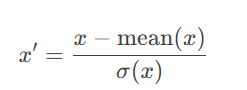
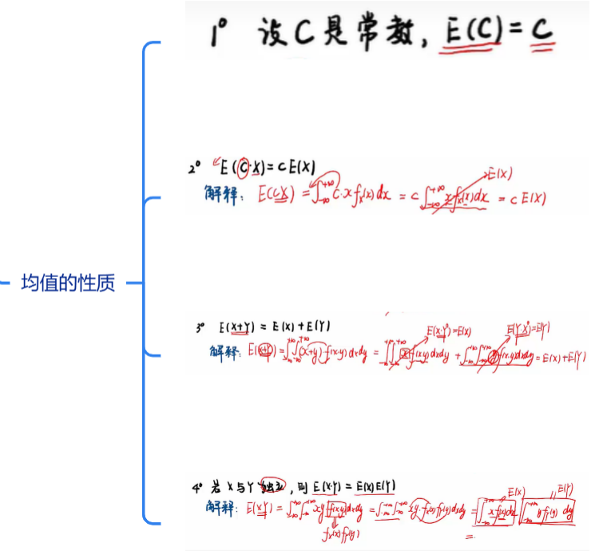
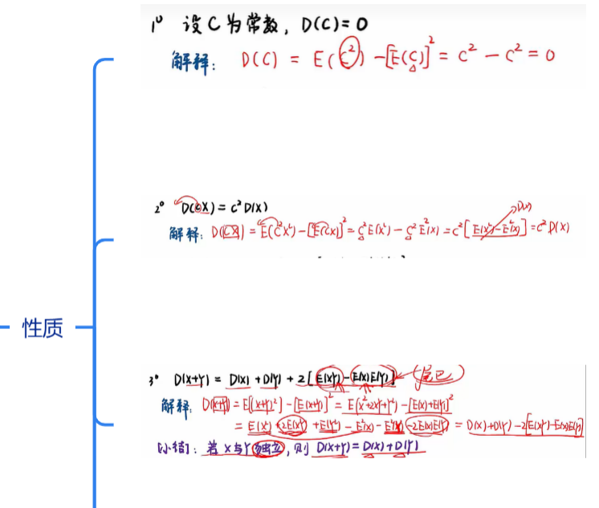
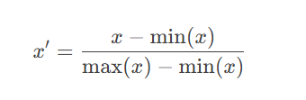
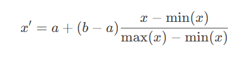
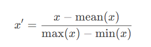

[标准化、归一化概念梳理（附代码）_数据的归一化和标准化代码-CSDN博客](https://blog.csdn.net/wxc971231/article/details/122735356)

## 标准化

mean(x)是x的均值，下面的是标准差

这种操作将 所有样本调整到均值为0，方差标准差为1。  

由均值性质和方差性质可推到此式子成立。

并不是所有分布 标准化后 得到的都是 标准正态分布norm(0,1)。

## 归一化

### mix-max normalization

这可以将所有的数值压缩到**[0,1]范围**，

**消除量纲影响，同时保持样本间相对距离**

推广到指定[a,b]范围:

### mean normalization

把**所有样本移动到0附近**,消除量纲影响,并保持样本间相对距离