# 研一

## 总纲

1. **到浙大来做什么？**

   

锻炼**身体**

发表**论文**一篇ccfa 

**lc** 2000、  英语听力看美剧

**思考**认识world


2.**将来毕业后要做什么样的人？**


全面的认识、理智的分析、冷静的判断、坚决的执行。


> 慢就是快
>
> 有所领悟的质 比 走马观花的量 更重要
>
> 可以先试着做3分钟，不想做了就停
>
> 不要用战术的勤奋 掩盖 战略的懒惰！！！
>
> 


$\textcolor{blue}{这里输入你要改变颜色的文字}$

<font color='blue'>123</font>

## 9.16总结

1. 收集 只有一条comment的数据（只有一条然后发生了变更，所以证明是对的） （思路打开，多找几个师兄要github  restful api的token）

2. 基于 人工数据分析（同门务必充分互帮互助），  要几个agent， security是否必要
3. 各个分类agent涉及的方面，prompt的各个方面需要有 文献 支撑

4. dfs树搜索应该是 每个reviewer agent自己动态搜索的，不必要引入graph_controller动态构建一个上下文

5. 主要创新点在于dfs callee tree search

## 需要在各个会议综述下该领域论文


**The code review comprehension assessment for large language models.**


**CRScore: Grounding Automated Evaluation of Code Review Comments in Code Claims and Smells**


**CRScore++: Reinforcement Learning with Verifiable Tool and AI Feedback for Code Review**


**Combining Large Language Models with Static Analyzers for Code Review Generation**


Can llms replace human evaluators? an empirical study of llm-as-a-judge in software engineering.


Stepcoder: Improve code generation with reinforcement learning from compiler feedback.


**What makes a code review useful to opendev developers? an empirical investigation.**


**Automating patch set generation from code reviews using large language models.**


**Fine-tuning large language models to improve accuracy and comprehensibility of automated code review.**


**Ai-powered code review with llms: Early results.**


## 论文：CRScore++

CRScore++: Reinforcement Learning with Verifiable Tool and AI Feedback for Code Review


cmu、25 arxiv


### abstract

​	在**`code review comment generation`**任务上， rl 面临 **`其非结构化feedback`** 的挑战。 **rl有两种主要技术：RL with Verified Feedback和 RL with AI Feedback**。 对结构化任务（如code generation），RLVR提供可信赖的feedback，而对于非结构化任务，RLAIF有一定成效，但却是主观的。

​	本文提出$\textcolor{blue}{RL框架}$**`CRScore++`**来缩小这个gap，**同时利用 llm的主观信号 和 verified信号 训练**。CRScore++拓展了**`CRScore`**，将这些信号作为training reward。

> **CRScore** 是 一个**将 LLM 与 linter 和 Code Smell Detector 等验证器集成在一起的代码审查评估指标**

​	本文$\textcolor{blue}{实验}$展示 CRScore++ 通过**`将 sft以及一个teacher model的RL critique结合`** 来**`提升weaker student model`**。


### Intro


​	近年来，llm在se方面应用广泛， 这种主流趋势部分可归因于rl的进展，特别是那些使用verified rewards的work，例如：execution feedback。**虽然这些学习信号在结构化输出（如code generation）上证实有效，但是非结构化输出（例如code review）仍然充满挑战。**

​	对于nlg任务，研究人员主要依赖于 用高质量数据进行sft、然后RLHF以及RLAIF做scalability。RLVR既verifiable又scalable、而**RLAIF依赖于更主观的signals（将在模型中引入意外偏差）**。当然，$\textcolor{blue}{这些偏见有些是有价值的}$,目前许多使用llm作为evaluators（RLAIF工作的一种）的work中，*llm与human evaluators评估分数与分布高度一致。*

​	由于文本输出的开放性，将RLVR应用到code review是非常困难的。因此，最近的work探索了在$\textcolor{YellowGreen}{推理或生成时将llm与verifiable static analusis工具结合}$的道路。（包括linters和code smell detector）。在此基础上，本文进一步$\textcolor{red}{使用verifiers进行训练（将static analysis tools以及subjective llm feedback相结合）}$。称为CRScore++框架。

​	我们的框架由两个阶段组成：（1）从演示中学习（SFT）和（2）从批评中学习（偏好优化或PO），这两个阶段都将验证者verifier生成的“事实”纳入逐步推理中。(1)在sft阶段，一个strong teacher model使用cot、将相关linter消息、code smell结合、然后生成**code review demonstration**。这建立在最近的研究结果之上，这些研究表明$\textcolor{yellowgreen}{结合外部工具可以增强长 CoT 模型的推理能力}$。(2)在PO阶段，教师模型通过首先生成预期的review point列表（CRScore生成的伪参考）、然后合并工具输出，然后应用 CoT 推理来评估这些问题是否得到解决来 critique 学生模型的review comment.

​	根据已有的研究结果，在 SFT 和 PO 阶段使用相同的教师模型∗。除了**使用工具中可验证的事实来建立 RLAIF 之外，我们的框架还通过 CoT 推理间接训练模型来检测代码气味和 linter 相关问题。**

​	方法的一个关键优势是其卓越的跨语言泛化能力。尽管在训练期间没有接触过这些语言，但专门在 Python 代码上训练的模型在生成 Java 和 JavaScript 的评论时实现了几乎相同的性能。这一结果挑战了普遍的假设，即特定语言的训练数据对于高质量的代码审查系统至关重要。

​	工作做出了三个主要贡献：

​	1.引入一种用于训练代码模型的新型 RL 方法，该方法结合了 RLVR 的优势和 RLAIF 的灵活性。

​	2.应用此框架集成 linter、代码气味检测器和安全分析器来 为代码模型训练 **衡量审查review质量**

​	3.通过分步推理 实现 代码气味检测、代码效率评估以及安全性、可读性和可维护性评估等技能的**通用学习**。

​	4.展示代码质量分析能力的稳健跨语言泛化能力。在审查 Java 和 JavaScript 代码时，专门在 Python 数据上训练的模型可以保持大部分性能，而无需进行任何特定于语言的微调。


### Conclusion

​	本文介绍了CRScore++，一个在nl code review generation领域成功缩减 verifiable rewards和ai feedback之间差距的框架。该方法表明在缺乏完美验证的领域，将llm judge与static analysis tool结合在一起能够提供llm输出质量。

​	通过仔细评估，CRScore++有三个显著提升：

​	（1）代码审查质量，3B 模型的comprehensiveness相对提高 56%， 相比较zero-shot的baseline相关性相对提升42%

​	（2）内在code smell、code quality 分析能力的涌现

​	（3）跨编程语言的通用性，Python训练的模型能够为Java和Javascript生成高质量的评论。还可以泛化代码气味和代码质量分析等能力，而无需明确训练。

​	我们的研究结果强调了两阶段培训方法的重要性，首先通过对工具增强演示进行监督微调来建立基础知识，然后进行偏好优化以提高关键质量方面。**`直接在human review上训练的模型表现比未经训练的基础llm更差，这一事实表明将客观质量指标纳入训练中的重要性。`**此外，in-domain language和out-of-domain language之间的性能差距很小，这表明我们的方法使llm具备了基本的代码质量分析技能，从而实现了跨语言泛化。

### Related Work

#### code review automation

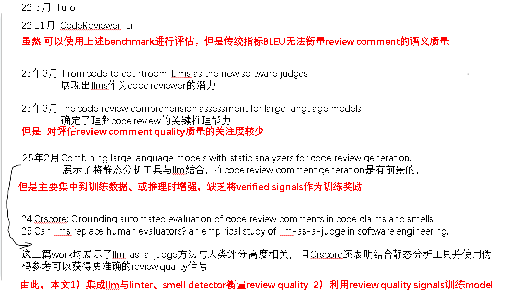


#### static analysis intergration

静态分析工具为code quality提供结构化的信号，通过检测code smell和强制style、maintainability标准。$\textcolor{blue}{早期集成工作主要在post-generation}$，最近研究逐渐深入。Jaoua等人 系统的将静态分析tools引入llm的多个阶段，包括数据增强、rag生成、naive output concatenation， 从而展示了混合策略能够提升reveiw relevance以及coverage。

​	但是，他们的评估主要依赖于llm作为评判的相对比较。而CRScore使用pseudo-references，更易拓展和符合人类偏好。此外**`进一步引入code smell detectors`**，并将**`smell detectors和linters集成进模型的推理阶段`**。 这也额外**导致tool-based knowledge的学习**，单语言更易泛化到多语言。

​	Feng 等人25年的work：ReTool，通过表明对工具反馈的强化学习可以增强策略推理和工具利用，进一步激励了我们的方法论。我们通过**将工具信号直接集成到训练的演示和偏好优化阶段来扩展这些想法**，使我们的**模型能够利用静态分析反馈进行评论生成和跨语言泛化**。


### 方法

详细阐述 将**`code review generation与可验证的静态分析信号对齐`** 的 三阶段方法：

（1） 工具增强知识蒸馏

（2） 直接偏好优化

（3） 对域内和域外编程语言 的 跨语言评估


> training workflow
>
> 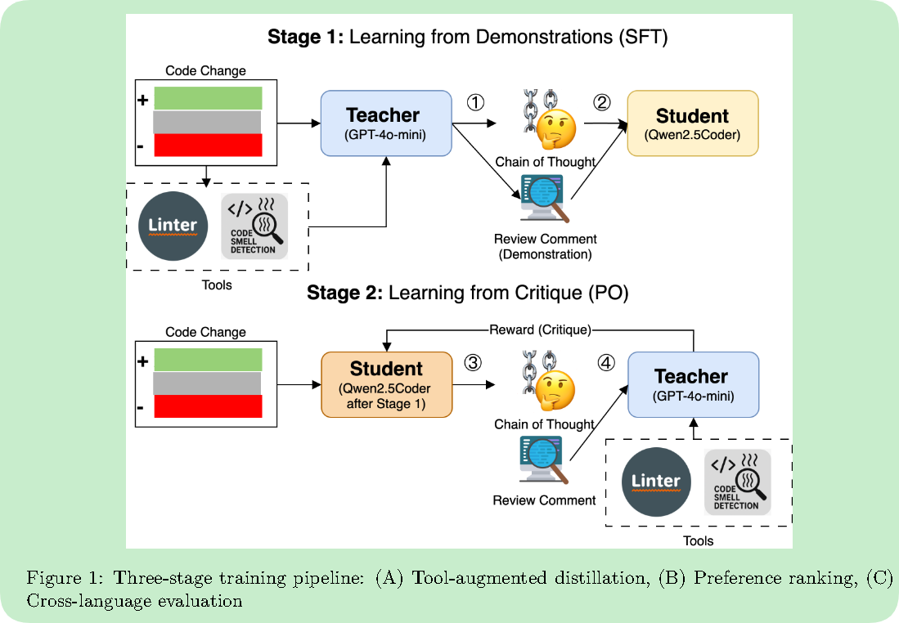


> evaluation framework
>
> 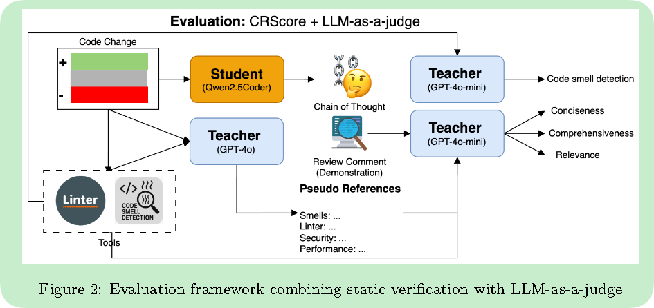


####  Knowledge Distillation via Demonstration

使用结合static analysis feedback的structured prompts来

将 GPT-4o Mini’s  code review capabilities 蒸馏到 Qwen2.5-CoderInstruct  models (3B and 7B models) 。

>systemt prompt
>
>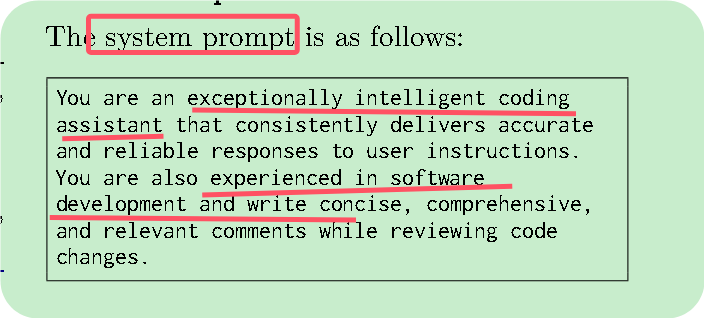
>
>task-specific, final review comment generation with step by step analysis prompt
>
>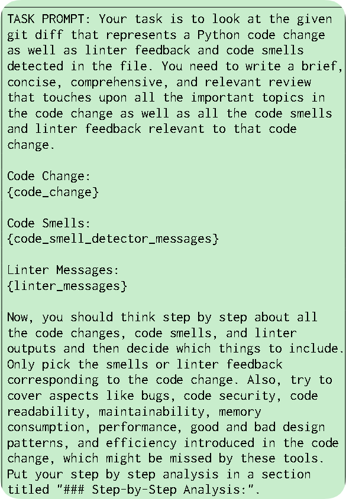
>
>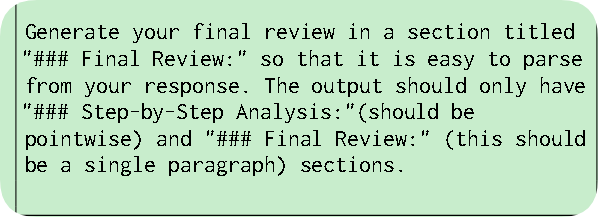


​	使用数据集为CodeReviewer dataset，对于该数据集中的每一个python code change，使用 **Ruff**† 生成 linter 反馈，以识别代码效率问题、复杂性测量和安全漏洞，并使用 **Pyscent**‡ 检测模式来检测代码气味，诸如Long Method and Large Class等。

​	具体来说，教师模型通过结构化提示(如下)处理这些输入，逐步分析，结合这些代码气味和 linter 反馈信号 进行concise review生成。如图 1（第 1 阶段）所示，该阶段将code change与工具输出相结合，以方便教师模型生成高质量的演示。

> 结构化提示
>
> 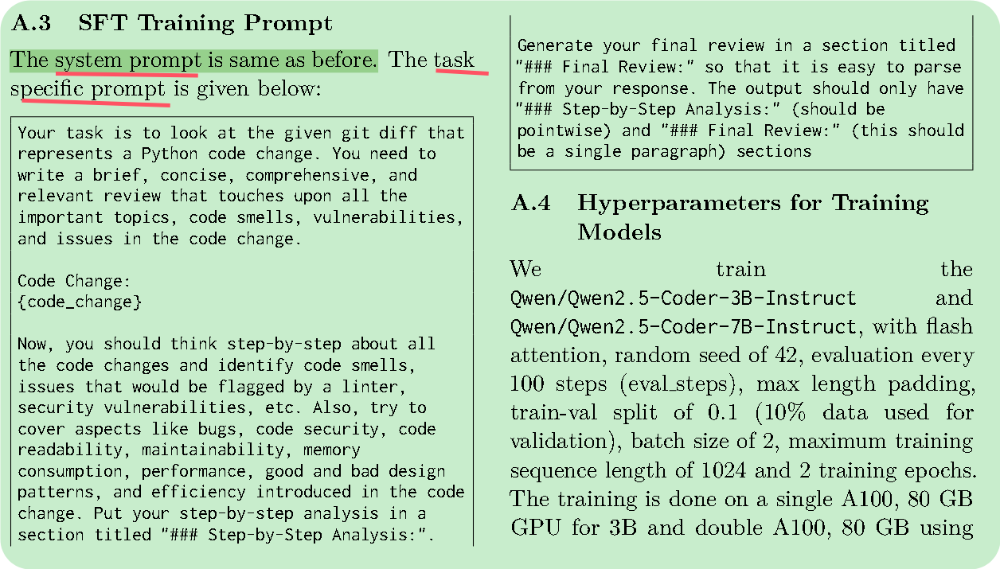

​	最后，我们使用 Adam优化器，在 2 个 NVIDIA A100 80GB GPU 上使用 20,888 个 Python 样本训练学生模型2个epoch，使用标准交叉熵损失，学习率为 2e-05。


#### Direct Preference Optimization

​	在训练pipeline的第二阶段，如图 1（第 2 阶段）所示，我们通过**`使用 SFT 模型对5,000 个 Python code change 每个采样 20 个候选评论`**，然后进行偏好学习来增强一致性。具体来说，**`让gpt-4o-mini对这个candidates逐步分析并最终生成review评分`**。（**评分标准涵盖comprehensiveness、conciseness、relevance、5分**）。然后，**`创建 ∆score ≥ 2 的偏好对（yw、yl）`**，用于 DPO 模型的对齐训练。

> 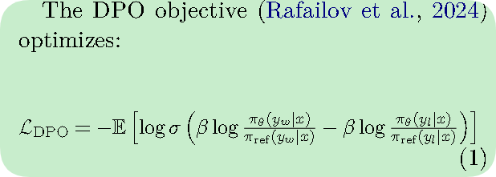

​	$\beta$=0.1,平衡了偏好选择与正则。使用adam训练了2个epoch、学习率为2e-5。

### Cross-language Evaluation

​	如图 2 所示,通过使用CodeReviewer 数据集中的测试集中的python、Java和 JavaScript code change来测试generalization，并**使用相应的特定编程语言的工具进行评估**。

​	对于 Java 代码补丁分析，我们使用 **PMD§** 作为静态代码分析工具，并使用 **DesigniteJava** 来检测代码气味。我们将 **PMD** 与 **JSNOSE**一起使用，开发了一种经过调整的分析器，用于检测 JavaScript 的代码气味。它能够分析JavaScript 中的文件是否存在 linter 冲突和代码气味。

​	用于评估的框架是一个两个阶段的过程。**`首先，GPT-4o Mini 创建了一个完整的主题列表，这些主题被认为对于评估模型对代码所做的更改至关重要`**。系统会提示模型识别关键主题，例如代码气味、linter 警告、安全漏洞、兼容性问题、可读性问题、性能影响、设计模式和内存相关问题。该过程创建**`伪事实pseudo ground-truth`**，用于评估模型生成的评论。

​	在第二步中，我们**训练的模型（SFT 和 SFT+DPO）为所有测试样例生成逐步分析和最终审查**。然后**将最终审查与伪主题的基本事实、代码更改以及工具提供的反馈进行比较，并由 GPT-4o-Mini 进行评估。**其中 rating prompt要求一个全面审查，判别是否所有要求的topic已经被包含，并且进行三方面的评分。

​		comprehensiveness： 这个review是否覆盖所有相关 subjects

​		conciseness：是否合适地简练

​		relevance：问题与代码变更的相关程度

​	LLM-as-a-judge 框架允许跨不同语言进行一致的审查，尽管它们的静态工具链存在差异

​	在跨语言泛化分析中，我们比较了仅使用 Python 实例训练的模型在评估 Java 和 JavaScript 代码更改时的表现。***该评估平定了模型跨语言边界传递有关代码质量原则的知识的能力。***与以前的方法不同，例**如 Jaoua 等人（2025c）的方法，它主要使用数据增强技术 （DAT） 在同一语言中进行训练和评估**，<font color='blue'>我们的方法专门测试在训练过程中从 Python 静态分析器学到的有关良好编码实践、安全漏洞和代码气味的隐含知识是否可以在推理时有效地应用于完全不同的编程语言，而无需额外的特定于语言的微调。</font>

### Result

#### In-Domain Performance

​	表 1 给出了 Python 代码更改的code review generation评估结果。我们观察到，使用我们的 CRScore++ 方法训练的模型在全面性和相关性指标方面明显优于所有基线配置。 从zero shot到stage1、stage2的效果增强展示出方法在3b、7b模型上均有提升。**`值得注意的是，在没有我们方法的情况下直接在 CodeReviewer 数据上训练的模型的性能甚至比零样本配置还要差。`**全面性/相关性和简洁性之间出现了明显的权衡，因为经过 DPO 训练的模型以牺牲简洁性为代价生成更彻底的评论。7B 通常优于 3B ，第 2 阶段 7B model在所有配置中取得了最高的全面性和相关性得分。

> 表1
>
> 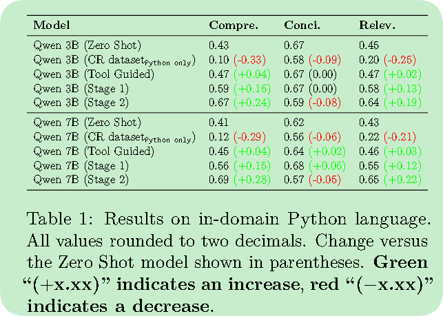

#### Cross-Language Generalization

​	表 2 所示的 Java 和 JavaScript 代码审查生成结果显示，尽管仅在 Python 数据上进行训练，但仍具有很强的泛化能力。

> 表2
>
> 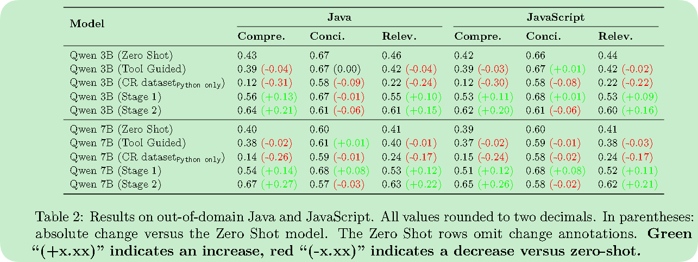

​	SFT 和 DPO 模型在不同语言之间保持相似的性能模式，第 2 阶段模型始终在所有语言中实现最高的全面性和相关性分数。这种强大的跨语言传输尤其值得注意，因为它没有任何特定于语言的微调，这表明我们的方法捕获了基本的代码质量原则，而不是特定于语言的模式。***不同方法的相对性能排名在不同语言之间保持一致，这表明我们的训练方法的好处有效地转移到了看不见的编程语言中。***~~我们观察到，对于我们的 CRScore++ 模型，域内 （Python） 和域外 （Java/JavaScript） 之间的性能差距很小，而零样本方法的差距更为明显。~~


#### Tool Utilization Analysis

> llm检查的prompt
>
> 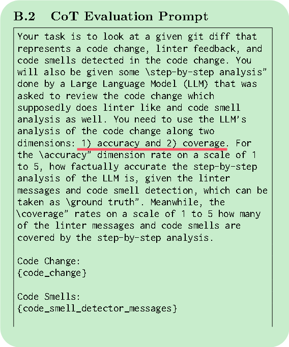
>
> 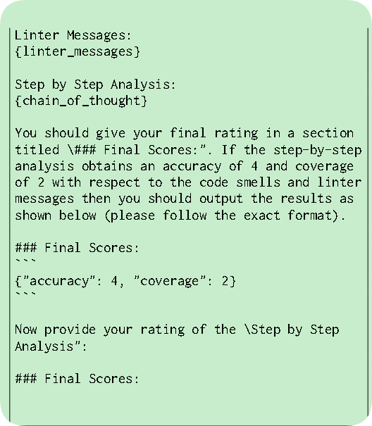


​	表 3 检查了模型如何有效地使用结构化提示来整合来自静态分析工具的反馈


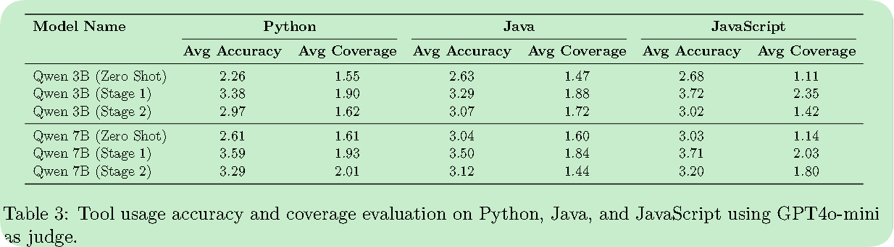

​	我们观察到，准确性分数在不同配置中保持相对稳定，这表明模型在引用工具输出时保持事实正确性。然而，覆盖率得分显示，从零使用工具到SFT和DPO阶段有显著改善，表明我们的训练方法有助于模型更好地利用可用的工具反馈。3B DPO模型的覆盖率得分最高，表明较小的模型可以通过我们的训练方法有效地学习合并工具信号。尽管 7B 模型在 SFT 阶段表现出略高的准确性，但模型大小之间的性能差异在工具利用率方面不如整体审查质量指标明显。


## 更改数据收集方法


池化收集加速

```python
import time
import requests
from typing import List
import threading
import concurrent.futures
class TokenInfo:
    def __init__(self, token: str):
        self.token = token
        self.remaining = 5000
        self.reset_ts = int(time.time()) + 3600  # 默认 1 小时后重置

    def update_from_headers(self, headers):

        self.remaining = int(headers.get("X-RateLimit-Remaining", self.remaining))
        self.reset_ts = int(headers.get("X-RateLimit-Reset", self.reset_ts))
        print(f"[TokenUpdata] token { self.token } 可用，remaining: {self.remaining}, reset_ts: {self.reset_ts}")

class TokenPool:
    def __init__(self, tokens: List[str]):
        if not tokens:
            raise ValueError("Token list must not be empty")
        self.tokens = [TokenInfo(t) for t in tokens]
        self.index = 0
        self.lock = threading.Lock()  # 用于保护 index 和 token 状态

    def get_next_token(self) -> TokenInfo:
        """轮询获取 token"""
        while True:
            with self.lock:
                start_idx = self.index
                n = len(self.tokens)
                while True:
                    token = self.tokens[self.index]
                    self.index = (self.index + 1) % n
                    now = int(time.time())
                    if token.remaining > 0 or token.reset_ts <= now:
                        print(f"[RateLimit] token { token.token } 可用，remaining: {token.remaining}, reset_ts: {token.reset_ts}")
                        return token
                    # 如果 token 用尽，尝试下一个 token
                    if self.index == start_idx:
                        # 所有 token 都用尽，等待最早可用的
                        wait = min(t.reset_ts for t in self.tokens) - now
                        if wait > 0:
                            print(f"[RateLimit] 所有 token 用尽，等待 {wait}s...")
                            break
            # 释放锁后再等待，避免阻塞其他线程            
            time.sleep(wait + 0.1)

    def request(self, url: str, method: str = "GET", **kwargs):
        token = self.get_next_token()
        headers = kwargs.pop("headers", {})
        headers["Authorization"] = f"token {token.token}"
        resp = requests.request(method, url, headers=headers, **kwargs)
        resp.raise_for_status()
        with self.lock:
            token.update_from_headers(resp.headers)
        return resp

```


只保留一个comment的有效数据

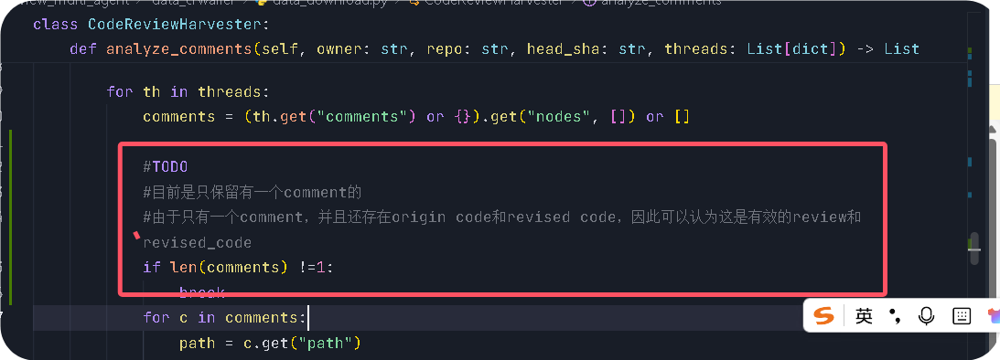


然后重新开始

#### result

python data_crwaller/data_download.py harvest-top dataset/crwalling_23_repo --top-n 2 --top-n-start 1 --since 2023-01-01T00:00:00Z  > data_crwaller/data_download1_2.log 2>&1


爬了github language:python 的前10 star 项目，共计

cnt: 4882   条 

但其实只有5个project有具体内容

AUTOMATIC1111-stable-diffusion-webui

huggingface-transformers

Significant-Gravitas-AutoGPT

TheAlgorithms-Python

ytdl-org-youtube-dl

数据格式：  <origin_code, code_diff_change, review_comment,revised_code>

review_comment只有一条


## 论文 combine static analyzers

Combining Large Language Models with Static  Analyzers for Code Review Generation

Universit ́e de Montr ́eal 蒙特利尔大学 加拿大  Houari Sahraoui


Anonymous, “Datasets and results,” 2024. [Online]. Available: https://zenodo.org/records/14061110

“Replication package,” https://github.com/ImenJaoua/ Hybrid-Code-Review.

### abstact


​	在软件开发时，code reveiw是重要但通常复杂、主观并且耗时的活动。过去数十年间，大量工作都尝试自动化该过程。<font color='yellowgreen'>早期研究聚焦于 基于知识的系统 （KBS）</font>，用基于规则的匹配机制来检测code issue，该方法可以提供准确的反馈、但对于复杂的、依赖上下文的场景无能为力。 <font color='yellowgreen'>最近的工作多为 微调pretrain-llm</font>,该方法能够发现更广阔的问题，覆盖率高但是通常缺乏精确度。

​	<font color='red'>本文提出一种混合方法，结合KBS和 learning systems来生成高质量的、全面的code reviews</font>。<font color='blue'>该方法将 知识 分别集成到语言模型的三个不同阶段： 准备数据时进行数据增强训练、推理时进行RAG、推理后 进行 Naive concatenation</font>。

​	在一个real-world 数据集上 实证评估该混合方法、单独的KBS、LBS方法后，结果显示混合策略可以增强review comment的相关性、完整性和整体质量， 有效减小了rule-based方法和dl model之间的差距。


### Intro

​	code review是一项常见软件开发实践，在维护代码质量、识别bug和形成持续优化的团队文化起重要作用。通过严格的检查code change，reviewers提供提升软件的有价值的反馈、无论在将代码结合进系统前后。现代code review不仅仅是 缺陷检测， 它旨在增强software change的整体质量：包括可维护性、可读性、以及达到best practices。

​	然而，代码审查过程通常被认为复杂、耗时，并且存在各种主观偏见，尤其是在大型项目中。诸如开发人员专业知识水平的不同、人员动态变化、缺乏标准化指南等因素 可能会引入不一致，从而最终影响代码库的效率和稳健性。更多的、coding standards和best practices不断进化的本质属性也要求不断适应，使得review的过程更加复杂。

​	为了应对这些挑战，人们对自动化代码审查过程越来越感兴趣。最初的工作主要涉及基于知识的系统 （KBS） 的部署，特别是 <font color='red'>**PMD、FindBugs 和 SonarQube**</font> 等静态分析工具。***这些工具使用预定义的规则集来识别常见的编码问题，系统地扫描代码库是否存在违规行为，并通过标记代码中的规则违规来改进开发的早期阶段*。**尽管**静态分析器**可以有效检测表面问题，但**它们受到对手动定义规则的依赖的限制，这些规则需要频繁更新才能保持相关性**。<font color='blue'>它们的僵化使得处理复杂的、依赖于上下文的问题变得困难，这些问题需要更深入地了解代码意图。</font>因此，这些工具往往无法适应软件项目的动态和上下文敏感性，其中架构、团队文化和特定项目要求等因素需要更灵活和智能的解决方案。

​	大型语言模型和自然语言处理的最新进展激发了人们对使用预训练语言模型自动化代码审查工作流程的浓厚兴趣。***这些基于学习的系统 （LBS） 旨在通过提供对`代码更细致的理解`来克服基于知识的检测的局限性，使它们能够识别更深层次的故障，提出改进建议，甚至预测代码更改对整个系统的潜在影响.***尽管这些模型比单独的静态分析捕获了更广泛的问题模式，但它们的精度仍低于可接受的水平。

​	*正如软件开发任务自动化中常见的那样，一些解决方案实现了高精度，但覆盖范围有限，而另一些解决方案则以牺牲精度为代价提供更广泛的覆盖范围。*因此，**最有前途的方法是通过组合解决方案来优化精度和覆盖范围来平衡这些权衡**。我们假设将静态分析与基于学习的系统集成可以提高自动代码审查生成工具的有效性。**`在本文中，我们探索了三种组合策略，旨在将静态分析的结构化知识集成到构建和运行用于代码审查生成的大型语言模型（LLM）的pipeline中`**。具体来说，我们的方法将知识整合到pipeline的三个不同阶段：*在微调数据准备期间（数据增强训练，DAT）、推理时（检索生成，RAG）和推理后（输出的朴素串联，NCO）。*

​	为了评估这些策略，我们结合使用了人类判断和基于 LLM 的评估，将每种方法生成的评论与基线系统（独立的 KBS 和 LBS）进行比较。我们的结果表明，<u>**`结合 KBS 和 LBS 可以抓住两者的优势：静态分析的精确性和 LLM 的全面性，从而实现更有效和更像人类的代码审查。`**</u>


### PROPOSED APPROACH

#### Overview

​	对于审查评论生成的任务，基于知识的系统 （KBS） 利用编纂的规则和专业知识来提供符合既定编码标准和最佳实践的反馈。*静态分析器是 KBS 的一个突出示例，它系统地遵循预定义的指南来检测代码问题，提供可靠且结构化的反馈。* **虽然 KBS 实现了高精度，但它们的范围有限，仅涵盖代码更改过程中可能遇到的问题的子集**。相比之下，基*于学习的系统 （LBS） 利用语言模型的自适应潜力，通过对历史数据进行训练，语言模型可以识别复杂的模式并生成与上下文相关的review comment*。**这种适应性使 LBS 能够涵盖数据集中存在的更广泛的问题，但通常以牺牲精度为代价**。在这项工作中，我们推测，通过结合这两种策略，可以实现两种方法的优点，即更广泛的问题覆盖范围和更高的精度。

> 图 1 说明了我们的方法，概述了结合基于知识的系统 （KBS） 和基于学习的系统 （LBS） 以增强代码审查自动化的三种策略。
>
> 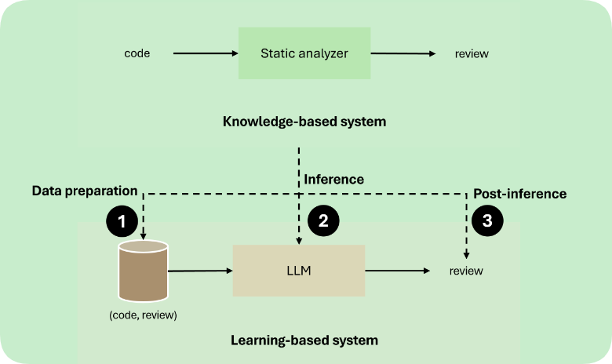

​	这些策略在 LBS pipeline的不同阶段利用 KBS 见解，特别是在数据准备、推理和最终输出期间。这三种策略如下：

​	1.Data-Augmented Training (DAT):在该策略中，我们通过**使用 KBS 和 LBS 生成的合成数据增强真实世界的数据集来增强训练数据集**。然后，**这个丰富的数据集被用来微调语言模型，使 LBS 能够整合数据驱动的模式和基于规则的知识。**这种组合有助于模型更全面地了解代码审查模式，从而提高各种审查场景中的鲁棒性

​	2.Retrieval-Augmented Generation (RAG):在这里，KBS 见解直接集成到 LBS 推理过程中。通过RAG，从KBS中动态检索相关信息（即静态分析结果），并在生成过程中注入到提示中。**通过将 KBS 的结果纳入指令中，LBS 将其响应与既定的编码标准和实践保持一致，提供基于结构化、基于规则的知识的反馈。**

​	3.Naive Concatenation of Outputs (NCO):该策略**合并了 KBS 和 LBS 在推理后生成的反馈，将它们的输出组合起来，产生统一的代码审查**。通过将 KBS 基于规则的精确性与 LBS 的上下文深度相结合，NCO 提供了涵盖更广泛的潜在问题的全面审查。

​	这些策略使 LBS 能够从 KBS 的结构化、基于规则的见解中受益，从而增强其生成准确、上下文适当且符合标准的代码审查注释的能力。


#### Baseline Model Preparation and Static Analyzers Selection

> 数据集： 用的22年微软亚研的   CodeReviewer的

​	虽然我们的方法适用于广泛的llm和静态分析工具，但我们提出了一种特定的配置来说明这三种策略，并建立验证我们的猜想的基线。为了设置基线系统，我们首先定义了 LBS。我们微调了一个大型语言模型，使用的是一个广泛数据集(**`CodeReviewer的`**)称为$D_{Mi}$，它将code change与detailed reviews配对。

​	选择的用于微调的模型是 **`CodeLlama-7b`**，它经过训练，用于comment generation（即，从code change生成review comment），具有以下超参数设置。该训练在**四个 NVIDIA RTX 3090 GPU** 上进行，**每个设备的批量大小为 4** 个。为了提高效率，我们应用了**步长为 4 的梯度累积**，仅在多批次后更新优化器。我们使用 **4 位量化**来提高内存和计算效率。此外，我们还采用了量化低秩适应（**QLoRA**），这是一种参数高效微调（PEFT）技术**，r = 16，α = 32，dropout = 0.05。**该方法将权重更新分解为低秩矩阵，减少微调所需的参数并优化训练效率。

​	这产生了一个模型，表示为 Mi，能够生成详细的human-like code reviews。由于 Mi 代表 LBS 组件，并且是使用 DMi 的数据进行训练的，因此我们使用**测试集通过静态分析器和微调模型 Mi 生成review 评论**。

​	为了专注于可用静态分析器的相关子集，我们过滤了测试集以仅包含 <font color='blue'>**Java 代码**</font>样本，生成了 27， 267 个条目的子集，表示为 Do. Do 中的每个条目都是一个元组 （f， c），其中 f 表示源代码文件，c 表示代码更改。**这里，c 是 LBS 的输入，而 f 是 KBS 的输入。**我们将静态分析器的选择限制在直接处理 Java 源代码的工具上。尽管此决定不包括为 Java 字节码分析设计的工具，但它允许更广泛的问题类型。具体来说，我们选择了两个成熟的静态分析器：**`PMD 和 Checkstyle`** ，它们都旨在直接识别源代码中的潜在问题。

​	PMD 是一种静态代码分析工具，它通过应用一组旨在检测常见问题的规则来识别代码中的问题，这些规则分为八组：最佳实践、编码风格、设计、文档、易出错、多线程、性能和安全性。通过根据这些规则分析源代码，PMD 生成详细的报告，突出显示需要改进的领域，并使<font color='purple'>**用户能够为特定分析创建自定义规则**。</font>

​	Checkstyle 是另一个用于 Java 的静态代码分析工具，它为标准检查提供预定义的样式配置，包括 Google Java Style 和 Sun Java Style。其规则涵盖了注释、类设计、编码和命名约定等各个方面。Checkstyle <font color='purple'>**还支持根据用户需求定制的自定义配置文件**</font>.

#### Data Augmented Training

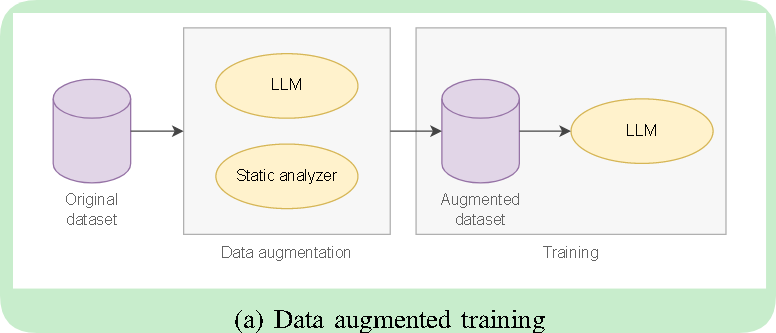

 	如图 2a 所示，该策略涉及使用增强数据集 Da 重新训练 LBS，其中包括由静态分析器和微调模型 Mi 生成的评论注释。通过这个重新训练过程，LBS 从两个数据源中学习，生成一个更精细的模型，称为 $M_{FT}$。

​	**扩充数据集的一种简单方法是将静态分析应用于 DMi 中的代码，并将生成的注释与现有注释添加或连接。然而，这种方法不能保证增强数据集中的数据质量，也无法解释 LBS Mi 推断的见解。**因此，我们采用集成学习方法，其中两个不同的来源（LBS 和 KBS）作为专家来生成用于微调模型的数据。基本原理是 KBS 和 LBS 评论本质上都是综合的。通过结合它们的输出，我们实现了更加平衡和一致的微调过程


> ​	为了生成增强数据集 Da，我们设计了一个两步过程（即数据生成和数据过滤），如图 3 所示。
>
> 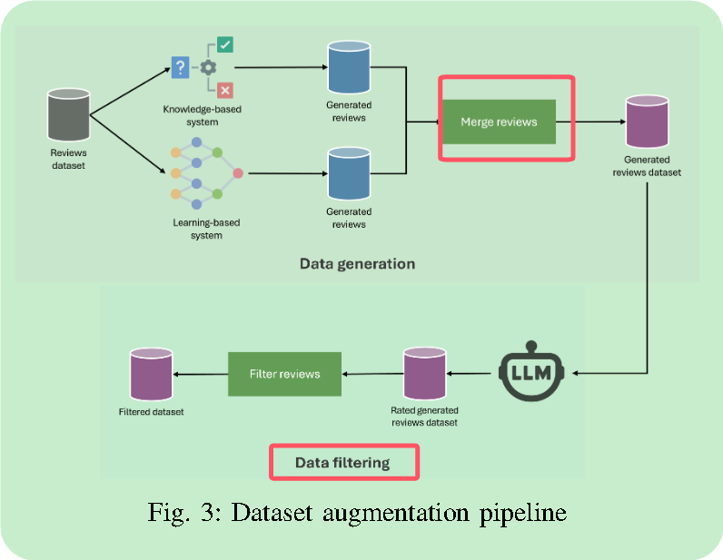

​	在数据生成阶段，我们使用原始数据集 Do 作为输入。对于每个代码更改 c，我们使用微调模型 Mi 生成四个上下文感知的、human-like评论。同时，将静态分析器规则应用于每个源代码 f 以产生结构化和精确的反馈。每个静态分析器都会生成一个报告，其中包含多个reviews，包括确定的每个问题的代码的开始和结束部分。

​	由于我们的方法侧重于代码更改，因此我们提取了每次审查中突出显示的代码部分，并在每个提取的片段之前和之后添加了几行上下文行。然后，我们将静态分析器和 Mi 生成的评论合并到一个统一的数据集中。数据集中的每个数据点由 **（f， c， r， t）** 形式的元组组成，**`其中 f 表示源代码文件，c 表示代码更改，r 表示评论注释，t 表示用于生成评论的方法（KBS 或 LBS）`**

​	数据生成后，我们**`应用系统的数据过滤步骤来评估和完善合并的数据集，确保每个源代码只保留最相关和最有意义的评论`**。虽然微调模型 Mi 可以生成上下文感知、类似人类的评论，**但其输出有时可能包含不相关或不太有意义的反馈**，特别是在处理复杂或模棱两可的代码更改时。同样，**静态分析仪虽然可靠，但可能会产生过载的误报，因此很难将重大问题与噪声区分开来。**因此，过滤 Mi 和静态分析器的评论对于维护高质量、有意义的反馈数据集至关重要。**此过滤过程涉及根据每条评论与相应代码的相关性对其进行评级**。评级提供了静态分析仪和 Mi 生成的评论质量的定量衡量标准。

>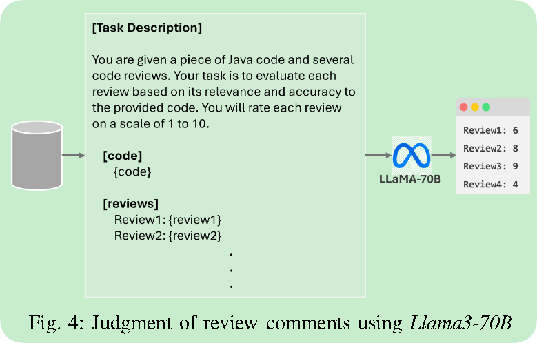

​	为了确保公平且可扩展的评级系统，我们利用了大型语言模型，这些模型在类似的评估任务中表现出了卓越的性能。通过使用这些模型，我们对每篇评论进行了更准确和一致的评估，提高了数据集的质量，使其成为微调的宝贵资源。如图 4 所示，我们使用 **Llama3-70b**，输入代码及其相应的评论。我们**指示模型以 10 分制对每条综述进行评分。阈值评分设置为 8，只有超过此阈值的评论才会保留在最终数据集中**。在筛选相关性和质量后，我们确保每个超过阈值的评论都被单独处理。

​	对于具有 n 条评论的源代码 f **（应该是source code file这里）**（r1...rn），我们生成了 n 个不同的数据点：< f、r1 >、< f、r2 >,..., < f、rn >。此外，对于每个注释，我们提取并包含与正在解决的问题相关的特定代码更改部分，然后将数据集构建为 < c1、r1 >、< c2、r2 >,..., < cn、rn >。

​	**为了防止特定规则的过度代表性，我们随机丢弃了与评论数量过多的规则相关的评论。**此外，为了保持数据集的平衡，我们*随机丢弃了基于学习的评论的子集，**确保基于知识的评论和基于学习的评论之间的平均分配。***

​	最终数据集 Da 由 **`78， 776 个样本`**组成，确保 KBS 和 LBS 方法生成的评论具有平等的代表性，如图 5 所示。它还确保所有 KBS 规则之间的平衡分布。

>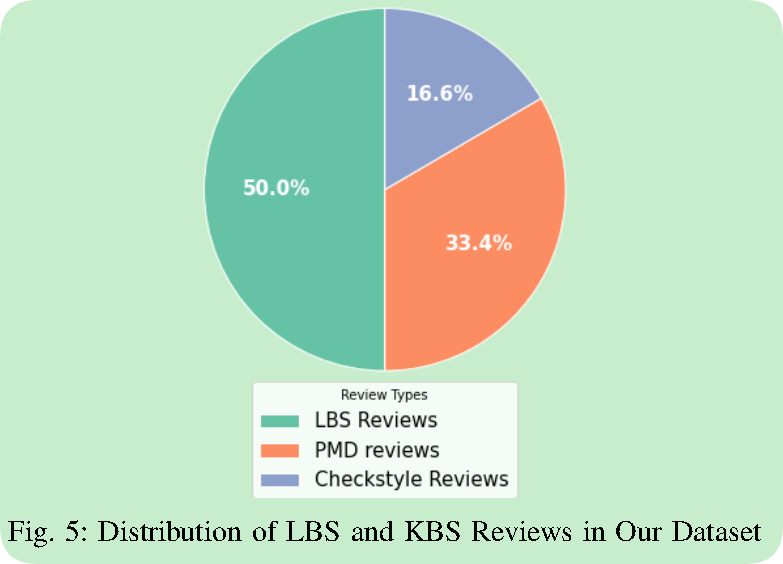

​	为了获得$M_{FT}$模型，我们将Da数据集划分为三个子集：80%的样本被分配到训练集，而其余20%被平均分配，其中10%用于验证，10%用于测试。每个子集都保持了 LBS 和 KBS 评论的平衡组合。然后，我们使用 QLoRA 微调了该数据集上的 CodeLlama-7b 模型，以优化内存效率.

#### Retrieval Augmented Generation

​	检索增强生成 （RAG） 是一种旨在通过在推理阶段将外部知识纳入其提示来增强语言模型生成能力的技术。在代码审查的上下文中，该策略可用于将 KBS 生成的反馈直接嵌入到基于语言的系统的提示中，如图 2b 所示。

> 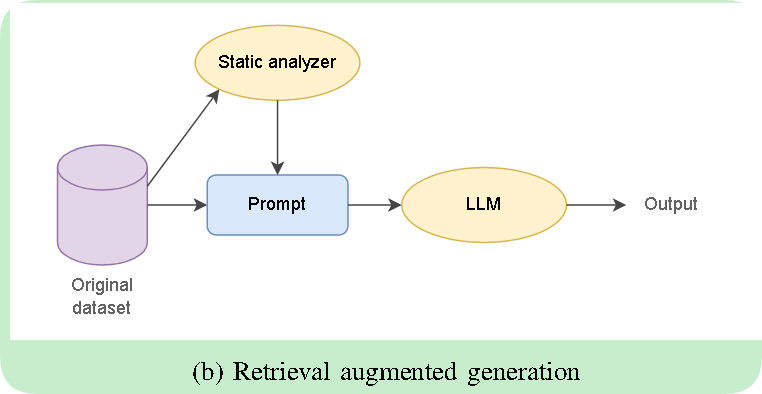

​	在我们的方法中，**微调模型 Mi 将 Da 数据集的代码更改以及 PMD 和 Checkstyle 的输出作为输入。**将 KBS 知识纳入提示可以指导模型生成更相关和更准确的评论。这种结合确保生成的评论既全面又符合上下文。 因此，生成的评论与既定的编码标准和最佳实践密切相关，从而提高了其整体质量。增强的提示如图 6 所示。

> 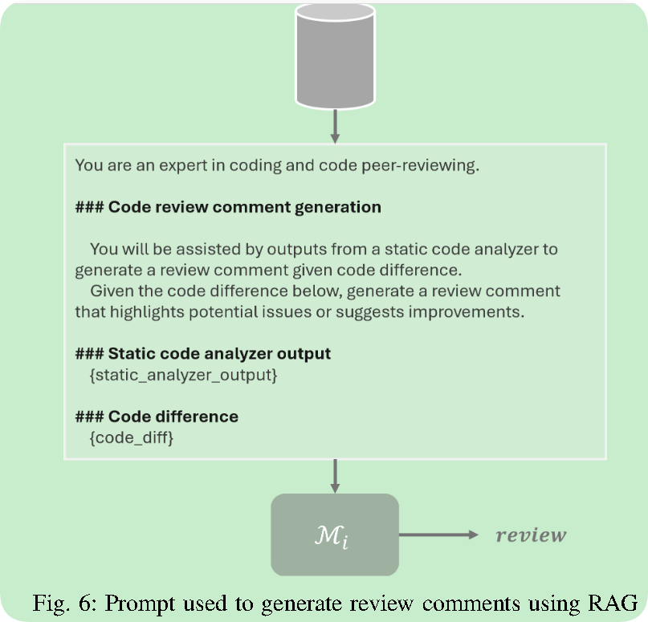

#### Naive Concatenation of Outputs

​	输出的朴素串联策略作为一种基线方法，**将 LBS 和 KBS 为同一代码分别生成的review comment组合成single review。**

> 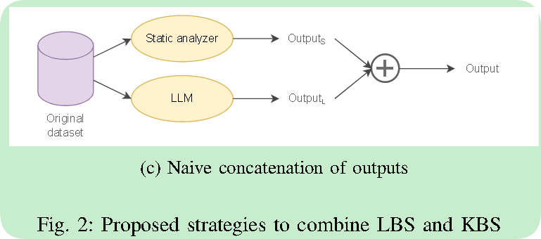

​	如图 2c 所示，**$M_i$生成的review comment直接与静态分析器（PMD 或 Checkstyle）的输出连接。**这种方法很简单，只需对推理流程进行最少的调整，同时确保最终审查提供来自两个系统的全面反馈。

### Evaluation

​	在本节中，我们首先定义指导我们研究的研究问题，然后详细描述实验设置。然后我们展示和解释结果。

#### Research Questions

​	我们评估的目标是确定与仅使用 LBS 或 KBS 相比，将知识整合到 LBS 中是否可以提高生成评论的准确性，同时保持足够的覆盖范围。为了构建我们的评估，我们定义了以下研究问题：

RQ1：**手动评估准确性**：与基线生成的评论相比，我们的混合方法生成的评论的准确性如何？ 

​	为了解决这个问题，我们对测试集的 10% 的样本进行了涉及两名reviewer的手动评估，将我们的混合方法生成的注释的准确性与微调的语言模型和静态分析器生成的注释的准确性进行了比较。

RQ2：**llm判断与人类评估的一致性（健全性检查）**：llm judge在多大程度上与人类评估保持一致？

​	考虑到测试集的大小和要评估的五种不同的注释生成选项，人工评估对于整个数据集来说是不切实际的。作为替代方案，我们使用llm对整个测试集进行评估。为了评估llm模仿人类判断的能力，我们复制了用于 RQ1 的手动评估程序，用llm代替人工审阅者，并测量llm与人类评估之间的一致性水平。

RQ3：**对生成的评论进行llm评估**：当由llm评估时，我们的混合方法生成的评论的准确性与基线生成的评论的准确性相比如何？

​	我们使用llm as judge的方法来评估生成的评论的准确性，将我们的混合方法的结果与基线的结果进行比较，特别是基于学习的模型和静态分析器。

RQ4：**基于覆盖率的review rank**：我们的混合方法在覆盖率方面与基线相比如何？

​	对于这个问题，我们使用llm as judge进行比较评估，根据**覆盖标准**对我们的方法和基线生成的review comment进行排名。


#### Experimental Setup

​	为了解决我们的研究问题，我们进行了一系列实验。为了能够跨不同的混合方法进行比较，我们使用了增强数据集 Da 中的测试集，确保微调模型 $M_{ft}$ 看不到所有条目。**由于检索增强生成和输出的朴素串联方法仅适用于同时具有 KBS 和 LBS 评论的代码更改**，因此我们过滤了测试集，以仅包含来自两个来源的评论的样本。如图 7 所示，我们检查了所选测试集中的代码更改，并在发现重叠时创建统一的代码差异以进行分析。例如，如果测试集包含具有 LBS reveiw comment r1 的代码差异 diff1 和具有 KBS review comment r2 的代码差异 diff2，则我们将两个代码差异合并为一个统一的差异 diffu，如图 7 所示，在测试集中形成一个新的三元组（diffu、r1、r2）。**在总共 7，884 个样本中，我们确定了 1，245 个常见的代码差异，其中包括 KBS 和 LBS 评论**

​	对于这些选定的代码更改中的每一个，我们生成了**`五种类型的评论`**：静态分析器评论、Mi 生成的评论、MFT 生成的评论、检索生成评论和朴素的串联评论。

​	**对于 RQ1，我们从 1，245 个测试集示例中随机选择 10% 进行以准确性为重点的手动评估**。所有评论都是匿名的，并以随机顺序呈现给评估者。这种方法最大限度地减少了确认偏差，防止评估者因每条评论的来源而无意识地偏爱某些方法。

​	两名评估员在代码审查方面都有很好的专业知识，他们通过**将审查分类为准确、部分准确或不准确**来评估每个示例。

​	*如果评论正确解决问题且没有任何错误或不相关信息，则该评论被认为是准确的。	如果评论中只有某些部分有效，其余部分不相关或不正确，则被视为部分准确。*

​	*最后，如果审查未能解决已确定的问题并且与上下文完全无关，则该审查被归类为不准确*

​	初步评估后，通过讨论确定并解决了一些冲突，从而就最终评估达成了共识。

​	

​	对于 RQ2，我们进行了健全性检查，以评估 LLM（特别是 **Llama3-70B**）可靠、准确地评估reveiw comment的能力。使用 RQ1 中相同的 10% 子集，我们要求 Llama3-70B 将每条评论分类为准确、部分准确或不准确。然后，我们通过计算 **Cohen 的 kappa** 来**测量人类评估者与 Llama3-70B 的评分之间的一致性**，Cohen 的 kappa 是一种量化分类数据的评分者间可靠性的统计度量。该分析提供了对llm与人类判断之间一致性的洞察，有助于验证llm在准确评估review comment方面的可靠性。

​	为了解决 RQ3，我们指示 Llama3-70B 评估 1，245 个样本的完整数据集中的代码更改，将每个review comment分为三类之一：准确、部分准确或不准确。

​	对于 RQ4，我们进行了比较评估，**根据生成的comment的覆盖范围对生成的review comment进行排名**，这衡量了较小的、经过微调的 LLM 检测各种代码问题的效率。**为了评估这一点，我们使用较大的 LLM Llama3-70B 作为参考点，假设它可以识别一组全面的问题。**目的是通过捕获尽可能多的这些问题来评估较小模型与该基准的一致性。排名过程反映了每个模型在识别编码问题方面的相对有效性，排名 1 分配给最全面的评论，排名 5 分配给最不全面的评论。

​	然后，我们分析了**胜负比**，**将我们提出的三种策略（DAT、RAG、NCO）与基线模型Mi 和静态分析器的性能进行了比较。**

​	*如果评论的排名比基线至少高两个级别，则记录为获胜，表明覆盖率明显优越，*

​	*而当评论排名至少低两个级别时，则记录为失败，反映出覆盖率明显较弱。*

​	*±1 级以内的排名被归类为平局，因为覆盖范围的差异被认为是很小的。*这种方法通过强调问题覆盖面的显着差异而不是微小的变化，确保了更有意义的评估

#### Results*

1） RQ1 的结果 - 审查准确性的手动评估：

​	图 8 中的手动评估结果揭示了各种代码审查生成方法之间的准确性差异。

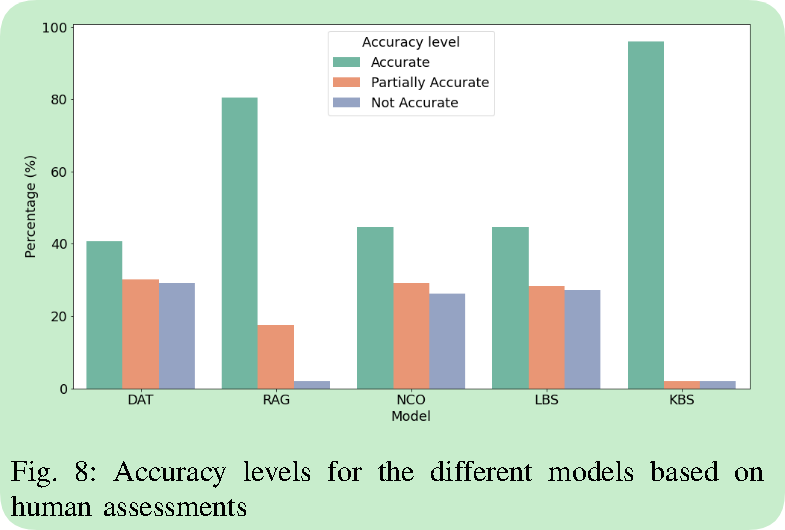

​	如预期的那样，**静态分析器（KBS）在生成准确评论方面始终表现出可靠性**，而LBS 模型 Mi 产生的评论准确度较低，导致部分准确或不准确反馈的比例更高。与基线系统（即 KBS 和 LBS）相比，我们的混合方法表现出不同的准确度水平。值得注意的是，RAG 方法在准确性方面明显优于 Mi。同时，通过数据增强训练（DAT）方法和串联方法（NCO）生成的微调模型$M_{ft}$达到了与Mi相似的精度水平。

​	针对 RQ1，我们得出结论，**使用 RAG 方法的 LLM 生成注释的准确度明显高于单独使用时**。**这种精度的提高是巨大的，尽管它仍然达不到静态分析仪所达到的精度。**我们**没有观察到其他两种组合方法的准确性有所提高**。

2） RQ2 的结果 - 手动评估和 LLM 评估之间的一致性：

​	使用 Cohen 的 kappa 测量人类评估员的评分与 Llama3-70B 提供的评分之间的一致性，**得分为 0.72**。该分数表明基本一致，凸显了llm将评论准确分类为“准确”、“部分准确”或“不准确”的能力。如此高水平的一致性表明，Llama3-70B 在评估代码审查质量时与人类评估密切相关，增强了其作为替代人类判断的可靠性。**此外，这种程度的一致性与类似研究的结果一致，进一步验证了其作为评估者的有效性。**

​	为了回答 RQ2，Llama370B 与人类评估之间的这种实质性一致性使我们能够自信地使用 LLM 作为整个测试集的评估者，评估准确性和覆盖率。鉴于观察到的一致性，我们相信该模型将在更广泛的数据集中提供一致且可靠的评估，从而在不影响质量的情况下实现高效且可扩展的评估。

3）RQ3 的结果 - LLM 评估评论准确性：

​	我们使用 Llama3-70B 作为评估器来评估**五种方法中**的每一种在包含 1，245 个样本的测试集上生成的review comment。每个示例都包含代码更改以及五条评论注释，每种方法一条。图 9 显示了该评估的结果。研究结果与 RQ1 中手动评估的结果一致。

>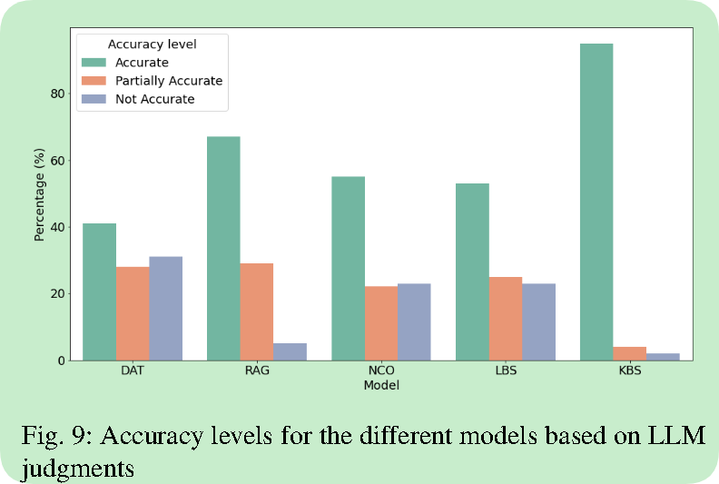

​	正如预期的那样，**静态分析器 （KBS） 在识别重复和直接编码问题方面具有确定性，因此保持了最高比例的准确审查**。同样，**检索增强生成 （RAG） 方法优于原始模型 Mi**，尽管准确性的提高略不如在较小的 RQ1 样本中观察到的明显。**朴素输出串联 （NCO） 方法实现了与 Mi 相当的准确性，展示了其产生可靠评论的能力**。相比之下，数据增强训练 （DAT） 方法在这些方法中产生了最低的准确率分数，但与NCO、Mi 水平仍然相同。

​	总之，RQ3 的答案是，与单独使用 LLM 相比，RAG 方法提供了最显着的准确性提高。其他组合方法，NCO 和 DAT，显示出与独立 LLM 模型相当的准确率水平，但没有显着的收益。


4） RQ4 的结果 - 使用 LLM 根据覆盖标准对评论进行排名：

​	图 10 显示了五种代码审查生成方法的累积排名分布：基线方法（KBS 和 LBS）和组合方法（DAT、RAG 和 NCO）。

> 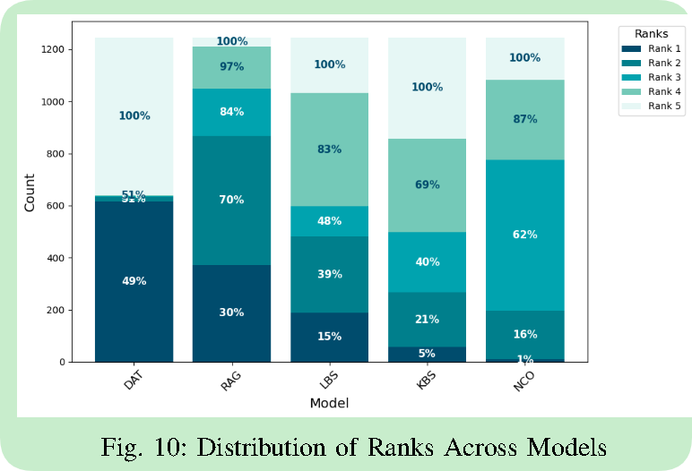

​	排名评估每种方法在实现全面问题覆盖方面的有效性，排名 1 表示覆盖率最高，排名 5 表示覆盖率最低。

​	对于基线方法，分布与预期一致。LBS 模型显示出跨等级的广泛分布，第 4 级的浓度最高，第 1、2 和 3 级的样品不到一半。这种模式反映了 **LBS 的真实世界训练数据，可能捕获了代码审查数据集中典型的选择性覆盖模式。因此，LBS 有效地识别了常见问题，但缺乏 KBS 的系统性、基于规则的覆盖特征**。相比之下，**静态分析仪由于其基于规则的方法而主要排在第 4 和第 5 位，虽然精确，但缺乏适应性和检测更广泛问题的能力。**这种受规则约束的结构将静态分析器限制为特定的、可预测的问题类型，从而限制了它们像 LBS 那样提供全面覆盖的能力。

​	DAT 方法中达到 1 级的评论比例很高 （49%），在这些情况下表现出强大的覆盖率。值得注意的是，DAT 分布是双峰的，排名 2、3 或 4 的评论相对较少。这表明 DAT 要么排名靠前，解决了代码更改中的大多数问题，要么在其覆盖范围有限时跌至第 5 级。**数据增强后MFT的这种两极化性能模式表明，它要么实现全面覆盖，要么错过关键区域，很少达到中间覆盖水平**。

​	**RAG 表现始终良好，大多数评论均处于第 1 和第 2 名 （70%）。这表明 RAG 可靠地涵盖了代码更改中的大量问题，**在第 2 级中占有显着份额，表明它经常提供强大的（如果不是完整的）覆盖范围。

​	NCO方法主要出现在中等级别，尤其是 3 级，表明覆盖率适中。这一结果反映了简单的串联过程，该过程结合了来自 LBS 和 KBS 的评论，无需高级集成。因此，NCO 的覆盖范围受到 LBS 审查质量的影响;当 LBS 的覆盖率较低时，NCO 的覆盖范围也往往有限。然而，静态分析仪审查的增加提供了轻微的改进，使 NCO 的覆盖范围比单独进入前三名的 LBS 更广泛。

​	总之，DAT 和 RAG 成为表现最好的方法，合计占 Rank 1 评论的近 80%，每个方法都表现出色。NCO 表现出中等性能，其中 3 级是最常见的位置。

​	为了能够在组合方法和基线之间进行直接比较，我们根据排名进行了成对的赢-输分析。

>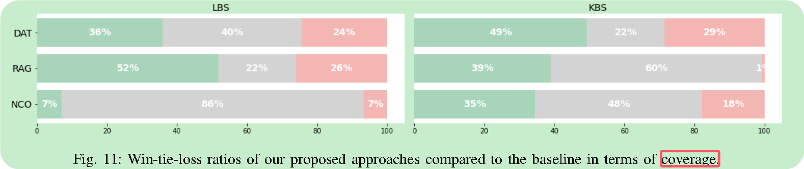

DAT 对 LBS 和 KBS 的胜率都很高，凸显了其在实现更广泛覆盖方面的有效性

RAG 也表现良好，始终如一地识别各种问题，并且覆盖范围经常超过 LBS.

相比之下，虽然 NCO 对 KBS 处于有利地位，但它与 LBS 的平局率更高，表明它通常实现了中等覆盖率，但表现并不始终优于 LBS。

当 LBS 生成的评论与 KBS 输出相矛盾或覆盖 KBS 输出时，可能会出现 NCO 提供的覆盖范围少于 KBS 的情况，从而降低了NCO的总体覆盖率。

例如，在一个实例中，KBS 生成了以下注释：

“未使用的导入'com.google.common.collect.ImmutableList'。

然而，LBS 生成的评论实际上使这一观察结果无效：

“代码更改为 com.google.common.collect.ImmutableList 添加了一个新的导入语句。这是一个很好的补充，因为它允许类使用 ImmutableList 类，这对于创建不可变列表很有用"。

​	在这种情况下，来自 LBS 的相互矛盾的反馈可能会削弱 KBS 调查结果的影响，从而导致 NCO 方法的覆盖率较低。


​	为了回答 RQ4，我们得出结论，与基线相比，DAT 和 RAG 两种组合方法显着增强了可以自动识别的问题的覆盖率。


### Conclusion

​	***在本文中，我们探索了将基于知识的系统（KBS）与大型语言模型（LLM）相结合的混合方法，以增强代码审查的自动化程度。***

​	通过在三个阶段整合 KBS 衍生的见解——数据准备（数据增强训练，DAT）、推理（检索增强生成，RAG）和后推理（输出的朴素串联，NCO）——我们旨在利用 KBS 和基于学习的系统 （LBS） 的优势来生成更准确和全面的代码审查注释。

​	**我们的实证评估表明，组合方法具有明显的优势。**

​	RAG 成为最有效的方法，通过使用静态分析工具的结构化、上下文相关知识丰富生成过程，提高了review comment的准确性和覆盖率。

​	DAT 通过在训练中让 LLM 接触不同的问题类型来实现广泛的覆盖范围，有时以牺牲精度为代价。

​	NCO虽然简单明了，但在覆盖范围方面取得了适度的改善。

​	这些发现强调了将静态分析工具与llm相结合以解决自动代码审查中个别方法的局限性的潜力。

​	future work：未来的工作将涉及探索将知识**更复杂的集成**到开放权重llm中。我们还计划将这种方法**扩展到其他编程语言**，并探索**字节码级分析以获得更深的分析**。此外，**更先进的静态分析器和动态分析工具的集成**可以进一步提高覆盖范围和精度，最终有助于建立更强大、更通用的代码审查自动化pipeline。


> idea:
>
> 能不能使agent自己evolving static tool呢？


## 论文 CRScore


CRScore: Grounding Automated Evaluation of Code Review Comments in Code Claims and Smells

cmu 、 **Carolyn Penstein Rose** 2w引用  、 NAACL

### abstract

​	自动代码审查的任务最近引起了机器学习社区的广泛关注。然而，**当前的review comment评估指标依赖于与给定code diff的人工编写的reference的比较**。此外，代码审查是一个一对多的问题，就像生generation和summarization一样，差异有许多“valid reviews”。因此，我们开发了 CRScore 一个无参考指标，用于衡量review quality的多个维度，如简洁性、全面性和相关性。我们**设计 CRScore 评估review,着眼于LLM 和静态分析器在代码中检测到的claims和潜在问题。**我们证明，CRScore 可以产生有效、细粒度的评论质量分数，*这些分数在开源指标中与人类判断最一致（0.54 Spearman 相关性），并且比基于reference的指标更敏感。*我们还发布了一个包含 2.9k 人为注释的评论质量分数的语料库，包括机器生成和 GitHub review comments，以支持自动化指标的开发

### Intro

​	代码审查是软件工程师必不可少的质量控制工具，可确保源代码没有错误并符合标准。与正式的面对面审查相比，软件工程师更喜欢通过 GitHub 的审查评论功能启用的轻量级异步审查流程。这导致了自动生成自然语言reveiw comment的benchmark的创建。***然而，这些基准使用基于参考的评估指标，如BLEU，这些指标已被证明具有低有效性。尤其是与有限且低质量的参考文献配对时。***

​	代码审查从根本上说是一个一对多的问题，其中给定的差异可能有多个可能的问题，审查可以解决这些问题。**参考评论数量有限（例如，CodeReviewer 中的每个差异一个（Li 等人，2022 年））会导致基于参考的指标得分过低。**

> ​	例如，对于图 1 所示的差异，ground truth审查侧重于 ToHexString（） 函数是否会导致性能问题。但是，模型生成的审查侧重于 ToHexString（）.Equals（“000000000000000000”） 是一个不太可能触发的奇怪的条件，**`这也是对差异的有效审查。`**
>
> 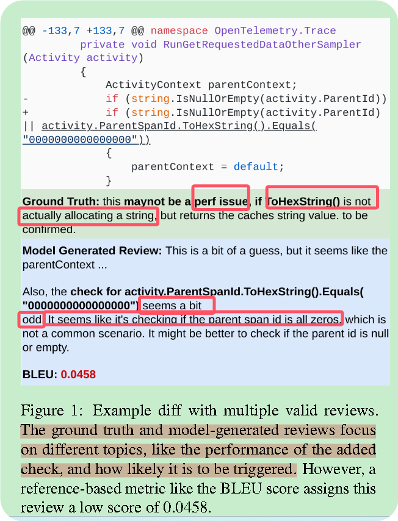

​	然而，由于 n-gram 重叠较差，模型生成的评论的 BLEU 分数值非常低，特别是为 0.0458。此外，**`由于缺少上下文(如表 5 所示)，或者专注于琐碎和切题的问题,参考文献也可能质量低。`**这种低质量的参考文献，与基于参考文献的指标配对，**可能会严厉和不公平地惩罚模型**。

> 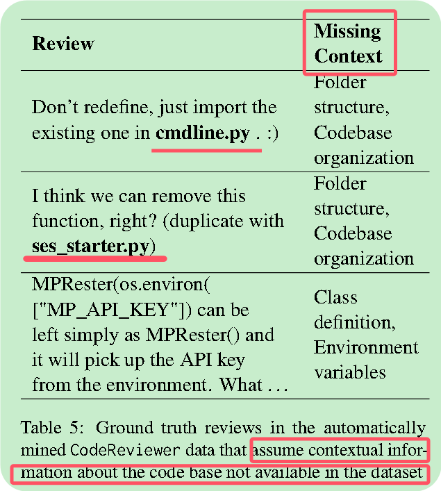

​	出于这些缺点的动机，我们提出了 CRScore，这是一种自动化但无参考的评估指标，它使用先前工作的review quality维度。特别是**全面性——审查是否传达了所有必要的信息？简洁性——评论是否只以有效的方式传达必要的信息，相关性——所有信息都符合主题吗？**

​	我们通过两步流程来实施我们的指标。***`1）生成一个伪引用列表 （pseudo-references），涵盖代码更改的可能声明、问题和影响等信息，2）使用语义文本相似性 （STS） 将评论的各个部分与伪引用（pseudo-references）对齐。`***

​	为了生成伪引用，<u>我们使用了一种神经符号方法，将大型语言模型 （LLM） 和可以检测格式错误、不好的design pattern的代码分析工具 （CAT）结合在一起。我们将这些方法结合起来，以获得更详尽的伪引用，并克服每种方法的缺点。</u>

​	最后，我们通过对**伪引用质量的人工评估** 和 衡量我们的**指标与人类判断的一致性**来证明 CRScore 的有效性。我们表明，与基于参考文献的指标相比，**CRScore生成的大量（82.6%）伪引用是正确的**，并且与和人类对评论质量的判断具有最大的一致性（Spearman相关性0.5431）。

> 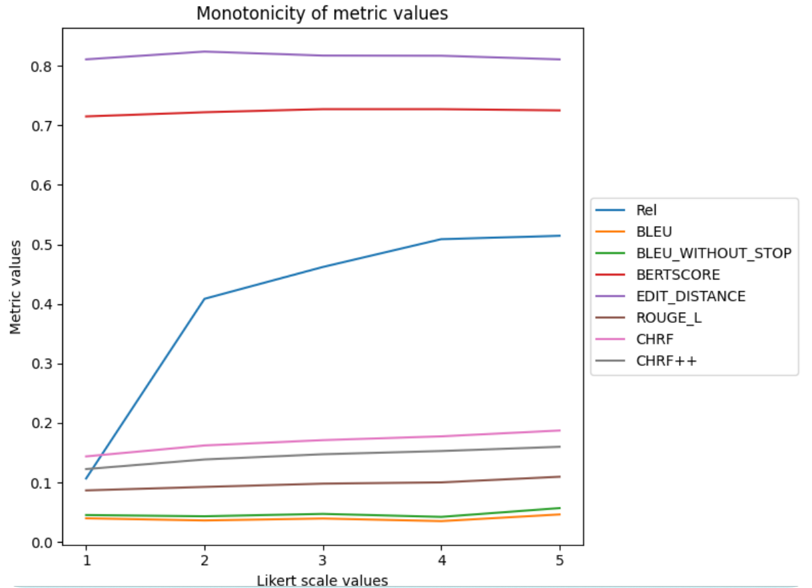

​	Contributions:

​	（1）我们提出了一种**自动化的无参考指标，它结合了LLM和CAT的优点，以沿细粒度衡量审稿质量**。

​	（2） 我们**收集伪参考质量的人工注释**，**并审查简洁性、全面性和相关性，以验证我们的方法**。我们计划将这些分数作为持续开发自动化指标的资源公开。

​	（3） 我们使用 **CRScore 对 CodeReviewer 数据集上的几个 LLM 代码进行基准测试**，以进行代码审查，并将其与基于参考的指标进行比较。

​	

### Conclusion

​	我们的工作迈出了解决评估代码审查质量所涉及的挑战的**`第一步`**。我们提出了用于捕获评论质量的**有用维度**，并将 **CRScore** 作为自动化、高效、开源和可重复的指标来捕获它们。我们收集了**`人类对评论质量的判断分数的数据集`**，以显示 CRSore 的有效性。**基于收集的review comment数据集，我们将 CRScore 与 7 个基于参考的指标进行了比较，并用到 9 个评论生成系统上进行实验。**我们的指标在开源指标中与人类偏好最一致，并且是最敏感的。不过，在 通过开发更好的伪引用生成和 STS 匹配方法来尝试匹配 GPT-4o 等闭源模型在判断评论质量方面的性能 等方面还有改进的空间。


### Operationalizing CRScore

​	受到代码审查的一对多性质、嘈杂的参考答案以及基于参考答案的自动化指标的缺陷的激励，我们开发了 CRScore——一种无参考、基于质量维度的自动化指标。如图 2 所示，我们的指标不依赖于显式参考，而是**从代码更改中生成“伪参考”**，涵盖损害可维护性的声明、影响和问题/气味，换句话说，是关于review应该添加的一些主题。**然后，我们使用语义文本相似性（STS）度量来量化这些主题的代码review，具体涉及三个质量维度：简洁，全面性和相关性。**他们捕获了reveiw comment质量的方式类似于用于分类和检索的**精度，召回和F-评分**。我们在下面描述了框架的三个主要组成部分 - **质量维度，伪参考的产生和相似性测量。**

#### Quality Dimensions

​	我们受到（Piorkowski等，2020; Turzo and Bosu，2024）的启发，选择“简洁”，“全面性”（类似于完整性）和“相关性”的维度。前两者捕捉并在包含大量细节的综合性评论和简明扼要、极简主义的评论之间取得平衡。**简洁性和全面性分别起到precision和recall的作用**，捕捉了有多少评论是针对主题的，以及涵盖了多少信息。**相关性在两者之间取得了平衡，就像 f score一样，衡量评论的整体质量**。此外，我们还**对伪参考的有效性进行人工评估**，重点关注支持证据方面

> 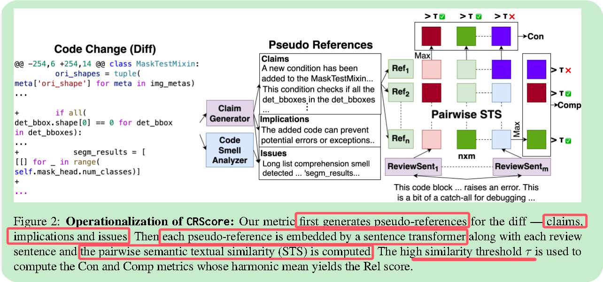

#### Pseudo Reference Generation

​	为了生成伪参考，我们开发了一个基于 LLM 的pipeline，用于在两个抽象级别上对代码更改生成claims：1) Low-level changes and 2) High-level “implications” of the change. 为了易于复现和部署，我们使用了 6.7B 参数的开源 LLM，**Magicoder**.**`使用更强的模型 （GPT4） 生成的特定任务数据来微调Magicoder-S-DS-6.7B 来执行此任务`**，如图 3 所示。我们通过提示 GPT-4 从 CodeReviewer 验证数据中随机获取 1k code change的子集来生成claims。

> 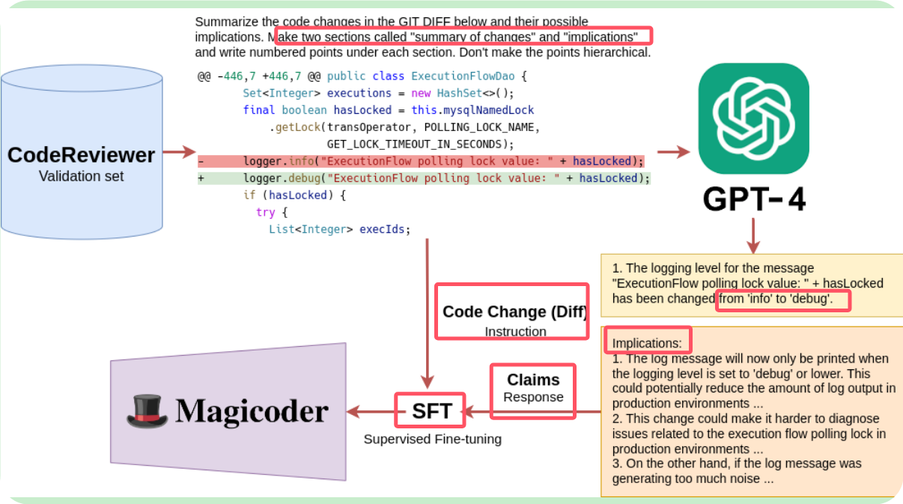

​	除了**`claims`**之外，我们还利用程序分析工具来检测**`issue`**和“**`code smell`**”（表明程序中存在更深层次缺陷的特征，如表 14 所示），如 PySmell，以及静态分析器，如 PMD 和 JSHint。它们可以检测未使用的变量、不必要的对象创建、语法错误、泄漏变量、类型转换问题等。这些工具分别针对 Python、Java 和 Javascript，并且可以使用基于规则的分析来检测文件或存储库级别的问题。***`它们补充了基于 LLM 的分析可能遗漏的方面。`*** 我们将code smells和claims结合起来，得到最终的伪参考集(pseudo references)。

#### Computing Similarity with Pseudo References:

​	我们使用**sentence Transformer**模型（**mxbai-embed-large-v15**）来计算伪参考和评论句子之间的语义文本相似性（STS）。然后使用成对相似性来计算简洁性、全面性和相关性，如公式 1、2 和 3 所示。我们选择这款模型是因为截至 七月 2024在 MTEB 基准测试上对参数小于 1B 的模型进行英语 STS，它具有最佳性能。

​	我们首先计算伪引用 （p-refs） 和评论句子 （rsents） 的标记嵌入（token embedding），排除停用词（stopwords）并汇集其余的标记嵌入以**`构建整个句子的表示`**。然后，我们通过 p-refs （P） 和 r-sents （R） 之间的成对余弦相似度 s（） 计算这些句子嵌入的 STS 分数。

>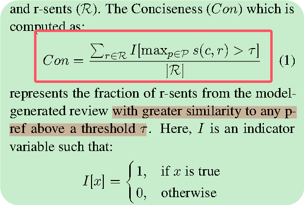

​	Con 类似于precision，因为它捕获了与 p-refs（参考/金集）“切合主题”的 r-sents（候选集）的分数。

>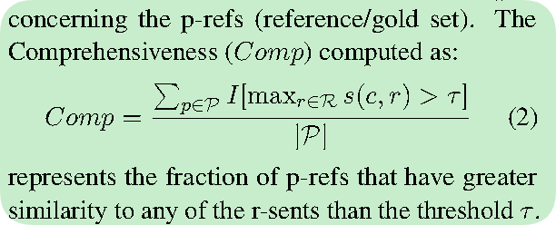

​	该指标类似于召回率，因为它捕获了模型生成的 r-sents（候选集）所覆盖的 p-refs（金集）的部分。简洁性和全面性之间存在权衡，就像精确度和召回率一样，为了捕捉这些指标之间的权衡，例如 F1 分数，

>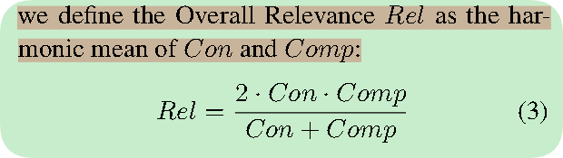

​	根据 I[x] 的定义，我们所有指标的值范围为 [0， 1]。


**Selecting threshold τ for high similarity:**

​	对于我们的相似性阈值 τ，我们**·使用伪引用和谈论它的评论句子之间的平均相似性·**。为了计算它，我们**`使用最佳模型（在我们的例子中为 GPT-3.5）的pseudo-reference与review comment的相似性分数`**。从 CodeReviewer 测试集开始，我们排除了用于收集人工注释的数据。对于其余 9869 个实例，我们计算每个评论句子与其相应代码更改的伪引用之间的相似性。最后，我们对所有评论句子的相似性分数值进行平均，给出阈值  $τ_{best} = 0.7314$ 的值。虽然选择正确的阈值对我们的指标很重要，但我们注意到它对值的某些变化是稳健的，如**表 18** 所示。

> 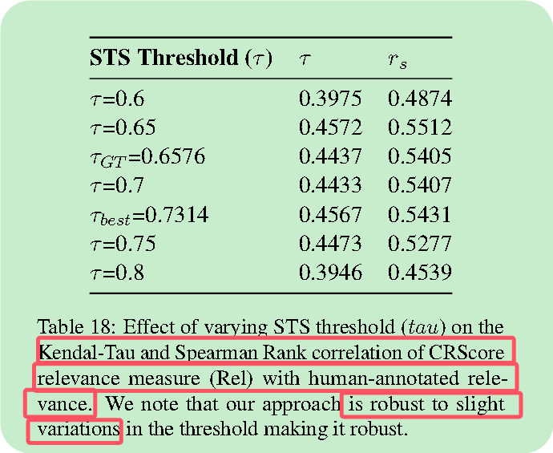

### Validating CRScore

​	要成为有效的指标，CRScore 需要满足一些属性。首先，**生成的pseudo reference应该具有很少的错误和无法验证的claims，同时是详尽的**。此外，我们希望我们的**维度分数（Con、Comp 和 Rel），尤其是 Rel，与每个维度的人类判断相关联**。最重要的属性可以说是我们的指标（尤其是 Rel）能够**以与人类相同的顺序对reveiw generation systems进行排名**。在随后的部分中，我们将描述如何设计实验以收集这些属性的注释（第 4.1、4.2 节），选择一组由人类进行评级的系统（第 4.4 节），以及建立基于参考的指标（第 4.5 节）用于比较 CRScore。

#### Rating Quality of Pseudo-References

​	为了展示CRScore评估流程中llm生成的**`pseudo references有较高质量`**。**`我们收集捕获不正确、无法验证和缺失的声明的人工标注`**。 **让两名训练有素的人类注释者（本文的合著者）判断 CodeReviewer 的 100 个随机采样代码更改的pseudo-reference的质量（Li 等人，2022 年），每个更改均采用 Python、Java 和 Javascript（总共 300 个，详见附录 D.5）。**注释者被要求将pseudo-reference为 1（基于证据正确）、0（基于证据不正确）和 -1（由于缺乏证据而无法验证）。他们还被要求添加有关seudo-reference未涵盖的问题/主张的任何seudo-reference。我们报告正确声明（准确性）、错误声明（错误率）、无法验证的声明（无法验证率）和缺失声明（缺失率）的分数。如果 Nc、Nu、Ni 和 Na 代表正确、不可验证、不正确和添加的claim的数量，则这些比率中的每一个都可以计算为：

>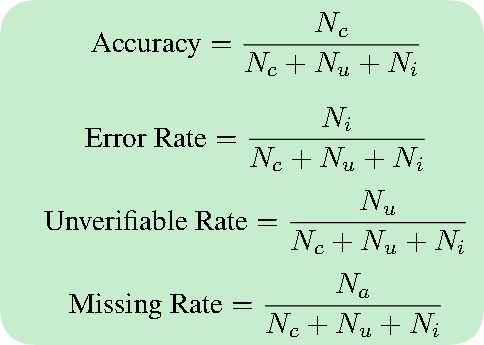

​	基于以下表达式：准确率 + 不可验证率 + 错误率 = 1。**表1**显示了每种语言的结果。

> 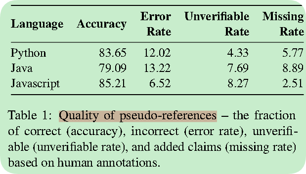

​	标注者遵循代码手册**`（D.1 节）`**中列出的准则，其中包括每个类别的示例。我们通过收集两个注释者对一组公共的 100 个pseudo references的标注来衡量我们方法的编码可靠性。这些注释产生了 0.804 的 Cohen Kappa，这表明注释者之间的可靠性很高。此外，**`我们在这里只评估 LLM 生成的声明，因为我们知道静态代码分析工具是基于规则的并且可靠正确。`**


#### Rating Review Quality Dimensions

​	为了显示 **CRScore 在所提出的维度（全面性、简洁性和相关性）上与人类对审查质量的判断一致**，我们从**相同的标注者那里收集了对 9 个系统生成的评论和ground-truth参考的标注**。我们使用与第 4.1 节相同的代码更改。

​	评分者再次遵循codebook（D.2 节），其包含使用pseudo-reference的**5-point Likert scale**对每个dimension的标注codebook和示例。评分者**使用基于第 4.1 节中描述的第一阶段标注的更新pseudo-references：不正确和无法验证的references被删除，并添加缺失的claims。**我们还为每个code change添加**代码分析工具生成**的伪参考（问题和代码气味）。评分者还被要求标注他们认为对给定代码更改***不必要的任何claims，然后在对每个质量维度的审查进行评分时将其排除在外。***同样，我们通过收集两位评分者的标注来**衡量codebook的可靠性**，这次是一组共同的 100 条评论。我们计算每个维度的 Krippendorff alpha 可靠性（Krippendorff，2018），简洁度、全面性和相关性分别为 0.8868、0.8505 和 0.8806。0.8 的alpha 值通常被认为是可靠的。尽管采取了措施来确保标注的可靠性，但可能存在对潜在偏差的一些担忧，我们在**`附录 D.9`** 中解决了这一点。

​	基于这些标注，我们使用 **Kendal 和 Spearman** 相关性测量 **`CRScore （Rel） 、基于参考的指标，与人类标注的相关性`**Likert scores。**`如表3`**。

>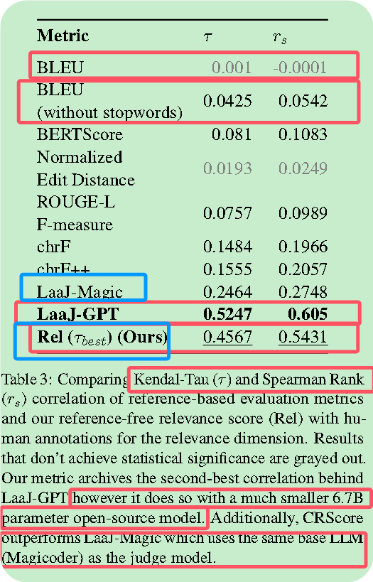

​	我们还**`计算了指标生成的系统排名与人工排名之间的相关性`**（表 2）

>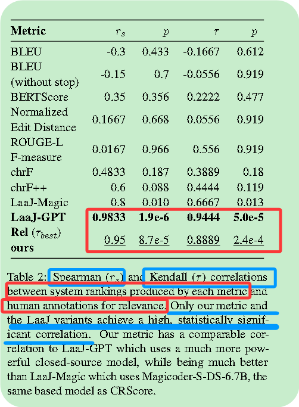


#### Annotating Similarity between Pseudo-References and Reviews

​	在使用pseudo-reference标注审阅质量维度时，标注者还被要求提及每个系统生成的review所涵盖的pseudo-reference。这为我们**提供了一个包含 5.7k pseudo-reference和review对的数据集**，其中 **1948 条是正例**，该review根据人类的说法正确处理了pseudo-reference，而其余的则是负面示例并且review未涵盖pseudo-reference。使用这些数据，我们评估**具有各种相似性阈值 （tau） 的 STS 模型**以预测在伪参考和评论对中，评论是否涉及伪参考。（**thresholds使将相似性分数转换为二元分类器，从而能够报告其精度、召回率和 F1 分数）**。结果如**`表4`**所示。

>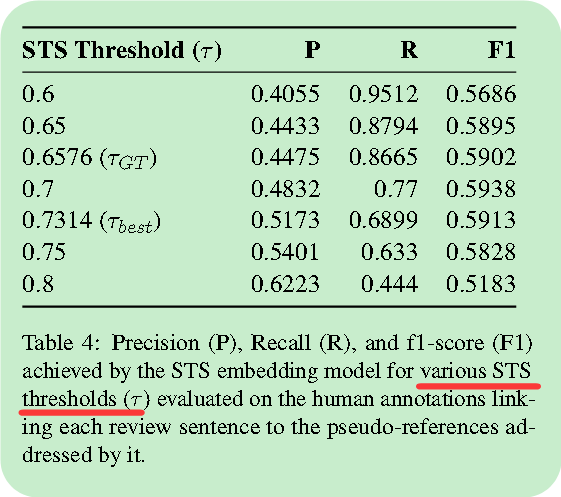


#### Review Generation Systems

Simple baselines:**a BM-25 retriever and an LSTM**

CodeReviewer

Open source LLMs:

Closed source LLMs:

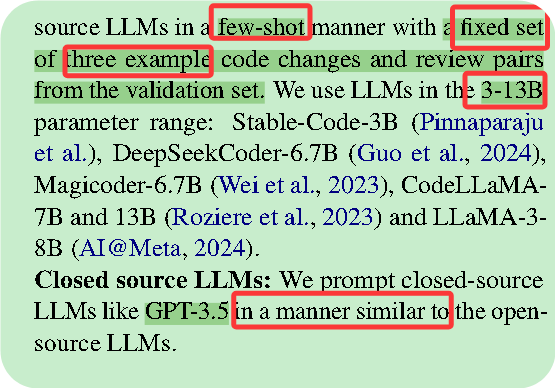

#### Reference-based Metrics

BLEU、

Normalized Edit Distance、

ROUGE-L F-measure、

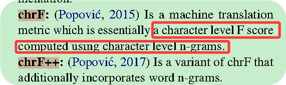

BERTScore

**LLM-as-a-judge：**

​	我们用第 3.1 节中开发的相同 Con、Comp 和 Rel 维度的描述来提示他们，并按照 **`D.4`** 中所示的提示进行提示。**GPT-4o** as the judge LLM (**LaaJ-GPT**) and one that uses **Magicoder-SDS-6.7B** (**LaaJ-Magic**)

>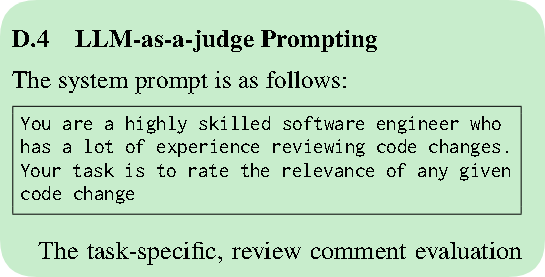
>
>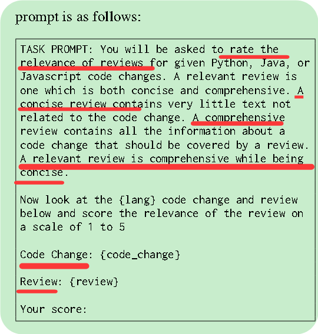

### Results

#### Validity of Pseudo-References

> 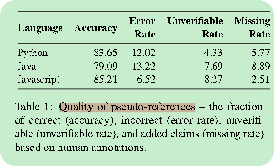

​	我们显示了正确、不正确、无法验证和缺失的claim的比率，如表 1 的第 4.1 节所述。我们的pipeline生成的伪参考相对准确，跨语言的准确率约为 82.6%。表现最好的是 Javascript，最差的是 Java。**代码声明中最常见的问题是不正确的声明。大多数错误发生在代码理解（“误读代码”）和过度概括（根据有限的上下文做出的错误假设，与文件级上下文相矛盾）方面**。**表12**中显示了一些例子。

>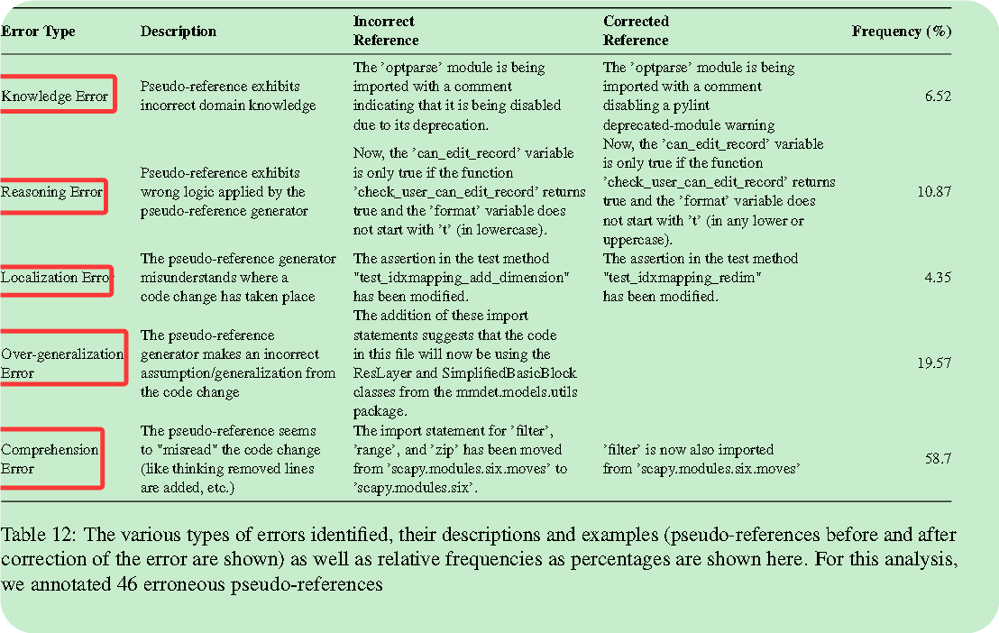

​	对于 Javascript，我们观察到无法验证的声明是最大的问题，例如，在没有证据的情况下对代码效率或功能的声明。例如：“然而，这一变化也可能使不那么严格......行为。。。这可能会降低代码的效率......


#### Validity of Review Quality Dimension Scores (Con, Comp and Rel)

1.**Correlation with human Likert score annotations**:

​	我们**计算了人工标注的Likert score与metric值之间的 Spearman 和 Kendall rank correlations**。这些值是**针对第 4.1 节中提到的 300 个 CodeReviewer 测试实例收集的**（结果见表 3）。我们排除了对ground truth reference进行的人工注释，因为默认情况下，这些基于参考的指标值将为 1，**而事实上将它们设置为1将不公平地降低基于参考的指标的相关性**，因为这些ground  truth本身也是不完美的。

​	我们观察到，虽然**`几乎所有基于参考的指标与人类判断的相关性都很弱甚至没有相关性`**，**`但我们的指标 Rel 和 LaaJ-GPT 实现了最大的相关性`**

> 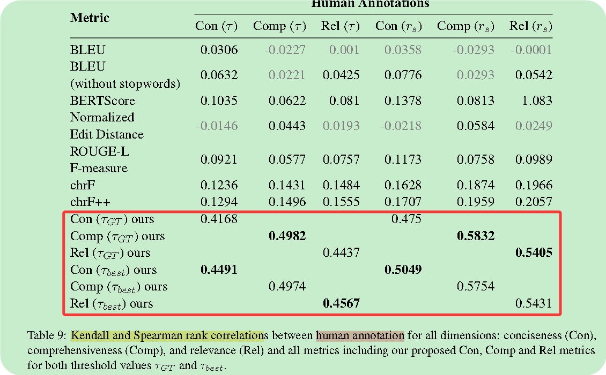

2. **Comparing system rankings**

**可以说，我们的metric最重视、想要达到的是  能够给出与human评估员相似排名的能力。**

​	我们将指标 Rel 产生的系统排名与人类注释产生的排名进行了相关性比较，表 2。只有 LaaJ 指标和我们的指标与根据人工注释计算的排名实现了很强的、具有统计学意义的相关性。

>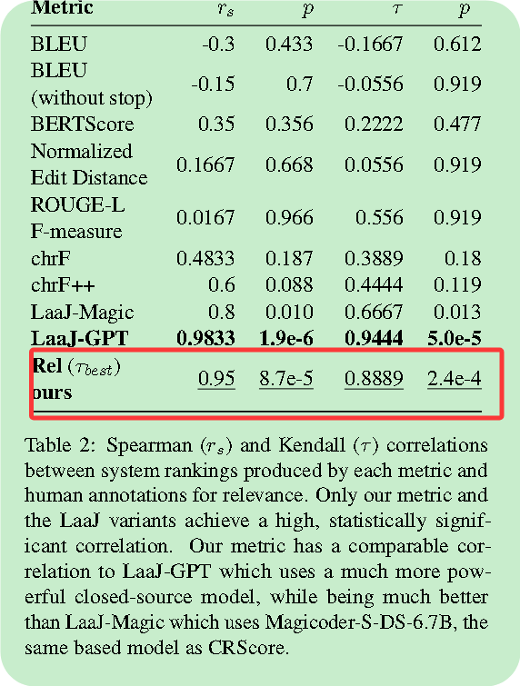

​	系统排名（如表 15 所示）显示，**我们的指标的排名基本正确，除了 LLaMA-3-8B-Instruct，与人类相关性注释相比，我们的指标排名略低**。

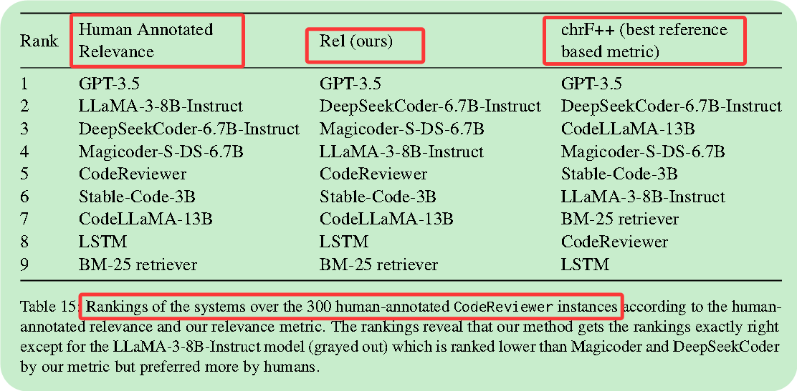

​	我们还根据我们的指标（Con、Comp 和 Rel）和人工标注报告了每个系统的质量维度分数，如表10。

>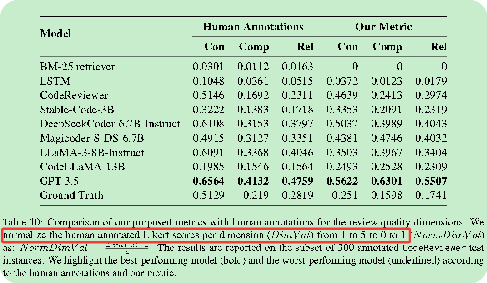

​	**我们的指标也具有与人类标注的值的相似分布，并且对人类偏好的敏感性更高**，如图 8 和表 13 所示。

>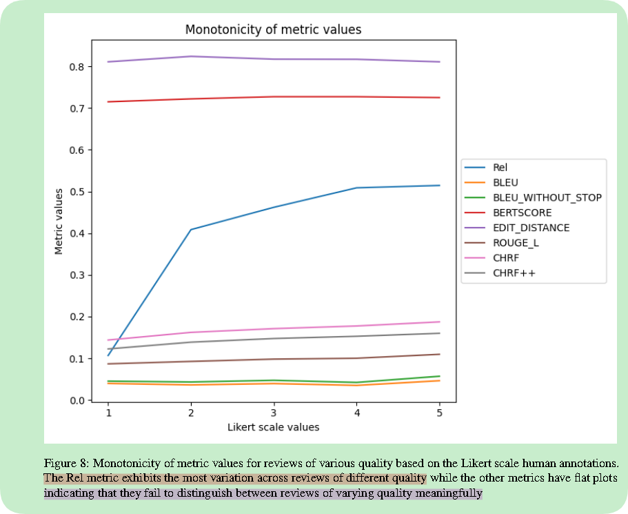
>
>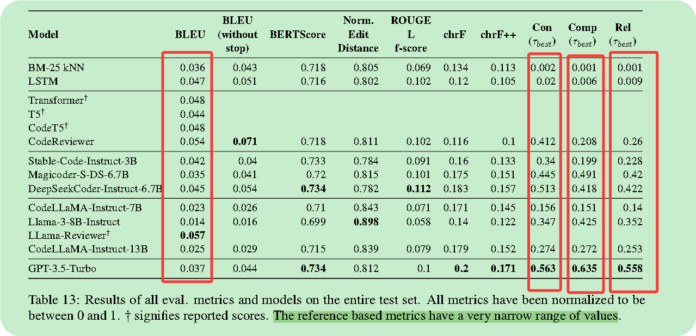


#### CodeReviewer Dataset Reference Quality

​	我们将 **CodeReviewer 参考评论的质量**与**人工标注者评估的 9 个系统生成的评论**进行比较。***CodeReviewer reference reviews在简洁性、全面性和相关性方面的平均得分为 3.05、1.88 和 2.13，而所有 9 个系统获得的平均得分分别为 2.57、1.84 和 1.99。***

这表明 reference review在相关性上达到了人类标注的水平，并且更简洁。

​	此外，根据人类注释者（从表 10 中可以明显看出）的最佳系统，**GPT-3.5 在每个维度上的平均得分分别为 3.63、2.65 和 2.9，远优于参考评论。**这为开发用于代码审查的 CRScore 等reference-free评估指标提供了进一步的动力


> idea:
>
> 好像有一个研究空白
>
> code_review以及revised_code两个任务天然相似性，联合评估会更好！？？？！


## 更改agent search

思路就是  简单的 将目前的graph_explorer agent改为tool，供大reviewer agent调用。


没改完。


```python


```


在做tree search的时候，

对每个节点做一个key point summarization，

需要包括(输入输出格式、具体功能，调用了哪些需进一步理解的函数，在上层调用中起到什么作用，调用链)

```python
例子 1：类型不匹配要顺着调用链才能发现
def main():
    data = get_user_input()
    processed = process_data(data)
    save_to_db(processed)

def get_user_input() -> str:
    return "123"

def process_data(x: int) -> int:
    return x * 2

def save_to_db(record: int):
    print("Saving:", record)
    
Key Point Summarization (DFS)

get_user_input: 输入无 → 输出 str → 功能：获取用户输入 → 在调用链中作为 process_data 的参数。

process_data: 输入 int → 输出 int → 功能：处理数据（乘 2） → 依赖 get_user_input。

save_to_db: 输入 int → 输出 None → 功能：保存数据。

main: 调用链 main → get_user_input → process_data → save_to_db。

👉 发现问题：
get_user_input() 返回的是 str，但 process_data(x: int) 期望 int，这类 bug 必须追踪调用链才能定位。
```


```python
例子：折扣计算功能性错误
def main():
    price = 100
    discounted = apply_discount(price)
    print("Final price:", discounted)

def apply_discount(amount: float) -> float:
    rate = get_discount_rate()
    return amount - rate   # ❌ 本应是 amount * (1 - rate)

def get_discount_rate() -> float:
    return 0.2  # 20% off
```


## idea

能不能使agent自己evolving static tool呢？


code_review以及revised_code两个任务天然相似性，联合评估会更好！？？？！


能不能让llm将相关函数链信息， 搜集出来，然后送给静态分析工具，然后静态分析工具运行后输出结果信息再让llm确认。以此，进行验证评估。


静态分析工具做的不好的话，是不是会误报，然后会漏报吗？
llm可以更好的辅助这个工具，全面些，然后能结合这个工具，然后给出人能看的，甚至答案。


emm，我这个多agent，做成每个agent一个不同的llm，减少单一模型的bias，这样整一个multi，但感觉也比较常见


目前，多是微调llm、或者rag，会导致一个问题，真实场景中 review_comment 是带link的， 可不可以llm加上搜素工具后，能够做很多带link的comment，这样子有理有据可能更好？

> todo 解释


> 多个diff块


## 9.22跟师兄讨论


The Cost vs the Benefit of Adding an Extra Code Reviewer to Mitigate Developer Turnover through Reviewer Recommenders


Deep Learning-based Code Reviews: A Paradigm Shift or a Double-Edged Sword?


LAURA: Enhancing Code Review Generation with Context-Enriched Retrieval-Augmented LLM


Effective Teaching through Code Reviews: Patterns and Anti-Patterns


把code review  作为一种真实世界的，多角度的，细粒度的代码优化任务   然后构建一个benchmark，这种具体的优化指令  跟用户给llm的优化指令更接近。

之前两个月的一些东西可以用来实现方法那部分，顺带拿出来讲。

相当于之前侧重的是生成comment，现在是给comment进行optimization。

应该叫提供了一个新的角度。

pr的有人做很正常，可以快速地调研一下。


想想有什么比较好的方式来**评估**revised(optimized) code。这里其实说的是更solid的一些评估方式  比如静态分析结果、运行时间等等  SWE-bench就是这么脱颖而出的。

 


直接问llm的话，它打的分能区分出revise前后的好坏嘛。


## static analysis tool

pylint、mypy、flake、badnit


soarnerqb


## agent方面的合理性

> 为什么多-agent 合适 不同维度的问题需要不同视角：
>
>  有的 agent 偏向 语义理解（逻辑、功能错误）。 
>
> 有的 agent 偏向 模式识别（性能、安全、风格）。
>
>  有的 agent 偏向 上下文一致性（项目规范、重复代码）。
>
> 
> 


我只要证明数据里面有 我所要包含的情况就可以了

> 目前我应该
>
> 1.使用静态分析工具先扫描一遍 diffhunk的具体情况，看主要会涉及哪些方面
>
> 2.使用正则匹配关键词，匹配哪些review看会有什么
>
> 3.创建各种类型的agent（希望还是我这四个），然后不同类型agent都可以调用静态分析工具
>
> 4.期望结合使用belu、crystalbelu以及**CRScore**进行评估, **CRScore是肯定得用的**

code review

出现最多的应该是trivial的内容，

现在最大的问题是 到底要不要四个类型的agent


## 看数据


请你首先翻译 review_comment，告诉我在干嘛，然后指出diff_hunk对应行，最后看一下revised_code对不对，然后现在的标签对不对，最后再帮忙给个正确点的标签


人工看实在是太麻烦了，

使用 qwen 7b自动构建


计划是三步走

1.llm标注基本分类

2.llm聚合分类，构造分类标准

3.人工确认各个分类存在这种数据


s len: 789


Counter({'Maintainability': 208, 'Style': 199, 'Typing': 128, 'Tests': 77, 'Correctness': 63, 'Performance': 48, 'Dependencies': 15, 'Security': 12, 'ResourceManagement': 12, 'Documentation': 6, 'Concurrency': 6, 'Convenience': 5, 'Conventions': 2, 'Dependencie': 2, 'Syntax': 1, 'Other': 1, 'Deprecation': 1, '其他合理分类': 1, 'Dependability': 1, 'Docstring': 1})


> 经人工确认后，不仅少，security还都是误报。
> 鉴于security太少，更改四方面agent
>
> 直接改为一个专注于 static analysis tool，另一个专注于code smell，两个agent


## *研究计划


1. 精选100-300条数据
   1. 爬取 使用python的高star仓库
   2. llm简单分类、简单评分
   3. 人工挑选
   
2. agent pipeline的构建
   1. memory的设计，超长就压缩
   
   2. dfs搜索总结工具
   
   3. 使用 **Ruff**† 生成 linter 反馈，以识别代码效率问题、复杂性测量和安全漏洞，
   
      使用 **Pyscent**‡ 检测模式来检测代码气味，诸如Long Method and Large Class等。
   
   4. 结合搜索总结的定位agent、修复agent、确认agent
   
   4. 评估采用 CRScore 以及 Bleu、 sentence similarity等，以及人为评估
   
3. 实验
   1. 上下文搜索的消融
   2. 多llm的 benchmark


## 数据再次不对

threads[0]['comments']['nodes'][0]['url']

'https://github.com/TheAlgorithms/Python/pull/12678#discussion_r2054749730'


head_oid

'cf14f87e45ebbdf91b702dcaa097d34ccea282c5'


threads[0]['comments']['nodes'][0]['originalCommit']['oid']

'635430404179bc08e73ff9c6bb0b27de6f112de7'


threads[0]['comments']['nodes'][0]['commit']['oid']

'cf14f87e45ebbdf91b702dcaa097d34ccea282c5'


经过这条数据发现， head_oid是对的，但是originCommit不对！！！！


> 峰回路转
> 也就是虽然网页显示的是之前那个454ed，但是这个是在6354这里一起review的，所以我爬取的6354也是对的
>
> 跟师兄简单求解后，发现现在爬的还可以！！

下面这数据爬取成功！

TheAlgorithms-Python-closed_12678

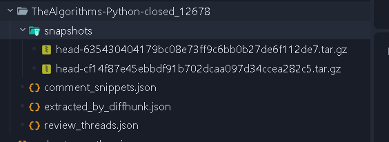


## RLBFF: BINARY FLEXIBLE FEEDBACK TO BRIDGE BETWEEN HUMAN FEEDBACK & VERIFIABLE REWARDS

25.9 arxiv  nvidia


> 静态分析工具一定是 complete的，妥协sound
>
> 而llm的 多样性更强， 不过准确性确较低，
>
> 将两者结合，一方面弥补了静态分析器的sound，另一方面对于静态分析器误报的部分，llm能智能过滤与识别

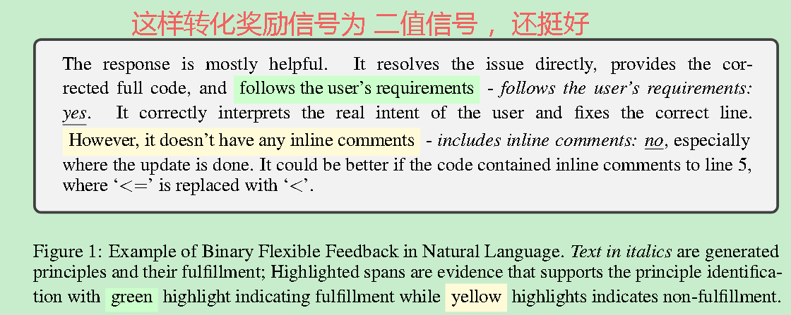


## 再次过滤数据

1. 使用revised_code和origin_code的 git diff的输出，作为diff_hunk

​	这是由于存在diffHunk被截断的情况

> 这是不对的！！

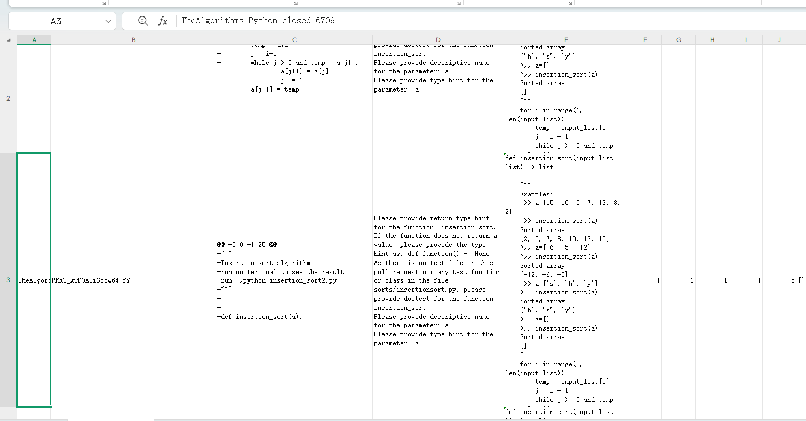


模型评估是不是关键字评估一下就行？


## 10.9再次开始


## 论文 CodeFuse-CR-Bench

CodeFuse-CR-Bench: A Comprehensiveness-aware Benchmark for End-to-End Code Review Evaluation in Python Projects

蚂蚁、香港浸会大学、UNSW Sydney


### 摘要

​	自动代码审查 （CR） 是大型语言模型 （LLM） 的关键应用，但进展受到“现实差距”的阻碍：**现有基准测试使用简化的、上下文不足的数据在孤立子任务上评估模型。**这**未能反映现实世界 CR 的整体上下文丰富性质**。

​	为了弥补这一差距，我们**推出了 CodeFuse-CRBench**，这是第一个用于**repo level CR 评估**的全面感知基准测试。CodeFuse-CR-Bench 包含来自 **70 个 Python 项目的 601 个高质量实例**，涵盖 9 个 Pull-Request （PR） 问题域，其中**每个实例都提供丰富、多方面的上下文**，包括相关问题、PR 详细信息和存储库状态，从而实现端到端评估。

​	除了表面指标之外，我们还**提出了一种新颖的评估框架**，该框架**将基于规则的位置和语法检查与基于模型的评论质量判断相结合**。我们在这个全面的benchmark上对llms进行了大规模评估。

​	我们的结果建立了关键的基线，并表明 

（1）没有一个单一的 LLM 主导 CR 的所有方面

（2）Gemini 2.5 Pro实现了最高综合性能;

（3）不同的llm对冗余上下文表现出不同的鲁棒性。

​	这些发现强调了整体、多维度评估的必要性，并为推进真正智能且实用的 CR 助手提供了可行的见解。


### 简介

​	代码审查 （CR） 是现代软件开发的核心实践，旨在通过协作检查提高代码质量并识别缺陷。随着大型语言模型 （LLM） 越来越多地自动化复杂的软件工程任务，它们在 CR 中的应用在提高软件质量和开发人员生产力方面具有巨大的前景。然而，这种复杂工具的开发从根本上受到我们衡量其性能的方式的限制。**当前的基准虽然很有价值，但它在孤立的、去语境化的环境中评估模型，在测量的性能和现实世界的功效之间造成了显着且不断扩大的“现实差距”。**

​	这个问题的核心在于未能捕捉到CR过程的全面性。现实世界的 CR 不是简单的文本匹配练习;相反，它是一项整体推理任务，需要对上下文有深入的理解。这种脱节体现在现有自动化 CR 研究的三个关键局限性，如表 1 所示：

> 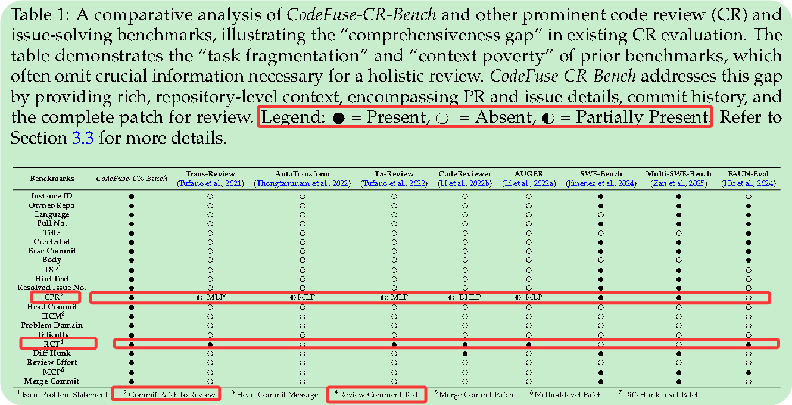

1. Task Fragmentation:

​	**`人类审阅者的认知过程——理解初始问题、定位代码更改中的潜在问题以及制定连贯的审查`**——通常被分解为孤立的子任务，例如注释生成或代码细化。这种碎片化阻碍了对端到端推理的评估，而端到端推理对于真正有用的自动审阅者来说是一项至关重要的功能。

2. Context Poverty:

​	现有基准测试通常只提供小型、独立的代码片段，并剥离了对有意义的审查至关重要的丰富上下文，例如拉取请求 （PR） 描述、链接的问题报告和更广泛的存储库结构。如果没有这种背景，模型就无法掌握更改背后的意图，从而使其审查变得肤浅。

3. Evaluation Narrowness: 

​	评估指标通常继承自自然语言处理 （NLP） 任务（例如 BLEU）。这些指标奖励表面的文本相似性，但未能评估评论的实质性质量。他们无法区分技术上有洞察力的建议和语法相似但不正确的建议，也无法验证审阅注释是否放置在代码中的正确位置。

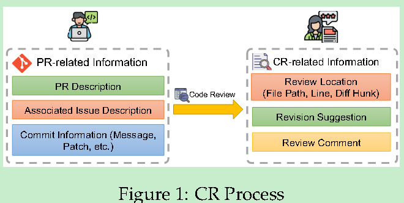

​	相比之下，如图 1 所示，典型的 CR 过程是一项整体推理任务。代码审查者收到 CR 请求和相应的 PR 信息，其中包括与 PR 相关的信息，例如 PR 描述和相关问题数据。基于这种丰富的上下文，审阅者通过撰写评论和修改建议来进行审阅，这些评论和修改建议构成了CR相关信息。

​	为了弥合这一现实与当前评估方法之间的差距，我们引入了 CodeFuse-CR-Bench，这是一个用于代码审查存储库级评估的 ComprehensivenessAware 基准测试。CodeFuse-CR-Bench 从头开始设计，用于对整个 CR 工作流程进行建模。它包含 601 个高质量实例，这些实例来自 70 个真实世界的 Python 开源项目。每个实例都是真实审阅任务的丰富、独立的快照，包括基本信息、PR 相关信息、CR 相关信息和存储库级上下文。**这种多方面的上下文使模型能够参与开发人员日常执行的那种整体推理。**

​	此外，为了超越狭隘的、以语法为中心的指标，我们为 CodeFuse-CR-Bench 设计了一个全面的评估框架。**该框架集成了基于规则的细粒度指标（用于评估位置准确性和语义相似性）和基于整体模型的评估（使用奖励模型和高级llm作为评委来对评论的整体质量、相关性和正确性进行评分）。**使用这个基准和框架，我们对综合 CR 任务的最先进的 LLM 进行了首次大规模评估。我们的结果建立了关键的基线，并揭示了llm在面对现实世界代码审查的复杂性时的当前功能和局限性。


综上所述，本文做出了以下贡献：

​	我们识别并描述了当前 CR 研究中的“全面性差距”，强调了任务碎片化、背景贫困和狭隘的评估指标如何阻碍进展。

​	我们介绍了 CodeFuse-CR-Bench，这是第一个全面感知的 CR 基准测试，它提供了丰富的存储库级上下文，以便能够跨九个不同的问题域评估端到端 CR 任务。

​	我们提出了一种新颖的、多方面的评估框架，将基于规则的精度与基于模型的质量评估相结合，以提供更全面的 CR 绩效衡量标准。

​	我们对多个最先进的llm进行了广泛的实证研究，为全面的 CR 提供了第一个稳健的基线，并为未来的研究方向提供了见解


## benchmark


### overview

CodeFuse-CR-Bench 包含 601 个 Python CR 任务实例，每个实例都经过精心策划，以反映现实世界的开发场景。

图 2 显示了典型 CR 任务实例的概述。

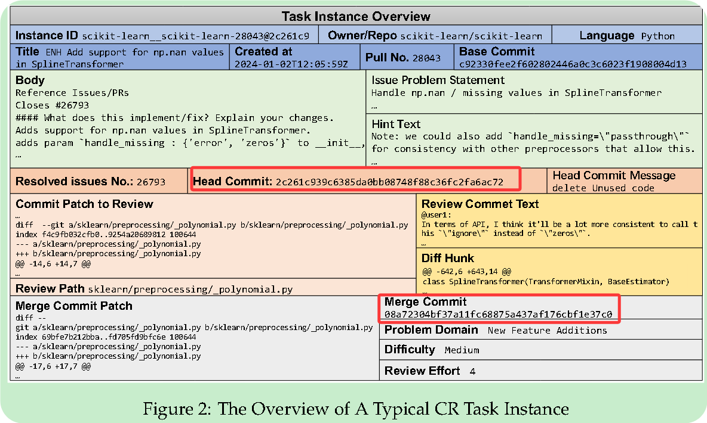

每个实例都与 22 个结构化字段相关联，如表 2 所示。

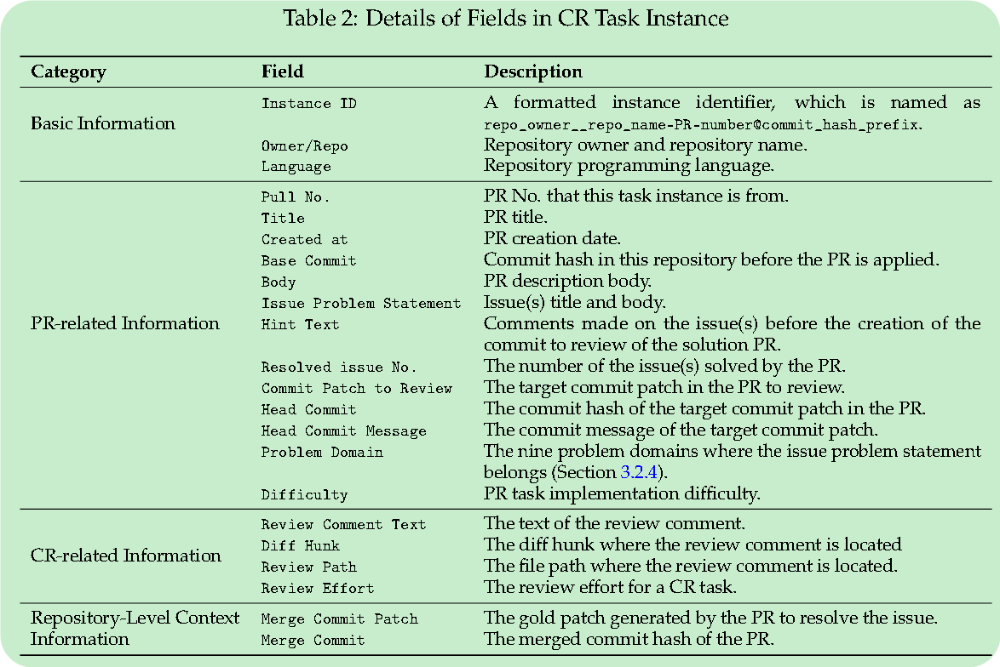


基本信息：实例 ID、所有者/存储库和语言，提供任务的基本标识。

PR相关信息：包含对理解变更意图和上下文至关重要的元数据，

CR 相关信息：捕获审阅过程本身，包括审阅评论文本、差异块、审阅路径和审阅工作量，从而能够分析审阅者行为和反馈质量。

存储库级上下文信息：提供跨文件推理和影响分析所需的更广泛的项目级上下文，包括合并提交补丁和合并提交。


### construction pipeline

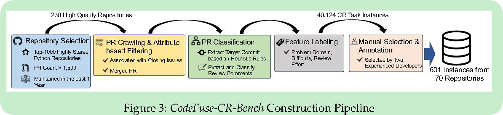

1. Repository Selection

我们首先在 GitHub 上**搜索前 1,000 个加星标的 Python 存储库**

为了保证仓库的质量并获取大量潜在的 CR 数据池，我们进一步按 PR 数量对项目进行排序，并过**滤掉 PR 少于 1,500 的项目**

此外，我们只保留去年（**从 2024-08-15 到 2025-08-15）维护的仓库，即过去一年有提交或 PR 记录的仓库。**

这个过程产生了 **230 个**符合我们活动和成熟度标准的 Python 项目。


2. PR Crawling & Attribute-based Filtering

（1） 只包括至少有 1 个closing问题参考的 PR;

（2）只**收集合并到主分支中的PR**。“已合并”状态表示与 PR 关联的代码更改已被接受并合并到其父存储库中。

使用 GitHub GraphQL API2 执行此过程。


3. PR Classification

由于**每个 PR 实例包含多个提交，因此我们这一步的目标是识别每个 PR 中的高质量提交，并提取其相应的高质量 CR 相关信息。**

​	首先，我们设计了**几个启发式规则来评估提交并给出评估分数**。启发式规则的详细信息如表 3 所示。

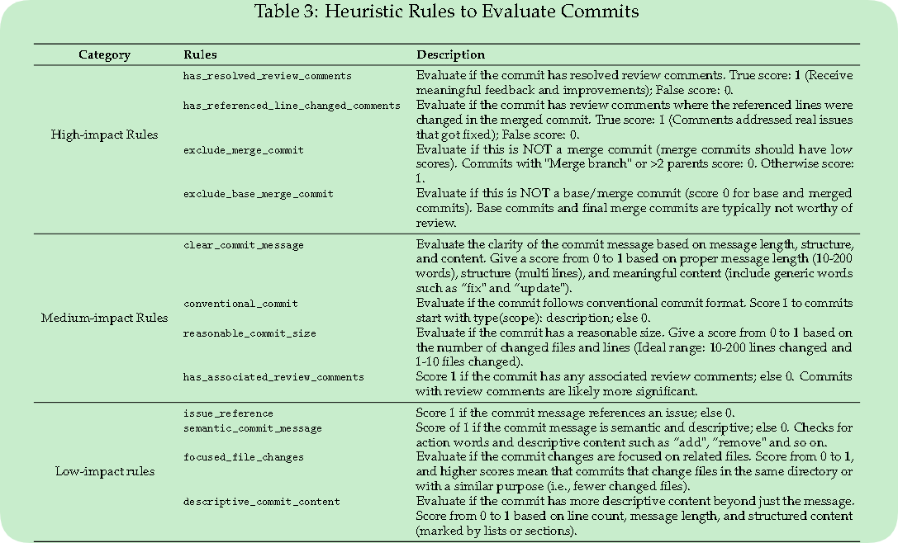

​	它们分为三种类型：高影响规则、中等影响规则和低影响规则。影响程度越高意味着越重要，在评分中越有权重（高权重：3.0，中权重：2.0，低权重：1.0）。我们对指示直接、可作的审查反馈的规则（例如has_resolved_review_comments）赋予了最高权重，因为这些是有意义的 CR 流程的最有力指标。与最佳实践和提交清晰度相关的规则具有中等权重，而次要规则如问题参考等指标的权重较低。通过实施加权总和评分，我们获得了每次提交的总分。根据总分，**我们对每个 PR 中的提交进行排名，并提取得分最高的目标提交。**

​	具体来说，我们**根据引用的行在合并的提交中是否实际更改，或者审查线程是否已解决、过时或折叠来提取和审查注释**。包含上述属性的审阅注释将将其相应的 CR 标记为高质量的 CR 任务实例。

​	

4. Feature Labeling

​	在这一步中，我们将三个属性进行分类：**问题领域、难度和审查工作量**。

问题域是指 PR 关联的问题陈述所属的类别，

参考解决问题的基准 SWE-Bench（Jimenez 等人，2024 年），**PR 问题领域分为九类**，如表 4 所示。

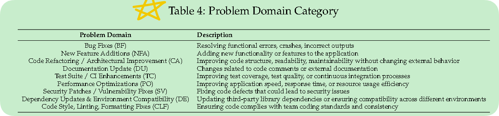

​	难度意味着实施 PR 的难度。它可以分为低、中、高。

​	审查工作量是指审查代码更改所需的工作量。它的等级是 1 到 5。

​	如果存储库包含上述三个属性的注释，我们直接使用存储库中的标签。否则，我们采用llm as judge的方法。我们利用 **Qwen3-235BA22B 模型**，从表 2 中的 **Title、Body、Commit Patch to Review 和 Head Commit Message** 字段构建提示作为输入，**对这三个属性进行分类**。最后，我们得到了 40,124 个 CR 任务实例。

​	

5. Manual Selection & Annotation

​	在这一步中，我们从通过上述筛选过程的 40,124 个 CR 任务实例中手动选择覆盖 9 类 PR 问题域的高质量 CR 任务实例作为基准。

​	具体来说，我们邀请了两位拥有 5 年以上 Python 开发经验的作者进行选拔。

​	首先，我们发现不可忽视的百分比，即有些审查注释 ，虽然链接到提交补丁中的源代码行，但**不太可能在下一轮中导致代码修订**。这种评论评论被视为噪音评论。

​	例如，如果评论：（1） 这是一个简单的情况（例如，“对我来说看起来不错”、“谢谢”或“很好”）;（2） 仅请求对代码逻辑没有影响的格式更改（例如，“修复缩进”、“添加空格”）;（3） 请求添加测试（这些测试不会更改正在审查的代码）;（4） 要求澄清或解释而不建议更改（例如，“请解释”、“这有什么作用？（5） 引用以前无法识别的评论（例如，“与以前相同”、“见上文”）;（6） 仅请求添加注释或文档（例如，“添加 Javadoc”、“记录此方法”）;（7） 难以识别的（例如，“至少在这里很明显，TreeNode 实现者的 equals 方法很重要”），它被认为是一个噪音和不相关的review comment。

​	此外，我们会删除其**问题陈述包含图像、外部超链接、对特定提交 SHA 的引用以及对其他拉取请求或问题的引用**的实例

​	**问题陈述中少于 40 个单词**的实例也会被删除。

​	根据上述规则，我们筛选出了 **7,086 个实例**。之后，参考 SWE-Bench （Jimenez et al.， 2024） 和 Multi-SWE-Bench （Zan et al.， 2025），我们**设计了一份关于实例质量评估的问卷**，并要求两位开发人员完成每个实例的问卷。

​	该问卷涵盖以下领域：（1）问题陈述和补丁对齐;（2）审查范围和评论范围;（3）贴片中发现的缺陷;（4）难度和复习工作;（5）整体贴片质量和风险;（6）数据集适宜性;（7） 信心。因此，我们通过手动标注从 70 个项目中选择 601 个高质量实例。

​	


