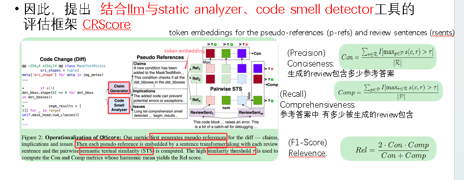
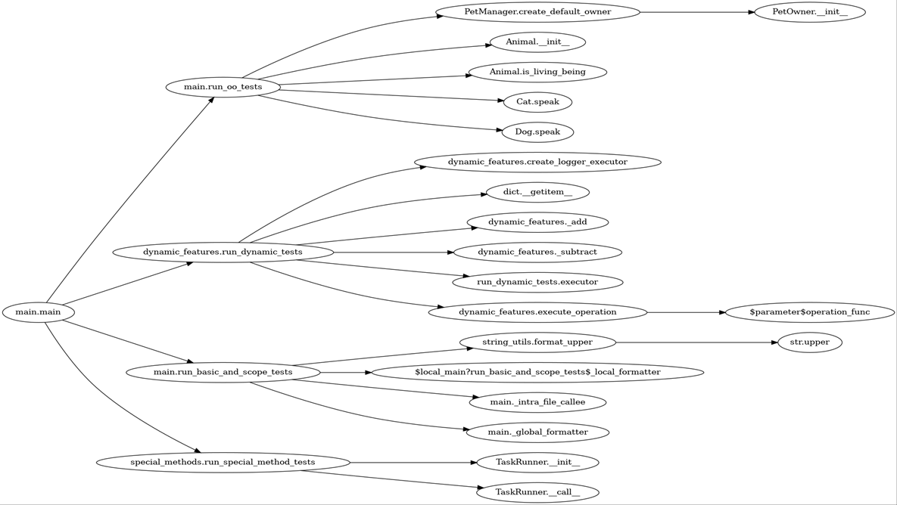
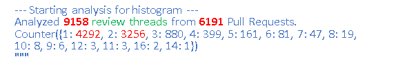
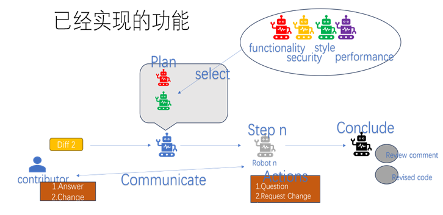
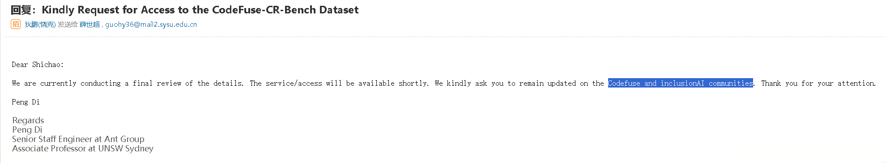

## 前辈们的相关工作  

 自**21年 Tufano**开始将 **encoder-decoder**引入code review领域后，之前关于code review的研究工作 主要集中在 **预训练和后训练**。

​	**22年Tufano**接着在**T5**上做了预训练，

​	22年微软亚研院Zhiyu Li提出**CodeReviewer**,提出来三种新的预训练形式，主要考虑到**diffhunk格式**更接近真实情境，在**CodeT5**做预训练。

​	22年 软件所提出**Auger** 主要关键设计是将**“哪一行值得评论**”的信息**显式编码为特殊标记 <review_tag>** 注入模型输入，使模型“看齐人类注意力”，只围绕高亮行发言。 其对比了codebert、t5、lstm等。

​	

​	24年，Université de Montréal提出了一个 **DISCOREV**， 其主要考虑到

传统的代码审查任务自动化方法通常将review任务**孤立地处理**，而**三个主要代码审查任务之间是共享知识的**，其设计了 Teacher-Student model，做了**跨任务知识蒸馏**。

​	24年，还是软件所 探索了 输入表示对review comment生成的影响，通过**微调CodeT5** 深入评估**不同输入因素**（如代码变更、审查标签等）及其**不同的表示方法**，对模型性能产生的具体影响。不过本篇文章发表在 ASE-journal。ccfb

​	24年，卢森堡大学，提出过一个CodeAgent用于**自动化代码审查**的新型多智能体大型语言模型（LLM）系统。但其主要是通过**模拟公司架构**如首席执行官、首席技术官、审查员和编码员等模拟了人类协作的复杂性。与CodeT5、GPT-4等进行了实验对比。

​	25年，**Gabriele Bavota** **率先**探索了 **强化学习PPO**方法在生成review comment和revised code的应用。设计了奖励模型，然后微调的是CodeLlama。

​	25年，陈俊凯**师兄**提出来**ClearCRC**，作为code review comments的清晰度的评估指标。主要通过分析文献综述、与行业人士访谈、对从业人员在线问卷调查等方法。同时实验评估了机器学习、深度学习以及llama。

​	25年，**字节**提出**BitsAI-CR**，主要由两个**微调的 LLM**组成，第一个llm进行规则检查、第二个二次验证，通过**数据飞轮**，最终形成了一个code review**审查规则分类**。也搞了个“Outdated Rate” (过时率) 评估指标。

​	25年，**Meta**研究使用ai辅助对reviewer comment生成revised code。主要是提出一个内部的benchmark，然**对 llama的大小规模参数模型进行微调**，并**与gpt-4o对比**。

​	25年，提出一个 基于主动学习方法构建的， 专注于安全的review comment数据集SeRe。

​	25年9月，蚂蚁构造了数据集**CodeFuse-CR-Bench**，同样未公开。主要目的在于反应现实世界CR**完整的上下文**的特点。包括600个Python实例。对Gemini 2.5 Pro、Claude等模型，在**bm25的rag检索**下做了消融实验等。

​	

​	25年，Universit ́e de Montr ́eal提出将 **static analyzers与llm相结合**进行review comment generation。旨在**利用静态分析的精确性和 LLM 的全面性**，从而实现更有效和更像人类的代码审查。在三个阶段整合了 静态分析工具 衍生的见解——数据准备（数据增强训练，DAT）、推理（检索增强生成，RAG）和后推理（输出的朴素串联，NCO）。 不过，这个发了个MSR，ccfc。

​	25年，**cmu**提出了**CRScore**， 指出**当前的review comment评估指标依赖于与给定code diff的人工编写的reference的比较**，如BLEU。不符合**代码审查是一个一对多的问题的特性**。 <u>其利用llm与静态分析器首先生成一个 pseudo-references，然后计算各生成部分与pseudos的语义文本相似性，最后算出类似于用于分类和检索的精度，召回和F-评分 分数。</u>从而评估了全面性、简洁性、相关性。 不过，发的是NAACL,ccfb.

> 

​	25年，cmu接着提出**RL框架 ** **CRScore++**,主要目的在于同时利用 llm的主观信号 和 verified信号作为training reward进行训练。实验展示了CRScore++ 通过**将 sft以及一个teacher model的RL critique结合** 来**提升weaker student model**。

​	

## 研究plan

主要涉及如下几点，

1.先前的论文大多忽略了 **`对完整上下文信息的有效利用`**， 真实场景中，人类审阅者的认知过程多为——理解初始问题、定位代码更改中的潜在问题、综合理解推理制定出审查。

​	因此，受论文CoSIL的影响，设计如下细粒度的上下文搜索。

>* 首先根据file进行 file graph 构建（depth-limit）,并做字典 funciton_name -> content。
>
>* 然后利用 静态分析工具pyre，查询一个函数f 的 调用者callers，以及被f调用的callees。构造一个有向无环图DAG（递归调用不重复加入）。
>* 制造一个 tree_search_agent, 给定一个函数f， agent对于根节点f，若理解则直接总结要点，否则递归理解 f调用的函数。 最终将整体 要点合并。
>* reviewers agent可以动态给出参数，将tree_search_agent作为tool进行调用，从而给出好的 review comment以及 suggest revised code。

> 如下是DAG
> 

2. 在真实场景中，高质量的review可能会经过多轮的讨论对话。

   > 如下是，分析的pytorch repo的9158个review Threads，发现只有一天reveiw comment的只占4292
   >
   > 

   然后初步设计并实现了了如下的**multi-agent**， ***<u>首先制定一个plan，可以涉及功能性、性能、安全性、风格等四个方面的reviewer agent，然后引入一个developer agent。reviewer与developer多次交互，最后明确答案</u>***。（这里为了减少模型自身偏见，**`reviewer与developer用不同的llm`**）

3. 爬了github language:python 的前10 star 项目，共计 cnt: 4882 条 

数据格式：<origin_code,code_diff_change,review_comment,revised_code>

​	用**qwen-7b**大致简单prompt分类后结果如下，

​	ounter({'Maintainability': 208, 'Style': 199, 'Typing': 128, 'Tests': 77, 'Correctness': 63, 'Performance': 48, 'Dependencies': 15, 'Security': 12, 'ResourceManagement': 12, 'Documentation': 6, 'Concurrency': 6, 'Convenience': 5, 'Conventions': 2, 'Dependencie': 2, 'Syntax': 1, 'Other': 1, 'Deprecation': 1, '其他合理分类': 1, 'Dependability': 1, 'Docstring': 1})

​	经人工确认后，security都是误报。

>所以：
>
>* 是否是 repo选的不对，因为**<u>*the-algorithm-python，基本全是加一个test，或者类型标注的*</u>**。 拟打算 根据CodeFuse-CR、SWE-bench爬取的repo再爬一次确认下。
>
>* 直接不要多个方面的reviewer，完全可以**只用一个agent并结合下述工具**
>
>  **Ruff**† 生成 linter 反馈，以识别代码效率问题、复杂性测量和安全漏洞，
>
>  使用 **Pyscent**‡ 检测模式来检测代码气味，诸如Long Method and Large Class等。
>
>  然后该agent，先定位具体要review的行，然后再给出结果。

4. **`数据集仍在艰难构建中`**，目前主要难点似乎在repo选的不好， 但不知道这种需要大量上下文信息的数据究竟是否存在。已经发了邮件问CodeFuse-CR-Bech,最坏的打算是照着这个搜集下，以及人工精选100条数据。

   >
   >
   >will be available shortly.

5. 关于评估，打算采用**BLEU**、 然后**crystalBleu**。以及**llm-as-judge**如上面论文**CRScore**。

   考虑类似agentic RL进行增强。

   考虑将目标review line，以及是否改动作为评估里的一种， 但其实CodeFuse-CR里面以及有做过类似 基于规则的评估。

6. 潜在想法

   > 1. 是否能用**llm 进化 所用的static analysis tool**，从而避免analyer中规则僵化、过时的问题(对于不同版本的code，llm能否做出对analyzer规则的调整、 或者对于新出现的风格，llm能否定制进化analyzer的规则，就从diffhunk和comment中提取规则来完善static analysis tool)
   >
   > 2. 师兄说的，改为调研 **完全由agent完成的code pr**的特点、处理这些pr reviewer需要关注什么，目前的自动化code review能否有效评估 agentic PR

​	

