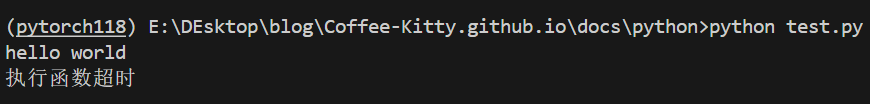

> 在开发时，有时我们需要限制某个函数的执行时间，避免其运行时间过长导致程序出现问题。
> python中有一个名为func_timeout的库，帮助我们实现这个功能。

## quick_start

1.安装

pip install func_timeout -i https://pypi.tuna.tsinghua.edu.cn/simple

2.

```python
from func_timeout import func_set_timeout
import func_timeout
import time


@func_set_timeout(3)
def task():
    print('hello world')
    time.sleep(5)
    return '执行成功_未超时'


if __name__ == '__main__':
    try:
        print(task())
    except func_timeout.exceptions.FunctionTimedOut:
        print('执行函数超时')

```




## 进一步探索

