# Code Agent

这个目录用于整理 code 相关的 swe agent 系列论文

## 1. **Benchmark**：code agent 评测任务、数据集、排行榜、验证方式。

SWE-bench团队自己的更新入口，页面里直接挂了SWE-bench、Verified、Multilingual、Multimodal、Lite 等 benchmark家族入口，也会发 mini-SWE-agent、SWE-smith 这类相关更新。
https://www.swebench.com/blog.html

### **SWE-bench-(lite)**: 
ICLR24, 普林斯顿
基于github issue及其对应pr的任务
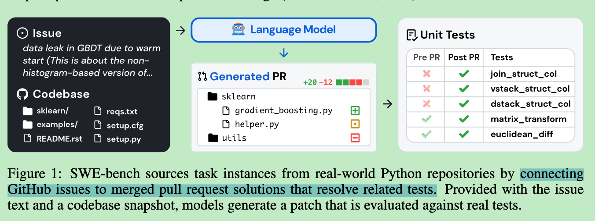
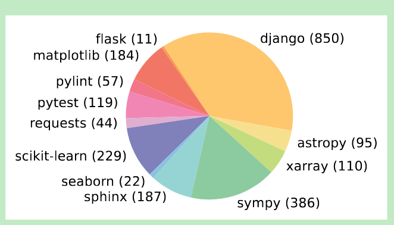
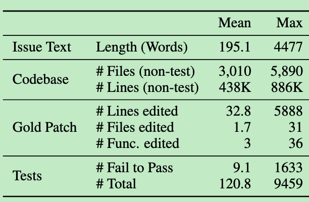
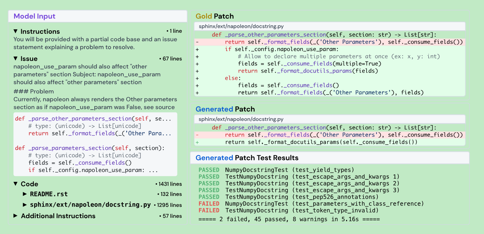

### **SWE-bench（verified）**:
openai
500 个 human-validated samples，不是独立论文

openai官方解释报告：https://openai.com/index/introducing-swe-bench-verified/

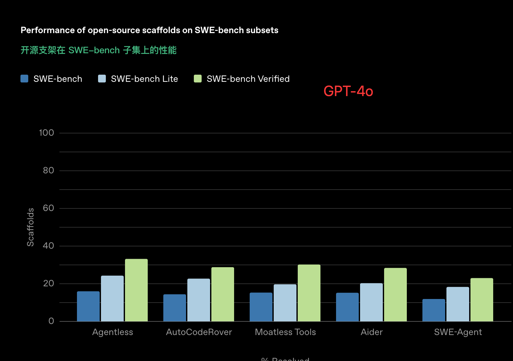

### Multi-SWE-bench/ Multi-SWE-RL: 
nips25,字节
**多语言版的现实 issue 修复基准，补足 SWE-bench 偏 Python 的问题。**

* 包含 7 种广泛使用编程语言中的 1,632 个 issue：Java、TypeScript、JavaScript、Go、Rust、C 和 C++，进行严格的人工验证，与 SWE-bench Verified 的标准保持一致。
* 作为 Multi-SWE-RL 社区的初始贡献，作者发布了一个包含 4,723 个容器化 issue 修复实例的数据集，覆盖 7 种编程语言。每个实例都配备了可复现的执行环境，使其可以直接用于真实软件场景中的强化学习 agent 训练。

MagentLess：多语言改造版 Agentless；
MSWE-agent：多语言改造版 SWE-agent；
MopenHands：多语言改造版 OpenHands
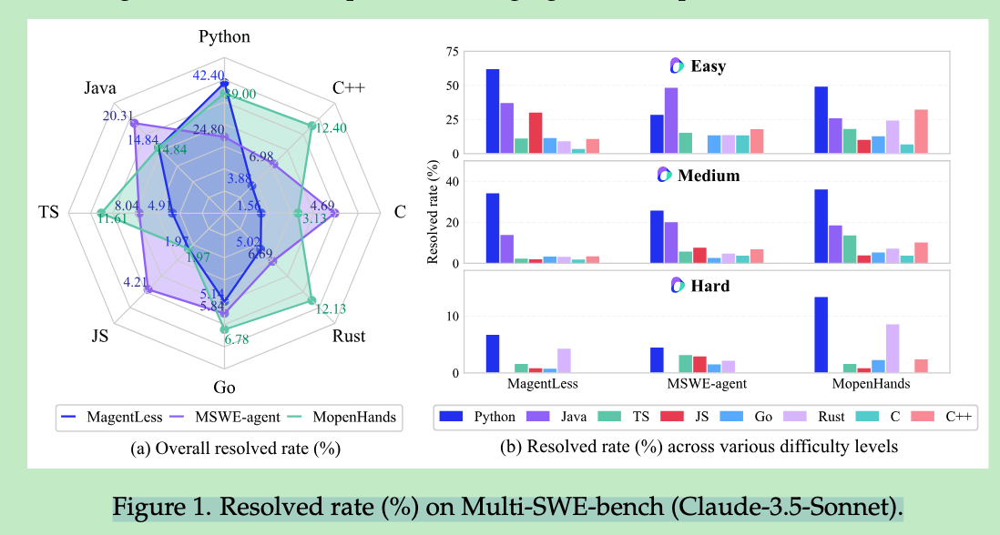


### **SWE-bench（Pro）**:
arxiv ,scale AI
难度更高的基准测试。测试当前 AI agent 是否真的具备长程工程能力。

SWE-BENCH PRO 包含 1,865 个问题，这些问题来自 41 个正在活跃维护的代码仓库，覆盖商业应用、B2B 服务和开发者工具等多种类型。
**该基准被划分为三部分**：
1）公开集：来自 11 个仓库，问题可以公开访问；
2）保留集：来自 12 个仓库；
3）商业集：来自 18 个专有仓库，这些仓库来自与作者团队有正式合作关系的早期创业公司。
这个基准中的任务具有 **长周期特征**：即使是专业软件工程师，也可能需要数小时到数天才能完成。这些任务通常涉及多个文件的修改，以及大量代码变更。
所有任务都经过**人工验证**，并补充了足够的上下文，以确保这些任务是可以被解决的。


**把 SWE 评测往“更大规模、更抗污染、更企业真实”的方向推进。它用代码行数、多文件修改、私有仓库和人工验证来近似保证难度**

> 难绷，2026.7.8， openai发文章，声称swebench pro约30%任务存在broken/不可靠问题。https://openai.com/index/separating-signal-from-noise-coding-evaluations/


### **SWE-Lancer**
ICML25， openai

一个包含 1,400 多个来自 **Upwork** 的**自由职业软件工程任务**的基准测试，这些*任务对应的真实世界报酬总价值为 100 万美元*。

SWE-Lancer 包括两类任务：
1）**独立工程任务**：从价值 50 美元的 bug 修复，到价值 32,000 美元的功能实现不等。模型需要生成**代码补丁**。
2）**管理类任务**：模型需要在多个技术实现方案之间做出选择。模型扮演**技术负责人**。
独立工程任务通过 端到端测试来评分，这些测试由有经验的软件工程师进行了 三重验证。
管理类任务则通过比较模型的选择与原先实际雇佣的工程经理所做选择是否一致来评估。
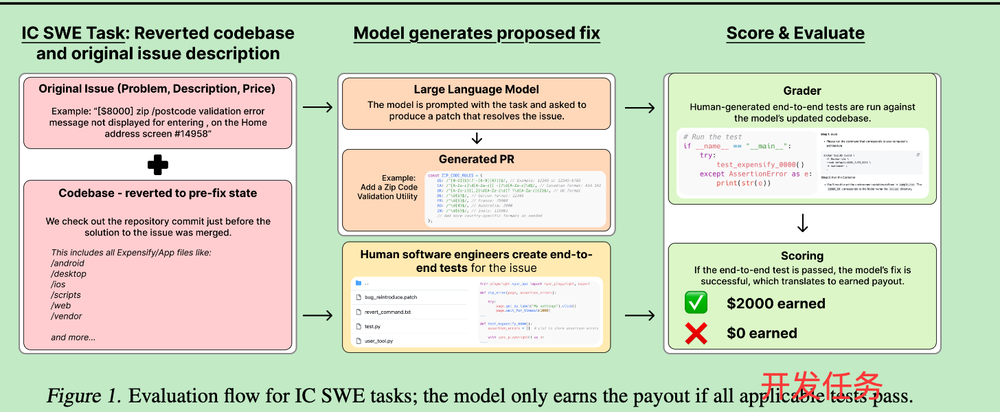
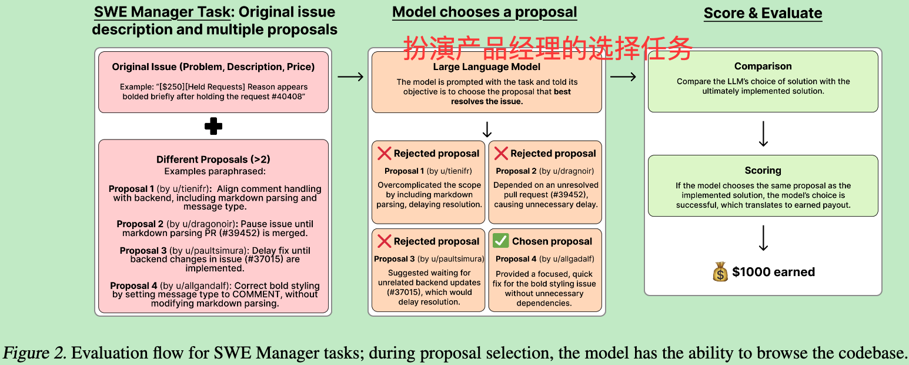


> SWE-Lancer：基于 Upwork 真实自由职业软件工程任务构建的 benchmark，用任务金额衡量工程任务的现实经济价值。

> 还有一个测试亮点：专业工程师写浏览器自动化 E2E 测试，让测试像真实用户一样操作产品，然后判断修复是否真的有效
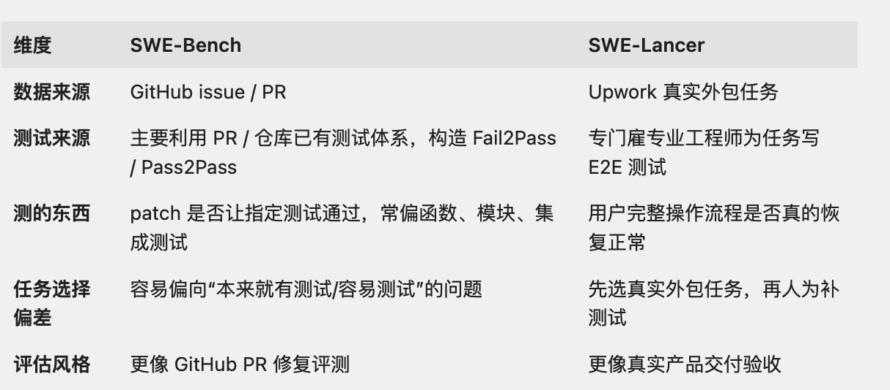
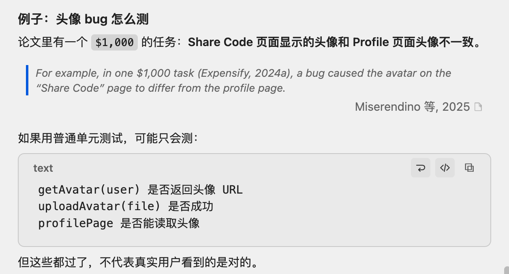
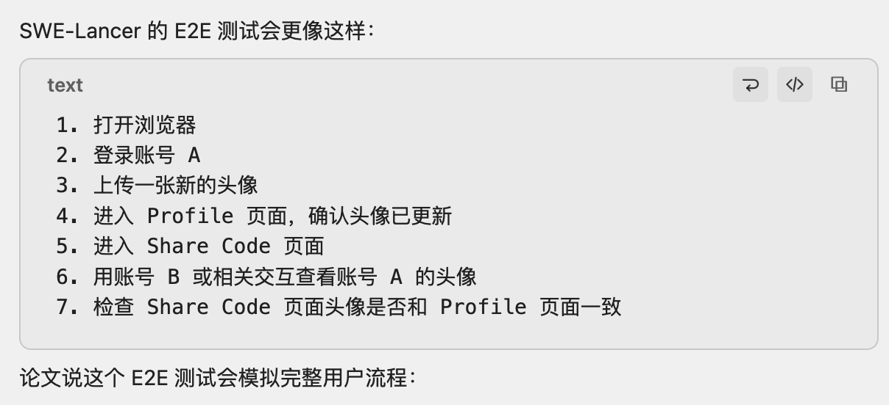
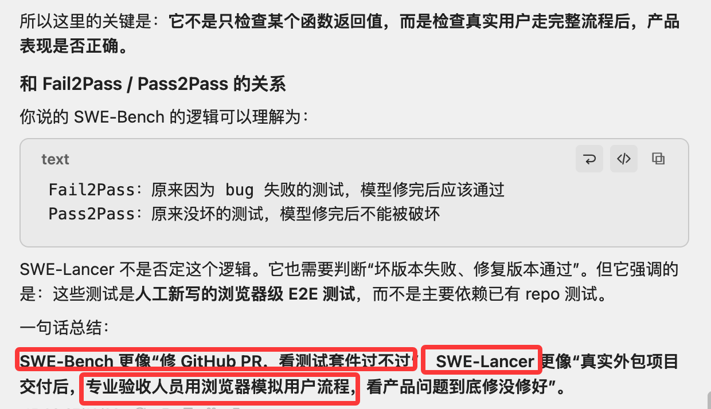

### **SWE-Skills-Bench**
arxiv26,nju
> 把 SkillsBench 的“技能评估思想”移植并强化到真实软件工程场景中。 是 SWE agent benchmark 里专门研究“技能注入有效性”的基准。

SWE 专用：49 个真实 SWE skills，约 565 个任务实例。
成对对照实验：每个任务都跑 “with skill” 和 “without skill”。

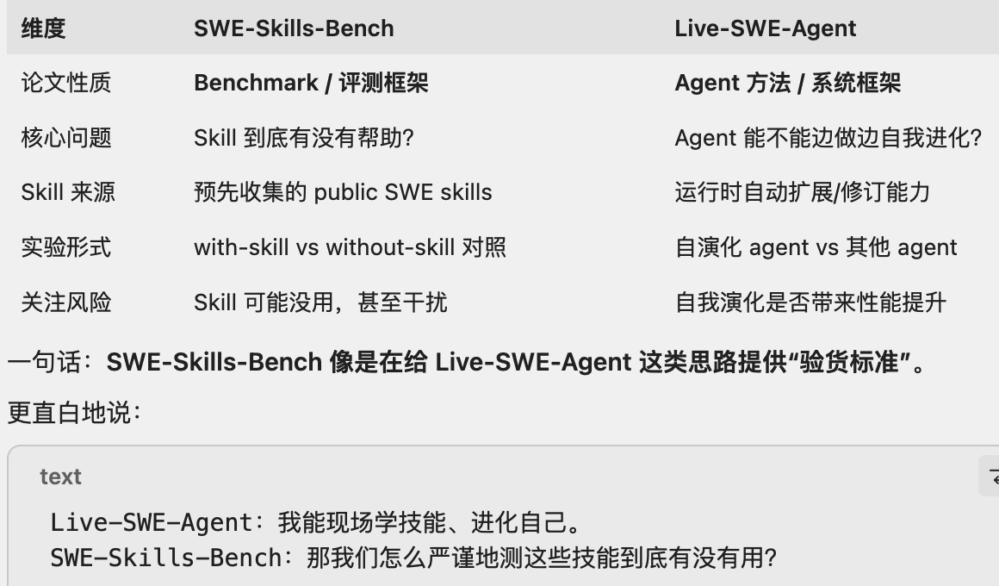

**1. skill是否能够帮助agent满足任务需求？**
> 软件工程本质上是需求驱动的：一个任务是否成功，取决于其规格说明中陈述的每一条验收标准是否被满足；而单元测试则是这些标准的可执行编码。

本文采用一种 **需求驱动的**评估方法：每个任务都锚定在一份需求文档上，该文档定义任务范围和验收标准；然后，基于这些标准系统性地推导出确定性的单元测试验证器，从而建立从需求到测试结果的完整可追踪关系。

基于这一方法，本文提出 SWE-Skills-Bench：一个**旨在隔离 agent skills 对软件工程任务边际效用**的 benchmark。
我们**从公开仓库中整理了 49 个 SWE skills，并将每个 skill 与一个固定 commit 的真实 GitHub 项目配对，在受控的 “with-skill” 与 “without-skill” 条件下进行评估**。所有任务实例都通过确定性的、基于执行的检查进行验证，不依赖 LLM-as-judge 评估。

**2. 与skillsbench的关系？**
SkillsBench 朝着“将 skills 作为一等对象进行 benchmark”迈出了重要第一步，它通过比较 agent 在不同 skill 条件下的表现来评估 skills。
不过，它并不是专门面向 SWE 的：软件工程只占其任务集中的一小部分，而且这个 benchmark 并不是围绕真实开发中的核心成功标准来设计的——也就是在基于代码仓库的工作流中，显式需求是否被满足。

**3. 数据集基本构造流程**
如图，public skills的来源是mcpmarket category leaderboard。
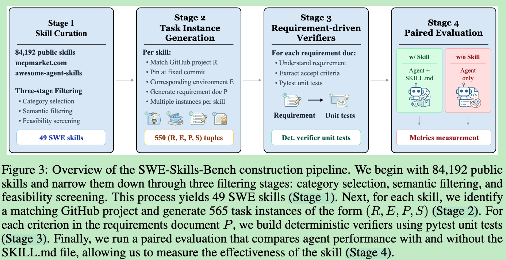

> - 从公开replication可以看出：与swebench那些repo挺不一样的。
```text
一共 49 个任务 对应 44 个不同的 GitHub repo。不是 49 个 repo，因为部分 repo 承担多个任务。44 个 repo 是：
pytorch/pytorch
michaelasper/upgradle
tdd-starters/python
babybuddy/babybuddy
spring-projects/spring-petclinic
TryGhost/Ghost
modelcontextprotocol/servers
encode/httpx
ericgazoni/openpyxl
vercel/turbo
actions/starter-workflows
metabase/metabase
prometheus/prometheus
mahmoud/boltons
oven-sh/bun
saleor/saleor
celery/celery
fastapi/fastapi
lballabio/QuantLib
langchain-ai/langchain
quantopian/pyfolio
facebookresearch/faiss
apache/spark
milvus-io/milvus
stanford-crfm/helm
getsentry/sentry
pypa/packaging
fluxcd/flux2
linkerd/linkerd2
github-changelog-generator/github-changelog-generator
kubernetes-sigs/kustomize
nrwl/nx
bazelbuild/bazel
istio/istio
koalaman/shellcheck
gitlabhq/gitlabhq
PostHog/posthog
open-telemetry/opentelemetry-python
open-telemetry/opentelemetry-collector
google/slo-generator
benfred/py-spy
grafana/grafana
dbt-labs/dbt-core
Dao-AILab/flash-attention
```

### SWE-CI
arxiv26, 中山
#### **引言：**
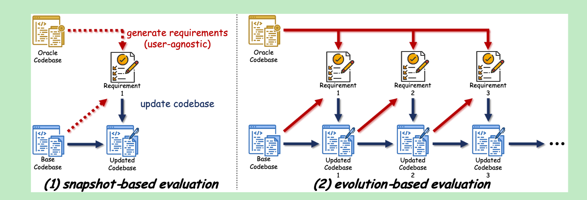
当前**主流的基准测试普遍采用一种快照式评估协议**：智能体接收一个单一且完整的需求，然后一次性给出解决方案。
在这种范式下，一个通过硬编码实现脆弱修复的智能体，与一个编写出整洁且易于扩展代码的智能体，可能都能通过相同的测试套件——二者在**可维护性方面**的差异完全无法显现。
只有当代码库需要继续演化时，这种差异才会暴露出来：新的需求不断出现、接口发生变化、模块需要扩展。
此时，早期设计决策所带来的成本会不断累积；如果智能体经常生成结构不良的代码，那么后续的每一次修改都会变得更加困难，最终使其无法跟上软件演化的步伐。
**insight**: 只有**通过长期的软件演化，才能揭示智能体维护代码的能力，因为过去决策造成的后果会在连续的代码变更中不断累积**。


#### **摘要：**

首个专门评估 **AI智能体维护仓库的能力** 的测评基准。
SWE-CI 的核心洞见在于：好的维护不仅要确保当前代码的功能正确，更要**尽量降低代码在未来持续保持功能正确的开发难度**。

1. SWE-CI从Github中筛选了100对高质量代码提交版本。其中，**每一对代码提交版本都包含一份基准代码和一份参考代码**，*它们选取自同一个代码库的不同时期*。
**SWE-CI要求AI智能体从基准代码开始维护，并以完全通过参考代码的中的测试作为目标。**
通过量化代码演化序列持续保持功能正确性的程度，SWE-CI可以有效的衡量AI智能体维护代码的能力。

2. SWE-CI 采用一种架构师—程序员（Architect–Programmer）双智能体评估协议：智能体从基础提交开始执行持续集成循环（CI-loop），在循环中反复生成需求、修改源代码并运行测试，最终目标是通过与目标提交相关的全部测试。
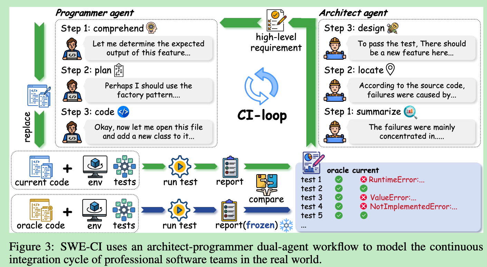

3. 一个代理评估指标——EvoScore（演化分数）。它通过衡量代码在未来修改中的功能正确性来反映其可维护性：如果智能体早期作出的决策有利于后续演化，它将获得更高的分数；相反，如果智能体不断积累技术债务，其表现就会逐步下降
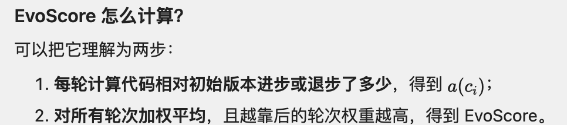
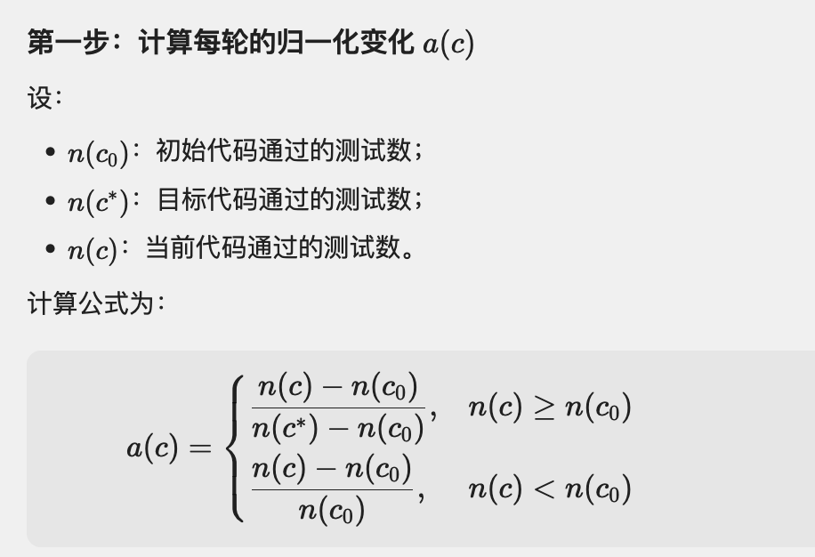
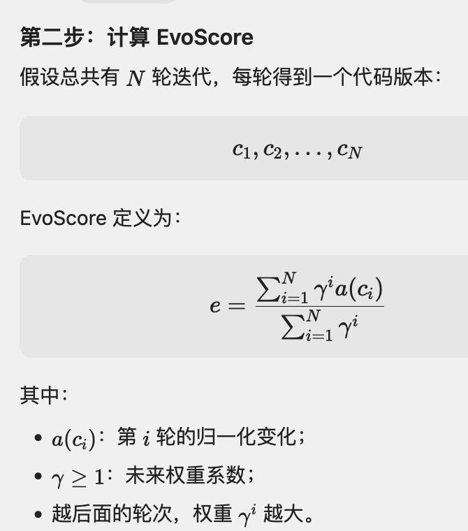
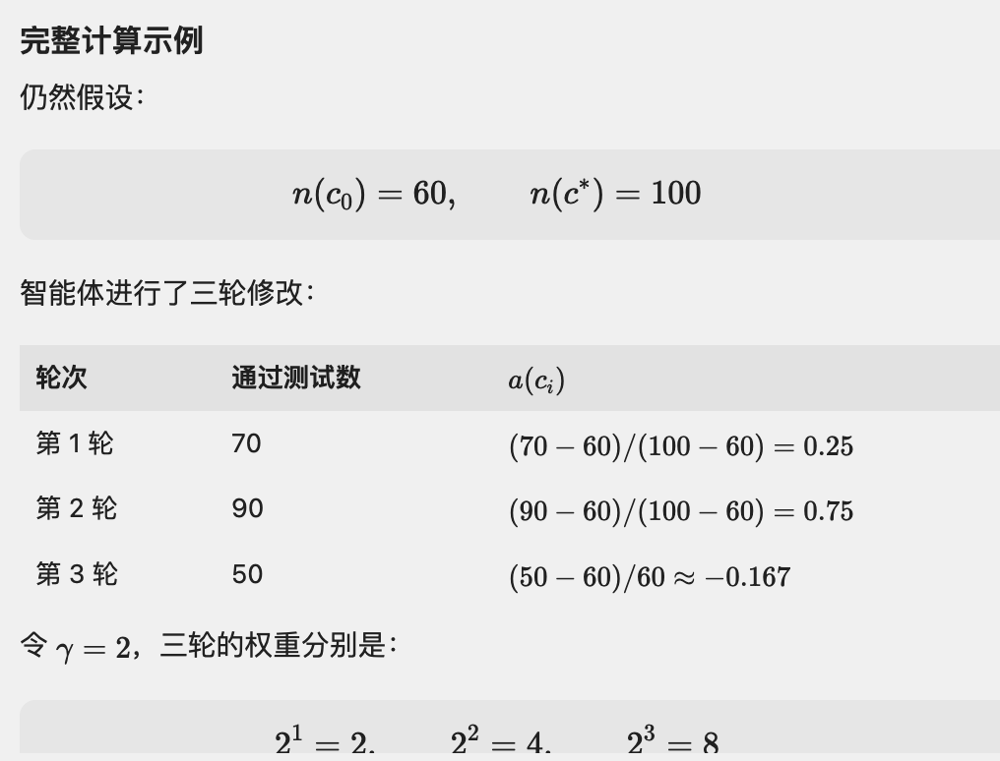
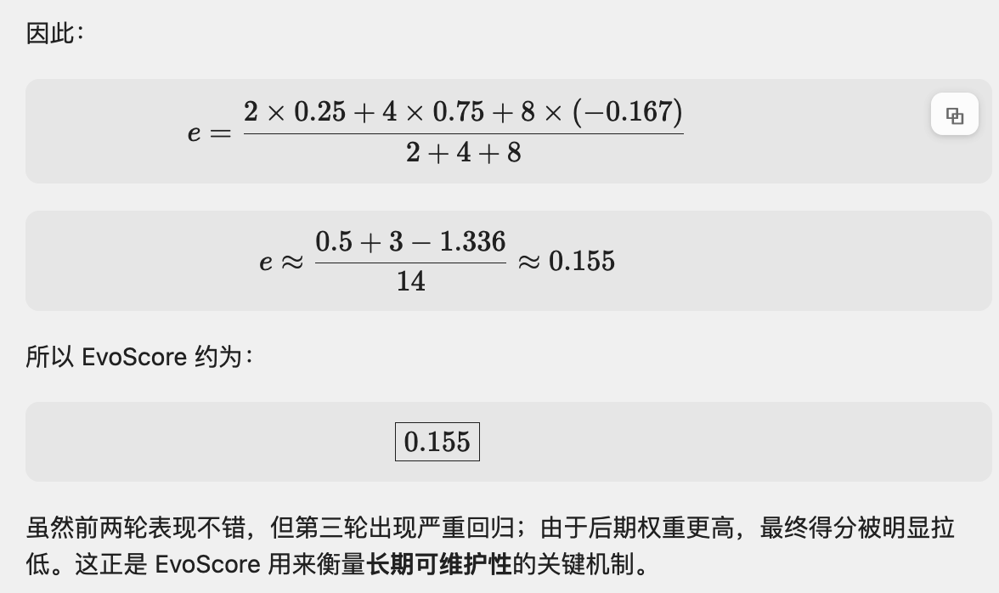

#### 数据集构造
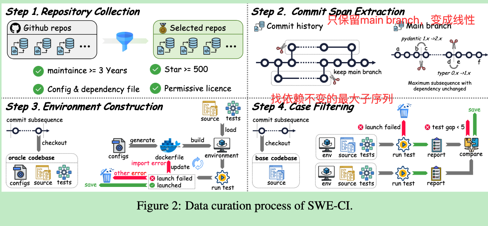


### sweperf、swefficiency、formulacode

比较熟悉了，略


### SWE-bench Multimodal
ICLR25，斯坦福

>SWE-bench 包含了一些常用的后端开发和数据科学库，但许多其他应用场景并未得到体现。
>此外，用户界面设计、游戏、虚拟现实和数据可视化等许多软件开发领域都依赖视觉资源

用于评估系统修复面向用户、具有**视觉特征**的 **JavaScript** 软件中错误的能力。

**SWE-bench M** 包含从 17 个 JavaScript 库中收集的 617 个任务实例，这些库涉及网页界面设计、图表绘制、数据可视化、语法高亮和交互式地图等应用。
每个任务实例的问题描述或单元测试中都至少包含一张图像。
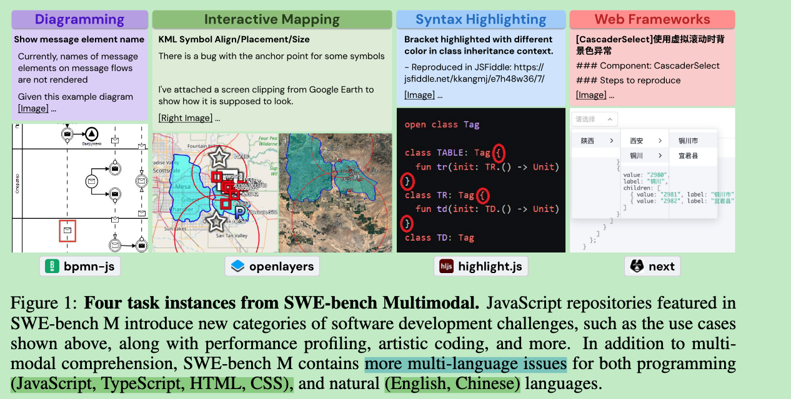


#### 数据收集过程
还是老一套，筛选repo筛选pr，然后关联PR跟issue，进一步筛选这些 [issue(s), PR] 配对，只保留 **issue 或测试代码中包含视觉资源**的样本。
具体而言，作者检查 issue 文本和测试补丁中是否存在指向图像（如 JPG、PNG）或视频（如 GIF、MOV）的有效超链接。

> 人工检查发现，少量测试存在不一致现象：对于同一个补丁，某项测试在多次评估中可能有时通过、有时失败。SWE-bench 中也曾报告过这种现象


### SWE-Bench-live
nips25, microsoft

1.提出了 REPOLAUNCH。这是一条完全自动化的基准构建流水线，能够将数据整理、执行环境配置和测试验证无缝整合为一个统一且可扩展的系统。
2.swebenchlive数据集，一个可实时持续更新的基准
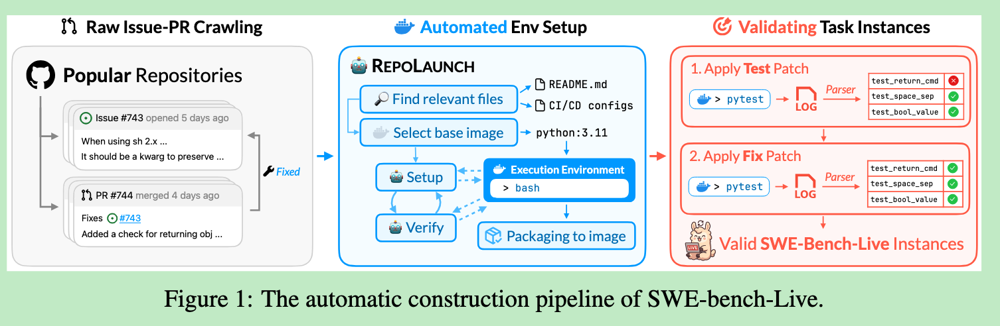

> 亮点就repolaunch和月更新swebenchlive

## 2. **Method**：具体 code agent 系统、训练方法、工具接口和工程框架。

### agentless
fse25, UIUC

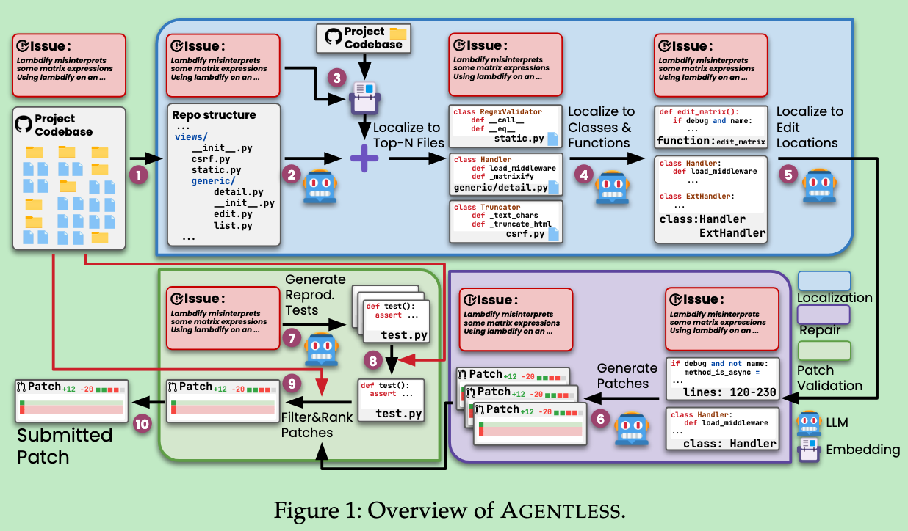
一个pipeline，略


### **SWE-agent** 
nips24, 普林斯顿

基于简单react loop的 通用repo-level agent


### openhands
ICLR25, UIUC

SWE-agent 更像是“专门做软件工程/修 GitHub issue 的 agent”。
OpenHands 更像是“通用 AI 软件开发者平台”，不仅能修代码，还能跑命令、写 Python、浏览网页、多 agent 协作、做多种 benchmark。

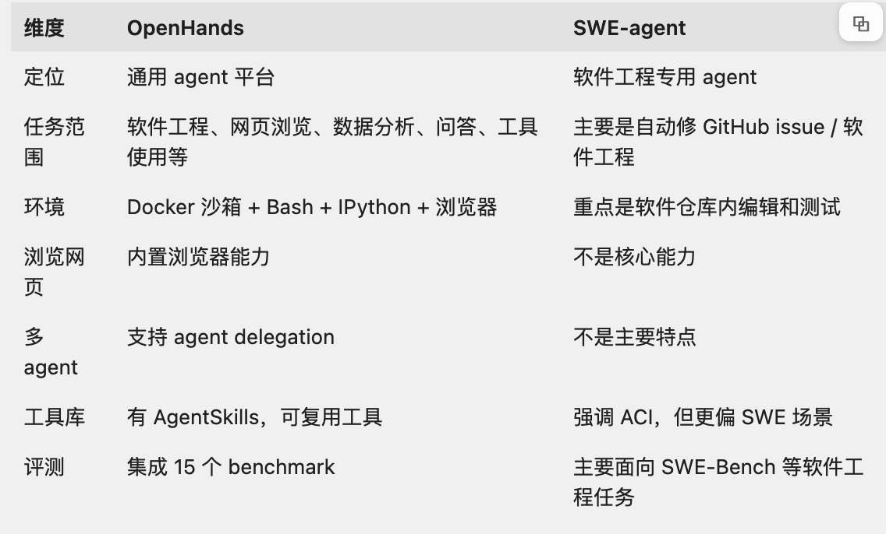

略
### Live-SWE-agent
arxiv25, UIUC
核心insight:**软件智能体本身也是软件系统**，而现代基于 LLM 的软件智能体已经天然具备在运行期间扩展或修改自身实现的能力。
> 在普通软件工程 Agent 的循环里，加入“自己写工具、调试工具、使用工具”的能力，让 Agent 针对当前 bug 动态扩展自己的工具箱。

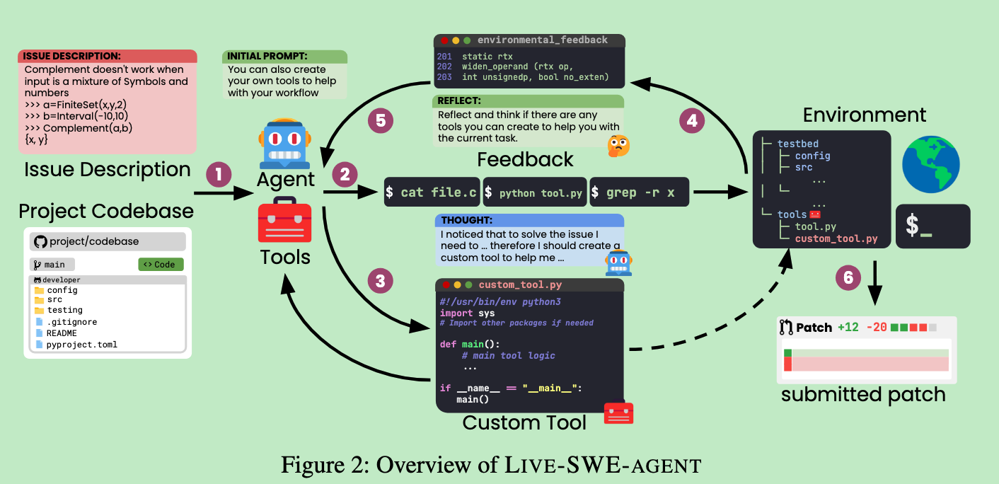

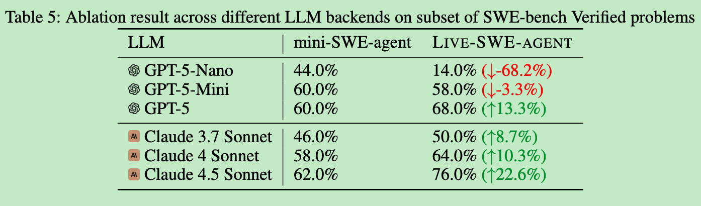

### SWE-RL
nips25, meta
>DeepSeek-R1 及其后续工作主要关注将强化学习应用于竞赛编程和数学问题。
>本文提出了 SWE-RL，这是首个将基于强化学习的大模型推理扩展到真实世界软件工程场景的方法。


### SWE-Fixer

### SWE-Gym

### SWE-smith


### SWE-Master

### SWE-World

## 3. agentic rl:
### AgentFlow
AgentFlow: Trainable Flow Engineering for Agentic Reinforcement Learning 


### AgentGym-RL
AgentGym-RL: Training LLM Agents for Long-Horizon Decision Making through Multi-Turn Reinforcement Learning


