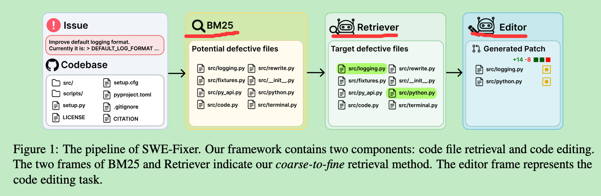
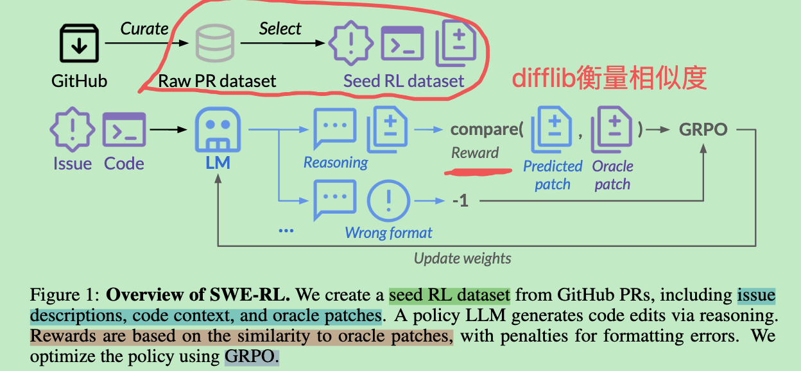
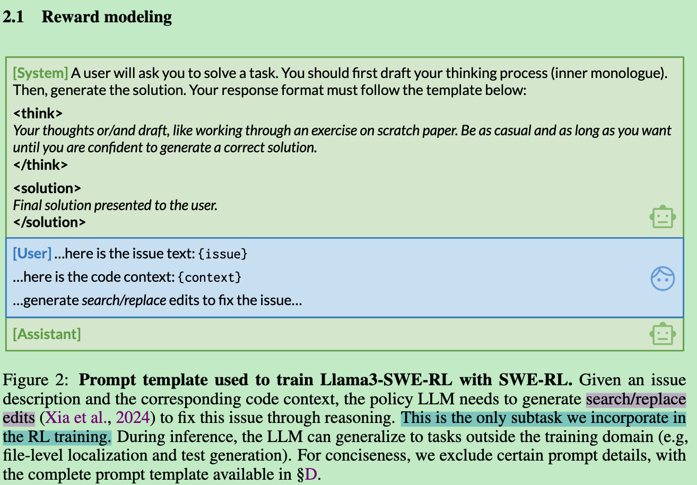
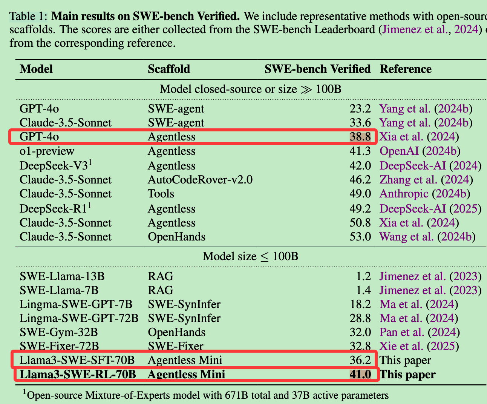
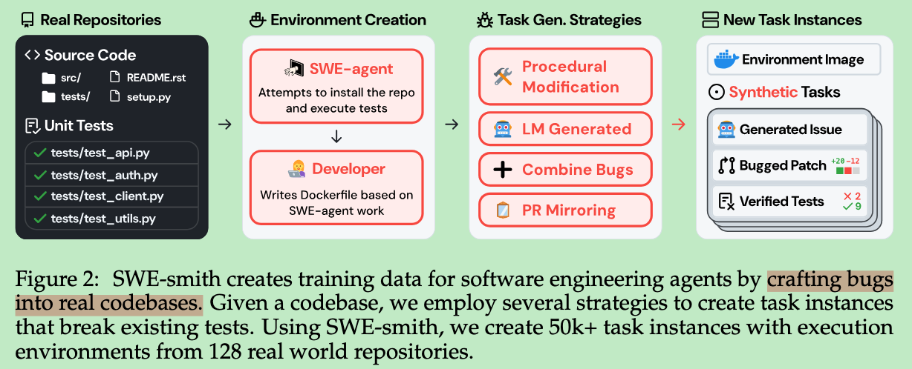
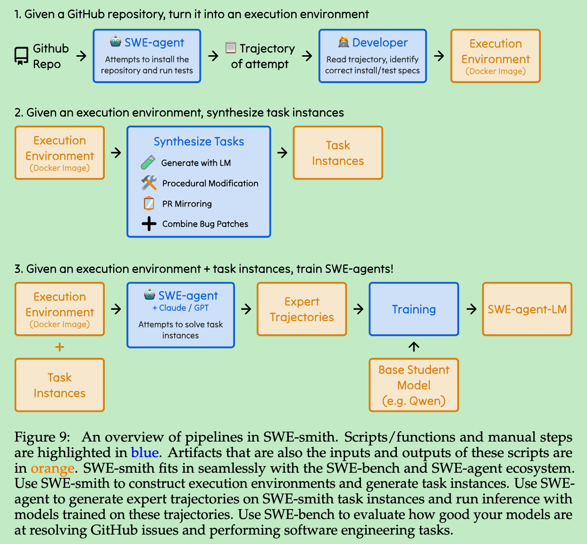
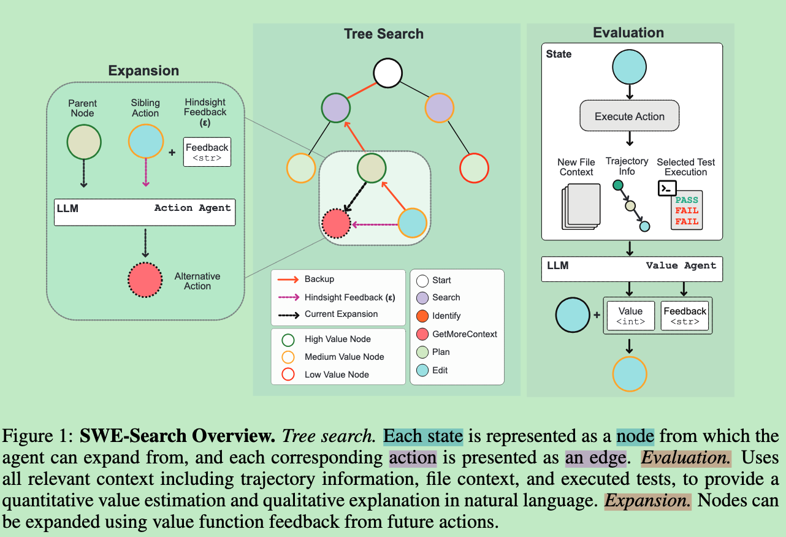

# Code Agent

这个目录用于整理 code 相关的 swe agent 系列论文

## 1. **Benchmark**：code agent 评测任务、数据集、排行榜、验证方式。

SWE-bench团队自己的更新入口，页面里直接挂了SWE-bench、Verified、Multilingual、Multimodal、Lite 等 benchmark家族入口，也会发 mini-SWE-agent、SWE-smith 这类相关更新。
https://www.swebench.com/blog.html

### **SWE-bench-(lite)**: 
ICLR24, 普林斯顿
基于github issue及其对应pr的任务


### **SWE-bench（verified）**:
openai
500 个 human-validated samples，不是独立论文

openai官方解释报告：https://openai.com/index/introducing-swe-bench-verified/


### Multi-SWE-bench/ Multi-SWE-RL: 
nips25,字节
**多语言版的现实 issue 修复基准，补足 SWE-bench 偏 Python 的问题。**

* 包含 7 种广泛使用编程语言中的 1,632 个 issue：Java、TypeScript、JavaScript、Go、Rust、C 和 C++，进行严格的人工验证，与 SWE-bench Verified 的标准保持一致。
* 作为 Multi-SWE-RL 社区的初始贡献，作者发布了一个包含 4,723 个容器化 issue 修复实例的数据集，覆盖 7 种编程语言。每个实例都配备了可复现的执行环境，使其可以直接用于真实软件场景中的强化学习 agent 训练。

MagentLess：多语言改造版 Agentless；
MSWE-agent：多语言改造版 SWE-agent；
MopenHands：多语言改造版 OpenHands


### **SWE-bench（Pro）**:
arxiv ,scale AI
难度更高的基准测试。测试当前 AI agent 是否真的具备长程工程能力。

SWE-BENCH PRO 包含 1,865 个问题，这些问题来自 41 个正在活跃维护的代码仓库，覆盖商业应用、B2B 服务和开发者工具等多种类型。
**该基准被划分为三部分**：
1）公开集：来自 11 个仓库，问题可以公开访问；
2）保留集：来自 12 个仓库；
3）商业集：来自 18 个专有仓库，这些仓库来自与作者团队有正式合作关系的早期创业公司。
这个基准中的任务具有 **长周期特征**：即使是专业软件工程师，也可能需要数小时到数天才能完成。这些任务通常涉及多个文件的修改，以及大量代码变更。
所有任务都经过**人工验证**，并补充了足够的上下文，以确保这些任务是可以被解决的。


**把 SWE 评测往“更大规模、更抗污染、更企业真实”的方向推进。它用代码行数、多文件修改、私有仓库和人工验证来近似保证难度**

> 难绷，2026.7.8， openai发文章，声称swebench pro约30%任务存在broken/不可靠问题。https://openai.com/index/separating-signal-from-noise-coding-evaluations/


### **SWE-Lancer**
ICML25， openai

一个包含 1,400 多个来自 **Upwork** 的**自由职业软件工程任务**的基准测试，这些*任务对应的真实世界报酬总价值为 100 万美元*。

SWE-Lancer 包括两类任务：
1）**独立工程任务**：从价值 50 美元的 bug 修复，到价值 32,000 美元的功能实现不等。模型需要生成**代码补丁**。
2）**管理类任务**：模型需要在多个技术实现方案之间做出选择。模型扮演**技术负责人**。
独立工程任务通过 端到端测试来评分，这些测试由有经验的软件工程师进行了 三重验证。
管理类任务则通过比较模型的选择与原先实际雇佣的工程经理所做选择是否一致来评估。


> SWE-Lancer：基于 Upwork 真实自由职业软件工程任务构建的 benchmark，用任务金额衡量工程任务的现实经济价值。

> 还有一个测试亮点：专业工程师写浏览器自动化 E2E 测试，让测试像真实用户一样操作产品，然后判断修复是否真的有效


### **SWE-Skills-Bench**
arxiv26,nju
> 把 SkillsBench 的“技能评估思想”移植并强化到真实软件工程场景中。 是 SWE agent benchmark 里专门研究“技能注入有效性”的基准。

SWE 专用：49 个真实 SWE skills，约 565 个任务实例。
成对对照实验：每个任务都跑 “with skill” 和 “without skill”。


**1. skill是否能够帮助agent满足任务需求？**
> 软件工程本质上是需求驱动的：一个任务是否成功，取决于其规格说明中陈述的每一条验收标准是否被满足；而单元测试则是这些标准的可执行编码。

本文采用一种 **需求驱动的**评估方法：每个任务都锚定在一份需求文档上，该文档定义任务范围和验收标准；然后，基于这些标准系统性地推导出确定性的单元测试验证器，从而建立从需求到测试结果的完整可追踪关系。

基于这一方法，本文提出 SWE-Skills-Bench：一个**旨在隔离 agent skills 对软件工程任务边际效用**的 benchmark。
我们**从公开仓库中整理了 49 个 SWE skills，并将每个 skill 与一个固定 commit 的真实 GitHub 项目配对，在受控的 “with-skill” 与 “without-skill” 条件下进行评估**。所有任务实例都通过确定性的、基于执行的检查进行验证，不依赖 LLM-as-judge 评估。

**2. 与skillsbench的关系？**
SkillsBench 朝着“将 skills 作为一等对象进行 benchmark”迈出了重要第一步，它通过比较 agent 在不同 skill 条件下的表现来评估 skills。
不过，它并不是专门面向 SWE 的：软件工程只占其任务集中的一小部分，而且这个 benchmark 并不是围绕真实开发中的核心成功标准来设计的——也就是在基于代码仓库的工作流中，显式需求是否被满足。

**3. 数据集基本构造流程**
如图，public skills的来源是mcpmarket category leaderboard。


> - 从公开replication可以看出：与swebench那些repo挺不一样的。
```text
一共 49 个任务 对应 44 个不同的 GitHub repo。不是 49 个 repo，因为部分 repo 承担多个任务。44 个 repo 是：
pytorch/pytorch
michaelasper/upgradle
tdd-starters/python
babybuddy/babybuddy
spring-projects/spring-petclinic
TryGhost/Ghost
modelcontextprotocol/servers
encode/httpx
ericgazoni/openpyxl
vercel/turbo
actions/starter-workflows
metabase/metabase
prometheus/prometheus
mahmoud/boltons
oven-sh/bun
saleor/saleor
celery/celery
fastapi/fastapi
lballabio/QuantLib
langchain-ai/langchain
quantopian/pyfolio
facebookresearch/faiss
apache/spark
milvus-io/milvus
stanford-crfm/helm
getsentry/sentry
pypa/packaging
fluxcd/flux2
linkerd/linkerd2
github-changelog-generator/github-changelog-generator
kubernetes-sigs/kustomize
nrwl/nx
bazelbuild/bazel
istio/istio
koalaman/shellcheck
gitlabhq/gitlabhq
PostHog/posthog
open-telemetry/opentelemetry-python
open-telemetry/opentelemetry-collector
google/slo-generator
benfred/py-spy
grafana/grafana
dbt-labs/dbt-core
Dao-AILab/flash-attention
```

### SWE-CI
arxiv26, 中山
#### **引言：**

当前**主流的基准测试普遍采用一种快照式评估协议**：智能体接收一个单一且完整的需求，然后一次性给出解决方案。
在这种范式下，一个通过硬编码实现脆弱修复的智能体，与一个编写出整洁且易于扩展代码的智能体，可能都能通过相同的测试套件——二者在**可维护性方面**的差异完全无法显现。
只有当代码库需要继续演化时，这种差异才会暴露出来：新的需求不断出现、接口发生变化、模块需要扩展。
此时，早期设计决策所带来的成本会不断累积；如果智能体经常生成结构不良的代码，那么后续的每一次修改都会变得更加困难，最终使其无法跟上软件演化的步伐。
**insight**: 只有**通过长期的软件演化，才能揭示智能体维护代码的能力，因为过去决策造成的后果会在连续的代码变更中不断累积**。


#### **摘要：**

首个专门评估 **AI智能体维护仓库的能力** 的测评基准。
SWE-CI 的核心洞见在于：好的维护不仅要确保当前代码的功能正确，更要**尽量降低代码在未来持续保持功能正确的开发难度**。

1. SWE-CI从Github中筛选了100对高质量代码提交版本。其中，**每一对代码提交版本都包含一份基准代码和一份参考代码**，*它们选取自同一个代码库的不同时期*。
**SWE-CI要求AI智能体从基准代码开始维护，并以完全通过参考代码的中的测试作为目标。**
通过量化代码演化序列持续保持功能正确性的程度，SWE-CI可以有效的衡量AI智能体维护代码的能力。

2. SWE-CI 采用一种架构师—程序员（Architect–Programmer）双智能体评估协议：智能体从基础提交开始执行持续集成循环（CI-loop），在循环中反复生成需求、修改源代码并运行测试，最终目标是通过与目标提交相关的全部测试。


3. 一个代理评估指标——EvoScore（演化分数）。它通过衡量代码在未来修改中的功能正确性来反映其可维护性：如果智能体早期作出的决策有利于后续演化，它将获得更高的分数；相反，如果智能体不断积累技术债务，其表现就会逐步下降


#### 数据集构造


### sweperf、swefficiency、formulacode

比较熟悉了，略


### SWE-bench Multimodal
ICLR25，斯坦福

>SWE-bench 包含了一些常用的后端开发和数据科学库，但许多其他应用场景并未得到体现。
>此外，用户界面设计、游戏、虚拟现实和数据可视化等许多软件开发领域都依赖视觉资源

用于评估系统修复面向用户、具有**视觉特征**的 **JavaScript** 软件中错误的能力。

**SWE-bench M** 包含从 17 个 JavaScript 库中收集的 617 个任务实例，这些库涉及网页界面设计、图表绘制、数据可视化、语法高亮和交互式地图等应用。
每个任务实例的问题描述或单元测试中都至少包含一张图像。


#### 数据收集过程
还是老一套，筛选repo筛选pr，然后关联PR跟issue，进一步筛选这些 [issue(s), PR] 配对，只保留 **issue 或测试代码中包含视觉资源**的样本。
具体而言，作者检查 issue 文本和测试补丁中是否存在指向图像（如 JPG、PNG）或视频（如 GIF、MOV）的有效超链接。

> 人工检查发现，少量测试存在不一致现象：对于同一个补丁，某项测试在多次评估中可能有时通过、有时失败。SWE-bench 中也曾报告过这种现象


### SWE-Bench-live
nips25, microsoft

1.提出了 REPOLAUNCH。这是一条完全自动化的基准构建流水线，能够将数据整理、执行环境配置和测试验证无缝整合为一个统一且可扩展的系统。
2.swebenchlive数据集，一个可实时持续更新的基准


> 亮点就repolaunch和月更新swebenchlive

## 2. **Code Agent**。

### agentless
fse25, UIUC


一个pipeline，略


### **SWE-agent** 
nips24, 普林斯顿

基于简单react loop的 通用repo-level agent


### openhands
ICLR25, UIUC

SWE-agent 更像是“专门做软件工程/修 GitHub issue 的 agent”。
OpenHands 更像是“通用 AI 软件开发者平台”，不仅能修代码，还能跑命令、写 Python、浏览网页、多 agent 协作、做多种 benchmark。


略
### Live-SWE-agent
arxiv25, UIUC
核心insight:**软件智能体本身也是软件系统**，而现代基于 LLM 的软件智能体已经天然具备在运行期间扩展或修改自身实现的能力。
> 在普通软件工程 Agent 的循环里，加入“自己写工具、调试工具、使用工具”的能力，让 Agent 针对当前 bug 动态扩展自己的工具箱。


## 3. **训练方法**:

### SWE-Fixer
> 本质上就是对 Agentless 流水线的简化和“可训练化”改造

SWE-Fixer：一个旨在高效且有效地解决 GitHub Issue 的新型开源框架。

如图，SWE-Fixer 包含**两个**核心模块：代码文件检索模块和代码编辑模块。
**检索模块**结合 **BM25 与轻量级模型 qwen7b**，实现由粗到细的文件检索；
随后，**代码编辑模块 qwen 72b**使用另一个模型，为识别出的文件生成补丁。

构建了一个**大规模数据集**，其中包含 11 万个 GitHub Issue 及其对应补丁，并分别**训练 **SWE-Fixer 的两个模型。（用json格式，JsonTuning， 然后用了一个很奇怪的cot数据合成方法：**将标准补丁作为输入的一部分，用它引导教师模型同时生成推理过程和相应补丁。模型需要假装自己并不知道正确答案，以独立解决问题的方式生成推理链和代码补丁**。）

> 做的还是sft啊

### SWE-Gym
icml25，ucb

>swe-gym 包含2438个真实世界任务，可用于训练swe agent
SWE-Gym 包含：
  - 2,438 个真实 GitHub issue 任务
  - 来自 11 个 Python repo
  - 与 SWE-bench 使用的 repo 分离，避免直接重叠
  - 每个任务都有预配置 Docker 环境
  - 测试经过执行验证
  - Docker 镜像总量约 6 TB
  - 另有 230 个任务组成 SWE-Gym Lite


一个 agent trajectory 类似：
  读取 issue
  → 搜索代码
  → 打开文件
  → 修改代码
  → 运行测试
  → 查看报错
  → 再次修改
  → 生成最终 patch
  → 测试通过或失败
SWE-Gym 提供的是产生这些轨迹的环境。作者再让 GPT-4o、Claude 3.5 Sonnet 等模型进入环境执行任务，采样得到轨迹。论文公开了由 SWE-Gym 采样出来的 agent trajectories。

#### 论文怎么训练 Agent

论文使用测试结果把轨迹分成成功和失败：
1. 训练 Agent（2-8张h100 80g，训练7b，14b，32b模型）
拒绝采样微调，也叫过滤式行为克隆。
采用 rejection sampling fine-tuning，也就是只筛选成功轨迹来微调基础模型。
这也分为两种1是通用agent，2是训练用moatless tools结合的这种特点workflow，均有明显提升

> moatless tools

2. 训练 verifier 做推理时扩展
同时使用成功和失败轨迹训练 outcome verifier，使其预测：这条完整 agent trajectory 最终解决任务的概率是多少？推理时让 Agent 为同一个任务生成多条轨迹，再由 verifier 选择最可能成功的一条，即Best-of-N。

3. 还进行了数据规模拓展实验

> 有 reward signal，但主要没做 RL；
> 属于成功轨迹 SFT / rejection sampling SFT


### SWE-RL
nips25, meta
>DeepSeek-R1 及其后续工作主要关注将强化学习应用于竞赛编程和数学问题。
>本文提出了 SWE-RL，这是首个将基于强化学习的大模型推理扩展到真实世界软件工程场景的方法。



在 Llama 3 instruct 70B 的基础上训练出了推理模型 Llama3-SWE-RL-70B。

1. 首先整理一个全面的 GitHub 拉取请求数据集，随后将其转换为用于强化学习的种子数据集。每条数据都包含以下内容：一个软件问题；对应的代码上下文；该拉取请求最终合并的标准补丁（oracle patch）。
2. 将llm的输出转化为统一patch格式，然后如果回答的不正确，奖励为-1，否则奖励为相似度分数，取值范围为 0到1，通过 Python 的 difflib.SequenceMatcher 计算。


数据集细节：
筛选出 27.3 万个高质量 PR 种子样本，这些样本的启发式筛选规则为：一个 PR 实例至少应关联一个 issue；该 issue 应描述一项缺陷修复请求；代码变更应涉及程序源代码文件。

training prompt细节：


最后在swebench verified上面评估了下



### SWE-smith
nips25, 斯坦福
> 大规模合成swe训练数据的pipeline + reject sampling SFT

1. 提出**SWE-smith**，这是一种用于大规模生成软件工程训练数据的新型流水线。给定任意一个 Python 代码库，SWE-smith 会构建相应的执行环境，然后自动合成数百到数千个任务实例。
2. 创建了一个包含 5 万个实例的数据集，这些实例来自 128 个 GitHub 仓库，规模比以往所有工作都大一个数量级
3. 训练了 SWE-agent-LM-32B，它在 SWE-bench Verified 基准测试上达到了 40.2% 的 Pass@1 解决率，在开源模型中达到当前最先进水平。


数据合成流程：
1）首先是创建执行环境
2）然后是创建task候选项：
* LM Generation：语言模型生成
对于每个仓库，作者识别所有程序实体，例如函数和类，然后采用两种方法：
   * 向语言模型提供函数，并提示它引入错误修改，后文称为 LM Modify；
   * 只给语言模型函数头和 docstring，让它重写该函数，称为 LM Rewrite。
* Procedural Modification：程序化修改
对于每个函数，作者获取代码的抽象语法树（AST）表示，然后随机执行一个或多个转换操作，例如：删除条件语句或循环；修改操作符；以及另外 11 种转换。
* Combine Bugs：组合 Bug
LM 生成和程序化修改得到的任务实例只会编辑一个函数或类。为了创建更复杂、需要修改代码库多个部分的任务，作者设计了 Patch Combination 策略。该策略会把**来自相同文件或模块的多个候选 patch 聚合起来**，从而创建一个任务实例。
* 向语言模型提供 PR 的代码变更，即 .diff 纯文本，并提示它重写每个受影响文件，使 PR 的编辑被还原。
3）基于执行的验证
4）生成问题描述


### SWE-Master
arxiv26, 人大高领
1.首个完全开源、端到端的软件工程智能体训练流程，覆盖数据处理、SFT、RL 基础设施与策略，以及推理时智能体框架。
2.引入了基于 LSP 驱动代码导航的 IDE 级能力，使智能体能够更高效、结构化地理解代码仓库，并在不牺牲性能的情况下显著提升效率。
3.显著提升了开源模型在 SWE-bench Verified 上的表现：使用 Qwen2.5-Coder-32B 达到 61.4% 准确率；结合测试时扩展提升至 70.8%；在 Pass@8 下达到 76.2%


todo

### SWE-World
arxiv26, 人大高领
> docker free enviroment， 模拟执行环境
受到近期基于 LLM 的世界模型研究进展启发，本文探索一种替代范式：用学习得到的模型替代物理执行环境。
这引出了一个核心问题：传统上由 Docker 环境提供的执行反馈，是否可以由 LLM 近似模拟，从而实现无需 Docker 的软件工程智能体训练和部署？

1.无需 Docker 的 SWE 环境：本文提出 SWE-World，一个无需 Docker 的框架，用学习得到的替代环境取代物理执行环境，用于训练和评估软件工程智能体

todo


### SWE-SEARCH
ICLR25, ucsb
> 一个多智能体框架，它将 蒙特卡洛树搜索（MCTS） 与一种自我改进机制结合起来，以提升软件智能体在仓库级软件任务中的表现。

软件工程本质上具有**非线性和迭代性**：工程师会动态探索多种解决方案，根据反馈调整策略，并通过协作确定最有效的前进路径。
目前llm agent在需要**长期持续调整策略和灵活重新评估的复杂长时程任务**中，往往表现不佳。这些智能体可能陷入**重复的行为模式**，从而限制其解决更加复杂的软件工程问题的能力。

为此，提出SWE-Search，
SWE-Search 由四个相互协同工作的主要组件构成：

1. SWE-Search 框架与 Action Agent
SWE-Search 建立在 moatless-tools 框架（Örwall, 2024）之上，运行于一个动态代码环境中，具有灵活的状态空间和类似 Git 的提交树结构。
2. Value Function Agent（价值函数智能体）
为了近似估计每个观察结果的效用，作者采用了一个基于 LLM 的价值函数。它除了输出一个数值价值外，还会生成一段自然语言解释。
这段解释可以被用于改进父节点之后的动作，从而使搜索过程能够进行迭代式自我改进。
3. 搜索算法
SWE-Search 的探索策略核心基于 蒙特卡洛树搜索（MCTS）。该算法使用了一种类似 AlphaZero（Silver et al., 2016a）的启发式选择过程，并专门针对软件工程任务进行了调整。
这种修改后的 MCTS 算法能够有效平衡：
    探索：尝试更多不同的解决方案；
    利用：优先深入看起来更有希望的方案。
4. Discriminator Agent（判别智能体）
在 SWE-Search 的最后阶段，Discriminator Agent 会评估搜索过程中生成的解决方案。
它受到多智能体辩论框架的启发，会组织结构化辩论：多个智能体分别对候选方案提出支持或反对意见。




### AgentGym-RL
AgentGym-RL: Training LLM Agents for Long-Horizon Decision Making through Multi-Turn Reinforcement Learning

ICLR26 oral, 复旦

目前社区仍然缺少一个统一的、端到端的、交互式多轮 RL 框架。这个框架应当能够在不以监督微调（SFT）作为预备步骤的情况下，有效地训练 LLM 智能体，并且能够在广泛的真实场景和环境中发挥作用。
提出 AgentGym-RL，一个用于通过 RL 训练 LLM 智能体进行多轮交互式决策的新框架。
该框架支持主流 RL 算法，包括 PPO、GRPO 和 REINFORCE++，并覆盖多种真实场景，例如网页导航、深度搜索、数字游戏、具身任务和科学任务。
为了解决智能体 RL 训练中的探索—利用权衡问题，并提升优化稳定性，本文提出了 ScalingInter-RL。
这是一种在训练过程中逐步扩展智能体与环境交互长度的方法。它的核心思想是让智能体分阶段适应环境：首先通过“利用”来可靠地掌握基础技能和简单任务；随后逐渐增加交互长度，以促进探索、优化行为、克服捷径，并处理更复杂的挑战。

> 这个感觉主要是统一框架，跟openhands这种差不多

### AgentFlow

ICLR26, 斯坦福

研究问题：如何让工具增强型、多轮 LLM agent 在长任务中更可靠地规划和调用工具。
核心问题背景：现有方法要么是单一模型混合推理与工具调用，长链路扩展差；要么是 agent 系统虽模块化，但多为免训练或离线训练，和真实交互脱节。
方法：提出 AGENTFLOW，由 planner、executor、verifier、generator 四个模块组成，并通过 evolving memory 协调多轮过程。
训练算法：提出 Flow-GRPO，在真实多轮流程中直接优化 planner。


