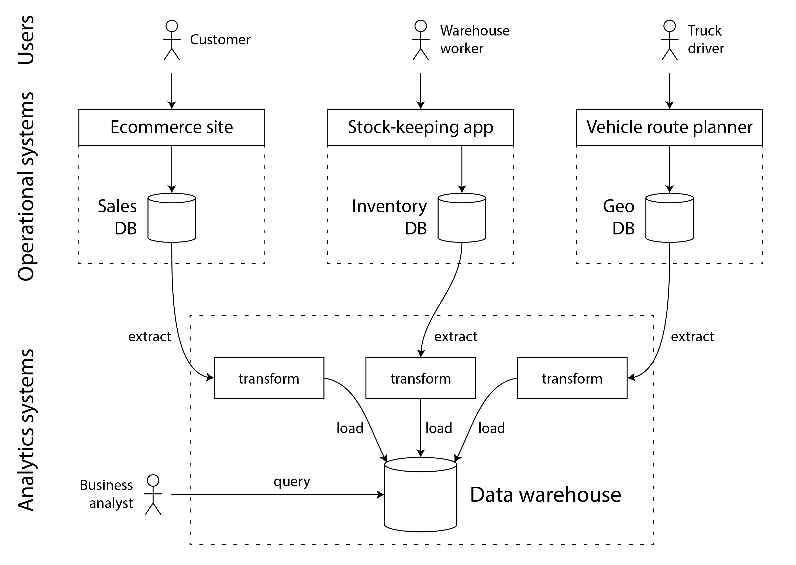

# 设计数据密集型应用

## 序言

一个应用，

若处理器速度是瓶颈，则属于**计算密集型**

若数据量巨大、数据复杂度高、数据变化速度快，难以处理，则称为**数据密集型**

> - 你对**事物的运作方式有着天然的好奇心**，并且希望知道一些**主流网站和在线服务背后发生的事情**。这本书打破了各种数据库和数据处理系统的内幕，探索这些系统设计中的智慧是非常有趣的。
> - 另外， 不要过早优化

三个部分：

第一部分： 设计数据密集型应用 所**依赖的基本思想**

1. 讨论数据密集型应用 所需要达到的**目标**： **可靠性、可伸缩性、可维护性**
2. 讨论适用于不同场景的 **数据模型和查询语言**
3. 讨论 **存储引擎**，如何在磁盘上摆放数据，从而能高效查找
4. **数据编码**

第二部分： 讨论分布在**多台**机器上的数据

5. **复制**
6. **分区、分片**
7. **事务**
8. 分布式系统问题的更多细节
9. 如何实现**一致性和共识**

第三部分： 当没有单个数据库可以把所有事情都做的很好时，应用需要集成几种不同的数据库、缓存、索引等

11. **派生数据**的批处理
12. **流处理**

最后：13.总结

## 第一部分：数据系统基础

介绍了**数据系统底层的基础概念**，无论是在单台机器上运行的单点数据系统，还是分布在多台机器上的分布式数据系统都适用。

1. [第一章](https://ddia.vonng.com/ch1/) 将介绍 **数据系统架构中的利弊权衡**。我们将讨论不同类型的数据系统（例如，分析型与事务型），以及它们在云环境中的运行方式。
2. [第二章](https://ddia.vonng.com/ch2/) 将介绍非功能性需求的定义。。**可靠性，可伸缩性和可维护性** ，这些词汇到底意味着什么？如何实现这些目标？
3. [第三章](https://ddia.vonng.com/ch3/) 将对几种不同的 **数据模型和查询语言** 进行比较。从程序员的角度看，这是数据库之间最明显的区别。不同的数据模型适用于不同的应用场景。
4. [第四章](https://ddia.vonng.com/ch4/) 将深入 **存储引擎** 内部，研究数据库如何在磁盘上摆放数据。不同的存储引擎针对不同的负载进行优化，选择合适的存储引擎对系统性能有巨大影响。
5. [第五章](https://ddia.vonng.com/ch5/) 将对几种不同的 **数据编码** 进行比较。特别研究了这些格式在应用需求经常变化、模式需要随时间演变的环境中表现如何。

### 1. 数据系统架构中的权衡

​	**数据是当今许多应用程序开发的核心**。随着 Web 和移动应用、软件即服务（SaaS）以及云服务的兴起，将来自不同用户的数据存储在共享的基于服务器的数据基础设施中已成为常态。来自**用户活动、业务交易、设备和传感器**的数据需要被存储并可供分析使用。**当用户与应用程序交互时，他们既读取已存储的数据，也生成更多的数据**。

​	如果数据管理是开发应用程序的主要挑战之一，我们就称应用程序为 **数据密集型（data-intensive）** 的。在数据密集型应用中，我们通常更**关心诸如存储和处理大量数据、管理数据变更、在面对故障和并发时确保一致性，以及确保服务高可用等问题**

这些应用程序通常由提供常用功能的标准构建块构建而成。例如，许多应用程序需要：

- 存储数据，以便它们或其他应用程序以后能再次找到（**数据库**）
- 记住昂贵操作的结果，以加快读取速度（**缓存**）
- 允许用户按关键字搜索数据或以各种方式过滤数据（**搜索索引**）
- 一旦事件和数据变更发生就立即处理（**流处理**）
- 定期处理累积的大量数据（**批处理**）

​	**在构建应用程序时，我们通常会采用几个软件系统或服务，例如数据库或 API，并用一些应用程序代码将它们粘合在一起。**

​	然而，随着你的应用程序变得更加雄心勃勃，挑战就会出现。**有许多具有不同特性的数据库系统，适合不同的目的——你如何选择使用哪一个？有各种缓存方法、构建搜索索引的几种方式等等——你如何在它们之间进行权衡？**你需要找出哪些工具和哪些方法最适合手头的任务，当你需要做单个工具无法单独完成的事情时，组合工具可能会很困难。

​	本书是一个指南，帮助你决定使用哪些技术以及如何组合它们。正如你将看到的，没有一种方法从根本上优于其他方法；一切都有利弊。通过本书，你将学会提出正确的问题来评估和比较数据系统，以便你能找出哪种方法最能满足你特定应用程序的需求。

​	我们将通过观察当今组织中数据的一些典型使用方式来开始我们的旅程。这里的许多想法起源于 **企业软件**（即大型组织的软件需求和工程实践，大型组织包括大公司和政府等），因为历史上只有大型组织拥有需要复杂技术解决方案的大数据量。

​	本书中我们将讨论的大部分内容都与 **后端开发** 有关。为了解释这个术语：对于 **Web 应用程序，在 Web 浏览器中运行的客户端代码称为 前端，处理用户请求的服务器端代码称为 后端。** **移动应用类似于前端**，它们提供用户界面，通常通过互联网与服务器端后端通信。

​	**前端有时在用户设备上本地管理数据**，但最大的数据基础设施挑战通常在于后端：前端只需要处理一个用户的数据，而后端代表 **所有** 用户管理数据。**后端服务**通常可通过 HTTP（有时是 WebSocket）访问；它**通常由一些应用程序代码组成，这些代码在一个或多个数据库中读取和写入数据，有时还与其他数据系统（如缓存或消息队列）接口（我们可能将其统称为 数据基础设施）。**

​	应用程序代码通常是 **无状态的**（即，**当它完成处理一个 HTTP 请求时，它会忘记关于该请求的所有内容**），任何需要从一个请求持续到另一个请求的信息都需要存储在客户端或服务器端的数据基础设施中。

----

**事务型系统和分析型系统之间的区别；**

​	如果你在企业中从事数据系统工作，你可能会遇到几种不同类型的数据工作者。

第一类是 **后端工程师**，他们构建服务来处理读取和更新数据的请求；这些服务通常直接或间接地通过其他服务为外部用户提供服务

第二类是 **业务分析师**，他们生成关于组织活动的报告，以帮助管理层做出更好的决策（**商业智能** 或 **BI**）

第三类是 **数据科学家**，他们在数据中寻找新的见解，或创建由数据分析和机器学习（AI）支持的面向用户的产品功能（例如，电子商务网站上的“购买了 X 的人也购买了 Y”推荐

​	尽管业务分析师和数据科学家倾向于使用不同的工具并以不同的方式操作，但他们有一些共同点：两者都执行 **分析**，这意味着他们**查看用户和后端服务生成的数据，但他们通常不修改这些数据**（除了可能修复错误）

​	`这导致了两种类型系统之间的分离`——我们将在本书中使用这种区别：

- **事务型系统** **由后端服务和数据基础设施组成**，在这里创建数据，例如通过服务外部用户。在这里，应用程序代码基于用户执行的操作读取和修改其数据库中的数据。
- **分析型系统** **服务于业务分析师和数据科学家的需求**。它们包含来自事务型系统的只读数据副本，并针对分析所需的数据处理类型进行了优化

随着这些系统的成熟，出现了两个新的专业角色：**数据工程师** 和 **分析工程师**。

**数据工程师**是知道如何集成事务型系统和分析型系统的人，并更广泛地负责组织的数据基础设施 

**分析工程师**对数据进行建模和转换，使其对组织中的业务分析师和数据科学家更有用

​	**本书涵盖了事务型和分析型数据系统**，因为两者在组织内数据的生命周期中都扮演着重要角色。我们将深入探讨用于向内部和外部用户提供服务的数据基础设施，以便你能更好地与分界线另一边的同事合作。

#### 事务处理与分析的特征 

​	事务型系统通常通过某个键查找少量记录（这称为 **点查询**）。基于用户的输入插入、更新或删除记录。因为这些应用程序是交互式的，这种访问模式被称为 **联机事务处理**（OLTP）。

​	然而，数据库也越来越多地用于分析，与 OLTP 相比，分析具有非常不同的访问模式。**通常，分析查询会扫描大量记录**，并计算聚合统计信息（如计数、求和或平均值），而不是将单个记录返回给用户。为了将这种使用数据库的模式与事务处理区分开来，它被称为 **联机分析处理**（OLAP）

---

**数据仓库**

​	起初，相同的数据库既用于事务处理，也用于分析查询。SQL 在这方面相当灵活：它对两种类型的查询都很有效

​	然而，在 20 世纪 80 年代末和 90 年代初，企业有**停止使用其 OLTP 系统进行分析**目的的趋势，**转而在单独的数据库系统上运行分析**。这个单独的数据库被称为 **数据仓库**。

​	一家大型企业可能有**几十个甚至上百个联机事务处理系统**：为面向客户的网站提供动力的系统、控制实体店中的销售点（收银台）系统、跟踪仓库中的库存、规划车辆路线、管理供应商、管理员工以及执行许多其他任务。**这些系统中的每一个都很复杂，需要一个团队来维护它，因此这些系统最终主要是相互独立地运行**。

​	出于几个原因，**业务分析师和数据科学家直接查询这些 OLTP 系统通常是不可取的**：

- 感兴趣的数据可能分布在多个事务型系统中，使得在单个查询中组合这些数据集变得困难（称为 **数据孤岛** 的问题）；
- 适合 OLTP 的模式和数据布局不太适合分析（参见[“星型和雪花型：分析模式”](https://ddia.vonng.com/ch3/#sec_datamodels_analytics)）；
- 分析查询可能相当昂贵，在 OLTP 数据库上运行它们会影响其他用户的性能；以及
- 出于安全或合规原因，OLTP 系统可能位于不允许用户直接访问的单独网络中。

​	相比之下，**数据仓库** 是一个单独的数据库，分析师可以随心所欲地查询，而不会影响 OLTP 操作。

​	**数据仓库包含公司中所有各种 OLTP 系统中数据的只读副本**。数据从 OLTP 数据库中提取（使用定期数据转储或连续更新流），转换为分析友好的模式，进行清理，然后加载到数据仓库中。这种将数据导入数据仓库的过程称为 **提取-转换-加载**（ETL）

​	一些数据库系统提供 **混合事务/分析处理**（HTAP），目标是在单个系统中同时支持 OLTP 和分析，而无需从一个系统 ETL 到另一个系统。然而，**许多 HTAP 系统内部由一个 OLTP 系统与一个单独的分析系统耦合组成**

​	此外，尽管 HTAP 存在，但由于目标和要求不同，**事务型系统和分析型系统之间的分离是常见的。**特别是，让每个事务型系统拥有自己的数据库被认为是良好的做法（参见[“微服务与 Serverless”](https://ddia.vonng.com/ch1/#sec_introduction_microservices)），这将导致数百个单独的事务型数据库；另一方面，企业通常有一个单一的数据仓库，以便业务分析师可以在单个查询中组合来自多个事务型系统的数据。

---------------

**从数据仓库到数据湖**

​	数据仓库通常使用通过 SQL 进行查询的 **关系** 数据模型（参见[第 3 章](https://ddia.vonng.com/ch3/#ch_datamodels)），可能使用专门的商业智能软件。**这个模型很适合业务分析师需要进行的查询类型**，

​	**但不太适合数据科学家的需求**，他们可能需要执行以下任务：

- 将**数据转换为适合训练机器学习模型的形式**；这通常需要将**数据库表的行和列转换为称为 特征 的数值向量或矩阵**。以最大化训练模型性能的方式执行这种转换的过程称为 **特征工程**，它通常需要难以用 SQL 表达的自定义代码。
- 获取**文本数据**（例如，产品评论）并使用**自然语言处理**技术尝试从中提取结构化信息（例如，作者的情感或他们提到的主题）。同样，他们可能需要使用**计算机视觉技术从照片中提取结构化信息**。

​	尽管已经有人在努力将机器学习算子添加到 SQL 数据模型 并在关系基础上构建高效的机器学习系统，但**许多数据科学家不喜欢在数据仓库等关系数据库中工作。**相反，许多人更喜欢使用 **Python 数据分析库（如 pandas 和 scikit-learn）、统计分析语言（如 R）和分布式分析框架（如 Spark）**。

​	因此，组织面临着**以适合数据科学家使用的形式提供数据**的需求。答案是 **数据湖**：一个集中的数据存储库，保存任何可能对分析有用的数据副本，通过 ETL 过程从事务型系统获得。

​	**与数据仓库的区别**在于，**数据湖只是包含文件，而`不强制任何特定的文件格式或数据模型`**。**数据湖中的文件**可能是数据库记录的集合，使用 **Avro 或 Parquet** 等文件格式编码（参见[第 5 章](https://ddia.vonng.com/ch5/#ch_encoding)），但它们**同样可以包含文本、图像、视频、传感器读数、稀疏矩阵、特征向量、基因组序列或任何其他类型的数据**。除了**`更灵活`之外，这通常也比关系数据存储`更便宜`**，因为数据湖可以使用商品化的文件存储，如对象存储

>​	**ETL 过程已经泛化为 数据管道**，在某些情况下，**`数据湖已成为从事务型系统到数据仓库路径上的中间站`**。
>
>​	数据湖包含事务型系统产生的“原始”形式的数据，没有转换为关系数据仓库模式。

​	除了从数据湖加载数据到单独的数据仓库之外，**还可以直接在数据湖中的文件上运行典型的数据仓库工作负载（SQL 查询和业务分析），以及数据科学和机器学习的工作负载。这种架构被称为 数据湖仓**，它需要一个查询执行引擎和一个元数据（例如，模式管理）层来扩展数据湖的文件存储。

​	Apache Hive、Spark SQL、Presto 和 Trino 是这种方法的例子。

​	**在某些情况下，分析系统的输出被提供给事务型系统（这个过程有时被称为 反向 ETL ）**。例如，在分析系统中训练的机器学习模型可能会部署到生产环境中，以便为最终用户生成推荐，例如“购买了 X 的人也购买了 Y”。这种分析系统的部署输出也被称为 **数据产品** 。机器学习模型可以使用 TFX、Kubeflow 或 MLflow 等专门工具部署到事务型系统。

-----------

**权威数据源与派生数据**

- 权威记录系统

  权威记录系统，也称为 **权威数据源**，保存某些数据的权威或 **规范** 版本。当新数据进入时，例如作为用户输入，它首先写入这里。每个事实只表示一次（表示通常是 **规范化** 的；参见[“规范化、反规范化和连接”](https://ddia.vonng.com/ch3/#sec_datamodels_normalization)）。**如果另一个系统与权威记录系统之间存在任何差异，那么权威记录系统中的值（根据定义）是正确的。**

- 派生数据系统

  派生系统中的数据是从另一个系统获取一些现有数据并以某种方式转换或处理它的结果。如果你丢失了派生数据，你可以从原始源重新创建它。**一个经典的例子是缓存**：如果存在，可以从缓存提供数据，但如果缓存不包含你需要的内容，你可以回退到底层数据库。**反规范化值、索引、物化视图、转换的数据表示和在数据集上训练的模型也属于这一类别。**

​	从技术上讲，派生数据是 **冗余** 的，因为它复制了现有信息。然而，它通常对于在读取查询上获得良好性能至关重要。你可以从单个源派生几个不同的数据集，使你能够从不同的"视角"查看数据。

​	**权威记录系统是数据首先被写入的主数据库，而派生数据系统是加速常见读取操作的索引和缓存**，特别是对于权威记录系统无法有效回答的查询。

​	**分析系统通常是派生数据系统**，因为它们是在其他地方创建的数据的消费者。**事务型服务可能包含权威记录系统和派生数据系统的混合**。

> ​	数据库只是一个工具：如何使用它取决于你。
>
> ​	权威记录系统和派生数据系统之间的区别不取决于工具，而取决于你如何在应用程序中使用它。

#### **云服务和自托管；**

**何时从单节点系统转向分布式系统；**

**平衡业务需求和用户权利。**

