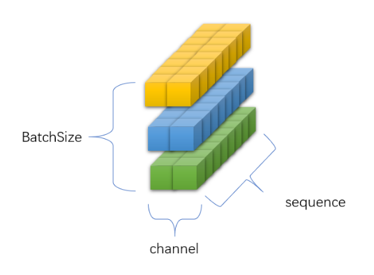

[torch.mean和torch.var的个人能理解，以及通俗理解BatchNorm1d的计算原理-CSDN博客](https://blog.csdn.net/weixin_45248370/article/details/132630843)

首先假设数据格式为(3,2,8),表示有3个batch的数据，每个batch有两个channel，每个channel的长度是8.

可视化为:

## mean

## var

