## 交叉熵与KL散度

熵，在信息论中，熵用来衡量一个随机事件的不确定性。也可以说是该随机事件的信息量。

熵越高，则随机变量的信息越多，

熵越低，随机事件的不确定性越小，则随机变量的信息越少。


<font color='red'>自信息，一个随机事件包含的信息量</font>，

对于一个随机变量X，当X=x时自信息定义为$I(x)=-log{P(x)}$

> 直觉上，一个随机事件x，其发生的概率P(x)越低，其信息量越大

> 为什么用log?  
> 自信息满足可加性
> $I(x_2)=-logP(x_2)$
>
> $I(x_1)=-logP(x_1)$
>
> $则两个事件所具有的信息量为I(x_1,x_2)=-logP(x_1)P(x_2)\newline=-logP(x_1,x_2)$


<font color='red'>重定义熵： 随机变量X的自信息的数学期望</font>

对于分布P(x),则熵为：

$\begin{aligned}H(X)&=E_{x\in X}[I(x)]\newline&=E_{x\in X}[-logP(x)]\newline&=-\sum P(x)logP(x)\end{aligned}$

 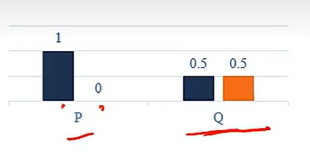

如图P的熵为0

而Q的熵为log2


<font color='red'>熵编码：</font>

<font color='red'>在对分布P(X)的符号进行编码时，熵H(p)也是理论上最优的平均编码长度，这种编码方式成为熵编码</font>

具体来说，假设$X\in\{a,b,c\}$,那么对于该词表中的字母，如果字母出现的次数很多，那么编码长度就短一些，如果字母出现的次数很少，那么编码长度就长一些，这与自信息-logP(x)相一致，<font color='green'>如果某个字母出现次数很多，那么出现概率就大，而应该赋予其较短的编码来获取总体最优平均编码，恰好出现概率越大，其自信息就越小。</font>

因此，也就可以拿自信息当作其编码长度，

此时，其平均编码长度也就是熵

> 参见哈夫曼编码时与最优编码的对比，这里讲的就是最优编码


<font color='red'>交叉熵：</font>

<font color='red'>按照概率分为为q的最优编码（即自信息I(q)）对真实分布为p的信息进行编码的长度。</font>


可想而知，当q接近p时，当q等于p时，此时就是真实分布p的最优编码即熵编码即最优平均编码长度，也就是最小的平均编码长度，

反之，p和q越远，交叉熵越大

> 交叉熵，用采样估计的概率分布q的最优编码，自信息来对真实分布p进行编码，得到的编码长度
>
>
> 
> 可以用来衡量两个概率分布p、q的相似度，越相近，交叉熵越小。


<font color='red'>KL散度：</font>

<font color='red'>用概率分布q来近似p时所造成的信息损失量。</font>

> p本身的熵（熵编码）最小（最优），
>
> 用q的概率分布的编码来 对真实分布p进行编码，得到的熵较大，
> 则显然，该过程造成了一定的编码信息损失，导致无法压缩为最优编码
>
> 也就是，KL散度等于交叉熵-真实熵

$\begin{aligned}KL(p,q)&=H(p,q)-H(p)\newline&=-\sum{P(x)logQ(x)+\sum{P(x)logP(x)}}\newline&=\sum{P(x)log\frac{P(x)}{Q(x)}}\end{aligned}$

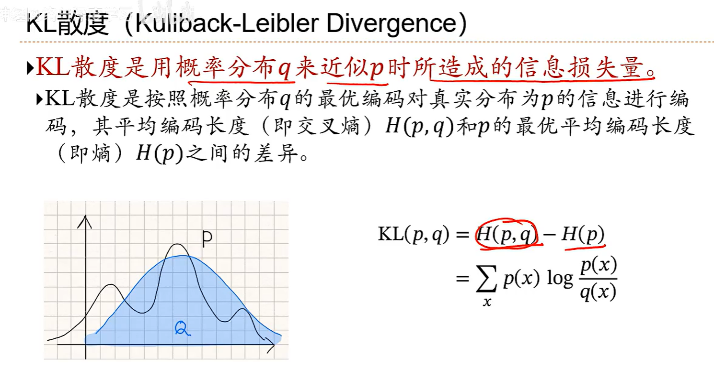


应用到机器学习

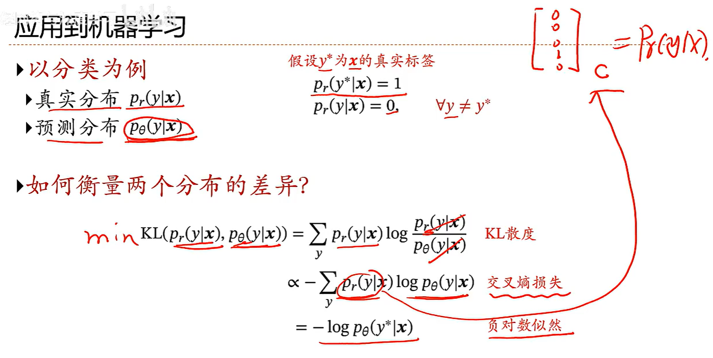

最小化kl散度，就是最小化交叉熵，也就是最小化负对数似然


## 线性分类器

### 分类问题示例

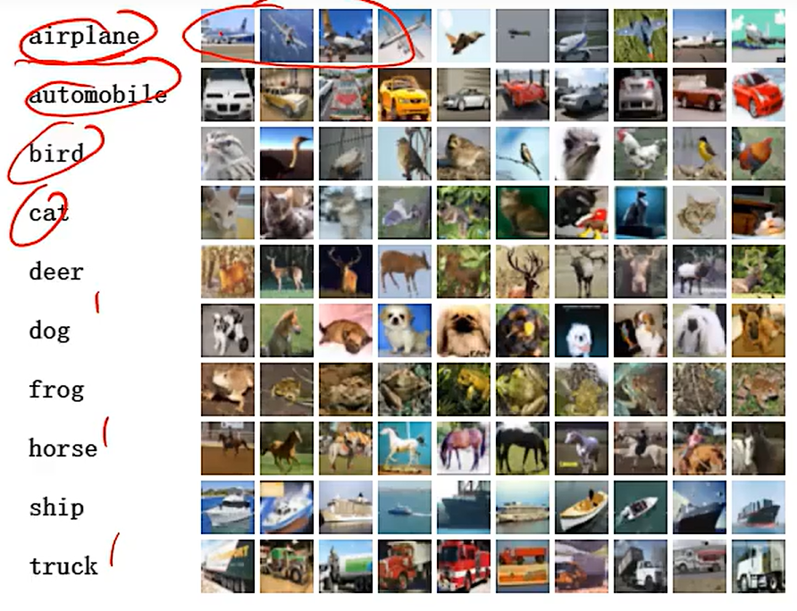

CIFAR-10有6万张32*32色彩图像，共10类，每类6000张


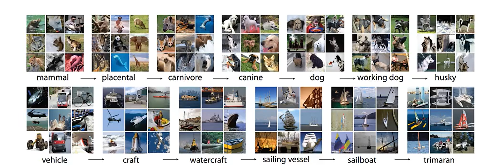

ImageNet 共14_197_122张图片,分类具有层次结构，分类更复杂

一般使用其子集。

关于图像分类问题的建模，

每一张32*32的色彩图片，都对应  3个 32 * 32的像素矩阵X。

X即为输入


在文本任务中，垃圾邮件过滤


文档归类，将文档分为运动类的、技术类的，等等

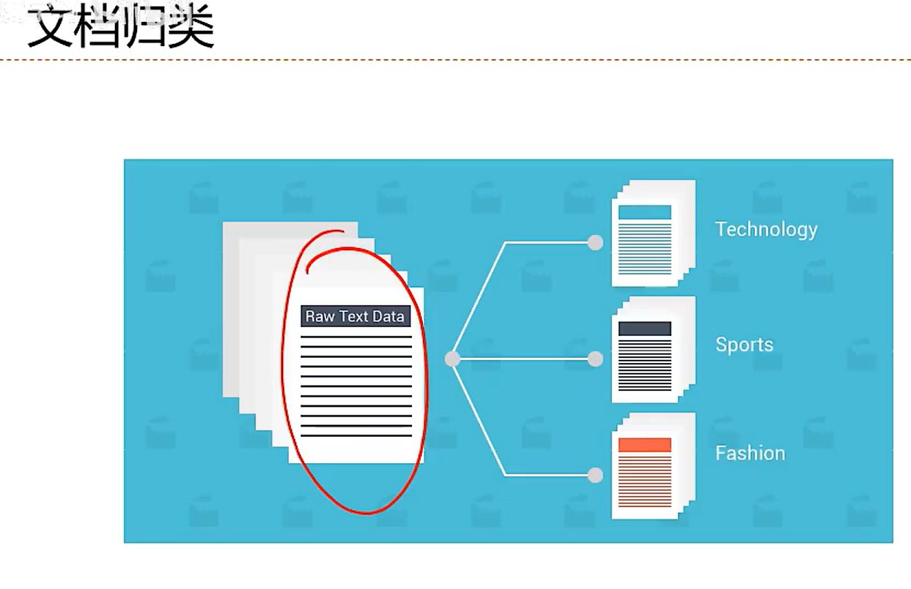

情感分类，积极的，消极的，比如查看影评、书评是正面的、负面的

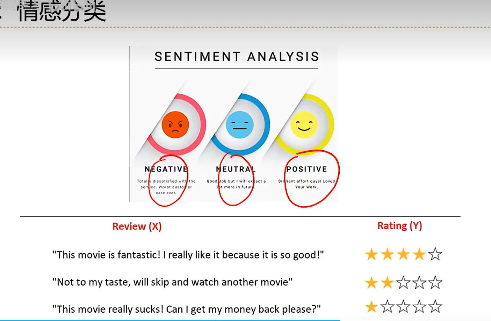


至于文本分类的建模，

将样本x从文本形式转为向量形式，

词袋模型，

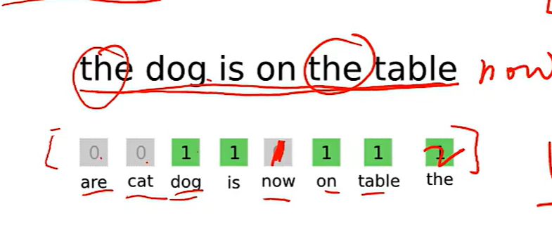

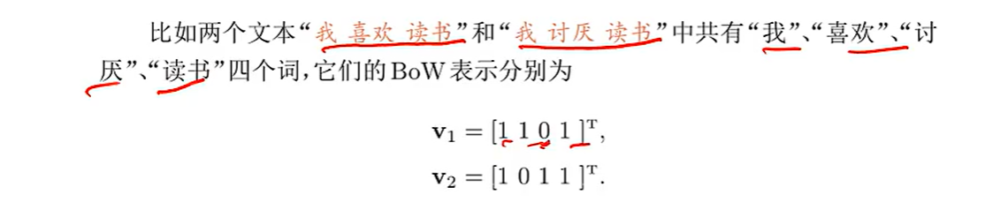

当句子中出现某词语时，就把词表对应长度的向量里的该词位置标记为1，

当然如果某词语出现两次，可能这位置就表2了，

> 一个问题，句子的词语与词语间的相对位置信息 无法表示了

词袋模型跟one-hot向量表示很像，

然后具体比较好的时word2vec，因为一个词语只用一个数值来表示是不行的，比如说两个词语语义比较相似，那么对应的这两个词语的词向量的距离也应该比较更为相近才对，解决办法就是用一个高维向量来表示一个词，然后相近的词语的欧氏距离或者余弦相似度会更近些，具体

更多更详细的解释可见[科学空间苏神的解释](https://kexue.fm/archives/3414)


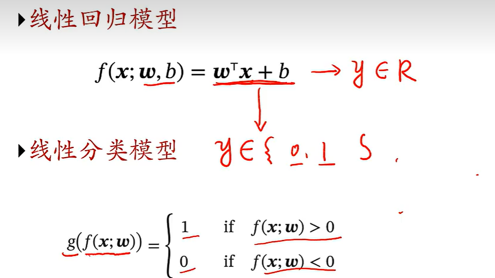

线性回归模型的输出是连续的，套上一个函数g后，就变成了一个线性分类模型


分类问题可以分为二分类问题和多分类问题


### logistic回归

1. 函数模型


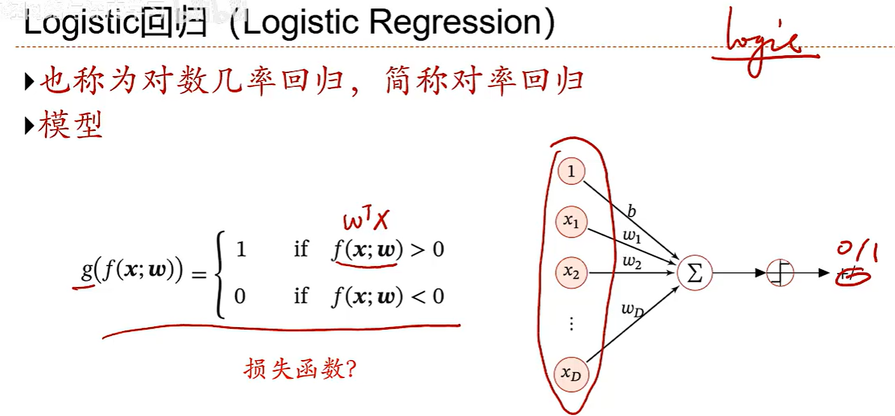

有一个线性函数，f(x,W)，一个决策函数g

<font color='red'>***这里如果g如图中所取值的话，其导数就都为0，导致无法进行梯度下降等。使用sigmoid函数即$\sigma(x)=\frac{1}{1+e^{-x}}$，可以解决这个问题：***</font>

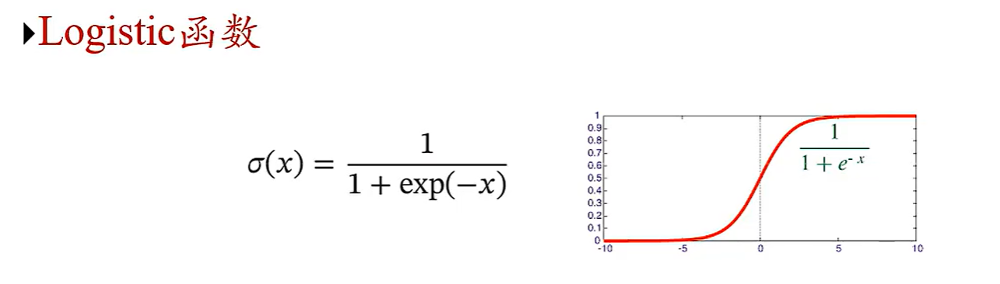

接下来以二分类问题为例子：

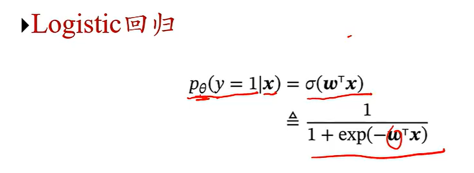

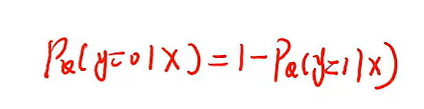

从神经元的角度理解，如果神经元被激活，则预测为第1类，否则为第0类

2. 学习准则


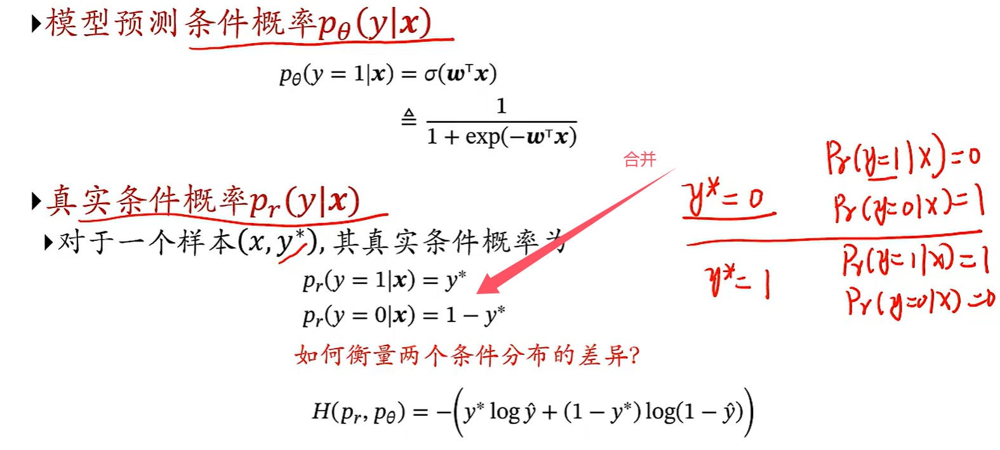

学习准测是 使得LR预测条件概率逼近真实条件概率，

上面这个合并真实套件概率公式很有意思

> 这里用交叉熵来算两个分布间的差异
>
> 即用预测分布$P_\theta$的自信息来 给真实分布$P_r$做编码，然后得到的平均编码长度


3. 梯度下降优化

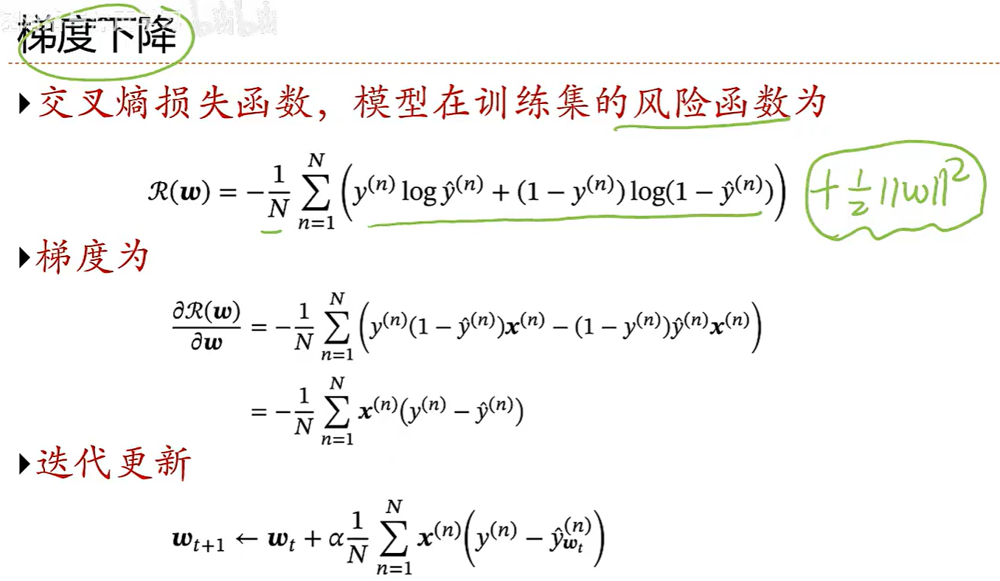


### softmax回归

> 多分类问题

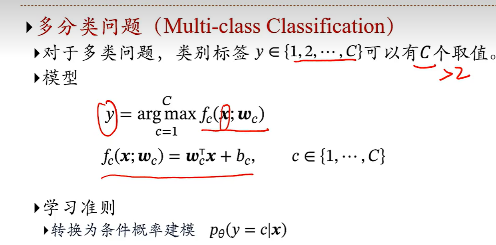

与二分类问题的不同之处在于，判别函数g用了C个，求解出是该类别归属于所有c个中的最大概率的下标

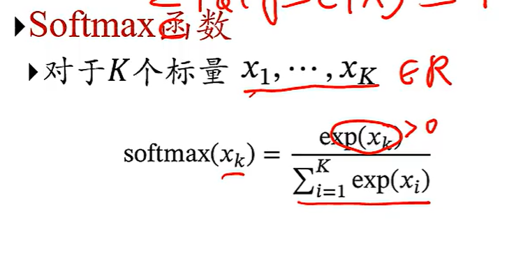


### 感知器


### 支持向量机


## 激活函数

https://blog.csdn.net/tyhj_sf/article/details/79932893

### 为什么需要激活函数

如果不用激活函数（就相当于激活函数时f(x)=x）,在这种情况下，每一层的节点都是上层输出的线性函数，

<font color='red'>容易验证，无论网络有多少层，都相当于输入的线性组合，与没有隐藏层效果相当。</font>网络的逼近能力有限。


因此，需要引入非线性函数做为激活函数，这样深层神经网络的表达能力就更加强大（不再是输入的线性组合而是可以几乎逼近任意函数）


### 常见激活函数

#### sigmoid

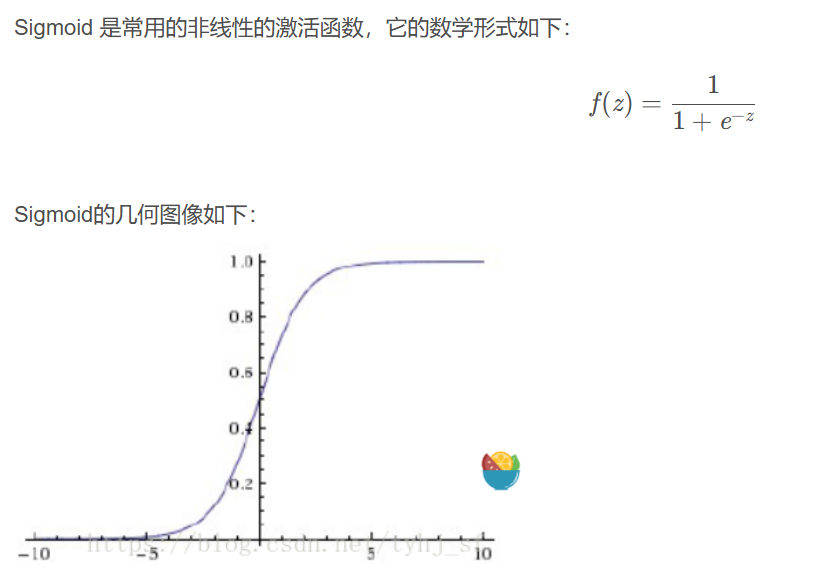

特点：

​	能够把输入的连续值转换成0和1之间的输出，如果是非常大的整数输出为1，如果是非常大的负数输出为0


缺点：

1. 在深度神经网络的梯度反向传播时<font color='red'>导致梯度爆炸和梯度消失</font>，<font color='red'>梯度消失的概率比较大</font>


sigmoid的导数图像为：

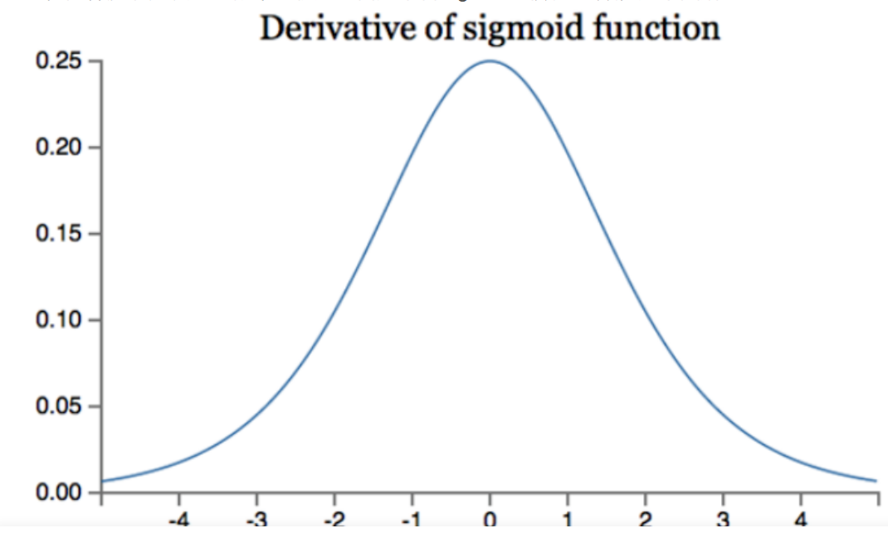


如果我们初始化神经网络的权值为 [ 0 , 1 ]之间的随机值，由反向传播算法的数学推导可知，梯度从后向前传播时，每传递一层梯度值都会减小为原来的0.25倍，如果神经网络隐层特别多，那么梯度在穿过多层后将变得非常小接近于0，即出现梯度消失现象；

当网络权值初始化为 ( 1 , + ∞ )区间内的值，则会出现梯度爆炸情况。

> ***直观的说就是在反向传播时，梯度会连乘，当梯度都小于1.0时，就会出现梯度消失；当梯度都大于1.0时，就会出现梯度爆炸。***

2. Sigmoid 的 <font color='red'>output 不是0均值</font>（即zero-centered）。这是不可取的，因为这会导致后一层的神经元将得到上一层输出的非0均值的信号作为输入。

   产生的一个结果就是：如x>0,f= w^Tx+bx>0, f=w^Tx+b,那么对w求局部梯度则都为正，这样在反向传播的过程中w要么都往正方向更新，要么都往负方向更新，导致有一种捆绑的效果，使得收敛缓慢。 

   当前层接收到上一层的非0均值的信号作为输入，随着网络的加深，会改变数据的原始分布；

3. 其解析式<font color='red'>含有幂运算</font>，计算机求解相对耗时

#### tanh

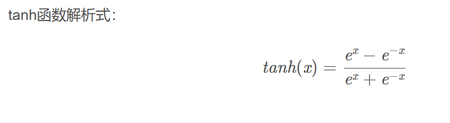

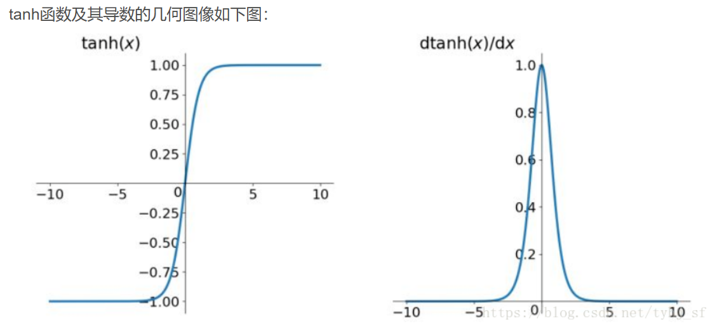


它解决了sigmoid函数的output不是0均值的问题，

但是梯度消失和幂运算的问题依然存在


#### Relu

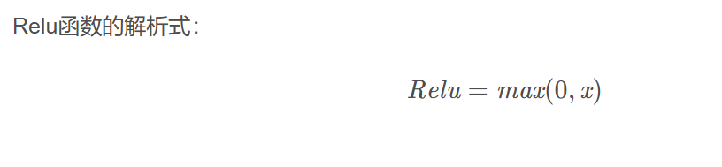

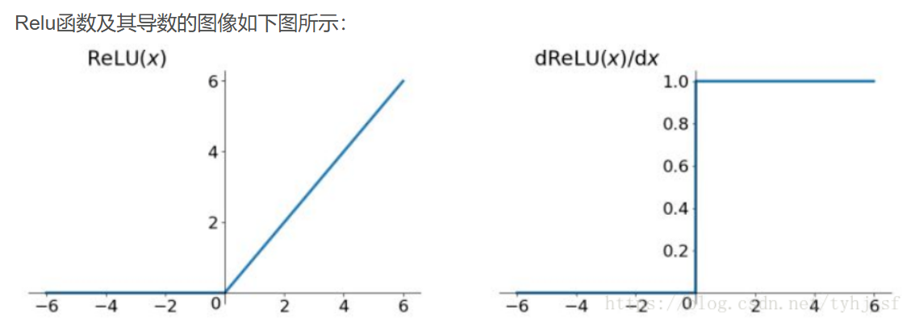


ReLU函数优点：

1.在正区间解决了 梯度消失的问题，

2. 计算速度快，只需要判断输入是否大于0

缺点：

1. ReLU的输出不是0均值的
2. Dead ReLU问题，某些神经元可能永远都不会被激活，相应的参数永远都不能被更新

​	主要有两个原因1）非常不幸的参数初始化，解决办法为使用Xavier初始化

​				2）lr太高，不幸更新参数太大，导致网络进入这种状态，解决办法为将lr设置小一点或者使用adagrad等自动调节lr的算法


> 尽管存在这两个问题，**ReLU目前仍是最常用的activation function，在搭建人工神经网络的时候推荐优先尝试！**


#### Leaky ReLU与 PReLU

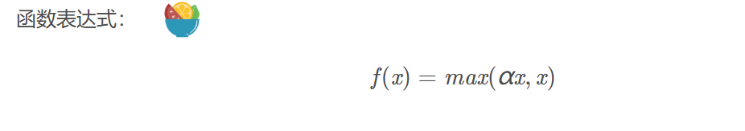

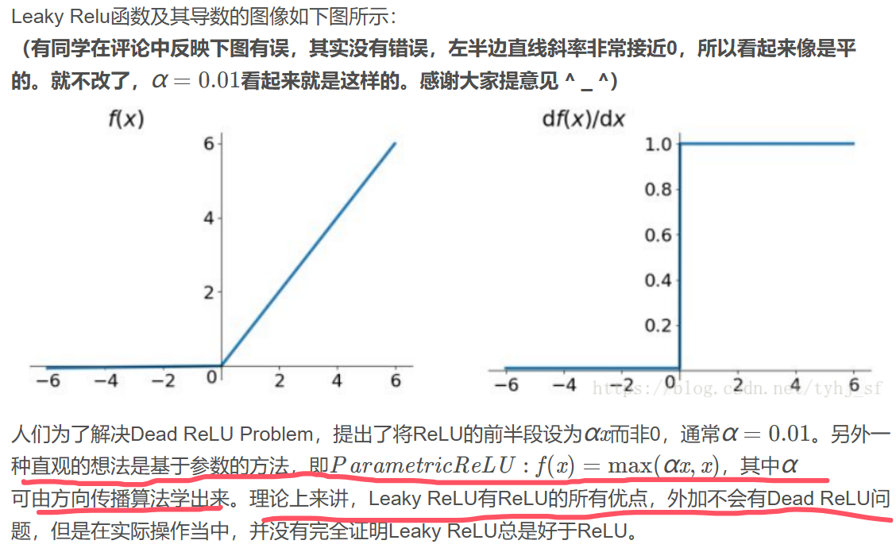


#### ELU

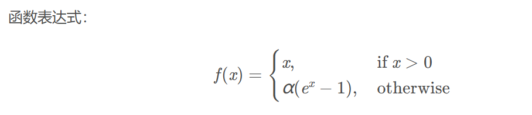


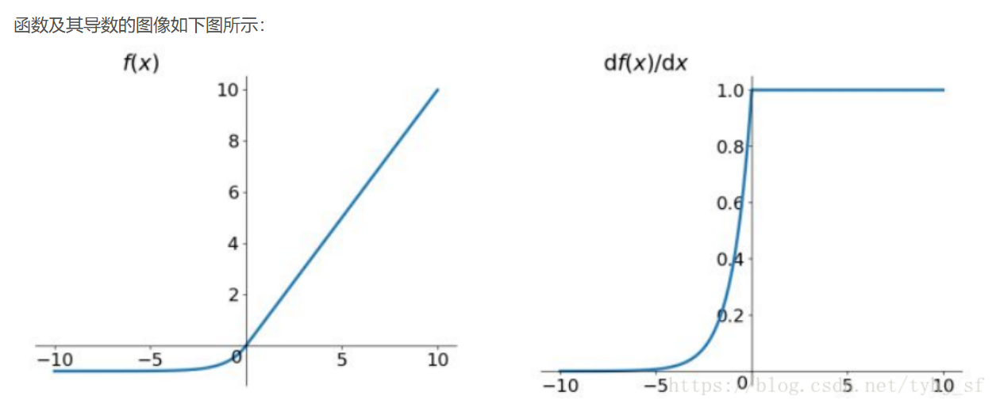

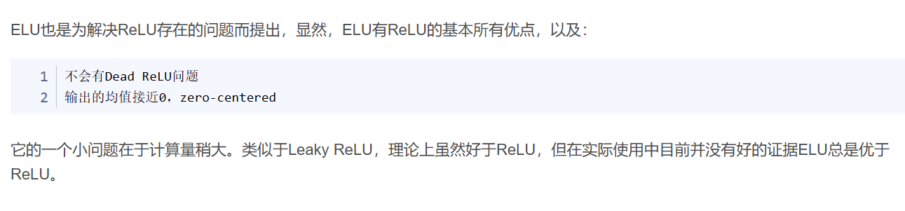

ELU 的提出也解决了 ReLU 的问题。与 ReLU 相比，ELU 有负值，这会使<font color='red'>***激活的平均值接近零***</font>，让模型学习得更快。


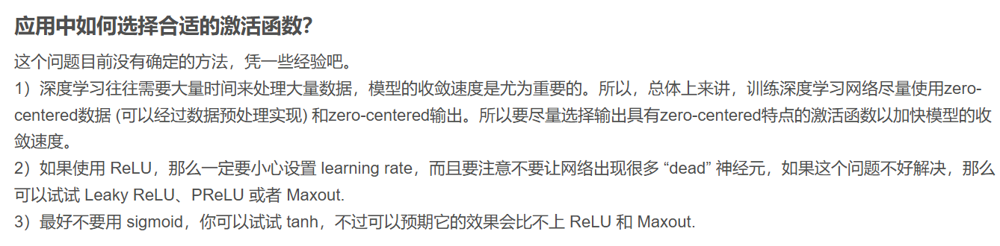

#### GLU

GLU(Gated Linear Units,门控线性单元)引入了两个不同的线性层，其中一个首先经过sigmoid函数，其结果将和另一个线性层的输出进行逐元素相乘作为最终的输出：

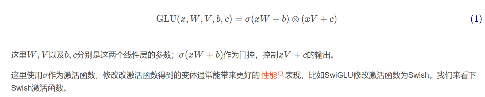


参考 ReLU 激活函数，设计另外一个包含恒等映射和置零映射的激活函数，并且参考 ReLU 函数来看，新激活函数应该有如下性质：

1. 在输入 `x` 满足某些条件时，为恒等映射；
2. 在输入 `x` 满足另外一些条件时，为置零映射；
3. 在输入 `x` 是一个较大的正值时，更希望为恒等映射；在输入 `x` 为一个较小的负值时，更希望是一个置零映射；

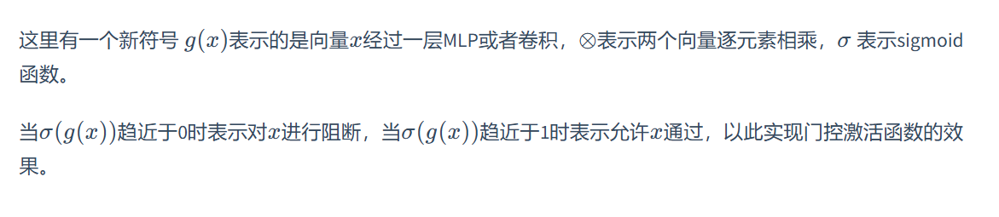


#### Swish

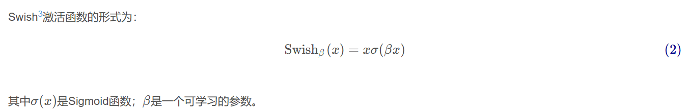


Swish可以比ReLU激活函数更好，因为它在0附近提供了更平滑的转换，这可以带来更好的优化。


#### SwiGLU / SiLU

LLAMA模型引入的关于激活函数的改进——SwiGLU，该激活函数取得了不错的效果，得到了广泛地应用。

SwiGLU是GLU的一种变体，其中包含了GLU和Swish激活函数


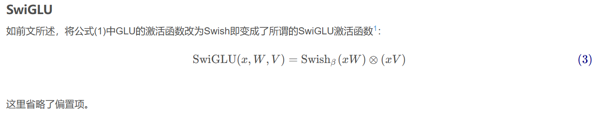

我们说SwiGLU是两者的结合。<font color='red'>***它是一个GLU，但不是将sigmoid作为激活函数，而是使用 ß=1的swish***</font>


在 PyTorch 中，SiLU 激活函数可以通过 `torch.nn.SiLU` 或 `torch.nn.functional.silu` 实现

```python
import torch
import torch.nn as nn
 
# 创建 SiLU 激活函数
silu = nn.SiLU()
 
# 创建一个示例输入张量
input_tensor = torch.tensor([-2.0, -1.0, 0.0, 1.0, 2.0])
 
# 应用 SiLU 激活函数
output_tensor = silu(input_tensor)
 
print("输入张量:", input_tensor)
print("输出张量:", output_tensor)
```


```python
import torch
import torch.nn.functional as F
 
# 创建一个示例输入张量
input_tensor = torch.tensor([-2.0, -1.0, 0.0, 1.0, 2.0])
 
# 应用 SiLU 激活函数
output_tensor = F.silu(input_tensor)
 
print("输入张量:", input_tensor)
print("输出张量:", output_tensor)
```


```python
# pytorch实现
class SiLU(nn.Module):
    @staticmethod
    def forward(x):
        return x * torch.sigmoid(x)
# 实际中使用
class FeedForward(nn.Module):
    def __init__(self, dim: int, hidden_dim: int, multiple_of: int, dropout: float):
        super().__init__()
        if hidden_dim is None:
            hidden_dim = 4 * dim
            hidden_dim = int(2 * hidden_dim / 3)
            hidden_dim = multiple_of * ((hidden_dim + multiple_of - 1) // multiple_of)
        self.w1 = nn.Linear(dim, hidden_dim, bias=False)
        self.w2 = nn.Linear(hidden_dim, dim, bias=False)
        self.w3 = nn.Linear(dim, hidden_dim, bias=False)
        self.dropout = nn.Dropout(dropout)

    def forward(self, x):
        return self.dropout(self.w2(F.silu(self.w1(x)) * self.w3(x)))
```


