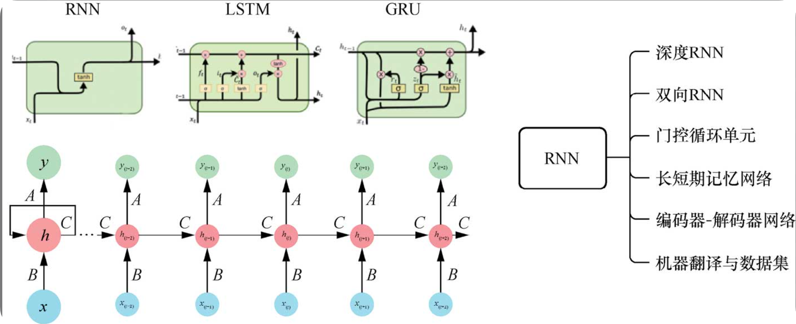

## 1 欢迎深度学习

### 1.1 什么是深度学习

深度学习的核心是 深 ， 即将神经网络的隐藏层加深

浅层神经网络-只有一层隐藏层，类似于人的条件反射？

深度神经网络，则相当于深思熟虑以后再做出反应

**全局逼近定理**

​	一个**多隐藏层**神经网络能以**任意精度逼近**给定的**任意连续函数**

**函数映射变换**

左侧正方形网格表示 输入空间，

右侧扭曲网格代表 高维空间，

原本线性独立的网格 被映射成 复杂的曲面， 代表 神经网络通过权重和激活函数的调整进行的**非线性变换**。

$S_k$表示输入层元素或者特征向量的分量。$ξ_k$是映射后的空间中与$S_k$相对应的点。

**叠加简单函数逼近复杂函数**

不同高度的矩形条被用来构造出一条近似的曲线。这些矩形条可以看作激活函数的加权输出，神经网络通过调整权重hn（矩形的宽度和高度）来最小化预测和实际输出之间的差异。

全局逼近定理的重要性在于，它为使用神经网络来解决各种各样的**非线性和高维问题**提供了理论基础，证明了其在各种领域应用的可能性。然而，定理本身并不保证找到这样的近似解是容易的，也不保证学习过程的**效率和收敛性**，这些都是实际应用中的挑战

深度神经网络强大的本质还在于，它能**通过隐藏层神经元的非线性空间变换**，**使**原本**非线性不易区分的数据**在新的特征空间中**变为线性可区分**。

左侧的平面上有两条曲线（蓝色和红色），代表二维空间中的两类数据分布。它们在原始特征空间中是不可区分的，但通过一系列变换被映射到新的特征空间后，两种颜色的数据分布可以通过一个超平面来分隔。而实现这种变换的秘诀就在于激活函数（如Sigmoid函数）的使用

### 1.2 主要核心模型

主流的模型包括三类：卷积神经网络、循环神经网络和注意力神经网络。这三类模型各有特点，分别完成不同的任务。

**卷积神经网络**

卷积神经网络(convolution neural network, CNN)是人脸识别、自动驾驶汽车等大多数计算机视觉应用的支柱。

2012年，多伦多大学研究人员在著名的ImageNet挑战赛中使用基于CNN的模型(AlexNet)，以16.4%的错误率获胜，受到学术界和业界的关注，由此引发了人工智能(AI)新的热潮。

**循环神经网络**

如同CNN专门用于处理图像这种二维数据信息，循环神经网络(recurrent neural network, RNN)是用于处理序列信息（比如股票价格、声音序列、文字序列等）的

 **注意力机制**

2014年，注意力机制(attention mechanism, AM)首次应用于时间序列数据分析，引发了人们对其在序列处理上应用的广泛兴趣。2017年，“Attention Is All You Need”这篇具有里程碑意义的论文发布，标志着自注意力机制的兴起，伴随而来的是Transformer模型的诞生。该模型迅速在深度学习领域确立了其领先地位，并激励了一系列后续模型的开发。2022年年末，基于注意力机制的Transformer网络衍生出广受欢迎的ChatGPT。在第9章中，我们将深入探讨注意力机制的原理、自注意力机制、多头注意力等核心概念，并指导读者构建自己的Transformer网络

 **深度生成模型**

从CNN到RNN，再到Attention，都是深度学习核心的网络结构和入门必备的基础。接下来，我们将介绍深度学习的进阶内容“深度生成模型”。如果说前面三大类基础模型是组件，深度生成模型就是它们的组合体

从蒙特卡洛方法和变分推断，到变分自编码器(VAE)、卷积生成网络、生成对抗网络(GAN)，再到最新的扩散模型，

### 研究领域

从技术角度出发，深度学习主要应用于**计算机视觉、语音技术以及自然语言处理**等核心领域。

计算机视觉涉及图像和视频的识别、分类与处理；

语音技术则关注于对人类语音信号的识别和生成；

自然语言处理使计算机能够理解和生成人类语言。这些**技术的结合推动了多模态融合**的发展，并在各个行业得到了应用。

在**计算机视觉**领域，所处理的对象包括**图像和视频**。该领域的**基础应用已经相当成熟**，涉及**文字识别、人脸识别和物体识别**等，如图1-8所示

**语音技术**

**深度学习在语音方面的应用也早已非常成熟**，具体包含两个方面：**自动语音识别(ASR)和文本语音转换(TTS)**。微信里的语音转文本功能就是ASR的应用方向。手机语音助手和智能音箱之所以能“听懂”你说的话，也是借助ASR。大家平时刷短视频时总能听到一些熟悉的语音，基本上都是利用TTS自动生成的。

**自然语言处理**

在**自然语言处理**(natural language processing, NLP)领域，最常用也最成熟的应用是**机器翻译**。

此外，想必大家都用过**ChatGPT**，如图1-10(a)所示。作为一个大语言模型，它总能正确理解用户的意图，并生成相关的文字，让人大呼有趣。这些进步都源于其背后的深度学习算法，特别是NLP算法的提升

**知识图谱**也是NLP领域的研究重点之一，如图1-10(b)所示。它是一种描述知识的语义网络，用于表示真实世界中存在的各种实体和概念以及它们之间的关系

**多模态融合**

无论计算机视觉、语音技术，还是自然语言处理，这些技术往往不是孤立应用的。比如，“**虚拟主播**”应用会同时用到视觉、语音以及自然语言处理技术

• 主播的形象生成、表情变化、口型和手势变化依靠视觉技术；

• 播报内容的生成依靠自然语言处理技术；

• 倾听用户发言和播报内容则依靠语音技术

除了上述研究领域，深度学习的行业应用就更多了。

在**自动驾驶**中，深度学习可以帮助汽车识别路况、道路、行人、其他车辆等，避开障碍物并进行决策。

在**生物信息学**领域，深度学习可以用于基因组学分析、蛋白质结构预测，以及其他任务。

**医学诊断**也是一个重要的应用领域，在该领域，深度学习可以帮助医生诊断疾病，快速分析CT、MRI等医学影像，提供建议的治疗方案并进行预测。

在**金融预测**领域，深度学习可以帮助金融机构预测股市走势，决定投资策略并进行风险评估。

在**推荐系统**领域，深度学习能够帮助网站或应用推荐内容、商品等。现在几乎每个电商网站的推荐系统都使用了深度学习技术，根据用户的历史行为、兴趣等向用户推荐相关的内容。

深度学习在农业中用于作物识别和作物产量预测，在天文学中进行星系形态分类和距离预测，在地球科学领域执行地震预测、气候模拟和地质勘探等任务。

### 1.4 技术栈

**编程语言**

​	Python排名仍然位列第一。除了代码简洁优雅，主要是因为Python的生态良好，有强大的自带标准库和大量的第三方支持库，比如对科学计算以及深度学习框架（像耳熟能详的TensorFlow、PyTorch等）都有着良好的支持。

**深度学习框架**

​	流行的深度学习框架包括**谷歌的TensorFlow**、**Meta的PyTorch**以及**百度研发的飞桨(PaddlePaddle)**等。高度可定制性和可扩展性使它们成为当前广受欢迎的框架。几年之前，流行的框架当属TensorFlow，不过PyTorch在近几年实现了全方位的超越。在开源库Hugging Face上，85%的模型只能在PyTorch上使用。

数据集

代码编辑器 jupyter、pycharm、vscode

