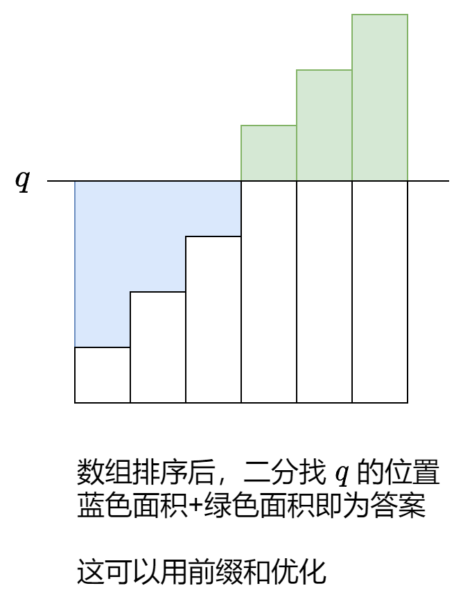

## 总纲


>我学习了很多常见算法如 二分、回溯、分治、贪心、动态规划、排序、哈希以及常见数据结构及算法如 栈、堆、树、图等
>
>
>
>我觉得目前所有的算法无非就是
>
>
>
>​	所有算法——无论是 DP、贪心、图论、搜索、还是流算法——在某种层面上确实都可以看作“**高效枚举**”或“**巧妙分治**”的不同体现。


**暴力枚举**：暴力读取所有可能

**搜索 / 剪枝**：减少重复枚举

**贪心**：局部最优 → 全局近似

**分治**：拆解问题 + 合并结果

**动态规划**：复用已知信息，系统化枚举

**随机化 / 概率**：用概率减少枚举量


## 枚举

### 双变量 枚举右 维护左

​	对于 **双变量问题**，例如两数之和 $a_i+a_j=t$，可以枚举右边的 $a_j$，转换成 **单变量问题**，也就是在 $a_j$ 左边查找是否有 $a_i = t-a_j$，这可以用哈希表维护。
我把这个技巧叫做 **枚举右，维护左**。

​	

[1. 两数之和 - 力扣（LeetCode）](https://leetcode.cn/problems/two-sum/description/)

```python
class Solution:
    def twoSum(self, nums: List[int], target: int) -> List[int]:

        st = dict()
        for j in range(len(nums)):

            i = st.get(target-nums[j], -1)
            if i!=-1:
                return [i,j]

            st[nums[j] ]= j
        return [-1,-1]
```

### 多变量 枚举中间

​	对于三个 或 四个变量的问题， 枚举中间的变量往往更好算

[2909. 元素和最小的山形三元组 II](https://leetcode.cn/problems/minimum-sum-of-mountain-triplets-ii/)

```python
class Solution:
    def minimumSum(self, nums: List[int]) -> int:
        # 对每个位置j，需要其左右最小元素
        # 然后计算各个位置j的最小元素和即可
        n = len(nums)
        pre, suf = [0] * n, [0] * n 
        
        pre_min = nums[0]
        for i in range(1,n):
            pre[i]=pre_min
            pre_min = pre_min if pre_min < nums[i] else nums[i]

        suf_min = nums[n-1]
        for j in range(n-2,-1,-1):
            suf[j] = suf_min
            suf_min = suf_min if suf_min < nums[j] else nums[j]
        # print(pre)
        # print(suf)
        res = -1
        for t in range(1,n-1):
            if nums[t] > pre[t] and  nums[t] > suf[t]:
                tmp = pre[t] + nums[t] + suf[t] 
                res = tmp if res == -1 or res > tmp else res 
        return res
```

​     

## 前缀和、差分

### 基本前缀和


**左闭右开公式**：下标为左闭右开区间 $[\textit{left},\textit{right})$ 的元素和就是 $\textit{sum}[\textit{right}] - \textit{sum}[\textit{left}]$。

[303. 区域和检索 - 数组不可变](https://leetcode.cn/problems/range-sum-query-immutable/)

```python
class NumArray:

    def __init__(self, nums: List[int]):
        self.s = list( accumulate(nums, initial=0) )
        # 注意加了 initial后，从initial开始
        # [initial, initail+nums[0], initial+nums[1], ...]
        # [l,r]的元素和 也从 s[r]-s[l-1] 变成 s[r+1]-s[l]
		# 从而避免[0,r]的特判
        
    def sumRange(self, left: int, right: int) -> int:
        return self.s[right+1]-self.s[left]


```


### 前缀和与哈希

[560. 和为 K 的子数组](https://leetcode.cn/problems/subarray-sum-equals-k/)

```python
class Solution:
    def subarraySum(self, nums: List[int], k: int) -> int:
        # 由 多个 子数组的和 可以联想到前缀和
        # 此外，假设nums[i, j]的和为k， 
        # 枚举j， 则有 pre[j]-pre[i-1] = k
        # 也就是对于枚举的j，看其左侧是否存在 pre[i-1] 使得上式成立
        # 时间复杂度应为 n*2，可以通过
        # 进一步的，借鉴 两数之和的思路，则变为在左侧哈希表中寻找 pre[j]-k
        # 则时间复杂度变为 n

        pre = list( accumulate(nums, initial=0 ))
        st = dict()
        res = 0

        # 0本身应该需要放进去，用于从0开始的子数组和
        st[pre[0] ] = 1

        for j in range(len(nums)): 
            if pre[j+1]-k in st:
                res += st[ pre[j+1]-k ]
            
            st[pre[j+1]] = st.get(pre[j+1], 0) +1
        return res
```


### 距离和


*[2602. 使数组元素全部相等的最少操作次数](https://leetcode.cn/problems/minimum-operations-to-make-all-array-elements-equal/)

```python
import bisect

# Sorted list
a = [1, 3, 4, 4, 4, 6, 7]

# Find the leftmost position to insert 4
position = bisect.bisect_left(a, 4)
print(position) # Output: 2
```





```python
class Solution:


    def minOperations(self, nums: List[int], queries: List[int]) -> List[int]:

        res = []
        nums = sorted(nums)
        pre = list( accumulate(nums, initial=0))
        for q in queries:

            pos = bisect.bisect_left(nums, q)

            lef = q*pos - pre[pos]
            rig = pre[len(nums)] - pre[pos] - q*(len(nums)-pos)
            res.append(lef+rig)
        return res

```


[1685. 有序数组中差绝对值之和](https://leetcode.cn/problems/sum-of-absolute-differences-in-a-sorted-array/)

```python
class Solution:
    def getSumAbsoluteDifferences(self, nums: List[int]) -> List[int]:
        """
            1e5所以复杂度至少 n^2肯定不行

            对于每个元素i，都需要跟其他所有元素计算下绝对值差。那这样肯定是 n^2
            能否前缀和？或者是说用 整个元素组和 - 元素i*元素数组长度呢?不能，因为是绝对值， 发现位于元素i左侧的，应该是元素i-左侧元素， 右侧则为 -元素i
            而这样的左右两侧的和，恰好能用前缀和得到
            这样 on 即可解决
        """ 

        res = []
        pre = list(accumulate(nums,initial=0)) #i+1代表i
        for i,tmp in enumerate(nums):
            lef = tmp*i - pre[i]
            rig = pre[len(nums)]-pre[i+1] - tmp * (len(nums)-1-i)
            res.append(lef+rig)
        return  res

```


