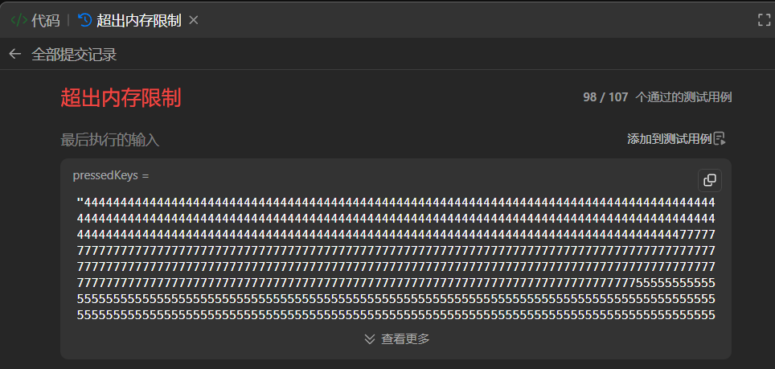
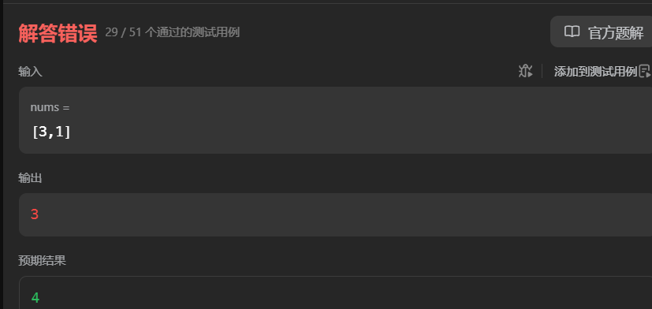
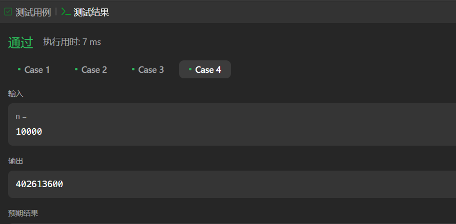
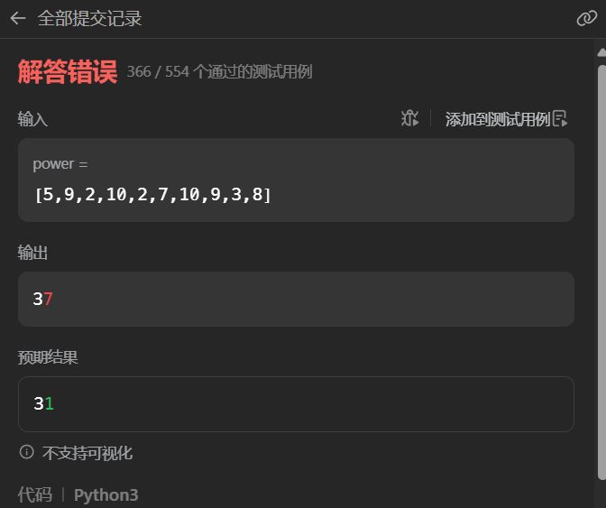
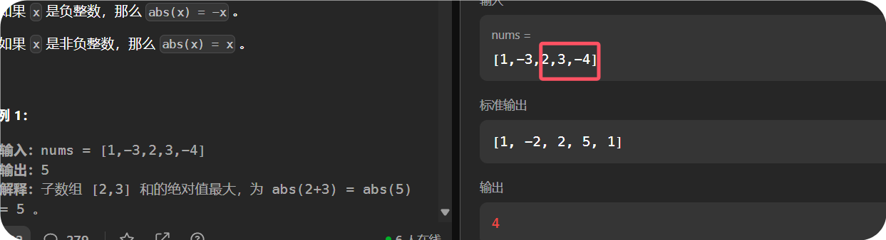

> 此时对动态规划很感兴趣，基于两点
>
> 1. 子问题分解非常神奇，并且由于转到python，一个@cache即可从dfs变为dp
> 2. dp非常非常强大，可以解决很多很多问题


dp我的理解为一种遍历复杂问题的手段，所有的优化都将基于这个来做。


所做题目基于0x3f的动态规划的题单https://leetcode.cn/circle/discuss/tXLS3i/


## 1.入门dp

### 1.1 爬楼梯

#### [70. 爬楼梯](https://leetcode.cn/problems/climbing-stairs/)

```python
class Solution:
    def climbStairs(self, n: int) -> int:
        """
            dp[i]表示爬到第i阶的方法数
                可知 dp[i]=   dp[i-1] + dp[i-2]
                终止条件: dp[1]=1 dp[2]=2
        """

        @cache
        # 由于dp[3]需要 dp[1]、dp[2]更新  而dp[4]同时会需要dp[2]更新
        def dfs(i):
            if i==1:
                return 1
            elif i==2:
                return 2 
            
            return dfs(i-1)+dfs(i-2)
        
        return dfs(n)
```


#### [746. 使用最小花费爬楼梯](https://leetcode.cn/problems/min-cost-climbing-stairs/)

```python
class Solution:
    def minCostClimbingStairs(self, cost: List[int]) -> int:
        """
            di表示爬到第i层的最低花费
            ·   则有 di =  min(di-1 + ci-1 ,  di-2 ci-2 )

        """

        @cache 
        def dfs(i):
            #下标从0开始
            if i==0 or i==1:
                return 0
            
            return min(dfs(i-1)+cost[i-1],dfs(i-2)+cost[i-2])

        return dfs(len(cost))
```


#### [377. 组合总和 Ⅳ](https://leetcode.cn/problems/combination-sum-iv/)

首先考虑了用选或不选来做，但是对于组合情况 [1,2,1]而言，显然如果一个一个选或不选就会导致选了2之后没办法选1 

```python
class Solution:
    def combinationSum4(self, nums: List[int], target: int) -> int:


        @cache
        def dfs(target):
            # 总和为tar的元素组合的个数

            if target<0:#状态非法
                return 0
            elif target==0: # 表示状态正常
                return 1
            ans =0 
            for ni in nums:
                if ni<=target:
                   ans += dfs(target-ni)

            return ans 
            
        return dfs(target)
```


最后采用类似爬楼梯的思想， 第i层可以（将nums中这么多个数字看作爬楼梯的高度）由i-高度 的楼梯状态得到


思考这个题[39. 组合总和](https://leetcode.cn/problems/combination-sum/)  该题可以一个一个枚举的关键在于题目要求的顺序无关


进阶问题
问：如果给定的数组中含有负数会发生什么？问题会产生何种变化？如果允许负数出现，需要向题目中添加哪些限制条件？

答：负数可能会导致有无穷个方案。例如 nums=[1,−1]，要组成 1，只要选的个 1 的个数比 −1 多一个，就可以满足要求，这有无穷种选法。为了不让答案为无穷大，可以限制负数的选择个数上限。

#### [2466. 统计构造好字符串的方案数](https://leetcode.cn/problems/count-ways-to-build-good-strings/)

```python
class Solution:
    def countGoodStrings(self, low: int, high: int, zero: int, one: int) -> int:
        """
            di代表长度为i的不同好字符串的数目
                di显然 只能由 di-one 和 di-zero 转移过来
                即 di = dio + diz

问：为什么要把每个 dfs(i) 都算一遍？能不能只算一次 dfs(high)，然后累加 memo 数组中的计算结果？
答：这是不对的。比如 zero=one=2，这种写法不会递归到 i=high−1 这个状态，memo[high−1] 仍然是其初始值 −1。

问：那我不累加 memo[i]=−1 的结果可以吗？
答：仍然不行。比如 zero=one=2 且 high=5，我们可以得到长为 2 和 4 的字符串，但这些答案并不能从 dfs(5) 中算出来。
        """
        MOD = 1_000_000_007
        @cache
        def dfs(i)-> int:
            if i<0:
                return 0
            if i==0:
                return 1 #状态合法
            return (dfs(i-one) + dfs(i-zero)) % MOD

        return sum([dfs(i) for i in range(low,high+1)]) % MOD
       
```


#### *[2266. 统计打字方案数](https://leetcode.cn/problems/count-number-of-texts/)

最开始写了如下错误代码

```python
class Solution:
    def countTexts(self, pressedKeys: str) -> int:
        """
            对于22233而言
                记ds 为s的发出的文字信息的种类数
                d(22233) = d(2223) + d(222)
        """
        MOD = 1_000_000_007
        @cache
        def dfs(s)->int:
            if len(s)==0:
                return 1 #至此算是一种

            ans = 0
            ans =( ans + dfs(s[:len(s)-1]) ) % MOD
            for i in range(len(s)-3,-2,-1):
                if s[i]!=s[i+1]:
                    break
                ans =(ans +  dfs(s[:i+1]) ) % MOD

            return ans % MOD
        return dfs(pressedKeys)
```

问题在于并没有根据实际情况， 比如 2222 ，对于此样例， d(2222)不可能由d("")得到，因为 2按键获取一个字符最多按3次，分别对应3中不同字母


下面是改进过后的正确代码，然后超出了内存限制

是频繁的对字符串切片的问题

> 在 Python 中，字符串是不可变数据类型。
>
> 因此，当你对字符串进行切片操作时，Python 会创建一个新的字符串对象，而不是在原字符串的基础上进行修改



```python
class Solution:
    def countTexts(self, pressedKeys: str) -> int:
        """
            对于22233而言
                记ds 为s的发出的文字信息的种类数
                d(22233) = d(2223) + d(222)
        """
        MOD = 1_000_000_007
        @cache
        def dfs(s)->int:
            if len(s)==0:
                return 1 #至此算是一种

            ans = 0
            
            k=3
            if s[len(s)-1]=='7'or s[len(s)-1]=='9':
                k=4

            ans =( ans + dfs(s[:len(s)-1]) ) % MOD

            for i in range(len(s)-2,max(-1,len(s)-1-k),-1):
                if s[i]!=s[i+1]:
                    break
                ans =(ans +  dfs(s[:i]) ) % MOD


            return ans % MOD
        return dfs(pressedKeys)
```


最后的最后，改成下面用左边的方法通过了

请注意，边界处理耗费了大量事时间，最后还是枚举k比较舒服。。

```python
class Solution:
    def countTexts(self, pressedKeys: str) -> int:
        """
            对于22233而言
                记ds 为s的发出的文字信息的种类数
                d(22233) = d(2223) + d(222)
        """
        MOD = 1_000_000_007
        @cache
        def dfs(s,idx)->int:
            if idx==-1:
                return 1 #至此算是一种

            ans = 0
            
            k=3
            if s[idx]=='7'or s[idx]=='9':
                k=4

            for i in range(k):
                if idx-i < 0 :
                    break
                if s[idx-i] != s[idx]:
                    break
                ans =( ans + dfs(s,idx-i-1) ) % MOD
                

            return ans % MOD
        return dfs(pressedKeys,len(pressedKeys)-1)
```


### 1.2 打家劫舍

#### [198. 打家劫舍](https://leetcode.cn/problems/house-robber/)

```python
class Solution:
    def rob(self, nums: List[int]) -> int:
        

        @cache
        def dfs(i, preflag)->int:
            """
                偷到第i家， 第i-1家 是否偷的标志为 preflag
                return 考虑完第i家后，不触动警报能得到的最高金额
            """
            if i>=len(nums):
                return 0

            if preflag:
                return dfs(i+1,False)
            return max(dfs(i+1,True)+nums[i], dfs(i+1,False))
        return dfs(0,False)

        
```


可以不用状态记录，因为如果不偷的话，直接dfs到i+2就行

```python
class Solution:
    def rob(self, nums: List[int]) -> int:
        

        @cache
        def dfs(i)->int:
            """
                偷到第i家
                return 考虑完第i家后，不触动警报能得到的最高金额
            """
            if i>=len(nums):
                return 0
            return max(dfs(i+2)+nums[i], dfs(i+1))
        return dfs(0)
```


#### *[740. 删除并获得点数](https://leetcode.cn/problems/delete-and-earn/)


最开始写了下面的错误代码

```python
class Solution:
    def deleteAndEarn(self, nums: List[int]) -> int:
        """
            排序后 类似于 打家劫舍模型
            但是每次不是后移一位，而是下一个不同的数字

            同种数字又可以综合
            例如：
                2 2 3 3 3 4
            ->  4   9   4
                完全转变成打家劫舍问题

        """

        nums = sorted(nums) #先排序
        arr = [nums[0]]
        for i in range(1,len(nums)):
            if nums[i] != nums[i-1]:
                arr.append(nums[i])
            else:
                arr[-1]+=nums[i]
        # print(arr)

        @cache
        def dfs(i)->int:
            # 打家劫舍 从后向前考虑
            if i<0:
                return 0

            return max(   
                dfs(i-2)+arr[i], #劫第i家
                dfs(i-1),#不劫第i家
            )
        return dfs(len(arr)-1)
```


这里错在没有考虑连续性问题




```python
class Solution:
    def deleteAndEarn(self, nums: List[int]) -> int:
        """
            排序后 类似于 打家劫舍模型
            但是每次不是后移一位，而是下一个不同的数字

            同种数字又可以综合
            例如：
                2 2 3 3 3 4
            ->  4   9   4
                完全转变成打家劫舍问题

            未考虑连续性问题，插入一个0即可
        """

        nums = sorted(nums) #先排序
        arr = [nums[0]]
        for i in range(1,len(nums)):
            if nums[i] != nums[i-1]:
                #这里如果两者不连续，那么是可以同时选择的
                if nums[i]!= nums[i-1]+1:
                    arr.append(0) #加个0 将两者隔开，两者可以同时选择
                arr.append(nums[i])
            else:
                arr[-1]+=nums[i]
        # print(arr)

        @cache
        def dfs(i)->int:
            # 打家劫舍 从后向前考虑
            if i<0:
                return 0

            return max(   
                dfs(i-2)+arr[i], #劫第i家
                dfs(i-1),#不劫第i家
            )
        return dfs(len(arr)-1)
```


0x3f的解法

简单在 直接将nums转换成了一个值域数组


```python
class Solution:
    # 198. 打家劫舍
    def rob(self, nums: List[int]) -> int:
        f0 = f1 = 0
        for x in nums:
            f0, f1 = f1, max(f1, f0 + x)
        return f1

    def deleteAndEarn(self, nums: List[int]) -> int:
        a = [0] * (max(nums) + 1)
        for x in nums:
            a[x] += x  # 统计等于 x 的元素之和
        return self.rob(a)
```


#### [2320. 统计放置房子的方式数](https://leetcode.cn/problems/count-number-of-ways-to-place-houses/)

```python
class Solution:
    def countHousePlacements(self, n: int) -> int:
        """
            两侧各不相关 ， 似乎可以考虑为只算一侧，然后两者相乘
                + - * 满足模运算规律
                    ( a*b )mod n = (a mod n) * (b mod n)
                似乎可行 试一试

            单独一侧，又变成了不相邻问题，不过是统计方案数
        """
        MOD = 1_000_000_007
        @cache
        def dfs(i) -> int:
            #从后往前考虑， 考虑到第i个屋子，
            # return 方式数
            if i==1:
                return 2
            if i==2:
                return 3
            return (dfs(i-2) + dfs(i-1)) % MOD

        return (dfs(n) * dfs(n))%MOD
```


发现了 测试用例可以直接输入 n=10000来测试是否能通过




#### [213. 打家劫舍 II](https://leetcode.cn/problems/house-robber-ii/) 

```python
class Solution:
    def rob(self, nums: List[int]) -> int:
        """
            痛点在于第一个和最后一个是挨着的
                直接枚举第一个偷不偷
                    偷第一个 则第2、n个一定不能偷，变成打家劫舍一子问题3-n-1
                    不偷第一个，则变成打家劫舍一子问题2-n
        """

        @cache
        def dfs(i,n) -> int:
            #打家劫舍一
            if i > n:
                return 0
            return max(dfs(i+2,n)+nums[i], dfs(i+1,n))

        return max(
            #不偷第一个
            dfs(1,len(nums)-1),
            #偷第一个
            nums[0]+dfs(2,len(nums)-1-1)
        )
```


#### *[3186. 施咒的最大总伤害](https://leetcode.cn/problems/maximum-total-damage-with-spell-casting/)


与[740. 删除并获得点数](https://leetcode.cn/problems/delete-and-earn/)有些相似

先写了如下的错误代码

```python
class Solution:
    def maximumTotalDamage(self, power: List[int]) -> int:
        """
            首先排序，
            然后将相同伤害值合并，
                这里需要注意，当伤害值之差大于2的情况下两者是可以同时选择的，
                    选择插入0
                最终演变成经典打家劫舍问题
        """

        power = sorted(power)
        arr = [power[0]]
        for i in range(1,len(power)):
            if power[i]==power[i-1]:
                arr[-1]+=power[i]
            else:
                if power[i] > power[i-1]+2:
                    arr.append(0)
                    arr.append(power[i])
                else:
                    arr.append(power[i])
        
        @cache
        def rob(i):
            if i>= len(arr):
                return 0
            return max(
                rob(i+1),
                rob(i+2)+arr[i]
            )
        return rob(0)
```




对于上述测试用例

sort后应该是 2 2 3 5 7 8 9 9 10 10

经过预处理后应变成 4 3 5 7 8 18 20

打家劫舍最大值可得 20+8+5+4=37

预期值却是31

> 问题出在， 用了比如说8  那么9和10都不能选择，上边并未体现出来


正确代码如下：

```python
class Solution:
    def maximumTotalDamage(self, power: List[int]) -> int:

        cnt = Counter(power)
        arr = sorted(cnt.keys())
        
        @cache
        def rob(i):
            
            if i>= len(arr):
                return 0
            
            #不选第i个
            ans1 = rob(i+1)
            #选第i个
            #则需要找到j arr[j]是>arr[i]+2的最小的j
            # j=i+1 
            # while j < len(arr) and arr[j]<=arr[i]+2:
            #     j+=1 
            j = bisect_right(arr,arr[i]+2)
            ans2 = rob(j)+arr[i]*cnt[arr[i]]
            return max(ans1, ans2)
        return rob(0)

```


Counter继承于dict，真好用

### 1.3 最大子数组和

dp即遍历，在遍历中寻找问题性质

#### [53. 最大子数组和](https://leetcode.cn/problems/maximum-subarray/)

```python
class Solution:
    def maxSubArray(self, nums: List[int]) -> int:
        """
            存在负数，不好考虑滑动窗口

            考虑前缀和 O(n*2)

            考虑dp
                dp[i]表示 以nums[i]结尾的最大和连续子数组
                dp[i+1] == max {dp[i]+nums[i+1] , nums[i+1]}

        """
        n = len(nums)
        dp = 0
        ans = -math.inf
        for num in nums:
            dp = max(dp+num, num)

            ans = max(ans, dp)

        return ans
```


#### [2606. 找到最大开销的子字符串](https://leetcode.cn/problems/find-the-substring-with-maximum-cost/)

```python
class Solution:
    def maximumCostSubstring(self, s: str, chars: str, vals: List[int]) -> int:
        """
            所有字符都有权重
                找子字符串即转变为 从权重数组中寻找最大连续子数组
        """

        hashmap={}
        for c,v in zip(chars, vals):
            hashmap[c]=v 
        for c in range(ord('a'),ord('z')+1):
            if chr(c) not in hashmap:
                hashmap[chr(c)]=c-ord('a')+1
        

        res = 0#空字符串
        fi,fj = 0,0
        for c in s:
            fj = max(hashmap[c],  hashmap[c]+fi)
            res = max(res, fj)

            fi = fj 
        return res


```


#### *[1749. 任意子数组和的绝对值的最大值](https://leetcode.cn/problems/maximum-absolute-sum-of-any-subarray/)

先写了如下的错误代码：


```python
class Solution:
    def maxAbsoluteSum(self, nums: List[int]) -> int:
        """
            dmax统计最大连续子数组
            dmin最小连续子数组
            则绝对值最大值即为 dmax和 -dmin中较大者即可
        """

        res = 0

        dmini, dminj = 0, 0
        dmaxi, dmaxj = 0, 0

        for x in nums:
            if x >=0:
                dmaxj = max(dmaxi+x, dmaxi)
                dminj = min(dmini-x, dmini)
            else:
                dmaxj = max(dmaxi-x, dmaxi)
                dminj = min(dmini+x, dmini)
            res=max(dmaxj, -dminj)
            dmaxi, dmini = dmaxj, dminj
        return res
```

错误原因在于并没有想想清楚递推关系

1. dp相当于遍历，这里任意子数组肯定包含两端ij，这里选择固定j

2. 以j为尾， dj表示以j为尾的子数组绝对值的最大值

3. 那么dj 与 di(i<j)是否存在递推关系？

   记fi为以i为尾的最大连续子数组和

   只有当fi>0 numj>0 或者 fi<0 numj<0时， 

   ​	|fi+numj| = dj

   相反两者符合不同时，

   ​	|fi-numj| = dj 

这里离谱的一点在于 dj是由fi推出而不是 di推出， 因为不好推

又错了

```python
class Solution:
    def maxAbsoluteSum(self, nums: List[int]) -> int:
        """
            dmax统计连续子数组和的最大值
            dmin  连续子数组和的最小值
            则绝对值最大值即为 dmax和 -dmin中较大者即可
        """
        n=len(nums)
        res = 0

        f = [0]*n#连续数组和初始为0
        dj = 0
       
        for i,x in enumerate(nums):
            if (f[i]>0 and x>0) or(f[i]<0 and x<0):
                dj = abs(f[i] +x)
            else:
                dj = abs(f[i] -x)
            
            #注意处理好fi
            f[i] = max(f[i-1]+x, x) if i>0 else x

            res=max(res, dj)
        print(f)
        return res
```



错误的根源在于，这里我考量的时 |x|+|y| = |x+y|，而实际上不是这杨

```python
class Solution:
    def maxAbsoluteSum(self, nums: List[int]) -> int:
        """
            dmax统计连续子数组和的最大值
            dmin  连续子数组和的最小值
            则绝对值最大值即为 dmax和 -dmin中较大者即可
        """
        n=len(nums)

        dmax,dmin =0,0

        #求最大
        di,dj=0,0
        for x in nums:
            dj = max(x,di+x)
            dmax=max(dmax, dj)

            di=dj 

        #求最小
        di,dj=0,0
        for x in nums:
            dj = min(di+x, x)
            dmin=min(dmin, dj)

            di=dj 
        
        return max(dmax, -dmin)
```

#### *[1191. K 次串联后最大子数组之和](https://leetcode.cn/problems/k-concatenation-maximum-sum/)


如果循环k的话，那么相当于 长度为arr.length * k, 时间复杂度太大 $10^{10}$

因此寻找下可能的规律，

如果k==1，那么直接做就可以，

k==2？ 


​    
